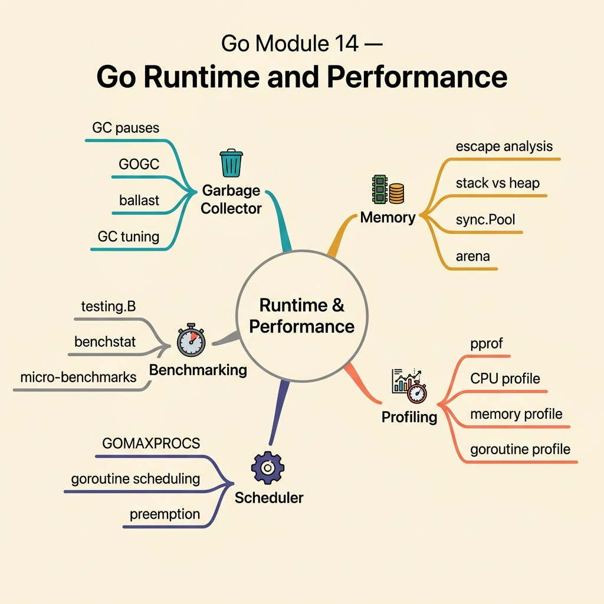

<!-- tags: golang, quiz -->
# 14 — Go Module Quiz: Go Runtime & Performance

> **Diagnostic Assessment**: Eight questions on Go's runtime internals — garbage collector, pprof profiling, escape analysis, and goroutine scheduling.

📅 Created: 2026-03-27 · 🔄 Updated: 2026-04-10 · ⏱️ 8 min read.

| Aspect | Detail |
| --- | --- |
| **Level** | Advanced |
| **Coverage** | GC tuning, pprof, escape analysis, goroutine scheduling, memory allocation |
| **Format** | 8 multiple-choice questions |

---

## 1. DEFINE

Most Go developers never touch the runtime — until a production service has 200ms GC pause spikes or a goroutine count that grows without bound. This quiz tests whether you can diagnose runtime issues using the tools Go provides.

### Assessment Boundaries

- Garbage collector: GC cycle, `GOGC`, `GOMEMLIMIT`, pause latency.
- pprof: CPU profile, heap profile, goroutine profile, flame graphs.
- Escape analysis: stack vs heap allocation, `go build -gcflags='-m'`.
- Goroutine scheduling: `GOMAXPROCS`, work stealing, preemption.
- Memory allocation: `sync.Pool`, slice pre-allocation, small object optimization.

## 2. VISUAL



```text
Runtime Performance Knowledge Map
├── Garbage Collector
│   ├── GOGC / GOMEMLIMIT
│   └── GC Pause Optimization
├── Profiling
│   ├── pprof (CPU, Heap, Goroutine)
│   └── Flame Graphs
└── Memory
    ├── Escape Analysis
    └── Allocation Optimization
```

## 3. CODE

### Example 1: Basic — Symptom-based tool selection

> **Goal**: Choose the right profiling tool based on the symptom.
> **Complexity**: Basic

```go
package runtimequiz

func PreferTrace(symptom string) bool {
	return symptom == "latency_jitter"
}
```

**Why?** `go tool trace` shows goroutine scheduling and GC pauses over time — the right tool for latency jitter. CPU profiles (`pprof`) show where CPU time is spent but miss scheduling delays.

## 4. PITFALLS

| # | Severity | Defect | Impact | Fix |
| --- | --- | --- | --- | --- |
| 1 | 🔴 Fatal | Setting `GOGC=off` without `GOMEMLIMIT` | Heap grows without bound → OOM | Always pair `GOGC=off` with `GOMEMLIMIT` |
| 2 | 🟡 Common | Using CPU profile to debug latency jitter | CPU profile misses GC pauses and scheduling delays | Use `go tool trace` for latency investigation |
| 3 | 🟡 Common | Not pre-allocating slices with known capacity | Frequent `append` causes repeated heap allocations and copies | Use `make([]T, 0, capacity)` when size is known |

## 5. REF

| Resource | Link | Note |
| --- | --- | --- |
| Go pprof | [https://pkg.go.dev/net/http/pprof](https://pkg.go.dev/net/http/pprof) | HTTP endpoints for profiling |
| Go GC Guide | [https://tip.golang.org/doc/gc-guide](https://tip.golang.org/doc/gc-guide) | GOGC, GOMEMLIMIT, GC tuning |

## 6. RECOMMEND

| Extension | When to proceed | Rationale | File/Link |
| --- | --- | --- | --- |
| Runtime Lane | If you scored < 70% | Re-read runtime docs | [../../runtime/README.md](../../runtime/README.md) |
| Runtime Incidents | After passing | Triage GC pauses and goroutine leaks | [../scenario/18-go-runtime-incidents.md](../scenario/18-go-runtime-incidents.md) |

## 7. QUIZ

### Quick Check

1. What does `GOGC=100` (the default) mean?
   - A. The GC runs every 100 milliseconds.
   - B. The GC triggers when the heap grows to 100% above the live heap size after the last collection.
   - C. The GC collects 100 objects per cycle.
   - D. The GC uses 100 MB of memory.

2. What does `GOMEMLIMIT` control?
   - A. The maximum number of goroutines.
   - B. A soft memory limit — the GC runs more aggressively as the heap approaches this limit.
   - C. The maximum stack size per goroutine.
   - D. The maximum number of open file descriptors.

3. What Go tool shows where CPU time is spent?
   - A. `go vet`.
   - B. `go tool pprof` with a CPU profile.
   - C. `go test -race`.
   - D. `go build -gcflags='-m'`.

4. What does escape analysis determine?
   - A. Whether a goroutine will leak.
   - B. Whether a variable can stay on the stack or must be allocated on the heap.
   - C. Whether a function is inlined.
   - D. Whether a type satisfies an interface.

5. When should you use `sync.Pool`?
   - A. To cache database connections.
   - B. To reuse short-lived, frequently allocated objects (e.g., buffers) and reduce GC pressure.
   - C. To synchronize goroutines.
   - D. To pool goroutines.

6. What does `go tool trace` show that `pprof` does not?
   - A. Memory allocation sizes.
   - B. Goroutine scheduling, GC pauses, and network blocking events over time — a timeline view.
   - C. Source code coverage.
   - D. Binary size breakdown.

7. Why does pre-allocating a slice with `make([]T, 0, n)` improve performance?
   - A. It skips type checking.
   - B. It allocates the backing array once, avoiding repeated grow-and-copy operations from `append`.
   - C. It enables concurrent access.
   - D. It compresses the slice data.

8. What does `GOMAXPROCS` control?
   - A. The maximum number of goroutines.
   - B. The maximum number of OS threads that can execute goroutines simultaneously.
   - C. The maximum heap size.
   - D. The maximum number of CPUs the OS can use.

### Answer Key

1. **B**. `GOGC=100` means the GC triggers when the heap doubles (100% growth). `GOGC=50` triggers at 50% growth (more frequent GC, lower memory).
2. **B**. `GOMEMLIMIT` is a soft cap. As the heap approaches this limit, the GC runs more often to keep memory under the target.
3. **B**. `pprof` CPU profiles sample the call stack at regular intervals, showing which functions consume CPU time.
4. **B**. Escape analysis decides if a variable can live on the stack (cheap, no GC) or must escape to the heap (GC-managed). View with `-gcflags='-m'`.
5. **B**. `sync.Pool` recycles objects between GC cycles. Ideal for buffers and temporary structs that would otherwise cause frequent allocations.
6. **B**. `go tool trace` provides a timeline showing goroutine states, GC events, and scheduling latency — essential for jitter debugging.
7. **B**. `append` without capacity causes the runtime to allocate a new, larger backing array and copy elements. Pre-allocation avoids this.
8. **B**. `GOMAXPROCS` defaults to the number of CPUs. It limits parallelism, not concurrency (goroutine count is unlimited).

---
