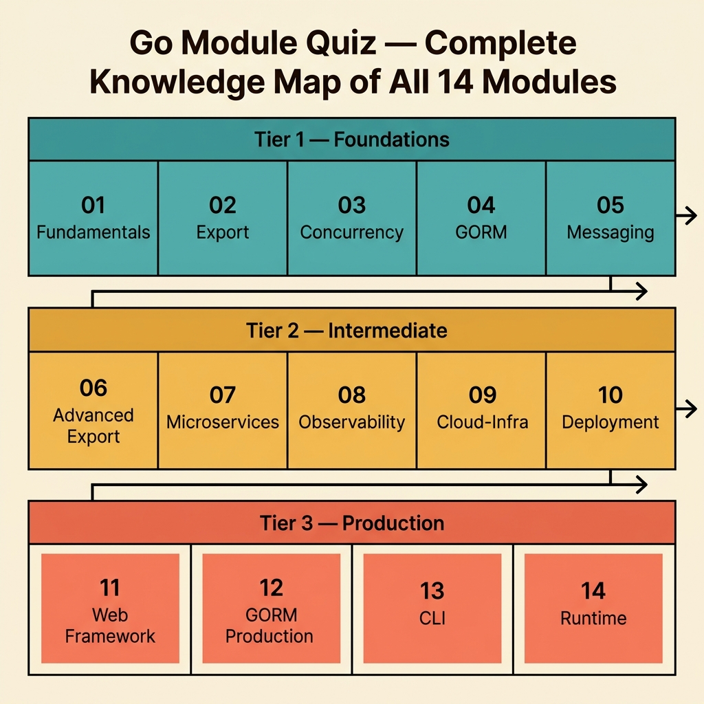
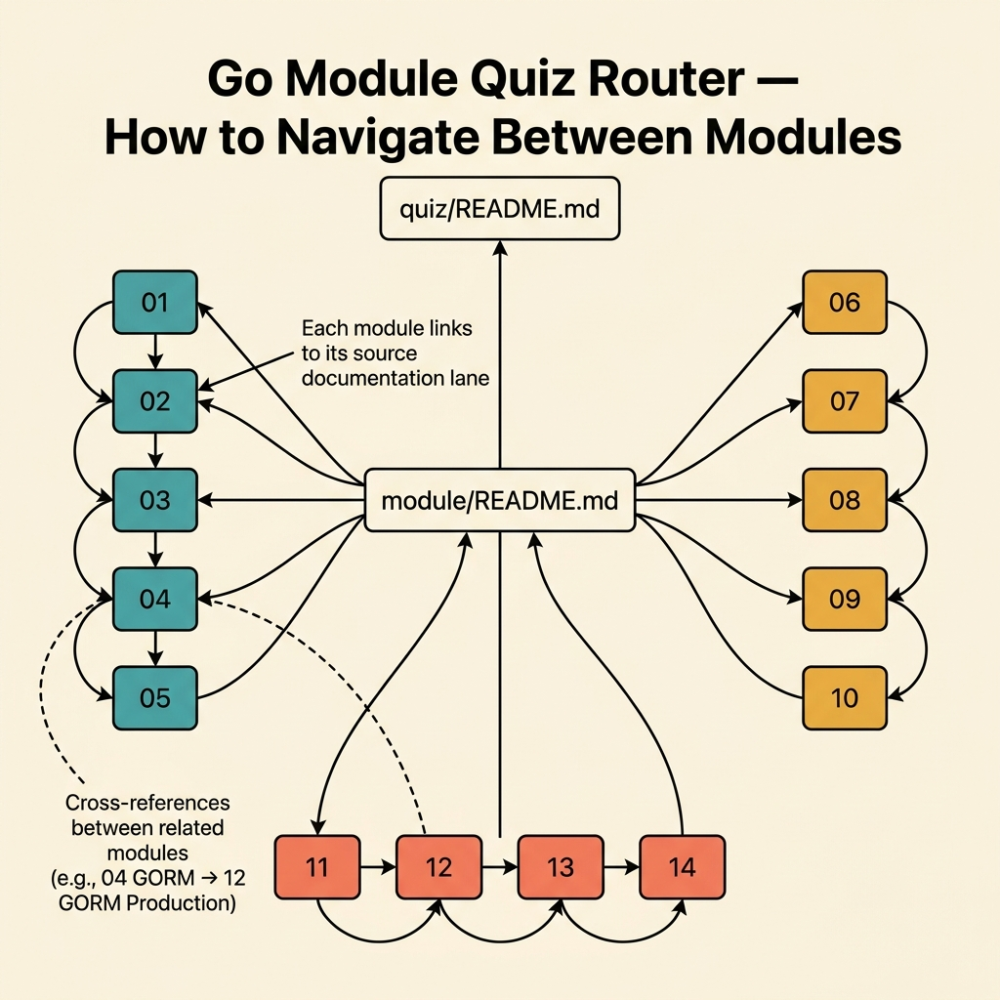
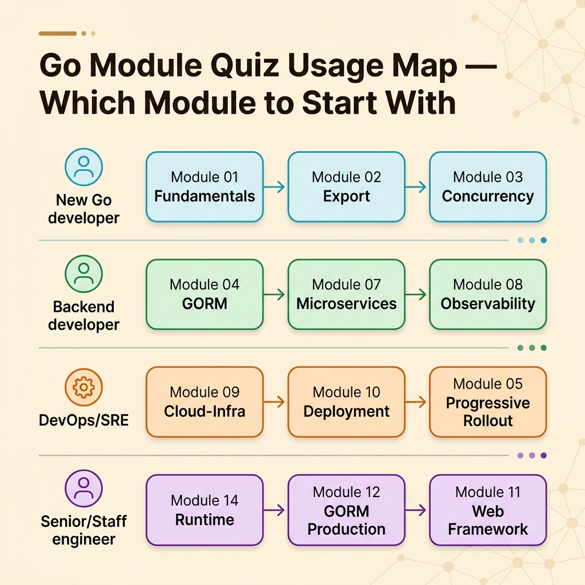

<!-- tags: golang, quiz, overview -->
# Go Module Quiz

> You read the docs. You nodded along. Now prove you actually absorbed it — without peeking.

📅 Updated: 2026-04-10 · ⏱️ 6 min read.

## 1. DEFINE

Module quizzes are post-reading checkpoints. Each quiz maps to one documentation cluster — fundamentals, concurrency, GORM, messaging, export formats, microservices, or runtime internals. The goal is not trivia. The goal is exposing the gap between "I read it" and "I can apply it."

Every quiz targets a specific knowledge boundary:

### Assessment Boundaries

- **Fundamentals** (01): Shadowing, zero values, interfaces, error wrapping, table-driven tests.
- **Export** (02, 06): CSV streaming, Excel multi-sheet, PDF layout, background jobs, signed URLs.
- **Concurrency** (03): Goroutine lifecycle, channel direction, `sync.WaitGroup`, `context.Context` cancellation.
- **GORM** (04, 12): Connection pooling, hooks, transactions, soft delete, query scoping.
- **Messaging** (05): RabbitMQ, dead-letter queues, retry patterns, idempotency keys.
- **Microservices** (07): gRPC, service discovery, circuit breakers, saga/outbox.
- **Observability** (08): Structured logging, distributed tracing, metrics, alerting.
- **Infrastructure** (09–10): Docker, Kubernetes, Terraform, Helm, CI/CD, deployment strategies.
- **Web & CLI** (11, 13): Gin/Echo middleware, rate limiting, CLI flag parsing, signal handling.
- **Runtime** (14): GC tuning, `pprof`, memory allocation, escape analysis.

### Learning Lanes

Each module quiz links back to the documentation lane it tests. When you miss a question, the answer key sends you to the exact section you need to re-read.

| Quiz | Documentation Lane | Focus |
|------|--------------------|-------|
| 01 | `fundamental/` | Syntax, types, interfaces, errors |
| 02–06 | `export/` | CSV, Excel, PDF, streaming, storage |
| 03 | `concurrency/` | Goroutines, channels, sync primitives |
| 04, 12 | `gorm/` | ORM patterns, production hardening |
| 05 | `messaging/` | Broker integration, retry, dead-letter |
| 07 | `microservices/` | gRPC, saga, circuit breaker |
| 08 | `observability/` | Logging, tracing, metrics |
| 09–10 | `deployment/` | Containers, orchestration, CI/CD |
| 11 | `web-framework/` | Middleware, routing, request handling |
| 13 | `cli/` | Command parsing, signal handling |
| 14 | `runtime/` | GC, pprof, escape analysis |

## 2. VISUAL

Module quizzes sit between the documentation lane and mastery. Each quiz tests one cluster. Failing sends you back to the source.



*Figure: Fourteen module quizzes span six Go domains. Each quiz targets a specific knowledge boundary — not a chapter summary, but the edges where misconceptions hide.*



*Figure: Each module links to its source documentation lane and cross-references related modules for progressive deepening.*



*Figure: Start at the module that matches your role — new Go developers begin at fundamentals, DevOps/SRE engineers start at cloud-infra.*

## 3. CODE

The router matches a documentation cluster to the corresponding quiz file.

### Example 1: Basic — Module quiz router

> **Goal**: Direct the reader to the quiz that matches the lane they just finished.
> **Complexity**: Basic

```go
// module_quiz_router.go — Maps documentation clusters to quiz files.
package quiz

func ChooseModuleQuiz(cluster string) string {
	switch cluster {
	case "fundamental":
		return "./01-fundamental-quick-check.md"
	case "concurrency":
		return "./03-concurrency-foundations.md"
	case "web-framework":
		return "./11-web-framework-production.md"
	case "runtime":
		return "./14-go-runtime-and-performance.md"
	default:
		return "./README.md"
	}
}
```

**Why?** Each `case` maps a documentation lane name to the quiz that tests it. The `default` returns to this README so the reader can browse the full roster.

## 4. PITFALLS

| # | Severity | Defect | Impact | Fix |
| --- | --- | --- | --- | --- |
| 1 | 🔴 Fatal | Taking the quiz without reading the source lane first | Results are meaningless — guessing ≠ diagnosis | Read the lane, then take the quiz |
| 2 | 🟡 Common | Scoring 100% but skipping scenario quizzes | Recall ≠ reasoning under production pressure | After mastering module quizzes, switch to `scenario/` |
| 3 | 🟡 Common | Memorizing answer keys after a failed attempt | The quiz tests understanding, not memory | Re-read the source section, then retake |

## 5. REF

| Resource | Link | Note |
| --- | --- | --- |
| Effective Go | [https://go.dev/doc/effective_go](https://go.dev/doc/effective_go) | Primary reference for idiomatic Go quiz content |
| A Tour of Go | [https://go.dev/tour/](https://go.dev/tour/) | Interactive primer for fundamental quiz topics |
| Go by Example | [https://gobyexample.com/](https://gobyexample.com/) | Annotated examples covering most module quiz domains |

## 6. RECOMMEND

| Extension | When to proceed | Rationale | File/Link |
| --- | --- | --- | --- |
| Fundamental Quick Check | After reading the fundamentals lane | Tests syntax, types, interfaces, and error handling | [./01-fundamental-quick-check.md](./01-fundamental-quick-check.md) |
| Concurrency Foundations | After reading the concurrency lane | Tests goroutine lifecycle, channels, and sync primitives | [./03-concurrency-foundations.md](./03-concurrency-foundations.md) |
| Web Framework Production | After reading the web framework lane | Tests middleware, routing, and request handling | [./11-web-framework-production.md](./11-web-framework-production.md) |
| Go Runtime & Performance | After reading the runtime internals lane | Tests GC tuning, pprof, and escape analysis | [./14-go-runtime-and-performance.md](./14-go-runtime-and-performance.md) |

---
