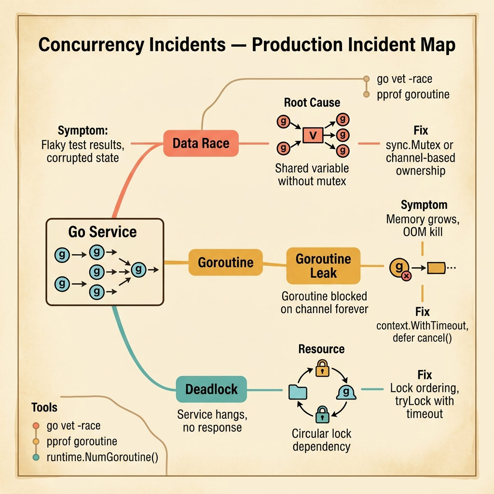

<!-- tags: golang, quiz -->
# 01 — Go Scenario Quiz: Concurrency Incidents

> **Diagnostic Assessment**: Five incident scenarios testing your ability to diagnose goroutine leaks, race conditions, and cancellation chain failures under production pressure.

📅 Created: 2026-03-27 · 🔄 Updated: 2026-04-10 · ⏱️ 10 min read.

| Aspect | Detail |
| --- | --- |
| **Level** | Advanced |
| **Coverage** | Goroutine leaks, race conditions, channel deadlocks, context cancellation |
| **Format** | 5 incident scenarios with diagnosis questions |

---

## 1. DEFINE

Concurrency bugs are the hardest to reproduce and the most expensive to fix in production. A goroutine leak consumes 8 KB of stack per goroutine — invisible until memory pressure triggers OOM. A data race silently corrupts state until a customer reports wrong data.

### Assessment Boundaries

- Goroutine lifecycle mismanagement: missing cancellation, leaked receivers.
- Channel deadlocks: unbuffered sends without receivers, double-close panics.
- Race conditions: concurrent map writes, shared state without mutex.
- Context cancellation: broken chains, missing propagation.

## 2. VISUAL

The incident map below shows three concurrent failure surfaces that a Go service can hit simultaneously. Each lane traces from symptom to root cause to fix, with diagnostic tools anchored at the bottom.



*Figure: A Go service spawning goroutines can hit three concurrent failure surfaces — data races corrupt state silently, goroutine leaks grow memory until OOM, and deadlocks freeze the service. Each lane shows the symptom, root cause mechanism, and the fix that stops it.*

```text
Incident Path Evaluations
├── Lifecycle
│   ├── Cancellation Chain Disruptions
│   └── Unbounded Goroutine Spawns
├── Communication
│   ├── Pipeline Stage Blocking
│   └── Channel Direction Violations
└── Data Safety
    ├── Race Condition Detection
    └── Memory Leak Metrics
```

## 3. CODE

### Example 1: Basic — Worker pool with clean cancellation

> **Goal**: Demonstrate a worker pool that exits cleanly when the context is cancelled.
> **Complexity**: Basic

```go
package scenarioquiz

import (
	"context"
	"sync"
)

func StartWorkers(ctx context.Context, jobs <-chan int, workers int, handle func(int)) {
	var wg sync.WaitGroup
	for i := 0; i < workers; i++ {
		wg.Add(1)
		go func() {
			defer wg.Done()
			for {
				select {
				case <-ctx.Done():
					return
				case job, ok := <-jobs:
					if !ok {
						return
					}
					handle(job)
				}
			}
		}()
	}
	wg.Wait()
}
```

**Why?** Each worker selects on `ctx.Done()` and channel close (`!ok`). Both exit paths call `wg.Done()` via `defer`. No goroutine leaks.

## 4. PITFALLS

| # | Severity | Defect | Impact | Fix |
| --- | --- | --- | --- | --- |
| 1 | 🔴 Fatal | Goroutine blocks on channel read after sender exits | Memory leak — goroutine count grows indefinitely | Always close channels when the sender is done |
| 2 | 🔴 Fatal | Concurrent map write without mutex | Runtime panic: `concurrent map writes` | Use `sync.Mutex` or `sync.Map` |
| 3 | 🟡 Common | Missing `ctx.Done()` check in worker loop | Workers ignore cancellation and run until the process is killed | Add `select` on `ctx.Done()` in every long-running loop |

## 5. REF

| Resource | Link | Note |
| --- | --- | --- |
| Go Context | [https://go.dev/blog/context](https://go.dev/blog/context) | Cancellation chain patterns |
| Go Pipelines | [https://go.dev/blog/pipelines](https://go.dev/blog/pipelines) | Fan-out/fan-in with cancellation |
| Race Detector | [https://go.dev/doc/articles/race_detector](https://go.dev/doc/articles/race_detector) | Data race detection tool |

## 6. RECOMMEND

| Extension | When to proceed | Rationale | File/Link |
| --- | --- | --- | --- |
| Concurrency Lane | After failing scenarios | Re-read concurrency fundamentals | [../../concurrency/README.md](../../concurrency/README.md) |
| Concurrency Module Quiz | Before attempting scenarios | Verify concept recall first | [../module/03-concurrency-foundations.md](../module/03-concurrency-foundations.md) |

## 7. QUIZ

### Incident Evaluation

1. **Incident**: Your service's goroutine count increases by 50 per minute. Memory usage grows linearly. No errors in logs. What is your first diagnostic step?
   - A. Restart the service to reclaim memory.
   - B. Capture a goroutine profile (`/debug/pprof/goroutine`) to identify which goroutines are blocked and where.
   - C. Increase the server's RAM.
   - D. Disable all middleware.

2. **Incident**: A `concurrent map writes` panic crashes your service during peak traffic. The map stores per-request metadata. What is the root cause?
   - A. The map has too many keys.
   - B. Multiple goroutines write to the same map without synchronization.
   - C. The map keys are strings instead of integers.
   - D. The map is declared as a global variable.

3. **Incident**: A context cancellation in the HTTP handler does not stop a background goroutine that is making expensive database queries. What is the most likely cause?
   - A. The database driver ignores context.
   - B. The background goroutine was launched with `context.Background()` instead of the request's context.
   - C. The HTTP handler is too slow.
   - D. The database connection pool is full.

4. **Incident**: A pipeline stage hangs indefinitely. Upstream is producing data, downstream is consuming, but the middle stage is blocked. What should you check first?
   - A. The CPU usage of the middle stage.
   - B. Whether the middle stage is blocked on a channel send because the downstream channel is full and the downstream consumer has stopped reading.
   - C. The size of the input data.
   - D. The Go version.

5. **Incident**: `go test -race` passes locally, but production logs show corrupted counter values. What explains the discrepancy?
   - A. The race detector is broken.
   - B. The race detector only catches races that occur during test execution — the production code path that triggers the race is not covered by tests.
   - C. Production uses a different CPU architecture.
   - D. The counter is too large for the race detector.

### Answer Key

1. **B**. The goroutine profile shows the stack trace of every blocked goroutine. This reveals which function is leaking (e.g., blocked on a channel read with no sender).

2. **B**. Go maps are not safe for concurrent use. Two goroutines writing simultaneously triggers a runtime panic. The fix is `sync.Mutex` or `sync.Map`.

3. **B**. `context.Background()` is never cancelled. The background goroutine runs independently of the request lifecycle. Pass the request's context instead.

4. **B**. Pipeline stages block when downstream stops consuming. If the downstream channel is buffered and full, or if the downstream goroutine exited, the middle stage's `send` blocks forever.

5. **B**. The race detector is dynamic — it only detects races that actually execute during the test run. If the racy code path is not exercised by tests, the race is invisible.

---
