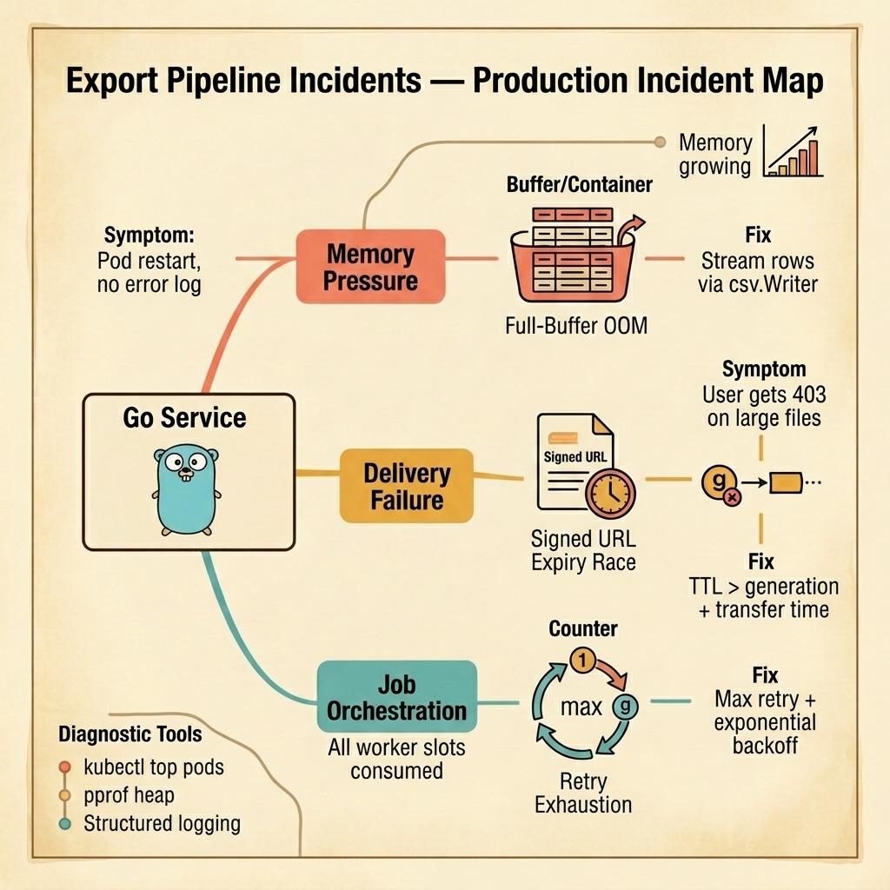

<!-- tags: golang, quiz -->
# 02 — Go Scenario Quiz: Export Pipeline Incidents

> **Diagnostic Assessment**: Five incident scenarios on export pipeline failures — OOM on large datasets, broken streaming, and storage delivery failures.

📅 Created: 2026-03-27 · 🔄 Updated: 2026-04-10 · ⏱️ 10 min read.

| Aspect | Detail |
| --- | --- |
| **Level** | Advanced |
| **Coverage** | Export OOM, streaming corruption, signed URL expiry, background job failures |
| **Format** | 5 incident scenarios |

---

## 1. DEFINE

Export failures are silent killers. The system works in dev with 100 rows. In production, a user exports 500,000 rows, the service OOMs, and the pod restarts with no useful error message.

### Assessment Boundaries

- Memory pressure from buffered exports.
- Streaming corruption (partial writes, truncated files).
- Signed URL expiry race conditions.
- Background job retry exhaustion.

## 2. VISUAL

The incident map below traces the three failure surfaces that dominate export pipelines in production — each lane shows the symptom an on-call engineer sees, the root cause hiding underneath, and the fix that stops the bleeding.



*Figure: Export pipeline failures split into three lanes — memory pressure from full-buffer loads, delivery failure from signed URL expiry races, and job orchestration collapse from retry exhaustion. Each lane shows symptom → root cause → fix.*

```text
Export Incident Path
├── Memory Pressure
│   ├── Full-buffer OOM
│   └── Excel StreamWriter misuse
├── Delivery Failure
│   ├── Signed URL expiry
│   └── Network timeout mid-transfer
└── Job Orchestration
    ├── Retry exhaustion
    └── Progress tracking loss
```

## 3. CODE

### Example 1: Basic — Fan-out with context cancellation

```go
package scenarioquiz

import "context"

func FanOutRows(ctx context.Context, in <-chan []string, out chan<- []string) error {
	defer close(out)
	for row := range in {
		select {
		case <-ctx.Done():
			return ctx.Err()
		case out <- row:
		}
	}
	return nil
}
```

## 4. PITFALLS

| # | Severity | Defect | Impact | Fix |
| --- | --- | --- | --- | --- |
| 1 | 🔴 Fatal | Buffering entire dataset before writing | OOM on large exports | Stream rows one at a time |
| 2 | 🟡 Common | Signed URL expires before download completes | User gets 403 on large file downloads | Set TTL > expected download time |

## 5. REF

| Resource | Link | Note |
| --- | --- | --- |
| encoding/csv | [https://pkg.go.dev/encoding/csv](https://pkg.go.dev/encoding/csv) | Streaming CSV writer |
| AWS S3 Signed URLs | [https://docs.aws.amazon.com/AmazonS3/latest/userguide/using-presigned-url.html](https://docs.aws.amazon.com/AmazonS3/latest/userguide/using-presigned-url.html) | Pre-authenticated downloads |

## 6. RECOMMEND

| Extension | When to proceed | Rationale | File/Link |
| --- | --- | --- | --- |
| Export Module Quiz | Before scenarios | Verify concept recall | [../module/02-export-foundations.md](../module/02-export-foundations.md) |
| Export Lane | After failing | Re-read export docs | [../../export/README.md](../../export/README.md) |

## 7. QUIZ

### Incident Evaluation

1. **Incident**: An export of 200,000 rows causes the pod to OOM and restart. The same export works with 1,000 rows. What is the most likely cause?
   - A. The database query is slow.
   - B. The export loads all rows into memory before writing, causing memory to scale linearly with row count.
   - C. The CSV file is too large for the file system.
   - D. The HTTP response header is missing.

2. **Incident**: A user downloads a CSV file but the last 500 rows are missing. No errors in logs. What should you check first?
   - A. The database query limit.
   - B. Whether `csv.Writer.Flush()` was called before the response stream closed.
   - C. The user's browser cache.
   - D. The DNS configuration.

3. **Incident**: Signed URL downloads return 403 for large exports but work for small ones. What is the most likely cause?
   - A. The storage bucket permissions changed.
   - B. The signed URL TTL is shorter than the time needed to generate and transfer the large file.
   - C. The file format is wrong.
   - D. The CDN is misconfigured.

4. **Incident**: A background export job completes successfully, but the user sees "export failed" in the UI. What should you investigate?
   - A. The UI framework version.
   - B. Whether the job status update (to "completed") was committed to the database after the file was written.
   - C. The user's network speed.
   - D. The server's timezone configuration.

5. **Incident**: Export jobs retry indefinitely after a transient database error, eventually consuming all worker pool slots. What is missing?
   - A. A faster database.
   - B. A max retry limit with exponential backoff — after N failures, the job should move to a failed state.
   - C. More worker pool slots.
   - D. A different export format.

### Answer Key

1. **B**. Loading all rows into a slice scales linearly. Streaming writes one row at a time, keeping memory constant.
2. **B**. `csv.Writer` buffers internally. Without `Flush()` before the response closes, the last buffered rows are lost.
3. **B**. Signed URLs expire after their TTL. If generation + upload + download exceeds the TTL, the URL is invalid when the user clicks it.
4. **B**. The job may write the file but fail to update the status to "completed." The UI reads the status, not the file.
5. **B**. Without a max retry limit, transient errors cause infinite retries that exhaust the worker pool.

---
