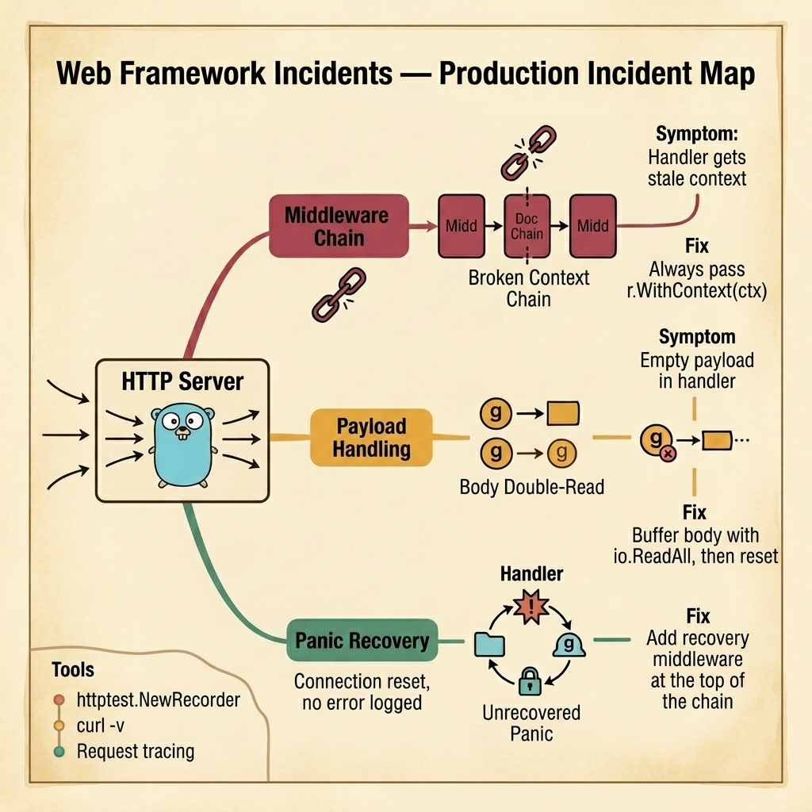

<!-- tags: golang, quiz -->
# 03 — Go Scenario Quiz: Web Framework Incidents

> **Diagnostic Assessment**: Five incident scenarios testing your ability to diagnose middleware ordering failures, request body consumption bugs, and panic recovery gaps in production HTTP services.

📅 Created: 2026-03-27 · 🔄 Updated: 2026-04-19 · ⏱️ 10 min read.

| Aspect | Detail |
| --- | --- |
| **Level** | Advanced |
| **Coverage** | Middleware chain ordering, payload binding failures, timeout propagation, panic recovery, response contract violations |
| **Format** | 5 incident scenarios with diagnosis questions |

---

## 1. DEFINE

Web framework incidents are deceptive. The handler looks correct in isolation. The middleware passes unit tests. But in production, a specific ordering of middleware — or a missing one — silently breaks the request lifecycle.

Three failure surfaces dominate:

- **Middleware chain breaks**: A middleware creates a new context with a deadline but the next middleware does not propagate it. The handler receives a stale context that never expires.
- **Payload consumption bugs**: `http.Request.Body` is an `io.ReadCloser`. Reading it once consumes the stream. A logging middleware that reads the body before the handler leaves the handler with an empty payload.
- **Panic recovery gaps**: A panic inside a handler kills the goroutine serving that request. Without recovery middleware, the client sees a connection reset with no error in the server logs.

### Assessment Boundaries

- Middleware ordering: timeout, auth, logging, recovery — sequence matters.
- Request body lifecycle: single-read stream, buffering strategies.
- Context propagation: `r.WithContext(ctx)` vs. ignoring the enriched context.

## 2. VISUAL

The incident map below shows the three failure surfaces that branch from an HTTP server processing requests — each lane traces the symptom, root cause, and fix.



*Figure: HTTP requests enter the server and hit three failure surfaces — a broken middleware context chain, a double-read body consumption, and an unrecovered panic. Each lane shows symptom → mechanism → fix.*

```text
Incident Path Evaluations
├── Route Execution
│   ├── Middleware Chain Context Breaks
│   └── Endpoint Payload Binding Failures
├── Contract Response Boundaries
│   ├── Inconsistent Error Body Formatting
│   └── Missing Domain Isolation Interfaces
└── Recovery Gaps
     ├── Upstream Disconnected Deadlines
     └── Uncontrolled Panic Propagation
```

## 3. CODE

### Example 1: Basic — Timeout middleware with context propagation

> **Goal**: Demonstrate a timeout middleware that correctly propagates the deadline to the handler.
> **Complexity**: Basic

```go
// web_framework_incidents.go — Propagate timeout from middleware to handler logic
package scenarioquiz

import (
	"context"
	"net/http"
	"time"
)

func Timeout(next http.Handler, d time.Duration) http.Handler {
	return http.HandlerFunc(func(w http.ResponseWriter, r *http.Request) {
		ctx, cancel := context.WithTimeout(r.Context(), d)
		defer cancel()
		next.ServeHTTP(w, r.WithContext(ctx))
	})
}
```

**Why?** `r.WithContext(ctx)` creates a shallow copy of the request with the new context. Without this call, the handler receives the original context — no deadline, no cancellation. The `defer cancel()` ensures the timer is released even if the handler returns early.

## 4. PITFALLS

| # | Severity | Defect | Impact | Fix |
| --- | --- | --- | --- | --- |
| 1 | 🔴 Fatal | Recovery middleware placed after the handler instead of before | Panics kill the goroutine; client gets connection reset | Place recovery middleware first in the chain |
| 2 | 🔴 Fatal | Logging middleware reads `r.Body` without resetting it | Handler receives empty payload, returns 400 | Buffer body with `io.ReadAll`, then assign `io.NopCloser` |
| 3 | 🟡 Common | Timeout middleware does not call `r.WithContext(ctx)` | Handler ignores the deadline entirely | Always pass the enriched context via `r.WithContext` |

## 5. REF

| Resource | Link | Note |
| --- | --- | --- |
| net/http Package | [https://pkg.go.dev/net/http](https://pkg.go.dev/net/http) | Standard library HTTP server and handler patterns |
| Gin Middleware | [https://gin-gonic.com/en/docs/](https://gin-gonic.com/en/docs/) | Framework-specific middleware ordering |
| OWASP Cheat Sheet | [https://cheatsheetseries.owasp.org/](https://cheatsheetseries.owasp.org/) | Input validation and security middleware |

## 6. RECOMMEND

| Extension | When to proceed | Rationale | File/Link |
| --- | --- | --- | --- |
| Web Framework Lane | After failing scenarios | Re-read middleware ordering docs | [../../gin/README.md](../../gin/README.md) |
| Web Framework Module Quiz | Before attempting scenarios | Verify concept recall first | [../module/11-web-framework-production.md](../module/11-web-framework-production.md) |

## 7. QUIZ

### Incident Evaluation

1. **Incident**: Your API returns `200 OK` with an empty JSON body `{}` for valid POST requests. The same request works correctly in unit tests with `httptest.NewRecorder`. What should you check first?
   - A. The JSON serialization library version.
   - B. Whether a middleware (logging, tracing, or WAF) is reading `r.Body` before the handler, consuming the stream.
   - C. The database connection pool size.
   - D. The Content-Type header in the request.

2. **Incident**: A handler that calls an external API has no timeout. Requests occasionally hang for 30+ seconds, consuming a goroutine and a connection slot. The handler's context has a deadline, but the `http.Client` used for the external call was created with `&http.Client{}` (no timeout). What is the root cause?
   - A. The external API is too slow.
   - B. The `http.Client` does not inherit the handler's context deadline. The request must be created with `http.NewRequestWithContext(ctx, ...)` to propagate the deadline.
   - C. The server needs more goroutines.
   - D. The DNS resolver is misconfigured.

3. **Incident**: A panic in a handler crashes only one request, but no error appears in the server logs. The client sees `connection reset by peer`. What is missing?
   - A. A larger log buffer.
   - B. Recovery middleware at the top of the middleware chain that catches panics, logs the stack trace, and returns a 500 response.
   - C. A faster CPU.
   - D. TLS configuration.

4. **Incident**: Your timeout middleware wraps the handler with `context.WithTimeout`, but the handler still runs past the deadline. The handler checks `ctx.Done()` in a `select` statement. What is the most likely cause?
   - A. The timeout value is too large.
   - B. The middleware creates the context but does not pass it to the handler via `r.WithContext(ctx)` — the handler receives the original context without a deadline.
   - C. The `select` statement has a bug.
   - D. The Go scheduler is overloaded.

5. **Incident**: Your API returns different error shapes depending on which handler fails — some return `{"error": "msg"}`, others return `{"message": "msg", "code": 500}`. Integration tests pass but the frontend team reports parsing failures. What is the structural cause?
   - A. The frontend JSON parser is broken.
   - B. There is no centralized error response middleware — each handler formats errors independently, creating inconsistent contracts.
   - C. The HTTP status codes are wrong.
   - D. The API gateway is rewriting responses.

### Answer Key

1. **B**. `http.Request.Body` is an `io.ReadCloser` — a single-read stream. If any middleware reads it first, the handler gets an empty body. Buffer the body and reset it with `io.NopCloser(bytes.NewReader(buf))`.

2. **B**. An `http.Client{}` with no timeout or context ignores the handler's deadline. Use `http.NewRequestWithContext(ctx, ...)` so the external call respects the same cancellation chain.

3. **B**. Without recovery middleware, a panic kills the goroutine silently. The `net/http` server catches the panic at the connection level and closes the connection, but logs nothing useful. Recovery middleware must sit at the top of the chain.

4. **B**. `context.WithTimeout` creates a new context, but `next.ServeHTTP(w, r)` passes the original request with the old context. The fix is `next.ServeHTTP(w, r.WithContext(ctx))`.

5. **B**. Without a centralized error middleware, each handler creates its own error shape. The fix is a single error handler that all routes use, enforcing a consistent `{"error": string, "code": int}` contract.

---
