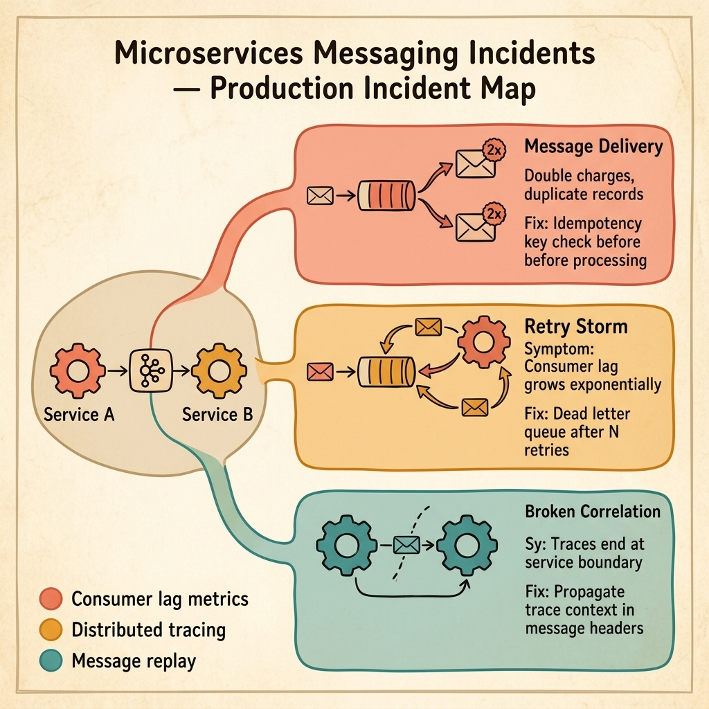

<!-- tags: golang, quiz -->
# 04 — Go Scenario Quiz: Microservices & Messaging Incidents

> **Diagnostic Assessment**: Five incident scenarios testing your ability to diagnose message delivery failures, retry storms, broken trace correlation, and idempotency gaps in distributed Go services.

📅 Created: 2026-03-27 · 🔄 Updated: 2026-04-19 · ⏱️ 10 min read.

| Aspect | Detail |
| --- | --- |
| **Level** | Advanced |
| **Coverage** | At-least-once delivery, idempotency guards, retry storms, dead letter queues, trace context propagation |
| **Format** | 5 incident scenarios with diagnosis questions |

---

## 1. DEFINE

Microservices messaging incidents hide behind the word "eventually." Eventually consistent means the data will converge — unless a message is delivered twice, dropped silently, or processed out of order.

Three failure surfaces dominate in production:

- **Duplicate delivery**: The broker guarantees at-least-once delivery. Without an idempotency guard, the consumer processes the same message twice — double charges, duplicate records, corrupted aggregates.
- **Retry storms**: A consumer fails to process a message, rejects it, and the broker redelivers it immediately. With no backoff and no dead letter queue, the failed message loops forever, consuming all consumer capacity.
- **Broken trace correlation**: Service A publishes a message with a trace ID in the context. The broker strips the context. Service B starts a new trace. The two halves of the transaction are invisible to each other in the tracing dashboard.

### Assessment Boundaries

- Message delivery semantics: at-most-once vs. at-least-once vs. exactly-once.
- Consumer idempotency: deduplication keys, processed message stores.
- Dead letter queue routing: when and how to eject poison messages.
- Trace context propagation across async boundaries.

## 2. VISUAL

The incident map below shows three failure surfaces that emerge when two services communicate through a message broker — duplicate delivery, retry storms, and broken trace correlation.



*Figure: Service A and Service B communicate through a broker. Three failure surfaces emerge — duplicate delivery creates double records, retry storms exhaust consumer capacity, and broken trace correlation makes debugging across service boundaries impossible.*

```text
Incident Path Evaluations
├── Service Contract Validations
│   ├── Network Configuration Timeouts
│   └── Missing Payload Idempotency Keys
├── Distributed Delivery Semantics
│   ├── Broker Message Delivery Failures
│   └── Transaction Outbox Divergences
└── Trace Observability Constraints
     ├── Broken Correlation Map Identifiers
     └── Separated Component Log Sequences
```

## 3. CODE

### Example 1: Basic — Idempotent consumer guard

> **Goal**: Demonstrate an idempotency guard that prevents duplicate message processing under at-least-once delivery.
> **Complexity**: Basic

```go
// messaging_incidents.go — Idempotent consumer guard around at-least-once delivery
package scenarioquiz

import "context"

type ProcessedStore interface {
	AlreadyHandled(ctx context.Context, key string) (bool, error)
	MarkHandled(ctx context.Context, key string) error
}

func HandleMessage(ctx context.Context, store ProcessedStore, key string, run func() error) error {
	done, err := store.AlreadyHandled(ctx, key)
	if err != nil || done {
		return err
	}
	if err := run(); err != nil {
		return err
	}
	return store.MarkHandled(ctx, key)
}
```

**Why?** The `ProcessedStore` checks whether this message key has been handled before. If yes, it short-circuits. If no, it runs the business logic and then marks the key as handled. This pattern converts at-least-once delivery into effectively-once processing at the application layer.

## 4. PITFALLS

| # | Severity | Defect | Impact | Fix |
| --- | --- | --- | --- | --- |
| 1 | 🔴 Fatal | No idempotency check on consumer | Duplicate messages create duplicate records | Check a processed-message store before running business logic |
| 2 | 🔴 Fatal | No dead letter queue after max retries | Poison messages loop forever, blocking the queue | Route to DLQ after N retry attempts |
| 3 | 🟡 Common | Trace context not propagated in message headers | Traces end at the publisher; consumer starts a new trace | Inject trace context into message headers before publishing |

## 5. REF

| Resource | Link | Note |
| --- | --- | --- |
| gRPC Go Basics | [https://grpc.io/docs/languages/go/basics/](https://grpc.io/docs/languages/go/basics/) | Synchronous service-to-service communication |
| kafka-go | [https://github.com/segmentio/kafka-go](https://github.com/segmentio/kafka-go) | Go Kafka client with consumer group support |
| Transactional Outbox | [https://microservices.io/patterns/data/transactional-outbox.html](https://microservices.io/patterns/data/transactional-outbox.html) | Pattern for reliable message publishing |

## 6. RECOMMEND

| Extension | When to proceed | Rationale | File/Link |
| --- | --- | --- | --- |
| Microservices Lane | After failing scenarios | Re-read messaging patterns | [../../microservices/README.md](../../microservices/README.md) |
| Microservices Module Quiz | Before attempting scenarios | Verify concept recall first | [../module/07-microservices-foundations.md](../module/07-microservices-foundations.md) |

## 7. QUIZ

### Incident Evaluation

1. **Incident**: Your payment service processes the same order twice after a broker restart. The consumer acks messages after processing, but the broker redelivered the message before the ack was confirmed. What is missing?
   - A. A faster broker.
   - B. An idempotency check — the consumer must verify the message has not been processed before running the payment logic.
   - C. A larger ack timeout.
   - D. Message compression.

2. **Incident**: Consumer lag for a topic grows from 0 to 50,000 in ten minutes. The consumer logs show the same error repeating: `"failed to deserialize message"`. No other errors appear. What is happening?
   - A. The broker is overloaded.
   - B. A poison message that cannot be deserialized is being redelivered infinitely — the consumer rejects it, the broker redelivers, and the cycle blocks all other messages behind it.
   - C. The producer is sending too fast.
   - D. The topic has too many partitions.

3. **Incident**: A distributed trace shows Service A publishing an event, but the trace ends at the broker. Service B's processing of that event starts a completely new trace with no parent. What is the root cause?
   - A. The tracing library is buggy.
   - B. The publisher is not injecting the trace context into the message headers, and the consumer is not extracting it — the async boundary breaks the trace chain.
   - C. The broker strips all headers.
   - D. The services use different tracing backends.

4. **Incident**: Your outbox poller publishes messages to the broker in the order they were written to the outbox table. But the consumer processes them out of order. The topic has 4 partitions. What is the most likely cause?
   - A. The consumer is too slow.
   - B. Messages for the same aggregate are spread across different partitions, and each partition is consumed independently — order is only guaranteed within a single partition.
   - C. The database is returning rows in random order.
   - D. The broker is reordering messages.

5. **Incident**: After deploying a new consumer version, the service processes messages correctly but the old consumer group offset is lost. The consumer starts re-processing messages from the beginning of the topic. What happened?
   - A. The broker deleted the topic.
   - B. The new deployment changed the consumer group ID, creating a new group with no committed offsets — it defaults to the earliest offset.
   - C. The messages expired.
   - D. The partition count changed.

### Answer Key

1. **B**. At-least-once delivery means the broker may redeliver. The consumer must check a processed-message store before executing business logic. Without this guard, redelivery causes duplicate side effects.

2. **B**. A poison message that fails deserialization will be redelivered indefinitely without a dead letter queue. All messages behind it in the partition are blocked. The fix is a max retry count that routes failed messages to a DLQ.

3. **B**. Async boundaries (message brokers) do not propagate context automatically. The publisher must inject the trace context into message headers, and the consumer must extract it and create a child span.

4. **B**. Kafka guarantees ordering only within a partition. If messages for the same aggregate land on different partitions (e.g., round-robin), the consumer sees them out of order. The fix is to partition by aggregate ID.

5. **B**. Consumer group offsets are tied to the group ID. Changing the group ID creates a new group with no history. The consumer defaults to the configured auto-offset-reset policy, which is often `earliest`.

---
