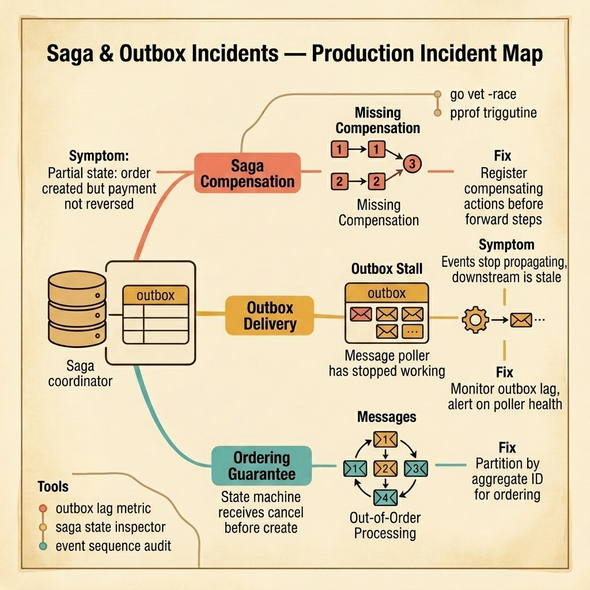

<!-- tags: golang, quiz -->
# 05 — Go Scenario Quiz: Saga & Outbox Incidents

> **Diagnostic Assessment**: Five incident scenarios testing your ability to diagnose saga compensation failures, outbox poller stalls, and event ordering violations in distributed transaction workflows.

📅 Created: 2026-03-27 · 🔄 Updated: 2026-04-19 · ⏱️ 10 min read.

| Aspect | Detail |
| --- | --- |
| **Level** | Advanced |
| **Coverage** | Saga compensation chains, outbox table polling, event ordering guarantees, partial state recovery |
| **Format** | 5 incident scenarios with diagnosis questions |

---

## 1. DEFINE

Saga incidents are the most expensive bugs in distributed systems. The forward steps succeed. The compensation steps were never registered. The system sits in a partial state: an order exists, a payment was charged, but the inventory was never reserved because step 3 failed — and nobody rolled back steps 1 and 2.

Three failure surfaces dominate:

- **Missing compensation**: The saga coordinator executes forward steps but does not register compensating actions. When a later step fails, there is nothing to undo the earlier steps. The system enters an inconsistent state that requires manual intervention.
- **Outbox stall**: The transactional outbox pattern writes events to a database table inside the same transaction as the business data. A poller reads the outbox and publishes events to the broker. If the poller crashes or falls behind, downstream services see stale data — or no data at all.
- **Out-of-order processing**: Events arrive at a consumer in the wrong order. The state machine receives a "cancel" event before the "create" event. The cancel handler finds no record to cancel and silently drops the event. Minutes later, the "create" arrives and creates a record that should have been cancelled.

### Assessment Boundaries

- Saga orchestration vs. choreography tradeoffs.
- Compensation registration: before or after forward steps.
- Outbox poller health: lag metrics, crash recovery, idempotent republishing.
- Event ordering: partition keys, sequence numbers, aggregate-scoped ordering.

## 2. VISUAL

The incident map below traces three failure surfaces in saga and outbox workflows — missing compensation leaves partial state, outbox stalls freeze event propagation, and ordering violations corrupt state machines.



*Figure: A saga coordinator backed by a transactional outbox hits three failure surfaces — missing compensations leave partial state after step failures, outbox stalls stop event propagation to downstream services, and out-of-order processing corrupts consumer state machines.*

```text
Incident Path Evaluations
├── Saga Compensation Gaps
│   ├── Forward Steps Without Registered Undo
│   └── Timeout-Based Compensation Triggers
├── Outbox Delivery Stalls
│   ├── Poller Crash Without Health Check
│   └── Duplicate Publish After Poller Restart
└── Event Ordering Violations
     ├── Cross-Partition Ordering Breaks
     └── State Machine Sequence Confusion
```

## 3. CODE

### Example 1: Basic — Outbox entry creation inside the business transaction

> **Goal**: Demonstrate how to write a business record and its outbox event in the same database transaction, ensuring atomicity.
> **Complexity**: Basic

```go
// saga_outbox_incidents.go — Write business data and outbox event in one transaction
package scenarioquiz

import (
	"context"
	"database/sql"
	"encoding/json"
	"time"
)

type OutboxEntry struct {
	AggregateID string
	EventType   string
	Payload     json.RawMessage
	CreatedAt   time.Time
}

func CreateOrderWithOutbox(ctx context.Context, tx *sql.Tx, orderID string, amount int) error {
	// Step 1: Insert the business record.
	_, err := tx.ExecContext(ctx,
		"INSERT INTO orders (id, amount, status) VALUES ($1, $2, 'created')",
		orderID, amount)
	if err != nil {
		return err
	}

	// Step 2: Insert the outbox event in the same transaction.
	payload, _ := json.Marshal(map[string]interface{}{"order_id": orderID, "amount": amount})
	_, err = tx.ExecContext(ctx,
		"INSERT INTO outbox (aggregate_id, event_type, payload) VALUES ($1, $2, $3)",
		orderID, "order.created", payload)
	return err
}
```

**Why?** Both the order and the outbox event live in the same transaction. If the transaction commits, both exist. If it rolls back, neither exists. The poller reads the outbox table separately and publishes the event to the broker. This eliminates the dual-write problem where the business write succeeds but the event publish fails.

## 4. PITFALLS

| # | Severity | Defect | Impact | Fix |
| --- | --- | --- | --- | --- |
| 1 | 🔴 Fatal | Saga registers compensations after forward steps | If step N+1 fails before compensation for step N is registered, no rollback occurs | Register compensating actions before executing forward steps |
| 2 | 🔴 Fatal | Outbox poller has no health check or lag alert | Poller crashes silently; downstream sees stale data for hours | Monitor outbox lag metric and alert on poller liveness |
| 3 | 🟡 Common | Events partitioned by round-robin instead of aggregate ID | Consumer receives events for the same aggregate out of order | Partition by aggregate ID to guarantee per-aggregate ordering |

## 5. REF

| Resource | Link | Note |
| --- | --- | --- |
| Saga Pattern | [https://microservices.io/patterns/data/saga.html](https://microservices.io/patterns/data/saga.html) | Orchestration vs. choreography tradeoffs |
| Transactional Outbox | [https://microservices.io/patterns/data/transactional-outbox.html](https://microservices.io/patterns/data/transactional-outbox.html) | Reliable event publishing without dual writes |
| Debezium CDC | [https://debezium.io/documentation/](https://debezium.io/documentation/) | Change data capture as outbox poller alternative |

## 6. RECOMMEND

| Extension | When to proceed | Rationale | File/Link |
| --- | --- | --- | --- |
| Microservices Lane | After failing scenarios | Re-read saga and outbox patterns | [../../microservices/README.md](../../microservices/README.md) |
| Saga Module Quiz | Before attempting scenarios | Verify concept recall first | [../module/08-saga-outbox-foundations.md](../module/08-saga-outbox-foundations.md) |

## 7. QUIZ

### Incident Evaluation

1. **Incident**: An order is created and payment is charged, but inventory reservation fails. The system has no mechanism to reverse the payment. The order sits in a partial state: paid but unfulfilled. What is the structural cause?
   - A. The payment service is too slow.
   - B. The saga coordinator did not register a compensation action for the payment step before executing the inventory step — when inventory fails, there is no undo for payment.
   - C. The database transaction timed out.
   - D. The inventory service returned the wrong error code.

2. **Incident**: Downstream services stop receiving events. The outbox table has 50,000 unpublished rows. The poller process is not running. No alerts fired. What should you check first?
   - A. The broker configuration.
   - B. Whether the outbox poller process has a health check and whether the monitoring system alerts on outbox table lag — a missing health check let the poller die silently.
   - C. The database disk space.
   - D. The network firewall rules.

3. **Incident**: A consumer receives a "cancel" event for an order that does not exist yet. The "create" event arrives 2 seconds later. The consumer drops the cancel because it finds no matching record. The order is now in "created" status when it should be "cancelled." What is the root cause?
   - A. The consumer is too fast.
   - B. The events are not partitioned by aggregate ID — they land on different partitions and are consumed out of order. Per-aggregate ordering requires using the aggregate ID as the partition key.
   - C. The broker lost a message.
   - D. The consumer has a bug in its cancellation logic.

4. **Incident**: After the outbox poller restarts from a crash, some events are published twice to the broker. Downstream consumers create duplicate records. What is missing?
   - A. A faster poller.
   - B. The poller does not track which outbox rows have been published — it needs to mark rows as published after successful broker delivery, and consumers need an idempotency guard.
   - C. The broker should deduplicate messages.
   - D. The outbox table needs an index.

5. **Incident**: A saga with 5 steps fails at step 4. Compensations run for steps 3, 2, and 1. But the compensation for step 2 also fails. The saga coordinator retries the compensation 3 times and then gives up. What should the system do?
   - A. Ignore the failure and move on.
   - B. Persist the saga into a "compensation-failed" state with the step number, then alert the operations team — a human must inspect and manually resolve the inconsistency.
   - C. Retry indefinitely.
   - D. Restart the entire saga from step 1.

### Answer Key

1. **B**. Sagas must register compensating actions before executing forward steps. If the next forward step fails, the coordinator must have a registered undo for every completed step. Without this, partial state is unrecoverable.

2. **B**. A dead poller with no health check is invisible to monitoring. The outbox table grows, downstream services see stale data, and nobody knows until a user reports it. The fix is a liveness check for the poller and an alert on outbox row count or lag.

3. **B**. Kafka (and most brokers) guarantee ordering only within a partition. If "create" and "cancel" for the same order land on different partitions, they arrive in arbitrary order. Using the order ID as the partition key guarantees per-order sequencing.

4. **B**. If the poller publishes a row but crashes before marking it as published, the restart publishes it again. The fix has two parts: the poller must mark rows after successful publish, and consumers must have idempotency guards to handle the remaining edge cases.

5. **B**. Infinite retry risks infinite resource consumption. Giving up silently leaves the system in an unknown state. The correct approach is to persist the failure, including which step and which compensation failed, and alert operations for manual resolution.

---
