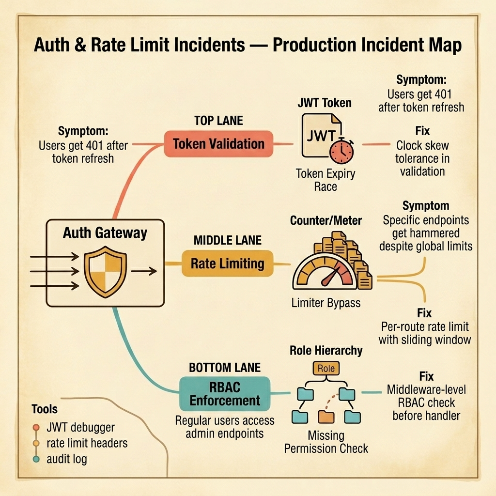

<!-- tags: golang, quiz -->
# 06 — Go Scenario Quiz: Auth & Rate Limit Security Incidents

> **Diagnostic Assessment**: Five incident scenarios testing your ability to diagnose token validation failures, rate limiter bypasses, and RBAC enforcement gaps in production Go services.

📅 Created: 2026-03-27 · 🔄 Updated: 2026-04-19 · ⏱️ 10 min read.

| Aspect | Detail |
| --- | --- |
| **Level** | Advanced |
| **Coverage** | JWT validation edge cases, clock skew, sliding window rate limiting, per-route limits, RBAC middleware enforcement |
| **Format** | 5 incident scenarios with diagnosis questions |

---

## 1. DEFINE

Auth and rate limit incidents are the quietest failures in production. A misconfigured JWT validation rejects legitimate users for hours before anyone notices. A global rate limiter protects the aggregate but leaves individual endpoints exposed. A missing RBAC check lets regular users access admin endpoints — and nobody knows until the audit log review.

Three failure surfaces dominate:

- **Token expiry race**: The client refreshes its token. The server validates the new token. But the server's clock is 3 seconds behind the auth provider's clock. The `exp` claim says the token is expired. The user gets a `401 Unauthorized` on a perfectly valid token.
- **Limiter bypass**: A global rate limiter counts all requests together. The `/health` endpoint consumes most of the budget. The actual business endpoints never hit the limit — but an attacker targeting `/api/transfer` has unlimited attempts because the global counter is dominated by health checks.
- **Missing permission check**: The route is registered. The handler works. But no middleware verifies the caller's role. A regular user discovers the admin endpoint and accesses it directly.

### Assessment Boundaries

- JWT clock skew tolerance and `nbf`/`exp` validation.
- Per-route vs. global rate limiting strategies.
- Middleware-level RBAC enforcement vs. handler-level checks.

## 2. VISUAL

The incident map below shows three failure surfaces branching from an auth gateway — token validation races, rate limiter bypasses, and missing RBAC checks.



*Figure: Requests enter through an auth gateway and hit three failure surfaces — expired tokens rejected due to clock skew, rate limiters bypassed through global counting, and missing permission checks exposing admin endpoints to regular users.*

```text
Incident Path Evaluations
├── Token Validation
│   ├── Clock Skew Between Auth Provider and Server
│   └── Refresh Token Race Conditions
├── Rate Limiting
│   ├── Global Counter Dominated by Health Checks
│   └── Missing Per-Route Sliding Window
└── RBAC Enforcement
    ├── Handler-Level vs. Middleware-Level Checks
    └── Role Hierarchy Gaps
```

## 3. CODE

### Example 1: Basic — Per-route rate limiter with sliding window

> **Goal**: Demonstrate a per-route rate limiter that prevents endpoint-specific abuse while allowing normal traffic on other routes.
> **Complexity**: Basic

```go
// auth_rate_limit_incidents.go — Per-route rate limiter using token bucket
package scenarioquiz

import (
	"net/http"
	"sync"

	"golang.org/x/time/rate"
)

type RouteLimiter struct {
	mu       sync.Mutex
	limiters map[string]*rate.Limiter
	rate     rate.Limit
	burst    int
}

func NewRouteLimiter(r rate.Limit, b int) *RouteLimiter {
	return &RouteLimiter{limiters: make(map[string]*rate.Limiter), rate: r, burst: b}
}

func (rl *RouteLimiter) Get(key string) *rate.Limiter {
	rl.mu.Lock()
	defer rl.mu.Unlock()
	if l, ok := rl.limiters[key]; ok {
		return l
	}
	l := rate.NewLimiter(rl.rate, rl.burst)
	rl.limiters[key] = l
	return l
}

func (rl *RouteLimiter) Middleware(next http.Handler) http.Handler {
	return http.HandlerFunc(func(w http.ResponseWriter, r *http.Request) {
		key := r.RemoteAddr + ":" + r.URL.Path
		if !rl.Get(key).Allow() {
			http.Error(w, "rate limit exceeded", http.StatusTooManyRequests)
			return
		}
		next.ServeHTTP(w, r)
	})
}
```

**Why?** The limiter key combines the client IP and the route path. This prevents an attacker from exhausting a global budget through one endpoint while leaving other endpoints unprotected. Each client-route pair has its own token bucket.

## 4. PITFALLS

| # | Severity | Defect | Impact | Fix |
| --- | --- | --- | --- | --- |
| 1 | 🔴 Fatal | No clock skew tolerance in JWT validation | Valid tokens rejected after refresh | Add 5–10 second leeway to `exp` and `nbf` checks |
| 2 | 🔴 Fatal | RBAC check inside handler instead of middleware | Forgetting the check in one handler exposes admin routes | Enforce RBAC at the middleware level for all protected routes |
| 3 | 🟡 Common | Global rate limiter instead of per-route | Health check traffic consumes the rate budget | Use per-route or per-client-route rate limiting |

## 5. REF

| Resource | Link | Note |
| --- | --- | --- |
| golang-jwt/jwt | [https://github.com/golang-jwt/jwt](https://github.com/golang-jwt/jwt) | JWT parsing with clock skew options |
| x/time/rate | [https://pkg.go.dev/golang.org/x/time/rate](https://pkg.go.dev/golang.org/x/time/rate) | Token bucket rate limiter |
| OWASP Auth Cheat Sheet | [https://cheatsheetseries.owasp.org/cheatsheets/Authentication_Cheat_Sheet.html](https://cheatsheetseries.owasp.org/cheatsheets/Authentication_Cheat_Sheet.html) | Authentication best practices |

## 6. RECOMMEND

| Extension | When to proceed | Rationale | File/Link |
| --- | --- | --- | --- |
| Auth Security Lane | After failing scenarios | Re-read JWT and RBAC patterns | [../../security/README.md](../../security/README.md) |
| Auth Module Quiz | Before attempting scenarios | Verify concept recall first | [../module/12-auth-security-foundations.md](../module/12-auth-security-foundations.md) |

## 7. QUIZ

### Incident Evaluation

1. **Incident**: After a token refresh, users intermittently get `401 Unauthorized` for 2–5 seconds before requests start succeeding. The auth provider issues tokens correctly. What is the most likely cause?
   - A. The refresh token is invalid.
   - B. The server clock is slightly behind the auth provider's clock — the token's `nbf` (not-before) claim is in the server's future, causing rejection until the server clock catches up.
   - C. The database is slow.
   - D. The user's session expired.

2. **Incident**: Your API has a global rate limiter set to 1000 requests per second. Health check probes from Kubernetes hit the server 500 times per second. Legitimate business traffic is 400 req/s. An attacker sends 100 req/s to a single endpoint. The rate limiter does not trigger. Why?
   - A. The rate limiter is broken.
   - B. The global counter sees 1000 total req/s (500 health + 400 business + 100 attack), which is at the limit but does not exceed it — the attack traffic hides inside the global budget. Per-route limiting would catch the 100 req/s spike on a single endpoint.
   - C. The attacker is using different IPs.
   - D. The health check endpoint is cached.

3. **Incident**: A regular user accesses the `/admin/users` endpoint and successfully lists all users. The route is registered, the handler works, and it returns data. There is no error. What is missing?
   - A. The handler has a bug.
   - B. No RBAC middleware protects the route — the handler does not check the caller's role, so any authenticated user can access it.
   - C. The admin panel is misconfigured.
   - D. The user guessed the admin password.

4. **Incident**: Your rate limiter uses the client IP as the key. Users behind a corporate NAT share one IP. The rate limiter treats 500 users as one client and starts rejecting requests after 20 req/s. What should you change?
   - A. Increase the global limit.
   - B. Use a composite key that includes the authenticated user ID (from the JWT) instead of — or in addition to — the IP address.
   - C. Disable rate limiting for that IP.
   - D. Add more servers.

5. **Incident**: Your JWT validation accepts tokens signed with `HS256` (symmetric) and `RS256` (asymmetric). An attacker forges a token using `HS256` with the public key as the secret. The validation passes. What is the vulnerability?
   - A. The public key is too short.
   - B. The validator does not restrict the allowed signing algorithm — it accepts any `alg` in the header. An attacker can set `alg: HS256` and sign with the public key, which the validator then uses as the HMAC secret.
   - C. The private key leaked.
   - D. The token is expired.

### Answer Key

1. **B**. Clock skew between the auth provider and the server causes `nbf` or `exp` validation to fail on freshly issued tokens. The fix is a small leeway (5–10 seconds) in the JWT validation config.

2. **B**. A global rate limiter cannot distinguish between health checks and attack traffic. Per-route or per-client-route limiting isolates the attack traffic and triggers on the abnormal spike.

3. **B**. Without middleware-level RBAC enforcement, any authenticated user can access any route. The handler assumes the middleware already checked permissions. The fix is RBAC middleware on every protected route group.

4. **B**. IP-based rate limiting breaks behind NAT. Using the authenticated user ID from the JWT as the rate limit key provides per-user fairness regardless of network topology.

5. **B**. This is the classic JWT algorithm confusion attack. The fix is to explicitly whitelist the expected algorithm (`RS256`) in the validator and reject tokens with any other `alg` value.

---
