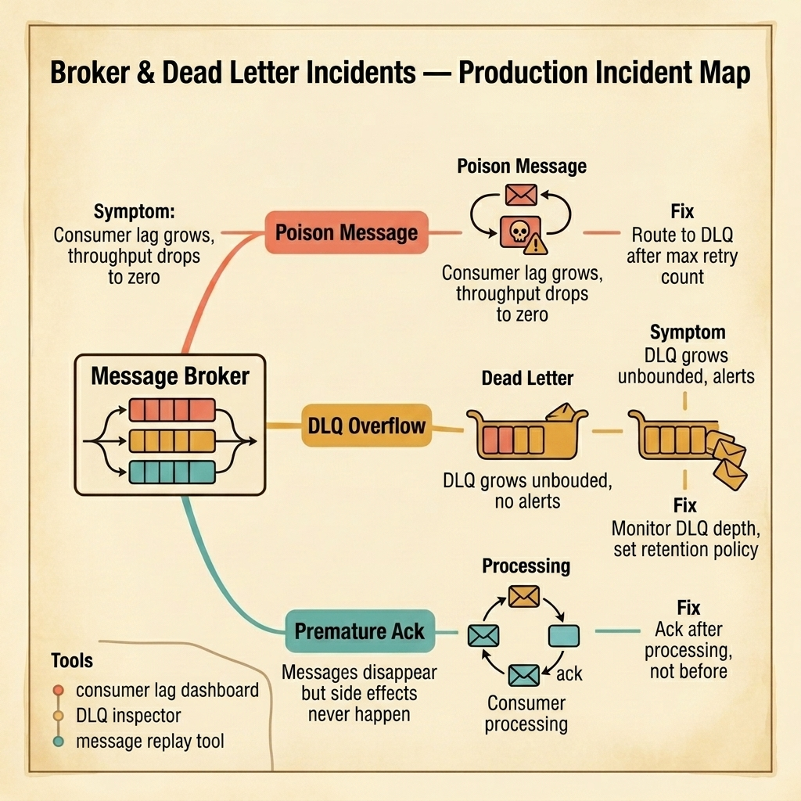

<!-- tags: golang, quiz -->
# 07 — Go Scenario Quiz: Broker & Dead Letter Incidents

> **Diagnostic Assessment**: Five incident scenarios testing your ability to diagnose poison message loops, dead letter queue overflow, and acknowledgment timing failures in message broker systems.

📅 Created: 2026-03-27 · 🔄 Updated: 2026-04-19 · ⏱️ 10 min read.

| Aspect | Detail |
| --- | --- |
| **Level** | Advanced |
| **Coverage** | Poison message detection, DLQ routing and monitoring, ack/nack semantics, consumer prefetch tuning |
| **Format** | 5 incident scenarios with diagnosis questions |

---

## 1. DEFINE

Broker incidents are amplifiers. A single bad message does not just fail — it blocks every message behind it. A dead letter queue without monitoring is a graveyard nobody visits. A premature acknowledgment deletes evidence before the crime is committed.

Three failure surfaces dominate:

- **Poison message loops**: A message fails deserialization. The consumer rejects it. The broker redelivers it. The consumer fails again. This loop repeats forever, blocking all messages behind it in the partition. Consumer lag climbs. Throughput drops to zero.
- **DLQ overflow**: Messages routed to the dead letter queue are "safe" — until nobody inspects them. The DLQ grows to millions of messages. Disk fills. The broker itself starts rejecting new messages because storage is exhausted.
- **Premature acknowledgment**: The consumer acks the message before processing it. If the processing step fails (database write, API call, file write), the message is gone. The side effect never happened. The data is silently lost.

### Assessment Boundaries

- Retry contracts: fixed, exponential, and jittered backoff strategies.
- DLQ routing thresholds and retention policies.
- Ack timing: before vs. after processing, and the tradeoff with at-least-once delivery.

## 2. VISUAL

The incident map below shows three failure surfaces that emerge from a message broker — poison message loops, DLQ overflow, and premature acknowledgment.



*Figure: A message broker routes messages to consumers. Three failure surfaces emerge — poison messages loop forever blocking the queue, dead letter queues overflow without monitoring, and premature acks delete messages before processing completes.*

```text
Incident Path Evaluations
├── Message Lifecycle
│   ├── Poison Message Detection
│   └── Retry Count Tracking
├── Dead Letter Queue
│   ├── DLQ Depth Monitoring
│   └── Retention Policy Enforcement
└── Ack Semantics
    ├── Pre-Processing vs. Post-Processing Ack
    └── Nack with Requeue Decisions
```

## 3. CODE

### Example 1: Basic — Retry-count-aware consumer with DLQ routing

> **Goal**: Demonstrate a consumer that tracks retry attempts and routes poison messages to a dead letter queue after a threshold.
> **Complexity**: Basic

```go
// broker_dead_letter_incidents.go — Consumer with retry tracking and DLQ routing
package scenarioquiz

import "context"

type Message struct {
	ID         string
	Body       []byte
	RetryCount int
}

type Broker interface {
	Ack(ctx context.Context, msgID string) error
	Nack(ctx context.Context, msgID string) error
	PublishToDLQ(ctx context.Context, msg Message) error
}

const maxRetries = 3

func ConsumeWithDLQ(ctx context.Context, broker Broker, msg Message, process func([]byte) error) error {
	if msg.RetryCount >= maxRetries {
		return broker.PublishToDLQ(ctx, msg)
	}
	if err := process(msg.Body); err != nil {
		return broker.Nack(ctx, msg.ID) // Broker will redeliver with incremented retry count.
	}
	return broker.Ack(ctx, msg.ID)
}
```

**Why?** The consumer checks the retry count before processing. If the message has been redelivered too many times, it routes to the DLQ instead of processing again. This prevents poison message loops from blocking the queue forever. The ack happens after successful processing — never before.

## 4. PITFALLS

| # | Severity | Defect | Impact | Fix |
| --- | --- | --- | --- | --- |
| 1 | 🔴 Fatal | No max retry count on consumer | Poison messages loop forever, blocking the queue | Set max retries and route to DLQ after threshold |
| 2 | 🔴 Fatal | Ack before processing completes | Message deleted before side effect happens; data silently lost | Ack only after successful processing |
| 3 | 🟡 Common | DLQ has no monitoring or retention policy | DLQ grows unbounded; disk fills; broker rejects new messages | Monitor DLQ depth and set retention TTL |

## 5. REF

| Resource | Link | Note |
| --- | --- | --- |
| RabbitMQ DLX | [https://www.rabbitmq.com/docs/dlx](https://www.rabbitmq.com/docs/dlx) | Dead letter exchange configuration |
| kafka-go Consumer Group | [https://github.com/segmentio/kafka-go](https://github.com/segmentio/kafka-go) | Offset management and consumer group semantics |
| AMQP 0-9-1 Reference | [https://www.rabbitmq.com/amqp-0-9-1-reference](https://www.rabbitmq.com/amqp-0-9-1-reference) | Ack, nack, and reject semantics |

## 6. RECOMMEND

| Extension | When to proceed | Rationale | File/Link |
| --- | --- | --- | --- |
| Messaging Lane | After failing scenarios | Re-read broker delivery semantics | [../../messaging/README.md](../../messaging/README.md) |
| Broker Module Quiz | Before attempting scenarios | Verify concept recall first | [../module/09-broker-foundations.md](../module/09-broker-foundations.md) |

## 7. QUIZ

### Incident Evaluation

1. **Incident**: Consumer lag for a single partition grows from 0 to 100,000 in 15 minutes. The consumer logs show `"json: cannot unmarshal string into Go value of type int"` repeating every 100ms. What is happening?
   - A. The producer is sending too fast.
   - B. A single poison message fails deserialization on every delivery attempt — the consumer rejects it, the broker redelivers, and the loop blocks all messages behind it in the partition.
   - C. The consumer needs more memory.
   - D. The partition is too large.

2. **Incident**: Your dead letter queue has 2 million messages. The broker's disk usage is at 95%. New publishes start failing with `"disk full"`. Nobody noticed the DLQ growth. What should you fix first?
   - A. Add more disk.
   - B. Set a retention policy on the DLQ (TTL or max depth) and add monitoring alerts on DLQ depth — then triage the existing messages to determine root cause.
   - C. Delete all DLQ messages immediately.
   - D. Increase the broker's memory.

3. **Incident**: A consumer processes a message and writes to the database. The database write succeeds. The consumer then tries to ack the message but the broker connection drops. The broker redelivers the message. The consumer processes it again, creating a duplicate database record. What pattern prevents this?
   - A. A larger ack timeout.
   - B. An idempotency guard on the consumer — check a processed-message store before running business logic, ensuring redelivery does not create duplicates.
   - C. A faster network.
   - D. Disabling redelivery.

4. **Incident**: A consumer acks messages in a batch of 100. If processing fails on message 50, the consumer has already acked messages 1–49. But the processing of messages 1–49 also depends on message 50 (they form a transaction group). What is the structural problem?
   - A. The batch size is too large.
   - B. Acking individual messages before the entire batch completes breaks transactional integrity — the consumer should ack the entire batch only after all messages in the group are successfully processed.
   - C. The messages are in the wrong order.
   - D. The consumer is too slow.

5. **Incident**: A consumer uses auto-ack mode (ack on delivery, before processing). During a spike, the consumer receives 10,000 messages. It processes 3,000 successfully before crashing. The remaining 7,000 messages are gone — already acked by the broker. What should change?
   - A. Add more consumers.
   - B. Disable auto-ack and switch to manual ack after processing — this ensures messages are only removed from the queue after the consumer confirms successful processing.
   - C. Increase consumer memory.
   - D. Reduce the batch size.

### Answer Key

1. **B**. A poison message that cannot be deserialized loops indefinitely. The consumer rejects, the broker redelivers, and all messages behind it are blocked. The fix is a max retry threshold that routes the poison message to a DLQ.

2. **B**. The immediate fix is a retention policy to prevent unbounded growth and monitoring to catch it early. Deleting all messages loses diagnostic information. After stabilizing, triage the DLQ messages to find the root cause.

3. **B**. In at-least-once delivery, redelivery after a successful processing + failed ack creates duplicates. The consumer must check an idempotency store before processing to handle this edge case.

4. **B**. Batch acking individual messages breaks transactional semantics when messages are interdependent. The fix is to treat the batch as a single unit — process all, then ack all, or nack the entire batch on failure.

5. **B**. Auto-ack removes messages from the queue on delivery, not on processing. If the consumer crashes mid-processing, all unprocessed but acked messages are lost. Manual ack after processing ensures the broker retains unprocessed messages.

---
