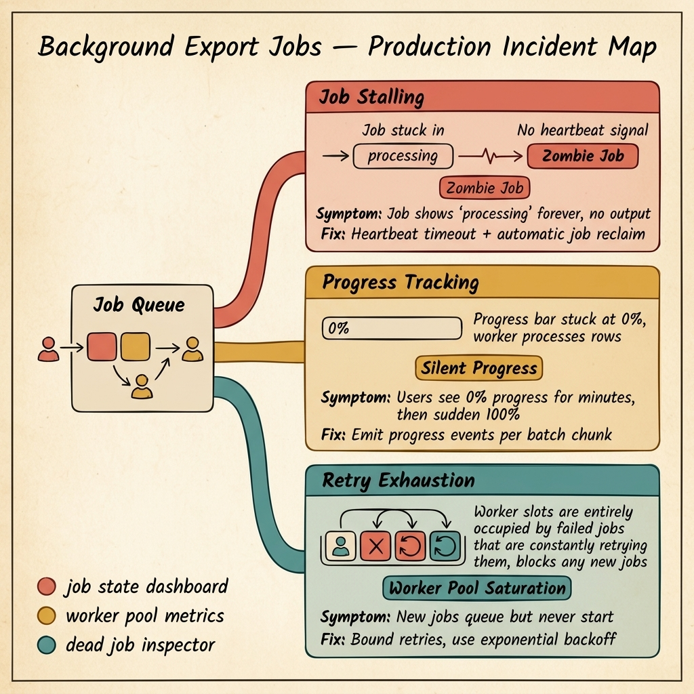

<!-- tags: golang, quiz -->
# 08 — Go Scenario Quiz: Background Export Jobs Incidents

> **Diagnostic Assessment**: Five incident scenarios testing your ability to diagnose job stalling, progress tracking failures, and worker pool saturation in background export systems.

📅 Created: 2026-03-27 · 🔄 Updated: 2026-04-19 · ⏱️ 10 min read.

| Aspect | Detail |
| --- | --- |
| **Level** | Intermediate |
| **Coverage** | Job heartbeat and reclaim, progress event emission, worker pool sizing, retry budget management |
| **Format** | 5 incident scenarios with diagnosis questions |

---

## 1. DEFINE

Background export jobs are fire-and-forget from the user's perspective. They click "Export," see a progress indicator, and wait. When the job works, nobody thinks about it. When it breaks, the user sees a spinner that never finishes — and has no way to know if the job is running, stuck, or dead.

Three failure surfaces dominate:

- **Zombie jobs**: A worker picks up a job, sets it to "processing," and then crashes. The job record still says "processing." No other worker picks it up because it looks active. It stays in this state forever.
- **Silent progress**: The worker processes 500,000 rows but only reports progress at the very end. The user sees 0% for four minutes, then a sudden jump to 100%. If the job fails at row 400,000, the user has no idea how far it got.
- **Worker pool saturation**: Failed jobs retry immediately. Each retry consumes a worker slot. After enough failures, all worker slots are occupied by retrying failed jobs. New jobs queue but never start.

### Assessment Boundaries

- Heartbeat protocols: how workers signal liveness.
- Progress emission: per-batch reporting vs. end-of-job reporting.
- Retry budgets: bounded retries with exponential backoff.

## 2. VISUAL

The incident map below shows three failure surfaces in a background job system — zombie jobs, silent progress, and worker pool saturation from retry storms.



*Figure: A job queue distributes work to workers. Three failure surfaces emerge — zombie jobs stuck in "processing" forever, silent progress that jumps from 0% to 100%, and retry storms that saturate all worker slots with failed jobs.*

```text
Incident Path Evaluations
├── Job Lifecycle
│   ├── Zombie Job Detection
│   └── Heartbeat Timeout Reclaim
├── Progress Reporting
│   ├── Per-Batch Progress Emission
│   └── User-Facing Progress Updates
└── Worker Pool Management
    ├── Retry Budget Enforcement
    └── Exponential Backoff Configuration
```

## 3. CODE

### Example 1: Basic — Job heartbeat with automatic reclaim

> **Goal**: Demonstrate a heartbeat mechanism that detects zombie jobs and reclaims them for processing by a different worker.
> **Complexity**: Basic

```go
// background_export_incidents.go — Heartbeat-based zombie job detection
package scenarioquiz

import (
	"context"
	"time"
)

type Job struct {
	ID            string
	Status        string
	LastHeartbeat time.Time
}

type JobStore interface {
	UpdateHeartbeat(ctx context.Context, jobID string) error
	FindZombieJobs(ctx context.Context, threshold time.Duration) ([]Job, error)
	ReclaimJob(ctx context.Context, jobID string) error
}

func RunWithHeartbeat(ctx context.Context, store JobStore, jobID string, work func(ctx context.Context) error) error {
	ticker := time.NewTicker(10 * time.Second)
	defer ticker.Stop()

	done := make(chan error, 1)
	go func() { done <- work(ctx) }()

	for {
		select {
		case err := <-done:
			return err
		case <-ticker.C:
			_ = store.UpdateHeartbeat(ctx, jobID)
		case <-ctx.Done():
			return ctx.Err()
		}
	}
}
```

**Why?** The worker sends a heartbeat every 10 seconds while processing. A separate reaper goroutine calls `FindZombieJobs` with a threshold (e.g., 30 seconds). Any job whose last heartbeat is older than the threshold is considered dead and reclaimed for another worker.

## 4. PITFALLS

| # | Severity | Defect | Impact | Fix |
| --- | --- | --- | --- | --- |
| 1 | 🔴 Fatal | No heartbeat or liveness check on running jobs | Zombie jobs stay "processing" forever; no retry | Heartbeat ticker + reaper that reclaims stale jobs |
| 2 | 🟡 Common | Progress reported only at job completion | Users see 0% for minutes then sudden 100%; no visibility on failures | Emit progress events per chunk (e.g., every 1000 rows) |
| 3 | 🟡 Common | Unbounded immediate retries on failed jobs | All worker slots consumed by failing retries; new jobs blocked | Limit retries with exponential backoff and a max retry count |

## 5. REF

| Resource | Link | Note |
| --- | --- | --- |
| Asynq | [https://github.com/hibiken/asynq](https://github.com/hibiken/asynq) | Go task queue with retry and dead letter support |
| Worker Patterns | [https://gobyexample.com/worker-pools](https://gobyexample.com/worker-pools) | Standard Go worker pool pattern |
| context Package | [https://pkg.go.dev/context](https://pkg.go.dev/context) | Cancellation and timeout propagation |

## 6. RECOMMEND

| Extension | When to proceed | Rationale | File/Link |
| --- | --- | --- | --- |
| Export Pipeline Lane | After failing scenarios | Re-read streaming and batch patterns | [../../export/README.md](../../export/README.md) |
| Background Jobs Module | Before attempting scenarios | Verify concept recall first | [../module/10-background-jobs-foundations.md](../module/10-background-jobs-foundations.md) |

## 7. QUIZ

### Incident Evaluation

1. **Incident**: A user reports that their export has been "processing" for 6 hours. The job dashboard shows status `processing` with last activity 5 hours ago. The worker that picked up the job crashed and was restarted by Kubernetes. Why is the job still "processing"?
   - A. The database is locked.
   - B. The job has no heartbeat mechanism — when the worker crashed, nobody detected the stale job. A reaper process with heartbeat-based zombie detection would have reclaimed it.
   - C. The export file is too large.
   - D. Kubernetes restarted the wrong pod.

2. **Incident**: Users complain that the export progress bar shows 0% for 3 minutes, then jumps to 100%. Some exports fail mid-way, and users have no idea how much was completed. What should you add?
   - A. A faster database.
   - B. Per-batch progress emission — the worker should report progress after each chunk (e.g., every 1000 rows) instead of only at job completion.
   - C. A loading animation.
   - D. More workers.

3. **Incident**: New export jobs queue but never start. The worker pool has 10 slots, and all 10 are occupied by jobs that keep failing and retrying immediately. What is the structural fix?
   - A. Add more workers.
   - B. Limit retry attempts per job with exponential backoff — after max retries, mark the job as failed and free the worker slot for new jobs.
   - C. Increase the queue size.
   - D. Restart all workers.

4. **Incident**: A job processes 1 million rows. At row 800,000, the database connection drops. The job fails. When the user retries, it starts from row 1 again. What pattern would prevent reprocessing 800,000 rows?
   - A. A larger database connection pool.
   - B. Checkpoint-based resumption — save the last successfully processed offset (row number) and resume from that point on retry instead of starting from the beginning.
   - C. A faster network.
   - D. More memory.

5. **Incident**: A worker picks up a job but the context has no deadline. The job queries a slow external API. The API hangs indefinitely. The worker goroutine is stuck forever, consuming a slot. What should you add?
   - A. A faster API.
   - B. A context timeout on the job — wrap the work function with `context.WithTimeout` so the job is cancelled if it exceeds the expected duration.
   - C. More goroutines.
   - D. A circuit breaker on the API client.

### Answer Key

1. **B**. Without heartbeats, a crashed worker leaves the job in "processing" state forever. A reaper that checks heartbeat timestamps would detect the stale job and reclaim it for another worker.

2. **B**. Reporting progress only at completion provides zero visibility during processing. Per-batch progress lets users see real-time movement and lets the system record how far a failed job progressed.

3. **B**. Unbounded immediate retries turn the worker pool into a retry loop. Exponential backoff with a max retry count ensures failed jobs eventually release their slots. Dead jobs are moved to a failed queue for inspection.

4. **B**. Checkpointing saves the last successfully processed offset. On retry, the job resumes from the checkpoint instead of reprocessing everything. This is critical for large exports that take minutes or hours.

5. **B**. A context with a deadline ensures the goroutine is not stuck indefinitely. The `select` statement in the worker should listen on `ctx.Done()` to terminate gracefully when the deadline expires.

---
