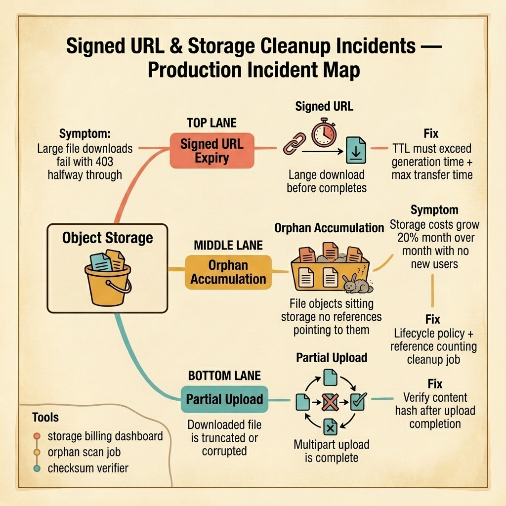

<!-- tags: golang, quiz -->
# 09 — Go Scenario Quiz: Signed URL & Storage Cleanup Incidents

> **Diagnostic Assessment**: Five incident scenarios testing your ability to diagnose signed URL expiry races, orphan file accumulation, and upload integrity failures in object storage systems.

📅 Created: 2026-03-27 · 🔄 Updated: 2026-04-19 · ⏱️ 10 min read.

| Aspect | Detail |
| --- | --- |
| **Level** | Intermediate |
| **Coverage** | Signed URL TTL calculation, orphan file lifecycle policies, multipart upload integrity, storage cost control |
| **Format** | 5 incident scenarios with diagnosis questions |

---

## 1. DEFINE

Object storage incidents are slow killers. The signed URL works for small files but expires halfway through a 2 GB download. The orphan files accumulate silently — no error, no alert — until the storage bill doubles. A multipart upload completes with a missing part, and the user downloads a corrupt file that passes no checksum.

Three failure surfaces dominate:

- **Signed URL expiry race**: The server generates a signed URL with a 5-minute TTL. The generation itself takes 2 minutes (query + export + upload). The user has 3 minutes to download a 2 GB file on a slow connection. The download fails at 60% with a `403 Forbidden`.
- **Orphan file accumulation**: Every export creates a file in object storage. Some exports fail after the file is uploaded but before the database record is written. The file has no reference. It sits in storage forever, accumulating monthly charges.
- **Partial upload corruption**: A multipart upload completes with 99 of 100 parts. The storage API marks it as complete because the final `CompleteMultipartUpload` call succeeded — but it only listed 99 parts. The user downloads a file missing its last chunk.

### Assessment Boundaries

- TTL calculation: generation time + transfer time + buffer.
- Orphan detection: reference counting vs. lifecycle policies.
- Upload integrity: part listing verification, content hash comparison.

## 2. VISUAL

The incident map below shows three failure surfaces in object storage systems — signed URL expiry races, orphan file accumulation, and partial upload corruption.



*Figure: Object storage serves files through signed URLs. Three failure surfaces emerge — URLs expire before large downloads complete, orphan files accumulate without references, and partial uploads produce corrupted files.*

```text
Incident Path Evaluations
├── URL Lifecycle
│   ├── TTL vs. Generation + Transfer Time
│   └── Clock Skew Between Server and Storage
├── Orphan Management
│   ├── Reference Counting Cleanup Jobs
│   └── Lifecycle Policy Configuration
└── Upload Integrity
    ├── Multipart Part Verification
    └── Content Hash Comparison
```

## 3. CODE

### Example 1: Basic — Signed URL with calculated TTL

> **Goal**: Demonstrate a TTL calculation that accounts for generation time and estimated transfer time to prevent expiry during download.
> **Complexity**: Basic

```go
// signed_url_storage_incidents.go — Calculate signed URL TTL based on file size
package scenarioquiz

import (
	"context"
	"time"
)

type StorageClient interface {
	GenerateSignedURL(ctx context.Context, bucket, key string, ttl time.Duration) (string, error)
}

func SignedURLWithSafeTTL(ctx context.Context, client StorageClient, bucket, key string, fileSizeBytes int64) (string, error) {
	// Assume minimum 1 MB/s download speed for worst-case clients.
	transferSeconds := fileSizeBytes / (1024 * 1024)
	if transferSeconds < 60 {
		transferSeconds = 60 // Minimum 60 seconds.
	}

	// Add 2x buffer for network variability.
	ttl := time.Duration(transferSeconds*2) * time.Second
	return client.GenerateSignedURL(ctx, bucket, key, ttl)
}
```

**Why?** The TTL scales with the file size. A 100 MB file gets a short TTL. A 2 GB file gets a proportionally longer TTL. The 2x buffer handles network variability. Without this, large file downloads fail halfway through when the URL expires.

## 4. PITFALLS

| # | Severity | Defect | Impact | Fix |
| --- | --- | --- | --- | --- |
| 1 | 🔴 Fatal | Fixed TTL that does not scale with file size | Large downloads fail with 403 before completion | Calculate TTL based on file size and expected transfer speed |
| 2 | 🟡 Common | No orphan cleanup job or lifecycle policy | Storage costs grow unbounded as unreferenced files accumulate | Schedule a cleanup job that deletes files with no database reference |
| 3 | 🟡 Common | No content hash verification after multipart upload | Corrupt files delivered to users without detection | Compare the uploaded file's hash with the expected hash after completion |

## 5. REF

| Resource | Link | Note |
| --- | --- | --- |
| AWS S3 Presigned URLs | [https://docs.aws.amazon.com/AmazonS3/latest/userguide/using-presigned-url.html](https://docs.aws.amazon.com/AmazonS3/latest/userguide/using-presigned-url.html) | TTL configuration and security |
| GCS Signed URLs | [https://cloud.google.com/storage/docs/access-control/signed-urls](https://cloud.google.com/storage/docs/access-control/signed-urls) | Google Cloud signed URL patterns |
| MinIO Go Client | [https://github.com/minio/minio-go](https://github.com/minio/minio-go) | S3-compatible Go client for local testing |

## 6. RECOMMEND

| Extension | When to proceed | Rationale | File/Link |
| --- | --- | --- | --- |
| Storage Lane | After failing scenarios | Re-read object storage patterns | [../../storage/README.md](../../storage/README.md) |
| Storage Module Quiz | Before attempting scenarios | Verify concept recall first | [../module/13-storage-foundations.md](../module/13-storage-foundations.md) |

## 7. QUIZ

### Incident Evaluation

1. **Incident**: Users report that large CSV exports (500 MB+) fail with a `403 Forbidden` error after downloading about 60%. Small exports (< 50 MB) work fine. The signed URLs have a fixed 5-minute TTL. What is the root cause?
   - A. The storage bucket permissions are wrong.
   - B. The 5-minute TTL expires before the large file download completes — the TTL must scale with the file size, accounting for the client's download speed.
   - C. The CSV file is corrupt.
   - D. The client's browser is caching the old URL.

2. **Incident**: Your storage bill has grown 30% month over month for 6 months. User count is flat. Investigation reveals 2 million files in the export bucket with no matching database records. What is the cause?
   - A. The storage provider is overcharging.
   - B. Files are uploaded during export jobs, but when the job fails after upload (e.g., database write failure), the file is never linked to a record — it becomes an orphan. No cleanup job exists to remove unreferenced files.
   - C. Users are uploading extra files.
   - D. The bucket is being accessed by another service.

3. **Incident**: A user downloads an exported Excel file. The file opens but is missing the last 3 sheets (of 20). The export job log shows "completed successfully." What is the likely cause?
   - A. The Excel library has a bug.
   - B. The multipart upload completed with missing parts — the final `CompleteMultipartUpload` listed fewer parts than the total, but the storage API accepted it. No post-upload hash verification detected the missing data.
   - C. The user's Excel version is old.
   - D. The file was compressed incorrectly.

4. **Incident**: A signed URL generated for a private file works in the server's local environment but returns `403 Forbidden` in production. The URL format is correct. The bucket policy allows presigned access. What should you check?
   - A. The bucket region.
   - B. The clock on the production server — if the server's clock is ahead of the storage provider's clock, the URL's `X-Amz-Date` is in the future, and the storage provider rejects it as invalid.
   - C. The file permissions.
   - D. The network firewall.

5. **Incident**: Your cleanup job deletes orphan files every night. After a deployment, users report that files uploaded during active export jobs are being deleted. The export takes 10 minutes, and the cleanup job runs while exports are in progress. What is the race condition?
   - A. The cleanup job is too aggressive.
   - B. The cleanup job considers any file without a database reference as an orphan — but files uploaded during an active export have not been linked to a record yet. The cleanup job must exclude files younger than the maximum expected export duration.
   - C. The database is slow.
   - D. The deployment broke the upload logic.

### Answer Key

1. **B**. A fixed TTL does not account for file size or download speed. Large files need longer TTLs. The fix is to calculate TTL based on `file_size / min_download_speed` plus a buffer.

2. **B**. Orphan files accumulate when the export pipeline fails after uploading the file but before linking it to a database record. A scheduled cleanup job that deletes files with no database reference prevents unbounded cost growth.

3. **B**. Multipart upload APIs accept the part list provided in the completion request. If the list is incomplete, the file is missing parts. A post-upload hash comparison catches this corruption before delivering the file to the user.

4. **B**. Clock skew between the server and the storage provider causes signed URL validation to fail. The `X-Amz-Date` (or equivalent) is computed from the server's clock. If it differs from the storage provider's clock by more than the allowed skew, the URL is rejected.

5. **B**. The cleanup job must account for the export pipeline's duration. A simple fix is to skip files younger than a threshold (e.g., 30 minutes). This prevents deleting files that are part of an in-progress export.

---
