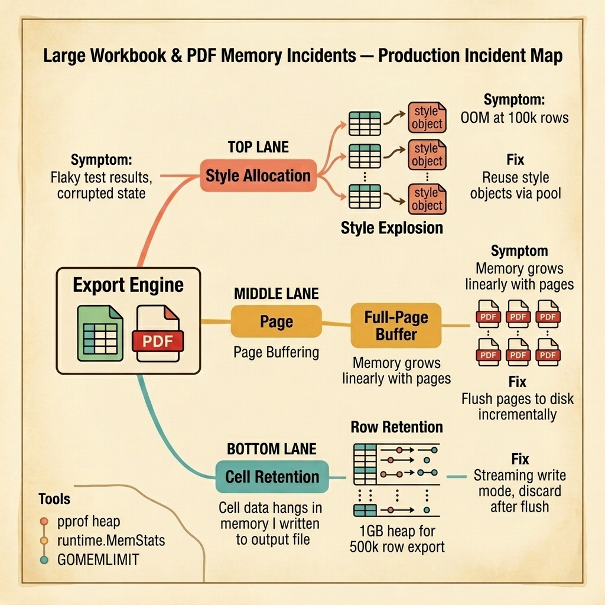

<!-- tags: golang, quiz -->
# 10 — Go Scenario Quiz: Large Workbook & PDF Memory Incidents

> **Diagnostic Assessment**: Five incident scenarios testing your ability to diagnose memory explosion during Excel/PDF generation from style allocation, page buffering, and row retention failures.

📅 Created: 2026-03-27 · 🔄 Updated: 2026-04-19 · ⏱️ 10 min read.

| Aspect | Detail |
| --- | --- |
| **Level** | Intermediate |
| **Coverage** | Excel style object pooling, PDF page flushing, streaming write modes, GOMEMLIMIT tuning |
| **Format** | 5 incident scenarios with diagnosis questions |

---

## 1. DEFINE

Workbook and PDF memory incidents follow a predictable pattern: the export works for 1,000 rows and crashes at 100,000. The code is correct — it just allocates memory for every row, every cell, and every style object without releasing any of it.

Three failure surfaces dominate:

- **Style explosion**: The Excel library creates a new style object for each cell. At 100,000 rows × 10 columns, that is 1 million style objects. Each style is a struct with font, border, fill, and alignment fields. The heap grows to gigabytes before the first row is written to disk.
- **Full-page buffering**: The PDF generator holds every page in memory until `Save()` is called. A 500-page report with embedded images consumes 2 GB of heap before any output is produced.
- **Row retention**: The spreadsheet writer keeps all row data in memory even after writing it to the output stream. A 500,000-row export holds 500,000 row structs that are never garbage collected because the writer still references them.

### Assessment Boundaries

- Style reuse patterns: create once, apply many times.
- Incremental flushing: write pages/rows to disk as they are generated.
- Streaming write mode: discard row data after flushing to output.

## 2. VISUAL

The incident map below traces three memory failure surfaces in export engines — style allocation explosion, full-page buffering, and row data retention.



*Figure: An export engine generating Excel/PDF files hits three memory failure surfaces — duplicate style objects explode the heap, PDF pages buffered in memory grow linearly, and row data retained after writing keeps the heap alive.*

```text
Incident Path Evaluations
├── Style Allocation
│   ├── Duplicate Style Object Creation
│   └── Style Pool Reuse Patterns
├── Page Buffering
│   ├── Full-Document Memory Hold
│   └── Incremental Page Flushing
└── Row Retention
    ├── Post-Write Reference Holding
    └── Streaming Discard Modes
```

## 3. CODE

### Example 1: Basic — Style reuse for Excel generation

> **Goal**: Demonstrate creating a style once and reusing it across all cells to prevent style object explosion.
> **Complexity**: Basic

```go
// workbook_memory_incidents.go — Reuse style objects to prevent heap explosion
package scenarioquiz

import "github.com/xuri/excelize/v2"

func ExportWithReusedStyle(f *excelize.File, sheet string, rows [][]string) error {
	// Create the style ONCE.
	style, err := f.NewStyle(&excelize.Style{
		Font:      &excelize.Font{Size: 11, Family: "Calibri"},
		Alignment: &excelize.Alignment{WrapText: true},
	})
	if err != nil {
		return err
	}

	for i, row := range rows {
		for j, cell := range row {
			cellRef, _ := excelize.CoordinatesToCellName(j+1, i+1)
			f.SetCellValue(sheet, cellRef, cell)
			f.SetCellStyle(sheet, cellRef, cellRef, style) // Reuse, not recreate.
		}
	}
	return nil
}
```

**Why?** Creating a new style per cell allocates a new struct each time. At 100k rows × 10 columns, that is 1 million allocations. Creating the style once and passing its ID to every cell reduces allocations to exactly 1.

## 4. PITFALLS

| # | Severity | Defect | Impact | Fix |
| --- | --- | --- | --- | --- |
| 1 | 🔴 Fatal | New style object created per cell | 1M+ allocations; OOM at 100k rows | Create style once, reuse style ID |
| 2 | 🔴 Fatal | All PDF pages held in memory until Save() | Linear memory growth; OOM on large reports | Flush pages to disk incrementally |
| 3 | 🟡 Common | GOMEMLIMIT not set in container | GC does not know about container memory limit; OOM before GC triggers | Set GOMEMLIMIT to 80% of container memory limit |

## 5. REF

| Resource | Link | Note |
| --- | --- | --- |
| excelize | [https://github.com/qax-os/excelize](https://github.com/qax-os/excelize) | Go Excel library with streaming write mode |
| go-pdf | [https://github.com/jung-kurt/gofpdf](https://github.com/jung-kurt/gofpdf) | PDF generation with page-level control |
| GOMEMLIMIT | [https://pkg.go.dev/runtime](https://pkg.go.dev/runtime) | Go runtime memory limit for GC tuning |

## 6. RECOMMEND

| Extension | When to proceed | Rationale | File/Link |
| --- | --- | --- | --- |
| Export Pipeline Lane | After failing scenarios | Re-read streaming write patterns | [../../export/README.md](../../export/README.md) |
| Memory Module Quiz | Before attempting scenarios | Verify concept recall first | [../module/14-memory-management-foundations.md](../module/14-memory-management-foundations.md) |

## 7. QUIZ

### Incident Evaluation

1. **Incident**: An Excel export OOMs at 80,000 rows. The pprof heap dump shows 800,000 `excelize.Style` struct allocations. The code creates a new style for each cell. What is the fix?
   - A. Add more memory to the container.
   - B. Create the style object once and reuse its ID for every cell — this reduces 800,000 allocations to 1.
   - C. Use a different Excel library.
   - D. Reduce the number of columns.

2. **Incident**: A PDF report with 300 pages and embedded images crashes with OOM. The memory grows linearly as pages are generated. No pages are written to disk until `Save()` is called. What should change?
   - A. Compress the images.
   - B. Flush pages to disk incrementally as they are generated instead of holding all pages in memory until the final save.
   - C. Use a smaller page size.
   - D. Remove the images.

3. **Incident**: A Go service running in a 512 MB container generates Excel exports. Exports under 50,000 rows work. At 60,000 rows, the container is OOM-killed (exit code 137). The Go process heap is 400 MB at the time of the kill. Why did it crash at 400 MB with a 512 MB limit?
   - A. The Excel library has a memory leak.
   - B. Without `GOMEMLIMIT`, the Go GC does not know about the container limit — it delays collection until heap reaches 2× the live set, which overshoots the container limit. Setting `GOMEMLIMIT` to ~400 MB forces earlier GC.
   - C. The container limit is too low.
   - D. The OS reserved too much memory.

4. **Incident**: An Excel export uses streaming write mode (`StreamWriter`). Memory usage is flat for the first 200,000 rows. At row 200,001, the developer adds a cell merge operation. Memory spikes immediately. Why?
   - A. Cell merge is a heavy operation.
   - B. Cell merge forces the stream writer to load all previous row data back into memory — merge operations require random access to the sheet, which breaks the streaming model.
   - C. The stream buffer overflowed.
   - D. The merge range is too large.

5. **Incident**: A CSV export streams rows through `csv.Writer` with a `bufio.Writer` underneath. Memory stays flat at 4 KB for 1 million rows. But when the developer switches to `excelize` without streaming mode, memory grows to 1.5 GB for the same data. What is the fundamental difference?
   - A. CSV is a simpler format.
   - B. `csv.Writer` + `bufio.Writer` writes each row to the output and discards it — `excelize` without streaming mode keeps all rows in memory for random access until `SaveAs()` is called.
   - C. The Excel format is larger.
   - D. The buffer size is different.

### Answer Key

1. **B**. Style objects are reusable. Creating one per cell is an O(rows × columns) allocation pattern. Creating one and reusing its ID reduces it to O(1).

2. **B**. Holding all pages in memory until `Save()` makes memory grow linearly with page count. Incremental flushing writes completed pages to disk and releases their memory.

3. **B**. The Go GC's default target is 2× the live heap. Without `GOMEMLIMIT`, it does not know about the 512 MB container limit and may not trigger collection until the heap exceeds the container's budget. `GOMEMLIMIT` informs the GC of the ceiling.

4. **B**. Streaming write mode is append-only. Operations that require random access (merge, conditional formatting on past rows) force the writer to rehydrate earlier data, breaking the streaming memory model.

5. **B**. CSV + bufio is a true streaming write — data flows through and is discarded. Excelize without streaming mode is a document model — all data lives in memory until the document is serialized.

---
