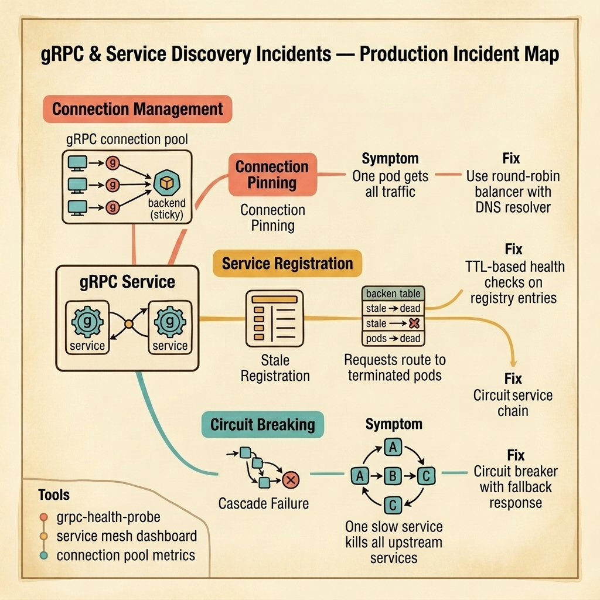

<!-- tags: golang, quiz -->
# 11 — Go Scenario Quiz: gRPC & Service Discovery Incidents

> **Diagnostic Assessment**: Five incident scenarios testing your ability to diagnose gRPC connection pinning, stale service registrations, and cascading failures across microservice meshes.

📅 Created: 2026-03-27 · 🔄 Updated: 2026-04-19 · ⏱️ 10 min read.

| Aspect | Detail |
| --- | --- |
| **Level** | Advanced |
| **Coverage** | gRPC load balancing, service registry TTLs, circuit breaker patterns, connection lifecycle management |
| **Format** | 5 incident scenarios with diagnosis questions |

---

## 1. DEFINE

gRPC and service discovery incidents are load distribution failures. The system works under low traffic. Under high traffic, one pod receives all requests while the others sit idle. Or worse — requests route to pods that no longer exist.

Three failure surfaces dominate:

- **Connection pinning**: gRPC uses long-lived HTTP/2 connections. The client opens one connection to a load balancer, and the load balancer forwards all requests on that connection to the same backend pod. Even with 10 backend pods, one pod gets 100% of the traffic from that client.
- **Stale service registration**: A pod is terminated. The service registry still has its entry. New clients resolve the stale entry and send requests to a dead pod. The requests timeout, retry, and timeout again.
- **Cascading failures**: Service A calls Service B. Service B is slow. Service A's goroutines pile up waiting for responses. Service A becomes slow. Service C calls Service A and also piles up. One slow service cascades failure through the entire service mesh.

### Assessment Boundaries

- Client-side vs. server-side load balancing in gRPC.
- Service registry health checks and TTL-based eviction.
- Circuit breaker state machine: closed → open → half-open.

## 2. VISUAL

The incident map below shows three failure surfaces in gRPC service meshes — connection pinning, stale registrations, and cascading failures.



*Figure: gRPC services communicate through a service mesh. Three failures emerge — connection pinning sends all traffic to one pod, stale registrations route to dead pods, and missing circuit breakers let one slow service cascade failures upstream.*

```text
Incident Path Evaluations
├── Connection Management
│   ├── HTTP/2 Connection Pinning
│   └── Client-Side Round-Robin Balancing
├── Service Registration
│   ├── TTL-Based Health Check Eviction
│   └── DNS Resolution Caching
└── Failure Isolation
    ├── Circuit Breaker State Machine
    └── Timeout Propagation Chains
```

## 3. CODE

### Example 1: Basic — gRPC client with round-robin balancing

> **Goal**: Demonstrate client-side load balancing to prevent connection pinning to a single backend pod.
> **Complexity**: Basic

```go
// grpc_discovery_incidents.go — Client-side round-robin to prevent connection pinning
package scenarioquiz

import (
	"google.golang.org/grpc"
	"google.golang.org/grpc/credentials/insecure"
)

func NewBalancedClient(target string) (*grpc.ClientConn, error) {
	return grpc.NewClient(
		target,
		grpc.WithDefaultServiceConfig(`{"loadBalancingPolicy":"round_robin"}`),
		grpc.WithTransportCredentials(insecure.NewCredentials()),
	)
}
```

**Why?** By default, gRPC picks one backend and sends all requests over the same HTTP/2 connection. Setting `round_robin` tells the client to resolve all backends via DNS and distribute requests across them. Each request goes to a different backend.

## 4. PITFALLS

| # | Severity | Defect | Impact | Fix |
| --- | --- | --- | --- | --- |
| 1 | 🔴 Fatal | Default gRPC load balancing policy (pick-first) | All traffic goes to one backend; other pods idle | Set `round_robin` or `grpclb` in service config |
| 2 | 🔴 Fatal | No circuit breaker between services | Slow downstream cascades failure to all upstream callers | Add circuit breaker that opens after N failures |
| 3 | 🟡 Common | Service registry entries not TTL-evicted | Stale entries route traffic to dead pods | TTL-based health checks with automatic deregistration |

## 5. REF

| Resource | Link | Note |
| --- | --- | --- |
| gRPC Load Balancing | [https://grpc.io/blog/grpc-load-balancing/](https://grpc.io/blog/grpc-load-balancing/) | Client-side vs. proxy-based balancing |
| Consul Service Mesh | [https://developer.hashicorp.com/consul](https://developer.hashicorp.com/consul) | Service discovery with health checks |
| gobreaker | [https://github.com/sony/gobreaker](https://github.com/sony/gobreaker) | Circuit breaker implementation for Go |

## 6. RECOMMEND

| Extension | When to proceed | Rationale | File/Link |
| --- | --- | --- | --- |
| gRPC Lane | After failing scenarios | Re-read gRPC connection management | [../../grpc/README.md](../../grpc/README.md) |
| gRPC Module Quiz | Before attempting scenarios | Verify concept recall first | [../module/15-grpc-foundations.md](../module/15-grpc-foundations.md) |

## 7. QUIZ

### Incident Evaluation

1. **Incident**: Your gRPC service has 5 backend pods. Metrics show pod-1 handling 100% of traffic while pods 2–5 are idle. The Kubernetes service is correctly configured. What is the most likely cause?
   - A. Pods 2–5 are unhealthy.
   - B. The gRPC client uses the default `pick_first` policy — it resolves one backend and sends all requests to it over a single HTTP/2 connection. Switching to `round_robin` distributes traffic across all resolved backends.
   - C. The load balancer is misconfigured.
   - D. The pods have different resource limits.

2. **Incident**: After a rolling deployment, some gRPC requests timeout with `UNAVAILABLE`. The old pods are terminated. The new pods are running. The service registry shows both old and new entries. What is happening?
   - A. The new pods are not ready.
   - B. The old pod entries are still in the registry — clients resolve them and send requests to terminated pods, which timeout. The registry needs TTL-based eviction that deregisters entries when health checks fail.
   - C. The deployment is too fast.
   - D. The DNS cache is stale.

3. **Incident**: Service A calls Service B. Service B deploys a slow query that takes 30 seconds. Service A's goroutine pool fills up waiting for Service B. Service C calls Service A and also hangs. The entire mesh degrades. What pattern prevents this?
   - A. A faster database for Service B.
   - B. A circuit breaker on Service A's calls to Service B — after N consecutive failures or timeouts, the circuit opens and Service A returns a fallback response immediately instead of waiting.
   - C. More goroutines in Service A.
   - D. A bigger timeout on Service C.

4. **Incident**: Your gRPC client uses `round_robin` and resolves backends via DNS. After a pod scale-up from 3 to 6 pods, the client still sends traffic to only 3 pods. The new pods are healthy. What is wrong?
   - A. The new pods are not registered.
   - B. The gRPC client caches DNS resolutions — it resolved 3 backends at startup and does not re-resolve. The client needs a DNS resolver with a TTL that triggers periodic re-resolution.
   - C. The round-robin is broken.
   - D. The pods have different IPs.

5. **Incident**: A circuit breaker on Service A is configured with a failure threshold of 5. Service B returns transient `UNAVAILABLE` errors during a deployment (3 errors). The circuit opens and stays open for 60 seconds. During those 60 seconds, all requests to Service B fail immediately. Was the threshold correct?
   - A. The threshold should be 1.
   - B. The threshold of 5 is reasonable, but the circuit opened on 3 transient errors because the error rate exceeded the percentage threshold — a count-based threshold alone is insufficient. Combine it with an error rate threshold (e.g., 50% of requests in a window).
   - C. The circuit should never open.
   - D. The timeout is too long.

### Answer Key

1. **B**. gRPC's `pick_first` policy selects one backend and pins all traffic to it. `round_robin` resolves all backends and distributes requests across them.

2. **B**. Stale registry entries point to terminated pods. TTL-based health checks deregister entries when pods stop responding, preventing clients from resolving dead backends.

3. **B**. A circuit breaker isolates the failure. When Service B is slow, the circuit opens and Service A returns a fallback immediately instead of waiting 30 seconds per request and exhausting its goroutine pool.

4. **B**. gRPC caches DNS resolutions. Without periodic re-resolution, new pods discovered after the initial resolve are invisible to the client. Configure the resolver with a TTL (e.g., 30 seconds).

5. **B**. A fixed count threshold without considering the total request volume opens the circuit too aggressively during brief transient errors. An error rate threshold (e.g., 50% of requests in a 10-second window) is more resilient to transient spikes.

---
