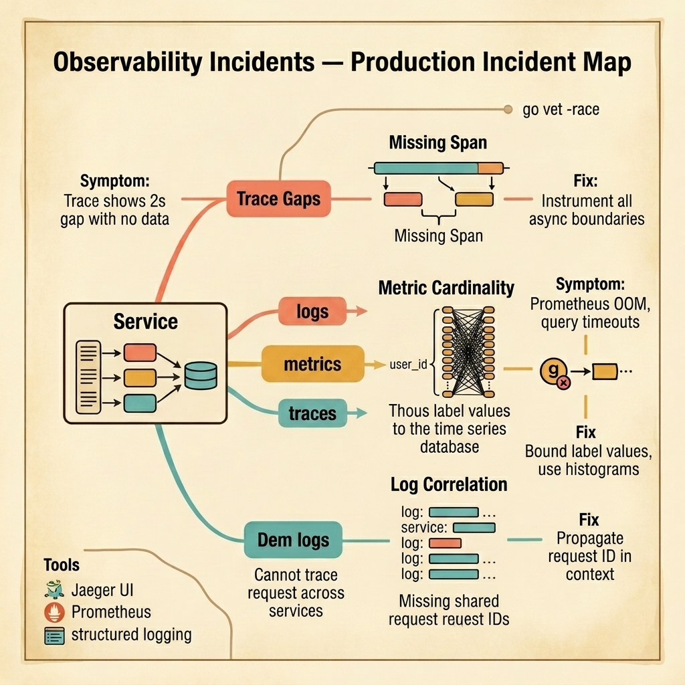

<!-- tags: golang, quiz -->
# 12 — Go Scenario Quiz: Observability Incidents

> **Diagnostic Assessment**: Five incident scenarios testing your ability to diagnose missing trace spans, metric cardinality explosions, and log correlation failures in production Go services.

📅 Created: 2026-03-27 · 🔄 Updated: 2026-04-19 · ⏱️ 10 min read.

| Aspect | Detail |
| --- | --- |
| **Level** | Intermediate |
| **Coverage** | Distributed tracing gaps, metric label cardinality, structured log correlation, async boundary instrumentation |
| **Format** | 5 incident scenarios with diagnosis questions |

---

## 1. DEFINE

Observability incidents are meta-failures — the system itself is broken, but you cannot see it because the observability layer is also broken. A missing span hides where the latency lives. A cardinality explosion crashes the metrics backend. Uncorrelated logs make cross-service debugging impossible.

Three failure surfaces dominate:

- **Missing trace spans**: A distributed trace shows Service A calling Service B, but there is a 2-second gap with no data between them. The gap is a goroutine that calls an external API without creating a child span. The trace looks like Service B is slow, but the actual bottleneck is an uninstrumented call hidden inside Service A.
- **Metric cardinality explosion**: A developer adds a `user_id` label to a Prometheus counter. With 500,000 users, that creates 500,000 unique time series. Prometheus OOMs. Grafana dashboards timeout. All alerting stops.
- **Uncorrelated logs**: Service A logs a request. Service B logs the processing of that request. But neither log entry has a shared request ID. When something goes wrong, the engineer cannot connect the two log entries across services.

### Assessment Boundaries

- Span creation at every async boundary (goroutine, message publish, cron job).
- Label cardinality budgets: bound label values to known enums or buckets.
- Request ID propagation through context across service boundaries.

## 2. VISUAL

The incident map below shows three failure surfaces in the observability stack — missing trace spans, cardinality explosions, and uncorrelated logs.



*Figure: A service emitting logs, metrics, and traces hits three observability failures — missing spans hide latency sources, high-cardinality labels crash the metrics backend, and missing request IDs make cross-service log correlation impossible.*

```text
Incident Path Evaluations
├── Trace Completeness
│   ├── Uninstrumented Async Boundaries
│   └── Missing Span Context Propagation
├── Metric Cardinality
│   ├── Unbounded Label Values (user_id, URL path)
│   └── Histogram Bucket Configuration
└── Log Correlation
    ├── Request ID Propagation Across Services
    └── Structured Logging Field Consistency
```

## 3. CODE

### Example 1: Basic — Request ID middleware for log correlation

> **Goal**: Demonstrate a middleware that injects a request ID into the context for cross-service log correlation.
> **Complexity**: Basic

```go
// observability_incidents.go — Request ID injection for correlated logging
package scenarioquiz

import (
	"context"
	"net/http"

	"github.com/google/uuid"
)

type ctxKey string

const requestIDKey ctxKey = "request_id"

func RequestIDMiddleware(next http.Handler) http.Handler {
	return http.HandlerFunc(func(w http.ResponseWriter, r *http.Request) {
		id := r.Header.Get("X-Request-ID")
		if id == "" {
			id = uuid.New().String()
		}
		ctx := context.WithValue(r.Context(), requestIDKey, id)
		w.Header().Set("X-Request-ID", id)
		next.ServeHTTP(w, r.WithContext(ctx))
	})
}

func GetRequestID(ctx context.Context) string {
	if v, ok := ctx.Value(requestIDKey).(string); ok {
		return v
	}
	return ""
}
```

**Why?** Every log entry in the service includes the request ID from context. When the service calls another service, it passes the `X-Request-ID` header. The downstream service extracts it and uses the same ID. Now both services' logs share a correlation key.

## 4. PITFALLS

| # | Severity | Defect | Impact | Fix |
| --- | --- | --- | --- | --- |
| 1 | 🔴 Fatal | `user_id` used as a Prometheus label | 500k unique time series; Prometheus OOM | Use bounded labels (status, method, route) |
| 2 | 🟡 Common | Goroutines launched without child spans | Trace gaps hide where latency lives | Create a child span before spawning the goroutine |
| 3 | 🟡 Common | No request ID propagated across services | Cannot correlate logs between Service A and B | Inject X-Request-ID in middleware, propagate in headers |

## 5. REF

| Resource | Link | Note |
| --- | --- | --- |
| OpenTelemetry Go | [https://opentelemetry.io/docs/languages/go/](https://opentelemetry.io/docs/languages/go/) | Tracing, metrics, and log instrumentation |
| Prometheus Best Practices | [https://prometheus.io/docs/practices/naming/](https://prometheus.io/docs/practices/naming/) | Label cardinality guidelines |
| Zap Logger | [https://github.com/uber-go/zap](https://github.com/uber-go/zap) | Structured logging for Go |

## 6. RECOMMEND

| Extension | When to proceed | Rationale | File/Link |
| --- | --- | --- | --- |
| Observability Lane | After failing scenarios | Re-read tracing and metrics patterns | [../../observability/README.md](../../observability/README.md) |
| Observability Module Quiz | Before attempting scenarios | Verify concept recall first | [../module/16-observability-foundations.md](../module/16-observability-foundations.md) |

## 7. QUIZ

### Incident Evaluation

1. **Incident**: A trace shows Service A → Service B with a 3-second gap between them. Service B's span starts immediately when it receives the request. Where is the missing time?
   - A. Network latency.
   - B. An uninstrumented call inside Service A — a goroutine calls an external API between receiving the response from Service B and returning to the caller, but no span covers that call. The gap is invisible in the trace.
   - C. The tracing backend is slow.
   - D. Service B's clock is wrong.

2. **Incident**: Prometheus OOMs every 4 hours. A new metric `api_requests_total{user_id="..."}` was added last week. The service has 200,000 active users. What is the fix?
   - A. Add more memory to Prometheus.
   - B. Remove `user_id` from the metric label — it creates 200,000 unique time series per metric. Use bounded labels like `status_code`, `method`, or `endpoint`.
   - C. Reduce the scrape interval.
   - D. Archive old metrics.

3. **Incident**: A user reports a 500 error. You find the error in Service A's logs. The log says "upstream call failed." Service B has no matching error log for that timestamp. You cannot trace the request across services. What is missing?
   - A. More detailed error messages.
   - B. A shared request ID — Service A should propagate a request ID to Service B via headers, and both services should include it in every log entry.
   - C. Centralized logging.
   - D. Log rotation configuration.

4. **Incident**: A cron job runs every 5 minutes and processes a batch of records. The job does not create a trace. When the job fails, there is no trace to inspect — only a log line "batch failed." What should the job do?
   - A. Log more details.
   - B. Create a root span at the start of the job and child spans for each batch operation — this creates a trace that shows exactly which step failed and how long each step took.
   - C. Increase the cron frequency.
   - D. Add a retry.

5. **Incident**: A histogram metric `http_request_duration_seconds` has 50 buckets. With 100 routes and 5 HTTP methods, the total time series count is `50 × 100 × 5 = 25,000`. Prometheus query latency has increased 10×. What should you do?
   - A. Add more Prometheus replicas.
   - B. Reduce the bucket count to the 8–10 most useful boundaries, group similar routes into broader categories, and use the `le` label only for percentile queries that need it.
   - C. Increase the query timeout.
   - D. Switch to a different metrics backend.

### Answer Key

1. **B**. Uninstrumented calls create invisible gaps in traces. Every async boundary — goroutine, message publish, external API call — needs a child span to make the full latency visible.

2. **B**. High-cardinality labels (user IDs, URLs, UUIDs) create a unique time series per value. With 200,000 users, that is 200,000 series per metric. Prometheus is designed for bounded label values.

3. **B**. Without a shared request ID, logs from different services cannot be correlated. The middleware injects a request ID, propagates it in headers, and both services include it in every structured log entry.

4. **B**. Background jobs and cron tasks need root spans just like HTTP handlers need spans. Without them, failures are invisible to the tracing system and can only be diagnosed through logs.

5. **B**. Cardinality = buckets × routes × methods × labels. Reducing any dimension reduces the total. The most impactful change is usually reducing bucket count and grouping routes.

---
