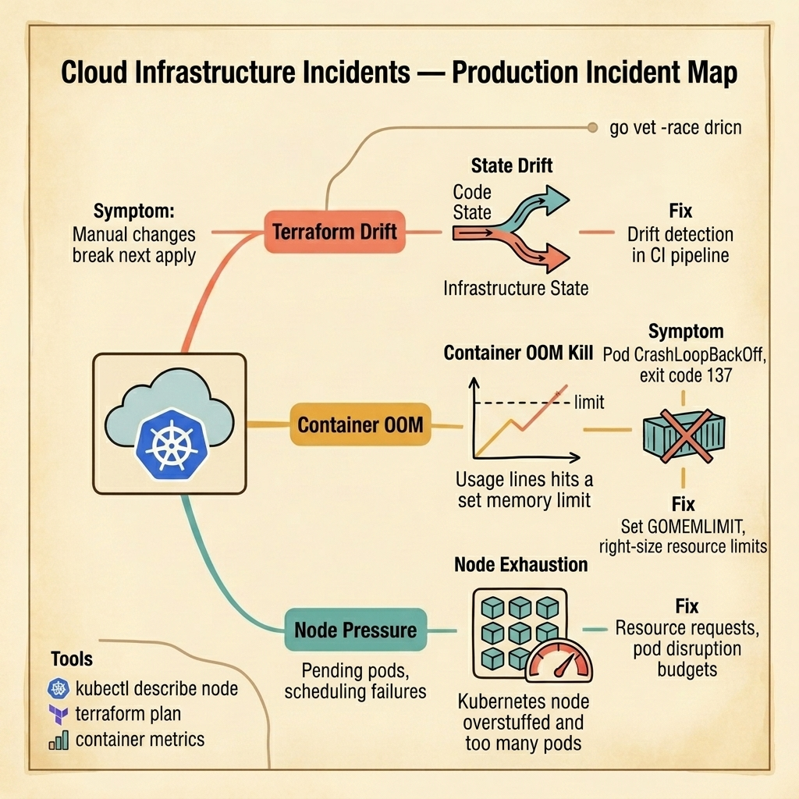

<!-- tags: golang, quiz -->
# 13 — Go Scenario Quiz: Cloud Infrastructure Incidents

> **Diagnostic Assessment**: Five incident scenarios testing your ability to diagnose Terraform state drift, container OOM kills, and Kubernetes node pressure in cloud-native Go deployments.

📅 Created: 2026-03-27 · 🔄 Updated: 2026-04-19 · ⏱️ 10 min read.

| Aspect | Detail |
| --- | --- |
| **Level** | Advanced |
| **Coverage** | Infrastructure-as-code drift detection, container memory limits vs. GOMEMLIMIT, node resource scheduling, pod disruption budgets |
| **Format** | 5 incident scenarios with diagnosis questions |

---

## 1. DEFINE

Cloud infrastructure incidents sit one layer below the application code. The Go service is correct. The container configuration is wrong. The code runs perfectly in local tests and crashes in production because the production environment has constraints that the developer never sees.

Three failure surfaces dominate:

- **Terraform state drift**: An engineer makes a manual change in the cloud console. Terraform's state file does not reflect the change. The next `terraform apply` either reverts the manual change (breaking production) or fails with a conflict that nobody understands.
- **Container OOM kill**: A Go service runs inside a container with a 512 MB memory limit. The Go garbage collector does not know about this limit. It delays collection until the heap reaches 2× the live set — which overshoots the container limit. The container runtime kills the process with exit code 137.
- **Node pressure**: A Kubernetes node has 16 pods requesting 500 MB each. The node has 4 GB of allocatable memory. A new pod is scheduled but cannot start because all memory is requested. The pod stays in `Pending` state while existing pods are underutilized.

### Assessment Boundaries

- `terraform plan` drift detection in CI pipelines.
- `GOMEMLIMIT` alignment with container memory limits.
- Kubernetes resource requests vs. limits and scheduling behavior.

## 2. VISUAL

The incident map below shows three failure surfaces in cloud infrastructure — Terraform drift, container OOM kills, and Kubernetes node exhaustion.



*Figure: A Kubernetes cluster running Go services hits three infrastructure failures — manual console changes drift from Terraform state, Go GC overshoots container memory limits, and over-requested node resources leave pods pending.*

```text
Incident Path Evaluations
├── Infrastructure as Code
│   ├── Terraform State Drift Detection
│   └── Manual Console Change Tracking
├── Container Memory
│   ├── GOMEMLIMIT vs. Container Limit
│   └── GC Trigger Behavior in Containers
└── Node Scheduling
    ├── Resource Request vs. Limit
    └── Pod Disruption Budget Configuration
```

## 3. CODE

### Example 1: Basic — Dockerfile with GOMEMLIMIT for container-aware GC

> **Goal**: Demonstrate setting GOMEMLIMIT in a container to align the Go GC with the container's memory limit.
> **Complexity**: Basic

```dockerfile
# Dockerfile — Set GOMEMLIMIT for container-aware GC
FROM golang:1.22-alpine AS builder
WORKDIR /app
COPY go.mod go.sum ./
RUN go mod download
COPY . .
RUN CGO_ENABLED=0 go build -o /service ./cmd/server

FROM alpine:3.19
COPY --from=builder /service /service
# Container limit is 512Mi. Set GOMEMLIMIT to 80% (410Mi).
ENV GOMEMLIMIT=410MiB
EXPOSE 8080
CMD ["/service"]
```

**Why?** Without `GOMEMLIMIT`, the Go GC targets 2× the live heap. If the live heap is 300 MB, the GC triggers at 600 MB — which exceeds the 512 MB container limit. Setting `GOMEMLIMIT=410MiB` forces the GC to collect earlier, keeping memory under the container ceiling.

## 4. PITFALLS

| # | Severity | Defect | Impact | Fix |
| --- | --- | --- | --- | --- |
| 1 | 🔴 Fatal | No `GOMEMLIMIT` in containerized Go services | GC overshoots container limit; OOM kill (exit code 137) | Set GOMEMLIMIT to 80% of container memory limit |
| 2 | 🔴 Fatal | No drift detection in CI for Terraform | Manual changes break next apply | Run `terraform plan` in CI and fail on drift |
| 3 | 🟡 Common | Resource requests set equal to limits | No burst capacity; pods scheduled on oversized nodes | Set requests to typical usage, limits to peak usage |

## 5. REF

| Resource | Link | Note |
| --- | --- | --- |
| GOMEMLIMIT | [https://pkg.go.dev/runtime](https://pkg.go.dev/runtime) | Go runtime memory limit documentation |
| Terraform Best Practices | [https://developer.hashicorp.com/terraform/language](https://developer.hashicorp.com/terraform/language) | State management and drift detection |
| K8s Resource Management | [https://kubernetes.io/docs/concepts/configuration/manage-resources-containers/](https://kubernetes.io/docs/concepts/configuration/manage-resources-containers/) | Requests, limits, and scheduling |

## 6. RECOMMEND

| Extension | When to proceed | Rationale | File/Link |
| --- | --- | --- | --- |
| DevOps Lane | After failing scenarios | Re-read container and IaC patterns | [../../devops/README.md](../../devops/README.md) |
| Cloud Infra Module Quiz | Before attempting scenarios | Verify concept recall first | [../module/17-cloud-infra-foundations.md](../module/17-cloud-infra-foundations.md) |

## 7. QUIZ

### Incident Evaluation

1. **Incident**: A Go service in a 512 MB container crashes with exit code 137. The application logs show no error. `kubectl describe pod` shows `OOMKilled`. The pprof heap dump (captured before the crash) shows 350 MB live heap. Why did it crash at 350 MB with a 512 MB limit?
   - A. The application has a memory leak.
   - B. Without `GOMEMLIMIT`, the GC targets 2× live heap (700 MB) before triggering collection — this overshoots the 512 MB limit. Setting `GOMEMLIMIT=410MiB` forces the GC to collect before hitting the ceiling.
   - C. The container limit is too low.
   - D. Another process in the container used memory.

2. **Incident**: An engineer fixes a security group rule in the AWS console. The next morning, the CI pipeline runs `terraform apply` and reverts the fix. Production traffic fails. What should have happened?
   - A. The engineer should not use the console.
   - B. The CI pipeline should run `terraform plan` first and fail if it detects drift — this alerts the team that the state file is out of sync with the actual infrastructure before applying any changes.
   - C. The security group should be immutable.
   - D. The pipeline should skip security groups.

3. **Incident**: A new pod stays in `Pending` state. `kubectl describe pod` shows `Insufficient memory`. The node has 8 GB total, 6 GB already requested by existing pods, and only 2 GB available. The new pod requests 3 GB. What should you adjust?
   - A. Add a new node.
   - B. Review whether existing pods' resource requests match their actual usage — if pods request 1 GB but use 200 MB, reducing requests frees scheduling capacity without affecting running pods.
   - C. Increase the node's memory.
   - D. Delete other pods.

4. **Incident**: During a rolling deployment, all pods of a service are terminated simultaneously. The service has 100% downtime for 30 seconds until new pods are ready. What Kubernetes resource prevents this?
   - A. A readiness probe.
   - B. A PodDisruptionBudget that sets `minAvailable: 1` (or a percentage) — this ensures Kubernetes never terminates all pods at once during voluntary disruptions like deployments.
   - C. A longer termination grace period.
   - D. A horizontal pod autoscaler.

5. **Incident**: A Go service uses 100 MB of memory under normal load. The container request is set to 100 MB and the limit is set to 100 MB (request = limit). During a traffic spike, the service needs 200 MB temporarily. The container is OOM-killed. What is the better configuration?
   - A. Set both to 200 MB.
   - B. Set the request to 100 MB (typical usage for scheduling) and the limit to 256 MB (peak usage ceiling) — this allows burst capacity while keeping scheduling efficient.
   - C. Remove the limit entirely.
   - D. Add horizontal autoscaling.

### Answer Key

1. **B**. The Go GC without `GOMEMLIMIT` does not know about the container limit. It calculates its next GC target based on heap growth, which can overshoot the container's memory ceiling. `GOMEMLIMIT` informs the GC.

2. **B**. Drift detection in CI catches manual changes before they are overwritten by Terraform. The pipeline should fail on drift and alert the team to reconcile the state file with the actual infrastructure.

3. **B**. Resource requests are scheduling contracts. If pods request more than they use, the node appears full but is actually underutilized. Right-sizing requests based on actual usage improves scheduling density.

4. **B**. A PodDisruptionBudget prevents Kubernetes from terminating more than the allowed number of pods during voluntary disruptions. This ensures at least one pod is always available during deployments.

5. **B**. Setting request = limit (guaranteed QoS) prevents bursting. Separating request (scheduling) from limit (ceiling) allows temporary memory spikes without OOM kills while keeping scheduling efficient.

---
