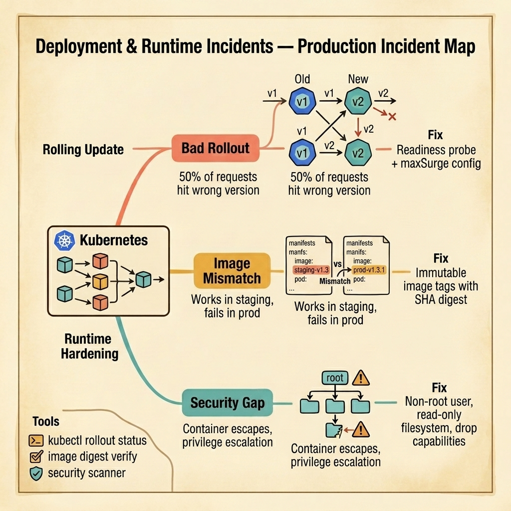

<!-- tags: golang, quiz -->
# 14 — Go Scenario Quiz: Deployment & Runtime Incidents

> **Diagnostic Assessment**: Five incident scenarios testing your ability to diagnose rolling update failures, container image mismatches, and runtime security hardening gaps in Kubernetes-deployed Go services.

📅 Created: 2026-03-27 · 🔄 Updated: 2026-04-19 · ⏱️ 10 min read.

| Aspect | Detail |
| --- | --- |
| **Level** | Advanced |
| **Coverage** | Rolling update strategies, readiness probes, immutable image tags, container security contexts, pod disruption budgets |
| **Format** | 5 incident scenarios with diagnosis questions |

---

## 1. DEFINE

Deployment incidents are the most stressful failures because they happen during the one moment when engineers are actively watching the system. A bad rollout sends traffic to pods that are not ready. An image tag mismatch means the code that passed staging tests is not the code running in production. A missing security context turns every container into a privilege escalation vector.

Three failure surfaces dominate:

- **Bad rollout**: A rolling update replaces old pods with new ones. But the new pods start receiving traffic before they finish initializing (database connections, cache warming, config loading). Users see 500 errors for the first 30 seconds after each pod swap.
- **Image mismatch**: The CI pipeline builds an image tagged `v1.3`. An engineer manually pushes a hotfix to the same tag. Staging runs `v1.3` (the original). Production pulls `v1.3` (the hotfix). The two environments run different code with the same tag.
- **Security gap**: The container runs as root. The filesystem is writable. All Linux capabilities are enabled. A single vulnerability in a dependency gives an attacker full control of the host node.

### Assessment Boundaries

- Readiness probes: what they check and when they gate traffic.
- Immutable image references: SHA digests vs. mutable tags.
- Security contexts: non-root user, read-only filesystem, dropped capabilities.

## 2. VISUAL

The incident map below shows three deployment failure surfaces — bad rollouts, image mismatches, and runtime security gaps.



*Figure: A Kubernetes cluster deploying Go services hits three failure surfaces — rolling updates send traffic to unready pods, mutable image tags create staging/prod divergence, and missing security contexts enable container escapes.*

```text
Incident Path Evaluations
├── Rolling Update
│   ├── Readiness Probe Configuration
│   └── MaxSurge and MaxUnavailable Tuning
├── Image Management
│   ├── Mutable Tag Divergence
│   └── SHA Digest Pinning
└── Runtime Hardening
    ├── Non-Root User Enforcement
    └── Read-Only Filesystem and Capability Drops
```

## 3. CODE

### Example 1: Basic — Readiness probe with dependency check

> **Goal**: Demonstrate a readiness probe that verifies the service can handle traffic by checking critical dependencies.
> **Complexity**: Basic

```go
// deployment_runtime_incidents.go — Readiness probe that checks database connectivity
package scenarioquiz

import (
	"database/sql"
	"net/http"
)

func ReadinessHandler(db *sql.DB) http.HandlerFunc {
	return func(w http.ResponseWriter, r *http.Request) {
		if err := db.PingContext(r.Context()); err != nil {
			http.Error(w, "not ready: db unreachable", http.StatusServiceUnavailable)
			return
		}
		w.WriteHeader(http.StatusOK)
	}
}
```

**Why?** Kubernetes sends traffic to a pod only after the readiness probe succeeds. If the probe is a simple TCP check, it passes before the application initializes. A probe that checks the database connection ensures traffic arrives only when the service can actually process requests.

## 4. PITFALLS

| # | Severity | Defect | Impact | Fix |
| --- | --- | --- | --- | --- |
| 1 | 🔴 Fatal | Readiness probe is a TCP check instead of an app-level check | Traffic hits pods before app initializes; 500 errors during rollout | Use HTTP readiness probe that checks critical dependencies |
| 2 | 🔴 Fatal | Mutable image tags (`:latest`, `:v1.3`) across environments | Staging and production run different code with the same tag | Use immutable SHA digests or unique build tags |
| 3 | 🟡 Common | Container runs as root with all capabilities | Vulnerability in any dependency escalates to host-level access | Set `runAsNonRoot`, `readOnlyRootFilesystem`, drop all capabilities |

## 5. REF

| Resource | Link | Note |
| --- | --- | --- |
| K8s Probes | [https://kubernetes.io/docs/tasks/configure-pod-container/configure-liveness-readiness-startup-probes/](https://kubernetes.io/docs/tasks/configure-pod-container/configure-liveness-readiness-startup-probes/) | Readiness and liveness probe configuration |
| Container Security | [https://kubernetes.io/docs/concepts/security/pod-security-standards/](https://kubernetes.io/docs/concepts/security/pod-security-standards/) | Pod security standards |
| OCI Image Spec | [https://github.com/opencontainers/image-spec](https://github.com/opencontainers/image-spec) | Image digest and immutability |

## 6. RECOMMEND

| Extension | When to proceed | Rationale | File/Link |
| --- | --- | --- | --- |
| DevOps Lane | After failing scenarios | Re-read deployment and security patterns | [../../devops/README.md](../../devops/README.md) |
| Deployment Module Quiz | Before attempting scenarios | Verify concept recall first | [../module/18-deployment-foundations.md](../module/18-deployment-foundations.md) |

## 7. QUIZ

### Incident Evaluation

1. **Incident**: After a rolling deployment, 30% of requests return 500 errors for 20 seconds, then the error rate drops to zero. The new pods start receiving traffic immediately. The readiness probe is a TCP check on port 8080. What is the root cause?
   - A. The new code has a bug.
   - B. The TCP readiness probe succeeds as soon as the port is open — before the application finishes initializing (database connections, cache warming). An HTTP probe that checks application health would gate traffic until the app is ready.
   - C. The deployment is too fast.
   - D. The load balancer is misconfigured.

2. **Incident**: A critical bug is found in production. An engineer builds a hotfix and pushes it to the same image tag `myapp:v2.1`. Production pulls the updated image. Two weeks later, a new node joins the cluster, pulls `myapp:v2.1` from the registry cache, and gets the original (non-hotfix) version. What caused the divergence?
   - A. The registry cached the old image.
   - B. Mutable image tags allow different content under the same name — the registry may serve a cached layer or a different push. Using SHA digests (`myapp@sha256:abc123...`) guarantees the exact image is pulled every time.
   - C. The node pulled from a mirror.
   - D. The hotfix was not committed to Git.

3. **Incident**: A security scan finds that a container running your Go service has full root access, writable filesystem, and all Linux capabilities enabled. An attacker who exploits any vulnerability in a dependency can escape the container and access the host. What should you configure?
   - A. A firewall rule.
   - B. A security context: `runAsNonRoot: true`, `readOnlyRootFilesystem: true`, and `drop: ["ALL"]` capabilities — this limits the blast radius of any container compromise.
   - C. A network policy.
   - D. A WAF.

4. **Incident**: During a deployment, Kubernetes terminates all old pods simultaneously before the new pods are ready. The service has 100% downtime for 45 seconds. The deployment strategy is `RollingUpdate` with `maxUnavailable: 100%`. What should change?
   - A. A faster image pull.
   - B. Set `maxUnavailable: 0` and `maxSurge: 1` — this ensures Kubernetes creates a new pod and waits for it to be ready before terminating an old pod, maintaining availability throughout the rollout.
   - C. More replicas.
   - D. A longer grace period.

5. **Incident**: A Go service starts in 500ms locally but takes 45 seconds in production because it connects to a remote database, loads a large config file from S3, and warms a cache. The startup probe timeout is 10 seconds. Kubernetes kills the pod and restarts it, creating a CrashLoopBackOff. What should you adjust?
   - A. A faster database.
   - B. Increase the startup probe's `failureThreshold × periodSeconds` to exceed the worst-case initialization time (e.g., `failureThreshold: 30, periodSeconds: 2` = 60 seconds).
   - C. Remove the startup probe.
   - D. Reduce the config file size.

### Answer Key

1. **B**. TCP probes pass when the socket is open, not when the app is ready. HTTP probes that check application-level health (database, cache, config) gate traffic until the service can actually process requests.

2. **B**. Mutable tags are pointers that can change. SHA digests are content-addressed — they guarantee the exact image content. Use digests for production deployments.

3. **B**. Container security contexts limit what a compromised container can do. Running as non-root, with a read-only filesystem and dropped capabilities, prevents privilege escalation to the host.

4. **B**. `maxUnavailable: 100%` terminates all pods at once. Setting it to 0 with `maxSurge: 1` ensures at least one old pod serves traffic until a new pod is ready.

5. **B**. The startup probe's total timeout (`failureThreshold × periodSeconds`) must exceed the worst-case initialization time. If initialization takes 45 seconds, the probe must wait at least 50 seconds before declaring the pod failed.

---
