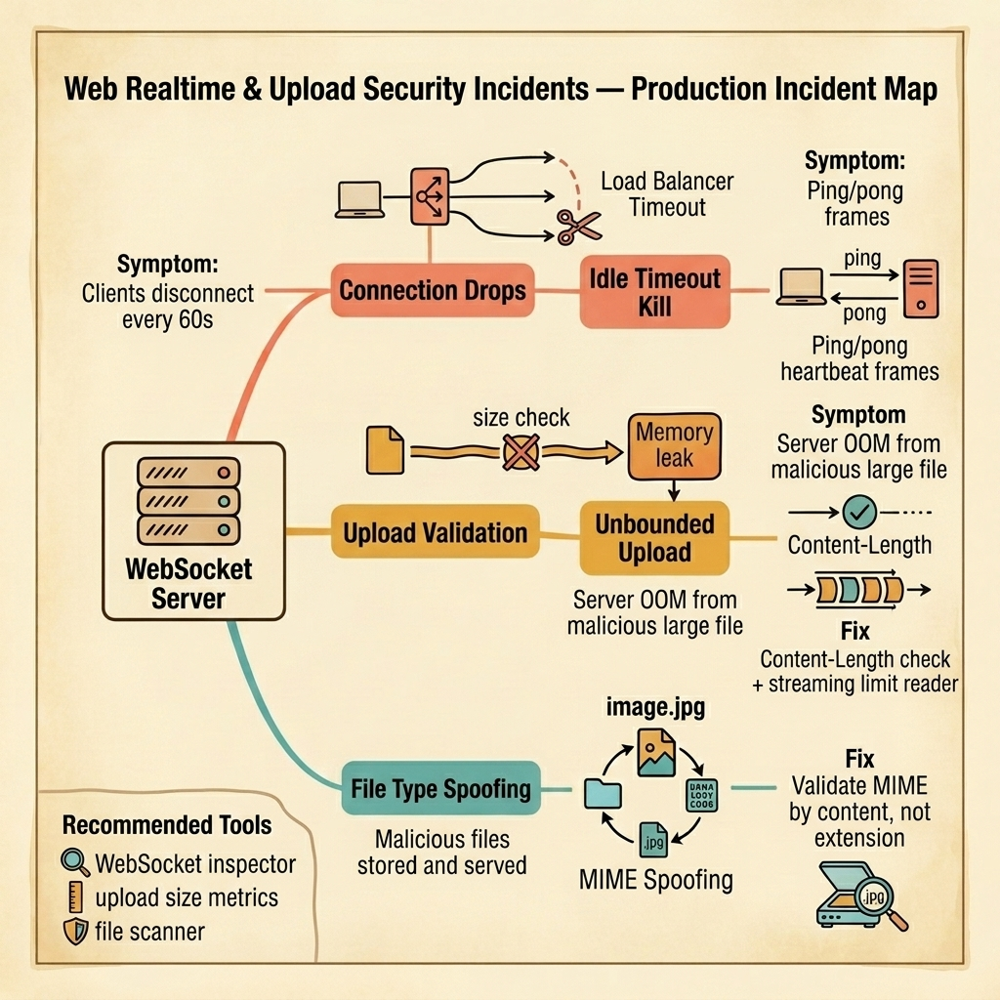

<!-- tags: golang, quiz -->
# 15 — Go Scenario Quiz: Web Realtime & Upload Security Incidents

> **Diagnostic Assessment**: Five incident scenarios testing your ability to diagnose WebSocket connection drops, unbounded file uploads, and MIME type spoofing in production Go services.

📅 Created: 2026-03-27 · 🔄 Updated: 2026-04-19 · ⏱️ 10 min read.

| Aspect | Detail |
| --- | --- |
| **Level** | Intermediate |
| **Coverage** | WebSocket idle timeout handling, file upload size limits, MIME content validation, streaming upload patterns |
| **Format** | 5 incident scenarios with diagnosis questions |

---

## 1. DEFINE

Realtime and upload incidents live at the boundary between the server and the untrusted world. A WebSocket that drops every 60 seconds is not a bug in the application — it is a load balancer enforcing an idle timeout. An upload endpoint that reads the entire request body into memory is a single malicious request away from OOM. A file extension check is not a security check.

Three failure surfaces dominate:

- **Idle timeout kill**: The load balancer (ALB, Nginx, Cloudflare) has a 60-second idle timeout. If no data flows over the WebSocket for 60 seconds, the load balancer closes the connection. The client reconnects, loses state, and the user sees a flickering UI.
- **Unbounded upload**: The upload handler calls `io.ReadAll(r.Body)` to read the entire file into memory. A malicious user sends a 10 GB file. The server allocates 10 GB of memory and crashes.
- **MIME spoofing**: The handler validates file type by checking the extension (`.jpg`, `.png`). An attacker renames an executable to `payload.jpg` and uploads it. The server stores and serves it. A victim downloads the "image" and runs the executable.

### Assessment Boundaries

- WebSocket ping/pong frames and keepalive intervals.
- `http.MaxBytesReader` and `io.LimitReader` for upload protection.
- `http.DetectContentType` for content-based MIME validation.

## 2. VISUAL

The incident map below shows three failure surfaces in realtime and upload systems — WebSocket idle kills, unbounded uploads, and MIME spoofing.



*Figure: A WebSocket server handles persistent connections and file uploads. Three failure surfaces emerge — load balancers kill idle connections, unbounded uploads crash the server with OOM, and MIME spoofing bypasses extension-based validation.*

```text
Incident Path Evaluations
├── WebSocket Lifecycle
│   ├── Load Balancer Idle Timeout
│   └── Ping/Pong Heartbeat Frames
├── Upload Protection
│   ├── Content-Length Validation
│   └── Streaming LimitReader
└── File Validation
    ├── Extension-Based vs. Content-Based MIME Check
    └── Magic Byte Detection
```

## 3. CODE

### Example 1: Basic — Upload handler with size limit and MIME validation

> **Goal**: Demonstrate a secure upload handler that limits request size and validates file type by content, not extension.
> **Complexity**: Basic

```go
// web_realtime_upload_incidents.go — Size-limited upload with content-based MIME check
package scenarioquiz

import (
	"io"
	"net/http"
)

const maxUploadSize = 10 << 20 // 10 MB

var allowedMIME = map[string]bool{
	"image/jpeg": true,
	"image/png":  true,
	"image/gif":  true,
}

func SecureUploadHandler(w http.ResponseWriter, r *http.Request) {
	// Step 1: Limit the request body size.
	r.Body = http.MaxBytesReader(w, r.Body, maxUploadSize)

	// Step 2: Read the first 512 bytes to detect content type.
	buf := make([]byte, 512)
	n, err := r.Body.Read(buf)
	if err != nil && err != io.EOF {
		http.Error(w, "upload read failed", http.StatusBadRequest)
		return
	}

	// Step 3: Validate MIME by content, not extension.
	mime := http.DetectContentType(buf[:n])
	if !allowedMIME[mime] {
		http.Error(w, "file type not allowed", http.StatusUnsupportedMediaType)
		return
	}

	// Step 4: Continue reading the rest of the body (stream to storage).
	// ... save buf[:n] + remaining r.Body to object storage
}
```

**Why?** `http.MaxBytesReader` rejects uploads exceeding the limit at the HTTP layer. `http.DetectContentType` inspects the file's magic bytes — the first 512 bytes of actual content — instead of trusting the file extension. An executable renamed to `.jpg` will be detected as `application/octet-stream`, not `image/jpeg`.

## 4. PITFALLS

| # | Severity | Defect | Impact | Fix |
| --- | --- | --- | --- | --- |
| 1 | 🔴 Fatal | `io.ReadAll(r.Body)` without size limit | Single malicious upload OOMs the server | Use `http.MaxBytesReader` to cap request body size |
| 2 | 🔴 Fatal | File type validated by extension only | Executables uploaded as `.jpg` bypass check | Use `http.DetectContentType` on file content |
| 3 | 🟡 Common | No WebSocket ping/pong heartbeat | Load balancer kills idle connections after 60s | Send ping frames at half the load balancer's timeout interval |

## 5. REF

| Resource | Link | Note |
| --- | --- | --- |
| gorilla/websocket | [https://github.com/gorilla/websocket](https://github.com/gorilla/websocket) | WebSocket with ping/pong support |
| http.MaxBytesReader | [https://pkg.go.dev/net/http#MaxBytesReader](https://pkg.go.dev/net/http#MaxBytesReader) | Request body size limiting |
| OWASP File Upload | [https://cheatsheetseries.owasp.org/cheatsheets/File_Upload_Cheat_Sheet.html](https://cheatsheetseries.owasp.org/cheatsheets/File_Upload_Cheat_Sheet.html) | Secure upload patterns |

## 6. RECOMMEND

| Extension | When to proceed | Rationale | File/Link |
| --- | --- | --- | --- |
| Web Security Lane | After failing scenarios | Re-read upload and WebSocket patterns | [../../security/README.md](../../security/README.md) |
| Realtime Module Quiz | Before attempting scenarios | Verify concept recall first | [../module/19-realtime-foundations.md](../module/19-realtime-foundations.md) |

## 7. QUIZ

### Incident Evaluation

1. **Incident**: WebSocket clients disconnect every 55–65 seconds. The server logs show no errors. The application heartbeat is disabled. The load balancer has a 60-second idle timeout. What is the fix?
   - A. Increase the server timeout.
   - B. Send WebSocket ping frames every 30 seconds (half the load balancer's timeout) — this keeps the connection active in the eyes of the load balancer and prevents idle timeout kills.
   - C. Use HTTP long polling instead.
   - D. Increase the load balancer timeout to 5 minutes.

2. **Incident**: An upload endpoint calls `io.ReadAll(r.Body)`. A malicious user sends a 5 GB file. The server allocates 5 GB of memory and crashes with OOM. The endpoint has no size validation. What should be added?
   - A. More server memory.
   - B. `http.MaxBytesReader(w, r.Body, maxSize)` — this rejects the request with a `413 Request Entity Too Large` if the body exceeds the limit, without reading the entire file into memory.
   - C. A client-side file size check.
   - D. Compression.

3. **Incident**: A user uploads a file named `report.pdf.exe` and the server stores it. Another user downloads the file, and their OS executes it. The upload handler only checks that the file name ends with a known extension. What should the handler do instead?
   - A. Block double extensions.
   - B. Use `http.DetectContentType` to inspect the file's magic bytes — this detects the actual content type regardless of the file name. An executable's magic bytes (`MZ` for PE) will not match `application/pdf`.
   - C. Strip the last extension.
   - D. Rename the file to a UUID.

4. **Incident**: A WebSocket server sends real-time notifications. After deploying a new version, connected clients do not receive notifications for 10 seconds. The server restarts and all WebSocket connections drop. What pattern provides a smoother experience?
   - A. Faster server startup.
   - B. Client-side reconnection with exponential backoff and a message replay mechanism — the client reconnects automatically and requests missed messages using the last received message ID.
   - C. Server-sent events instead of WebSocket.
   - D. A sticky session cookie.

5. **Incident**: A multipart file upload endpoint receives files with `Content-Type: multipart/form-data`. The handler parses the entire multipart body into memory using `r.ParseMultipartForm(32 << 20)`. An attacker sends 100 concurrent requests with 30 MB files each. Total memory: 3 GB. What should change?
   - A. Limit concurrent connections.
   - B. Use `r.MultipartReader()` to stream multipart parts individually instead of parsing the entire form into memory — this processes one part at a time with bounded memory usage.
   - C. Reduce the file size limit.
   - D. Add a CDN.

### Answer Key

1. **B**. Load balancers kill idle connections. Ping frames at half the timeout interval (30s for a 60s timeout) keep the connection active without adding significant bandwidth.

2. **B**. `http.MaxBytesReader` wraps the request body and returns an error if the size exceeds the limit. It prevents the server from reading more data than allowed, protecting against memory exhaustion.

3. **B**. File names are untrusted input. `http.DetectContentType` reads the first 512 bytes and uses magic byte signatures to determine the actual content type, regardless of file name or extension.

4. **B**. WebSocket connections are inherently fragile. A robust client reconnects automatically with backoff and uses a message ID to replay missed messages after reconnection.

5. **B**. `ParseMultipartForm` loads the entire form into memory. `MultipartReader` provides a streaming interface that reads one part at a time, keeping memory usage bounded regardless of file count or size.

---
