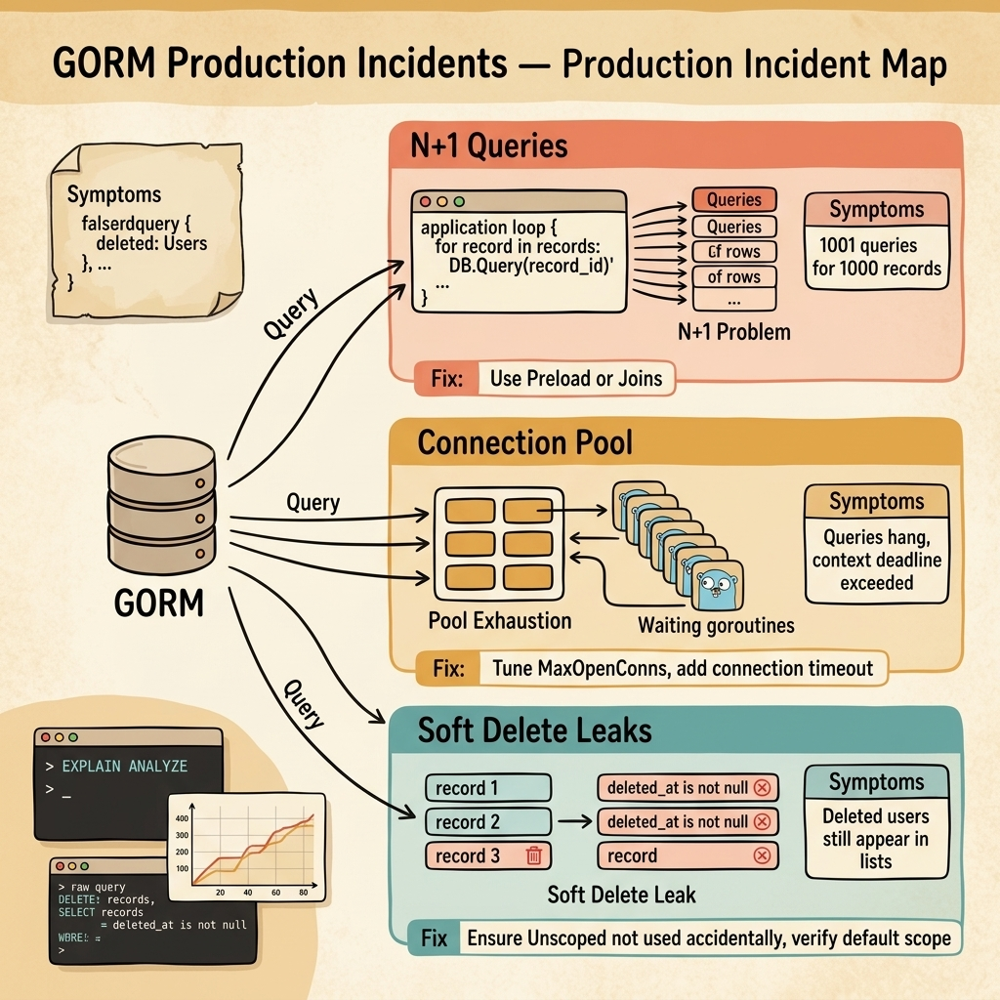

<!-- tags: golang, quiz -->
# 16 — Go Scenario Quiz: GORM Production Incidents

> **Diagnostic Assessment**: Five incident scenarios testing your ability to diagnose N+1 query patterns, connection pool exhaustion, and soft delete leaks in GORM-based Go services.

📅 Created: 2026-03-27 · 🔄 Updated: 2026-04-19 · ⏱️ 10 min read.

| Aspect | Detail |
| --- | --- |
| **Level** | Intermediate |
| **Coverage** | N+1 query elimination, connection pool tuning, soft delete default scopes, transaction isolation pitfalls |
| **Format** | 5 incident scenarios with diagnosis questions |

---

## 1. DEFINE

GORM production incidents are performance cliffs. The application works perfectly in development with 10 records. In production with 100,000 records, a single endpoint fires 100,001 queries and exhausts the database connection pool. The ORM abstracts away the SQL — which means it also abstracts away the problem.

Three failure surfaces dominate:

- **N+1 queries**: Loading a list of 1,000 orders and their items fires 1 query for orders + 1,000 queries for items (one per order). The developer does not see this because GORM lazily loads associations. In development with 10 orders, it is 11 queries and feels instant. In production with 1,000 orders, it is 1,001 queries and takes 8 seconds.
- **Connection pool exhaustion**: The database allows 100 connections. GORM's default `MaxOpenConns` is unlimited. Under load, the application opens 500 connections. The database rejects new connections. Goroutines queue up waiting for a connection. Contexts expire. Users see timeouts.
- **Soft delete leaks**: GORM's `gorm.Model` includes a `DeletedAt` field. Deleting a record sets `DeletedAt` instead of removing the row. But if a developer uses `db.Unscoped()` in a query (perhaps to debug), the deleted records reappear in the results. Users see "deleted" records in their lists.

### Assessment Boundaries

- Eager loading: `Preload` vs. `Joins` for association loading.
- Connection pool configuration: `MaxOpenConns`, `MaxIdleConns`, `ConnMaxLifetime`.
- Soft delete scope: default filtering and the `Unscoped()` escape hatch.

## 2. VISUAL

The incident map below shows three GORM failure surfaces — N+1 queries, connection pool exhaustion, and soft delete leaks.



*Figure: GORM queries flow from the application to the database. Three failures emerge — lazy loading triggers N+1 query explosions, unlimited connections exhaust the pool, and Unscoped queries leak soft-deleted records into results.*

```text
Incident Path Evaluations
├── Query Patterns
│   ├── N+1 Lazy Loading Detection
│   └── Preload vs. Joins Strategy
├── Connection Management
│   ├── MaxOpenConns Tuning
│   └── Connection Lifetime and Idle Config
└── Soft Delete
    ├── Default DeletedAt Scope
    └── Unscoped Escape Hatch Risks
```

## 3. CODE

### Example 1: Basic — Preload to eliminate N+1 queries

> **Goal**: Demonstrate using `Preload` to load orders and their items in 2 queries instead of N+1.
> **Complexity**: Basic

```go
// gorm_production_incidents.go — Eliminate N+1 with Preload
package scenarioquiz

import "gorm.io/gorm"

type Order struct {
	gorm.Model
	UserID uint
	Items  []OrderItem
}

type OrderItem struct {
	gorm.Model
	OrderID uint
	Name    string
	Price   int
}

func GetOrdersWithItems(db *gorm.DB, userID uint) ([]Order, error) {
	var orders []Order
	// Preload fires exactly 2 queries: one for orders, one for all items.
	err := db.Where("user_id = ?", userID).Preload("Items").Find(&orders).Error
	return orders, err
}
```

**Why?** Without `Preload`, accessing `order.Items` triggers a lazy query per order. With `Preload`, GORM fires one `SELECT * FROM orders WHERE user_id = ?` and one `SELECT * FROM order_items WHERE order_id IN (...)`. Two queries total, regardless of how many orders exist.

## 4. PITFALLS

| # | Severity | Defect | Impact | Fix |
| --- | --- | --- | --- | --- |
| 1 | 🔴 Fatal | Lazy loading associations in a loop | 1001 queries for 1000 records; 8+ second response times | Use `Preload` or `Joins` for eager loading |
| 2 | 🔴 Fatal | No `MaxOpenConns` set on GORM connection pool | Unlimited connections exhaust database under load | Set `MaxOpenConns` to match database capacity |
| 3 | 🟡 Common | `Unscoped()` used accidentally in production queries | Soft-deleted records appear in user-facing results | Restrict `Unscoped` to admin/debug tools; audit its usage |

## 5. REF

| Resource | Link | Note |
| --- | --- | --- |
| GORM Preloading | [https://gorm.io/docs/preload.html](https://gorm.io/docs/preload.html) | Eager loading associations |
| GORM Connection Pool | [https://gorm.io/docs/generic_interface.html](https://gorm.io/docs/generic_interface.html) | Pool configuration via `database/sql` |
| GORM Soft Delete | [https://gorm.io/docs/delete.html#Soft-Delete](https://gorm.io/docs/delete.html#Soft-Delete) | Default scope and `Unscoped` behavior |

## 6. RECOMMEND

| Extension | When to proceed | Rationale | File/Link |
| --- | --- | --- | --- |
| GORM Lane | After failing scenarios | Re-read ORM query patterns | [../../gorm/README.md](../../gorm/README.md) |
| GORM Module Quiz | Before attempting scenarios | Verify concept recall first | [../module/20-gorm-foundations.md](../module/20-gorm-foundations.md) |

## 7. QUIZ

### Incident Evaluation

1. **Incident**: An API endpoint that lists orders takes 50ms with 10 orders and 8 seconds with 1,000 orders. Database logs show 1,001 `SELECT` statements per request. The code iterates over orders and accesses `order.Items` inside the loop. What is the fix?
   - A. Add a database index.
   - B. Use `db.Preload("Items").Find(&orders)` — this loads all items in a single `WHERE order_id IN (...)` query instead of one query per order.
   - C. Paginate the results.
   - D. Cache the orders.

2. **Incident**: Under load (200 concurrent requests), all database queries start returning `context deadline exceeded`. The database dashboard shows 500 active connections (the database max is 100). GORM has no `MaxOpenConns` configured. What should you set?
   - A. A bigger database.
   - B. `db.SetMaxOpenConns(80)` — keep it below the database max (100) to leave headroom for admin connections. Also set `MaxIdleConns` and `ConnMaxLifetime` to prevent stale connections.
   - C. A connection proxy like PgBouncer.
   - D. Retry on timeout.

3. **Incident**: A user reports seeing deleted products in their order history. The products were soft-deleted 3 days ago. The query for the order history page uses `db.Unscoped().Preload("Products").Find(&orders)`. What is wrong?
   - A. The products were not actually deleted.
   - B. `Unscoped()` disables the soft delete filter — all records, including those with `deleted_at IS NOT NULL`, appear in the results. Remove `Unscoped()` from user-facing queries.
   - C. The cache is stale.
   - D. The query has a join bug.

4. **Incident**: A developer uses `db.Joins("Items").Find(&orders)` instead of `db.Preload("Items").Find(&orders)`. With 1,000 orders and 5 items each, the result contains 5,000 rows (one per item, with order fields duplicated). The API returns 5,000 objects instead of 1,000. What is the difference?
   - A. `Joins` is buggy.
   - B. `Joins` performs an SQL JOIN, which produces a row per combination — 1,000 orders × 5 items = 5,000 rows. `Preload` runs separate queries and assembles the result correctly. Use `Preload` for one-to-many associations.
   - C. The model definition is wrong.
   - D. The database returned duplicates.

5. **Incident**: A long-running background job opens a database transaction at the start and commits it after processing 10,000 records (about 5 minutes). Other queries start timing out during the job. The database shows a long-running transaction holding locks. What should the job do instead?
   - A. Use a faster database.
   - B. Process records in small batches with individual transactions — commit every 100 records instead of holding one transaction for 10,000. Long transactions hold locks that block other queries.
   - C. Increase the lock timeout.
   - D. Use `READ UNCOMMITTED` isolation.

### Answer Key

1. **B**. `Preload` converts N+1 queries into 2 queries. It loads all associations in a single batch query using `IN (...)`, regardless of the number of parent records.

2. **B**. Without `MaxOpenConns`, GORM opens connections without limit. When the count exceeds the database maximum, new connections fail. Setting a cap below the database limit prevents exhaustion.

3. **B**. `Unscoped()` removes the default `WHERE deleted_at IS NULL` clause. Soft-deleted records appear in the results. This method should only be used in admin tools, not user-facing queries.

4. **B**. SQL JOINs produce one row per combination. For one-to-many relationships, this duplicates the parent record for each child. `Preload` avoids this by running separate queries and assembling the result in Go.

5. **B**. Long transactions hold locks for their entire duration, blocking other queries. Batch processing with frequent commits releases locks between batches, allowing other queries to proceed.

---
