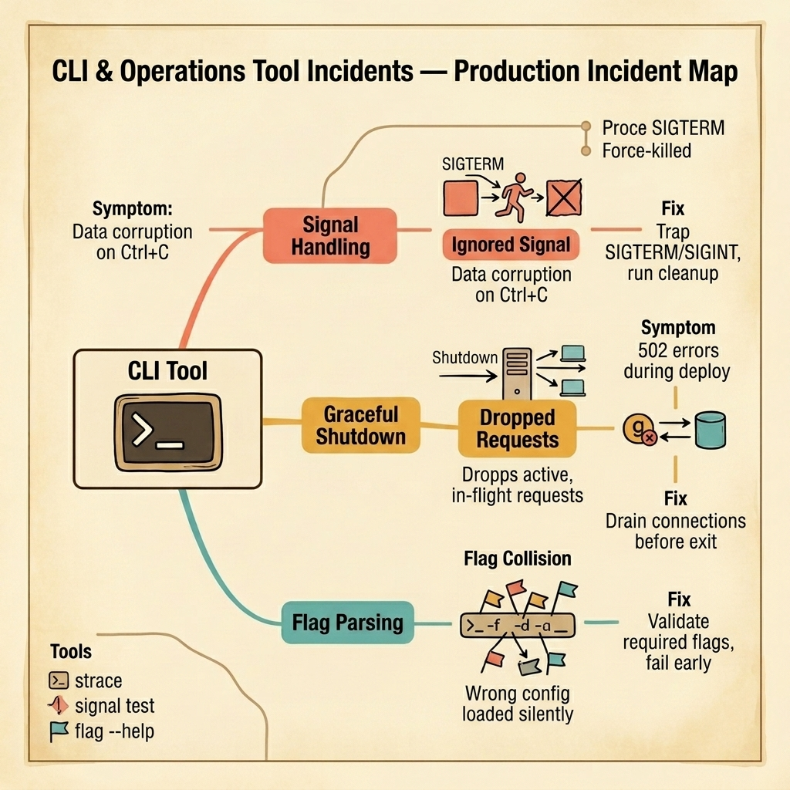

<!-- tags: golang, quiz -->
# 17 — Go Scenario Quiz: CLI & Operations Tool Incidents

> **Diagnostic Assessment**: Five incident scenarios testing your ability to diagnose signal handling failures, graceful shutdown gaps, and flag parsing pitfalls in Go CLI tools and long-running services.

📅 Created: 2026-03-27 · 🔄 Updated: 2026-04-19 · ⏱️ 10 min read.

| Aspect | Detail |
| --- | --- |
| **Level** | Intermediate |
| **Coverage** | Signal trapping (SIGTERM/SIGINT), graceful HTTP server shutdown, flag validation, context cancellation in CLI tools |
| **Format** | 5 incident scenarios with diagnosis questions |

---

## 1. DEFINE

CLI and operations tool incidents happen at the edges of a program's lifecycle — startup and shutdown. The code that processes data is correct. But the code that starts the process, parses its configuration, handles interruption signals, and shuts down cleanly is missing or broken.

Three failure surfaces dominate:

- **Ignored signals**: A user presses `Ctrl+C`. The Go process receives `SIGINT`. Nothing catches it. The runtime terminates the process immediately. An in-progress database write is interrupted mid-transaction. The data is corrupted.
- **Dropped requests during shutdown**: A Kubernetes deployment sends `SIGTERM` to the Go HTTP server. The server calls `os.Exit(0)` immediately. In-flight HTTP requests are terminated. Clients see `502 Bad Gateway`. The server should drain connections before exiting.
- **Silent flag misconfiguration**: A CLI tool accepts `--config` and `--env` flags. The developer adds a new `--env` flag in a subcommand that shadows the root flag. The root `--env` is silently ignored. The tool loads the wrong configuration and runs against the production database.

### Assessment Boundaries

- `signal.NotifyContext` for clean cancellation chains.
- `http.Server.Shutdown(ctx)` for graceful connection draining.
- Flag validation: required flags, mutual exclusion, early failure.

## 2. VISUAL

The incident map below shows three failure surfaces in CLI tools and services — ignored signals, dropped in-flight requests, and flag parsing collisions.



*Figure: A CLI tool or long-running service hits three failure surfaces — untrapped SIGTERM causes data corruption on Ctrl+C, immediate exit drops active HTTP requests, and flag shadowing loads wrong configuration silently.*

```text
Incident Path Evaluations
├── Signal Handling
│   ├── SIGTERM/SIGINT Trapping
│   └── Cleanup Function Registration
├── Graceful Shutdown
│   ├── HTTP Connection Draining
│   └── Background Job Completion
└── Flag Management
    ├── Required Flag Validation
    └── Flag Shadowing Detection
```

## 3. CODE

### Example 1: Basic — Graceful HTTP server shutdown on SIGTERM

> **Goal**: Demonstrate trapping SIGTERM and draining in-flight HTTP requests before the process exits.
> **Complexity**: Basic

```go
// cli_operations_incidents.go — Graceful shutdown with signal trapping
package scenarioquiz

import (
	"context"
	"log"
	"net/http"
	"os/signal"
	"syscall"
	"time"
)

func RunServer(handler http.Handler) error {
	// Create a context that cancels on SIGTERM or SIGINT.
	ctx, stop := signal.NotifyContext(context.Background(), syscall.SIGTERM, syscall.SIGINT)
	defer stop()

	srv := &http.Server{Addr: ":8080", Handler: handler}

	// Start server in a goroutine.
	go func() {
		if err := srv.ListenAndServe(); err != http.ErrServerClosed {
			log.Fatalf("server error: %v", err)
		}
	}()

	// Wait for the signal.
	<-ctx.Done()
	log.Println("shutting down, draining connections...")

	// Give in-flight requests 15 seconds to complete.
	shutdownCtx, cancel := context.WithTimeout(context.Background(), 15*time.Second)
	defer cancel()
	return srv.Shutdown(shutdownCtx)
}
```

**Why?** `signal.NotifyContext` creates a context that cancels when the process receives `SIGTERM` or `SIGINT`. `srv.Shutdown(ctx)` stops accepting new connections but waits for in-flight requests to finish (up to the timeout). No requests are dropped during deployment.

## 4. PITFALLS

| # | Severity | Defect | Impact | Fix |
| --- | --- | --- | --- | --- |
| 1 | 🔴 Fatal | No signal handler; `Ctrl+C` kills process immediately | In-progress writes corrupted; transactions left open | Trap `SIGTERM`/`SIGINT` with `signal.NotifyContext` |
| 2 | 🔴 Fatal | `os.Exit(0)` on shutdown signal without draining | In-flight HTTP requests dropped; clients see 502 | Use `http.Server.Shutdown(ctx)` to drain connections |
| 3 | 🟡 Common | Required CLI flags not validated at startup | Tool runs with wrong config; silent data corruption | Validate required flags and fail early with a clear error |

## 5. REF

| Resource | Link | Note |
| --- | --- | --- |
| signal.NotifyContext | [https://pkg.go.dev/os/signal#NotifyContext](https://pkg.go.dev/os/signal#NotifyContext) | Context-based signal handling |
| http.Server.Shutdown | [https://pkg.go.dev/net/http#Server.Shutdown](https://pkg.go.dev/net/http#Server.Shutdown) | Graceful connection draining |
| cobra | [https://github.com/spf13/cobra](https://github.com/spf13/cobra) | CLI framework with flag management |

## 6. RECOMMEND

| Extension | When to proceed | Rationale | File/Link |
| --- | --- | --- | --- |
| CLI Lane | After failing scenarios | Re-read signal and shutdown patterns | [../../cli/README.md](../../cli/README.md) |
| CLI Module Quiz | Before attempting scenarios | Verify concept recall first | [../module/21-cli-foundations.md](../module/21-cli-foundations.md) |

## 7. QUIZ

### Incident Evaluation

1. **Incident**: A CLI tool writes to a database in batches. The operator presses `Ctrl+C` mid-batch. The process dies immediately. The database has a partially written batch with 50 of 100 records. What should the tool do on `SIGINT`?
   - A. Ignore `Ctrl+C`.
   - B. Trap `SIGINT` with `signal.NotifyContext`, cancel the context, and in the batch loop check `ctx.Done()` to finish the current batch and commit before exiting.
   - C. Write faster.
   - D. Use autocommit.

2. **Incident**: During a Kubernetes rolling deployment, the old pod receives `SIGTERM`. The Go server calls `os.Exit(0)` in the signal handler. 15 in-flight requests are dropped. Clients see `502 Bad Gateway` for 2 seconds. What should the signal handler do instead?
   - A. Increase the termination grace period.
   - B. Call `http.Server.Shutdown(ctx)` — this stops accepting new connections and waits for in-flight requests to complete before the process exits.
   - C. Add more replicas.
   - D. Use a blue-green deployment.

3. **Incident**: A CLI tool has `--env` flags at both the root command and a subcommand. The subcommand's `--env` shadows the root's `--env`. The operator passes `--env=staging` at the root level, but the subcommand reads its own `--env` (default: `production`). The tool runs against production. What should be done?
   - A. Remove the subcommand flag.
   - B. Detect flag shadowing at startup — either use a unique name for each flag or validate that no subcommand flag shadows a parent flag. Fail with a clear error if a conflict is detected.
   - C. Use environment variables instead.
   - D. Add a confirmation prompt.

4. **Incident**: A long-running data migration tool processes 10 million records. It does not handle `SIGTERM`. Kubernetes sends `SIGTERM`, waits 30 seconds (default grace period), and sends `SIGKILL`. The tool is killed mid-write. What are the two fixes?
   - A. A faster migration.
   - B. First, trap `SIGTERM` to finish the current batch and save a checkpoint. Second, set `terminationGracePeriodSeconds` in the pod spec to a value longer than the worst-case batch processing time.
   - C. Run the migration outside Kubernetes.
   - D. Use a shorter batch size.

5. **Incident**: A CLI tool accepts `--port` as a required flag. If the operator forgets `--port`, the tool defaults to port `0`, which binds to a random port. The tool starts successfully but is unreachable because nobody knows which port it bound to. What should change?
   - A. Default to port 8080.
   - B. Validate that `--port` is provided at startup — if the flag is missing, print a clear error message and exit with a non-zero code. Do not silently use a default for required configuration.
   - C. Use an environment variable.
   - D. Log the bound port.

### Answer Key

1. **B**. Signal trapping converts an abrupt kill into a controlled shutdown. The batch loop checks `ctx.Done()` and completes the current batch before exiting, preventing partial writes.

2. **B**. `http.Server.Shutdown` gracefully drains in-flight requests. It stops the listener (no new connections) and waits for active handlers to return, up to the context's deadline.

3. **B**. Flag shadowing is a silent misconfiguration. The root flag's value is ignored because the subcommand overrides it. Detection at startup or unique naming prevents the tool from running with unintended configuration.

4. **B**. Both fixes are needed: the tool must handle `SIGTERM` to save progress, and the Kubernetes grace period must be long enough for the tool to finish its current batch and checkpoint.

5. **B**. Required flags must be validated at startup. A missing required flag should cause an immediate, loud failure — not a silent fallback to a default that makes the service unreachable.

---
