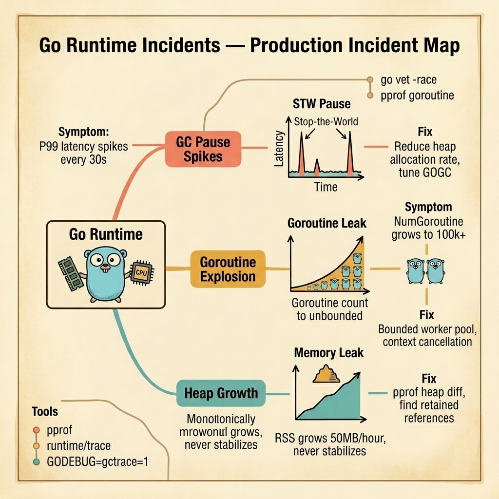

<!-- tags: golang, quiz -->
# 18 — Go Scenario Quiz: Go Runtime Incidents

> **Diagnostic Assessment**: Five incident scenarios testing your ability to diagnose GC pause spikes, goroutine leaks, and monotonic heap growth in production Go services.

📅 Created: 2026-03-28 · 🔄 Updated: 2026-04-19 · ⏱️ 10 min read.

| Aspect | Detail |
| --- | --- |
| **Level** | Advanced |
| **Coverage** | GC stop-the-world pauses, goroutine lifecycle leaks, heap profiling with pprof, GOGC and GOMEMLIMIT tuning |
| **Format** | 5 incident scenarios with diagnosis questions |

---

## 1. DEFINE

Go runtime incidents are invisible at the application layer. The code is correct. The logic produces the right output. But the runtime underneath is drowning — the garbage collector runs too often, goroutines accumulate without bound, or the heap grows monotonically because a map never gets cleaned up.

Three failure surfaces dominate:

- **GC pause spikes**: The service allocates heavily (building large response objects, serializing JSON, creating temporary slices). The GC runs every few seconds to reclaim memory. Each GC cycle includes a brief stop-the-world (STW) pause. At high allocation rates, the STW pause is long enough to spike P99 latency from 5ms to 50ms every 30 seconds.
- **Goroutine explosion**: A handler launches a goroutine per request to perform async work. The goroutine blocks on a channel or network call without a context deadline. If the downstream is slow, goroutines accumulate. `runtime.NumGoroutine()` grows from 100 to 100,000 in an hour. Each goroutine consumes ~8 KB of stack. The process OOMs.
- **Monotonic heap growth**: A global map caches results but never evicts entries. The map grows by 50 MB per hour. RSS never stabilizes. After 10 hours, the process uses 500 MB more than at startup. Restarting the process resets the memory — until the map fills again.

### Assessment Boundaries

- `GOGC` tuning: trade memory for fewer GC cycles.
- `runtime.NumGoroutine()` baseline monitoring for leak detection.
- `pprof` heap diff: capture two heap profiles 10 minutes apart, compare allocations.

## 2. VISUAL

The incident map below shows three runtime failure surfaces — GC pause spikes, goroutine explosions, and monotonic heap growth from retained references.



*Figure: The Go runtime manages memory and concurrency. Three failure surfaces emerge — stop-the-world GC pauses spike tail latency, unbounded goroutines exhaust memory, and retained references cause heap growth that never stabilizes.*

```text
Incident Path Evaluations
├── GC Behavior
│   ├── Stop-the-World Pause Duration
│   └── Allocation Rate vs. GOGC Target
├── Goroutine Lifecycle
│   ├── Unbounded Goroutine Creation
│   └── Missing Context Deadlines
└── Heap Retention
    ├── Global Map Without Eviction
    └── pprof Heap Diff Analysis
```

## 3. CODE

### Example 1: Basic — Goroutine leak detection via baseline comparison

> **Goal**: Demonstrate monitoring goroutine count growth to detect leaks before they cause OOM.
> **Complexity**: Basic

```go
// go_runtime_incidents.go — Goroutine leak detection via baseline comparison
package scenarioquiz

import (
	"log"
	"runtime"
	"time"
)

func MonitorGoroutines(interval time.Duration, threshold int) {
	baseline := runtime.NumGoroutine()
	ticker := time.NewTicker(interval)
	defer ticker.Stop()

	for range ticker.C {
		current := runtime.NumGoroutine()
		if current > baseline*threshold {
			log.Printf("ALERT: goroutine count %d exceeds %dx baseline (%d)", current, threshold, baseline)
			// Capture a goroutine profile for diagnosis.
		}
	}
}
```

**Why?** The monitor records the goroutine count at startup. If the count exceeds N× the baseline, it alerts. A healthy service maintains a stable goroutine count. Monotonic growth indicates a leak — goroutines are created but never exit.

## 4. PITFALLS

| # | Severity | Defect | Impact | Fix |
| --- | --- | --- | --- | --- |
| 1 | 🔴 Fatal | `pprof` handlers exposed on public port | Full system compromise; attackers read heap, CPU, goroutine data | Bind pprof to internal-only port or localhost |
| 2 | 🔴 Fatal | Goroutine per request without context deadline | Slow downstream causes goroutine accumulation; OOM | Wrap all async work with `context.WithTimeout` |
| 3 | 🟡 Common | Optimizing allocation before profiling | Engineer guesses the hot path; wastes time on cold code | Always profile with `pprof` first, then optimize the top allocators |

## 5. REF

| Resource | Link | Note |
| --- | --- | --- |
| Profiling Go Programs | [https://go.dev/blog/profiling-go-programs](https://go.dev/blog/profiling-go-programs) | Official guide to pprof usage |
| runtime/pprof | [https://pkg.go.dev/runtime/pprof](https://pkg.go.dev/runtime/pprof) | Programmatic profile capture |
| runtime/trace | [https://pkg.go.dev/runtime/trace](https://pkg.go.dev/runtime/trace) | Execution tracer for GC analysis |

## 6. RECOMMEND

| Extension | When to proceed | Rationale | File/Link |
| --- | --- | --- | --- |
| Runtime Lane | After failing scenarios | Re-read GC internals and pprof patterns | [../../runtime/README.md](../../runtime/README.md) |
| Runtime Module Quiz | Before attempting scenarios | Verify concept recall first | [../module/14-go-runtime-and-performance.md](../module/14-go-runtime-and-performance.md) |

## 7. QUIZ

### Incident Evaluation

1. **Incident**: Your service's P99 latency spikes from 5ms to 60ms every 20–30 seconds. CPU usage is normal. Memory usage is stable at 400 MB. The application logs show no errors. What should you check first?
   - A. The database query performance.
   - B. GC pause times — use `GODEBUG=gctrace=1` or `runtime/trace` to check if the stop-the-world GC pause coincides with the latency spikes. High allocation rates cause frequent, longer GC cycles.
   - C. Network latency.
   - D. Disk I/O.

2. **Incident**: `runtime.NumGoroutine()` starts at 50 and grows to 80,000 over 6 hours. Memory usage grows linearly. The service handles HTTP requests and launches a goroutine per request to send an async notification. The notification service is intermittently slow (10s response time). What is the leak?
   - A. The HTTP handler has a memory leak.
   - B. Goroutines waiting for the slow notification service never return because there is no context deadline — they accumulate indefinitely. Adding `context.WithTimeout` ensures goroutines exit after a bounded wait.
   - C. The HTTP connection pool is too large.
   - D. The notification service is down.

3. **Incident**: A service's RSS grows by 50 MB per hour. Restarting the process resets memory to 100 MB. After 10 hours, it reaches 600 MB. A `pprof` heap profile shows a global `map[string][]byte` holding 500 MB of cached responses. What is the fix?
   - A. Increase the container memory limit.
   - B. Add an eviction policy to the cache — use a TTL, LRU, or max-size policy to bound the map's growth. Without eviction, the map grows monotonically as new keys are added.
   - C. Use `sync.Pool` instead.
   - D. Run GC manually with `runtime.GC()`.

4. **Incident**: An engineer discovers that `/debug/pprof/` is accessible on the service's public port (`:8080`). An external actor could download heap profiles, CPU profiles, and goroutine dumps. What is the immediate fix?
   - A. Add authentication to the pprof endpoints.
   - B. Bind pprof to a separate internal-only port (e.g., `:6060`) that is not exposed to the internet. Use `http.ListenAndServe("localhost:6060", nil)` for the pprof server.
   - C. Disable pprof entirely.
   - D. Add a WAF rule.

5. **Incident**: An engineer suspects a memory leak and immediately starts rewriting the hot path to use `sync.Pool` for all allocations. After a week of work, the rewrite is deployed. Memory usage is unchanged. What should the engineer have done first?
   - A. Used a different pool implementation.
   - B. Captured a `pprof` heap profile before making any changes — compare two profiles 10 minutes apart to identify the actual top allocators. Optimize based on data, not intuition.
   - C. Increased `GOGC` to 200.
   - D. Added more logging.

### Answer Key

1. **B**. Periodic P99 spikes with stable CPU and memory are a classic sign of GC pauses. `gctrace` output shows pause duration and frequency. High allocation rates make pauses longer and more frequent.

2. **B**. Goroutines without deadlines block indefinitely when the downstream is slow. Each request creates a goroutine that waits 10 seconds. At 100 req/s, that is 1,000 goroutines accumulating every 10 seconds. `context.WithTimeout` bounds the wait.

3. **B**. A map without eviction grows monotonically. TTL or LRU eviction bounds the map's size. `runtime.GC()` does not help because the map entries are still referenced — the GC cannot collect them.

4. **B**. pprof endpoints expose sensitive runtime data. They should only be accessible on an internal network. Binding to `localhost` or a separate internal port prevents external access.

5. **B**. Profile before optimizing. A heap diff between two captures reveals exactly which allocations are growing. Optimizing without profiling wastes effort on code paths that are not the actual source of the leak.

---
