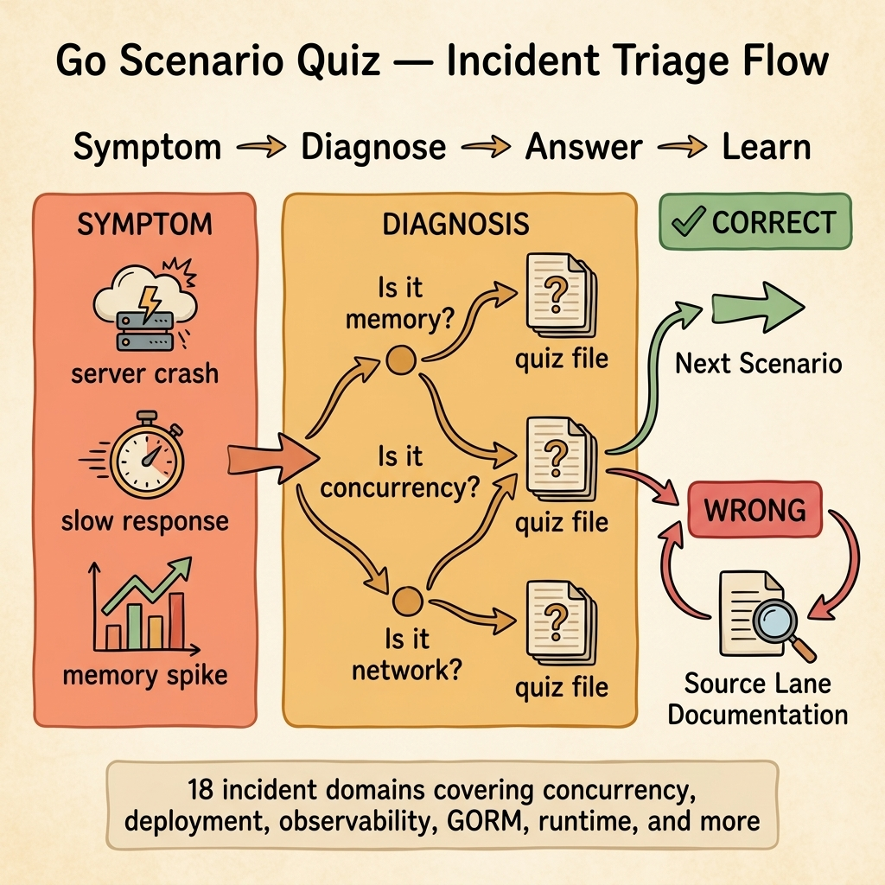

<!-- tags: golang, quiz, overview -->
# Go Scenario Quiz

> Module quizzes test what you remember. Scenario quizzes test what you would do at 3 AM when production is on fire.

📅 Updated: 2026-04-19 · ⏱️ 6 min read.

## 1. DEFINE

Scenario quizzes drop you into simulated production incidents. Each scenario presents symptoms — a goroutine leak, a broken saga, a memory spike, a silent data corruption — and asks: *what is your first diagnostic move?*

The difference from module quizzes is fundamental. Module quizzes test recall: "What does `context.WithCancel` return?" Scenario quizzes test reasoning: "Your service's memory usage doubled in the last hour. Latency is stable. What do you check first?"

### Signals & Boundaries

- Each scenario maps to a real production failure pattern documented in the source lanes.
- Questions are ordered by investigation sequence, not by difficulty.
- Wrong answers link back to the source documentation and the specific incident pattern.

### Incident Domains

| Quiz | Domain | Incident Type |
|------|--------|---------------|
| 01 | Concurrency | Goroutine leaks, race conditions, deadlocks |
| 02 | Export Pipeline | Stream corruption, memory overflow on large exports |
| 03 | Web Framework | Middleware ordering, binding failures, panic recovery |
| 04 | Microservices Messaging | Message loss, retry storms, consumer lag |
| 05 | Saga & Outbox | Distributed transaction failures, outbox stalls |
| 06 | Auth & Security | Token expiry, rate limit misconfiguration |
| 07 | Broker & Dead Letter | Poison messages, DLQ overflow, reprocessing |
| 08 | Background Export Jobs | Job stuck, progress tracking, retry exhaustion |
| 09 | Storage & Signed URLs | Expired URLs, storage cleanup, orphan files |
| 10 | Large Workbook & PDF | Memory pressure, timeout on large renders |
| 11 | gRPC & Discovery | Service registration failure, connection pooling |
| 12 | Observability | Missing traces, metric cardinality explosion |
| 13 | Cloud Infrastructure | Terraform drift, container OOM, node pressure |
| 14 | Deployment & Runtime | Rolling update failure, readiness probe timeout |
| 15 | Web Realtime & Upload | WebSocket drops, upload corruption, file size limits |
| 16 | GORM Production | N+1 queries, connection exhaustion, soft delete leaks |
| 17 | CLI Operations | Signal handling, graceful shutdown, flag parsing |
| 18 | Go Runtime | GC pause spikes, goroutine explosion, heap growth |

## 2. VISUAL

Scenario quizzes simulate real incident triage. The reader enters with symptoms, follows a diagnostic path, and exits with either the right answer or a link back to the source documentation.



*Figure: Each scenario quiz simulates an incident pipeline — symptoms arrive, the reader diagnoses under pressure, and wrong answers redirect to the source lane for that failure pattern.*

## 3. CODE

The router matches an incident domain to the corresponding scenario quiz.

### Example 1: Basic — Scenario quiz router

> **Goal**: Direct the reader to the scenario quiz that matches their incident domain.
> **Complexity**: Basic

```go
// scenario_quiz_router.go — Maps incident domains to scenario quiz files.
package quiz

func ChooseScenario(surface string) string {
	switch surface {
	case "concurrency", "goroutine", "race":
		return "./01-concurrency-incidents.md"
	case "web-framework", "middleware", "binding":
		return "./03-web-framework-incidents.md"
	case "deployment", "runtime":
		return "./14-deployment-runtime-incidents.md"
	case "observability":
		return "./12-observability-incidents.md"
	default:
		return "./README.md"
	}
}
```

**Why?** The `switch` groups related incident keywords into single cases. A reader who just encountered a goroutine leak in production can type "concurrency" or "goroutine" and land on the right scenario quiz.

## 4. PITFALLS

| # | Severity | Defect | Impact | Fix |
| --- | --- | --- | --- | --- |
| 1 | 🔴 Fatal | Reading the answer key before attempting the scenario | Defeats the purpose; you learn triage by doing it, not reading about it | Cover the answer key. Attempt every scenario before checking |
| 2 | 🟡 Common | Treating scenario quizzes as knowledge tests | They test reasoning sequence, not fact recall | Focus on *what you would check first*, not *what the right answer is* |
| 3 | 🟡 Common | Skipping scenarios outside your domain | Production incidents cross boundaries; a DB issue often surfaces as a goroutine leak | Complete at least one scenario per major domain |

## 5. REF

| Resource | Link | Note |
| --- | --- | --- |
| Go Blog | [https://go.dev/blog/](https://go.dev/blog/) | Source material for concurrency and context incident patterns |
| Google SRE Workbook | [https://sre.google/workbook/table-of-contents/](https://sre.google/workbook/table-of-contents/) | Incident response frameworks used in scenario quiz design |
| OpenTelemetry Go | [https://opentelemetry.io/docs/languages/go/](https://opentelemetry.io/docs/languages/go/) | Reference for observability incident scenarios |

## 6. RECOMMEND

| Extension | When to proceed | Rationale | File/Link |
| --- | --- | --- | --- |
| Concurrency Incidents | When preparing for on-call or after a goroutine leak | Tests goroutine lifecycle triage under pressure | [./01-concurrency-incidents.md](./01-concurrency-incidents.md) |
| Web Framework Incidents | After deploying a new middleware stack | Tests middleware ordering and panic recovery reasoning | [./03-web-framework-incidents.md](./03-web-framework-incidents.md) |
| Deployment Runtime Incidents | Before a production deployment | Tests rolling update and readiness probe reasoning | [./14-deployment-runtime-incidents.md](./14-deployment-runtime-incidents.md) |
