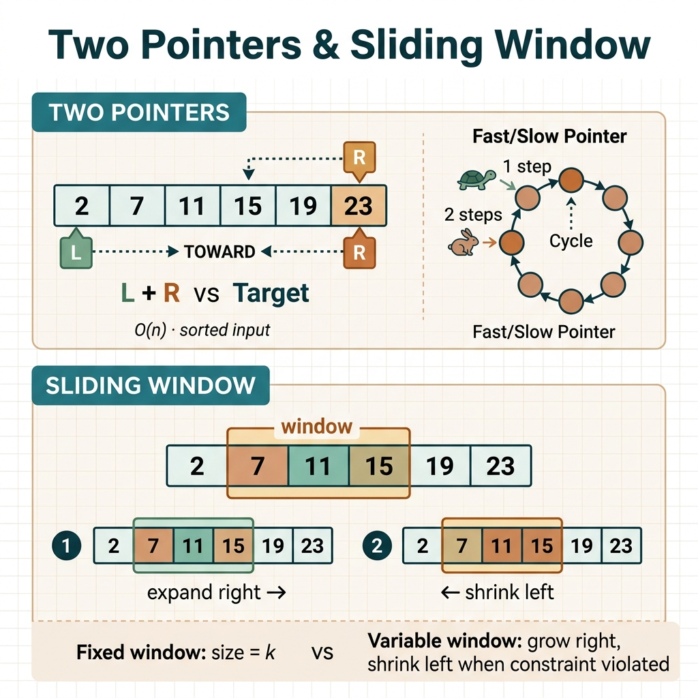

<!-- tags: leetcode, algorithms, coding-interview, two-pointers -->
# 👆 Two Pointers & Sliding Window

> A technique using two pointers to traverse arrays or strings in O(n) time, and sliding window for subarray or substring problems.

📅 Created: 2026-03-20 · 🔄 Updated: 2026-04-10 · ⏱️ 12 min read

| Aspect         | Detail                                     |
| -------------- | ------------------------------------------ |
| **Complexity** | O(n) or O(n log n)                         |
| **Use case**   | Sorted array pair, subarray sum, substring |
| **Go stdlib**  | `sort`, `strings`, `unicode/utf8`          |
| **LeetCode**   | #1, #3, #11, #15, #76, #167, #209, #424    |

---

## 1. DEFINE

You look at an array or a string and easily fall into brute-force. You might try every pair, every segment, or every cut. The `Two Pointers & Sliding Window` family appears right then. You do not need to try everything. You move boundaries with purpose to eliminate search space.

Interviews deceive you because many problems look different but ask the same question. Can two ends converge? Can a contiguous segment stretch while keeping an invariant? If you misread the signal, you reset at every step and turn an O(n) solution into O(n²).

Core insight: **This family beats brute-force because each pointer shift or window stretch eliminates a portion of the search space without restarting.**

| Variant | When to use | Core idea |
| ------- | ------- | ------- |
| Opposite-direction two pointers | Sorted array or need two ends to converge | Each step eliminates a search space portion based on order or constraint. |
| Fast/slow pointers | Need to find middle, detect cycle, or partition in-place | Two pointers advance at different speeds to encode position relations. |
| Variable sliding window | Subarray or substring problems with changing constraints | Expand right and shrink left until the window becomes valid again. |
| Fixed sliding window | Window has a fixed size `k` | Update incrementally when adding a new element and dropping an old one. |

| Approach | Time | Space | When to choose |
|---|----------|-----|---------|
| Opposite-direction pointers | O(n) | O(1) | Use when input is sorted or ends carry decision information. |
| Fast/slow pointers | O(n) | O(1) | Use to encode distance or cycles on a linear structure. |
| Variable sliding window | O(n) amortized | O(k) | Use when optimizing over a contiguous segment with constraints. |
| Fixed sliding window | O(n) | O(1) or O(k) | Use when all candidates share the same length. |

### 1.1 Quick Recognition

- Problems mention `sorted pair`, `palindrome`, `container`, `substring`, `subarray`, `at most`, or `at least`.
- A correct solution depends on which boundary moves and which boundary waits for invariant recovery.
- If a problem asks for contiguous segments, sliding window beats a global hash and reset.

### 1.2 Invariants & Failure Modes

- Opposite pointers work only when each comparison drops one end due to input structure.
- Sliding window shines when window state updates incrementally during `right` expansion and `left` contraction.
- Common failure: You use two pointers just because you see two indices. You cannot prove that moving a pointer reduces the search space correctly.

## 2. VISUAL

The four variants look different, but the invariant remains the same. Each boundary shift must eliminate a portion of the search space without backtracking. The image below groups a decision map. Scan it to find the right variant before reading the trace.

### Overview — Two Pointers & Sliding Window Variants



*Caption: Same boundary movement family. Variants differ in pointer movement and invariants that hold the correct solution.*

### Level 1 — Core intuition

```text
[2, 3, 5, 7, 11, 15], target = 9
 L                 R
2 + 15 > 9  => move R left
2 + 11 > 9  => move R left
2 + 7  = 9  => found

s = "abcabcbb"
window grows: [a] -> [ab] -> [abc]
repeat 'a' appears -> shrink left until window unique again
```

*Caption: Level 1 shows the two most popular forms. Pointers converge on ordered data, and windows stretch over contiguous segments.*

### Level 2 — Decision trace

- For opposite-direction pointers, each comparison eliminates at least one end because input holds order information.
- For fast/slow pointers, the invariant lies in the speed difference. This difference creates a meeting point or middle point.
- For sliding window, window state updates incrementally when `right` expands and `left` shrinks.
- If an update step does not make the window closer to valid, you use the wrong pattern or lack supporting state.

The trace shows how pointers move. One question remains: which boundary must not move closer when writing code?

## 3. PLAYGROUND

This guide covers a mixed family, so the playground only enables the `two pointers` half for invariant clarity. It does not simulate sliding window to keep the widget focused.

Use the playground to observe opposite-end reasoning. Drop the right when the sum is too large. Increase the left when the sum is too small. Then return to the code section to see why sliding window forms a different boundary movement family.

::: algorithm-playground
src: ./playgrounds/01-two-pointers.playground.yml
:::

## 4. CODE

Code is not a trick once boundaries appear on a small example. We build from basic convergence to complex window stretching.

### Problem 1: Basic — Two Sum II (Sorted Input) [LC #167]
> **Goal**: Find 2 numbers in a sorted array that sum to target.
> **Approach**: Sorted array, target.
> **Example**: Input is a typical LeetCode problem. Output provides a copyable solution to practice patterns and compare trade-offs.
> **Complexity**: O(n) time, O(1) space — beats HashMap O(n) space.

```go
// leetcode/two_sum_sorted.go
package leetcode

// ✅ Two Sum II — Input Array Is Sorted
// Pattern: Opposite direction two pointers
// Time: O(n), Space: O(1)
func twoSumSorted(numbers []int, target int) []int {
    left, right := 0, len(numbers)-1

    for left < right {
        sum := numbers[left] + numbers[right]

        if sum == target {
            // ✅ LeetCode uses 1-indexed arrays.
            return []int{left + 1, right + 1}
        } else if sum < target {
            // ⚠️ Sum is too small → increase left (larger number).
            left++
        } else {
            // ⚠️ Sum is too large → decrease right (smaller number).
            right--
        }
    }

    return []int{-1, -1} // Not found
}

// ✅ Two Sum — Unsorted (Hash Map approach for comparison)
// Time: O(n), Space: O(n)
func twoSum(nums []int, target int) []int {
    seen := make(map[int]int) // value → index

    for i, num := range nums {
        complement := target - num
        if j, ok := seen[complement]; ok {
            return []int{j, i}
        }
        seen[num] = i
    }

    return []int{-1, -1}
}

// ✅ 3Sum [LC #15] — Fix 1 element, two-pointer on rest
// Time: O(n²), Space: O(1) (excluding output)
func threeSum(nums []int, target int) [][]int {
    sort.Ints(nums) // ⚠️ MUST sort first.
    var result [][]int

    for i := 0; i < len(nums)-2; i++ {
        // ✅ Skip duplicates for i.
        if i > 0 && nums[i] == nums[i-1] {
            continue
        }

        left, right := i+1, len(nums)-1

        for left < right {
            sum := nums[i] + nums[left] + nums[right]

            if sum == target {
                result = append(result, []int{nums[i], nums[left], nums[right]})
                // ✅ Skip duplicates for left and right.
                for left < right && nums[left] == nums[left+1] {
                    left++
                }
                for left < right && nums[right] == nums[right-1] {
                    right--
                }
                left++
                right--
            } else if sum < target {
                left++
            } else {
                right--
            }
        }
    }

    return result
}
```
```typescript
// leetcode/two_sum_sorted.ts
function twoSumSorted(numbers: number[], target: number): number[] {
  let left = 0, right = numbers.length - 1;
  while (left < right) {
    const sum = numbers[left] + numbers[right];
    if (sum === target) return [left + 1, right + 1];
    if (sum < target) left++;
    else right--;
  }
  return [-1, -1];
}

function twoSum(nums: number[], target: number): number[] {
  const seen = new Map<number, number>();
  for (let i = 0; i < nums.length; i++) {
    const complement = target - nums[i];
    if (seen.has(complement)) return [seen.get(complement)!, i];
    seen.set(nums[i], i);
  }
  return [-1, -1];
}

function threeSum(nums: number[], target: number): number[][] {
  nums.sort((a, b) => a - b);
  const result: number[][] = [];
  for (let i = 0; i < nums.length - 2; i++) {
    if (i > 0 && nums[i] === nums[i - 1]) continue;
    let left = i + 1, right = nums.length - 1;
    while (left < right) {
      const sum = nums[i] + nums[left] + nums[right];
      if (sum === target) {
        result.push([nums[i], nums[left], nums[right]]);
        while (left < right && nums[left] === nums[left + 1]) left++;
        while (left < right && nums[right] === nums[right - 1]) right--;
        left++;
        right--;
      } else if (sum < target) left++;
      else right--;
    }
  }
  return result;
}
```
```rust
// leetcode/two_sum_sorted.rs
fn two_sum_sorted(numbers: &[i32], target: i32) -> Vec<i32> {
    let (mut left, mut right) = (0usize, numbers.len() - 1);
    while left < right {
        let sum = numbers[left] + numbers[right];
        if sum == target {
            return vec![left as i32 + 1, right as i32 + 1];
        } else if sum < target {
            left += 1;
        } else {
            right -= 1;
        }
    }
    vec![-1, -1]
}

fn two_sum(nums: &[i32], target: i32) -> Vec<i32> {
    use std::collections::HashMap;
    let mut seen = HashMap::new();
    for (i, &num) in nums.iter().enumerate() {
        let complement = target - num;
        if let Some(&j) = seen.get(&complement) {
            return vec![j as i32, i as i32];
        }
        seen.insert(num, i);
    }
    vec![-1, -1]
}

fn three_sum(mut nums: Vec<i32>, target: i32) -> Vec<Vec<i32>> {
    nums.sort_unstable();
    let mut result = Vec::new();
    for i in 0..nums.len().saturating_sub(2) {
        if i > 0 && nums[i] == nums[i - 1] { continue; }
        let (mut left, mut right) = (i + 1, nums.len() - 1);
        while left < right {
            let sum = nums[i] + nums[left] + nums[right];
            if sum == target {
                result.push(vec![nums[i], nums[left], nums[right]]);
                while left < right && nums[left] == nums[left + 1] { left += 1; }
                while left < right && nums[right] == nums[right - 1] { right -= 1; }
                left += 1;
                right -= 1;
            } else if sum < target {
                left += 1;
            } else {
                right -= 1;
            }
        }
    }
    result
}
```
```cpp
// leetcode/two_sum_sorted.cpp
#include <algorithm>
#include <unordered_map>
#include <vector>

std::vector<int> two_sum_sorted(const std::vector<int>& numbers, int target) {
    int left = 0, right = static_cast<int>(numbers.size()) - 1;
    while (left < right) {
        int sum = numbers[left] + numbers[right];
        if (sum == target) return {left + 1, right + 1};
        if (sum < target) ++left;
        else --right;
    }
    return {-1, -1};
}

std::vector<int> two_sum(const std::vector<int>& nums, int target) {
    std::unordered_map<int, int> seen;
    for (int i = 0; i < static_cast<int>(nums.size()); ++i) {
        int complement = target - nums[i];
        if (auto it = seen.find(complement); it != seen.end()) return {it->second, i};
        seen[nums[i]] = i;
    }
    return {-1, -1};
}

std::vector<std::vector<int>> three_sum(std::vector<int> nums, int target) {
    std::sort(nums.begin(), nums.end());
    std::vector<std::vector<int>> result;
    for (int i = 0; i < static_cast<int>(nums.size()) - 2; ++i) {
        if (i > 0 && nums[i] == nums[i - 1]) continue;
        int left = i + 1, right = static_cast<int>(nums.size()) - 1;
        while (left < right) {
            int sum = nums[i] + nums[left] + nums[right];
            if (sum == target) {
                result.push_back({nums[i], nums[left], nums[right]});
                while (left < right && nums[left] == nums[left + 1]) ++left;
                while (left < right && nums[right] == nums[right - 1]) --right;
                ++left;
                --right;
            } else if (sum < target) {
                ++left;
            } else {
                --right;
            }
        }
    }
    return result;
}
```
```python
# leetcode/two_sum_sorted.py
def two_sum_sorted(numbers: list[int], target: int) -> list[int]:
    left, right = 0, len(numbers) - 1
    while left < right:
        current = numbers[left] + numbers[right]
        if current == target:
            return [left + 1, right + 1]
        if current < target:
            left += 1
        else:
            right -= 1
    return [-1, -1]

def two_sum(nums: list[int], target: int) -> list[int]:
    seen: dict[int, int] = {}
    for i, num in enumerate(nums):
        complement = target - num
        if complement in seen:
            return [seen[complement], i]
        seen[num] = i
    return [-1, -1]

def three_sum(nums: list[int], target: int) -> list[list[int]]:
    nums.sort()
    result: list[list[int]] = []
    for i in range(len(nums) - 2):
        if i > 0 and nums[i] == nums[i - 1]:
            continue
        left, right = i + 1, len(nums) - 1
        while left < right:
            current = nums[i] + nums[left] + nums[right]
            if current == target:
                result.append([nums[i], nums[left], nums[right]])
                while left < right and nums[left] == nums[left + 1]:
                    left += 1
                while left < right and nums[right] == nums[right - 1]:
                    right -= 1
                left += 1
                right -= 1
            elif current < target:
                left += 1
            else:
                right -= 1
    return result
```

```go
import "sort"
```
```typescript
// TypeScript: built-in Array.prototype.sort((a, b) => a - b)
export {};
```
```rust
use std::collections::HashMap;
```
```cpp
#include <algorithm>
#include <unordered_map>
#include <vector>
```
```python
from collections import Counter
```

> **Why?** This pattern works because every pointer or window update brings the search space closer to the answer without backtracking. The invariant is not the loop count. The `left/right` window state always reflects the remaining valid segment.

> **Conclusion**: This **Basic** example shows how to use `Two Sum II (Sorted Input) [LC #167]` without skipping reasoning. When constraints change or you need better optimization, move to the next example.

**✅ Achieved**: Two pointers on sorted array O(n), 3Sum O(n²) — beats brute force O(n³).
**⚠️ Warning**: 3Sum requires sorting first and careful duplicate skipping.

---

### Problem 2: Intermediate — Sliding Window [LC #3, #209, #424]
> **Goal**: Variable-size sliding window for substring or subarray problems.
> **Approach**: String or array, target condition.
> **Example**: Input is a typical LeetCode problem. Output provides a copyable solution to practice patterns and compare trade-offs.
> **Complexity**: O(n) for all variants.

```go
// leetcode/sliding_window.go
package leetcode

// ✅ LC #3: Longest Substring Without Repeating Characters
// Pattern: Variable sliding window + HashMap
// Time: O(n), Space: O(min(n,26)) for lowercase
func lengthOfLongestSubstring(s string) int {
    charIndex := make(map[byte]int) // char → last seen index
    maxLen := 0
    left := 0

    for right := 0; right < len(s); right++ {
        ch := s[right]

        // ✅ If char seen AND inside current window.
        if idx, ok := charIndex[ch]; ok && idx >= left {
            // ⚠️ Move left PAST duplicate position.
            left = idx + 1
        }

        charIndex[ch] = right

        // ✅ Update max length.
        if windowLen := right - left + 1; windowLen > maxLen {
            maxLen = windowLen
        }
    }

    return maxLen
}

// ✅ LC #209: Minimum Size Subarray Sum
// Pattern: Variable sliding window — shrink when condition met
// Time: O(n), Space: O(1)
func minSubArrayLen(target int, nums []int) int {
    minLen := len(nums) + 1 // ⚠️ Init > max possible.
    sum := 0
    left := 0

    for right := 0; right < len(nums); right++ {
        sum += nums[right] // ✅ Expand window.

        // ✅ Shrink window while condition satisfied.
        for sum >= target {
            windowLen := right - left + 1
            if windowLen < minLen {
                minLen = windowLen
            }
            sum -= nums[left] // ⚠️ Subtract left element.
            left++             // ⚠️ Shrink.
        }
    }

    if minLen == len(nums)+1 {
        return 0 // No valid subarray found.
    }
    return minLen
}

// ✅ LC #424: Longest Repeating Character Replacement
// Pattern: Sliding window + frequency count
// Trick: Window valid when (windowSize - maxFreq) <= k
// Time: O(n), Space: O(26) = O(1)
func characterReplacement(s string, k int) int {
    var freq [26]int
    maxFreq := 0  // ✅ Most frequent character count in window.
    maxLen := 0
    left := 0

    for right := 0; right < len(s); right++ {
        freq[s[right]-'A']++

        // ✅ Update maxFreq.
        if freq[s[right]-'A'] > maxFreq {
            maxFreq = freq[s[right]-'A']
        }

        windowSize := right - left + 1

        // ⚠️ Chars to replace = windowSize - maxFreq.
        // If > k → window invalid → shrink left.
        if windowSize-maxFreq > k {
            freq[s[left]-'A']--
            left++
            // ⚠️ NO need to decrease maxFreq when shrinking.
            // We seek MAX length, so maxFreq only matters for max search.
        }

        if windowSize = right - left + 1; windowSize > maxLen {
            maxLen = windowSize
        }
    }

    return maxLen
}
```
```typescript
// leetcode/sliding_window.ts
function lengthOfLongestSubstring(s: string): number {
  const charIndex = new Map<string, number>();
  let maxLen = 0;
  let left = 0;
  for (let right = 0; right < s.length; right++) {
    const ch = s[right];
    if (charIndex.has(ch) && charIndex.get(ch)! >= left) left = charIndex.get(ch)! + 1;
    charIndex.set(ch, right);
    maxLen = Math.max(maxLen, right - left + 1);
  }
  return maxLen;
}

function minSubArrayLen(target: number, nums: number[]): number {
  let minLen = nums.length + 1, sum = 0, left = 0;
  for (let right = 0; right < nums.length; right++) {
    sum += nums[right];
    while (sum >= target) {
      minLen = Math.min(minLen, right - left + 1);
      sum -= nums[left++];
    }
  }
  return minLen === nums.length + 1 ? 0 : minLen;
}

function characterReplacement(s: string, k: number): number {
  const freq = Array(26).fill(0);
  let left = 0, maxFreq = 0, maxLen = 0;
  for (let right = 0; right < s.length; right++) {
    const idx = s.charCodeAt(right) - 65;
    freq[idx]++;
    maxFreq = Math.max(maxFreq, freq[idx]);
    if (right - left + 1 - maxFreq > k) {
      freq[s.charCodeAt(left) - 65]--;
      left++;
    }
    maxLen = Math.max(maxLen, right - left + 1);
  }
  return maxLen;
}
```
```rust
// leetcode/sliding_window.rs
fn length_of_longest_substring(s: &str) -> i32 {
    use std::collections::HashMap;
    let mut char_index = HashMap::new();
    let (mut max_len, mut left) = (0, 0usize);
    for (right, &ch) in s.as_bytes().iter().enumerate() {
        if let Some(&idx) = char_index.get(&ch) {
            if idx >= left { left = idx + 1; }
        }
        char_index.insert(ch, right);
        max_len = max_len.max((right - left + 1) as i32);
    }
    max_len
}

fn min_sub_array_len(target: i32, nums: &[i32]) -> i32 {
    let (mut min_len, mut sum, mut left) = (nums.len() + 1, 0, 0usize);
    for right in 0..nums.len() {
        sum += nums[right];
        while sum >= target {
            min_len = min_len.min(right - left + 1);
            sum -= nums[left];
            left += 1;
        }
    }
    if min_len == nums.len() + 1 { 0 } else { min_len as i32 }
}

fn character_replacement(s: &str, k: i32) -> i32 {
    let mut freq = [0; 26];
    let (mut left, mut max_freq, mut max_len) = (0usize, 0, 0);
    for (right, &ch) in s.as_bytes().iter().enumerate() {
        let idx = (ch - b'A') as usize;
        freq[idx] += 1;
        max_freq = max_freq.max(freq[idx]);
        if (right - left + 1) as i32 - max_freq > k {
            freq[(s.as_bytes()[left] - b'A') as usize] -= 1;
            left += 1;
        }
        max_len = max_len.max((right - left + 1) as i32);
    }
    max_len
}
```
```cpp
// leetcode/sliding_window.cpp
#include <array>
#include <string>
#include <unordered_map>
#include <vector>

int length_of_longest_substring(const std::string& s) {
    std::unordered_map<char, int> last_seen;
    int max_len = 0, left = 0;
    for (int right = 0; right < static_cast<int>(s.size()); ++right) {
        if (last_seen.count(s[right]) && last_seen[s[right]] >= left) left = last_seen[s[right]] + 1;
        last_seen[s[right]] = right;
        max_len = std::max(max_len, right - left + 1);
    }
    return max_len;
}

int min_sub_array_len(int target, const std::vector<int>& nums) {
    int min_len = static_cast<int>(nums.size()) + 1, sum = 0, left = 0;
    for (int right = 0; right < static_cast<int>(nums.size()); ++right) {
        sum += nums[right];
        while (sum >= target) {
            min_len = std::min(min_len, right - left + 1);
            sum -= nums[left++];
        }
    }
    return min_len == static_cast<int>(nums.size()) + 1 ? 0 : min_len;
}

int character_replacement(const std::string& s, int k) {
    std::array<int, 26> freq{};
    int left = 0, max_freq = 0, max_len = 0;
    for (int right = 0; right < static_cast<int>(s.size()); ++right) {
        int idx = s[right] - 'A';
        ++freq[idx];
        max_freq = std::max(max_freq, freq[idx]);
        if (right - left + 1 - max_freq > k) --freq[s[left++] - 'A'];
        max_len = std::max(max_len, right - left + 1);
    }
    return max_len;
}
```
```python
# leetcode/sliding_window.py
def length_of_longest_substring(s: str) -> int:
    last_seen: dict[str, int] = {}
    max_len = 0
    left = 0
    for right, ch in enumerate(s):
        if ch in last_seen and last_seen[ch] >= left:
            left = last_seen[ch] + 1
        last_seen[ch] = right
        max_len = max(max_len, right - left + 1)
    return max_len

def min_sub_array_len(target: int, nums: list[int]) -> int:
    min_len = len(nums) + 1
    total = 0
    left = 0
    for right, num in enumerate(nums):
        total += num
        while total >= target:
            min_len = min(min_len, right - left + 1)
            total -= nums[left]
            left += 1
    return 0 if min_len == len(nums) + 1 else min_len

def character_replacement(s: str, k: int) -> int:
    freq = [0] * 26
    left = max_freq = max_len = 0
    for right, ch in enumerate(s):
        idx = ord(ch) - ord("A")
        freq[idx] += 1
        max_freq = max(max_freq, freq[idx])
        if right - left + 1 - max_freq > k:
            freq[ord(s[left]) - ord("A")] -= 1
            left += 1
        max_len = max(max_len, right - left + 1)
    return max_len
```

> **Why?** This pattern works because every pointer or window update brings the search space closer to the answer without backtracking. The invariant is not the loop count. The `left/right` window state always reflects the remaining valid segment.

> **Conclusion**: This **Intermediate** example shows how to use `Sliding Window [LC #3, #209, #424]` without skipping reasoning. When constraints change or you need better optimization, move to the next example.

**✅ Achieved**: 3 sliding window variants — HashMap-based, shrink-based, frequency-based. All run in O(n).
**⚠️ Warning**: LC #424 trick: maxFreq does NOT need to decrease when shrinking because we only care about the max window.

---

### Problem 3: Advanced — Minimum Window Substring [LC #76] + Container With Most Water [LC #11]
> **Goal**: Complex sliding window and greedy two pointers.
> **Approach**: Understand window expansion and greedy reasoning.
> **Example**: Input is a typical LeetCode problem. Output provides a copyable solution to practice patterns and compare trade-offs.
> **Complexity**: O(n) solutions for hard problems.

```go
// leetcode/advanced_two_pointers.go
package leetcode

// ✅ LC #76: Minimum Window Substring (HARD)
// Find shortest substring of s containing all characters in t.
// Pattern: Variable sliding window + 2 frequency maps + "formed" counter
// Time: O(|s| + |t|), Space: O(|s| + |t|)
func minWindow(s string, t string) string {
    if len(s) == 0 || len(t) == 0 || len(s) < len(t) {
        return ""
    }

    // ✅ Step 1: Count frequency of t.
    need := make(map[byte]int)
    for i := 0; i < len(t); i++ {
        need[t[i]]++
    }

    required := len(need)   // Unique chars needed.
    formed := 0             // Chars matching required frequency.
    window := make(map[byte]int)

    // ✅ Result: [window length, left, right]
    result := [3]int{len(s) + 1, 0, 0}
    left := 0

    for right := 0; right < len(s); right++ {
        ch := s[right]
        window[ch]++

        // ✅ Did this char reach needed frequency?
        if cnt, ok := need[ch]; ok && window[ch] == cnt {
            formed++
        }

        // ✅ Shrink window when "formed" is complete.
        for formed == required {
            // ✅ Update result if window is smaller.
            windowLen := right - left + 1
            if windowLen < result[0] {
                result = [3]int{windowLen, left, right}
            }

            // ⚠️ Shrink: drop left char.
            leftCh := s[left]
            window[leftCh]--
            if cnt, ok := need[leftCh]; ok && window[leftCh] < cnt {
                formed-- // ⚠️ No longer have enough of this char.
            }
            left++
        }
    }

    if result[0] == len(s)+1 {
        return "" // Not found.
    }
    return s[result[1] : result[2]+1]
}

// ✅ LC #11: Container With Most Water
// Pattern: Opposite direction two pointers + greedy reasoning
// Greedy: Move the shorter pointer (keeping it cannot increase area).
// Time: O(n), Space: O(1)
func maxArea(height []int) int {
    left, right := 0, len(height)-1
    maxWater := 0

    for left < right {
        // ✅ Area = min(height[left], height[right]) * width
        h := height[left]
        if height[right] < h {
            h = height[right]
        }
        width := right - left
        area := h * width

        if area > maxWater {
            maxWater = area
        }

        // ✅ Greedy: move shorter pointer.
        // Reason: moving taller pointer only reduces width, NEVER increases height.
        //         moving shorter pointer MIGHT find a taller height.
        if height[left] < height[right] {
            left++
        } else {
            right--
        }
    }

    return maxWater
}

// ✅ LC #42: Trapping Rain Water (HARD)
// Pattern: Two pointers + track leftMax/rightMax
// Time: O(n), Space: O(1) — beats stack O(n).
func trap(height []int) int {
    if len(height) == 0 {
        return 0
    }

    left, right := 0, len(height)-1
    leftMax, rightMax := height[left], height[right]
    water := 0

    for left < right {
        if leftMax < rightMax {
            left++
            if height[left] > leftMax {
                leftMax = height[left]
            } else {
                // ✅ Water at left = leftMax - height[left].
                // Safe because rightMax >= leftMax → water does not spill right.
                water += leftMax - height[left]
            }
        } else {
            right--
            if height[right] > rightMax {
                rightMax = height[right]
            } else {
                water += rightMax - height[right]
            }
        }
    }

    return water
}
```
```typescript
// leetcode/advanced_two_pointers.ts
function minWindow(s: string, t: string): string {
  if (s.length === 0 || t.length === 0 || s.length < t.length) return "";
  const need = new Map<string, number>();
  for (const ch of t) need.set(ch, (need.get(ch) ?? 0) + 1);

  const window = new Map<string, number>();
  let formed = 0, left = 0;
  const required = need.size;
  let best: [number, number, number] = [s.length + 1, 0, 0];

  for (let right = 0; right < s.length; right++) {
    const ch = s[right];
    window.set(ch, (window.get(ch) ?? 0) + 1);
    if ((need.get(ch) ?? 0) > 0 && window.get(ch) === need.get(ch)) formed++;

    while (formed === required) {
      if (right - left + 1 < best[0]) best = [right - left + 1, left, right];
      const leftCh = s[left];
      window.set(leftCh, (window.get(leftCh) ?? 0) - 1);
      if ((need.get(leftCh) ?? 0) > 0 && (window.get(leftCh) ?? 0) < (need.get(leftCh) ?? 0)) formed--;
      left++;
    }
  }
  return best[0] === s.length + 1 ? "" : s.slice(best[1], best[2] + 1);
}

function maxArea(height: number[]): number {
  let left = 0, right = height.length - 1, best = 0;
  while (left < right) {
    best = Math.max(best, Math.min(height[left], height[right]) * (right - left));
    if (height[left] < height[right]) left++;
    else right--;
  }
  return best;
}

function trap(height: number[]): number {
  let left = 0, right = height.length - 1;
  let leftMax = height[left], rightMax = height[right], water = 0;
  while (left < right) {
    if (leftMax < rightMax) {
      left++;
      leftMax = Math.max(leftMax, height[left]);
      water += leftMax - height[left];
    } else {
      right--;
      rightMax = Math.max(rightMax, height[right]);
      water += rightMax - height[right];
    }
  }
  return water;
}
```
```rust
// leetcode/advanced_two_pointers.rs
fn min_window(s: &str, t: &str) -> String {
    use std::collections::HashMap;
    if s.is_empty() || t.is_empty() || s.len() < t.len() { return String::new(); }

    let mut need = HashMap::new();
    for &ch in t.as_bytes() { *need.entry(ch).or_insert(0) += 1; }
    let required = need.len();
    let mut window = HashMap::new();
    let (mut formed, mut left) = (0, 0usize);
    let mut best = (s.len() + 1, 0usize, 0usize);

    for (right, &ch) in s.as_bytes().iter().enumerate() {
        *window.entry(ch).or_insert(0) += 1;
        if need.get(&ch).copied().unwrap_or(0) > 0 && window[&ch] == need[&ch] { formed += 1; }
        while formed == required {
            if right - left + 1 < best.0 { best = (right - left + 1, left, right); }
            let left_ch = s.as_bytes()[left];
            *window.entry(left_ch).or_insert(0) -= 1;
            if need.get(&left_ch).copied().unwrap_or(0) > 0 && window[&left_ch] < need[&left_ch] { formed -= 1; }
            left += 1;
        }
    }
    if best.0 == s.len() + 1 { String::new() } else { s[best.1..=best.2].to_string() }
}

fn max_area(height: &[i32]) -> i32 {
    let (mut left, mut right, mut best) = (0usize, height.len() - 1, 0);
    while left < right {
        best = best.max(height[left].min(height[right]) * (right - left) as i32);
        if height[left] < height[right] { left += 1; } else { right -= 1; }
    }
    best
}

fn trap(height: &[i32]) -> i32 {
    let (mut left, mut right) = (0usize, height.len() - 1);
    let (mut left_max, mut right_max, mut water) = (height[left], height[right], 0);
    while left < right {
        if left_max < right_max {
            left += 1;
            left_max = left_max.max(height[left]);
            water += left_max - height[left];
        } else {
            right -= 1;
            right_max = right_max.max(height[right]);
            water += right_max - height[right];
        }
    }
    water
}
```
```cpp
// leetcode/advanced_two_pointers.cpp
#include <algorithm>
#include <string>
#include <unordered_map>
#include <vector>

std::string min_window(const std::string& s, const std::string& t) {
    if (s.empty() || t.empty() || s.size() < t.size()) return "";
    std::unordered_map<char, int> need, window;
    for (char ch : t) ++need[ch];
    int required = static_cast<int>(need.size()), formed = 0, left = 0;
    int best_len = static_cast<int>(s.size()) + 1, best_l = 0;

    for (int right = 0; right < static_cast<int>(s.size()); ++right) {
        ++window[s[right]];
        if (need.count(s[right]) && window[s[right]] == need[s[right]]) ++formed;
        while (formed == required) {
            if (right - left + 1 < best_len) {
                best_len = right - left + 1;
                best_l = left;
            }
            char left_ch = s[left];
            --window[left_ch];
            if (need.count(left_ch) && window[left_ch] < need[left_ch]) --formed;
            ++left;
        }
    }
    return best_len > static_cast<int>(s.size()) ? "" : s.substr(best_l, best_len);
}

int max_area(const std::vector<int>& height) {
    int left = 0, right = static_cast<int>(height.size()) - 1, best = 0;
    while (left < right) {
        best = std::max(best, std::min(height[left], height[right]) * (right - left));
        if (height[left] < height[right]) ++left;
        else --right;
    }
    return best;
}

int trap(const std::vector<int>& height) {
    int left = 0, right = static_cast<int>(height.size()) - 1;
    int left_max = height[left], right_max = height[right], water = 0;
    while (left < right) {
        if (left_max < right_max) {
            ++left;
            left_max = std::max(left_max, height[left]);
            water += left_max - height[left];
        } else {
            --right;
            right_max = std::max(right_max, height[right]);
            water += right_max - height[right];
        }
    }
    return water;
}
```
```python
# leetcode/advanced_two_pointers.py
def min_window(s: str, t: str) -> str:
    if not s or not t or len(s) < len(t):
        return ""
    need: dict[str, int] = {}
    for ch in t:
        need[ch] = need.get(ch, 0) + 1

    window: dict[str, int] = {}
    required = len(need)
    formed = 0
    left = 0
    best = (len(s) + 1, 0, 0)

    for right, ch in enumerate(s):
        window[ch] = window.get(ch, 0) + 1
        if need.get(ch, 0) > 0 and window[ch] == need[ch]:
            formed += 1
        while formed == required:
            if right - left + 1 < best[0]:
                best = (right - left + 1, left, right)
            left_ch = s[left]
            window[left_ch] -= 1
            if need.get(left_ch, 0) > 0 and window[left_ch] < need[left_ch]:
                formed -= 1
            left += 1
    return "" if best[0] == len(s) + 1 else s[best[1] : best[2] + 1]

def max_area(height: list[int]) -> int:
    left, right = 0, len(height) - 1
    best = 0
    while left < right:
        best = max(best, min(height[left], height[right]) * (right - left))
        if height[left] < height[right]:
            left += 1
        else:
            right -= 1
    return best

def trap(height: list[int]) -> int:
    left, right = 0, len(height) - 1
    left_max, right_max = height[left], height[right]
    water = 0
    while left < right:
        if left_max < right_max:
            left += 1
            left_max = max(left_max, height[left])
            water += left_max - height[left]
        else:
            right -= 1
            right_max = max(right_max, height[right])
            water += right_max - height[right]
    return water
```

> **Why?** This pattern works because every pointer or window update brings the search space closer to the answer without backtracking. The invariant is not the loop count. The `left/right` window state always reflects the remaining valid segment.

> **Conclusion**: This **Advanced** example shows how to use `Minimum Window Substring [LC #76] + Container With Most Water [LC #11]` without skipping reasoning. When constraints change or you need better optimization, move to the next example.

**✅ Achieved**: Hard-level two pointers — minimum window substring, container water, trapping rain water.
**⚠️ Warning**: LC #76 uses a `formed` counter instead of comparing two maps each time. This optimizes from O(|s|·|t|) to O(|s|+|t|).

---

Knowing the correct approach is only half the battle. The other half involves avoiding near-miss implementations that break the invariant completely, especially when boundaries shift by one index.

## 5. PITFALLS

Two pointers often look correct, but a single offset breaks the entire solution. These traps appear frequently during interviews.

| # | Severity | Error | Consequence | Fix |
|---|----------|-----|---------|-----|
| 1 | 🔴 Fatal | Forget to sort before using two pointers | Wrong output. Pointers move meaninglessly. | You MUST call `sort.Ints()` for 3Sum and 4Sum. |
| 2 | 🟡 Common | Sliding window: expand before check | Window holds constraint-violating elements. | Always check condition AFTER expanding. |
| 3 | 🟡 Common | Off-by-one: `left < right` vs `left <= right` | Miss a case or process duplicate index. | Two Sum uses `<`. Palindrome uses `<=`. |
| 4 | 🔵 Minor | Wrong duplicate skip: `nums[i] == nums[i+1]` | Output contains duplicate results. | Use `nums[i] == nums[i-1]` to check previous. |
| 5 | 🔵 Minor | LC #76: Compare 2 maps every iteration O(52) | Heavy performance penalty per step. | Use `formed` counter for O(1) checks. |
| 6 | 🔵 Minor | Shrink window too aggressively | Miss the optimal result. | Use a `for` loop to shrink, not an `if`. |
| 7 | 🔵 Minor | LC #424: Decrease maxFreq during shrink | Result becomes smaller than optimal. | Do NOT decrease maxFreq. We seek the MAX length. |
| 8 | 🔵 Minor | Trapping Rain Water: use complex stack | Unnecessarily complex code. | Two pointers provide a simpler O(1) space solution. |

### 🔴 Pitfall #1 — Forget to sort before using two pointers

The code looks perfectly valid and passes small tests:

```go
func threeSum(nums []int, target int) {
    for i := 0; i < len(nums); i++ {
        l, r := i+1, len(nums)-1
        for l < r {
            // ... two pointer logic
        }
    }
}
```

If the input remains unsorted, pointer movements lose their meaning. Left increments and right decrements fail to eliminate any search space. You miss pairs or return duplicates.

**Fix**: Call `sort.Ints(nums)` before any two pointer logic. The O(n log n) sort cost establishes a mandatory foundation, not a mere optimization.

---

## 6. REF

| Resource                         | Difficulty | Link                                                                                                                                                  |
| -------------------------------- | ---------- | ----------------------------------------------------------------------------------------------------------------------------------------------------- |
| LC #1 Two Sum                    | 🟢 Easy    | [leetcode.com/problems/two-sum](https://leetcode.com/problems/two-sum/)                                                                               |
| LC #3 Longest Substring          | 🟡 Medium  | [leetcode.com/problems/longest-substring-without-repeating-characters](https://leetcode.com/problems/longest-substring-without-repeating-characters/) |
| LC #11 Container With Most Water | 🟡 Medium  | [leetcode.com/problems/container-with-most-water](https://leetcode.com/problems/container-with-most-water/)                                           |
| LC #15 3Sum                      | 🟡 Medium  | [leetcode.com/problems/3sum](https://leetcode.com/problems/3sum/)                                                                                     |
| LC #42 Trapping Rain Water       | 🔴 Hard    | [leetcode.com/problems/trapping-rain-water](https://leetcode.com/problems/trapping-rain-water/)                                                       |
| LC #76 Minimum Window Substring  | 🔴 Hard    | [leetcode.com/problems/minimum-window-substring](https://leetcode.com/problems/minimum-window-substring/)                                             |
| NeetCode Roadmap                 | —          | [neetcode.io/roadmap](https://neetcode.io/roadmap)                                                                                                    |
| Sliding Window Template          | —          | [leetcode.com/discuss/general-discussion/657507](https://leetcode.com/discuss/general-discussion/657507/)                                             |

---

## 7. RECOMMEND

When two pointers and sliding windows become clear, move to binary search for answer-based searches. Move to HashMaps when inputs remain unsorted.

| Extension | When to use | Reason | File/Link |
| ------- | ------- | ----- | --------- |
| Binary Search | Sorted and O(log n) needed | Combines two pointers with binary search. | [02-binary-search](./02-binary-search.md) |
| HashMap & Prefix Sum | Range sum queries or unsorted complement | Helps when window logic is not enough. | [13-hashmap-prefix-sum](./13-hashmap-prefix-sum.md) |
| Monotonic Queue | Max/Min in sliding window | Solves LC #239 Sliding Window Maximum. | [03-stack-queue-monotonic](./03-stack-queue-monotonic.md) |
| DSA Two Pointers | Need deep primitive understanding | More detailed pattern handbook. | [dsa/patterns/two-pointers](../dsa/patterns/two-pointers/) |
| DSA Sliding Window | Need deep primitive understanding | More detailed pattern handbook. | [dsa/patterns/sliding-window](../dsa/patterns/sliding-window/) |

---

## 8. QUICK REF

### Interview templates

```go
// Two Pointers — Opposite Direction
l, r := 0, len(arr)-1
for l < r {
    if condition { l++ } else { r-- }
}

// Sliding Window — Variable Size
l := 0
for r := 0; r < n; r++ {
    window[arr[r]]++
    for !valid(window) {
        window[arr[l]]--
        l++
    }
    best = max(best, r-l+1)
}
```

| Situation / Signal | Pattern / Approach | Complexity | When to use | Warning |
|--------------------|--------------------|------------|----------|----------|
| sorted array + pair sum | Opposite-end pointers | O(n) · O(1) | Sorted input, need to find a pair. | Forgetting to sort ruins the result. |
| palindrome check | Opposite-end pointers | O(n) · O(1) | Compare two ends of a string. | Use `<=` instead of `<` to check middle. |
| linked list cycle | Fast/slow pointers | O(n) · O(1) | Detect a cycle or find a middle node. | Fast must check nil before calling `.Next`. |
| longest substring unique | Variable sliding window | O(n) · O(k) | Optimize a contiguous subarray or substring. | Shrink with `for`, never with `if`. |
| subarray sum ≥ target | Variable sliding window | O(n) · O(1) | Minimize window that satisfies a constraint. | Expand first, then shrink when valid. |
| max average of k | Fixed sliding window | O(n) · O(1) | Window has a fixed size. | Update incrementally: add new, remove old. |
| container water / 3Sum | Greedy two pointers | O(n) / O(n²) | Boundaries force convergence. | 3Sum requires duplicate skipping at 3 positions. |
| min window substring | Variable window + freq map | O(n) · O(k) | Hard: contains all target chars. | Use a `formed` counter, do not compare full map. |

---

Let us return to the opening brute-force O(n²) approach. You know now that two pointers do not act as a mere trick. They provide a systematic way to eliminate search space using sorted order.

---

**Links**: [→ Binary Search](./02-binary-search.md)
