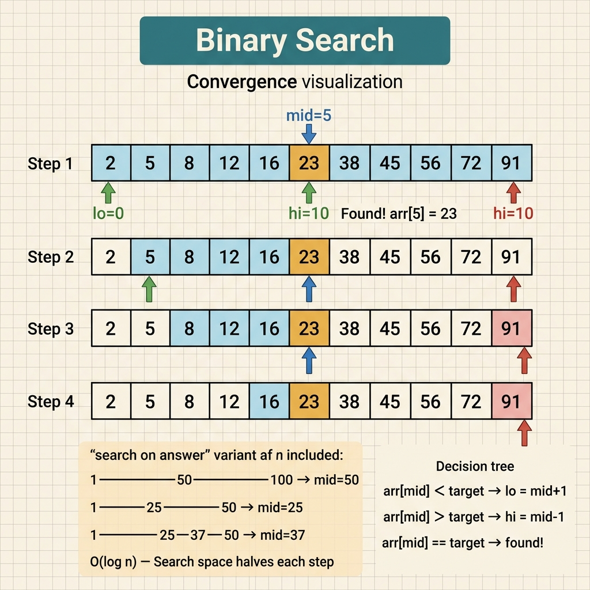

<!-- tags: leetcode, algorithms, coding-interview, binary-search -->
# 🔍 Binary Search

> Search in O(log n) — classic, bound search, rotated array, and search space reduction.

📅 Created: 2026-03-20 · 🔄 Updated: 2026-04-10 · ⏱️ 11 min read

| Aspect         | Detail                                           |
| -------------- | ------------------------------------------------ |
| **Complexity** | O(log n)                                         |
| **Use case**   | Sorted array, search space, min/max optimization |
| **Go stdlib**  | `sort.Search`, `sort.SearchInts`                 |
| **LeetCode**   | #33, #34, #35, #74, #153, #162, #704, #875       |

---

## 1. DEFINE

You have a sorted array and need to find a position. Alternatively, you must find a boundary between "good enough" and "not enough". 🔍 Binary Search helps you spot that boundary before your code strays.

People often learn `Binary Search` as a rote code snippet. Interviews test something different. They verify whether you realize that a problem does not ask for "a number in an array". It asks for the first boundary point or the smallest valid value.

This problem family relies on a single promise. A monotonic predicate divides the search space. If you fail to lock that predicate, `mid` acts just as a middle number, not an elimination tool.

Core insight: **Binary search proves reliable only when you have a clear monotonic predicate. Every decision to keep the left or right half must reduce the search space without losing the answer.**

| Variant | When to use | Core idea |
| ------- | ------- | ------- |
| Exact search | Sorted array, need to find exact value | Compare `mid` with target to drop half of the search space. |
| Lower/upper bound | Need insertion point, first true, last false | Treat binary search as a boundary problem instead of a value search. |
| Binary search on answer | Problem asks for min/max value meeting condition | Write a `can(mid)` predicate and search on the answer space. |
| Rotated / structured array | Array is partially sorted with local invariants | Use the sorted half to decide whether to drop the other half. |

| Approach | Time | Space | When to choose |
|---|----------|-----|---------|
| Classic binary search | O(log n) | O(1) | Use when array is fully sorted and predicate is equality. |
| Lower / upper bound | O(log n) | O(1) | Use when you need the first position, last position, or insertion point. |
| Search on answer | O(log range) * cost(check) | O(1) | Use when the answer is a number and the predicate is monotonic. |
| Structured-array search | O(log n) | O(1) | Use when input has partial order like a rotated array. |

### 1.1 Quick Recognition

- Problems contain signals like `sorted`, `O(log n)`, `first/last`, `minimum feasible`, `maximize`, or `minimize`.
- You do not always search on an array. Many problems require searching on an answer space.
- You must define whether you seek `first true`, `last true`, or `exact match` before writing the loop.

### 1.2 Invariants & Failure Modes

- Every iteration must keep the answer strictly within `[lo, hi]` or `[lo, hi)` based on the chosen convention.
- A predicate for searching on an answer must remain monotonic. Without this property, splitting the space loses its meaning.
- Common failure: You write the correct template but mix up `exact match` and `boundary search`. The loop runs while the answer stays one index off.

## 2. VISUAL

The four binary search variants all split the space. However, their predicates and boundary contracts differ completely. The image below maps decisions to help you try the right variant before reading detailed traces.

### Overview — Binary Search Variants



*Caption: Every variant divides the search space. They differ by the predicate that decides which half to drop.*

### Level 1 — Core intuition

```text
arr = [1, 3, 5, 7, 9, 11], target = 7
lo=0, hi=5
mid=2 -> arr[mid]=5 < 7 => drop left half + mid
lo=3, hi=5
mid=4 -> arr[mid]=9 > 7 => drop right half
lo=3, hi=3 => found
```

*Caption: Level 1 highlights the simplest invariant. After each step, the target remains in the new candidate range if it exists.*

### Level 2 — Decision trace

- Choose an interval convention from the start: `[lo, hi]` or `[lo, hi)`.
- Write clearly which predicate allows dropping the left half or right half.
- For a lower bound, keep `mid` in the candidate range when `check(mid)` evaluates to true.
- For search on answer, `can(mid)` must act monotonically. Otherwise, binary search merely guesses.

The trace shows how lo and hi narrow at each step. Code turns that intuition into an implementation. However, the `<` vs `<=` boundary remains a frequent interview trap.

## 3. PLAYGROUND

The static overview routes you to the correct variant. The playground below reveals dynamic movements that a static card cannot show. Observe how `lo`, `hi`, and `mid` narrow the search space on a specific input.

Use it to study exact matches first. Once your eyes catch left and right eliminations easily, the lower bound and search-on-answer templates will look less like formulas to memorize.

::: algorithm-playground
src: ./playgrounds/02-binary-search.playground.yml
:::

## 4. CODE

Code becomes mechanical once you lock the predicate and interval convention. We move from exact match to boundary search, then escalate to binary search on answer.

### Problem 1: Basic — Classic & Bounds [LC #704, #35, #34]
> **Goal**: 3 basic templates for binary search.
> **Approach**: Sorted array.
> **Example**: Input involves a sorted array or answer space. Output provides an index, a value, or the first valid boundary.
> **Complexity**: Exact match, first position, first and last position.

```go
// leetcode/binary_search.go
package leetcode

// ✅ LC #704: Binary Search — Classic template
// Time: O(log n), Space: O(1)
func search(nums []int, target int) int {
    lo, hi := 0, len(nums)-1

    for lo <= hi { // ⚠️ INCLUSIVE: lo can equal hi.
        mid := lo + (hi-lo)/2 // ⚠️ Avoid overflow (do not use (lo+hi)/2).

        if nums[mid] == target {
            return mid
        } else if nums[mid] < target {
            lo = mid + 1
        } else {
            hi = mid - 1
        }
    }

    return -1 // Not found
}

// ✅ LC #35: Search Insert Position (= Lower Bound)
// Find the FIRST position where nums[pos] >= target.
// Time: O(log n), Space: O(1)
func searchInsert(nums []int, target int) int {
    lo, hi := 0, len(nums) // ⚠️ hi = len, not len-1.

    for lo < hi { // ⚠️ EXCLUSIVE
        mid := lo + (hi-lo)/2

        if nums[mid] >= target {
            hi = mid // ⚠️ mid could be the answer.
        } else {
            lo = mid + 1
        }
    }

    return lo // ✅ First position where nums[lo] >= target.
}

// ✅ LC #34: Find First and Last Position of Element
// Combines lower bound + upper bound.
// Time: O(log n), Space: O(1)
func searchRange(nums []int, target int) []int {
    first := lowerBound(nums, target)
    if first == len(nums) || nums[first] != target {
        return []int{-1, -1}
    }

    // ✅ Last = lowerBound(target+1) - 1.
    last := lowerBound(nums, target+1) - 1
    return []int{first, last}
}

// ✅ Helper: Lower Bound — first index where nums[i] >= target.
func lowerBound(nums []int, target int) int {
    lo, hi := 0, len(nums)
    for lo < hi {
        mid := lo + (hi-lo)/2
        if nums[mid] >= target {
            hi = mid
        } else {
            lo = mid + 1
        }
    }
    return lo
}

// ✅ Go stdlib equivalent
// sort.SearchInts(nums, target) returns lower bound.
// sort.Search(n, func(i int) bool { return nums[i] >= target })
```

```typescript
// leetcode/binary_search.ts
function search(nums: number[], target: number): number {
  let lo = 0, hi = nums.length - 1;
  while (lo <= hi) {
    const mid = lo + Math.floor((hi - lo) / 2);
    if (nums[mid] === target) return mid;
    if (nums[mid] < target) lo = mid + 1;
    else hi = mid - 1;
  }
  return -1;
}

function searchInsert(nums: number[], target: number): number {
  let lo = 0, hi = nums.length;
  while (lo < hi) {
    const mid = lo + Math.floor((hi - lo) / 2);
    if (nums[mid] >= target) hi = mid;
    else lo = mid + 1;
  }
  return lo;
}

function searchRange(nums: number[], target: number): number[] {
  const first = lowerBound(nums, target);
  if (first === nums.length || nums[first] !== target) return [-1, -1];
  return [first, lowerBound(nums, target + 1) - 1];
}

function lowerBound(nums: number[], target: number): number {
  let lo = 0, hi = nums.length;
  while (lo < hi) {
    const mid = lo + Math.floor((hi - lo) / 2);
    if (nums[mid] >= target) hi = mid;
    else lo = mid + 1;
  }
  return lo;
}
```

```rust
// leetcode/binary_search.rs
fn search(nums: &[i32], target: i32) -> i32 {
    let (mut lo, mut hi) = (0i32, nums.len() as i32 - 1);
    while lo <= hi {
        let mid = lo + (hi - lo) / 2;
        match nums[mid as usize].cmp(&target) {
            std::cmp::Ordering::Equal => return mid,
            std::cmp::Ordering::Less => lo = mid + 1,
            std::cmp::Ordering::Greater => hi = mid - 1,
        }
    }
    -1
}

fn search_insert(nums: &[i32], target: i32) -> usize {
    let (mut lo, mut hi) = (0usize, nums.len());
    while lo < hi {
        let mid = lo + (hi - lo) / 2;
        if nums[mid] >= target { hi = mid; } else { lo = mid + 1; }
    }
    lo
}

fn search_range(nums: &[i32], target: i32) -> Vec<i32> {
    let first = lower_bound(nums, target);
    if first == nums.len() || nums[first] != target { return vec![-1, -1]; }
    vec![first as i32, (lower_bound(nums, target + 1) - 1) as i32]
}

fn lower_bound(nums: &[i32], target: i32) -> usize {
    let (mut lo, mut hi) = (0usize, nums.len());
    while lo < hi {
        let mid = lo + (hi - lo) / 2;
        if nums[mid] >= target { hi = mid; } else { lo = mid + 1; }
    }
    lo
}
```

```cpp
// leetcode/binary_search.cpp
#include <vector>

int search(const std::vector<int>& nums, int target) {
    int lo = 0, hi = static_cast<int>(nums.size()) - 1;
    while (lo <= hi) {
        int mid = lo + (hi - lo) / 2;
        if (nums[mid] == target) return mid;
        if (nums[mid] < target) lo = mid + 1;
        else hi = mid - 1;
    }
    return -1;
}

int search_insert(const std::vector<int>& nums, int target) {
    int lo = 0, hi = static_cast<int>(nums.size());
    while (lo < hi) {
        int mid = lo + (hi - lo) / 2;
        if (nums[mid] >= target) hi = mid;
        else lo = mid + 1;
    }
    return lo;
}

int lower_bound_idx(const std::vector<int>& nums, int target) {
    int lo = 0, hi = static_cast<int>(nums.size());
    while (lo < hi) {
        int mid = lo + (hi - lo) / 2;
        if (nums[mid] >= target) hi = mid;
        else lo = mid + 1;
    }
    return lo;
}

std::vector<int> search_range(const std::vector<int>& nums, int target) {
    int first = lower_bound_idx(nums, target);
    if (first == static_cast<int>(nums.size()) || nums[first] != target) return {-1, -1};
    return {first, lower_bound_idx(nums, target + 1) - 1};
}
```

```python
# leetcode/binary_search.py
def search(nums: list[int], target: int) -> int:
    lo, hi = 0, len(nums) - 1
    while lo <= hi:
        mid = lo + (hi - lo) // 2
        if nums[mid] == target:
            return mid
        if nums[mid] < target:
            lo = mid + 1
        else:
            hi = mid - 1
    return -1

def search_insert(nums: list[int], target: int) -> int:
    lo, hi = 0, len(nums)
    while lo < hi:
        mid = lo + (hi - lo) // 2
        if nums[mid] >= target:
            hi = mid
        else:
            lo = mid + 1
    return lo

def lower_bound(nums: list[int], target: int) -> int:
    lo, hi = 0, len(nums)
    while lo < hi:
        mid = lo + (hi - lo) // 2
        if nums[mid] >= target:
            hi = mid
        else:
            lo = mid + 1
    return lo

def search_range(nums: list[int], target: int) -> list[int]:
    first = lower_bound(nums, target)
    if first == len(nums) or nums[first] != target:
        return [-1, -1]
    return [first, lower_bound(nums, target + 1) - 1]
```

> **Why?** Binary search works only when the predicate completely drops half of the search space. If `mid` cannot mark a part useless, the loop continues but the reasoning fails fundamentally.

> **Conclusion**: This **Basic** example illustrates how to use `Classic & Bounds [LC #704, #35, #34]` without skipping reasoning. Move to the next example when constraints shift or demand optimization.

**✅ Achieved**: 3 templates — classic (lo<=hi), lower bound (lo<hi, hi=mid), and range search.
**⚠️ Warning**: `mid = lo + (hi-lo)/2` prevents integer overflow. Go's `sort.Search` acts as a lower bound.

---

### Problem 2: Intermediate — Rotated Array & Peak [LC #33, #153, #162]
> **Goal**: Binary search on an array that is NOT perfectly sorted.
> **Approach**: Determine which half is sorted at each step.
> **Example**: Input involves a sorted array or answer space. Output provides an index, a value, or the first valid boundary.
> **Complexity**: O(log n) for rotated arrays and peak finding.

```go
// leetcode/binary_search_advanced.go
package leetcode

// ✅ LC #33: Search in Rotated Sorted Array
// Trick: One half is always sorted → check if it contains target.
// Time: O(log n), Space: O(1)
func searchRotated(nums []int, target int) int {
    lo, hi := 0, len(nums)-1

    for lo <= hi {
        mid := lo + (hi-lo)/2

        if nums[mid] == target {
            return mid
        }

        // ✅ Determine WHICH half is sorted.
        if nums[lo] <= nums[mid] {
            // Left half [lo..mid] is sorted.
            if nums[lo] <= target && target < nums[mid] {
                // ✅ Target inside left half.
                hi = mid - 1
            } else {
                // ✅ Target inside right half.
                lo = mid + 1
            }
        } else {
            // Right half [mid..hi] is sorted.
            if nums[mid] < target && target <= nums[hi] {
                lo = mid + 1
            } else {
                hi = mid - 1
            }
        }
    }

    return -1
}

// ✅ LC #153: Find Minimum in Rotated Sorted Array
// Minimum always lies in the UNSORTED half.
// Time: O(log n), Space: O(1)
func findMin(nums []int) int {
    lo, hi := 0, len(nums)-1

    for lo < hi {
        mid := lo + (hi-lo)/2

        if nums[mid] > nums[hi] {
            // ⚠️ Minimum lies right of mid (rotated part).
            lo = mid + 1
        } else {
            // ✅ Minimum lies at mid or to its left.
            hi = mid // ⚠️ mid could be the answer.
        }
    }

    return nums[lo]
}

// ✅ LC #162: Find Peak Element
// Peak: nums[i] > nums[i-1] AND nums[i] > nums[i+1]
// Trick: If nums[mid] < nums[mid+1] → peak lies on the right.
// Time: O(log n), Space: O(1)
func findPeakElement(nums []int) int {
    lo, hi := 0, len(nums)-1

    for lo < hi {
        mid := lo + (hi-lo)/2

        if nums[mid] < nums[mid+1] {
            // ✅ Ascending slope → peak lies on the right.
            lo = mid + 1
        } else {
            // ✅ Descending slope or at peak → peak lies at mid or left.
            hi = mid
        }
    }

    return lo // ✅ lo == hi = peak index
}
```

```typescript
// leetcode/binary_search_advanced.ts
function searchRotated(nums: number[], target: number): number {
  let lo = 0, hi = nums.length - 1;
  while (lo <= hi) {
    const mid = lo + Math.floor((hi - lo) / 2);
    if (nums[mid] === target) return mid;
    if (nums[lo] <= nums[mid]) {
      if (nums[lo] <= target && target < nums[mid]) hi = mid - 1;
      else lo = mid + 1;
    } else {
      if (nums[mid] < target && target <= nums[hi]) lo = mid + 1;
      else hi = mid - 1;
    }
  }
  return -1;
}

function findMin(nums: number[]): number {
  let lo = 0, hi = nums.length - 1;
  while (lo < hi) {
    const mid = lo + Math.floor((hi - lo) / 2);
    if (nums[mid] > nums[hi]) lo = mid + 1;
    else hi = mid;
  }
  return nums[lo];
}

function findPeakElement(nums: number[]): number {
  let lo = 0, hi = nums.length - 1;
  while (lo < hi) {
    const mid = lo + Math.floor((hi - lo) / 2);
    if (nums[mid] < nums[mid + 1]) lo = mid + 1;
    else hi = mid;
  }
  return lo;
}
```

```rust
// leetcode/binary_search_advanced.rs
fn search_rotated(nums: &[i32], target: i32) -> i32 {
    let (mut lo, mut hi) = (0i32, nums.len() as i32 - 1);
    while lo <= hi {
        let mid = lo + (hi - lo) / 2;
        if nums[mid as usize] == target { return mid; }
        if nums[lo as usize] <= nums[mid as usize] {
            if nums[lo as usize] <= target && target < nums[mid as usize] { hi = mid - 1; }
            else { lo = mid + 1; }
        } else if nums[mid as usize] < target && target <= nums[hi as usize] {
            lo = mid + 1;
        } else {
            hi = mid - 1;
        }
    }
    -1
}

fn find_min(nums: &[i32]) -> i32 {
    let (mut lo, mut hi) = (0usize, nums.len() - 1);
    while lo < hi {
        let mid = lo + (hi - lo) / 2;
        if nums[mid] > nums[hi] { lo = mid + 1; } else { hi = mid; }
    }
    nums[lo]
}

fn find_peak_element(nums: &[i32]) -> usize {
    let (mut lo, mut hi) = (0usize, nums.len() - 1);
    while lo < hi {
        let mid = lo + (hi - lo) / 2;
        if nums[mid] < nums[mid + 1] { lo = mid + 1; } else { hi = mid; }
    }
    lo
}
```

```cpp
// leetcode/binary_search_advanced.cpp
int search_rotated(const std::vector<int>& nums, int target) {
    int lo = 0, hi = static_cast<int>(nums.size()) - 1;
    while (lo <= hi) {
        int mid = lo + (hi - lo) / 2;
        if (nums[mid] == target) return mid;
        if (nums[lo] <= nums[mid]) {
            if (nums[lo] <= target && target < nums[mid]) hi = mid - 1;
            else lo = mid + 1;
        } else {
            if (nums[mid] < target && target <= nums[hi]) lo = mid + 1;
            else hi = mid - 1;
        }
    }
    return -1;
}

int find_min(const std::vector<int>& nums) {
    int lo = 0, hi = static_cast<int>(nums.size()) - 1;
    while (lo < hi) {
        int mid = lo + (hi - lo) / 2;
        if (nums[mid] > nums[hi]) lo = mid + 1;
        else hi = mid;
    }
    return nums[lo];
}

int find_peak_element(const std::vector<int>& nums) {
    int lo = 0, hi = static_cast<int>(nums.size()) - 1;
    while (lo < hi) {
        int mid = lo + (hi - lo) / 2;
        if (nums[mid] < nums[mid + 1]) lo = mid + 1;
        else hi = mid;
    }
    return lo;
}
```

```python
# leetcode/binary_search_advanced.py
def search_rotated(nums: list[int], target: int) -> int:
    lo, hi = 0, len(nums) - 1
    while lo <= hi:
        mid = lo + (hi - lo) // 2
        if nums[mid] == target:
            return mid
        if nums[lo] <= nums[mid]:
            if nums[lo] <= target < nums[mid]:
                hi = mid - 1
            else:
                lo = mid + 1
        else:
            if nums[mid] < target <= nums[hi]:
                lo = mid + 1
            else:
                hi = mid - 1
    return -1

def find_min(nums: list[int]) -> int:
    lo, hi = 0, len(nums) - 1
    while lo < hi:
        mid = lo + (hi - lo) // 2
        if nums[mid] > nums[hi]:
            lo = mid + 1
        else:
            hi = mid
    return nums[lo]

def find_peak_element(nums: list[int]) -> int:
    lo, hi = 0, len(nums) - 1
    while lo < hi:
        mid = lo + (hi - lo) // 2
        if nums[mid] < nums[mid + 1]:
            lo = mid + 1
        else:
            hi = mid
    return lo
```

> **Why?** Binary search works only when the predicate completely drops half of the search space. If `mid` cannot mark a part useless, the loop continues but the reasoning fails fundamentally.

> **Conclusion**: This **Intermediate** example illustrates how to use `Rotated Array & Peak [LC #33, #153, #162]` without skipping reasoning. Move to the next example when constraints shift or demand optimization.

**✅ Achieved**: Rotated array search, find minimum, and peak element finding — all in O(log n).
**⚠️ Warning**: Rotated array: compare `nums[lo]` with `nums[mid]` to determine the sorted half. Find min: compare `nums[mid]` with `nums[hi]`.

---

### Problem 3: Advanced — Binary Search on Answer [LC #875, #74]
> **Goal**: Binary search on an answer space instead of an array.
> **Approach**: Monotonic condition — if k works, then k+1 also works.
> **Example**: Input involves a sorted array or answer space. Output provides an index, a value, or the first valid boundary.
> **Complexity**: Optimizes "find minimum X satisfying condition Y" problems.

```go
// leetcode/binary_search_answer.go
package leetcode

// ✅ LC #875: Koko Eating Bananas
// Find minimum eating speed k to finish within h hours.
// Binary search on answer: search space = [1, max(piles)]
// Time: O(n * log(max(piles))), Space: O(1)
func minEatingSpeed(piles []int, h int) int {
    // ✅ Search space: [1, max(piles)]
    lo, hi := 1, 0
    for _, p := range piles {
        if p > hi {
            hi = p
        }
    }

    // ✅ Binary search on answer
    for lo < hi {
        mid := lo + (hi-lo)/2

        if canFinish(piles, mid, h) {
            // ✅ Mid speed suffices → try slower.
            hi = mid
        } else {
            // ⚠️ Mid speed fails → must go faster.
            lo = mid + 1
        }
    }

    return lo
}

// ✅ Check: Can finish in h hours at speed k?
func canFinish(piles []int, k, h int) bool {
    hours := 0
    for _, p := range piles {
        // ✅ ceil(p/k) = (p + k - 1) / k
        hours += (p + k - 1) / k
    }
    return hours <= h
}

// ✅ LC #74: Search a 2D Matrix
// Matrix sorted row-wise + first element > last of previous row.
// Trick: Flatten to 1D array conceptually.
// Time: O(log(m*n)), Space: O(1)
func searchMatrix(matrix [][]int, target int) bool {
    if len(matrix) == 0 || len(matrix[0]) == 0 {
        return false
    }

    m, n := len(matrix), len(matrix[0])
    lo, hi := 0, m*n-1

    for lo <= hi {
        mid := lo + (hi-lo)/2
        // ✅ Convert 1D index to 2D coordinates.
        row := mid / n
        col := mid % n
        val := matrix[row][col]

        if val == target {
            return true
        } else if val < target {
            lo = mid + 1
        } else {
            hi = mid - 1
        }
    }

    return false
}

// ✅ LC #1011: Capacity To Ship Packages Within D Days
// Similar to Koko Bananas — binary search on answer.
// Search space: [max(weights), sum(weights)]
// Time: O(n * log(sum-max)), Space: O(1)
func shipWithinDays(weights []int, days int) int {
    lo, hi := 0, 0
    for _, w := range weights {
        if w > lo {
            lo = w // ⚠️ Minimum capacity = heaviest package.
        }
        hi += w // Maximum capacity = sum of all.
    }

    for lo < hi {
        mid := lo + (hi-lo)/2

        if canShip(weights, mid, days) {
            hi = mid
        } else {
            lo = mid + 1
        }
    }

    return lo
}

func canShip(weights []int, capacity, days int) bool {
    daysNeeded := 1
    currentLoad := 0

    for _, w := range weights {
        if currentLoad+w > capacity {
            daysNeeded++
            currentLoad = w
        } else {
            currentLoad += w
        }
    }

    return daysNeeded <= days
}
```

```typescript
// leetcode/binary_search_answer.ts
function minEatingSpeed(piles: number[], h: number): number {
  let lo = 1, hi = Math.max(...piles);
  while (lo < hi) {
    const mid = lo + Math.floor((hi - lo) / 2);
    if (canFinish(piles, mid, h)) hi = mid;
    else lo = mid + 1;
  }
  return lo;
}

function canFinish(piles: number[], k: number, h: number): boolean {
  let hours = 0;
  for (const pile of piles) hours += Math.floor((pile + k - 1) / k);
  return hours <= h;
}

function searchMatrix(matrix: number[][], target: number): boolean {
  if (matrix.length === 0 || matrix[0].length === 0) return false;
  const rows = matrix.length, cols = matrix[0].length;
  let lo = 0, hi = rows * cols - 1;
  while (lo <= hi) {
    const mid = lo + Math.floor((hi - lo) / 2);
    const value = matrix[Math.floor(mid / cols)][mid % cols];
    if (value === target) return true;
    if (value < target) lo = mid + 1;
    else hi = mid - 1;
  }
  return false;
}

function shipWithinDays(weights: number[], days: number): number {
  let lo = Math.max(...weights), hi = weights.reduce((a, b) => a + b, 0);
  while (lo < hi) {
    const mid = lo + Math.floor((hi - lo) / 2);
    if (canShip(weights, mid, days)) hi = mid;
    else lo = mid + 1;
  }
  return lo;
}

function canShip(weights: number[], capacity: number, days: number): boolean {
  let needed = 1, load = 0;
  for (const w of weights) {
    if (load + w > capacity) {
      needed++;
      load = w;
    } else {
      load += w;
    }
  }
  return needed <= days;
}
```

```rust
// leetcode/binary_search_answer.rs
fn min_eating_speed(piles: &[i32], h: i32) -> i32 {
    let (mut lo, mut hi) = (1, *piles.iter().max().unwrap());
    while lo < hi {
        let mid = lo + (hi - lo) / 2;
        if can_finish(piles, mid, h) { hi = mid; } else { lo = mid + 1; }
    }
    lo
}

fn can_finish(piles: &[i32], k: i32, h: i32) -> bool {
    piles.iter().map(|&p| (p + k - 1) / k).sum::<i32>() <= h
}

fn search_matrix(matrix: &[Vec<i32>], target: i32) -> bool {
    if matrix.is_empty() || matrix[0].is_empty() { return false; }
    let cols = matrix[0].len();
    let (mut lo, mut hi) = (0i32, (matrix.len() * cols - 1) as i32);
    while lo <= hi {
        let mid = lo + (hi - lo) / 2;
        let val = matrix[mid as usize / cols][mid as usize % cols];
        if val == target { return true; }
        if val < target { lo = mid + 1; } else { hi = mid - 1; }
    }
    false
}

fn ship_within_days(weights: &[i32], days: i32) -> i32 {
    let (mut lo, mut hi) = (*weights.iter().max().unwrap(), weights.iter().sum());
    while lo < hi {
        let mid = lo + (hi - lo) / 2;
        if can_ship(weights, mid, days) { hi = mid; } else { lo = mid + 1; }
    }
    lo
}

fn can_ship(weights: &[i32], capacity: i32, days: i32) -> bool {
    let (mut needed, mut load) = (1, 0);
    for &w in weights {
        if load + w > capacity {
            needed += 1;
            load = w;
        } else {
            load += w;
        }
    }
    needed <= days
}
```

```cpp
// leetcode/binary_search_answer.cpp
bool can_finish(const std::vector<int>& piles, int k, int h) {
    int hours = 0;
    for (int p : piles) hours += (p + k - 1) / k;
    return hours <= h;
}

int min_eating_speed(const std::vector<int>& piles, int h) {
    int lo = 1, hi = *std::max_element(piles.begin(), piles.end());
    while (lo < hi) {
        int mid = lo + (hi - lo) / 2;
        if (can_finish(piles, mid, h)) hi = mid;
        else lo = mid + 1;
    }
    return lo;
}

bool search_matrix(const std::vector<std::vector<int>>& matrix, int target) {
    if (matrix.empty() || matrix[0].empty()) return false;
    int rows = static_cast<int>(matrix.size()), cols = static_cast<int>(matrix[0].size());
    int lo = 0, hi = rows * cols - 1;
    while (lo <= hi) {
        int mid = lo + (hi - lo) / 2;
        int val = matrix[mid / cols][mid % cols];
        if (val == target) return true;
        if (val < target) lo = mid + 1;
        else hi = mid - 1;
    }
    return false;
}

bool can_ship(const std::vector<int>& weights, int capacity, int days) {
    int needed = 1, load = 0;
    for (int w : weights) {
        if (load + w > capacity) {
            ++needed;
            load = w;
        } else {
            load += w;
        }
    }
    return needed <= days;
}

int ship_within_days(const std::vector<int>& weights, int days) {
    int lo = *std::max_element(weights.begin(), weights.end());
    int hi = std::accumulate(weights.begin(), weights.end(), 0);
    while (lo < hi) {
        int mid = lo + (hi - lo) / 2;
        if (can_ship(weights, mid, days)) hi = mid;
        else lo = mid + 1;
    }
    return lo;
}
```

```python
# leetcode/binary_search_answer.py
def min_eating_speed(piles: list[int], h: int) -> int:
    lo, hi = 1, max(piles)
    while lo < hi:
        mid = lo + (hi - lo) // 2
        if can_finish(piles, mid, h):
            hi = mid
        else:
            lo = mid + 1
    return lo

def can_finish(piles: list[int], k: int, h: int) -> bool:
    return sum((p + k - 1) // k for p in piles) <= h

def search_matrix(matrix: list[list[int]], target: int) -> bool:
    if not matrix or not matrix[0]:
        return False
    rows, cols = len(matrix), len(matrix[0])
    lo, hi = 0, rows * cols - 1
    while lo <= hi:
        mid = lo + (hi - lo) // 2
        value = matrix[mid // cols][mid % cols]
        if value == target:
            return True
        if value < target:
            lo = mid + 1
        else:
            hi = mid - 1
    return False

def ship_within_days(weights: list[int], days: int) -> int:
    lo, hi = max(weights), sum(weights)
    while lo < hi:
        mid = lo + (hi - lo) // 2
        if can_ship(weights, mid, days):
            hi = mid
        else:
            lo = mid + 1
    return lo

def can_ship(weights: list[int], capacity: int, days: int) -> bool:
    needed, load = 1, 0
    for w in weights:
        if load + w > capacity:
            needed += 1
            load = w
        else:
            load += w
    return needed <= days
```

> **Why?** Binary search works only when the predicate completely drops half of the search space. If `mid` cannot mark a part useless, the loop continues but the reasoning fails fundamentally.

> **Conclusion**: This **Advanced** example illustrates how to use `Binary Search on Answer [LC #875, #74]` without skipping reasoning. Move to the next example when constraints shift or demand optimization.

**✅ Achieved**: Binary search on answer — a crucial technique for min/max optimization.
**⚠️ Warning**: Search pattern uses `lo < hi` and `hi = mid` to find the minimum. Always cover all possible answers with lo and hi.

---

Sample code looks clean. However, binary search holds a reputation for off-by-one bugs. Small tests never catch these errors.

## 5. PITFALLS

Errors rarely stem from a missing `mid`. They usually stem from a wrong predicate, wrong interval, or wrong exit condition.

| # | Severity | Error | Consequence | Fix |
|---|----------|-----|---------|-----|
| 1 | 🔴 Fatal | Integer overflow: `(lo+hi)/2` | Result fails when sum exceeds MaxInt. | Use `lo + (hi-lo)/2`. |
| 2 | 🟡 Common | Infinite loop: `lo=mid` when `lo<hi` | Program hangs indefinitely. | Use `lo=mid+1` or adjust mid calculation. |
| 3 | 🟡 Common | Off-by-one: `hi=len(nums)` vs `len(nums)-1` | Returns wrong index or crashes. | Depends on template: inclusive or exclusive. |
| 4 | 🔵 Minor | Rotated array: `nums[lo] < nums[mid]` | Misses target when lo equals mid. | Use `<=` because lo can equal mid. |
| 5 | 🔵 Minor | Search on answer: incorrect bounds | Misses valid answers outside range. | Set lo to min possible, hi to max possible. |
| 6 | 🔵 Minor | Forget sorted check | Produces undefined results. | Use only when data has monotonic properties. |
| 7 | 🔵 Minor | Wrong ceiling division: `p/k` | Underestimates required splits. | Use `(p+k-1)/k` to calculate ceiling properly. |

### 🔴 Pitfall #1 — Integer overflow hidden in mid calculation

Classic code that almost everyone writes the first time:

```go
mid := (lo + hi) / 2
```

When `lo` and `hi` both approach `MaxInt`, the sum overflows and mid becomes negative. This bug never appears in small tests because the array must be massive.

**Fix**: Use `mid := lo + (hi-lo)/2`. Subtraction never overflows because `hi >= lo`. This represents defensive coding, not a micro-optimization.

---

## 6. REF

| Resource                    | Difficulty | Link                                                                                                                  |
| --------------------------- | ---------- | --------------------------------------------------------------------------------------------------------------------- |
| LC #704 Binary Search       | 🟢 Easy    | [leetcode.com/problems/binary-search](https://leetcode.com/problems/binary-search/)                                   |
| LC #33 Search Rotated Array | 🟡 Medium  | [leetcode.com/problems/search-in-rotated-sorted-array](https://leetcode.com/problems/search-in-rotated-sorted-array/) |
| LC #875 Koko Eating Bananas | 🟡 Medium  | [leetcode.com/problems/koko-eating-bananas](https://leetcode.com/problems/koko-eating-bananas/)                       |
| Go sort.Search              | —          | [pkg.go.dev/sort#Search](https://pkg.go.dev/sort#Search)                                                              |
| Binary Search Template      | —          | [leetcode.com/discuss/general-discussion/786126](https://leetcode.com/discuss/general-discussion/786126/)             |

---

## 7. RECOMMEND

Your foundational binary search skills are solid. The next step connects to two pointers for pair lookups. You can also expand to search-on-answer for minimize or maximize problems.

| Extension | When to use | Reason | File/Link |
| ------- | ------- | ----- | --------- |
| Two Pointers | Sorted input with pair queries | Combines binary search with two pointers. | [01-two-pointers](./01-two-pointers-sliding-window.md) |
| Stack & Monotonic | Peak and next greater search | Combines search on answer with monotonic stacks. | [03-stack-queue-monotonic](./03-stack-queue-monotonic.md) |
| DSA Binary Search | Deep primitive understanding | Provides a detailed pattern handbook. | [dsa/patterns/binary-search](../dsa/patterns/binary-search/) |
| Sorting & Searching | Partition and kth element | Expands the overall search paradigm. | [20-sorting-searching](./20-sorting-searching.md) |

---

## 8. QUICK REF

### Interview templates

```go
// Lower Bound (first true)
lo, hi := 0, len(arr)
for lo < hi {
    mid := lo + (hi-lo)/2
    if check(arr[mid]) { hi = mid } else { lo = mid + 1 }
}
return lo

// Binary Search on Answer — Minimize
lo, hi := minPossible, maxPossible
for lo < hi {
    mid := lo + (hi-lo)/2
    if canAchieve(mid) { hi = mid } else { lo = mid + 1 }
}
return lo
```

| Situation / Signal | Pattern / Approach | Complexity | When to use | Warning |
|--------------------|--------------------|------------|----------|----------|
| sorted + find exact | Classic BS (lo<=hi) | O(log n) | Find exact element. | Use subtraction to avoid overflow. |
| first true / last true | Lower/upper bound (lo<hi) | O(log n) | First bad version or insert. | Wrong boundary causes infinite loop. |
| minimum feasible value | BS on answer + feasibility check | O(n·log(range)) | Koko, split array, ship packages. | Bounds must cover all possible answers. |
| rotated sorted array | BS + identify sorted half | O(log n) | Search rotated or find minimum. | Must check equality when lo equals mid. |
| peak element / mountain | BS + compare mid vs mid+1 | O(log n) | Evaluate unimodal functions. | Ensure convergence with hi=mid and lo=mid+1. |
| 2D matrix search | Row BS + col BS or flatten | O(log(m·n)) | Matrix sorted by row and col. | Determine exactly how the matrix sorts. |

---

Let us return to the opening question. Search on answer does not find an element; it finds a boundary. You now know exactly when to use `lo < hi` versus `lo <= hi`. You also understand why a single wrong character causes an infinite loop.

---

**Links**: [← Two Pointers](./01-two-pointers-sliding-window.md) · [→ Stack & Queue](./03-stack-queue-monotonic.md)
