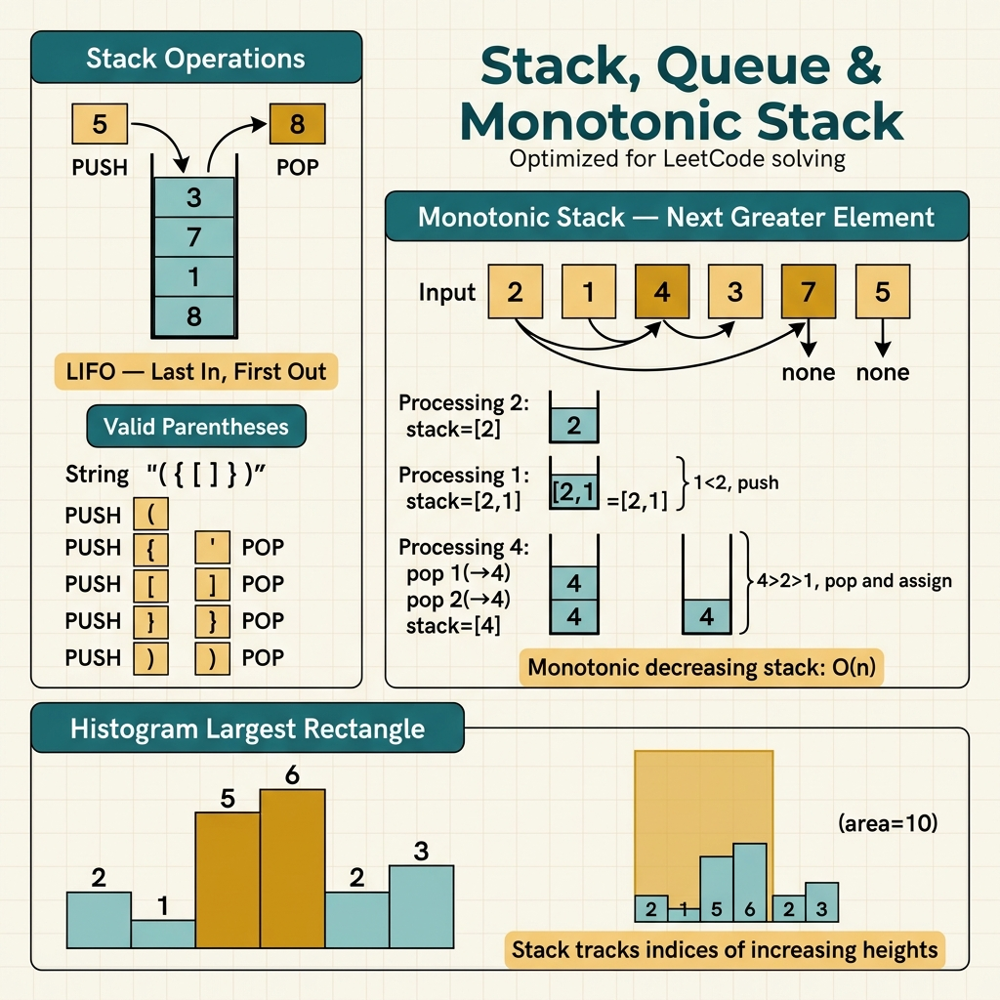

<!-- tags: leetcode, algorithms, coding-interview, stack-queue -->
# 📚 Stack, Queue & Monotonic

> Stack LIFO, Queue FIFO, Monotonic Stack/Queue — solves next greater, valid parentheses, histogram.

📅 Created: 2026-03-20 · 🔄 Updated: 2026-04-10 · ⏱️ 10 min read

| Aspect         | Detail                                                                    |
| -------------- | ------------------------------------------------------------------------- |
| **Complexity** | O(n) amortized.                                                           |
| **Use case**   | Parentheses matching, next greater/smaller, histogram, sliding window max.|
| **Go stdlib**  | Slice as stack, `container/list`.                                         |
| **LeetCode**   | #20, #84, #155, #239, #496, #739, #853.                                   |

---

### Interview template

> Copy-paste when facing this pattern in an interview.

```go
// ── Monotonic Stack — Next Greater Element (store indices) ─────
stack := make([]int, 0, n)
for i := 0; i < n; i++ {
    for len(stack) > 0 && arr[stack[len(stack)-1]] < arr[i] {
        idx := stack[len(stack)-1]
        stack = stack[:len(stack)-1]
        result[idx] = arr[i]    // arr[i] is NGE of arr[idx]
    }
    stack = append(stack, i)
}
// Elements remaining in stack → NGE = -1
```
```typescript
// ── Monotonic Stack — Next Greater Element (store indices) ─────
const stack: number[] = [];
for (let i = 0; i < n; i++) {
  while (stack.length > 0 && arr[stack[stack.length - 1]] < arr[i]) {
    const idx = stack.pop()!;
    result[idx] = arr[i];
  }
  stack.push(i);
}
// Remaining indices in stack -> NGE = -1
```
```rust
// ── Monotonic Stack — Next Greater Element (store indices) ─────
let mut stack: Vec<usize> = Vec::with_capacity(n);
for i in 0..n {
    while stack.last().is_some_and(|&idx| arr[idx] < arr[i]) {
        let idx = stack.pop().unwrap();
        result[idx] = arr[i];
    }
    stack.push(i);
}
```
```cpp
// ── Monotonic Stack — Next Greater Element (store indices) ─────
std::vector<int> stack;
for (int i = 0; i < n; ++i) {
    while (!stack.empty() && arr[stack.back()] < arr[i]) {
        int idx = stack.back();
        stack.pop_back();
        result[idx] = arr[i];
    }
    stack.push_back(i);
}
```
```python
# ── Monotonic Stack — Next Greater Element (store indices) ─────
stack: list[int] = []
for i in range(n):
    while stack and arr[stack[-1]] < arr[i]:
        idx = stack.pop()
        result[idx] = arr[i]
    stack.append(i)
```

---

## 1. DEFINE

You scan an array from left to right. At each position, you ask where the nearest greater or smaller element is. 📚 Stack, Queue & Monotonic help you recognize this boundary before your code goes the wrong direction.

Many interview problems look like local operations. They actually ask what past state the current element needs to make a decision now. This family answers that question with a deliberate linear state.

People often confuse this as a single stack pattern. In reality, each structure makes a different promise. A stack holds unclosed items. A queue holds early arrivals. A monotonic structure holds candidates that remain relevant after each step.

Core insight: **This family thrives when you keep only the history that affects the future and discard useless elements.**

| Variant | When to use | Core idea |
| ------- | ------- | ------- |
| Stack matching | Parentheses, undo, expression parsing. | Late arrivals process first to close pairs properly. |
| Queue / BFS helper | Need first-come-first-serve order. | FIFO maintains the frontier by time or level. |
| Monotonic stack | Next greater/smaller, histogram. | Keep stack monotonic so elements push/pop finitely. |
| Monotonic deque | Sliding window max/min. | Keep the best candidate at the front while discarding dominated ones. |

| Approach | Time | Space | When to choose |
|---|----------|-----|---------|
| Stack / queue primitive | O(n). | O(n). | Processing order defines the problem nature. |
| Monotonic stack | O(n) amortized. | O(n). | Each element needs its nearest greater/smaller neighbor. |
| Monotonic deque | O(n) amortized. | O(k). | Sliding window requires real-time max/min tracking. |
| Auxiliary min/max stack | O(1) per op. | O(n). | Design questions like Min Stack. |

### 1.1 Quick Recognition

- The problem mentions `next greater`, `valid parentheses`, `largest rectangle`, `sliding window max`, or `car fleet`.
- You must answer a current query using recent past state.
- A monotonic structure fits if an element becomes obsolete after a better element hides it.

### 1.2 Invariants & Failure Modes

- Stack or queue must encode the unprocessed order, not just store elements.
- A monotonic structure only keeps candidates not yet dominated by new elements.
- Common failure mode: pushing or popping without defining the relationship protected by the structure.

## 2. VISUAL

Stacks and queues maintain different data invariants. The image below classifies four sub-families. It shows when to use LIFO, FIFO, or monotonic structures.

### Overview — Stack, Queue & Monotonic



*Figure: Stack = past context, Queue = frontier. Monotonic = adds an ordering invariant.*

### Level 1 — Core intuition

```text
Monotonic decreasing stack for next greater:
arr = [2, 1, 2, 4, 3]
stack stores indices with values decreasing

push 2
push 1
see 2 -> pop 1 because 2 is next greater for 1
see 4 -> pop 2, pop 2 because 4 dominates both
```

*Caption*: Level 1 shows the monotonic logic. A strong new element pops all weaker elements waiting ahead.

### Level 2 — Decision trace

- With stack matching, the current top is always the nearest candidate needing a pair.
- With a monotonic stack, pick the right direction for next greater or next smaller.
- A sliding window deque must discard out-of-window elements and dominated elements.
- If you cannot explain why an element pops forever, you have not proven amortized O(n) time.

The trace shows how the stack grows and shrinks. We now move to code, where forgetting the empty check causes the most bugs.

## 3. CODE

When the active state is clear, the code just pushes, pops, and updates the answer. We move from basic stacks to complex monotonic variants.

### Problem 1: Basic — Valid Parentheses & Min Stack [LC #20, #155]
> **Goal**: Basic stack operations like matching and tracking minimums.
> **Approach**: Use a Go slice as a stack.
> **Example**: Input is a sequence. Output is a valid state or the current minimum.
> **Complexity**: O(n) for validation, O(1) for getting the minimum.

```go
// leetcode/stack_basic.go
package leetcode

// ✅ LC #20: Valid Parentheses
// Time: O(n), Space: O(n)
func isValid(s string) bool {
    stack := []byte{}
    pairs := map[byte]byte{
        ')': '(',
        ']': '[',
        '}': '{',
    }

    for i := 0; i < len(s); i++ {
        ch := s[i]

        if ch == '(' || ch == '[' || ch == '{' {
            // ✅ Opening bracket → push
            stack = append(stack, ch)
        } else {
            // ✅ Closing bracket → check match
            if len(stack) == 0 {
                return false // ⚠️ Nothing to match
            }
            top := stack[len(stack)-1]
            stack = stack[:len(stack)-1] // Pop

            if pairs[ch] != top {
                return false // ⚠️ Mismatch
            }
        }
    }

    return len(stack) == 0 // ⚠️ Stack must be empty
}

// ✅ LC #155: Min Stack
// Trick: 2 stacks — data stack + min tracking stack
// All operations O(1)
type MinStack struct {
    data []int
    mins []int // ✅ Track min at each level
}

func Constructor() MinStack {
    return MinStack{}
}

func (s *MinStack) Push(val int) {
    s.data = append(s.data, val)

    // ✅ Push into mins: min(val, current min)
    if len(s.mins) == 0 || val <= s.mins[len(s.mins)-1] {
        s.mins = append(s.mins, val)
    } else {
        s.mins = append(s.mins, s.mins[len(s.mins)-1])
    }
}

func (s *MinStack) Pop() {
    s.data = s.data[:len(s.data)-1]
    s.mins = s.mins[:len(s.mins)-1]
}

func (s *MinStack) Top() int {
    return s.data[len(s.data)-1]
}

func (s *MinStack) GetMin() int {
    return s.mins[len(s.mins)-1] // ✅ O(1) min lookup
}
```
```typescript
// leetcode/stack_basic.ts
function isValid(s: string): boolean {
  const stack: string[] = [];
  const pairs = new Map<string, string>([[")", "("], ["]", "["], ["}", "{"]]);
  for (const ch of s) {
    if (ch === "(" || ch === "[" || ch === "{") {
      stack.push(ch);
    } else {
      if (stack.length === 0) return false;
      const top = stack.pop()!;
      if (pairs.get(ch) !== top) return false;
    }
  }
  return stack.length === 0;
}

class MinStack {
  private data: number[] = [];
  private mins: number[] = [];

  push(val: number): void {
    this.data.push(val);
    if (this.mins.length === 0 || val <= this.mins[this.mins.length - 1]) this.mins.push(val);
    else this.mins.push(this.mins[this.mins.length - 1]);
  }

  pop(): void { this.data.pop(); this.mins.pop(); }
  top(): number { return this.data[this.data.length - 1]; }
  getMin(): number { return this.mins[this.mins.length - 1]; }
}
```
```rust
// leetcode/stack_basic.rs
fn is_valid(s: &str) -> bool {
    let mut stack = Vec::new();
    for ch in s.chars() {
        match ch {
            '(' | '[' | '{' => stack.push(ch),
            ')' | ']' | '}' => {
                let Some(top) = stack.pop() else { return false };
                if !matches!((top, ch), ('(', ')') | ('[', ']') | ('{', '}')) { return false; }
            }
            _ => {}
        }
    }
    stack.is_empty()
}

#[derive(Default)]
struct MinStack {
    data: Vec<i32>,
    mins: Vec<i32>,
}

impl MinStack {
    fn push(&mut self, val: i32) {
        self.data.push(val);
        let min_val = self.mins.last().copied().map_or(val, |cur| cur.min(val));
        self.mins.push(min_val);
    }
    fn pop(&mut self) { self.data.pop(); self.mins.pop(); }
    fn top(&self) -> i32 { *self.data.last().unwrap() }
    fn get_min(&self) -> i32 { *self.mins.last().unwrap() }
}
```
```cpp
// leetcode/stack_basic.cpp
#include <stack>
#include <string>
#include <vector>

bool is_valid(const std::string& s) {
    std::vector<char> stack;
    for (char ch : s) {
        if (ch == '(' || ch == '[' || ch == '{') stack.push_back(ch);
        else {
            if (stack.empty()) return false;
            char top = stack.back();
            stack.pop_back();
            if (!((top == '(' && ch == ')') || (top == '[' && ch == ']') || (top == '{' && ch == '}'))) return false;
        }
    }
    return stack.empty();
}

class MinStack {
    std::vector<int> data_, mins_;
public:
    void push(int val) {
        data_.push_back(val);
        mins_.push_back(mins_.empty() ? val : std::min(val, mins_.back()));
    }
    void pop() { data_.pop_back(); mins_.pop_back(); }
    int top() const { return data_.back(); }
    int get_min() const { return mins_.back(); }
};
```
```python
# leetcode/stack_basic.py
def is_valid(s: str) -> bool:
    stack: list[str] = []
    pairs = {")": "(", "]": "[", "}": "{"}
    for ch in s:
        if ch in "([{":
            stack.append(ch)
        else:
            if not stack:
                return False
            if pairs[ch] != stack.pop():
                return False
    return not stack

class MinStack:
    def __init__(self) -> None:
        self.data: list[int] = []
        self.mins: list[int] = []

    def push(self, val: int) -> None:
        self.data.append(val)
        self.mins.append(val if not self.mins else min(val, self.mins[-1]))

    def pop(self) -> None:
        self.data.pop()
        self.mins.pop()

    def top(self) -> int:
        return self.data[-1]

    def get_min(self) -> int:
        return self.mins[-1]
```

> **Why?** A monotonic stack works because each element pushes and pops finitely. A new element permanently discards dominated old elements without revisiting them.

> **Takeaway**: This **Basic** example shows how to use `Valid Parentheses & Min Stack [LC #20, #155]` without skipping reasoning steps. Move to the next example when constraints change or require optimization.

**✅ Achieved**: Valid Parentheses runs in O(n), and Min Stack does all ops in O(1).
**⚠️ Warning**: Min Stack uses a parallel array instead of an O(n) scan for minimums.

---

### Problem 2: Intermediate — Monotonic Stack [LC #739, #496, #84]
> **Goal**: Monotonic stack for next greater element and largest rectangle.
> **Approach**: Understand the invariant. The stack always maintains order.
> **Example**: Input is a sequence. Output is the next greater element or max area.
> **Complexity**: O(n) amortized. Each element pushes and pops at most once.

```go
// leetcode/monotonic_stack.go
package leetcode

// ✅ LC #739: Daily Temperatures
// Find days to wait for a warmer temperature
// Pattern: Monotonic DECREASING stack (stores indices)
// Time: O(n), Space: O(n)
func dailyTemperatures(temperatures []int) []int {
    n := len(temperatures)
    result := make([]int, n)
    stack := []int{} // ✅ Stores indices, values decreasing

    for i := 0; i < n; i++ {
        // ✅ Pop while current temp > stack top temp
        for len(stack) > 0 && temperatures[i] > temperatures[stack[len(stack)-1]] {
            prevIdx := stack[len(stack)-1]
            stack = stack[:len(stack)-1]
            result[prevIdx] = i - prevIdx // ✅ Days to wait
        }
        stack = append(stack, i) // Push current index
    }
    // ⚠️ Remaining in stack → no warmer day → result[i] = 0 (already 0)

    return result
}

// ✅ LC #496: Next Greater Element I
// nums1 is a subset of nums2. Find next greater in nums2.
// Pattern: Monotonic stack + HashMap
// Time: O(n+m), Space: O(n)
func nextGreaterElement(nums1, nums2 []int) []int {
    // ✅ Step 1: Build next greater map for nums2
    nextGreater := make(map[int]int)
    stack := []int{} // ✅ Stores values (not indices)

    for _, num := range nums2 {
        for len(stack) > 0 && num > stack[len(stack)-1] {
            top := stack[len(stack)-1]
            stack = stack[:len(stack)-1]
            nextGreater[top] = num
        }
        stack = append(stack, num)
    }

    // ✅ Step 2: Lookup for nums1
    result := make([]int, len(nums1))
    for i, num := range nums1 {
        if val, ok := nextGreater[num]; ok {
            result[i] = val
        } else {
            result[i] = -1
        }
    }

    return result
}

// ✅ LC #84: Largest Rectangle in Histogram (HARD)
// Pattern: Monotonic INCREASING stack
// Key insight: Calculate area using popped height during pop
// Time: O(n), Space: O(n)
func largestRectangleArea(heights []int) int {
    stack := []int{} // ✅ Stores indices, heights increasing
    maxArea := 0
    n := len(heights)

    for i := 0; i <= n; i++ {
        // ✅ Sentinel: append height=0 to flush the stack
        var h int
        if i < n {
            h = heights[i]
        }

        for len(stack) > 0 && h < heights[stack[len(stack)-1]] {
            // ✅ Pop: compute rectangle with heights[top]
            topIdx := stack[len(stack)-1]
            stack = stack[:len(stack)-1]
            height := heights[topIdx]

            // ✅ Width = distance from new stack top to i
            var width int
            if len(stack) == 0 {
                width = i // ⚠️ Extend to beginning
            } else {
                width = i - stack[len(stack)-1] - 1
            }

            area := height * width
            if area > maxArea {
                maxArea = area
            }
        }

        stack = append(stack, i)
    }

    return maxArea
}
```
```typescript
// leetcode/monotonic_stack.ts
function dailyTemperatures(temperatures: number[]): number[] {
  const result = Array(temperatures.length).fill(0);
  const stack: number[] = [];
  for (let i = 0; i < temperatures.length; i++) {
    while (stack.length > 0 && temperatures[i] > temperatures[stack[stack.length - 1]]) {
      const prev = stack.pop()!;
      result[prev] = i - prev;
    }
    stack.push(i);
  }
  return result;
}

function nextGreaterElement(nums1: number[], nums2: number[]): number[] {
  const nextGreater = new Map<number, number>();
  const stack: number[] = [];
  for (const num of nums2) {
    while (stack.length > 0 && num > stack[stack.length - 1]) {
      nextGreater.set(stack.pop()!, num);
    }
    stack.push(num);
  }
  return nums1.map(num => nextGreater.get(num) ?? -1);
}

function largestRectangleArea(heights: number[]): number {
  const stack: number[] = [];
  let maxArea = 0;
  for (let i = 0; i <= heights.length; i++) {
    const h = i < heights.length ? heights[i] : 0;
    while (stack.length > 0 && h < heights[stack[stack.length - 1]]) {
      const top = stack.pop()!;
      const width = stack.length === 0 ? i : i - stack[stack.length - 1] - 1;
      maxArea = Math.max(maxArea, heights[top] * width);
    }
    stack.push(i);
  }
  return maxArea;
}
```
```rust
// leetcode/monotonic_stack.rs
fn daily_temperatures(temperatures: &[i32]) -> Vec<i32> {
    let mut result = vec![0; temperatures.len()];
    let mut stack = Vec::new();
    for i in 0..temperatures.len() {
        while stack.last().is_some_and(|&idx| temperatures[i] > temperatures[idx]) {
            let prev = stack.pop().unwrap();
            result[prev] = (i - prev) as i32;
        }
        stack.push(i);
    }
    result
}

fn next_greater_element(nums1: &[i32], nums2: &[i32]) -> Vec<i32> {
    use std::collections::HashMap;
    let mut next_greater = HashMap::new();
    let mut stack = Vec::new();
    for &num in nums2 {
        while stack.last().is_some_and(|&top| num > top) {
            next_greater.insert(stack.pop().unwrap(), num);
        }
        stack.push(num);
    }
    nums1.iter().map(|n| *next_greater.get(n).unwrap_or(&-1)).collect()
}

fn largest_rectangle_area(heights: &[i32]) -> i32 {
    let mut stack = Vec::new();
    let mut max_area = 0;
    for i in 0..=heights.len() {
        let h = if i < heights.len() { heights[i] } else { 0 };
        while stack.last().is_some_and(|&idx| h < heights[idx]) {
            let top = stack.pop().unwrap();
            let width = if stack.is_empty() { i } else { i - stack.last().unwrap() - 1 };
            max_area = max_area.max(heights[top] * width as i32);
        }
        stack.push(i);
    }
    max_area
}
```
```cpp
// leetcode/monotonic_stack.cpp
#include <unordered_map>
#include <vector>

std::vector<int> daily_temperatures(const std::vector<int>& temperatures) {
    std::vector<int> result(temperatures.size(), 0), stack;
    for (int i = 0; i < static_cast<int>(temperatures.size()); ++i) {
        while (!stack.empty() && temperatures[i] > temperatures[stack.back()]) {
            int prev = stack.back();
            stack.pop_back();
            result[prev] = i - prev;
        }
        stack.push_back(i);
    }
    return result;
}

std::vector<int> next_greater_element(const std::vector<int>& nums1, const std::vector<int>& nums2) {
    std::unordered_map<int, int> next_greater;
    std::vector<int> stack;
    for (int num : nums2) {
        while (!stack.empty() && num > stack.back()) {
            next_greater[stack.back()] = num;
            stack.pop_back();
        }
        stack.push_back(num);
    }
    std::vector<int> result;
    for (int num : nums1) result.push_back(next_greater.count(num) ? next_greater[num] : -1);
    return result;
}

int largest_rectangle_area(const std::vector<int>& heights) {
    std::vector<int> stack;
    int max_area = 0;
    for (int i = 0; i <= static_cast<int>(heights.size()); ++i) {
        int h = i < static_cast<int>(heights.size()) ? heights[i] : 0;
        while (!stack.empty() && h < heights[stack.back()]) {
            int top = stack.back();
            stack.pop_back();
            int width = stack.empty() ? i : i - stack.back() - 1;
            max_area = std::max(max_area, heights[top] * width);
        }
        stack.push_back(i);
    }
    return max_area;
}
```
```python
# leetcode/monotonic_stack.py
def daily_temperatures(temperatures: list[int]) -> list[int]:
    result = [0] * len(temperatures)
    stack: list[int] = []
    for i, temp in enumerate(temperatures):
        while stack and temp > temperatures[stack[-1]]:
            prev = stack.pop()
            result[prev] = i - prev
        stack.append(i)
    return result

def next_greater_element(nums1: list[int], nums2: list[int]) -> list[int]:
    next_greater: dict[int, int] = {}
    stack: list[int] = []
    for num in nums2:
        while stack and num > stack[-1]:
            next_greater[stack.pop()] = num
        stack.append(num)
    return [next_greater.get(num, -1) for num in nums1]

def largest_rectangle_area(heights: list[int]) -> int:
    stack: list[int] = []
    max_area = 0
    for i in range(len(heights) + 1):
        h = heights[i] if i < len(heights) else 0
        while stack and h < heights[stack[-1]]:
            top = stack.pop()
            width = i if not stack else i - stack[-1] - 1
            max_area = max(max_area, heights[top] * width)
        stack.append(i)
    return max_area
```

> **Why?** A monotonic stack works because each element pushes and pops finitely. A new element permanently discards dominated old elements without revisiting them.

> **Takeaway**: This **Intermediate** example shows how to use `Monotonic Stack [LC #739, #496, #84]` effectively. Move to the next example when you need stronger optimization.

**✅ Achieved**: Monotonic stack finds next greater, resolves cross-array lookups, and computes max rectangles.
**⚠️ Warning**: The sentinel technique in LC #84 flushes the stack automatically.

---

### Problem 3: Advanced — Sliding Window Maximum [LC #239] + Car Fleet [LC #853]
> **Goal**: Use a monotonic deque for window max and a stack for convergence.
> **Approach**: Leverage front and back deque operations.
> **Example**: Input is an array and a window size. Output is the maximums.
> **Complexity**: O(n) for sliding window, O(n log n) for car fleet.

```go
// leetcode/monotonic_advanced.go
package leetcode

import "sort"

// ✅ LC #239: Sliding Window Maximum (HARD)
// Pattern: Monotonic DECREASING deque (front = max)
// Time: O(n), Space: O(k)
func maxSlidingWindow(nums []int, k int) []int {
    deque := []int{}  // ✅ Stores indices, values DECREASING
    result := []int{}

    for i := 0; i < len(nums); i++ {
        // ✅ Step 1: Remove front if outside window
        if len(deque) > 0 && deque[0] < i-k+1 {
            deque = deque[1:] // Remove front
        }

        // ✅ Step 2: Remove back elements smaller than current
        // They will NEVER be the max again
        for len(deque) > 0 && nums[deque[len(deque)-1]] <= nums[i] {
            deque = deque[:len(deque)-1] // Remove back
        }

        // ✅ Step 3: Add current index
        deque = append(deque, i)

        // ✅ Step 4: Record max (front of deque) when window is full
        if i >= k-1 {
            result = append(result, nums[deque[0]])
        }
    }

    return result
}

// ✅ LC #853: Car Fleet
// Cars on the same lane have position and speed
// Slower cars block faster cars behind them to form a fleet
// Pattern: Sort by position + stack (time to reach target)
// Time: O(n log n), Space: O(n)
func carFleet(target int, position []int, speed []int) int {
    n := len(position)
    if n <= 1 {
        return n
    }

    // ✅ Step 1: Pair (position, speed) and sort descending by position
    type Car struct {
        pos, spd int
    }
    cars := make([]Car, n)
    for i := 0; i < n; i++ {
        cars[i] = Car{position[i], speed[i]}
    }
    sort.Slice(cars, func(i, j int) bool {
        return cars[i].pos > cars[j].pos // ⚠️ Sort DESCENDING
    })

    // ✅ Step 2: Stack computes time to reach target
    // A faster car behind merges into the fleet
    stack := []float64{}

    for _, car := range cars {
        time := float64(target-car.pos) / float64(car.spd)

        if len(stack) == 0 || time > stack[len(stack)-1] {
            // ✅ Slower car creates a new fleet
            stack = append(stack, time)
        }
        // ⚠️ If time <= top, the car catches up and merges
    }

    return len(stack) // ✅ Fleet count equals stack size
}
```
```typescript
// leetcode/monotonic_advanced.ts
function maxSlidingWindow(nums: number[], k: number): number[] {
  const deque: number[] = [];
  const result: number[] = [];
  for (let i = 0; i < nums.length; i++) {
    if (deque.length > 0 && deque[0] < i - k + 1) deque.shift();
    while (deque.length > 0 && nums[deque[deque.length - 1]] <= nums[i]) deque.pop();
    deque.push(i);
    if (i >= k - 1) result.push(nums[deque[0]]);
  }
  return result;
}

function carFleet(target: number, position: number[], speed: number[]): number {
  const cars = position.map((pos, i) => [pos, speed[i]]).sort((a, b) => b[0] - a[0]);
  const stack: number[] = [];
  for (const [pos, spd] of cars) {
    const time = (target - pos) / spd;
    if (stack.length === 0 || time > stack[stack.length - 1]) stack.push(time);
  }
  return stack.length;
}
```
```rust
// leetcode/monotonic_advanced.rs
fn max_sliding_window(nums: &[i32], k: usize) -> Vec<i32> {
    use std::collections::VecDeque;
    let mut deque: VecDeque<usize> = VecDeque::new();
    let mut result = Vec::new();
    for i in 0..nums.len() {
        if deque.front().is_some_and(|&idx| idx + k <= i) { deque.pop_front(); }
        while deque.back().is_some_and(|&idx| nums[idx] <= nums[i]) { deque.pop_back(); }
        deque.push_back(i);
        if i + 1 >= k { result.push(nums[*deque.front().unwrap()]); }
    }
    result
}

fn car_fleet(target: i32, position: Vec<i32>, speed: Vec<i32>) -> i32 {
    let mut cars: Vec<(i32, i32)> = position.into_iter().zip(speed).collect();
    cars.sort_unstable_by(|a, b| b.0.cmp(&a.0));
    let mut stack: Vec<f64> = Vec::new();
    for (pos, spd) in cars {
        let time = (target - pos) as f64 / spd as f64;
        if stack.last().is_none_or(|&top| time > top) { stack.push(time); }
    }
    stack.len() as i32
}
```
```cpp
// leetcode/monotonic_advanced.cpp
#include <algorithm>
#include <deque>

std::vector<int> max_sliding_window(const std::vector<int>& nums, int k) {
    std::deque<int> deque;
    std::vector<int> result;
    for (int i = 0; i < static_cast<int>(nums.size()); ++i) {
        if (!deque.empty() && deque.front() < i - k + 1) deque.pop_front();
        while (!deque.empty() && nums[deque.back()] <= nums[i]) deque.pop_back();
        deque.push_back(i);
        if (i >= k - 1) result.push_back(nums[deque.front()]);
    }
    return result;
}

int car_fleet(int target, std::vector<int> position, std::vector<int> speed) {
    std::vector<std::pair<int, int>> cars;
    for (size_t i = 0; i < position.size(); ++i) cars.push_back({position[i], speed[i]});
    std::sort(cars.begin(), cars.end(), [](auto& a, auto& b) { return a.first > b.first; });
    std::vector<double> stack;
    for (auto [pos, spd] : cars) {
        double time = static_cast<double>(target - pos) / spd;
        if (stack.empty() || time > stack.back()) stack.push_back(time);
    }
    return static_cast<int>(stack.size());
}
```
```python
# leetcode/monotonic_advanced.py
def max_sliding_window(nums: list[int], k: int) -> list[int]:
    from collections import deque

    dq: deque[int] = deque()
    result: list[int] = []
    for i, num in enumerate(nums):
        if dq and dq[0] < i - k + 1:
            dq.popleft()
        while dq and nums[dq[-1]] <= num:
            dq.pop()
        dq.append(i)
        if i >= k - 1:
            result.append(nums[dq[0]])
    return result

def car_fleet(target: int, position: list[int], speed: list[int]) -> int:
    cars = sorted(zip(position, speed), reverse=True)
    stack: list[float] = []
    for pos, spd in cars:
        time = (target - pos) / spd
        if not stack or time > stack[-1]:
            stack.append(time)
    return len(stack)
```

> **Why?** A monotonic stack works because each element pushes and pops finitely. A new element permanently discards dominated old elements without revisiting them.

> **Takeaway**: This **Advanced** example demonstrates `Sliding Window Maximum [LC #239] + Car Fleet [LC #853]` with rigorous reasoning. Move to the next pattern when constraints shift.

**✅ Achieved**: Monotonic deque gives O(n) window maximums, and stack plus sort counts car fleets.
**⚠️ Warning**: Deque front holds the current window max in LC #239. Smaller elements vanish forever.

---

The code works. Stack problems harbor bugs in edge cases that small tests miss. This happens especially with monotonic inputs.

## 4. PITFALLS

Mistakes in this family hide well during small sample tests. They surface when you pop early, hold long, or assign wrong semantics to the top element.

| # | Severity | Defect | Consequence | Fix |
|---|----------|-----|---------|-----|
| 1 | 🔴 Fatal | Missing empty check before popping. | Immediate runtime panic or crash. | Always verify `len(stack) > 0` before access. |
| 2 | 🟡 Common | Wrong LC #84 width on empty stack. | Computed area is too small. | If empty, width is `i` (extends to index 0). |
| 3 | 🟡 Common | Forgetting to remove expired deque elements. | Window max stays incorrectly large. | Check `deque[0] < i-k+1` FIRST in each loop. |
| 4 | 🔵 Minor | Pushing index instead of value. | Distance calculation breaks completely. | Use index for distance and value for lookup. |
| 5 | 🔵 Minor | Go slice `q[1:]` leaks memory. | High memory usage on large data. | Use `container/list` or a ring buffer. |
| 6 | 🔵 Minor | Missing sentinel `i <= n` in LC #84. | The last rectangle gets ignored. | Loop until `i = n` with virtual height 0. |

### 🔴 Pitfall #1 — Popping an empty stack hides behind good logic

You write a perfect monotonic stack on paper:

```go
for i := 0; i < len(nums); i++ {
    for nums[i] > nums[stack[len(stack)-1]] {  // ← panics if empty
        stack = stack[:len(stack)-1]
    }
    stack = append(stack, i)
}
```

Small tests pass because the stack always contains elements. A large monotonic increasing input empties the stack. An index out of bounds causes a runtime panic.

**Fix**: Always check `len(stack) > 0` before any access. You can also push a `-1` sentinel before the loop.


---

## 5. REF

| Resource                   | Difficulty | Link                                                                                                                  |
| -------------------------- | ---------- | --------------------------------------------------------------------------------------------------------------------- |
| LC #20 Valid Parentheses   | 🟢 Easy    | [leetcode.com/problems/valid-parentheses](https://leetcode.com/problems/valid-parentheses/)                           |
| LC #84 Largest Rectangle   | 🔴 Hard    | [leetcode.com/problems/largest-rectangle-in-histogram](https://leetcode.com/problems/largest-rectangle-in-histogram/) |
| LC #239 Sliding Window Max | 🔴 Hard    | [leetcode.com/problems/sliding-window-maximum](https://leetcode.com/problems/sliding-window-maximum/)                 |
| Monotonic Stack Pattern    | —          | [leetcode.com/discuss/general-discussion/1061744](https://leetcode.com/discuss/general-discussion/1061744/)           |

---

## 6. RECOMMEND

When stack and queue frontier reasoning becomes clear, you must learn when to upgrade. A priority queue adds power, while a monotonic deque keeps things sharp.

| Extension | When to use | Rationale | File/Link |
| ------- | ------- | ----- | --------- |
| Heap & Priority Queue | Top-K, median streams. | Combines stack logic with a heap. | [11-heap-priority-queue](./11-heap-priority-queue.md) |
| Two Pointers | Window min/max alternative. | Handles simpler window cases. | [01-two-pointers](./01-two-pointers-sliding-window.md) |
| DSA Stack/Queue | Need deep primitive knowledge. | Detailed data structure pattern handbook. | [dsa/stack-queue](../dsa/data-structures/stack-queue/) |
| Design Problems | Implement custom stack classes. | Helps with LC #155 and #232. | [16-design](./16-design.md) |

---

## 7. QUICK REF

| Situation / Signal | Pattern / Approach | Complexity | When to use | Warning |
|--------------------|--------------------|------------|----------|----------|
| Matching brackets or nesting. | Basic stack (LIFO). | O(n) · O(n). | Valid parentheses, decode string. | Check empty stack before popping. |
| Next greater element. | Monotonic decreasing stack. | O(n) · O(n). | Daily temperatures, NGE. | Push index instead of value. |
| Next smaller element. | Monotonic increasing stack. | O(n) · O(n). | Stock span, histogram prep. | Same logic with flipped comparison. |
| Largest rectangle in histogram. | Monotonic stack plus width math. | O(n) · O(n). | Classic hard, matrix extension. | Use a sentinel height of 0. |
| Sliding window min/max. | Monotonic deque. | O(n) · O(k). | Bounded window extrema like LC #239. | Remove expired elements first. |
| Expression evaluation. | Stack plus operator precedence. | O(n) · O(n). | Calculator, postfix evaluation. | Handle precedence in strict order. |

---

Return to the next greater element problem. A monotonic stack turns an O(n²) scan into O(n). This only works if you protect the invariant and avoid empty stacks.

---

**Links**: [← Binary Search](./02-binary-search.md) · [→ Linked List](./04-linked-list.md)