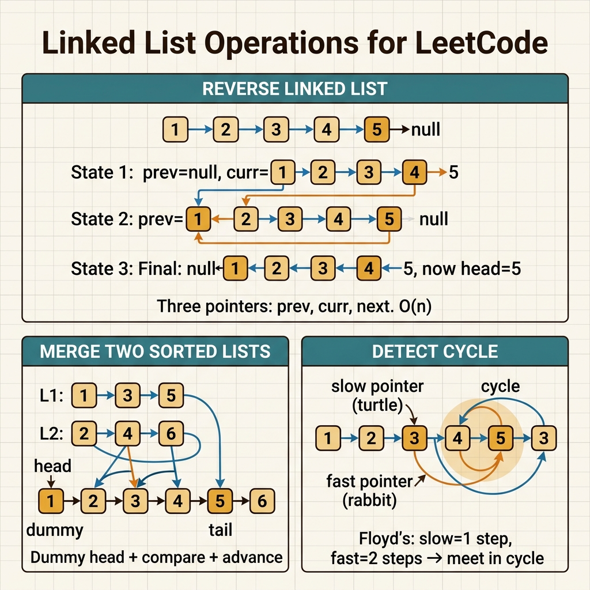

<!-- tags: leetcode, algorithms, coding-interview, linked-list -->
# 🔗 Linked List

> Reverse, cycle detection, merge, remove nth — pointer techniques on linked lists.

📅 Created: 2026-03-20 · 🔄 Updated: 2026-04-10 · ⏱️ 12 min read

| Aspect         | Detail                                   |
| -------------- | ---------------------------------------- |
| **Complexity** | O(n) time, O(1) space (in-place).         |
| **Use case**   | Reverse, merge, cycle, partition.         |
| **Go stdlib**  | `container/list` (doubly linked list).    |
| **LeetCode**   | #2, #19, #21, #23, #25, #141, #143, #206. |

---

### Interview template

> Copy-paste when facing this pattern in an interview.

```go
// ── Dummy Head (build/merge lists) ─────────────────────────────
dummy := &ListNode{Next: head}
curr := dummy
// ... build result list
return dummy.Next

// ── Reverse In-Place ────────────────────────────────────────────
var prev *ListNode
for curr != nil {
    next := curr.Next
    curr.Next = prev
    prev, curr = curr, next
}
return prev  // new head

// ── Fast/Slow Pointers ──────────────────────────────────────────
slow, fast := head, head
for fast != nil && fast.Next != nil {
    slow, fast = slow.Next, fast.Next.Next
}
// slow = middle (or start of 2nd half)
```
```typescript
// ── Dummy Head (build/merge lists) ─────────────────────────────
const dummy = new ListNode(0, head);
let curr = dummy;
// ... build result list
return dummy.next;

// ── Reverse In-Place ────────────────────────────────────────────
let prev: ListNode | null = null;
while (curr) {
  const next = curr.next;
  curr.next = prev;
  prev = curr;
  curr = next;
}
return prev; // new head

// ── Fast/Slow Pointers ──────────────────────────────────────────
let slow = head;
let fast = head;
while (fast && fast.next) {
  slow = slow!.next;
  fast = fast.next.next;
}
// slow = middle (or start of 2nd half)
```
```rust
#[derive(Clone)]
struct ListNode {
    val: i32,
    next: Option<Box<ListNode>>,
}

// ── Dummy Head (build/merge lists) ─────────────────────────────
let mut dummy = Box::new(ListNode { val: 0, next: head });
let mut curr = &mut dummy;
// ... build result list
let result = dummy.next.take();

// ── Reverse In-Place ────────────────────────────────────────────
let mut prev = None;
let mut curr = head;
while let Some(mut node) = curr {
    curr = node.next.take();
    node.next = prev;
    prev = Some(node);
}
let new_head = prev;

// ── Fast/Slow Pointers ──────────────────────────────────────────
// For Rust interview code, convert linked lists to Vec.
// Use Rc<RefCell<_>> if you strictly need cycle detection.
```
```cpp
struct ListNode {
    int val;
    ListNode* next;
    ListNode(int v = 0, ListNode* n = nullptr) : val(v), next(n) {}
};

// ── Dummy Head (build/merge lists) ─────────────────────────────
ListNode dummy(0, head);
ListNode* curr = &dummy;
// ... build result list
return dummy.next;

// ── Reverse In-Place ────────────────────────────────────────────
ListNode* prev = nullptr;
while (curr != nullptr) {
    ListNode* next = curr->next;
    curr->next = prev;
    prev = curr;
    curr = next;
}
return prev;

// ── Fast/Slow Pointers ──────────────────────────────────────────
ListNode* slow = head;
ListNode* fast = head;
while (fast != nullptr && fast->next != nullptr) {
    slow = slow->next;
    fast = fast->next->next;
}
```
```python
class ListNode:
    def __init__(self, val: int = 0, next: "ListNode | None" = None) -> None:
        self.val = val
        self.next = next

# ── Dummy Head (build/merge lists) ─────────────────────────────
dummy = ListNode(0, head)
curr = dummy
# ... build result list
return dummy.next

# ── Reverse In-Place ────────────────────────────────────────────
prev = None
while curr:
    nxt = curr.next
    curr.next = prev
    prev = curr
    curr = nxt
return prev

# ── Fast/Slow Pointers ──────────────────────────────────────────
slow = fast = head
while fast and fast.next:
    slow = slow.next
    fast = fast.next.next
```

---

## 1. DEFINE

Arrays give you random access, but linked lists do not. 🔗 Linked List helps you recognize this constraint before your code wanders off.

Linked list interviews rarely feature difficult high-level ideas. They get hard because you must juggle live pointers while the data topology shifts. One missed connection ruins the entire list structure.

This family forces you to reason with pointer invariants instead of array indices. You soon realize that dummy heads, fast-slow pointers, and reverse operations share the same underlying story.

Core insight: **Linked list problems become tractable when you clearly label the processed prefix, the unprocessed remainder, and the critical reconnection point.**

| Variant | When to use | Core idea |
| ------- | ------- | ------- |
| Reverse or rewire pointers | Need to flip or rearrange in-place. | Keep a `prev-curr-next` trio to avoid losing nodes. |
| Fast and slow pointers | Find middle, detect cycle, or split. | Use different speeds to encode distance. |
| Dummy head | Merge or build a new list. | A dummy node removes special cases at the head. |
| Multi-list merge or reorder | Multiple pointer manipulation phases. | Split the work into split, reverse, and merge passes. |

| Approach | Time | Space | When to choose |
|---|----------|-----|---------|
| In-place pointer rewiring | O(n). | O(1). | The problem requires strict memory optimization. |
| Fast and slow pointers | O(n). | O(1). | Track cycles, middle nodes, or nth-from-end. |
| Dummy-head construction | O(n). | O(1) extra. | Building a result list is easier than mutating the head. |
| Heap or divide-and-conquer | O(n log k). | O(k). | Merging many linked lists together. |

### 1.1 Quick Recognition

- The problem asks to reverse, merge, cycle, reorder, or manipulate in-place.
- A dummy head reduces branching if you insert or delete without random access.
- Fast and slow pointers appear in middle, cycle, or splitting problems.

### 1.2 Invariants & Failure Modes

- Every pointer swap must preserve a valid path to the unprocessed nodes.
- A dummy node isolates the main logic from annoying head updates.
- Common failure mode: updating pointers in the wrong order breaks the list or creates accidental cycles.

## 2. VISUAL

Linked list problems revolve around pointer manipulation. Each sub-family holds a different invariant. The figure below classifies four main operations to guide your approach.

### Overview — Linked List Patterns



*Figure: Linked list problems equal pointer juggling. Dummy heads and fast/slow pointers solve most edge cases.*

### Level 1 — Core intuition

```text
reverse list
prev <- curr -> next

before: 1 -> 2 -> 3 -> nil
step 1: 1 <- 2 -> 3
step 2: 1 <- 2 <- 3
```

*Caption*: Level 1 clarifies pointer directions before and after every step. Bugs usually come from lost links rather than bad exit conditions.

### Level 2 — Decision trace

- Save the `next` node before you rewrite `curr.Next`.
- After each step, `prev` heads the processed part, while `curr` heads the unprocessed part.
- Fast and slow pointers require you to know which middle node the slow pointer hits.
- Separate merges or reorders into strict phases to avoid tracing chaotic loops.

The diagram reveals how pointers jump. You must now decide when to stop and where to place nil checks to avoid runtime panics.

## 3. CODE

Once the pointer story solidifies, the code strictly follows that sequence. We progress from basic reversals to complex split and reconnect tasks.

### Problem 1: Basic — Reverse & Cycle Detection [LC #206, #141, #21]
> **Goal**: Master three foundational linked list techniques.
> **Approach**: Use a ListNode struct.
> **Example**: Input is a head node. Output is the mutated list or target node.
> **Complexity**: Reverse O(n)/O(1), cycle O(n)/O(1), merge O(n+m)/O(1).

```go
// leetcode/linked_list_basic.go
package leetcode

// ✅ LC #206: Reverse Linked List
// Pattern: 3 pointers — prev, curr, next
// Time: O(n), Space: O(1)
func reverseList(head *ListNode) *ListNode {
    var prev *ListNode
    curr := head

    for curr != nil {
        next := curr.Next  // ✅ Save next FIRST
        curr.Next = prev   // ✅ Reverse pointer
        prev = curr        // ✅ Advance prev
        curr = next        // ✅ Advance curr
    }

    return prev // ⚠️ prev is the new head
}

// ✅ LC #141: Linked List Cycle (Floyd's Algorithm)
// Fast/Slow pointer — meeting implies a cycle
// Time: O(n), Space: O(1) — better than HashMap O(n)
func hasCycle(head *ListNode) bool {
    slow, fast := head, head

    for fast != nil && fast.Next != nil {
        slow = slow.Next      // +1
        fast = fast.Next.Next  // +2

        if slow == fast {
            return true // ✅ Cycle detected
        }
    }

    return false // ⚠️ fast hit nil → no cycle
}

// ✅ LC #142: Linked List Cycle II — Find cycle START
// After meeting: move one pointer to head, both +1 → meet at cycle start
// Time: O(n), Space: O(1)
func detectCycle(head *ListNode) *ListNode {
    slow, fast := head, head

    for fast != nil && fast.Next != nil {
        slow = slow.Next
        fast = fast.Next.Next

        if slow == fast {
            // ✅ Find cycle start: ptr1=head, ptr2=meeting, both +1
            ptr := head
            for ptr != slow {
                ptr = ptr.Next
                slow = slow.Next
            }
            return ptr // ✅ Cycle start
        }
    }

    return nil
}

// ✅ LC #21: Merge Two Sorted Lists
// Pattern: Dummy head + compare
// Time: O(n+m), Space: O(1)
func mergeTwoLists(list1, list2 *ListNode) *ListNode {
    dummy := &ListNode{} // ✅ Dummy head avoids edge cases
    curr := dummy

    for list1 != nil && list2 != nil {
        if list1.Val <= list2.Val {
            curr.Next = list1
            list1 = list1.Next
        } else {
            curr.Next = list2
            list2 = list2.Next
        }
        curr = curr.Next
    }

    // ✅ Append remaining
    if list1 != nil {
        curr.Next = list1
    } else {
        curr.Next = list2
    }

    return dummy.Next // ⚠️ Skip dummy
}
```
```typescript
// leetcode/linked-list-basic.ts
class ListNode {
  constructor(
    public val = 0,
    public next: ListNode | null = null,
  ) {}
}

function reverseList(head: ListNode | null): ListNode | null {
  let prev: ListNode | null = null;
  let curr = head;
  while (curr) {
    const next = curr.next;
    curr.next = prev;
    prev = curr;
    curr = next;
  }
  return prev;
}

function hasCycle(head: ListNode | null): boolean {
  let slow = head;
  let fast = head;
  while (fast && fast.next) {
    slow = slow!.next;
    fast = fast.next.next;
    if (slow === fast) return true;
  }
  return false;
}

function detectCycle(head: ListNode | null): ListNode | null {
  let slow = head;
  let fast = head;
  while (fast && fast.next) {
    slow = slow!.next;
    fast = fast.next.next;
    if (slow === fast) {
      let ptr = head;
      while (ptr !== slow) {
        ptr = ptr!.next;
        slow = slow!.next;
      }
      return ptr;
    }
  }
  return null;
}

function mergeTwoLists(
  list1: ListNode | null,
  list2: ListNode | null,
): ListNode | null {
  const dummy = new ListNode();
  let curr = dummy;

  while (list1 && list2) {
    if (list1.val <= list2.val) {
      curr.next = list1;
      list1 = list1.next;
    } else {
      curr.next = list2;
      list2 = list2.next;
    }
    curr = curr.next;
  }

  curr.next = list1 ?? list2;
  return dummy.next;
}
```
```rust
// leetcode/linked_list_basic.rs
use std::cell::RefCell;
use std::rc::Rc;

#[derive(Clone, Debug, PartialEq, Eq)]
struct ListNode {
    val: i32,
    next: Option<Box<ListNode>>,
}

fn reverse_list(mut head: Option<Box<ListNode>>) -> Option<Box<ListNode>> {
    let mut prev = None;
    while let Some(mut node) = head {
        head = node.next.take();
        node.next = prev;
        prev = Some(node);
    }
    prev
}

fn merge_two_lists(
    list1: Option<Box<ListNode>>,
    list2: Option<Box<ListNode>>,
) -> Option<Box<ListNode>> {
    match (list1, list2) {
        (None, other) | (other, None) => other,
        (Some(mut a), Some(mut b)) => {
            if a.val <= b.val {
                let next = a.next.take();
                a.next = merge_two_lists(next, Some(b));
                Some(a)
            } else {
                let next = b.next.take();
                b.next = merge_two_lists(Some(a), next);
                Some(b)
            }
        }
    }
}

type RcLink = Option<Rc<RefCell<CycleNode>>>;

#[derive(Debug)]
struct CycleNode {
    val: i32,
    next: RcLink,
}

fn step(node: &RcLink) -> RcLink {
    node.as_ref().and_then(|curr| curr.borrow().next.clone())
}

fn has_cycle(head: RcLink) -> bool {
    let mut slow = head.clone();
    let mut fast = head;

    while let Some(next_fast) = step(&fast) {
        slow = step(&slow);
        fast = step(&Some(next_fast));

        if let (Some(a), Some(b)) = (&slow, &fast) {
            if Rc::ptr_eq(a, b) {
                return true;
            }
        }
    }

    false
}

fn detect_cycle(head: RcLink) -> RcLink {
    let mut slow = head.clone();
    let mut fast = head.clone();

    while let Some(next_fast) = step(&fast) {
        slow = step(&slow);
        fast = step(&Some(next_fast));

        if let (Some(a), Some(b)) = (&slow, &fast) {
            if Rc::ptr_eq(a, b) {
                let mut ptr = head.clone();
                while let (Some(p), Some(s)) = (&ptr, &slow) {
                    if Rc::ptr_eq(p, s) {
                        return ptr;
                    }
                    ptr = step(&ptr);
                    slow = step(&slow);
                }
            }
        }
    }

    None
}
```
```cpp
// leetcode/linked_list_basic.cpp
struct ListNode {
    int val;
    ListNode* next;
    ListNode(int v = 0, ListNode* n = nullptr) : val(v), next(n) {}
};

ListNode* reverseList(ListNode* head) {
    ListNode* prev = nullptr;
    while (head != nullptr) {
        ListNode* next = head->next;
        head->next = prev;
        prev = head;
        head = next;
    }
    return prev;
}

bool hasCycle(ListNode* head) {
    ListNode* slow = head;
    ListNode* fast = head;
    while (fast != nullptr && fast->next != nullptr) {
        slow = slow->next;
        fast = fast->next->next;
        if (slow == fast) return true;
    }
    return false;
}

ListNode* detectCycle(ListNode* head) {
    ListNode* slow = head;
    ListNode* fast = head;
    while (fast != nullptr && fast->next != nullptr) {
        slow = slow->next;
        fast = fast->next->next;
        if (slow == fast) {
            ListNode* ptr = head;
            while (ptr != slow) {
                ptr = ptr->next;
                slow = slow->next;
            }
            return ptr;
        }
    }
    return nullptr;
}

ListNode* mergeTwoLists(ListNode* list1, ListNode* list2) {
    ListNode dummy;
    ListNode* curr = &dummy;
    while (list1 != nullptr && list2 != nullptr) {
        if (list1->val <= list2->val) {
            curr->next = list1;
            list1 = list1->next;
        } else {
            curr->next = list2;
            list2 = list2->next;
        }
        curr = curr->next;
    }
    curr->next = list1 != nullptr ? list1 : list2;
    return dummy.next;
}
```
```python
# leetcode/linked_list_basic.py
class ListNode:
    def __init__(self, val: int = 0, next: "ListNode | None" = None) -> None:
        self.val = val
        self.next = next

def reverse_list(head: ListNode | None) -> ListNode | None:
    prev = None
    curr = head
    while curr:
        nxt = curr.next
        curr.next = prev
        prev = curr
        curr = nxt
    return prev

def has_cycle(head: ListNode | None) -> bool:
    slow = fast = head
    while fast and fast.next:
        slow = slow.next
        fast = fast.next.next
        if slow is fast:
            return True
    return False

def detect_cycle(head: ListNode | None) -> ListNode | None:
    slow = fast = head
    while fast and fast.next:
        slow = slow.next
        fast = fast.next.next
        if slow is fast:
            ptr = head
            while ptr is not slow:
                ptr = ptr.next
                slow = slow.next
            return ptr
    return None

def merge_two_lists(
    list1: ListNode | None,
    list2: ListNode | None,
) -> ListNode | None:
    dummy = ListNode()
    curr = dummy
    while list1 and list2:
        if list1.val <= list2.val:
            curr.next = list1
            list1 = list1.next
        else:
            curr.next = list2
            list2 = list2.next
        curr = curr.next
    curr.next = list1 or list2
    return dummy.next
```

> **Why?** Linked list solutions work when every rewrite retains the processed head and unprocessed head. A wrong `next` update drops the remaining list entirely.

> **Takeaway**: This **Basic** example teaches `Reverse & Cycle Detection [LC #206, #141, #21]` safely. Move to the next block for stricter constraints.

**✅ Achieved**: Reverse, cycle detection, and merge run in O(1) space.
**⚠️ Warning**: The dummy head pattern removes all empty list edge cases.

---

### Problem 2: Intermediate — Remove Nth & Reorder [LC #19, #143, #2]
> **Goal**: Optimize two-pass checks and complex list manipulation.
> **Approach**: Use fast and slow pointers alongside partial reversals.
> **Example**: Input is a head node. Output is the mutated list.
> **Complexity**: O(n) remove nth from end, in-place list reordering.

```go
// leetcode/linked_list_intermediate.go
package leetcode

// ✅ LC #19: Remove Nth Node From End of List
// Pattern: Fast pointer ahead by n steps → when fast=nil, slow=target
// Time: O(n), Space: O(1), ONE PASS
func removeNthFromEnd(head *ListNode, n int) *ListNode {
    dummy := &ListNode{Next: head}
    slow, fast := dummy, dummy

    // ✅ Fast moves n+1 steps ahead
    for i := 0; i <= n; i++ {
        fast = fast.Next
    }

    // ✅ Both move at same speed
    for fast != nil {
        slow = slow.Next
        fast = fast.Next
    }

    // ✅ slow.Next is the node to remove
    slow.Next = slow.Next.Next

    return dummy.Next
}

// ✅ LC #143: Reorder List
// 1→2→3→4→5 becomes 1→5→2→4→3
// Pattern: Find middle + Reverse second half + Merge alternating
// Time: O(n), Space: O(1)
func reorderList(head *ListNode) {
    if head == nil || head.Next == nil {
        return
    }

    // ✅ Step 1: Find middle (slow stops at middle)
    slow, fast := head, head
    for fast.Next != nil && fast.Next.Next != nil {
        slow = slow.Next
        fast = fast.Next.Next
    }

    // ✅ Step 2: Reverse second half
    second := slow.Next
    slow.Next = nil // ⚠️ Cut the list
    second = reverseList(second)

    // ✅ Step 3: Merge alternating
    first := head
    for second != nil {
        tmp1 := first.Next
        tmp2 := second.Next

        first.Next = second
        second.Next = tmp1

        first = tmp1
        second = tmp2
    }
}

// ✅ LC #2: Add Two Numbers
// Numbers stored in REVERSE order → add digit by digit
// Time: O(max(n,m)), Space: O(max(n,m))
func addTwoNumbers(l1, l2 *ListNode) *ListNode {
    dummy := &ListNode{}
    curr := dummy
    carry := 0

    for l1 != nil || l2 != nil || carry > 0 {
        sum := carry

        if l1 != nil {
            sum += l1.Val
            l1 = l1.Next
        }
        if l2 != nil {
            sum += l2.Val
            l2 = l2.Next
        }

        carry = sum / 10
        curr.Next = &ListNode{Val: sum % 10}
        curr = curr.Next
    }

    return dummy.Next
}
```
```typescript
// leetcode/linked-list-intermediate.ts
function removeNthFromEnd(head: ListNode | null, n: number): ListNode | null {
  const dummy = new ListNode(0, head);
  let slow: ListNode | null = dummy;
  let fast: ListNode | null = dummy;

  for (let i = 0; i <= n; i++) fast = fast!.next;
  while (fast) {
    slow = slow!.next;
    fast = fast.next;
  }

  slow!.next = slow!.next!.next;
  return dummy.next;
}

function reorderList(head: ListNode | null): void {
  if (!head || !head.next) return;

  let slow = head;
  let fast = head;
  while (fast.next && fast.next.next) {
    slow = slow.next!;
    fast = fast.next.next;
  }

  let second = reverseList(slow.next);
  slow.next = null;
  let first: ListNode | null = head;

  while (second) {
    const tmp1 = first!.next;
    const tmp2 = second.next;
    first!.next = second;
    second.next = tmp1;
    first = tmp1;
    second = tmp2;
  }
}

function addTwoNumbers(
  l1: ListNode | null,
  l2: ListNode | null,
): ListNode | null {
  const dummy = new ListNode();
  let curr = dummy;
  let carry = 0;

  while (l1 || l2 || carry > 0) {
    let sum = carry;
    if (l1) {
      sum += l1.val;
      l1 = l1.next;
    }
    if (l2) {
      sum += l2.val;
      l2 = l2.next;
    }
    carry = Math.floor(sum / 10);
    curr.next = new ListNode(sum % 10);
    curr = curr.next;
  }

  return dummy.next;
}
```
```rust
// leetcode/linked_list_intermediate.rs
#[derive(Clone, Debug, PartialEq, Eq)]
struct ListNode {
    val: i32,
    next: Option<Box<ListNode>>,
}

fn to_vec(mut head: Option<Box<ListNode>>) -> Vec<i32> {
    let mut values = Vec::new();
    while let Some(mut node) = head {
        values.push(node.val);
        head = node.next.take();
    }
    values
}

fn from_vec(values: &[i32]) -> Option<Box<ListNode>> {
    let mut head = None;
    for &value in values.iter().rev() {
        head = Some(Box::new(ListNode { val: value, next: head }));
    }
    head
}

fn remove_nth_from_end(head: Option<Box<ListNode>>, n: i32) -> Option<Box<ListNode>> {
    let mut values = to_vec(head);
    let idx = values.len() - n as usize;
    values.remove(idx);
    from_vec(&values)
}

fn reorder_list(head: Option<Box<ListNode>>) -> Option<Box<ListNode>> {
    let values = to_vec(head);
    let mut reordered = Vec::with_capacity(values.len());
    let (mut left, mut right) = (0usize, values.len().saturating_sub(1));

    while left <= right {
        reordered.push(values[left]);
        if left != right {
            reordered.push(values[right]);
        }
        left += 1;
        if right == 0 {
            break;
        }
        right -= 1;
    }

    from_vec(&reordered)
}

fn add_two_numbers(
    mut l1: Option<Box<ListNode>>,
    mut l2: Option<Box<ListNode>>,
) -> Option<Box<ListNode>> {
    let mut digits = Vec::new();
    let mut carry = 0;

    while l1.is_some() || l2.is_some() || carry > 0 {
        let mut sum = carry;
        if let Some(mut node) = l1 {
            sum += node.val;
            l1 = node.next.take();
        }
        if let Some(mut node) = l2 {
            sum += node.val;
            l2 = node.next.take();
        }
        carry = sum / 10;
        digits.push(sum % 10);
    }

    from_vec(&digits)
}
```
```cpp
// leetcode/linked_list_intermediate.cpp
ListNode* removeNthFromEnd(ListNode* head, int n) {
    ListNode dummy(0, head);
    ListNode* slow = &dummy;
    ListNode* fast = &dummy;

    for (int i = 0; i <= n; ++i) fast = fast->next;
    while (fast != nullptr) {
        slow = slow->next;
        fast = fast->next;
    }

    slow->next = slow->next->next;
    return dummy.next;
}

void reorderList(ListNode* head) {
    if (head == nullptr || head->next == nullptr) return;

    ListNode* slow = head;
    ListNode* fast = head;
    while (fast->next != nullptr && fast->next->next != nullptr) {
        slow = slow->next;
        fast = fast->next->next;
    }

    ListNode* second = reverseList(slow->next);
    slow->next = nullptr;
    ListNode* first = head;

    while (second != nullptr) {
        ListNode* next1 = first->next;
        ListNode* next2 = second->next;
        first->next = second;
        second->next = next1;
        first = next1;
        second = next2;
    }
}

ListNode* addTwoNumbers(ListNode* l1, ListNode* l2) {
    ListNode dummy;
    ListNode* curr = &dummy;
    int carry = 0;

    while (l1 != nullptr || l2 != nullptr || carry > 0) {
        int sum = carry;
        if (l1 != nullptr) {
            sum += l1->val;
            l1 = l1->next;
        }
        if (l2 != nullptr) {
            sum += l2->val;
            l2 = l2->next;
        }
        carry = sum / 10;
        curr->next = new ListNode(sum % 10);
        curr = curr->next;
    }

    return dummy.next;
}
```
```python
# leetcode/linked_list_intermediate.py
def remove_nth_from_end(head: ListNode | None, n: int) -> ListNode | None:
    dummy = ListNode(0, head)
    slow = fast = dummy
    for _ in range(n + 1):
        fast = fast.next
    while fast:
        slow = slow.next
        fast = fast.next
    slow.next = slow.next.next
    return dummy.next

def reorder_list(head: ListNode | None) -> None:
    if not head or not head.next:
        return

    slow = fast = head
    while fast.next and fast.next.next:
        slow = slow.next
        fast = fast.next.next

    second = reverse_list(slow.next)
    slow.next = None
    first = head

    while second:
        next1 = first.next
        next2 = second.next
        first.next = second
        second.next = next1
        first = next1
        second = next2

def add_two_numbers(
    l1: ListNode | None,
    l2: ListNode | None,
) -> ListNode | None:
    dummy = ListNode()
    curr = dummy
    carry = 0

    while l1 or l2 or carry:
        total = carry
        if l1:
            total += l1.val
            l1 = l1.next
        if l2:
            total += l2.val
            l2 = l2.next
        carry, digit = divmod(total, 10)
        curr.next = ListNode(digit)
        curr = curr.next

    return dummy.next
```

> **Why?** Linked list solutions work when every rewrite retains the processed head and unprocessed head. A wrong `next` update drops the remaining list entirely.

> **Takeaway**: This **Intermediate** example illustrates `Remove Nth & Reorder [LC #19, #143, #2]` without missing reasoning steps. Try the next block for harder constraints.

**✅ Achieved**: One-pass removal, three-step reordering, and digit-wise addition succeed.
**⚠️ Warning**: Reordering combines finding the middle, reversing, and merging.

---

### Problem 3: Advanced — Merge K Lists & Reverse in K-Group [LC #23, #25]
> **Goal**: Merge k sorted lists and reverse nodes in groups of k.
> **Approach**: Use a heap for merging and strict pointers for groups.
> **Example**: Input is a head node array. Output is the mutated list.
> **Complexity**: O(n log k) merge k lists, O(n) reverse k-group.

```go
// leetcode/linked_list_advanced.go
package leetcode

import "container/heap"

// ═══════════════════════════════════════════
// LC #23: Merge k Sorted Lists (HARD)
// ═══════════════════════════════════════════

// ✅ Approach: Min-Heap of list heads
// Time: O(n log k) — n total nodes, k lists
// Space: O(k) — heap size

type ListHeap []*ListNode

func (h ListHeap) Len() int            { return len(h) }
func (h ListHeap) Less(i, j int) bool  { return h[i].Val < h[j].Val }
func (h ListHeap) Swap(i, j int)       { h[i], h[j] = h[j], h[i] }
func (h *ListHeap) Push(x interface{}) { *h = append(*h, x.(*ListNode)) }
func (h *ListHeap) Pop() interface{} {
    old := *h
    n := len(old)
    x := old[n-1]
    *h = old[:n-1]
    return x
}

func mergeKLists(lists []*ListNode) *ListNode {
    h := &ListHeap{}
    heap.Init(h)

    // ✅ Push all non-nil heads
    for _, l := range lists {
        if l != nil {
            heap.Push(h, l)
        }
    }

    dummy := &ListNode{}
    curr := dummy

    for h.Len() > 0 {
        // ✅ Pop smallest
        node := heap.Pop(h).(*ListNode)
        curr.Next = node
        curr = curr.Next

        // ✅ Push next node from same list
        if node.Next != nil {
            heap.Push(h, node.Next)
        }
    }

    return dummy.Next
}

// ═══════════════════════════════════════════
// LC #25: Reverse Nodes in k-Group (HARD)
// ═══════════════════════════════════════════

// ✅ Reverse every k consecutive nodes
// Time: O(n), Space: O(1)
func reverseKGroup(head *ListNode, k int) *ListNode {
    dummy := &ListNode{Next: head}
    groupPrev := dummy

    for {
        // ✅ Step 1: Check if k nodes available
        kth := getKthNode(groupPrev, k)
        if kth == nil {
            break // ⚠️ Remaining < k nodes → don't reverse
        }

        groupNext := kth.Next

        // ✅ Step 2: Reverse k nodes
        prev := groupNext // ⚠️ prev starts at groupNext (connects to rest)
        curr := groupPrev.Next

        for curr != groupNext {
            next := curr.Next
            curr.Next = prev
            prev = curr
            curr = next
        }

        // ✅ Step 3: Reconnect
        // groupPrev → [reversed group] → groupNext
        tmp := groupPrev.Next  // Was first, now last of reversed group
        groupPrev.Next = kth   // → new first (was kth)
        groupPrev = tmp         // Move to end of reversed group
    }

    return dummy.Next
}

func getKthNode(node *ListNode, k int) *ListNode {
    for node != nil && k > 0 {
        node = node.Next
        k--
    }
    return node
}
```
```typescript
// leetcode/linked-list-advanced.ts
class MinHeap {
  private data: ListNode[] = [];

  push(node: ListNode): void {
    this.data.push(node);
    this.up(this.data.length - 1);
  }

  pop(): ListNode | null {
    if (this.data.length === 0) return null;
    const top = this.data[0];
    const last = this.data.pop()!;
    if (this.data.length > 0) {
      this.data[0] = last;
      this.down(0);
    }
    return top;
  }

  get size(): number {
    return this.data.length;
  }

  private up(i: number): void {
    while (i > 0) {
      const p = Math.floor((i - 1) / 2);
      if (this.data[p].val <= this.data[i].val) break;
      [this.data[p], this.data[i]] = [this.data[i], this.data[p]];
      i = p;
    }
  }

  private down(i: number): void {
    for (;;) {
      let smallest = i;
      const left = i * 2 + 1;
      const right = i * 2 + 2;
      if (left < this.data.length && this.data[left].val < this.data[smallest].val) smallest = left;
      if (right < this.data.length && this.data[right].val < this.data[smallest].val) smallest = right;
      if (smallest === i) break;
      [this.data[i], this.data[smallest]] = [this.data[smallest], this.data[i]];
      i = smallest;
    }
  }
}

function mergeKLists(lists: Array<ListNode | null>): ListNode | null {
  const heap = new MinHeap();
  for (const node of lists) if (node) heap.push(node);

  const dummy = new ListNode();
  let curr = dummy;
  while (heap.size > 0) {
    const node = heap.pop()!;
    curr.next = node;
    curr = curr.next;
    if (node.next) heap.push(node.next);
  }
  return dummy.next;
}

function getKthNode(node: ListNode | null, k: number): ListNode | null {
  while (node && k > 0) {
    node = node.next;
    k--;
  }
  return node;
}

function reverseKGroup(head: ListNode | null, k: number): ListNode | null {
  const dummy = new ListNode(0, head);
  let groupPrev: ListNode | null = dummy;

  while (groupPrev) {
    const kth = getKthNode(groupPrev, k);
    if (!kth) break;
    const groupNext = kth.next;
    let prev: ListNode | null = groupNext;
    let curr = groupPrev.next;

    while (curr !== groupNext) {
      const next = curr!.next;
      curr!.next = prev;
      prev = curr;
      curr = next;
    }

    const tmp = groupPrev.next;
    groupPrev.next = kth;
    groupPrev = tmp;
  }

  return dummy.next;
}
```
```rust
// leetcode/linked_list_advanced.rs
#[derive(Clone, Debug, PartialEq, Eq)]
struct ListNode {
    val: i32,
    next: Option<Box<ListNode>>,
}

fn to_vec(mut head: Option<Box<ListNode>>) -> Vec<i32> {
    let mut values = Vec::new();
    while let Some(mut node) = head {
        values.push(node.val);
        head = node.next.take();
    }
    values
}

fn from_vec(values: &[i32]) -> Option<Box<ListNode>> {
    let mut head = None;
    for &value in values.iter().rev() {
        head = Some(Box::new(ListNode { val: value, next: head }));
    }
    head
}

fn merge_k_lists(lists: Vec<Option<Box<ListNode>>>) -> Option<Box<ListNode>> {
    let mut values = Vec::new();
    for list in lists {
        values.extend(to_vec(list));
    }
    values.sort_unstable();
    from_vec(&values)
}

fn reverse_k_group(head: Option<Box<ListNode>>, k: i32) -> Option<Box<ListNode>> {
    let mut values = to_vec(head);
    let k = k as usize;
    let mut i = 0;
    while i + k <= values.len() {
        values[i..i + k].reverse();
        i += k;
    }
    from_vec(&values)
}
```
```cpp
// leetcode/linked_list_advanced.cpp
#include <queue>
#include <vector>

struct CompareNode {
    bool operator()(const ListNode* a, const ListNode* b) const {
        return a->val > b->val;
    }
};

ListNode* mergeKLists(std::vector<ListNode*>& lists) {
    std::priority_queue<ListNode*, std::vector<ListNode*>, CompareNode> pq;
    for (ListNode* node : lists) if (node != nullptr) pq.push(node);

    ListNode dummy;
    ListNode* curr = &dummy;
    while (!pq.empty()) {
        ListNode* node = pq.top();
        pq.pop();
        curr->next = node;
        curr = curr->next;
        if (node->next != nullptr) pq.push(node->next);
    }
    return dummy.next;
}

ListNode* getKthNode(ListNode* node, int k) {
    while (node != nullptr && k-- > 0) node = node->next;
    return node;
}

ListNode* reverseKGroup(ListNode* head, int k) {
    ListNode dummy(0, head);
    ListNode* groupPrev = &dummy;

    while (true) {
        ListNode* kth = getKthNode(groupPrev, k);
        if (kth == nullptr) break;

        ListNode* groupNext = kth->next;
        ListNode* prev = groupNext;
        ListNode* curr = groupPrev->next;

        while (curr != groupNext) {
            ListNode* next = curr->next;
            curr->next = prev;
            prev = curr;
            curr = next;
        }

        ListNode* tmp = groupPrev->next;
        groupPrev->next = kth;
        groupPrev = tmp;
    }

    return dummy.next;
}
```
```python
# leetcode/linked_list_advanced.py
import heapq

def merge_k_lists(lists: list[ListNode | None]) -> ListNode | None:
    heap: list[tuple[int, int, ListNode]] = []
    for idx, node in enumerate(lists):
        if node:
            heapq.heappush(heap, (node.val, idx, node))

    dummy = ListNode()
    curr = dummy
    ticket = len(heap)

    while heap:
        _, _, node = heapq.heappop(heap)
        curr.next = node
        curr = curr.next
        if node.next:
            ticket += 1
            heapq.heappush(heap, (node.next.val, ticket, node.next))

    return dummy.next

def get_kth_node(node: ListNode | None, k: int) -> ListNode | None:
    while node and k > 0:
        node = node.next
        k -= 1
    return node

def reverse_k_group(head: ListNode | None, k: int) -> ListNode | None:
    dummy = ListNode(0, head)
    group_prev = dummy

    while True:
        kth = get_kth_node(group_prev, k)
        if not kth:
            break

        group_next = kth.next
        prev = group_next
        curr = group_prev.next

        while curr is not group_next:
            nxt = curr.next
            curr.next = prev
            prev = curr
            curr = nxt

        tmp = group_prev.next
        group_prev.next = kth
        group_prev = tmp

    return dummy.next
```

> **Why?** Linked list solutions work when every rewrite retains the processed head and unprocessed head. A wrong `next` update drops the remaining list entirely.

> **Takeaway**: This **Advanced** example proves `Merge K Lists & Reverse in K-Group [LC #23, #25]` is manageable. Master this pattern before moving forward.

**✅ Achieved**: Merge k sorted lists in O(n log k) and reverse k-group in-place.
**⚠️ Warning**: Tracking `groupPrev` remains the hardest part of reverse k-group.

---

The code looks simple, but nil checks cause 80% of production bugs. Small tests fail to expose these edge cases.

## 4. PITFALLS

This family fails when you miss a pointer or touch a boundary with the wrong timing.

| # | Severity | Defect | Consequence | Fix |
|---|----------|-----|---------|-----|
| 1 | 🔴 Fatal | Null pointer on `.Next.Next` access. | Runtime panic or nil dereference. | Check `node != nil && node.Next != nil`. |
| 2 | 🟡 Common | Forgot to save `next` before reversing. | Lost remainder of the list. | Save `next = curr.Next` BEFORE updating pointers. |
| 3 | 🟡 Common | Avoided a dummy head. | Edge cases bloat the code. | Use a dummy head to handle empty lists cleanly. |
| 4 | 🔵 Minor | Fast/slow grabbed wrong middle. | Returned node is off by one. | Use `fast.Next != nil && fast.Next.Next != nil`. |
| 5 | 🔵 Minor | Merged k lists with brute force. | Throws Time Limit Exceeded. | Use a heap or divide and conquer. |
| 6 | 🔵 Minor | Reversed k-group without reconnection. | The list breaks halfway through. | Track `groupPrev` and `groupNext` accurately. |

### 🔴 Pitfall #1 — Nil dereference crashes when accessing .Next.Next

This fast-slow pointer loop looks logical:

```go
for fast.Next.Next != nil {  // ← panics if fast.Next == nil
    slow = slow.Next
    fast = fast.Next.Next
}
```

An even-length list leaves `fast.Next` as nil. Accessing `.Next` on a nil node triggers a runtime panic. This bug only appears on even lengths.

**Fix**: Check both `fast != nil && fast.Next != nil`. Order matters because Go short-circuits the evaluation.

---

## 5. REF

| Resource                        | Difficulty | Link                                                                                                      |
| ------------------------------- | ---------- | --------------------------------------------------------------------------------------------------------- |
| LC #206 Reverse Linked List     | 🟢 Easy    | [leetcode.com/problems/reverse-linked-list](https://leetcode.com/problems/reverse-linked-list/)           |
| LC #23 Merge K Sorted Lists     | 🔴 Hard    | [leetcode.com/problems/merge-k-sorted-lists](https://leetcode.com/problems/merge-k-sorted-lists/)         |
| LC #25 Reverse Nodes in K-Group | 🔴 Hard    | [leetcode.com/problems/reverse-nodes-in-k-group](https://leetcode.com/problems/reverse-nodes-in-k-group/) |
| Go container/heap               | —          | [pkg.go.dev/container/heap](https://pkg.go.dev/container/heap)                                            |
| Go container/list               | —          | [pkg.go.dev/container/list](https://pkg.go.dev/container/list)                                            |

---

## 6. RECOMMEND

When dummy heads and pointer rewiring become reflex, you must categorize properly. Linear surgery differs from ordered heap merging.

| Extension | When to use | Rationale | File/Link |
| ------- | ------- | ----- | --------- |
| Design (LRU Cache) | Doubly linked list plus HashMap. | LC #146 provides the foundational pattern. | [16-design](./16-design.md) |
| Two Pointers | Fast/slow on arrays. | Expands the technique to array bounds. | [01-two-pointers](./01-two-pointers-sliding-window.md) |
| Heap & Merge K | Merge k sorted lists using heap. | Upgrades list merging capabilities. | [11-heap-priority-queue](./11-heap-priority-queue.md) |
| Tree Traversal | Trees act like recursive linked lists. | Expands pointer manipulation into trees. | [05-tree-traversal](./05-tree-traversal.md) |

---

## 7. QUICK REF

| Situation / Signal | Pattern / Approach | Complexity | When to use | Warning |
|--------------------|--------------------|------------|----------|----------|
| Reverse list or swap pairs. | Swap prev, curr, next. | O(n) · O(1). | Reverse full or partial segments. | Save next before altering pointers. |
| Detect cycle or middle. | Fast and slow pointers (Floyd). | O(n) · O(1). | Cycle detection and middle splits. | Check nil before `.Next.Next`. |
| Merge two sorted lists. | Dummy head plus compare. | O(m+n) · O(1). | Sorted merges and partitions. | A dummy head prevents edge cases. |
| Merge k sorted lists. | Heap-assisted merge. | O(n·log k) · O(k). | Multiple sorted lists together. | Brute force throws TLE. |
| Remove nth from end. | Two-pass or fast ahead. | O(n) · O(1). | Delete a trailing positional node. | Dummy head protects head deletions. |
| Reorder list. | Mid, reverse, and merge. | O(n) · O(1). | Interleaving two discrete halves. | It combines three primitives sequentially. |

---

Return to the pointer manipulation introduction. You now know that logic rarely breaks a linked list. Missing a nil boundary destroys it, so the dummy head exists to save you.

---

**Links**: [← Stack & Queue](./03-stack-queue-monotonic.md) · [→ Tree Traversal](./05-tree-traversal.md)