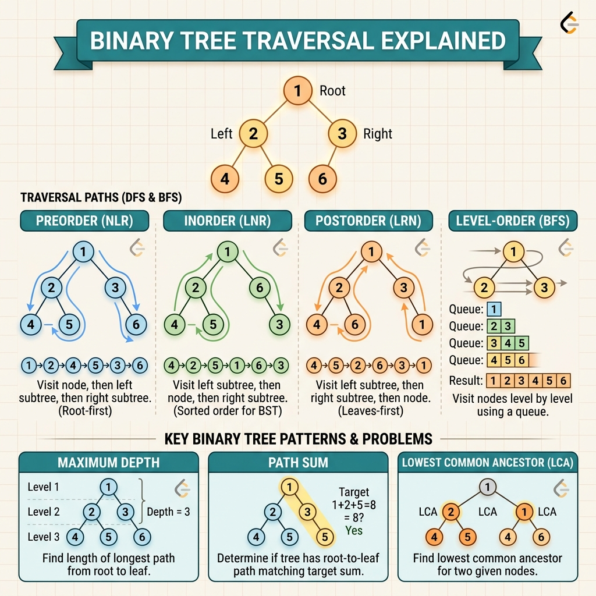

<!-- tags: leetcode, algorithms, coding-interview, tree -->
# 🌲 Tree Traversal

> DFS (inorder, preorder, postorder), BFS (level order), BST operations, path problems

📅 Created: 2026-03-20 · 🔄 Updated: 2026-04-10 · ⏱️ 11 min read

| Aspect         | Detail                                        |
| -------------- | --------------------------------------------- |
| **Complexity** | O(n) traversal, O(h) space (h = height)       |
| **Use case**   | Search, validate, transform binary trees      |
| **Go stdlib**  | No built-in tree; custom struct               |
| **LeetCode**   | #98, #100, #102, #104, #124, #226, #230, #236 |

---

### Interview template

> Copy-paste this pattern when encountering tree problems in an interview.

```go
// ── DFS — Return-value pattern ──────────────────────────────────
func solve(node *TreeNode) ReturnType {
    if node == nil { return baseCase }
    left  := solve(node.Left)
    right := solve(node.Right)
    return merge(left, right, node.Val)
}

// ── BFS — Level order ───────────────────────────────────────────
queue := []*TreeNode{root}
for len(queue) > 0 {
    size := len(queue)          // freeze current level count
    for i := 0; i < size; i++ {
        node := queue[0]; queue = queue[1:]
        if node.Left  != nil { queue = append(queue, node.Left)  }
        if node.Right != nil { queue = append(queue, node.Right) }
    }
}
```
```typescript
// ── DFS — Return-value pattern ──────────────────────────────────
function solve(node: TreeNode | null): number {
  if (!node) return 0;
  const left = solve(node.left);
  const right = solve(node.right);
  return Math.max(left, right) + 1;
}

// ── BFS — Level order ───────────────────────────────────────────
const queue: TreeNode[] = root ? [root] : [];
while (queue.length > 0) {
  const size = queue.length;
  for (let i = 0; i < size; i++) {
    const node = queue.shift()!;
    if (node.left) queue.push(node.left);
    if (node.right) queue.push(node.right);
  }
}
```
```rust
use std::cell::RefCell;
use std::collections::VecDeque;
use std::rc::Rc;

type Node = Option<Rc<RefCell<TreeNode>>>;

#[derive(Debug, Clone)]
struct TreeNode {
    val: i32,
    left: Node,
    right: Node,
}

// ── DFS — Return-value pattern ──────────────────────────────────
fn solve(node: Node) -> i32 {
    match node {
        None => 0,
        Some(curr) => {
            let left = solve(curr.borrow().left.clone());
            let right = solve(curr.borrow().right.clone());
            left.max(right) + 1
        }
    }
}

// ── BFS — Level order ───────────────────────────────────────────
let mut queue = VecDeque::new();
if let Some(node) = root.clone() {
    queue.push_back(node);
}
while !queue.is_empty() {
    let size = queue.len();
    for _ in 0..size {
        let node = queue.pop_front().unwrap();
        if let Some(left) = node.borrow().left.clone() { queue.push_back(left); }
        if let Some(right) = node.borrow().right.clone() { queue.push_back(right); }
    }
}
```
```cpp
struct TreeNode {
    int val;
    TreeNode* left;
    TreeNode* right;
    TreeNode(int v = 0, TreeNode* l = nullptr, TreeNode* r = nullptr)
        : val(v), left(l), right(r) {}
};

// ── DFS — Return-value pattern ──────────────────────────────────
int solve(TreeNode* node) {
    if (node == nullptr) return 0;
    int left = solve(node->left);
    int right = solve(node->right);
    return std::max(left, right) + 1;
}

// ── BFS — Level order ───────────────────────────────────────────
std::queue<TreeNode*> queue;
if (root != nullptr) queue.push(root);
while (!queue.empty()) {
    int size = static_cast<int>(queue.size());
    for (int i = 0; i < size; ++i) {
        TreeNode* node = queue.front();
        queue.pop();
        if (node->left != nullptr) queue.push(node->left);
        if (node->right != nullptr) queue.push(node->right);
    }
}
```
```python
from collections import deque

class TreeNode:
    def __init__(
        self,
        val: int = 0,
        left: "TreeNode | None" = None,
        right: "TreeNode | None" = None,
    ) -> None:
        self.val = val
        self.left = left
        self.right = right

# ── DFS — Return-value pattern ──────────────────────────────────
def solve(node: TreeNode | None) -> int:
    if not node:
        return 0
    left = solve(node.left)
    right = solve(node.right)
    return max(left, right) + 1

# ── BFS — Level order ───────────────────────────────────────────
queue = deque([root] if root else [])
while queue:
    for _ in range(len(queue)):
        node = queue.popleft()
        if node.left:
            queue.append(node.left)
        if node.right:
            queue.append(node.right)
```

---

## 1. DEFINE

A binary tree is a data structure that every interview assumes you have mastered. Tree Traversal helps you recognize that boundary before your code heads in the wrong direction.

In tree problems, many people know DFS and BFS by name. However, they do not actually know which order they need for the current problem. Tree Traversal fills that exact gap. It does not just traverse the tree. It decides when a node can yield an answer.

Problems like BST validation, diameter, max path sum, and level order look different on the surface. They all rely on choosing the right traversal contract. If you pick the wrong contract, any subsequent optimizations or tricks will fail.

Core insight: **Tree problems become much easier when you view preorder, inorder, postorder, and level-order as different contracts for when to process a node.**

| Variant | When to use | Core idea |
| ------- | ------- | ------- |
| DFS traversal | Path sum, height, validate subtree | Define clearly what each recursive call must return |
| BFS / level order | Process by level or find shortest steps | Queue holds the frontier of each level |
| BST-specific reasoning | Search, kth smallest, validate BST | Leverage inorder sorted property or min/max bounds |
| Tree DP | Combine results from two subtrees | Node result depends on left and right return values |

| Approach | Time | Space | When to choose |
|---|----------|-----|---------|
| Recursive DFS | O(n) | O(h) | Use when subtree return values are the main focus |
| Iterative stack DFS | O(n) | O(h) | Use to avoid recursion or to control order explicitly |
| BFS level order | O(n) | O(w) | Use when the problem involves levels, depth, or minimum steps |
| Tree DP combine | O(n) | O(h) | Use when each node must aggregate multiple child results |

### 1.1 Quick Identification

- The prompt asks for depth, path, ancestor, validation, traversal order, or subtree aggregation.
- If a node's answer depends on its children, postorder is usually a better suspect than preorder.
- If reasoning occurs by tier, a queue provides more clarity than a recursion stack.

### 1.2 Invariants & Failure Modes

- Each traversal order must align with the exact moment the required data becomes available.
- A subtree summary is only reliable when both child branches combine in the correct order.
- Common failure mode is using DFS blindly without deciding if the node needs processing before or after its children.

## 2. VISUAL

Tree problems look similar at a glance because they all use recursion. The image below categorizes them by traversal order and purpose to quickly identify the active sub-family.

### Overview — Tree Traversal



*Caption: Tree is a recursive structure. DFS handles depth, while BFS handles breadth. BST adds an ordering invariant.*

### Level 1 — Core intuition

```text
        1
      /   \
     2     3
    / \
   4   5

DFS preorder: 1,2,4,5,3
BFS level:    [1] -> [2,3] -> [4,5]
```

*Caption*: Level 1 highlights the difference between DFS and BFS. DFS goes deep along a branch. BFS expands across a frontier at the same level.

### Level 2 — Decision trace

- With DFS, clearly write the base case and the value that the recursive call returns to its parent.
- With BFS, freeze the queue size to prevent mixing new level nodes into the current level.
- With BST, ordering remains valid only if every node in the subtree satisfies the min/max bounds.
- With tree DP, the current node uses info from both children and returns a compact representation to its parent.

The trace reveals the traversal order. Tree problems often deceive at the recursive boundary. The upcoming code will show that point clearly.

## 3. CODE

Once the traversal contract is clear, code becomes a simple exercise in managing the stack, queue, or recursion frame. We move from foundational traversals to heavier tree aggregations.

### Problem 1: Basic — Traversals & Max Depth [LC #104, #226, #100]
> **Goal**: Basic DFS for max depth, invert, and same tree checks
> **Approach**: Recursive DFS pattern
> **Example**: Input is a binary tree or BST. Output is traversal, depth, path, or subtree property.
> **Complexity**: O(n) traversal time, O(h) space

```go
// leetcode/tree_basic.go
package leetcode

// ✅ LC #104: Maximum Depth of Binary Tree
// Pattern: DFS return value — max(left, right) + 1
// Time: O(n), Space: O(h)
func maxDepth(root *TreeNode) int {
    if root == nil {
        return 0
    }
    left := maxDepth(root.Left)
    right := maxDepth(root.Right)

    if left > right {
        return left + 1
    }
    return right + 1
}

// ✅ LC #226: Invert Binary Tree
// Pattern: DFS + swap children
// Time: O(n), Space: O(h)
func invertTree(root *TreeNode) *TreeNode {
    if root == nil {
        return nil
    }
    // ✅ Swap left and right
    root.Left, root.Right = root.Right, root.Left
    invertTree(root.Left)
    invertTree(root.Right)
    return root
}

// ✅ LC #100: Same Tree
// Pattern: DFS compare both trees simultaneously
// Time: O(n), Space: O(h)
func isSameTree(p, q *TreeNode) bool {
    if p == nil && q == nil {
        return true
    }
    if p == nil || q == nil {
        return false // ⚠️ One nil, other not
    }
    if p.Val != q.Val {
        return false
    }
    return isSameTree(p.Left, q.Left) && isSameTree(p.Right, q.Right)
}

// ✅ LC #572: Subtree of Another Tree
// Pattern: Check same tree at every node
// Time: O(n*m), Space: O(h)
func isSubtree(root, subRoot *TreeNode) bool {
    if root == nil {
        return false
    }
    if isSameTree(root, subRoot) {
        return true
    }
    return isSubtree(root.Left, subRoot) || isSubtree(root.Right, subRoot)
}
```
```typescript
// leetcode/tree-basic.ts
function maxDepth(root: TreeNode | null): number {
  if (!root) return 0;
  return Math.max(maxDepth(root.left), maxDepth(root.right)) + 1;
}

function invertTree(root: TreeNode | null): TreeNode | null {
  if (!root) return null;
  [root.left, root.right] = [invertTree(root.right), invertTree(root.left)];
  return root;
}

function isSameTree(p: TreeNode | null, q: TreeNode | null): boolean {
  if (!p && !q) return true;
  if (!p || !q || p.val !== q.val) return false;
  return isSameTree(p.left, q.left) && isSameTree(p.right, q.right);
}

function isSubtree(root: TreeNode | null, subRoot: TreeNode | null): boolean {
  if (!subRoot) return true;
  if (!root) return false;
  return (
    isSameTree(root, subRoot) ||
    isSubtree(root.left, subRoot) ||
    isSubtree(root.right, subRoot)
  );
}
```
```rust
// leetcode/tree_basic.rs
use std::cell::RefCell;
use std::rc::Rc;

type Node = Option<Rc<RefCell<TreeNode>>>;

#[derive(Debug, Clone)]
struct TreeNode {
    val: i32,
    left: Node,
    right: Node,
}

fn max_depth(root: Node) -> i32 {
    match root {
        None => 0,
        Some(node) => {
            let left = max_depth(node.borrow().left.clone());
            let right = max_depth(node.borrow().right.clone());
            left.max(right) + 1
        }
    }
}

fn invert_tree(root: Node) -> Node {
    if let Some(node) = root.clone() {
        let left = node.borrow().left.clone();
        let right = node.borrow().right.clone();
        node.borrow_mut().left = invert_tree(right);
        node.borrow_mut().right = invert_tree(left);
    }
    root
}

fn is_same_tree(p: Node, q: Node) -> bool {
    match (p, q) {
        (None, None) => true,
        (Some(a), Some(b)) => {
            a.borrow().val == b.borrow().val
                && is_same_tree(a.borrow().left.clone(), b.borrow().left.clone())
                && is_same_tree(a.borrow().right.clone(), b.borrow().right.clone())
        }
        _ => false,
    }
}

fn is_subtree(root: Node, sub_root: Node) -> bool {
    if sub_root.is_none() {
        return true;
    }
    match root.clone() {
        None => false,
        Some(node) => {
            is_same_tree(root, sub_root.clone())
                || is_subtree(node.borrow().left.clone(), sub_root.clone())
                || is_subtree(node.borrow().right.clone(), sub_root)
        }
    }
}
```
```cpp
// leetcode/tree_basic.cpp
int maxDepth(TreeNode* root) {
    if (root == nullptr) return 0;
    return std::max(maxDepth(root->left), maxDepth(root->right)) + 1;
}

TreeNode* invertTree(TreeNode* root) {
    if (root == nullptr) return nullptr;
    std::swap(root->left, root->right);
    invertTree(root->left);
    invertTree(root->right);
    return root;
}

bool isSameTree(TreeNode* p, TreeNode* q) {
    if (p == nullptr && q == nullptr) return true;
    if (p == nullptr || q == nullptr || p->val != q->val) return false;
    return isSameTree(p->left, q->left) && isSameTree(p->right, q->right);
}

bool isSubtree(TreeNode* root, TreeNode* subRoot) {
    if (subRoot == nullptr) return true;
    if (root == nullptr) return false;
    return isSameTree(root, subRoot)
        || isSubtree(root->left, subRoot)
        || isSubtree(root->right, subRoot);
}
```
```python
# leetcode/tree_basic.py
def max_depth(root: TreeNode | None) -> int:
    if not root:
        return 0
    return max(max_depth(root.left), max_depth(root.right)) + 1

def invert_tree(root: TreeNode | None) -> TreeNode | None:
    if not root:
        return None
    root.left, root.right = invert_tree(root.right), invert_tree(root.left)
    return root

def is_same_tree(p: TreeNode | None, q: TreeNode | None) -> bool:
    if not p and not q:
        return True
    if not p or not q or p.val != q.val:
        return False
    return is_same_tree(p.left, q.left) and is_same_tree(p.right, q.right)

def is_subtree(root: TreeNode | None, sub_root: TreeNode | None) -> bool:
    if not sub_root:
        return True
    if not root:
        return False
    return (
        is_same_tree(root, sub_root)
        or is_subtree(root.left, sub_root)
        or is_subtree(root.right, sub_root)
    )
```

> **Why?** Tree problems become clear when each subtree has a specific return contract for its parent. Once that contract stabilizes, DFS or BFS merely implements the combination of node information.

> **Takeaway**: This basic example demonstrates using traversals and max depth to solve LeetCode problems without skipping reasoning steps. When constraints change or require stronger optimization, move to the next example in this guide.

**✅ Achieved**: Max depth, invert, same tree, and subtree check using DFS fundamentals.
**⚠️ Warning**: The nil base case always returns a default value like 0 for depth or true for an empty match.

---

### Problem 2: Intermediate — BFS Level Order & BST [LC #102, #98, #230]
> **Goal**: BFS level-by-level processing, BST validation, and kth smallest element
> **Approach**: Queue for BFS, BST inorder equals sorted order
> **Example**: Input is a binary tree or BST. Output is traversal, depth, path, or subtree property.
> **Complexity**: O(n) for all operations, including BST operations

```go
// leetcode/tree_intermediate.go
package leetcode

// ✅ LC #102: Binary Tree Level Order Traversal
// Pattern: BFS with level tracking
// Time: O(n), Space: O(w) — w = max width
func levelOrder(root *TreeNode) [][]int {
    if root == nil {
        return nil
    }

    result := [][]int{}
    queue := []*TreeNode{root}

    for len(queue) > 0 {
        levelSize := len(queue) // ✅ Snapshot size BEFORE process
        level := make([]int, 0, levelSize)

        for i := 0; i < levelSize; i++ {
            node := queue[0]
            queue = queue[1:] // Dequeue

            level = append(level, node.Val)

            if node.Left != nil {
                queue = append(queue, node.Left)
            }
            if node.Right != nil {
                queue = append(queue, node.Right)
            }
        }

        result = append(result, level)
    }

    return result
}

// ✅ LC #98: Validate Binary Search Tree
// Pattern: DFS with bounds — pass min/max down
// Time: O(n), Space: O(h)
func isValidBST(root *TreeNode) bool {
    return validateBST(root, nil, nil)
}

func validateBST(node *TreeNode, min, max *int) bool {
    if node == nil {
        return true
    }

    // ✅ Check bounds
    if min != nil && node.Val <= *min {
        return false
    }
    if max != nil && node.Val >= *max {
        return false
    }

    // ✅ Left subtree: all < node.Val, Right subtree: all > node.Val
    return validateBST(node.Left, min, &node.Val) &&
           validateBST(node.Right, &node.Val, max)
}

// ✅ LC #230: Kth Smallest Element in a BST
// Pattern: Inorder traversal (BST inorder = sorted)
// Time: O(h + k), Space: O(h)
func kthSmallest(root *TreeNode, k int) int {
    stack := []*TreeNode{}
    curr := root
    count := 0

    for curr != nil || len(stack) > 0 {
        // ✅ Go all the way left
        for curr != nil {
            stack = append(stack, curr)
            curr = curr.Left
        }

        // ✅ Process node (inorder)
        curr = stack[len(stack)-1]
        stack = stack[:len(stack)-1]
        count++

        if count == k {
            return curr.Val // ✅ Found kth smallest
        }

        curr = curr.Right
    }

    return -1 // Should not reach
}

// ✅ LC #199: Binary Tree Right Side View
// Pattern: BFS — take LAST element of each level
// Time: O(n), Space: O(w)
func rightSideView(root *TreeNode) []int {
    if root == nil {
        return nil
    }

    result := []int{}
    queue := []*TreeNode{root}

    for len(queue) > 0 {
        levelSize := len(queue)

        for i := 0; i < levelSize; i++ {
            node := queue[0]
            queue = queue[1:]

            if i == levelSize-1 {
                result = append(result, node.Val) // ✅ Last in level = right side
            }

            if node.Left != nil {
                queue = append(queue, node.Left)
            }
            if node.Right != nil {
                queue = append(queue, node.Right)
            }
        }
    }

    return result
}
```
```typescript
// leetcode/tree-intermediate.ts
function levelOrder(root: TreeNode | null): number[][] {
  if (!root) return [];
  const result: number[][] = [];
  const queue: TreeNode[] = [root];

  while (queue.length > 0) {
    const size = queue.length;
    const level: number[] = [];
    for (let i = 0; i < size; i++) {
      const node = queue.shift()!;
      level.push(node.val);
      if (node.left) queue.push(node.left);
      if (node.right) queue.push(node.right);
    }
    result.push(level);
  }

  return result;
}

function isValidBST(root: TreeNode | null): boolean {
  const dfs = (
    node: TreeNode | null,
    low: number,
    high: number,
  ): boolean => {
    if (!node) return true;
    if (node.val <= low || node.val >= high) return false;
    return dfs(node.left, low, node.val) && dfs(node.right, node.val, high);
  };
  return dfs(root, -Infinity, Infinity);
}

function kthSmallest(root: TreeNode | null, k: number): number {
  const stack: TreeNode[] = [];
  let curr = root;
  let count = 0;

  while (curr || stack.length > 0) {
    while (curr) {
      stack.push(curr);
      curr = curr.left;
    }
    curr = stack.pop()!;
    count++;
    if (count === k) return curr.val;
    curr = curr.right;
  }

  return -1;
}

function rightSideView(root: TreeNode | null): number[] {
  if (!root) return [];
  const result: number[] = [];
  const queue: TreeNode[] = [root];

  while (queue.length > 0) {
    const size = queue.length;
    for (let i = 0; i < size; i++) {
      const node = queue.shift()!;
      if (i === size - 1) result.push(node.val);
      if (node.left) queue.push(node.left);
      if (node.right) queue.push(node.right);
    }
  }

  return result;
}
```
```rust
// leetcode/tree_intermediate.rs
use std::cell::RefCell;
use std::collections::VecDeque;
use std::rc::Rc;

type Node = Option<Rc<RefCell<TreeNode>>>;

#[derive(Debug, Clone)]
struct TreeNode {
    val: i32,
    left: Node,
    right: Node,
}

fn level_order(root: Node) -> Vec<Vec<i32>> {
    let mut result = Vec::new();
    let mut queue = VecDeque::new();
    if let Some(node) = root {
        queue.push_back(node);
    } else {
        return result;
    }

    while !queue.is_empty() {
        let size = queue.len();
        let mut level = Vec::with_capacity(size);
        for _ in 0..size {
            let node = queue.pop_front().unwrap();
            let node_ref = node.borrow();
            level.push(node_ref.val);
            if let Some(left) = node_ref.left.clone() {
                queue.push_back(left);
            }
            if let Some(right) = node_ref.right.clone() {
                queue.push_back(right);
            }
        }
        result.push(level);
    }

    result
}

fn is_valid_bst(root: Node) -> bool {
    fn dfs(node: Node, low: Option<i64>, high: Option<i64>) -> bool {
        match node {
            None => true,
            Some(curr) => {
                let node = curr.borrow();
                if low.is_some_and(|v| node.val as i64 <= v) {
                    return false;
                }
                if high.is_some_and(|v| node.val as i64 >= v) {
                    return false;
                }
                dfs(node.left.clone(), low, Some(node.val as i64))
                    && dfs(node.right.clone(), Some(node.val as i64), high)
            }
        }
    }
    dfs(root, None, None)
}

fn kth_smallest(root: Node, k: i32) -> i32 {
    let mut stack: Vec<Rc<RefCell<TreeNode>>> = Vec::new();
    let mut curr = root;
    let mut count = 0;

    while curr.is_some() || !stack.is_empty() {
        while let Some(node) = curr {
            curr = node.borrow().left.clone();
            stack.push(node);
        }
        let node = stack.pop().unwrap();
        count += 1;
        if count == k {
            return node.borrow().val;
        }
        curr = node.borrow().right.clone();
    }

    -1
}

fn right_side_view(root: Node) -> Vec<i32> {
    let mut result = Vec::new();
    let mut queue = VecDeque::new();
    if let Some(node) = root {
        queue.push_back(node);
    } else {
        return result;
    }

    while !queue.is_empty() {
        let size = queue.len();
        for i in 0..size {
            let node = queue.pop_front().unwrap();
            let node_ref = node.borrow();
            if i + 1 == size {
                result.push(node_ref.val);
            }
            if let Some(left) = node_ref.left.clone() {
                queue.push_back(left);
            }
            if let Some(right) = node_ref.right.clone() {
                queue.push_back(right);
            }
        }
    }

    result
}
```
```cpp
// leetcode/tree_intermediate.cpp
#include <limits>
#include <queue>
#include <vector>

std::vector<std::vector<int>> levelOrder(TreeNode* root) {
    if (root == nullptr) return {};
    std::vector<std::vector<int>> result;
    std::queue<TreeNode*> queue;
    queue.push(root);

    while (!queue.empty()) {
        int size = static_cast<int>(queue.size());
        std::vector<int> level;
        level.reserve(size);
        for (int i = 0; i < size; ++i) {
            TreeNode* node = queue.front();
            queue.pop();
            level.push_back(node->val);
            if (node->left != nullptr) queue.push(node->left);
            if (node->right != nullptr) queue.push(node->right);
        }
        result.push_back(level);
    }

    return result;
}

bool isValidBST(TreeNode* root, long long low = LLONG_MIN, long long high = LLONG_MAX) {
    if (root == nullptr) return true;
    if (root->val <= low || root->val >= high) return false;
    return isValidBST(root->left, low, root->val)
        && isValidBST(root->right, root->val, high);
}

int kthSmallest(TreeNode* root, int k) {
    std::vector<TreeNode*> stack;
    TreeNode* curr = root;
    while (curr != nullptr || !stack.empty()) {
        while (curr != nullptr) {
            stack.push_back(curr);
            curr = curr->left;
        }
        curr = stack.back();
        stack.pop_back();
        if (--k == 0) return curr->val;
        curr = curr->right;
    }
    return -1;
}

std::vector<int> rightSideView(TreeNode* root) {
    if (root == nullptr) return {};
    std::vector<int> result;
    std::queue<TreeNode*> queue;
    queue.push(root);

    while (!queue.empty()) {
        int size = static_cast<int>(queue.size());
        for (int i = 0; i < size; ++i) {
            TreeNode* node = queue.front();
            queue.pop();
            if (i == size - 1) result.push_back(node->val);
            if (node->left != nullptr) queue.push(node->left);
            if (node->right != nullptr) queue.push(node->right);
        }
    }

    return result;
}
```
```python
# leetcode/tree_intermediate.py
from collections import deque

def level_order(root: TreeNode | None) -> list[list[int]]:
    if not root:
        return []
    result: list[list[int]] = []
    queue = deque([root])

    while queue:
        level: list[int] = []
        for _ in range(len(queue)):
            node = queue.popleft()
            level.append(node.val)
            if node.left:
                queue.append(node.left)
            if node.right:
                queue.append(node.right)
        result.append(level)

    return result

def is_valid_bst(root: TreeNode | None) -> bool:
    def dfs(node: TreeNode | None, low: float, high: float) -> bool:
        if not node:
            return True
        if node.val <= low or node.val >= high:
            return False
        return dfs(node.left, low, node.val) and dfs(node.right, node.val, high)

    return dfs(root, float("-inf"), float("inf"))

def kth_smallest(root: TreeNode | None, k: int) -> int:
    stack: list[TreeNode] = []
    curr = root
    while curr or stack:
        while curr:
            stack.append(curr)
            curr = curr.left
        curr = stack.pop()
        k -= 1
        if k == 0:
            return curr.val
        curr = curr.right
    return -1

def right_side_view(root: TreeNode | None) -> list[int]:
    if not root:
        return []
    result: list[int] = []
    queue = deque([root])
    while queue:
        size = len(queue)
        for i in range(size):
            node = queue.popleft()
            if i == size - 1:
                result.append(node.val)
            if node.left:
                queue.append(node.left)
            if node.right:
                queue.append(node.right)
    return result
```

> **Why?** Tree problems become clear when each subtree has a specific return contract for its parent. Once that contract stabilizes, DFS or BFS merely implements the combination of node information.

> **Takeaway**: This intermediate example demonstrates using BFS level order and BST to solve LeetCode problems without skipping reasoning steps. When constraints change or require stronger optimization, move to the next example in this guide.

**✅ Achieved**: BFS level order, BST validation with bounds, kth smallest via iterative inorder, and right side view.
**⚠️ Warning**: BST validate uses an integer pointer for min and max because Go lacks a null integer type.

---

### Problem 3: Advanced — LCA, Diameter, Max Path Sum [LC #236, #543, #124]
> **Goal**: Complex DFS returning structured information
> **Approach**: DFS with backtracking and global variable updates
> **Example**: Input is a binary tree or BST. Output is traversal, depth, path, or subtree property.
> **Complexity**: LCA O(n), Diameter O(n), Max Path Sum O(n)

```go
// leetcode/tree_advanced.go
package leetcode

// ✅ LC #236: Lowest Common Ancestor of Binary Tree
// Pattern: DFS divide and conquer
// If left AND right found → current node is LCA
// Time: O(n), Space: O(h)
func lowestCommonAncestor(root, p, q *TreeNode) *TreeNode {
    // ✅ Base cases
    if root == nil || root == p || root == q {
        return root
    }

    left := lowestCommonAncestor(root.Left, p, q)
    right := lowestCommonAncestor(root.Right, p, q)

    // ✅ Both sides found → root is LCA
    if left != nil && right != nil {
        return root
    }

    // ✅ Only one side found → return that side
    if left != nil {
        return left
    }
    return right
}

// ✅ LC #543: Diameter of Binary Tree
// Diameter = longest path between any 2 nodes (in edges)
// Pattern: DFS return depth, update global diameter
// Time: O(n), Space: O(h)
func diameterOfBinaryTree(root *TreeNode) int {
    diameter := 0

    var dfs func(node *TreeNode) int
    dfs = func(node *TreeNode) int {
        if node == nil {
            return 0
        }

        left := dfs(node.Left)
        right := dfs(node.Right)

        // ✅ Diameter passing through current node = left + right
        if left+right > diameter {
            diameter = left + right
        }

        // ✅ Return depth (max branch + 1)
        if left > right {
            return left + 1
        }
        return right + 1
    }

    dfs(root)
    return diameter
}

// ✅ LC #124: Binary Tree Maximum Path Sum (HARD)
// Path: any node to any node (not necessarily through root)
// Pattern: DFS — at each node calculate: max(left, 0) + node.Val + max(right, 0)
// Time: O(n), Space: O(h)
func maxPathSum(root *TreeNode) int {
    maxSum := root.Val // ⚠️ Initialize with root.Val (can be negative)

    var dfs func(node *TreeNode) int
    dfs = func(node *TreeNode) int {
        if node == nil {
            return 0
        }

        // ✅ max(0, ...) → drop negative subtree paths
        left := max(0, dfs(node.Left))
        right := max(0, dfs(node.Right))

        // ✅ Path passing through current node
        pathSum := left + node.Val + right
        if pathSum > maxSum {
            maxSum = pathSum
        }

        // ✅ Return: can only travel in one direction (left OR right)
        if left > right {
            return left + node.Val
        }
        return right + node.Val
    }

    dfs(root)
    return maxSum
}

// ✅ LC #105: Construct Binary Tree from Preorder and Inorder
// Pattern: Preorder[0] = root, find root in inorder → split left/right
// Time: O(n), Space: O(n)
func buildTree(preorder, inorder []int) *TreeNode {
    if len(preorder) == 0 {
        return nil
    }

    // ✅ Root = first element of preorder
    root := &TreeNode{Val: preorder[0]}

    // ✅ Find root in inorder → determines left/right subtree sizes
    mid := 0
    for i, v := range inorder {
        if v == preorder[0] {
            mid = i
            break
        }
    }

    // ✅ Recursively build subtrees
    root.Left = buildTree(preorder[1:mid+1], inorder[:mid])
    root.Right = buildTree(preorder[mid+1:], inorder[mid+1:])

    return root
}
```
```typescript
// leetcode/tree-advanced.ts
function lowestCommonAncestor(
  root: TreeNode | null,
  p: TreeNode | null,
  q: TreeNode | null,
): TreeNode | null {
  if (!root || root === p || root === q) return root;
  const left = lowestCommonAncestor(root.left, p, q);
  const right = lowestCommonAncestor(root.right, p, q);
  if (left && right) return root;
  return left ?? right;
}

function diameterOfBinaryTree(root: TreeNode | null): number {
  let diameter = 0;
  const dfs = (node: TreeNode | null): number => {
    if (!node) return 0;
    const left = dfs(node.left);
    const right = dfs(node.right);
    diameter = Math.max(diameter, left + right);
    return Math.max(left, right) + 1;
  };
  dfs(root);
  return diameter;
}

function maxPathSum(root: TreeNode | null): number {
  let best = -Infinity;
  const dfs = (node: TreeNode | null): number => {
    if (!node) return 0;
    const left = Math.max(0, dfs(node.left));
    const right = Math.max(0, dfs(node.right));
    best = Math.max(best, left + node.val + right);
    return Math.max(left, right) + node.val;
  };
  dfs(root);
  return best;
}

function buildTree(preorder: number[], inorder: number[]): TreeNode | null {
  if (preorder.length === 0) return null;
  const rootVal = preorder[0];
  const mid = inorder.indexOf(rootVal);
  const root = new TreeNode(rootVal);
  root.left = buildTree(preorder.slice(1, mid + 1), inorder.slice(0, mid));
  root.right = buildTree(preorder.slice(mid + 1), inorder.slice(mid + 1));
  return root;
}
```
```rust
// leetcode/tree_advanced.rs
use std::cell::RefCell;
use std::rc::Rc;

type Node = Option<Rc<RefCell<TreeNode>>>;

#[derive(Debug, Clone)]
struct TreeNode {
    val: i32,
    left: Node,
    right: Node,
}

fn same_node(a: &Node, b: &Node) -> bool {
    match (a, b) {
        (Some(x), Some(y)) => Rc::ptr_eq(x, y),
        (None, None) => true,
        _ => false,
    }
}

fn lowest_common_ancestor(root: Node, p: Node, q: Node) -> Node {
    match root.clone() {
        None => None,
        Some(node) => {
            if same_node(&root, &p) || same_node(&root, &q) {
                return root;
            }
            let left = lowest_common_ancestor(node.borrow().left.clone(), p.clone(), q.clone());
            let right = lowest_common_ancestor(node.borrow().right.clone(), p, q);
            if left.is_some() && right.is_some() {
                root
            } else if left.is_some() {
                left
            } else {
                right
            }
        }
    }
}

fn diameter_of_binary_tree(root: Node) -> i32 {
    fn dfs(node: Node, best: &mut i32) -> i32 {
        match node {
            None => 0,
            Some(curr) => {
                let left = dfs(curr.borrow().left.clone(), best);
                let right = dfs(curr.borrow().right.clone(), best);
                *best = (*best).max(left + right);
                left.max(right) + 1
            }
        }
    }

    let mut best = 0;
    dfs(root, &mut best);
    best
}

fn max_path_sum(root: Node) -> i32 {
    fn dfs(node: Node, best: &mut i32) -> i32 {
        match node {
            None => 0,
            Some(curr) => {
                let node = curr.borrow();
                let left = dfs(node.left.clone(), best).max(0);
                let right = dfs(node.right.clone(), best).max(0);
                *best = (*best).max(left + node.val + right);
                left.max(right) + node.val
            }
        }
    }

    let mut best = i32::MIN;
    dfs(root, &mut best);
    best
}

fn build_tree(preorder: &[i32], inorder: &[i32]) -> Node {
    if preorder.is_empty() {
        return None;
    }

    let root_val = preorder[0];
    let mid = inorder.iter().position(|&v| v == root_val).unwrap();
    Some(Rc::new(RefCell::new(TreeNode {
        val: root_val,
        left: build_tree(&preorder[1..mid + 1], &inorder[..mid]),
        right: build_tree(&preorder[mid + 1..], &inorder[mid + 1..]),
    })))
}
```
```cpp
// leetcode/tree_advanced.cpp
TreeNode* lowestCommonAncestor(TreeNode* root, TreeNode* p, TreeNode* q) {
    if (root == nullptr || root == p || root == q) return root;
    TreeNode* left = lowestCommonAncestor(root->left, p, q);
    TreeNode* right = lowestCommonAncestor(root->right, p, q);
    if (left != nullptr && right != nullptr) return root;
    return left != nullptr ? left : right;
}

int diameterOfBinaryTree(TreeNode* root) {
    int diameter = 0;
    std::function<int(TreeNode*)> dfs = [&](TreeNode* node) {
        if (node == nullptr) return 0;
        int left = dfs(node->left);
        int right = dfs(node->right);
        diameter = std::max(diameter, left + right);
        return std::max(left, right) + 1;
    };
    dfs(root);
    return diameter;
}

int maxPathSum(TreeNode* root) {
    int best = INT_MIN;
    std::function<int(TreeNode*)> dfs = [&](TreeNode* node) {
        if (node == nullptr) return 0;
        int left = std::max(0, dfs(node->left));
        int right = std::max(0, dfs(node->right));
        best = std::max(best, left + node->val + right);
        return std::max(left, right) + node->val;
    };
    dfs(root);
    return best;
}

TreeNode* buildTree(std::vector<int>& preorder, std::vector<int>& inorder) {
    if (preorder.empty()) return nullptr;
    int rootVal = preorder[0];
    int mid = std::find(inorder.begin(), inorder.end(), rootVal) - inorder.begin();
    TreeNode* root = new TreeNode(rootVal);
    std::vector<int> leftPre(preorder.begin() + 1, preorder.begin() + 1 + mid);
    std::vector<int> rightPre(preorder.begin() + 1 + mid, preorder.end());
    std::vector<int> leftIn(inorder.begin(), inorder.begin() + mid);
    std::vector<int> rightIn(inorder.begin() + mid + 1, inorder.end());
    root->left = buildTree(leftPre, leftIn);
    root->right = buildTree(rightPre, rightIn);
    return root;
}
```
```python
# leetcode/tree_advanced.py
def lowest_common_ancestor(
    root: TreeNode | None,
    p: TreeNode | None,
    q: TreeNode | None,
) -> TreeNode | None:
    if not root or root is p or root is q:
        return root
    left = lowest_common_ancestor(root.left, p, q)
    right = lowest_common_ancestor(root.right, p, q)
    if left and right:
        return root
    return left or right

def diameter_of_binary_tree(root: TreeNode | None) -> int:
    diameter = 0

    def dfs(node: TreeNode | None) -> int:
        nonlocal diameter
        if not node:
            return 0
        left = dfs(node.left)
        right = dfs(node.right)
        diameter = max(diameter, left + right)
        return max(left, right) + 1

    dfs(root)
    return diameter

def max_path_sum(root: TreeNode | None) -> int:
    best = float("-inf")

    def dfs(node: TreeNode | None) -> int:
        nonlocal best
        if not node:
            return 0
        left = max(0, dfs(node.left))
        right = max(0, dfs(node.right))
        best = max(best, left + node.val + right)
        return max(left, right) + node.val

    dfs(root)
    return int(best)

def build_tree(preorder: list[int], inorder: list[int]) -> TreeNode | None:
    if not preorder:
        return None
    root_val = preorder[0]
    mid = inorder.index(root_val)
    root = TreeNode(root_val)
    root.left = build_tree(preorder[1 : mid + 1], inorder[:mid])
    root.right = build_tree(preorder[mid + 1 :], inorder[mid + 1 :])
    return root
```

> **Why?** Tree problems become clear when each subtree has a specific return contract for its parent. Once that contract stabilizes, DFS or BFS merely implements the combination of node information.

> **Takeaway**: This advanced example demonstrates using LCA, diameter, and max path sum to solve LeetCode problems without skipping reasoning steps. When constraints change or require stronger optimization, move to the next example in this guide.

**✅ Achieved**: LCA divide-and-conquer, diameter and max path sum via DFS with global tracking, and tree construction.
**⚠️ Warning**: LC #124 returns only one branch but updates the global variable with both branches.

---

Recursive tree code often feels correct because small base cases always pass. The pitfalls below expose bugs that only appear in larger trees.

## 4. PITFALLS

Mistakes in the tree family usually stem from combining results too early or too late. They rarely come from recursion syntax errors.

| # | Severity | Defect | Consequence | Fix |
|---|----------|-----|---------|-----|
| 1 | 🔴 Fatal | BST validate only checks immediate children | Invalid BST still passes small tests | Check the entire subtree by passing bounds |
| 2 | 🟡 Common | Max path sum forgets to drop negative paths | Result is smaller than optimal | Drop negative subtrees using zero instead |
| 3 | 🟡 Common | Max path sum returns both branches | Violates path definition | Return one branch and update global with both |
| 4 | 🔵 Minor | Level order forgets to snapshot queue size | Mixes nodes between different levels | Snapshot queue length before the loop |
| 5 | 🔵 Minor | Build tree uses linear search for root | O(n²) complexity instead of O(n) | Use a HashMap for O(1) lookup |
| 6 | 🔵 Minor | Access node value on a nil node | Panic or nil pointer dereference | Always check for nil node first |

### 🔴 Pitfall #1 — BST validation only checks immediate children

This BST validation code looks reasonable:

```go
func isValidBST(root *TreeNode) bool {
    if root == nil { return true }
    if root.Left != nil && root.Left.Val >= root.Val { return false }
    if root.Right != nil && root.Right.Val <= root.Val { return false }
    return isValidBST(root.Left) && isValidBST(root.Right)
}
```

However, consider the tree `[5, 1, 6, nil, nil, 3, 7]`. Node `3` sits in the right subtree of `5`. Since `3 < 5`, this is an invalid BST. The code above still returns true.

**Fix**: Pass bounds using `isValid(node, min, max)`. Every node must fall within the range `(min, max)`. Checking against the immediate parent is insufficient.

---

## 5. REF

| Resource             | Difficulty | Link                                                                                                                                    |
| -------------------- | ---------- | --------------------------------------------------------------------------------------------------------------------------------------- |
| LC #102 Level Order  | 🟡 Medium  | [leetcode.com/problems/binary-tree-level-order-traversal](https://leetcode.com/problems/binary-tree-level-order-traversal/)             |
| LC #124 Max Path Sum | 🔴 Hard    | [leetcode.com/problems/binary-tree-maximum-path-sum](https://leetcode.com/problems/binary-tree-maximum-path-sum/)                       |
| LC #236 LCA          | 🟡 Medium  | [leetcode.com/problems/lowest-common-ancestor-of-a-binary-tree](https://leetcode.com/problems/lowest-common-ancestor-of-a-binary-tree/) |
| Tree Patterns Guide  | —          | [leetcode.com/discuss/general-discussion/937307](https://leetcode.com/discuss/general-discussion/937307/)                               |

---

## 6. RECOMMEND

When DFS and BFS on trees become second nature, the next step is separating the concerns. You must distinguish basic traversals from tree DP and recognize when a problem requires graph visited-state discipline.

| Next steps | When to use | Rationale | File/Link |
| ------- | ------- | ----- | --------- |
| Graph BFS/DFS | Multi-node traversal on non-tree structures | Expands traversal concepts to graphs | [06-graph-bfs-dfs](./06-graph-bfs-dfs.md) |
| Advanced Trees | Tree DP, reconstruction, and metadata | Upgrades traversal to DP on trees | [22-advanced-trees](./22-advanced-trees.md) |
| Trie | Prefix search and autocomplete | Specializes the tree for strings | [12-trie](./12-trie.md) |
| Heap | Priority queue backed by complete binary tree | Applies tree structure to priorities | [11-heap-priority-queue](./11-heap-priority-queue.md) |

---

## 7. QUICK REF

| Situation / Signal | Pattern / Approach | Complexity | When to use | Warning |
|--------------------|--------------------|------------|----------|----------|
| BST sorted output | Inorder DFS | O(n) · O(h) | Validate BST, kth smallest | BST inorder sequence is sorted |
| Serialize or copy tree | Preorder DFS | O(n) · O(h) | Serialize, flatten | Track null markers carefully |
| Delete or eval tree | Postorder DFS | O(n) · O(h) | Tree height, max depth | Process children before the parent |
| Level-by-level | BFS + queue | O(n) · O(w) | Right side view, zigzag | Snapshot queue size before loop |
| Max path or diameter | DFS + global variable | O(n) · O(h) | Path crosses root or not | Return one branch, update global |
| Validate BST bounds | DFS + bounds (lo, hi) | O(n) · O(h) | Check valid BST | Pass full bounds down the tree |

---

Return to the initial "validate BST" question. You now know that comparing immediate children fails. You must propagate bounds down the entire subtree.

---

**Links**: [← Linked List](./04-linked-list.md) · [→ Graph BFS/DFS](./06-graph-bfs-dfs.md)