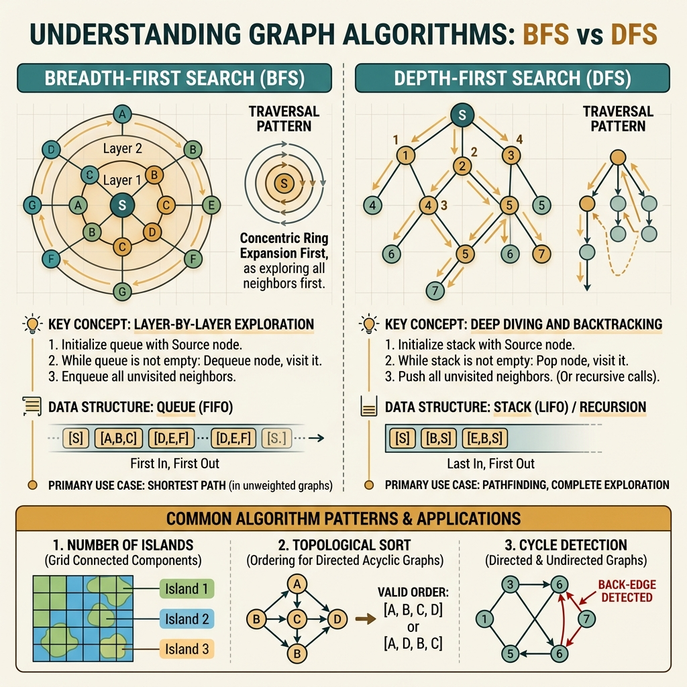

<!-- tags: leetcode, algorithms, coding-interview, graph -->
# 🗺️ Graph BFS/DFS

> Graph traversal, shortest path, topological sort, union-find, detect cycle

📅 Created: 2026-03-20 · 🔄 Updated: 2026-04-10 · ⏱️ 11 min read

| Aspect         | Detail                                          |
| -------------- | ----------------------------------------------- |
| **Complexity** | O(V + E) traversal, Dijkstra O(E log V)         |
| **Use case**   | Connected components, shortest path, scheduling |
| **Go stdlib**  | No built-in; adjacency list via `map[int][]int` |
| **LeetCode**   | #127, #133, #200, #207, #210, #261, #269, #743  |

---

### Interview template

> Copy-paste this pattern when encountering graph problems in an interview.

```go
// ── BFS — Shortest Path (unweighted) ───────────────────────────
visited := map[int]bool{start: true}
queue   := []int{start}
dist    := map[int]int{start: 0}
for len(queue) > 0 {
    u := queue[0]; queue = queue[1:]
    for _, v := range adj[u] {
        if !visited[v] {
            visited[v] = true
            dist[v] = dist[u] + 1
            queue = append(queue, v)
        }
    }
}

// ── DFS — Component / Cycle ─────────────────────────────────────
func dfs(u int, visited map[int]bool) {
    visited[u] = true
    for _, v := range adj[u] {
        if !visited[v] { dfs(v, visited) }
    }
}
```
```typescript
// ── BFS — Shortest Path (unweighted) ───────────────────────────
const visited = new Map<number, boolean>([[start, true]]);
const queue: number[] = [start];
const dist = new Map<number, number>([[start, 0]]);
while (queue.length > 0) {
    const u = queue.shift()!;
    for (const v of adj.get(u) ?? []) {
        if (!visited.get(v)) {
            visited.set(v, true);
            dist.set(v, (dist.get(u) ?? 0) + 1);
            queue.push(v);
        }
    }
}

// ── DFS — Component / Cycle ─────────────────────────────────────
const dfs = (u: number, visited: Set<number>) => {
    visited.add(u);
    for (const v of adj.get(u) ?? []) {
        if (!visited.has(v)) dfs(v, visited);
    }
};
```
```rust
// ── BFS — Shortest Path (unweighted) ───────────────────────────
use std::collections::{HashMap, VecDeque};
let mut visited = HashMap::from([(start, true)]);
let mut queue = VecDeque::from([start]);
let mut dist = HashMap::from([(start, 0)]);
while let Some(u) = queue.pop_front() {
    for &v in adj.get(&u).unwrap_or(&Vec::new()) {
        if !visited.contains_key(&v) {
            visited.insert(v, true);
            dist.insert(v, dist[&u] + 1);
            queue.push_back(v);
        }
    }
}

// ── DFS — Component / Cycle ─────────────────────────────────────
fn dfs(u: i32, adj: &HashMap<i32, Vec<i32>>, visited: &mut HashMap<i32, bool>) {
    visited.insert(u, true);
    for &v in adj.get(&u).unwrap_or(&Vec::new()) {
        if !visited.contains_key(&v) {
            dfs(v, adj, visited);
        }
    }
}
```
```cpp
// ── BFS — Shortest Path (unweighted) ───────────────────────────
std::unordered_map<int, bool> visited{{start, true}};
std::queue<int> queue;
queue.push(start);
std::unordered_map<int, int> dist{{start, 0}};
while (!queue.empty()) {
    int u = queue.front();
    queue.pop();
    for (int v : adj[u]) {
        if (!visited[v]) {
            visited[v] = true;
            dist[v] = dist[u] + 1;
            queue.push(v);
        }
    }
}

// ── DFS — Component / Cycle ─────────────────────────────────────
std::function<void(int)> dfs = [&](int u) {
    visited[u] = true;
    for (int v : adj[u]) {
        if (!visited[v]) dfs(v);
    }
};
```
```python
# ── BFS — Shortest Path (unweighted) ───────────────────────────
from collections import deque

visited = {start}
queue = deque([start])
dist = {start: 0}
while queue:
    u = queue.popleft()
    for v in adj.get(u, []):
        if v not in visited:
            visited.add(v)
            dist[v] = dist[u] + 1
            queue.append(v)

# ── DFS — Component / Cycle ─────────────────────────────────────
def dfs(u: int, visited: set[int]) -> None:
    visited.add(u)
    for v in adj.get(u, []):
        if v not in visited:
            dfs(v, visited)
```

---

## 1. DEFINE

You need a family guide fast enough to map a new problem to an old pattern without mixing up variations. Graph BFS/DFS exists for exactly that moment.

Graph problems rarely announce whether you need shortest paths, component searches, topological ordering, or connectivity checks. They present nodes, edges, or a grid and force you to pick the right primitive. This family serves as the foundation to prevent early mistakes.

The difficulty lies not in writing a queue or recursion. It lies in understanding which frontier expands, when the visited state locks, and what relationship the problem actually measures.

Core insight: **The graph family becomes clear when you choose the right primitive to prove a relationship by layers, branches, components, or indegrees.**

| Variant | When to use | Core idea |
| ------- | ------- | ------- |
| BFS on unweighted graph | Shortest path, multi-source spread | Queue expands using the fewest steps first |
| DFS for component / cycle | Connected components, island, backtracking | Explore an entire region before moving to another |
| Topological / DAG reasoning | Course schedule, dependency order | Combine indegree or DFS state to detect cycles |
| Weighted shortest path | Edges have non-negative weights | Switch from a FIFO queue to a priority queue |

| Approach | Time | Space | When to choose |
|---|----------|-----|---------|
| BFS | O(V + E) | O(V) | Use for unweighted shortest paths or level exploration |
| DFS | O(V + E) | O(V) | Use for components, reachability, or cycle detection |
| Kahn / topo sort | O(V + E) | O(V) | Use when you need a valid DAG ordering |
| Dijkstra | O((V + E) log V) | O(V) | Use when edges have non-negative weights |

### 1.1 Quick Identification

- The prompt mentions islands, components, shortest paths, clone graphs, prerequisites, or course schedules.
- BFS works best when every step has the same cost. DFS excels when reasoning by branch or requiring timestamps.
- The visited state is never a minor detail. It forms a crucial part of correctness.

### 1.2 Invariants & Failure Modes

- BFS must maintain a layer-based frontier. DFS must hold the currently active branch.
- Nodes should be marked exactly when the primitive requires, not later for convenience.
- A common failure mode involves triggering DFS or BFS reflexively without explaining the current frontier.

## 2. VISUAL

Graph problems split into four sub-families based on traversal method and purpose. The image below routes you to the right approach before you read the trace.

### Overview — Graph BFS/DFS



*Caption: BFS handles shortest paths. DFS handles exploration. Topo sorts a DAG. Multi-source starts from multiple points.*

### Level 1 — Core intuition

```text
BFS from node 0
0 -> [1,2]
1 -> [3]
2 -> [4]

levels: [0] -> [1,2] -> [3,4]
```

*Caption*: Level 1 shows the BFS frontier. Every node at the current level must be processed before moving to the next level.

### Level 2 — Decision trace

- For BFS, mark visited immediately upon enqueueing to avoid duplicate work within the same level.
- For DFS, the contract must be explicit. Entering a node marks it. Leaving a node may unmark it if backtracking is needed.
- For topo sort, indegree or recursion state must reflect the remaining unresolved dependencies.
- For weighted graphs, a queue is insufficient. The frontier must prioritize candidates with the best current distance.

The diagram illustrates how BFS and DFS explore by layer and depth. The code transforms that intuition into implementation. However, visited timing remains the most common point of failure.

## 3. CODE

Once the frontier role is clear, the code must strictly adhere to the queue, stack, indegree map, or parent relation. We move from foundational traversal to state-heavy graph problems.

### Problem 1: Basic — Number of Islands & Clone Graph [LC #200, #133]
> **Goal**: BFS/DFS on grids and adjacency lists
> **Approach**: Visited tracking and 4-directional movement
> **Example**: Input is a graph, grid, or adjacency list. Output is a path, distance, component, or order.
> **Complexity**: O(m×n) grid traversal, O(V+E) graph clone

```go
// leetcode/graph_basic.go
package leetcode

// ✅ LC #200: Number of Islands
// Pattern: BFS/DFS on grid — flood fill
// Time: O(m×n), Space: O(m×n)
func numIslands(grid [][]byte) int {
    if len(grid) == 0 {
        return 0
    }

    rows, cols := len(grid), len(grid[0])
    count := 0
    dirs := [4][2]int{{-1, 0}, {1, 0}, {0, -1}, {0, 1}}

    var dfs func(r, c int)
    dfs = func(r, c int) {
        // ✅ Bounds check + visited check
        if r < 0 || r >= rows || c < 0 || c >= cols || grid[r][c] == '0' {
            return
        }
        grid[r][c] = '0' // ⚠️ Mark visited (modify in-place)

        for _, d := range dirs {
            dfs(r+d[0], c+d[1])
        }
    }

    for r := 0; r < rows; r++ {
        for c := 0; c < cols; c++ {
            if grid[r][c] == '1' {
                count++
                dfs(r, c) // ✅ Flood fill entire island
            }
        }
    }

    return count
}

// ✅ LC #133: Clone Graph
// Pattern: BFS/DFS + HashMap (old node → new node)
// Time: O(V+E), Space: O(V)
type Node struct {
    Val       int
    Neighbors []*Node
}

func cloneGraph(node *Node) *Node {
    if node == nil {
        return nil
    }

    cloned := make(map[*Node]*Node) // ✅ old → new mapping

    var dfs func(n *Node) *Node
    dfs = func(n *Node) *Node {
        if clone, ok := cloned[n]; ok {
            return clone // ✅ Already cloned
        }

        // ✅ Create clone
        clone := &Node{Val: n.Val}
        cloned[n] = clone

        // ✅ Clone neighbors
        for _, neighbor := range n.Neighbors {
            clone.Neighbors = append(clone.Neighbors, dfs(neighbor))
        }

        return clone
    }

    return dfs(node)
}
```
```typescript
// leetcode/graph_basic.ts
export function numIslands(grid: string[][]): number {
    if (grid.length === 0) return 0;
    const rows = grid.length;
    const cols = grid[0].length;
    const dirs = [[-1, 0], [1, 0], [0, -1], [0, 1]];
    let count = 0;
    const dfs = (r: number, c: number) => {
        if (r < 0 || r >= rows || c < 0 || c >= cols || grid[r][c] === "0") return;
        grid[r][c] = "0";
        for (const [dr, dc] of dirs) dfs(r + dr, c + dc);
    };
    for (let r = 0; r < rows; r++) {
        for (let c = 0; c < cols; c++) {
            if (grid[r][c] === "1") {
                count++;
                dfs(r, c);
            }
        }
    }
    return count;
}

export class Node {
    constructor(public val = 0, public neighbors: Node[] = []) {}
}

export function cloneGraph(node: Node | null): Node | null {
    if (!node) return null;
    const cloned = new Map<Node, Node>();
    const dfs = (curr: Node): Node => {
        if (cloned.has(curr)) return cloned.get(curr)!;
        const copy = new Node(curr.val);
        cloned.set(curr, copy);
        copy.neighbors = curr.neighbors.map(dfs);
        return copy;
    };
    return dfs(node);
}
```
```rust
// leetcode/graph_basic.rs
use std::cell::RefCell;
use std::collections::HashMap;
use std::rc::Rc;

pub fn num_islands(grid: &mut Vec<Vec<char>>) -> i32 {
    let (rows, cols) = (grid.len(), grid[0].len());
    fn dfs(grid: &mut Vec<Vec<char>>, r: i32, c: i32) {
        if r < 0 || c < 0 || r as usize >= grid.len() || c as usize >= grid[0].len() || grid[r as usize][c as usize] == '0' {
            return;
        }
        grid[r as usize][c as usize] = '0';
        for (dr, dc) in [(-1, 0), (1, 0), (0, -1), (0, 1)] {
            dfs(grid, r + dr, c + dc);
        }
    }
    let mut count = 0;
    for r in 0..rows {
        for c in 0..cols {
            if grid[r][c] == '1' {
                count += 1;
                dfs(grid, r as i32, c as i32);
            }
        }
    }
    count
}

#[derive(Debug, Clone)]
pub struct Node {
    pub val: i32,
    pub neighbors: Vec<Rc<RefCell<Node>>>,
}

pub fn clone_graph(node: Option<Rc<RefCell<Node>>>) -> Option<Rc<RefCell<Node>>> {
    fn dfs(node: Rc<RefCell<Node>>, map: &mut HashMap<i32, Rc<RefCell<Node>>>) -> Rc<RefCell<Node>> {
        let val = node.borrow().val;
        if let Some(existing) = map.get(&val) {
            return existing.clone();
        }
        let copy = Rc::new(RefCell::new(Node { val, neighbors: vec![] }));
        map.insert(val, copy.clone());
        let neighbors = node.borrow().neighbors.clone();
        copy.borrow_mut().neighbors = neighbors.into_iter().map(|n| dfs(n, map)).collect();
        copy
    }
    node.map(|n| dfs(n, &mut HashMap::new()))
}
```
```cpp
// leetcode/graph_basic.cpp
int numIslands(std::vector<std::vector<char>>& grid) {
    int rows = static_cast<int>(grid.size()), cols = static_cast<int>(grid[0].size());
    std::function<void(int, int)> dfs = [&](int r, int c) {
        if (r < 0 || r >= rows || c < 0 || c >= cols || grid[r][c] == '0') return;
        grid[r][c] = '0';
        for (auto [dr, dc] : std::vector<std::pair<int, int>>{{-1,0},{1,0},{0,-1},{0,1}}) dfs(r + dr, c + dc);
    };
    int count = 0;
    for (int r = 0; r < rows; ++r) {
        for (int c = 0; c < cols; ++c) {
            if (grid[r][c] == '1') {
                ++count;
                dfs(r, c);
            }
        }
    }
    return count;
}

class Node {
public:
    int val;
    std::vector<Node*> neighbors;
    Node(int _val) : val(_val) {}
};

Node* cloneGraph(Node* node) {
    if (!node) return nullptr;
    std::unordered_map<Node*, Node*> cloned;
    std::function<Node*(Node*)> dfs = [&](Node* curr) {
        if (cloned.count(curr)) return cloned[curr];
        Node* copy = new Node(curr->val);
        cloned[curr] = copy;
        for (Node* next : curr->neighbors) copy->neighbors.push_back(dfs(next));
        return copy;
    };
    return dfs(node);
}
```
```python
# leetcode/graph_basic.py
def num_islands(grid: list[list[str]]) -> int:
    rows, cols = len(grid), len(grid[0])

    def dfs(r: int, c: int) -> None:
        if r < 0 or r >= rows or c < 0 or c >= cols or grid[r][c] == "0":
            return
        grid[r][c] = "0"
        for dr, dc in [(-1, 0), (1, 0), (0, -1), (0, 1)]:
            dfs(r + dr, c + dc)

    count = 0
    for r in range(rows):
        for c in range(cols):
            if grid[r][c] == "1":
                count += 1
                dfs(r, c)
    return count

class Node:
    def __init__(self, val: int = 0, neighbors: list["Node"] | None = None) -> None:
        self.val = val
        self.neighbors = neighbors or []

def clone_graph(node: Node | None) -> Node | None:
    if not node:
        return None
    cloned: dict[Node, Node] = {}

    def dfs(curr: Node) -> Node:
        if curr in cloned:
            return cloned[curr]
        copy = Node(curr.val)
        cloned[curr] = copy
        copy.neighbors = [dfs(nei) for nei in curr.neighbors]
        return copy

    return dfs(node)
```

> **Why?** Graph traversal depends heavily on the frontier and visited timing. Choosing the correct moment to mark visited prevents duplicate work and preserves required distances.

> **Takeaway**: This basic example demonstrates using grid DFS flood fill and graph cloning to solve LeetCode problems safely. When constraints change, move to the next example in this guide.

**✅ Achieved**: Grid DFS flood fill and graph cloning with HashMap.
**⚠️ Warning**: LC #200 modifies the grid in-place instead of using a visited array to save space.

---

### Problem 2: Intermediate — Topological Sort & Course Schedule [LC #207, #210]
> **Goal**: Topological sort using BFS Kahn and DFS, cycle detection
> **Approach**: Indegree tracking and DAG properties
> **Example**: Input is a graph, grid, or adjacency list. Output is a path, distance, component, or order.
> **Complexity**: O(V+E) scheduling and cycle detection

```go
// leetcode/graph_topo.go
package leetcode

// ✅ LC #207: Course Schedule (Can finish all courses?)
// Pattern: Topological Sort — BFS (Kahn's algorithm)
// Cycle in graph → cannot finish
// Time: O(V+E), Space: O(V+E)
func canFinish(numCourses int, prerequisites [][]int) bool {
    // ✅ Build adjacency list + indegree
    graph := make([][]int, numCourses)
    indegree := make([]int, numCourses)

    for _, p := range prerequisites {
        course, prereq := p[0], p[1]
        graph[prereq] = append(graph[prereq], course) // prereq → course
        indegree[course]++
    }

    // ✅ Start with courses having no prerequisites
    queue := []int{}
    for i := 0; i < numCourses; i++ {
        if indegree[i] == 0 {
            queue = append(queue, i)
        }
    }

    processed := 0
    for len(queue) > 0 {
        course := queue[0]
        queue = queue[1:]
        processed++

        for _, next := range graph[course] {
            indegree[next]--
            if indegree[next] == 0 {
                queue = append(queue, next) // ✅ All prereqs done
            }
        }
    }

    return processed == numCourses // ⚠️ < numCourses → cycle exists
}

// ✅ LC #210: Course Schedule II (Return order)
// Same as #207 but collect the order
// Time: O(V+E), Space: O(V+E)
func findOrder(numCourses int, prerequisites [][]int) []int {
    graph := make([][]int, numCourses)
    indegree := make([]int, numCourses)

    for _, p := range prerequisites {
        graph[p[1]] = append(graph[p[1]], p[0])
        indegree[p[0]]++
    }

    queue := []int{}
    for i := 0; i < numCourses; i++ {
        if indegree[i] == 0 {
            queue = append(queue, i)
        }
    }

    order := []int{}
    for len(queue) > 0 {
        course := queue[0]
        queue = queue[1:]
        order = append(order, course) // ✅ Collect order

        for _, next := range graph[course] {
            indegree[next]--
            if indegree[next] == 0 {
                queue = append(queue, next)
            }
        }
    }

    if len(order) == numCourses {
        return order
    }
    return []int{} // ⚠️ Cycle → impossible
}

// ✅ LC #261: Graph Valid Tree (Premium)
// Tree = connected + no cycle + E = V - 1
// Pattern: Union-Find
// Time: O(V * α(V)) ≈ O(V), Space: O(V)
func validTree(n int, edges [][]int) bool {
    if len(edges) != n-1 {
        return false // ⚠️ Tree MUST have exactly V-1 edges
    }

    uf := NewUnionFind(n)
    for _, e := range edges {
        if !uf.Union(e[0], e[1]) {
            return false // ⚠️ Cycle detected
        }
    }

    return true
}
```
```typescript
// leetcode/graph_topo.ts
export function canFinish(numCourses: number, prerequisites: number[][]): boolean {
    const graph = Array.from({ length: numCourses }, () => [] as number[]);
    const indegree = Array.from({ length: numCourses }, () => 0);
    for (const [course, prereq] of prerequisites) {
        graph[prereq].push(course);
        indegree[course]++;
    }
    const queue: number[] = [];
    for (let i = 0; i < numCourses; i++) if (indegree[i] === 0) queue.push(i);
    let processed = 0;
    while (queue.length > 0) {
        const course = queue.shift()!;
        processed++;
        for (const next of graph[course]) {
            if (--indegree[next] === 0) queue.push(next);
        }
    }
    return processed === numCourses;
}

export function findOrder(numCourses: number, prerequisites: number[][]): number[] {
    const graph = Array.from({ length: numCourses }, () => [] as number[]);
    const indegree = Array.from({ length: numCourses }, () => 0);
    for (const [course, prereq] of prerequisites) {
        graph[prereq].push(course);
        indegree[course]++;
    }
    const queue: number[] = [];
    for (let i = 0; i < numCourses; i++) if (indegree[i] === 0) queue.push(i);
    const order: number[] = [];
    while (queue.length > 0) {
        const course = queue.shift()!;
        order.push(course);
        for (const next of graph[course]) {
            if (--indegree[next] === 0) queue.push(next);
        }
    }
    return order.length === numCourses ? order : [];
}

export function validTree(n: number, edges: number[][]): boolean {
    if (edges.length !== n - 1) return false;
    const parent = Array.from({ length: n }, (_, i) => i);
    const rank = Array.from({ length: n }, () => 0);
    const find = (x: number): number => {
        if (parent[x] !== x) parent[x] = find(parent[x]);
        return parent[x];
    };
    for (const [u, v] of edges) {
        let pu = find(u), pv = find(v);
        if (pu === pv) return false;
        if (rank[pu] < rank[pv]) [pu, pv] = [pv, pu];
        parent[pv] = pu;
        if (rank[pu] === rank[pv]) rank[pu]++;
    }
    return true;
}
```
```rust
// leetcode/graph_topo.rs
pub fn can_finish(num_courses: i32, prerequisites: Vec<Vec<i32>>) -> bool {
    let n = num_courses as usize;
    let mut graph = vec![Vec::new(); n];
    let mut indegree = vec![0; n];
    for p in prerequisites {
        graph[p[1] as usize].push(p[0] as usize);
        indegree[p[0] as usize] += 1;
    }
    let mut queue = std::collections::VecDeque::new();
    for i in 0..n {
        if indegree[i] == 0 {
            queue.push_back(i);
        }
    }
    let mut processed = 0;
    while let Some(course) = queue.pop_front() {
        processed += 1;
        for &next in &graph[course] {
            indegree[next] -= 1;
            if indegree[next] == 0 {
                queue.push_back(next);
            }
        }
    }
    processed == n
}

pub fn valid_tree(n: i32, edges: Vec<Vec<i32>>) -> bool {
    if edges.len() != n as usize - 1 {
        return false;
    }
    let mut parent: Vec<usize> = (0..n as usize).collect();
    let mut rank = vec![0; n as usize];
    fn find(x: usize, parent: &mut [usize]) -> usize {
        if parent[x] != x {
            parent[x] = find(parent[x], parent);
        }
        parent[x]
    }
    for e in edges {
        let (u, v) = (e[0] as usize, e[1] as usize);
        let (mut pu, mut pv) = (find(u, &mut parent), find(v, &mut parent));
        if pu == pv {
            return false;
        }
        if rank[pu] < rank[pv] {
            std::mem::swap(&mut pu, &mut pv);
        }
        parent[pv] = pu;
        if rank[pu] == rank[pv] {
            rank[pu] += 1;
        }
    }
    true
}
```
```cpp
// leetcode/graph_topo.cpp
bool canFinish(int numCourses, std::vector<std::vector<int>>& prerequisites) {
    std::vector<std::vector<int>> graph(numCourses);
    std::vector<int> indegree(numCourses, 0);
    for (const auto& p : prerequisites) {
        graph[p[1]].push_back(p[0]);
        ++indegree[p[0]];
    }
    std::queue<int> queue;
    for (int i = 0; i < numCourses; ++i) if (indegree[i] == 0) queue.push(i);
    int processed = 0;
    while (!queue.empty()) {
        int course = queue.front();
        queue.pop();
        ++processed;
        for (int next : graph[course]) {
            if (--indegree[next] == 0) queue.push(next);
        }
    }
    return processed == numCourses;
}

std::vector<int> findOrder(int numCourses, std::vector<std::vector<int>>& prerequisites) {
    std::vector<std::vector<int>> graph(numCourses);
    std::vector<int> indegree(numCourses, 0);
    for (const auto& p : prerequisites) {
        graph[p[1]].push_back(p[0]);
        ++indegree[p[0]];
    }
    std::queue<int> queue;
    for (int i = 0; i < numCourses; ++i) if (indegree[i] == 0) queue.push(i);
    std::vector<int> order;
    while (!queue.empty()) {
        int course = queue.front();
        queue.pop();
        order.push_back(course);
        for (int next : graph[course]) {
            if (--indegree[next] == 0) queue.push(next);
        }
    }
    return order.size() == static_cast<size_t>(numCourses) ? order : std::vector<int>{};
}
```
```python
# leetcode/graph_topo.py
from collections import deque

def can_finish(num_courses: int, prerequisites: list[list[int]]) -> bool:
    graph = [[] for _ in range(num_courses)]
    indegree = [0] * num_courses
    for course, prereq in prerequisites:
        graph[prereq].append(course)
        indegree[course] += 1
    queue = deque([i for i in range(num_courses) if indegree[i] == 0])
    processed = 0
    while queue:
        course = queue.popleft()
        processed += 1
        for nxt in graph[course]:
            indegree[nxt] -= 1
            if indegree[nxt] == 0:
                queue.append(nxt)
    return processed == num_courses
```

> **Why?** Graph traversal depends heavily on the frontier and visited timing. Choosing the correct moment to mark visited prevents duplicate work and preserves required distances.

> **Takeaway**: This intermediate example demonstrates using topological sort and course scheduling to solve LeetCode problems safely. When constraints change, move to the next example in this guide.

**✅ Achieved**: Topological sort BFS, course schedule, and valid tree checks with Union-Find.
**⚠️ Warning**: In Kahn's algorithm, processing fewer than all courses means a cycle exists. A tree must have exactly V-1 edges and no cycles.

---

### Problem 3: Advanced — Dijkstra & Union-Find [LC #743, #323]
> **Goal**: Shortest weighted path and connected components
> **Approach**: Min-heap and union-find data structure
> **Example**: Input is a graph, grid, or adjacency list. Output is a path, distance, component, or order.
> **Complexity**: O(E log V) Dijkstra, O(α(n)) union-find

```go
// leetcode/graph_advanced.go
package leetcode

import "container/heap"

// ═══════════════════════════════════════════
// Union-Find (Disjoint Set Union)
// ═══════════════════════════════════════════

type UnionFind struct {
    parent []int
    rank   []int
    count  int // ✅ Number of connected components
}

func NewUnionFind(n int) *UnionFind {
    parent := make([]int, n)
    rank := make([]int, n)
    for i := range parent {
        parent[i] = i // ✅ Initially, each node is its own parent
    }
    return &UnionFind{parent: parent, rank: rank, count: n}
}

// ✅ Find with PATH COMPRESSION
func (uf *UnionFind) Find(x int) int {
    if uf.parent[x] != x {
        uf.parent[x] = uf.Find(uf.parent[x]) // ⚠️ Path compression
    }
    return uf.parent[x]
}

// ✅ Union by RANK — returns false if already connected (cycle)
func (uf *UnionFind) Union(x, y int) bool {
    px, py := uf.Find(x), uf.Find(y)
    if px == py {
        return false // ⚠️ Already connected → cycle
    }

    // ✅ Union by rank (smaller tree under larger)
    if uf.rank[px] < uf.rank[py] {
        px, py = py, px
    }
    uf.parent[py] = px
    if uf.rank[px] == uf.rank[py] {
        uf.rank[px]++
    }
    uf.count--

    return true
}

// ═══════════════════════════════════════════
// LC #743: Network Delay Time (Dijkstra)
// ═══════════════════════════════════════════

// ✅ Dijkstra's Algorithm — shortest path from source to all nodes
// Time: O(E log V), Space: O(V + E)
type Edge struct {
    to, weight int
}

type DijkstraItem struct {
    node, dist int
}

type DijkstraHeap []DijkstraItem

func (h DijkstraHeap) Len() int            { return len(h) }
func (h DijkstraHeap) Less(i, j int) bool  { return h[i].dist < h[j].dist }
func (h DijkstraHeap) Swap(i, j int)       { h[i], h[j] = h[j], h[i] }
func (h *DijkstraHeap) Push(x interface{}) { *h = append(*h, x.(DijkstraItem)) }
func (h *DijkstraHeap) Pop() interface{} {
    old := *h
    n := len(old)
    x := old[n-1]
    *h = old[:n-1]
    return x
}

func networkDelayTime(times [][]int, n, k int) int {
    // ✅ Build adjacency list
    graph := make(map[int][]Edge)
    for _, t := range times {
        graph[t[0]] = append(graph[t[0]], Edge{t[1], t[2]})
    }

    // ✅ Dijkstra
    dist := make(map[int]int)
    h := &DijkstraHeap{{node: k, dist: 0}}
    heap.Init(h)

    for h.Len() > 0 {
        item := heap.Pop(h).(DijkstraItem)

        if _, visited := dist[item.node]; visited {
            continue // ✅ Already found shortest
        }
        dist[item.node] = item.dist

        for _, edge := range graph[item.node] {
            if _, visited := dist[edge.to]; !visited {
                heap.Push(h, DijkstraItem{edge.to, item.dist + edge.weight})
            }
        }
    }

    if len(dist) != n {
        return -1 // ⚠️ Not all nodes reachable
    }

    // ✅ Max distance = time for last node to receive signal
    maxDist := 0
    for _, d := range dist {
        if d > maxDist {
            maxDist = d
        }
    }
    return maxDist
}

// ✅ LC #323: Number of Connected Components (Premium)
// Pattern: Union-Find
// Time: O(E * α(V)), Space: O(V)
func countComponents(n int, edges [][]int) int {
    uf := NewUnionFind(n)
    for _, e := range edges {
        uf.Union(e[0], e[1])
    }
    return uf.count
}
```
```typescript
// leetcode/graph_advanced.ts
type Edge = { to: number; weight: number };

class UnionFind {
    parent: number[];
    rank: number[];
    count: number;

    constructor(n: number) {
        this.parent = Array.from({ length: n }, (_, i) => i);
        this.rank = Array.from({ length: n }, () => 0);
        this.count = n;
    }

    find(x: number): number {
        if (this.parent[x] !== x) this.parent[x] = this.find(this.parent[x]);
        return this.parent[x];
    }

    union(x: number, y: number): boolean {
        let px = this.find(x), py = this.find(y);
        if (px === py) return false;
        if (this.rank[px] < this.rank[py]) [px, py] = [py, px];
        this.parent[py] = px;
        if (this.rank[px] === this.rank[py]) this.rank[px]++;
        this.count--;
        return true;
    }
}

export function networkDelayTime(times: number[][], n: number, k: number): number {
    const graph = new Map<number, Edge[]>();
    for (const [u, v, w] of times) {
        if (!graph.has(u)) graph.set(u, []);
        graph.get(u)!.push({ to: v, weight: w });
    }
    const dist = new Map<number, number>();
    const heap: [number, number][] = [[0, k]];
    heap.sort((a, b) => a[0] - b[0]);
    while (heap.length > 0) {
        heap.sort((a, b) => a[0] - b[0]);
        const [d, node] = heap.shift()!;
        if (dist.has(node)) continue;
        dist.set(node, d);
        for (const edge of graph.get(node) ?? []) {
            if (!dist.has(edge.to)) heap.push([d + edge.weight, edge.to]);
        }
    }
    if (dist.size !== n) return -1;
    return Math.max(...dist.values());
}

export function countComponents(n: number, edges: number[][]): number {
    const uf = new UnionFind(n);
    for (const [u, v] of edges) uf.union(u, v);
    return uf.count;
}
```
```rust
// leetcode/graph_advanced.rs
use std::cmp::Reverse;
use std::collections::{BinaryHeap, HashMap};

pub struct UnionFind {
    parent: Vec<usize>,
    rank: Vec<i32>,
    pub count: i32,
}

impl UnionFind {
    pub fn new(n: usize) -> Self {
        Self { parent: (0..n).collect(), rank: vec![0; n], count: n as i32 }
    }

    pub fn find(&mut self, x: usize) -> usize {
        if self.parent[x] != x {
            let root = self.find(self.parent[x]);
            self.parent[x] = root;
        }
        self.parent[x]
    }

    pub fn union(&mut self, x: usize, y: usize) -> bool {
        let (mut px, mut py) = (self.find(x), self.find(y));
        if px == py {
            return false;
        }
        if self.rank[px] < self.rank[py] {
            std::mem::swap(&mut px, &mut py);
        }
        self.parent[py] = px;
        if self.rank[px] == self.rank[py] {
            self.rank[px] += 1;
        }
        self.count -= 1;
        true
    }
}

pub fn network_delay_time(times: Vec<Vec<i32>>, n: i32, k: i32) -> i32 {
    let mut graph: HashMap<i32, Vec<(i32, i32)>> = HashMap::new();
    for t in times {
        graph.entry(t[0]).or_default().push((t[1], t[2]));
    }
    let mut dist = HashMap::new();
    let mut heap: BinaryHeap<Reverse<(i32, i32)>> = BinaryHeap::from([Reverse((0, k))]);
    while let Some(Reverse((d, node))) = heap.pop() {
        if dist.contains_key(&node) {
            continue;
        }
        dist.insert(node, d);
        for &(to, weight) in graph.get(&node).unwrap_or(&Vec::new()) {
            if !dist.contains_key(&to) {
                heap.push(Reverse((d + weight, to)));
            }
        }
    }
    if dist.len() != n as usize {
        return -1;
    }
    *dist.values().max().unwrap()
}
```
```cpp
// leetcode/graph_advanced.cpp
struct UnionFind {
    std::vector<int> parent, rank;
    int count;
    explicit UnionFind(int n) : parent(n), rank(n, 0), count(n) {
        std::iota(parent.begin(), parent.end(), 0);
    }
    int find(int x) {
        if (parent[x] != x) parent[x] = find(parent[x]);
        return parent[x];
    }
    bool unite(int x, int y) {
        int px = find(x), py = find(y);
        if (px == py) return false;
        if (rank[px] < rank[py]) std::swap(px, py);
        parent[py] = px;
        if (rank[px] == rank[py]) ++rank[px];
        --count;
        return true;
    }
};

int networkDelayTime(std::vector<std::vector<int>>& times, int n, int k) {
    std::unordered_map<int, std::vector<std::pair<int, int>>> graph;
    for (const auto& t : times) graph[t[0]].push_back({t[1], t[2]});
    std::unordered_map<int, int> dist;
    using Item = std::pair<int, int>;
    std::priority_queue<Item, std::vector<Item>, std::greater<Item>> heap;
    heap.push({0, k});
    while (!heap.empty()) {
        auto [d, node] = heap.top();
        heap.pop();
        if (dist.count(node)) continue;
        dist[node] = d;
        for (auto [to, weight] : graph[node]) {
            if (!dist.count(to)) heap.push({d + weight, to});
        }
    }
    if (dist.size() != static_cast<size_t>(n)) return -1;
    int best = 0;
    for (const auto& [_, d] : dist) best = std::max(best, d);
    return best;
}
```
```python
# leetcode/graph_advanced.py
import heapq

class UnionFind:
    def __init__(self, n: int) -> None:
        self.parent = list(range(n))
        self.rank = [0] * n
        self.count = n

    def find(self, x: int) -> int:
        if self.parent[x] != x:
            self.parent[x] = self.find(self.parent[x])
        return self.parent[x]

    def union(self, x: int, y: int) -> bool:
        px, py = self.find(x), self.find(y)
        if px == py:
            return False
        if self.rank[px] < self.rank[py]:
            px, py = py, px
        self.parent[py] = px
        if self.rank[px] == self.rank[py]:
            self.rank[px] += 1
        self.count -= 1
        return True

def network_delay_time(times: list[list[int]], n: int, k: int) -> int:
    graph: dict[int, list[tuple[int, int]]] = {}
    for u, v, w in times:
        graph.setdefault(u, []).append((v, w))
    dist: dict[int, int] = {}
    heap: list[tuple[int, int]] = [(0, k)]
    while heap:
        d, node = heapq.heappop(heap)
        if node in dist:
            continue
        dist[node] = d
        for to, weight in graph.get(node, []):
            if to not in dist:
                heapq.heappush(heap, (d + weight, to))
    if len(dist) != n:
        return -1
    return max(dist.values())
```

> **Why?** Graph traversal depends heavily on the frontier and visited timing. Choosing the correct moment to mark visited prevents duplicate work and preserves required distances.

> **Takeaway**: This advanced example demonstrates using Dijkstra and Union-Find to solve LeetCode problems safely. When constraints change, move to the next example in this guide.

**✅ Achieved**: Union-Find with path compression and union by rank, and Dijkstra with min-heap.
**⚠️ Warning**: Dijkstra does not work with negative weights. Union-Find provides nearly amortized O(1) time complexity per operation.

---

Correct graph code on paper often fails on large graphs because visited timing dictates both correctness and performance.

## 4. PITFALLS

In graphs, marking visited at the wrong time or using the wrong primitive collapses the entire reasoning chain.

| # | Severity | Defect | Consequence | Fix |
|---|----------|-----|---------|-----|
| 1 | 🔴 Fatal | BFS marks visited after dequeueing | Wrong result or TLE | Mark visited before enqueueing to avoid duplicates |
| 2 | 🟡 Common | Forget to add both directions in undirected graph | Wrong result or TLE | Add both `graph[a] = b` and `graph[b] = a` |
| 3 | 🟡 Common | DFS on large grid causes stack overflow | Runtime panic | Use iterative BFS instead of recursive DFS |
| 4 | 🔵 Minor | Topo sort forgets cycle check | Wrong result or TLE | Processing fewer courses than total implies a cycle |
| 5 | 🔵 Minor | Dijkstra reprocesses visited nodes | Wrong result or TLE | Check visited set before processing the node |
| 6 | 🔵 Minor | Union-Find omits path compression | Wrong result or TLE | Without compression finding takes O(n) time |
| 7 | 🔵 Minor | Grid traversal misses 4-directional setup | Wrong result or panic | Explicitly define 4 directions in an array |

### 🔴 Pitfall #1 — BFS marks visited after dequeueing instead of before enqueueing

This BFS code looks reasonable:

```go
for len(queue) > 0 {
    node := queue[0]; queue = queue[1:]
    visited[node] = true  // ← LATE: node was enqueued multiple times
    for _, next := range adj[node] {
        if !visited[next] { queue = append(queue, next) }
    }
}
```

The problem arises when a node waits in the queue. Another neighbor might enqueue it again, causing duplicate processing. In a large graph, this leads to TLE, incorrect shortest distances, or memory explosion.

**Fix**: Mark `visited[next] = true` exactly when you enqueue it, not when you dequeue it. This is the critical difference between correct and approximate BFS.

---

## 5. REF

| Resource                   | Difficulty | Link                                                                                                        |
| -------------------------- | ---------- | ----------------------------------------------------------------------------------------------------------- |
| LC #200 Number of Islands  | 🟡 Medium  | [leetcode.com/problems/number-of-islands](https://leetcode.com/problems/number-of-islands/)                 |
| LC #207 Course Schedule    | 🟡 Medium  | [leetcode.com/problems/course-schedule](https://leetcode.com/problems/course-schedule/)                     |
| LC #743 Network Delay Time | 🟡 Medium  | [leetcode.com/problems/network-delay-time](https://leetcode.com/problems/network-delay-time/)               |
| Union-Find Tutorial        | —          | [leetcode.com/discuss/general-discussion/1072418](https://leetcode.com/discuss/general-discussion/1072418/) |
| Graph Patterns             | —          | [leetcode.com/discuss/general-discussion/655708](https://leetcode.com/discuss/general-discussion/655708/)   |

---

## 6. RECOMMEND

When visited-state and adjacency traversal become clear, the next step is separating the concerns. You must distinguish unweighted traversals from weighted shortest paths or MSTs, and recognize backtracking setups.

| Next steps | When to use | Rationale | File/Link |
| ------- | ------- | ----- | --------- |
| Advanced Graph | Weighted path, MST, and DSU | Upgrades unweighted traversal to structural graph reasoning | [19-advanced-graph](./19-advanced-graph.md) |
| Tree Traversal | Graph is a rooted acyclic structure | Reverts to a simpler abstraction for faster reasoning | [05-tree-traversal](./05-tree-traversal.md) |
| Backtracking | Need to generate all paths or configurations | Shifts from reachability to search space enumeration | [09-backtracking](./09-backtracking.md) |
| Advanced Binary Tree | Compare graph traversal with tree DP | Maintains boundaries between specialized tree and graph reasoning | [22-advanced-trees](./22-advanced-trees.md) |

---

## 7. QUICK REF

| Situation / Signal | Pattern / Approach | Complexity | When to use | Warning |
|--------------------|--------------------|------------|----------|----------|
| 1 | BFS setup | `visited:=map[int]bool{start:true}; queue:=[]int{start}` |
| 2 | BFS loop | `u:=queue[0];queue=queue[1:]; for _,v:=range adj[u] { if !visited[v] { visited[v]=true; queue=append(queue,v) } }` |
| 3 | BFS level | `size:=len(queue); for i:=0;i<size;i++ { process }; level++` |
| 4 | DFS recursive | `visited[u]=true; for _,v:=range adj[u] { if !visited[v] { dfs(v) } }` |
| 5 | DFS cycle (directed) | `state: 0=unvisited, 1=in-progress, 2=done; 1→1=cycle` |
| 6 | Grid dirs | `dirs:=[][2]int{{0,1},{0,-1},{1,0},{-1,0}}` |
| 7 | Grid BFS | `nr,nc:=r+dr,c+dc; if 0<=nr<rows && 0<=nc<cols && !visited[nr][nc]` |
| 8 | Topo sort (Kahn) | `inDeg[v]++; queue←zero-indegree; process→decrement neighbors` |
| 9 | Complexity | `// O(V+E) time · O(V) space` |

---

Return to the "islands" problem from earlier. You now know that grid BFS is just graph traversal with four neighbors. Marking visited incorrectly will double-count islands.

---

**Links**: [← Tree Traversal](./05-tree-traversal.md) · [→ Dynamic Programming](./07-dynamic-programming.md)
