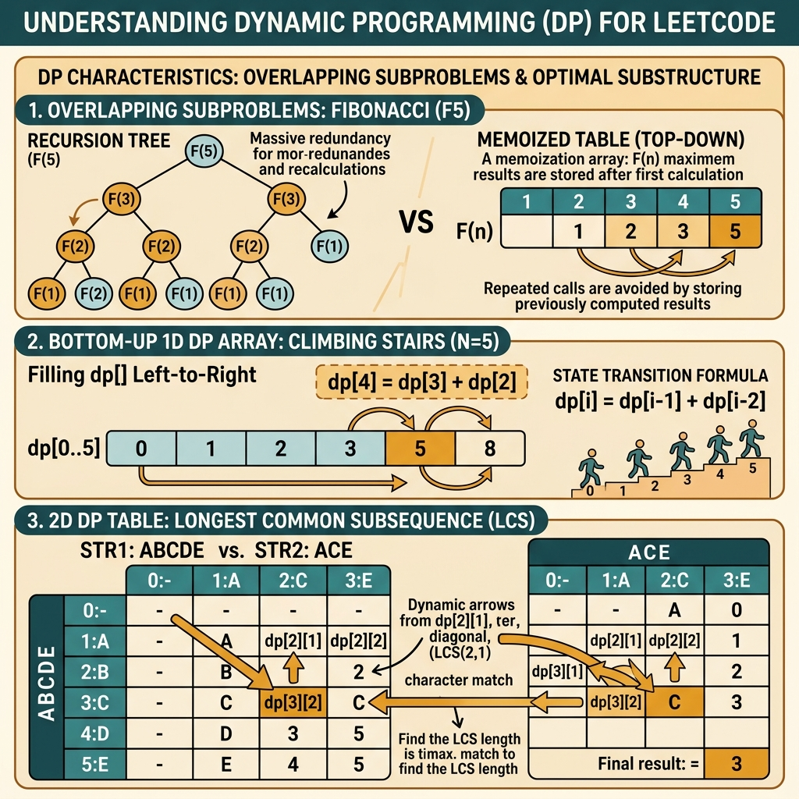

<!-- tags: leetcode, algorithms, coding-interview, dynamic-programming -->
# 📊 Dynamic Programming

> 1D/2D DP, knapsack, LCS, LIS, coin change, house robber — optimize via subproblems

📅 Created: 2026-03-20 · 🔄 Updated: 2026-04-10 · ⏱️ 11 min read

| Aspect         | Detail                                               |
| -------------- | ---------------------------------------------------- |
| **Complexity** | O(n), O(n²), O(n×m) depending on pattern             |
| **Use case**   | Count ways, min/max cost, can partition, subsequence |
| **Go stdlib**  | No specific; `math.MaxInt` for infinity              |
| **LeetCode**   | #5, #62, #70, #139, #152, #198, #300, #322, #1143    |

---

### Interview template

> Copy-paste when encountering this problem type in interviews.

```go
// ── DP Framework ────────────────────────────────────────────────
// 1. STATE:      dp[i] = ?
// 2. TRANSITION: dp[i] = f(dp[i-1], dp[i-2], ...)
// 3. BASE CASE:  dp[0] = ?, dp[1] = ?
// 4. ORDER:      left→right / right→left
// 5. ANSWER:     dp[n] or max(dp)

// ── 1D DP (e.g. House Robber) ───────────────────────────────────
dp := make([]int, n+1)
dp[0], dp[1] = 0, nums[0]
for i := 2; i <= n; i++ {
    dp[i] = max(dp[i-1], dp[i-2]+nums[i-1])
}
return dp[n]

// ── 0/1 Knapsack (iterate BACKWARDS) ───────────────────────────
dp := make([]int, W+1)
for _, item := range items {
    for w := W; w >= item.weight; w-- {    // ← backwards!
        dp[w] = max(dp[w], dp[w-item.weight]+item.value)
    }
}
```
```typescript
// ── DP Framework ────────────────────────────────────────────────
// 1. STATE:      dp[i] = ?
// 2. TRANSITION: dp[i] = f(dp[i - 1], dp[i - 2], ...)
// 3. BASE CASE:  dp[0] = ?, dp[1] = ?
// 4. ORDER:      left -> right / right -> left
// 5. ANSWER:     dp[n] or Math.max(...dp)

// ── 1D DP (e.g. House Robber) ───────────────────────────────────
const dp = Array.from({ length: n + 1 }, () => 0);
dp[0] = 0;
dp[1] = nums[0];
for (let i = 2; i <= n; i++) {
    dp[i] = Math.max(dp[i - 1], dp[i - 2] + nums[i - 1]);
}
return dp[n];

// ── 0/1 Knapsack (iterate BACKWARDS) ────────────────────────────
const best = Array.from({ length: W + 1 }, () => 0);
for (const item of items) {
    for (let w = W; w >= item.weight; w--) {
        best[w] = Math.max(best[w], best[w - item.weight] + item.value);
    }
}
```
```rust
// ── DP Framework ────────────────────────────────────────────────
// 1. STATE:      dp[i] = ?
// 2. TRANSITION: dp[i] = f(dp[i - 1], dp[i - 2], ...)
// 3. BASE CASE:  dp[0] = ?, dp[1] = ?
// 4. ORDER:      left -> right / right -> left
// 5. ANSWER:     dp[n] or *dp.iter().max().unwrap()

// ── 1D DP (e.g. House Robber) ───────────────────────────────────
let mut dp = vec![0; n + 1];
dp[0] = 0;
dp[1] = nums[0];
for i in 2..=n {
    dp[i] = dp[i - 1].max(dp[i - 2] + nums[i - 1]);
}
return dp[n];

// ── 0/1 Knapsack (iterate BACKWARDS) ────────────────────────────
let mut best = vec![0; w + 1];
for item in &items {
    for capacity in (item.weight..=w).rev() {
        best[capacity] = best[capacity].max(best[capacity - item.weight] + item.value);
    }
}
```
```cpp
// ── DP Framework ────────────────────────────────────────────────
// 1. STATE:      dp[i] = ?
// 2. TRANSITION: dp[i] = f(dp[i - 1], dp[i - 2], ...)
// 3. BASE CASE:  dp[0] = ?, dp[1] = ?
// 4. ORDER:      left -> right / right -> left
// 5. ANSWER:     dp[n] or *max_element(dp.begin(), dp.end())

// ── 1D DP (e.g. House Robber) ───────────────────────────────────
std::vector<int> dp(n + 1, 0);
dp[0] = 0;
dp[1] = nums[0];
for (int i = 2; i <= n; ++i) {
    dp[i] = std::max(dp[i - 1], dp[i - 2] + nums[i - 1]);
}
return dp[n];

// ── 0/1 Knapsack (iterate BACKWARDS) ────────────────────────────
std::vector<int> best(W + 1, 0);
for (const auto& item : items) {
    for (int capacity = W; capacity >= item.weight; --capacity) {
        best[capacity] = std::max(best[capacity], best[capacity - item.weight] + item.value);
    }
}
```
```python
# ── DP Framework ────────────────────────────────────────────────
# 1. STATE:      dp[i] = ?
# 2. TRANSITION: dp[i] = f(dp[i - 1], dp[i - 2], ...)
# 3. BASE CASE:  dp[0] = ?, dp[1] = ?
# 4. ORDER:      left -> right / right -> left
# 5. ANSWER:     dp[n] or max(dp)

# ── 1D DP (e.g. House Robber) ───────────────────────────────────
dp = [0] * (n + 1)
dp[0] = 0
dp[1] = nums[0]
for i in range(2, n + 1):
    dp[i] = max(dp[i - 1], dp[i - 2] + nums[i - 1])
return dp[n]

# ── 0/1 Knapsack (iterate BACKWARDS) ────────────────────────────
best = [0] * (W + 1)
for item in items:
    for capacity in range(W, item.weight - 1, -1):
        best[capacity] = max(best[capacity], best[capacity - item.weight] + item.value)
```

---

## 1. DEFINE

Imagine you are in a LeetCode practice session. The problem looks very familiar. 📊 Dynamic Programming is truly useful when it pulls you out of memory-based solving. It helps you recognize the correct family signal early.

`Dynamic Programming` in LeetCode rarely comes with a clear sign. It often appears as a natural recursion. Sometimes it asks for a total count. Other times it looks like a greedy optimization but fails on hidden cases. This family starts when you notice repeated subproblems.

The interview does not need you to memorize formulas. It requires you to clearly describe the state, transition, base case, and fill order. Without one of these four elements, you only write a matrix without real reasoning.

Core insight: **DP starts when you lock a state representing the subproblem and define a transition reading only from stable states.**

| Variant | When to use | Key idea |
| ------- | ------- | ------- |
| 1D DP | Fibonacci, House Robber, stock, decode ways | `dp[i]` describes the best answer up to index `i` |
| 2D DP | LCS, edit distance, grid path | State needs two dimensions for prefix or grid cell |
| Knapsack-style DP | Pick / do not pick item | Transition depends on remaining capacity or budget |
| Sequence DP | LIS, palindrome, subsequence | State links to index or boundary pair on string |

| Approach | Time | Space | When to choose |
|---|----------|-----|---------|
| Bottom-up tabulation | By state graph | By table | Use when fill order is clear and easy to trace |
| Top-down memoization | By reachable states | States + recursion | Use when state graph is sparse or transition is naturally recursive |
| State compression | Reduce O(n²) to O(n) or O(1) | Less than full table | Use when each state depends on few previous rows or columns |
| Knapsack backward iteration | O(nW) | O(W) | Use when you cannot reuse the same item |

### 1.1 Quick identification

- The problem asks for `count ways`, `min cost`, `max profit`, `can partition`, `longest subsequence`.
- Recursion encounters repeating branches.
- DP is likely if you can describe the main problem using finite repeated subproblems.
- You must quickly distinguish 1D, 2D, interval, knapsack, and sequence DP.

### 1.2 Invariants & Failure Modes

- State must have a precise meaning. Otherwise, transitions become blind formula copying.
- Fill order must ensure all dependencies are ready before use.
- Common failure mode: You design a correct recursion but fail to prove the DP matrix stores the same semantic meaning.

## 2. VISUAL

DP divides into four sub-families based on state structure. The diagram below classifies them quickly. You must know the group before defining the state.

### Overview — Dynamic Programming



*Caption: DP = state + transition + base case + fill order. If one fails, the DP table is just meaningless numbers.*

### Level 1 — Core intuition

```text
House Robber
nums = [2, 7, 9, 3, 1]

state:
dp[i] = max money using first i houses

choice at i:
- skip house i      -> dp[i-1]
- rob house i       -> dp[i-2] + nums[i]
```

*Caption*: Level 1 of DP must expose the core choice between competing states. Do not just draw a data table.

### Level 2 — Decision trace

- Define the state before thinking about code.
- Write the transition so each branch corresponds to a valid problem choice.
- Finalize the base case and fill order. The current state must only read from existing states.
- If you cannot explain the meaning of a `dp[...]` cell, that state is wrong or vague.

The DP table shows the state transition. Now the code will implement the exact fill order. This is the easiest place to make mistakes in DP.

## 3. CODE

Code becomes mechanical once the state is locked. We move from base recursion to tabulation and important state compression variants.

### Problem 1: Basic — 1D DP [LC #70, #198, #746]
> **Goal**: Fibonacci-like DP, space optimization
> **Approach**: State definition, base cases
> **Example**: Input is a clear state transition. Output is the optimal value or count via recurrence.
> **Complexity**: O(n) time, O(1) space

```go
// leetcode/dp_basic.go
package leetcode

// ✅ LC #70: Climbing Stairs
// dp[i] = dp[i-1] + dp[i-2] (Fibonacci)
// Time: O(n), Space: O(1) — space optimization
func climbStairs(n int) int {
    if n <= 2 {
        return n
    }

    prev2, prev1 := 1, 2 // dp[1]=1, dp[2]=2
    for i := 3; i <= n; i++ {
        curr := prev1 + prev2
        prev2 = prev1
        prev1 = curr
    }

    return prev1
}

// ✅ LC #198: House Robber
// dp[i] = max(dp[i-1], dp[i-2] + nums[i])
// "Rob house i" or "Skip house i"
// Time: O(n), Space: O(1)
func rob(nums []int) int {
    if len(nums) == 0 {
        return 0
    }
    if len(nums) == 1 {
        return nums[0]
    }

    prev2, prev1 := 0, 0

    for _, num := range nums {
        curr := prev1
        if prev2+num > curr {
            curr = prev2 + num
        }
        prev2 = prev1
        prev1 = curr
    }

    return prev1
}

// ✅ LC #746: Min Cost Climbing Stairs
// dp[i] = min(dp[i-1], dp[i-2]) + cost[i]
// Time: O(n), Space: O(1)
func minCostClimbingStairs(cost []int) int {
    prev2, prev1 := cost[0], cost[1]

    for i := 2; i < len(cost); i++ {
        curr := cost[i]
        if prev1 < prev2 {
            curr += prev1
        } else {
            curr += prev2
        }
        prev2 = prev1
        prev1 = curr
    }

    if prev1 < prev2 {
        return prev1
    }
    return prev2
}

// ✅ LC #152: Maximum Product Subarray
// Track BOTH max AND min (negative × negative = positive)
// Time: O(n), Space: O(1)
func maxProduct(nums []int) int {
    result := nums[0]
    curMax, curMin := 1, 1

    for _, num := range nums {
        // ⚠️ Negative flips max/min
        if num < 0 {
            curMax, curMin = curMin, curMax
        }

        if num > curMax*num {
            curMax = num
        } else {
            curMax = curMax * num
        }
        if num < curMin*num {
            curMin = num
        } else {
            curMin = curMin * num
        }

        if curMax > result {
            result = curMax
        }
    }

    return result
}
```
```typescript
// leetcode/dp_basic.ts
export function climbStairs(n: number): number {
    if (n <= 2) return n;
    let prev2 = 1;
    let prev1 = 2;
    for (let i = 3; i <= n; i++) {
        const curr = prev1 + prev2;
        prev2 = prev1;
        prev1 = curr;
    }
    return prev1;
}

export function rob(nums: number[]): number {
    let prev2 = 0;
    let prev1 = 0;
    for (const num of nums) {
        const curr = Math.max(prev1, prev2 + num);
        prev2 = prev1;
        prev1 = curr;
    }
    return prev1;
}

export function minCostClimbingStairs(cost: number[]): number {
    let prev2 = cost[0];
    let prev1 = cost[1];
    for (let i = 2; i < cost.length; i++) {
        const curr = cost[i] + Math.min(prev1, prev2);
        prev2 = prev1;
        prev1 = curr;
    }
    return Math.min(prev1, prev2);
}

export function maxProduct(nums: number[]): number {
    let result = nums[0];
    let curMax = 1;
    let curMin = 1;
    for (const num of nums) {
        if (num < 0) [curMax, curMin] = [curMin, curMax];
        curMax = Math.max(num, curMax * num);
        curMin = Math.min(num, curMin * num);
        result = Math.max(result, curMax);
    }
    return result;
}
```
```rust
// leetcode/dp_basic.rs
pub fn climb_stairs(n: i32) -> i32 {
    if n <= 2 {
        return n;
    }
    let (mut prev2, mut prev1) = (1, 2);
    for _ in 3..=n {
        let curr = prev1 + prev2;
        prev2 = prev1;
        prev1 = curr;
    }
    prev1
}

pub fn rob(nums: Vec<i32>) -> i32 {
    let (mut prev2, mut prev1) = (0, 0);
    for num in nums {
        let curr = prev1.max(prev2 + num);
        prev2 = prev1;
        prev1 = curr;
    }
    prev1
}

pub fn min_cost_climbing_stairs(cost: Vec<i32>) -> i32 {
    let (mut prev2, mut prev1) = (cost[0], cost[1]);
    for i in 2..cost.len() {
        let curr = cost[i] + prev1.min(prev2);
        prev2 = prev1;
        prev1 = curr;
    }
    prev1.min(prev2)
}

pub fn max_product(nums: Vec<i32>) -> i32 {
    let mut result = nums[0];
    let (mut cur_max, mut cur_min) = (1, 1);
    for num in nums {
        if num < 0 {
            std::mem::swap(&mut cur_max, &mut cur_min);
        }
        cur_max = num.max(cur_max * num);
        cur_min = num.min(cur_min * num);
        result = result.max(cur_max);
    }
    result
}
```
```cpp
// leetcode/dp_basic.cpp
int climbStairs(int n) {
    if (n <= 2) return n;
    int prev2 = 1;
    int prev1 = 2;
    for (int i = 3; i <= n; ++i) {
        int curr = prev1 + prev2;
        prev2 = prev1;
        prev1 = curr;
    }
    return prev1;
}

int rob(std::vector<int>& nums) {
    int prev2 = 0;
    int prev1 = 0;
    for (int num : nums) {
        int curr = std::max(prev1, prev2 + num);
        prev2 = prev1;
        prev1 = curr;
    }
    return prev1;
}

int minCostClimbingStairs(std::vector<int>& cost) {
    int prev2 = cost[0];
    int prev1 = cost[1];
    for (int i = 2; i < static_cast<int>(cost.size()); ++i) {
        int curr = cost[i] + std::min(prev1, prev2);
        prev2 = prev1;
        prev1 = curr;
    }
    return std::min(prev1, prev2);
}

int maxProduct(std::vector<int>& nums) {
    int result = nums[0];
    int curMax = 1;
    int curMin = 1;
    for (int num : nums) {
        if (num < 0) std::swap(curMax, curMin);
        curMax = std::max(num, curMax * num);
        curMin = std::min(num, curMin * num);
        result = std::max(result, curMax);
    }
    return result;
}
```
```python
# leetcode/dp_basic.py
def climb_stairs(n: int) -> int:
    if n <= 2:
        return n
    prev2, prev1 = 1, 2
    for _ in range(3, n + 1):
        prev2, prev1 = prev1, prev1 + prev2
    return prev1

def rob(nums: list[int]) -> int:
    prev2 = prev1 = 0
    for num in nums:
        prev2, prev1 = prev1, max(prev1, prev2 + num)
    return prev1

def min_cost_climbing_stairs(cost: list[int]) -> int:
    prev2, prev1 = cost[0], cost[1]
    for i in range(2, len(cost)):
        prev2, prev1 = prev1, cost[i] + min(prev1, prev2)
    return min(prev1, prev2)

def max_product(nums: list[int]) -> int:
    result = nums[0]
    cur_max = cur_min = 1
    for num in nums:
        if num < 0:
            cur_max, cur_min = cur_min, cur_max
        cur_max = max(num, cur_max * num)
        cur_min = min(num, cur_min * num)
        result = max(result, cur_max)
    return result
```

> **Why?** DP works because the current state only reads from well-defined and computed states. When state or transition is vague, the `dp` table might run but loses its proof meaning.

> **Conclusion**: This **Basic** example shows how to use `1D DP [LC #70, #198, #746]` to solve LeetCode problems without skipping reasoning. Move to the next example when constraints change or you need stronger optimization.

**✅ Achieved**: 1D DP with O(1) space. We only keep prev1 and prev2 instead of a full array.
**⚠️ Pitfall**: Max product requires tracking the minimum value too. A negative times a negative yields a positive result.

---

### Problem 2: Intermediate — Knapsack & Subsequence [LC #322, #300, #139]
> **Goal**: Unbounded knapsack (coin change), LIS, word break
> **Approach**: 2 knapsack types, patience sort for LIS O(n log n)
> **Example**: Input is a clear state transition. Output is the optimal value or count via recurrence.
> **Complexity**: O(n×amount), O(n²)/O(n log n), O(n×m)

```go
// leetcode/dp_intermediate.go
package leetcode

import "math"

// ✅ LC #322: Coin Change
// Unbounded knapsack — unlimited coins of each type
// dp[amount] = min coins to make amount
// Time: O(n × amount), Space: O(amount)
func coinChange(coins []int, amount int) int {
    dp := make([]int, amount+1)
    for i := 1; i <= amount; i++ {
        dp[i] = math.MaxInt32 // ✅ Initialize impossible
    }

    for i := 1; i <= amount; i++ {
        for _, coin := range coins {
            if coin <= i && dp[i-coin] != math.MaxInt32 {
                if dp[i-coin]+1 < dp[i] {
                    dp[i] = dp[i-coin] + 1
                }
            }
        }
    }

    if dp[amount] == math.MaxInt32 {
        return -1
    }
    return dp[amount]
}

// ✅ LC #300: Longest Increasing Subsequence
// Approach 1: DP O(n²)
// dp[i] = length of LIS ending at index i
func lengthOfLIS(nums []int) int {
    n := len(nums)
    dp := make([]int, n)
    for i := range dp {
        dp[i] = 1 // ✅ Minimum LIS = just itself
    }

    maxLen := 1
    for i := 1; i < n; i++ {
        for j := 0; j < i; j++ {
            if nums[j] < nums[i] {
                if dp[j]+1 > dp[i] {
                    dp[i] = dp[j] + 1
                }
            }
        }
        if dp[i] > maxLen {
            maxLen = dp[i]
        }
    }

    return maxLen
}

// ✅ LC #300: LIS — Optimized O(n log n) with binary search
// Maintain sorted "tails" array
func lengthOfLISOptimal(nums []int) int {
    tails := []int{} // ✅ tails[i] = smallest tail of all IS of length i+1

    for _, num := range nums {
        // ✅ Binary search: find first tail >= num
        lo, hi := 0, len(tails)
        for lo < hi {
            mid := lo + (hi-lo)/2
            if tails[mid] < num {
                lo = mid + 1
            } else {
                hi = mid
            }
        }

        if lo == len(tails) {
            tails = append(tails, num) // ✅ Extend LIS
        } else {
            tails[lo] = num // ✅ Replace with smaller value
        }
    }

    return len(tails)
}

// ✅ LC #139: Word Break
// dp[i] = true if s[0:i] can be segmented into dict words
// Time: O(n² × m), Space: O(n)
func wordBreak(s string, wordDict []string) bool {
    wordSet := make(map[string]bool)
    for _, w := range wordDict {
        wordSet[w] = true
    }

    dp := make([]bool, len(s)+1)
    dp[0] = true // ✅ Empty string

    for i := 1; i <= len(s); i++ {
        for j := 0; j < i; j++ {
            if dp[j] && wordSet[s[j:i]] {
                dp[i] = true
                break // ✅ Found valid segmentation
            }
        }
    }

    return dp[len(s)]
}
```
```typescript
// leetcode/dp_intermediate.ts
export function coinChange(coins: number[], amount: number): number {
    const dp = Array.from({ length: amount + 1 }, () => Infinity);
    dp[0] = 0;
    for (let value = 1; value <= amount; value++) {
        for (const coin of coins) {
            if (coin <= value) dp[value] = Math.min(dp[value], dp[value - coin] + 1);
        }
    }
    return Number.isFinite(dp[amount]) ? dp[amount] : -1;
}

export function lengthOfLIS(nums: number[]): number {
    const dp = Array.from({ length: nums.length }, () => 1);
    let best = 1;
    for (let i = 1; i < nums.length; i++) {
        for (let j = 0; j < i; j++) {
            if (nums[j] < nums[i]) dp[i] = Math.max(dp[i], dp[j] + 1);
        }
        best = Math.max(best, dp[i]);
    }
    return best;
}

export function lengthOfLISOptimal(nums: number[]): number {
    const tails: number[] = [];
    for (const num of nums) {
        let lo = 0;
        let hi = tails.length;
        while (lo < hi) {
            const mid = lo + ((hi - lo) >> 1);
            if (tails[mid] < num) lo = mid + 1;
            else hi = mid;
        }
        if (lo === tails.length) tails.push(num);
        else tails[lo] = num;
    }
    return tails.length;
}

export function wordBreak(s: string, wordDict: string[]): boolean {
    const words = new Set(wordDict);
    const dp = Array.from({ length: s.length + 1 }, () => false);
    dp[0] = true;
    for (let i = 1; i <= s.length; i++) {
        for (let j = 0; j < i; j++) {
            if (dp[j] && words.has(s.slice(j, i))) {
                dp[i] = true;
                break;
            }
        }
    }
    return dp[s.length];
}
```
```rust
// leetcode/dp_intermediate.rs
use std::collections::HashSet;

pub fn coin_change(coins: Vec<i32>, amount: i32) -> i32 {
    let mut dp = vec![i32::MAX / 2; amount as usize + 1];
    dp[0] = 0;
    for value in 1..=amount as usize {
        for &coin in &coins {
            let coin = coin as usize;
            if coin <= value {
                dp[value] = dp[value].min(dp[value - coin] + 1);
            }
        }
    }
    if dp[amount as usize] >= i32::MAX / 4 { -1 } else { dp[amount as usize] }
}

pub fn length_of_lis(nums: Vec<i32>) -> i32 {
    let mut dp = vec![1; nums.len()];
    let mut best = 1;
    for i in 1..nums.len() {
        for j in 0..i {
            if nums[j] < nums[i] {
                dp[i] = dp[i].max(dp[j] + 1);
            }
        }
        best = best.max(dp[i]);
    }
    best
}

pub fn length_of_lis_optimal(nums: Vec<i32>) -> i32 {
    let mut tails: Vec<i32> = Vec::new();
    for num in nums {
        match tails.binary_search(&num) {
            Ok(idx) => tails[idx] = num,
            Err(idx) => {
                if idx == tails.len() { tails.push(num); }
                else { tails[idx] = num; }
            }
        }
    }
    tails.len() as i32
}

pub fn word_break(s: String, word_dict: Vec<String>) -> bool {
    let words: HashSet<String> = word_dict.into_iter().collect();
    let mut dp = vec![false; s.len() + 1];
    dp[0] = true;
    for i in 1..=s.len() {
        for j in 0..i {
            if dp[j] && words.contains(&s[j..i].to_string()) {
                dp[i] = true;
                break;
            }
        }
    }
    dp[s.len()]
}
```
```cpp
// leetcode/dp_intermediate.cpp
int coinChange(std::vector<int>& coins, int amount) {
    std::vector<int> dp(amount + 1, amount + 1);
    dp[0] = 0;
    for (int value = 1; value <= amount; ++value) {
        for (int coin : coins) {
            if (coin <= value) dp[value] = std::min(dp[value], dp[value - coin] + 1);
        }
    }
    return dp[amount] > amount ? -1 : dp[amount];
}

int lengthOfLIS(std::vector<int>& nums) {
    std::vector<int> dp(nums.size(), 1);
    int best = 1;
    for (int i = 1; i < static_cast<int>(nums.size()); ++i) {
        for (int j = 0; j < i; ++j) {
            if (nums[j] < nums[i]) dp[i] = std::max(dp[i], dp[j] + 1);
        }
        best = std::max(best, dp[i]);
    }
    return best;
}

int lengthOfLISOptimal(std::vector<int>& nums) {
    std::vector<int> tails;
    for (int num : nums) {
        auto it = std::lower_bound(tails.begin(), tails.end(), num);
        if (it == tails.end()) tails.push_back(num);
        else *it = num;
    }
    return static_cast<int>(tails.size());
}

bool wordBreak(std::string s, std::vector<std::string>& wordDict) {
    std::unordered_set<std::string> words(wordDict.begin(), wordDict.end());
    std::vector<bool> dp(s.size() + 1, false);
    dp[0] = true;
    for (int i = 1; i <= static_cast<int>(s.size()); ++i) {
        for (int j = 0; j < i; ++j) {
            if (dp[j] && words.count(s.substr(j, i - j))) {
                dp[i] = true;
                break;
            }
        }
    }
    return dp[s.size()];
}
```
```python
# leetcode/dp_intermediate.py
def coin_change(coins: list[int], amount: int) -> int:
    dp = [float("inf")] * (amount + 1)
    dp[0] = 0
    for value in range(1, amount + 1):
        for coin in coins:
            if coin <= value:
                dp[value] = min(dp[value], dp[value - coin] + 1)
    return -1 if dp[amount] == float("inf") else dp[amount]

def length_of_lis(nums: list[int]) -> int:
    dp = [1] * len(nums)
    best = 1
    for i in range(1, len(nums)):
        for j in range(i):
            if nums[j] < nums[i]:
                dp[i] = max(dp[i], dp[j] + 1)
        best = max(best, dp[i])
    return best

def length_of_lis_optimal(nums: list[int]) -> int:
    import bisect

    tails: list[int] = []
    for num in nums:
        idx = bisect.bisect_left(tails, num)
        if idx == len(tails):
            tails.append(num)
        else:
            tails[idx] = num
    return len(tails)

def word_break(s: str, word_dict: list[str]) -> bool:
    words = set(word_dict)
    dp = [False] * (len(s) + 1)
    dp[0] = True
    for i in range(1, len(s) + 1):
        for j in range(i):
            if dp[j] and s[j:i] in words:
                dp[i] = True
                break
    return dp[-1]
```

> **Why?** DP works because the current state only reads from well-defined and computed states. When state or transition is vague, the `dp` table might run but loses its proof meaning.

> **Conclusion**: This **Intermediate** example shows how to use `Knapsack & Subsequence [LC #322, #300, #139]` to solve LeetCode problems without skipping reasoning. Move to the next example when constraints change or you need stronger optimization.

**✅ Achieved**: Coin change (unbounded knapsack), LIS (O(n²) and O(n log n)), word break.
**⚠️ Pitfall**: LIS O(n log n) uses binary search on the tails array. The tails array is NOT the actual LIS.

---

### Problem 3: Advanced — 2D DP [LC #62, #1143, #5]
> **Goal**: Grid DP, LCS, longest palindromic substring
> **Approach**: 2D table, interval DP
> **Example**: Input is a clear state transition. Output is the optimal value or count via recurrence.
> **Complexity**: O(m×n) grid/LCS, O(n²) palindrome

```go
// leetcode/dp_advanced.go
package leetcode

// ✅ LC #62: Unique Paths
// dp[i][j] = dp[i-1][j] + dp[i][j-1]
// Time: O(m×n), Space: O(n) — 1D optimization
func uniquePaths(m, n int) int {
    dp := make([]int, n)
    for i := range dp {
        dp[i] = 1 // ✅ First row = all 1s
    }

    for i := 1; i < m; i++ {
        for j := 1; j < n; j++ {
            dp[j] += dp[j-1] // ✅ dp[j] (above) + dp[j-1] (left)
        }
    }

    return dp[n-1]
}

// ✅ LC #1143: Longest Common Subsequence
// dp[i][j] = LCS of text1[0:i] and text2[0:j]
// Time: O(m×n), Space: O(m×n) — can optimize to O(n)
func longestCommonSubsequence(text1, text2 string) int {
    m, n := len(text1), len(text2)
    dp := make([][]int, m+1)
    for i := range dp {
        dp[i] = make([]int, n+1)
    }

    for i := 1; i <= m; i++ {
        for j := 1; j <= n; j++ {
            if text1[i-1] == text2[j-1] {
                dp[i][j] = dp[i-1][j-1] + 1 // ✅ Match: extend
            } else {
                dp[i][j] = dp[i-1][j]
                if dp[i][j-1] > dp[i][j] {
                    dp[i][j] = dp[i][j-1] // ✅ No match: max(skip one)
                }
            }
        }
    }

    return dp[m][n]
}

// ✅ LC #5: Longest Palindromic Substring
// Approach: Expand around center (simpler than DP)
// Time: O(n²), Space: O(1)
func longestPalindrome(s string) string {
    start, maxLen := 0, 1

    expand := func(l, r int) {
        for l >= 0 && r < len(s) && s[l] == s[r] {
            if r-l+1 > maxLen {
                start = l
                maxLen = r - l + 1
            }
            l--
            r++
        }
    }

    for i := 0; i < len(s); i++ {
        expand(i, i)   // ✅ Odd length palindrome
        expand(i, i+1) // ✅ Even length palindrome
    }

    return s[start : start+maxLen]
}

// ✅ LC #416: Partition Equal Subset Sum (0/1 Knapsack)
// Can partition nums into 2 subsets with equal sum?
// dp[j] = true if sum j is achievable
// Time: O(n × sum/2), Space: O(sum/2)
func canPartition(nums []int) bool {
    total := 0
    for _, n := range nums {
        total += n
    }
    if total%2 != 0 {
        return false // ⚠️ Odd sum → impossible
    }

    target := total / 2
    dp := make([]bool, target+1)
    dp[0] = true

    for _, num := range nums {
        // ⚠️ Iterate BACKWARDS to avoid using same item twice (0/1 knapsack)
        for j := target; j >= num; j-- {
            dp[j] = dp[j] || dp[j-num]
        }
    }

    return dp[target]
}
```
```typescript
// leetcode/dp_advanced.ts
export function uniquePaths(m: number, n: number): number {
    const dp = Array.from({ length: n }, () => 1);
    for (let row = 1; row < m; row++) {
        for (let col = 1; col < n; col++) dp[col] += dp[col - 1];
    }
    return dp[n - 1];
}

export function longestCommonSubsequence(text1: string, text2: string): number {
    const dp = Array.from({ length: text1.length + 1 }, () =>
        Array.from({ length: text2.length + 1 }, () => 0),
    );
    for (let i = 1; i <= text1.length; i++) {
        for (let j = 1; j <= text2.length; j++) {
            if (text1[i - 1] === text2[j - 1]) dp[i][j] = dp[i - 1][j - 1] + 1;
            else dp[i][j] = Math.max(dp[i - 1][j], dp[i][j - 1]);
        }
    }
    return dp[text1.length][text2.length];
}

export function longestPalindrome(s: string): string {
    let start = 0;
    let maxLen = 1;
    const expand = (left: number, right: number) => {
        while (left >= 0 && right < s.length && s[left] === s[right]) {
            if (right - left + 1 > maxLen) {
                start = left;
                maxLen = right - left + 1;
            }
            left--;
            right++;
        }
    };
    for (let i = 0; i < s.length; i++) {
        expand(i, i);
        expand(i, i + 1);
    }
    return s.slice(start, start + maxLen);
}

export function canPartition(nums: number[]): boolean {
    const total = nums.reduce((sum, num) => sum + num, 0);
    if (total % 2 !== 0) return false;
    const target = total / 2;
    const dp = Array.from({ length: target + 1 }, () => false);
    dp[0] = true;
    for (const num of nums) {
        for (let sum = target; sum >= num; sum--) {
            dp[sum] = dp[sum] || dp[sum - num];
        }
    }
    return dp[target];
}
```
```rust
// leetcode/dp_advanced.rs
pub fn unique_paths(m: i32, n: i32) -> i32 {
    let mut dp = vec![1; n as usize];
    for _ in 1..m {
        for col in 1..n as usize {
            dp[col] += dp[col - 1];
        }
    }
    dp[n as usize - 1]
}

pub fn longest_common_subsequence(text1: String, text2: String) -> i32 {
    let a = text1.as_bytes();
    let b = text2.as_bytes();
    let mut dp = vec![vec![0; b.len() + 1]; a.len() + 1];
    for i in 1..=a.len() {
        for j in 1..=b.len() {
            if a[i - 1] == b[j - 1] {
                dp[i][j] = dp[i - 1][j - 1] + 1;
            } else {
                dp[i][j] = dp[i - 1][j].max(dp[i][j - 1]);
            }
        }
    }
    dp[a.len()][b.len()]
}

pub fn longest_palindrome(s: String) -> String {
    let chars: Vec<char> = s.chars().collect();
    let (mut start, mut max_len) = (0usize, 1usize);

    fn expand(chars: &[char], mut left: i32, mut right: i32, start: &mut usize, max_len: &mut usize) {
        while left >= 0
            && (right as usize) < chars.len()
            && chars[left as usize] == chars[right as usize]
        {
            let len = (right - left + 1) as usize;
            if len > *max_len {
                *start = left as usize;
                *max_len = len;
            }
            left -= 1;
            right += 1;
        }
    }

    for i in 0..chars.len() {
        expand(&chars, i as i32, i as i32, &mut start, &mut max_len);
        expand(&chars, i as i32, i as i32 + 1, &mut start, &mut max_len);
    }

    chars[start..start + max_len].iter().collect()
}

pub fn can_partition(nums: Vec<i32>) -> bool {
    let total: i32 = nums.iter().sum();
    if total % 2 != 0 {
        return false;
    }
    let target = (total / 2) as usize;
    let mut dp = vec![false; target + 1];
    dp[0] = true;
    for num in nums {
        let num = num as usize;
        for sum in (num..=target).rev() {
            dp[sum] = dp[sum] || dp[sum - num];
        }
    }
    dp[target]
}
```
```cpp
// leetcode/dp_advanced.cpp
int uniquePaths(int m, int n) {
    std::vector<int> dp(n, 1);
    for (int row = 1; row < m; ++row) {
        for (int col = 1; col < n; ++col) dp[col] += dp[col - 1];
    }
    return dp[n - 1];
}

int longestCommonSubsequence(std::string text1, std::string text2) {
    std::vector<std::vector<int>> dp(
        text1.size() + 1,
        std::vector<int>(text2.size() + 1, 0)
    );
    for (int i = 1; i <= static_cast<int>(text1.size()); ++i) {
        for (int j = 1; j <= static_cast<int>(text2.size()); ++j) {
            if (text1[i - 1] == text2[j - 1]) dp[i][j] = dp[i - 1][j - 1] + 1;
            else dp[i][j] = std::max(dp[i - 1][j], dp[i][j - 1]);
        }
    }
    return dp[text1.size()][text2.size()];
}

std::string longestPalindrome(std::string s) {
    int start = 0;
    int maxLen = 1;
    auto expand = [&](int left, int right) {
        while (left >= 0 && right < static_cast<int>(s.size()) && s[left] == s[right]) {
            if (right - left + 1 > maxLen) {
                start = left;
                maxLen = right - left + 1;
            }
            --left;
            ++right;
        }
    };
    for (int i = 0; i < static_cast<int>(s.size()); ++i) {
        expand(i, i);
        expand(i, i + 1);
    }
    return s.substr(start, maxLen);
}

bool canPartition(std::vector<int>& nums) {
    int total = std::accumulate(nums.begin(), nums.end(), 0);
    if (total % 2 != 0) return false;
    int target = total / 2;
    std::vector<bool> dp(target + 1, false);
    dp[0] = true;
    for (int num : nums) {
        for (int sum = target; sum >= num; --sum) {
            dp[sum] = dp[sum] || dp[sum - num];
        }
    }
    return dp[target];
}
```
```python
# leetcode/dp_advanced.py
def unique_paths(m: int, n: int) -> int:
    dp = [1] * n
    for _ in range(1, m):
        for col in range(1, n):
            dp[col] += dp[col - 1]
    return dp[-1]

def longest_common_subsequence(text1: str, text2: str) -> int:
    dp = [[0] * (len(text2) + 1) for _ in range(len(text1) + 1)]
    for i in range(1, len(text1) + 1):
        for j in range(1, len(text2) + 1):
            if text1[i - 1] == text2[j - 1]:
                dp[i][j] = dp[i - 1][j - 1] + 1
            else:
                dp[i][j] = max(dp[i - 1][j], dp[i][j - 1])
    return dp[-1][-1]

def longest_palindrome(s: str) -> str:
    start = 0
    max_len = 1

    def expand(left: int, right: int) -> None:
        nonlocal start, max_len
        while left >= 0 and right < len(s) and s[left] == s[right]:
            if right - left + 1 > max_len:
                start = left
                max_len = right - left + 1
            left -= 1
            right += 1

    for i in range(len(s)):
        expand(i, i)
        expand(i, i + 1)
    return s[start:start + max_len]

def can_partition(nums: list[int]) -> bool:
    total = sum(nums)
    if total % 2 != 0:
        return False
    target = total // 2
    dp = [False] * (target + 1)
    dp[0] = True
    for num in nums:
        for current in range(target, num - 1, -1):
            dp[current] = dp[current] or dp[current - num]
    return dp[target]
```

> **Why?** DP works because the current state only reads from well-defined and computed states. When state or transition is vague, the `dp` table might run but loses its proof meaning.

> **Conclusion**: This **Advanced** example shows how to use `2D DP [LC #62, #1143, #5]` to solve LeetCode problems without skipping reasoning. Move to the next example when constraints change or you need stronger optimization.

**✅ Achieved**: Unique paths (1D space opt), LCS, palindromic substring, 0/1 knapsack.
**⚠️ Pitfall**: 0/1 knapsack iterates BACKWARDS (j from target to num). Unbounded knapsack iterates FORWARDS.

---

DP code compiles, runs, and returns a number. But is that number correct? These pitfalls are errors that only careful tracing can catch.

## 4. PITFALLS

This family breaks due to wrong state semantics, wrong base cases, or shifted fill orders. It rarely fails due to missing loops.

| # | Severity | Defect | Consequence | Fix |
|---|----------|-----|---------|-----|
| 1 | 🔴 Fatal | 0/1 Knapsack: iterate forwards | Wrong result or TLE | Forwards means unbounded. Backwards means 0/1. |
| 2 | 🟡 Common | Missing base case `dp[0]` | Wrong result or TLE | Set `dp[0]` to 0, 1, or true depending on context. |
| 3 | 🟡 Common | Max product: ignoring min track | Miss negative × negative = positive | Track both min and max simultaneously. |
| 4 | 🔵 Minor | LIS O(n log n): assuming tails is LIS | Fails subsequence extraction | Tails array only stores smallest endings, not actual sequence. |
| 5 | 🔵 Minor | Coin change: initialize `dp[i] = 0` | Every amount returns 0 coins | Initialize with `MaxInt` to represent impossible states. |
| 6 | 🔵 Minor | 2D DP: off-by-one index | Result shifts by one position | `dp[i][j]` often uses 1-index. Strings use 0-index. |
| 7 | 🔵 Minor | Space optimization: bad overwrite | Wrong result when using 1D | Process order must be strictly left-to-right or right-to-left. |

### 🔴 Pitfall #1 — 0/1 Knapsack iterate forwards instead of backwards

Coin change (unbounded) code runs correctly:

```go
for _, coin := range coins {
    for j := coin; j <= amount; j++ {  // forwards → reuse coin = đúng
        dp[j] = min(dp[j], dp[j-coin]+1)
    }
}
```

Copying this exactly for 0/1 knapsack fails. Iterating forwards allows item reuse within the same iteration. This silently turns a 0/1 knapsack into an unbounded one.

**Fix**: 0/1 knapsack must iterate **backwards**: `for j := amount; j >= weight; j--`. Backwards iteration ensures each item is used only once.

---

## 5. REF

| Resource               | Link                                                                                                                  | Difficulty |
| ---------------------- | --------------------------------------------------------------------------------------------------------------------- | ---------- |
| LC #70 Climbing Stairs | [leetcode.com/problems/climbing-stairs](https://leetcode.com/problems/climbing-stairs/)                               | 🟢 Easy    |
| LC #322 Coin Change    | [leetcode.com/problems/coin-change](https://leetcode.com/problems/coin-change/)                                       | 🟡 Medium  |
| LC #300 LIS            | [leetcode.com/problems/longest-increasing-subsequence](https://leetcode.com/problems/longest-increasing-subsequence/) | 🟡 Medium  |
| DP Patterns            | [leetcode.com/discuss/general-discussion/458695](https://leetcode.com/discuss/general-discussion/458695/)             | —          |
| Knapsack Problems      | [leetcode.com/discuss/general-discussion/592146](https://leetcode.com/discuss/general-discussion/592146/)             | —          |

---

## 6. RECOMMEND

When state, transition, base case, and fill order become reflexes, you must split problem types. Some need basic DP. Others step into complex state geometry. A few are actually state machines or sequence-specific recurrences.

| Extension | When to use | Rationale | File/Link |
| ------- | ------- | ----- | --------- |
| Advanced DP | Edit distance, regex, interval | Upgrade from 1D/2D to complex states | [18-advanced-dp](./18-advanced-dp.md) |
| Buy & Sell Stock | State machine DP | Specific DP applications | [17-buy-sell-stock](./17-buy-sell-stock.md) |
| DP Sequences | Kadane, palindrome, target sum | DP on sequence or string | [23-dp-sequences](./23-dp-sequences.md) |
| Greedy & Intervals | When greedy suffices, DP is overkill | Compare approaches | [08-greedy-intervals](./08-greedy-intervals.md) |

---

## 7. QUICK REF

| Situation / Signal | Pattern / Approach | Complexity | When to use | Warning |
|--------------------|--------------------|------------|----------|----------|
| count ways or min cost | 1D DP (Fibonacci-like) | O(n) · O(1) | Climbing stairs, house robber | Space optimize: only keep prev1, prev2 |
| two sequences or grid path | 2D DP | O(n×m) · O(n×m) | LCS, edit distance, unique paths | 1-indexed: `dp[0][*]` and `dp[*][0]` are base cases |
| pick/skip item plus capacity | 0/1 Knapsack (backward) | O(n×W) · O(W) | Partition equal subset, target sum | Iterate backward to avoid item reuse |
| unlimited coins or items | Unbounded Knapsack (forward) | O(n×W) · O(W) | Coin change, unbounded supply | Iterate forward to allow reuse |
| longest increasing | LIS (binary search) | O(n log n) · O(n) | Patience sort, envelope nesting | Tails array is not the actual subsequence |
| word segmentation | String DP plus dictionary | O(n²×m) · O(n) | Word break, palindrome partition | Use a set instead of a list for O(1) lookup |

---

Return to the initial "count ways / min cost" question. Now you know that correct DP is not about the recurrence. It is about state definition and fill order. If one fails, the DP matrix is just meaningless numbers.

---

**Links**: [← Graph BFS/DFS](./06-graph-bfs-dfs.md) · [→ Greedy & Intervals](./08-greedy-intervals.md)
