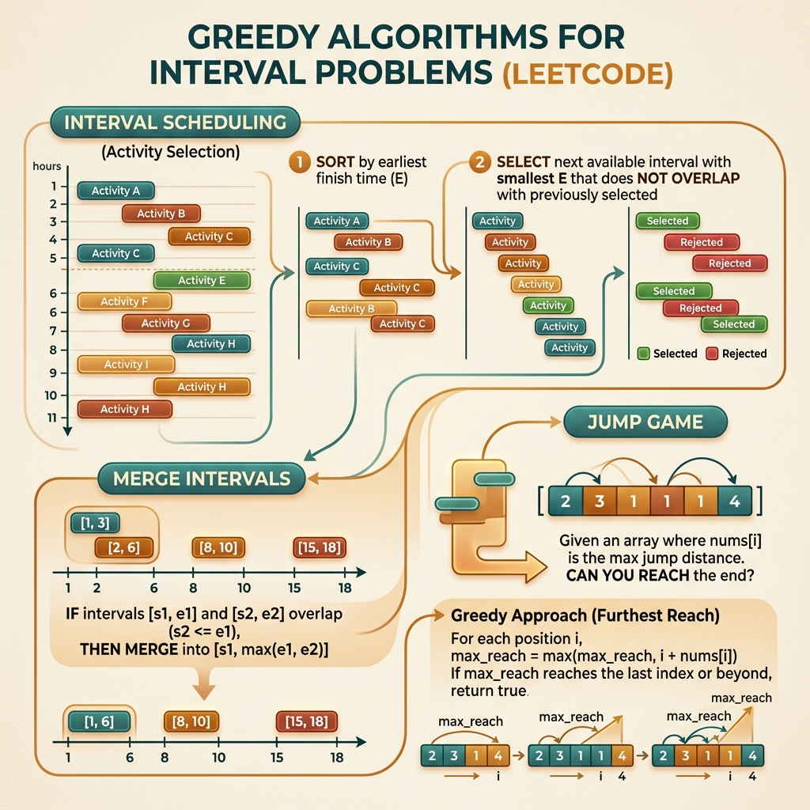

<!-- tags: leetcode, algorithms, coding-interview, greedy, intervals -->
# 🎯 Greedy & Intervals

> Greedy choice property — choose local optimal to reach global optimal, interval scheduling

📅 Created: 2026-03-20 · 🔄 Updated: 2026-04-10 · ⏱️ 10 min read

| Aspect         | Detail                                      |
| -------------- | ------------------------------------------- |
| **Complexity** | O(n log n) sorting + O(n) greedy            |
| **Use case**   | Scheduling, optimization, interval problems |
| **Go stdlib**  | `sort.Slice`, `sort.Ints`                   |
| **LeetCode**   | #45, #55, #56, #57, #134, #435, #621, #763  |

---

### Interview template

> Copy-paste when encountering this problem type in interviews.

```go
// ── Merge Intervals ─────────────────────────────────────────────
sort.Slice(intervals, func(i, j int) bool {
    return intervals[i][0] < intervals[j][0]
})
result := [][]int{intervals[0]}
for _, iv := range intervals[1:] {
    last := result[len(result)-1]
    if iv[0] <= last[1] {
        last[1] = max(last[1], iv[1])   // merge
    } else {
        result = append(result, iv)     // new interval
    }
}

// ── Activity Selection (max non-overlapping) ────────────────────
sort.Slice(intervals, func(i, j int) bool {
    return intervals[i][1] < intervals[j][1]   // sort by END
})
count, lastEnd := 0, math.MinInt
for _, iv := range intervals {
    if iv[0] >= lastEnd { count++; lastEnd = iv[1] }
}
```
```typescript
// ── Merge Intervals ─────────────────────────────────────────────
intervals.sort((a, b) => a[0] - b[0]);
const result: number[][] = [intervals[0]];
for (const interval of intervals.slice(1)) {
    const last = result[result.length - 1];
    if (interval[0] <= last[1]) last[1] = Math.max(last[1], interval[1]);
    else result.push([...interval]);
}

// ── Activity Selection (max non-overlapping) ────────────────────
intervals.sort((a, b) => a[1] - b[1]);
let count = 0;
let lastEnd = Number.NEGATIVE_INFINITY;
for (const interval of intervals) {
    if (interval[0] >= lastEnd) {
        count++;
        lastEnd = interval[1];
    }
}
```
```rust
// ── Merge Intervals ─────────────────────────────────────────────
intervals.sort_by_key(|iv| iv[0]);
let mut result = vec![intervals[0].clone()];
for interval in intervals.into_iter().skip(1) {
    let last = result.last_mut().unwrap();
    if interval[0] <= last[1] {
        last[1] = last[1].max(interval[1]);
    } else {
        result.push(interval);
    }
}

// ── Activity Selection (max non-overlapping) ────────────────────
intervals.sort_by_key(|iv| iv[1]);
let mut count = 0;
let mut last_end = i32::MIN;
for interval in intervals {
    if interval[0] >= last_end {
        count += 1;
        last_end = interval[1];
    }
}
```
```cpp
// ── Merge Intervals ─────────────────────────────────────────────
std::sort(intervals.begin(), intervals.end());
std::vector<std::vector<int>> result{intervals[0]};
for (int i = 1; i < static_cast<int>(intervals.size()); ++i) {
    auto& last = result.back();
    if (intervals[i][0] <= last[1]) last[1] = std::max(last[1], intervals[i][1]);
    else result.push_back(intervals[i]);
}

// ── Activity Selection (max non-overlapping) ────────────────────
std::sort(intervals.begin(), intervals.end(), [](const auto& a, const auto& b) {
    return a[1] < b[1];
});
int count = 0;
int lastEnd = INT_MIN;
for (const auto& interval : intervals) {
    if (interval[0] >= lastEnd) {
        ++count;
        lastEnd = interval[1];
    }
}
```
```python
# ── Merge Intervals ─────────────────────────────────────────────
intervals.sort(key=lambda iv: iv[0])
result = [intervals[0][:]]
for interval in intervals[1:]:
    last = result[-1]
    if interval[0] <= last[1]:
        last[1] = max(last[1], interval[1])
    else:
        result.append(interval[:])

# ── Activity Selection (max non-overlapping) ────────────────────
intervals.sort(key=lambda iv: iv[1])
count = 0
last_end = float("-inf")
for interval in intervals:
    if interval[0] >= last_end:
        count += 1
        last_end = interval[1]
```

---

## 1. DEFINE

You need a fast family guide to map new problems to old patterns without confusing variants. 🎯 Greedy & Intervals exists for exactly that moment.

Greedy problems often look very convincing on sample inputs. You pick the best local option, the code runs beautifully, and then a hidden test destroys it. `Greedy & Intervals` is the family that makes you stop and ask a core question. Does this local choice protect a global invariant?

Many problems in this family are not hard to code. They are hard because you must prove your current decision leaves the widest future, costs the least, or covers the farthest distance. It cannot just "look reasonable".

Core insight: **Greedy is only correct when the local choice maintains a global invariant strong enough to avoid backtracking.**

| Variant | When to use | Key idea |
| ------- | ------- | ------- |
| Interval merge | Intervals are sorted or sortable | Merge upon overlap. Open a new interval when disconnected. |
| Activity selection | Pick maximum non-overlapping intervals | Sort by `end` time to leave maximum space for the rest. |
| Jump or local choice greedy | Each step needs the best local candidate | Only valid if the local choice preserves the global invariant. |
| Resource scheduling | Meeting rooms, task cooldown | Greedy often pairs with sorting or a heap to manage the frontier. |

| Approach | Time | Space | When to choose |
|---|----------|-----|---------|
| Sort plus merge | O(n log n) | O(n) or O(1) | Use when output requires normalized intervals. |
| Sort by end plus select | O(n log n) | O(1) | Use when the goal is the maximum valid interval count. |
| Greedy with running frontier | O(n) or O(n log n) | O(1) or O(k) | Use when local choices provably preserve optimality. |
| Heap-assisted scheduling | O(n log n) | O(k) | Use when managing multiple concurrent resources. |

### 1.1 Quick identification

- Problem mentions interval scheduling, merge intervals, jump game, gas station, task scheduler, or partition labels.
- You need a local rule provable by an exchange argument or coverage invariant.
- If the local choice lacks a clear global reason, suspect DP or search before trying greedy.

### 1.2 Invariants & Failure Modes

- Every local decision must protect the best future according to the objective.
- Coverage, remaining room, or current best frontier are usually sufficient states.
- Common failure mode: You pick the "smallest/largest" item by intuition without proving why it preserves future optimality.

## 2. VISUAL

Greedy problems split into three groups based on invariants. The image below quickly routes you to the correct approach before scanning details.

### Overview — Greedy & Intervals



*Caption: Greedy works when a local optimal choice leads to a global optimal result. If unprovable, use DP instead.*

### Level 1 — Core intuition

```text
Intervals sorted by end:
[1,3] [2,5] [4,6] [6,7]
  ✓     x     ✓     ✓

Pick earliest ending interval first.
It leaves the most remaining space for future picks.
```

*Caption*: Level 1 shows the essence of interval greedy. The current choice must maximize the remaining space for unprocessed items.

### Level 2 — Decision trace

- Deciding to sort by `start`, `end`, or another metric is the most critical step.
- For merge intervals, the invariant ensures `result.back()` is the correct merged interval for the processed prefix.
- For activity selection, the invariant ensures `lastEnd` of the chosen set remains as small as possible.
- If you cannot explain why a local choice preserves future optimality, your greedy approach lacks proof.

The trace shows how intervals overlap. The code will implement a sort and greedy scan. Deciding to sort by start or end is a life-or-death choice.

## 3. CODE

Code must be concise once the global invariant is locked. We move from interval classics to harder coverage and scheduling variants.

### Problem 1: Basic — Jump Game & Gas Station [LC #55, #45, #134]
> **Goal**: Greedy choice — track farthest reachable
> **Approach**: Greedy reasoning, no DP needed
> **Example**: Input is a typical LeetCode problem. Output is a solution you can copy to practice patterns.
> **Complexity**: O(n) time, O(1) space

```go
// leetcode/greedy_basic.go
package leetcode

// ✅ LC #55: Jump Game — Can reach last index?
// Greedy: Track farthest reachable position
// Time: O(n), Space: O(1)
func canJump(nums []int) bool {
    maxReach := 0

    for i := 0; i < len(nums); i++ {
        if i > maxReach {
            return false // ⚠️ Can't reach this position
        }
        if i+nums[i] > maxReach {
            maxReach = i + nums[i]
        }
        if maxReach >= len(nums)-1 {
            return true // ✅ Can reach end
        }
    }

    return true
}

// ✅ LC #45: Jump Game II — Minimum jumps to reach end
// Greedy: BFS-like — track current jump range
// Time: O(n), Space: O(1)
func jump(nums []int) int {
    jumps := 0
    curEnd := 0  // ✅ Farthest with current jumps
    farthest := 0

    for i := 0; i < len(nums)-1; i++ {
        if i+nums[i] > farthest {
            farthest = i + nums[i]
        }

        if i == curEnd {
            // ✅ Must jump — extend range
            jumps++
            curEnd = farthest

            if curEnd >= len(nums)-1 {
                break
            }
        }
    }

    return jumps
}

// ✅ LC #134: Gas Station
// Greedy: If total gas >= total cost → solution exists
// Start from where cumulative gas-cost resets
// Time: O(n), Space: O(1)
func canCompleteCircuit(gas, cost []int) int {
    totalSurplus := 0
    currentSurplus := 0
    start := 0

    for i := 0; i < len(gas); i++ {
        diff := gas[i] - cost[i]
        totalSurplus += diff
        currentSurplus += diff

        if currentSurplus < 0 {
            // ⚠️ Can't start from [start..i] → try i+1
            start = i + 1
            currentSurplus = 0
        }
    }

    if totalSurplus < 0 {
        return -1 // ⚠️ Not enough gas total
    }
    return start
}
```
```typescript
// leetcode/greedy_basic.ts
export function canJump(nums: number[]): boolean {
    let maxReach = 0;
    for (let i = 0; i < nums.length; i++) {
        if (i > maxReach) return false;
        maxReach = Math.max(maxReach, i + nums[i]);
        if (maxReach >= nums.length - 1) return true;
    }
    return true;
}

export function jump(nums: number[]): number {
    let jumps = 0;
    let curEnd = 0;
    let farthest = 0;
    for (let i = 0; i < nums.length - 1; i++) {
        farthest = Math.max(farthest, i + nums[i]);
        if (i === curEnd) {
            jumps++;
            curEnd = farthest;
        }
    }
    return jumps;
}

export function canCompleteCircuit(gas: number[], cost: number[]): number {
    let totalSurplus = 0;
    let currentSurplus = 0;
    let start = 0;
    for (let i = 0; i < gas.length; i++) {
        const diff = gas[i] - cost[i];
        totalSurplus += diff;
        currentSurplus += diff;
        if (currentSurplus < 0) {
            start = i + 1;
            currentSurplus = 0;
        }
    }
    return totalSurplus < 0 ? -1 : start;
}
```
```rust
// leetcode/greedy_basic.rs
pub fn can_jump(nums: Vec<i32>) -> bool {
    let mut max_reach = 0usize;
    for (idx, &num) in nums.iter().enumerate() {
        if idx > max_reach {
            return false;
        }
        max_reach = max_reach.max(idx + num as usize);
        if max_reach >= nums.len() - 1 {
            return true;
        }
    }
    true
}

pub fn jump(nums: Vec<i32>) -> i32 {
    let (mut jumps, mut cur_end, mut farthest) = (0, 0usize, 0usize);
    for i in 0..nums.len() - 1 {
        farthest = farthest.max(i + nums[i] as usize);
        if i == cur_end {
            jumps += 1;
            cur_end = farthest;
        }
    }
    jumps
}

pub fn can_complete_circuit(gas: Vec<i32>, cost: Vec<i32>) -> i32 {
    let (mut total, mut current, mut start) = (0, 0, 0);
    for i in 0..gas.len() {
        let diff = gas[i] - cost[i];
        total += diff;
        current += diff;
        if current < 0 {
            start = i as i32 + 1;
            current = 0;
        }
    }
    if total < 0 { -1 } else { start }
}
```
```cpp
// leetcode/greedy_basic.cpp
bool canJump(std::vector<int>& nums) {
    int maxReach = 0;
    for (int i = 0; i < static_cast<int>(nums.size()); ++i) {
        if (i > maxReach) return false;
        maxReach = std::max(maxReach, i + nums[i]);
        if (maxReach >= static_cast<int>(nums.size()) - 1) return true;
    }
    return true;
}

int jump(std::vector<int>& nums) {
    int jumps = 0;
    int curEnd = 0;
    int farthest = 0;
    for (int i = 0; i < static_cast<int>(nums.size()) - 1; ++i) {
        farthest = std::max(farthest, i + nums[i]);
        if (i == curEnd) {
            ++jumps;
            curEnd = farthest;
        }
    }
    return jumps;
}

int canCompleteCircuit(std::vector<int>& gas, std::vector<int>& cost) {
    int totalSurplus = 0;
    int currentSurplus = 0;
    int start = 0;
    for (int i = 0; i < static_cast<int>(gas.size()); ++i) {
        int diff = gas[i] - cost[i];
        totalSurplus += diff;
        currentSurplus += diff;
        if (currentSurplus < 0) {
            start = i + 1;
            currentSurplus = 0;
        }
    }
    return totalSurplus < 0 ? -1 : start;
}
```
```python
# leetcode/greedy_basic.py
def can_jump(nums: list[int]) -> bool:
    max_reach = 0
    for i, num in enumerate(nums):
        if i > max_reach:
            return False
        max_reach = max(max_reach, i + num)
        if max_reach >= len(nums) - 1:
            return True
    return True

def jump(nums: list[int]) -> int:
    jumps = cur_end = farthest = 0
    for i in range(len(nums) - 1):
        farthest = max(farthest, i + nums[i])
        if i == cur_end:
            jumps += 1
            cur_end = farthest
    return jumps

def can_complete_circuit(gas: list[int], cost: list[int]) -> int:
    total_surplus = current_surplus = start = 0
    for i in range(len(gas)):
        diff = gas[i] - cost[i]
        total_surplus += diff
        current_surplus += diff
        if current_surplus < 0:
            start = i + 1
            current_surplus = 0
    return -1 if total_surplus < 0 else start
```

> **Why?** Greedy is only reliable when the local choice preserves a global invariant. For intervals, the sort key and tracking variables dictate the optimality proof.

> **Conclusion**: This **Basic** example shows how to use `Jump Game & Gas Station [LC #55, #45, #134]` to solve LeetCode problems without skipping reasoning. Move to the next example when constraints change or you need stronger optimization.

**✅ Achieved**: Jump game O(n), gas station with greedy reset.
**⚠️ Pitfall**: LC #134 — if totalSurplus is greater than or equal to 0, a unique solution always exists.

---

### Problem 2: Intermediate — Interval Problems [LC #56, #435, #763]
> **Goal**: Sort plus greedy for interval operations
> **Approach**: Sort strategy depends on the problem
> **Example**: Input is a typical LeetCode problem. Output is a solution you can copy to practice patterns.
> **Complexity**: O(n log n) for all interval problems

```go
// leetcode/intervals.go
package leetcode

import "sort"

// ✅ LC #56: Merge Intervals
// Sort by start → merge overlapping
// Time: O(n log n), Space: O(n)
func merge(intervals [][]int) [][]int {
    sort.Slice(intervals, func(i, j int) bool {
        return intervals[i][0] < intervals[j][0]
    })

    result := [][]int{intervals[0]}

    for i := 1; i < len(intervals); i++ {
        last := result[len(result)-1]

        if intervals[i][0] <= last[1] {
            // ✅ Overlap → merge (extend end)
            if intervals[i][1] > last[1] {
                last[1] = intervals[i][1]
            }
        } else {
            // ✅ No overlap → new interval
            result = append(result, intervals[i])
        }
    }

    return result
}

// ✅ LC #435: Non-overlapping Intervals
// Minimum removals to make non-overlapping
// Greedy: Sort by END time → keep earliest ending
// Time: O(n log n), Space: O(1)
func eraseOverlapIntervals(intervals [][]int) int {
    sort.Slice(intervals, func(i, j int) bool {
        return intervals[i][1] < intervals[j][1] // ⚠️ Sort by END
    })

    removals := 0
    prevEnd := intervals[0][1]

    for i := 1; i < len(intervals); i++ {
        if intervals[i][0] < prevEnd {
            // ✅ Overlap → remove (don't update prevEnd = keep earlier end)
            removals++
        } else {
            prevEnd = intervals[i][1]
        }
    }

    return removals
}

// ✅ LC #763: Partition Labels
// Each letter appears in at most one part
// Greedy: Track last occurrence of each char
// Time: O(n), Space: O(26) = O(1)
func partitionLabels(s string) []int {
    // ✅ Step 1: Record last occurrence of each char
    lastIdx := [26]int{}
    for i := 0; i < len(s); i++ {
        lastIdx[s[i]-'a'] = i
    }

    // ✅ Step 2: Greedy partition
    result := []int{}
    start, end := 0, 0

    for i := 0; i < len(s); i++ {
        if lastIdx[s[i]-'a'] > end {
            end = lastIdx[s[i]-'a'] // ✅ Extend partition
        }

        if i == end {
            // ✅ All chars in [start..end] don't appear after end
            result = append(result, end-start+1)
            start = end + 1
        }
    }

    return result
}
```
```typescript
// leetcode/intervals.ts
export function merge(intervals: number[][]): number[][] {
    intervals.sort((a, b) => a[0] - b[0]);
    const result = [intervals[0].slice()];
    for (const interval of intervals.slice(1)) {
        const last = result[result.length - 1];
        if (interval[0] <= last[1]) last[1] = Math.max(last[1], interval[1]);
        else result.push(interval.slice());
    }
    return result;
}

export function eraseOverlapIntervals(intervals: number[][]): number {
    intervals.sort((a, b) => a[1] - b[1]);
    let removals = 0;
    let prevEnd = intervals[0][1];
    for (let i = 1; i < intervals.length; i++) {
        if (intervals[i][0] < prevEnd) removals++;
        else prevEnd = intervals[i][1];
    }
    return removals;
}

export function partitionLabels(s: string): number[] {
    const last = Array.from({ length: 26 }, () => 0);
    for (let i = 0; i < s.length; i++) last[s.charCodeAt(i) - 97] = i;
    const result: number[] = [];
    let start = 0;
    let end = 0;
    for (let i = 0; i < s.length; i++) {
        end = Math.max(end, last[s.charCodeAt(i) - 97]);
        if (i === end) {
            result.push(end - start + 1);
            start = end + 1;
        }
    }
    return result;
}
```
```rust
// leetcode/intervals.rs
pub fn merge(mut intervals: Vec<Vec<i32>>) -> Vec<Vec<i32>> {
    intervals.sort_by_key(|iv| iv[0]);
    let mut result = vec![intervals[0].clone()];
    for interval in intervals.into_iter().skip(1) {
        let last = result.last_mut().unwrap();
        if interval[0] <= last[1] {
            last[1] = last[1].max(interval[1]);
        } else {
            result.push(interval);
        }
    }
    result
}

pub fn erase_overlap_intervals(mut intervals: Vec<Vec<i32>>) -> i32 {
    intervals.sort_by_key(|iv| iv[1]);
    let mut removals = 0;
    let mut prev_end = intervals[0][1];
    for interval in intervals.into_iter().skip(1) {
        if interval[0] < prev_end {
            removals += 1;
        } else {
            prev_end = interval[1];
        }
    }
    removals
}

pub fn partition_labels(s: String) -> Vec<i32> {
    let bytes = s.as_bytes();
    let mut last = [0usize; 26];
    for (idx, &byte) in bytes.iter().enumerate() {
        last[(byte - b'a') as usize] = idx;
    }
    let (mut start, mut end) = (0usize, 0usize);
    let mut result = Vec::new();
    for (idx, &byte) in bytes.iter().enumerate() {
        end = end.max(last[(byte - b'a') as usize]);
        if idx == end {
            result.push((end - start + 1) as i32);
            start = end + 1;
        }
    }
    result
}
```
```cpp
// leetcode/intervals.cpp
std::vector<std::vector<int>> merge(std::vector<std::vector<int>>& intervals) {
    std::sort(intervals.begin(), intervals.end());
    std::vector<std::vector<int>> result{intervals[0]};
    for (int i = 1; i < static_cast<int>(intervals.size()); ++i) {
        auto& last = result.back();
        if (intervals[i][0] <= last[1]) last[1] = std::max(last[1], intervals[i][1]);
        else result.push_back(intervals[i]);
    }
    return result;
}

int eraseOverlapIntervals(std::vector<std::vector<int>>& intervals) {
    std::sort(intervals.begin(), intervals.end(), [](const auto& a, const auto& b) {
        return a[1] < b[1];
    });
    int removals = 0;
    int prevEnd = intervals[0][1];
    for (int i = 1; i < static_cast<int>(intervals.size()); ++i) {
        if (intervals[i][0] < prevEnd) ++removals;
        else prevEnd = intervals[i][1];
    }
    return removals;
}

std::vector<int> partitionLabels(std::string s) {
    std::array<int, 26> last{};
    for (int i = 0; i < static_cast<int>(s.size()); ++i) last[s[i] - 'a'] = i;
    std::vector<int> result;
    int start = 0;
    int end = 0;
    for (int i = 0; i < static_cast<int>(s.size()); ++i) {
        end = std::max(end, last[s[i] - 'a']);
        if (i == end) {
            result.push_back(end - start + 1);
            start = end + 1;
        }
    }
    return result;
}
```
```python
# leetcode/intervals.py
def merge(intervals: list[list[int]]) -> list[list[int]]:
    intervals.sort(key=lambda iv: iv[0])
    result = [intervals[0][:]]
    for interval in intervals[1:]:
        last = result[-1]
        if interval[0] <= last[1]:
            last[1] = max(last[1], interval[1])
        else:
            result.append(interval[:])
    return result

def erase_overlap_intervals(intervals: list[list[int]]) -> int:
    intervals.sort(key=lambda iv: iv[1])
    removals = 0
    prev_end = intervals[0][1]
    for start, end in intervals[1:]:
        if start < prev_end:
            removals += 1
        else:
            prev_end = end
    return removals

def partition_labels(s: str) -> list[int]:
    last = {char: idx for idx, char in enumerate(s)}
    result: list[int] = []
    start = end = 0
    for idx, char in enumerate(s):
        end = max(end, last[char])
        if idx == end:
            result.append(end - start + 1)
            start = end + 1
    return result
```

> **Why?** Greedy is only reliable when the local choice preserves a global invariant. For intervals, the sort key and tracking variables dictate the optimality proof.

> **Conclusion**: This **Intermediate** example shows how to use `Interval Problems [LC #56, #435, #763]` to solve LeetCode problems without skipping reasoning. Move to the next example when constraints change or you need stronger optimization.

**✅ Achieved**: Merge intervals, minimum removals, partition labels via sorting and greedy logic.
**⚠️ Pitfall**: LC #435 sorts by END time instead of start time. This is a critical difference.

---

### Problem 3: Advanced — Task Scheduler & Meeting Rooms II [LC #621, #253]
> **Goal**: Greedy with frequency or priority reasoning
> **Approach**: Max-heap or frequency counting
> **Example**: Input is a typical LeetCode problem. Output is a solution you can copy to practice patterns.
> **Complexity**: O(n) task scheduler, O(n log n) meeting rooms

```go
// leetcode/greedy_advanced.go
package leetcode

import (
    "container/heap"
    "sort"
)

// ✅ LC #621: Task Scheduler
// Minimum intervals to finish all tasks with cooldown n
// Greedy: Most frequent task determines min time
// Time: O(n), Space: O(26) = O(1)
func leastInterval(tasks []byte, n int) int {
    freq := [26]int{}
    maxFreq := 0

    for _, t := range tasks {
        freq[t-'A']++
        if freq[t-'A'] > maxFreq {
            maxFreq = freq[t-'A']
        }
    }

    // ✅ Count tasks with maxFreq
    maxCount := 0
    for _, f := range freq {
        if f == maxFreq {
            maxCount++
        }
    }

    // ✅ Formula: (maxFreq - 1) * (n + 1) + maxCount
    // Example: AAABBB, n=2 → A_B_A_B_AB → (3-1)*(2+1)+2 = 8
    result := (maxFreq - 1) * (n + 1) + maxCount

    // ⚠️ If result < len(tasks), total tasks is the answer
    if len(tasks) > result {
        return len(tasks)
    }
    return result
}

// ✅ LC #253: Meeting Rooms II (Premium)
// Minimum number of rooms needed
// Pattern: Min-heap of end times
// Time: O(n log n), Space: O(n)
func minMeetingRooms(intervals [][]int) int {
    sort.Slice(intervals, func(i, j int) bool {
        return intervals[i][0] < intervals[j][0]
    })

    // ✅ Min-heap: stores end times of active meetings
    h := &IntHeap{}
    heap.Init(h)

    for _, interval := range intervals {
        // ✅ If earliest ending meeting is done, reuse room
        if h.Len() > 0 && (*h)[0] <= interval[0] {
            heap.Pop(h)
        }
        heap.Push(h, interval[1]) // ✅ Add new meeting end time
    }

    return h.Len() // ✅ Heap size = rooms needed
}

type IntHeap []int

func (h IntHeap) Len() int            { return len(h) }
func (h IntHeap) Less(i, j int) bool  { return h[i] < h[j] }
func (h IntHeap) Swap(i, j int)       { h[i], h[j] = h[j], h[i] }
func (h *IntHeap) Push(x interface{}) { *h = append(*h, x.(int)) }
func (h *IntHeap) Pop() interface{} {
    old := *h
    n := len(old)
    x := old[n-1]
    *h = old[:n-1]
    return x
}
```
```typescript
// leetcode/greedy_advanced.ts
export function leastInterval(tasks: string[], n: number): number {
    const freq = Array.from({ length: 26 }, () => 0);
    let maxFreq = 0;
    for (const task of tasks) {
        const idx = task.charCodeAt(0) - 65;
        freq[idx]++;
        maxFreq = Math.max(maxFreq, freq[idx]);
    }
    const maxCount = freq.filter((count) => count === maxFreq).length;
    return Math.max(tasks.length, (maxFreq - 1) * (n + 1) + maxCount);
}

export function minMeetingRooms(intervals: number[][]): number {
    intervals.sort((a, b) => a[0] - b[0]);
    const heap: number[] = [];
    const push = (value: number) => {
        heap.push(value);
        let idx = heap.length - 1;
        while (idx > 0) {
            const parent = Math.floor((idx - 1) / 2);
            if (heap[parent] <= heap[idx]) break;
            [heap[parent], heap[idx]] = [heap[idx], heap[parent]];
            idx = parent;
        }
    };
    const pop = (): number => {
        const top = heap[0];
        const last = heap.pop()!;
        if (heap.length > 0) {
            heap[0] = last;
            let idx = 0;
            while (true) {
                let smallest = idx;
                const left = idx * 2 + 1;
                const right = idx * 2 + 2;
                if (left < heap.length && heap[left] < heap[smallest]) smallest = left;
                if (right < heap.length && heap[right] < heap[smallest]) smallest = right;
                if (smallest === idx) break;
                [heap[idx], heap[smallest]] = [heap[smallest], heap[idx]];
                idx = smallest;
            }
        }
        return top;
    };
    for (const [start, end] of intervals) {
        if (heap.length > 0 && heap[0] <= start) pop();
        push(end);
    }
    return heap.length;
}
```
```rust
// leetcode/greedy_advanced.rs
use std::cmp::Reverse;
use std::collections::BinaryHeap;

pub fn least_interval(tasks: Vec<char>, n: i32) -> i32 {
    let mut freq = [0; 26];
    let mut max_freq = 0;
    for task in tasks.iter() {
        let idx = (*task as u8 - b'A') as usize;
        freq[idx] += 1;
        max_freq = max_freq.max(freq[idx]);
    }
    let max_count = freq.iter().filter(|&&f| f == max_freq).count() as i32;
    ((max_freq - 1) * (n + 1) + max_count).max(tasks.len() as i32)
}

pub fn min_meeting_rooms(mut intervals: Vec<Vec<i32>>) -> i32 {
    intervals.sort_by_key(|iv| iv[0]);
    let mut heap: BinaryHeap<Reverse<i32>> = BinaryHeap::new();
    for interval in intervals {
        if let Some(&Reverse(end)) = heap.peek() {
            if end <= interval[0] {
                heap.pop();
            }
        }
        heap.push(Reverse(interval[1]));
    }
    heap.len() as i32
}
```
```cpp
// leetcode/greedy_advanced.cpp
int leastInterval(std::vector<char>& tasks, int n) {
    std::array<int, 26> freq{};
    int maxFreq = 0;
    for (char task : tasks) {
        maxFreq = std::max(maxFreq, ++freq[task - 'A']);
    }
    int maxCount = 0;
    for (int count : freq) {
        if (count == maxFreq) ++maxCount;
    }
    return std::max(static_cast<int>(tasks.size()), (maxFreq - 1) * (n + 1) + maxCount);
}

int minMeetingRooms(std::vector<std::vector<int>>& intervals) {
    std::sort(intervals.begin(), intervals.end());
    std::priority_queue<int, std::vector<int>, std::greater<int>> minHeap;
    for (const auto& interval : intervals) {
        if (!minHeap.empty() && minHeap.top() <= interval[0]) {
            minHeap.pop();
        }
        minHeap.push(interval[1]);
    }
    return static_cast<int>(minHeap.size());
}
```
```python
# leetcode/greedy_advanced.py
import heapq

def least_interval(tasks: list[str], n: int) -> int:
    freq = [0] * 26
    max_freq = 0
    for task in tasks:
        idx = ord(task) - ord("A")
        freq[idx] += 1
        max_freq = max(max_freq, freq[idx])
    max_count = sum(1 for count in freq if count == max_freq)
    return max(len(tasks), (max_freq - 1) * (n + 1) + max_count)

def min_meeting_rooms(intervals: list[list[int]]) -> int:
    intervals.sort(key=lambda iv: iv[0])
    heap: list[int] = []
    for start, end in intervals:
        if heap and heap[0] <= start:
            heapq.heappop(heap)
        heapq.heappush(heap, end)
    return len(heap)
```

> **Why?** Greedy is only reliable when the local choice preserves a global invariant. For intervals, the sort key and tracking variables dictate the optimality proof.

> **Conclusion**: This **Advanced** example shows how to use `Task Scheduler & Meeting Rooms II [LC #621, #253]` to solve LeetCode problems without skipping reasoning. Move to the next example when constraints change or you need stronger optimization.

**✅ Achieved**: Task scheduler with math formula, meeting rooms with min-heap.
**⚠️ Pitfall**: Task scheduler uses the formula `(maxFreq-1)*(n+1)+maxCount` to avoid simulation.

---

Greedy code is short and looks clean. But if the sort order is wrong, the result is just a wrong number.

## 4. PITFALLS

Greedy mistakes are very dangerous because the code is short and passes sample tests. These pitfalls are where logic slips most often.

| # | Severity | Defect | Consequence | Fix |
|---|----------|-----|---------|-----|
| 1 | 🔴 Fatal | Interval: sort by start instead of end | Incorrect overlap removal | Remove overlap must sort by END time. |
| 2 | 🟡 Common | Jump Game II: loop to `len-1` instead of `len` | Overcounts jumps by one | Use `i < len(nums)-1`. No jump needed at the last index. |
| 3 | 🟡 Common | Merge intervals: forgetting to sort | Completely incorrect output | You MUST sort by start time before merging. |
| 4 | 🔵 Minor | Gas station: O(n²) brute force | TLE on large inputs | Use greedy tracking via totalSurplus for O(n). |
| 5 | 🔵 Minor | Task scheduler: O(maxFreq×26) simulation | Slower than O(1) math | Use the O(1) math formula. |
| 6 | 🔵 Minor | Meeting rooms: using `<` instead of `<=` | Overcounts required rooms | `endTime <= startTime` means the room is free. |

### 🔴 Pitfall #1 — Remove overlap: sort by start instead of sort by end

The code looks reasonable. You sort intervals, scan, and count:

```go
sort.Slice(intervals, func(i, j int) bool {
    return intervals[i][0] < intervals[j][0]  // sort by START
})
lastEnd := intervals[0][1]
count := 0
for i := 1; i < len(intervals); i++ {
    if intervals[i][0] < lastEnd { count++ } else { lastEnd = intervals[i][1] }
}
```

Sorting by start works for merge intervals. But for removing minimum overlaps, sorting by END provides the correct greedy choice. Ending early leaves more space for subsequent intervals.

**Fix**: Sort by `intervals[i][1]` (end time). This is the activity selection principle. Greedy is correct when you pick the earliest ending item.

---

## 5. REF

| Resource               | Link                                                                                                      | Difficulty |
| ---------------------- | --------------------------------------------------------------------------------------------------------- | ---------- |
| LC #56 Merge Intervals | [leetcode.com/problems/merge-intervals](https://leetcode.com/problems/merge-intervals/)                   | 🟡 Medium  |
| LC #55 Jump Game       | [leetcode.com/problems/jump-game](https://leetcode.com/problems/jump-game/)                               | 🟡 Medium  |
| LC #621 Task Scheduler | [leetcode.com/problems/task-scheduler](https://leetcode.com/problems/task-scheduler/)                     | 🟡 Medium  |
| Interval Patterns      | [leetcode.com/discuss/general-discussion/794725](https://leetcode.com/discuss/general-discussion/794725/) | —          |

---

## 6. RECOMMEND

Once you ask "which local choice is safe to commit right now?", you must split problem types. Some have a true greedy proof. Others require a heap to maintain a priority frontier. A few only resolve with DP or binary search on the answer.

| Extension | When to use | Rationale | File/Link |
| ------- | ------- | ----- | --------- |
| Dynamic Programming | Greedy lacks a strong proof | DP guarantees optimality | [07-dynamic-programming](./07-dynamic-programming.md) |
| Heap & Priority Queue | Scheduling with priority | Greedy plus heap | [11-heap-priority-queue](./11-heap-priority-queue.md) |
| Advanced Graph | MST, weighted scheduling | Greedy on graphs | [19-advanced-graph](./19-advanced-graph.md) |
| Binary Search | Search on answer plus greedy check | Combines two paradigms | [02-binary-search](./02-binary-search.md) |

---

## 7. QUICK REF

| Situation / Signal | Pattern / Approach | Complexity | When to use | Warning |
|--------------------|--------------------|------------|----------|----------|
| intervals overlap or merge | Sort by start plus merge | O(n log n) · O(n) | Merge intervals, insert interval | Sort by start, merge on overlap |
| max non-overlapping | Sort by end plus greedy | O(n log n) · O(1) | Activity selection, remove overlap | Sort by END, not start |
| can reach last index | Track farthest reachable | O(n) · O(1) | Jump game: reachable check | Compare current index against maxReach |
| minimum jumps | BFS-style greedy | O(n) · O(1) | Jump game II: count steps | Loop to len-1, not len |
| circular gas station | Total surplus plus reset point | O(n) · O(1) | Find unique start index | Return impossible if totalSurplus < 0 |
| task scheduler | Greedy plus math formula | O(n) · O(1) | Fill most frequent first | Use O(1) math instead of simulation |

---

Return to the initial "intervals overlap" question. Now you know that merging overlaps requires sorting by start, and removing overlaps requires sorting by end. Mixing these two is the most common error in this family.

---

**Links**: [← Dynamic Programming](./07-dynamic-programming.md) · [→ Backtracking](./09-backtracking.md)
