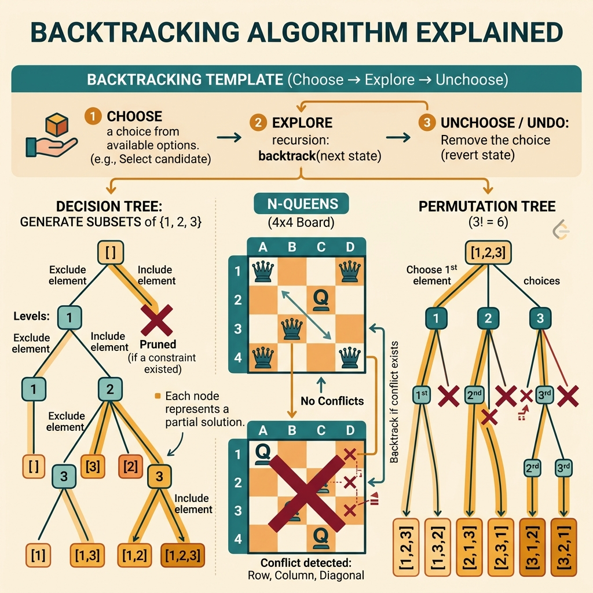

<!-- tags: leetcode, algorithms, coding-interview, backtracking -->
# 🔄 Backtracking

> Permutations, combinations, subsets, N-Queens, Sudoku — generate all valid solutions using pruning

📅 Created: 2026-03-20 · 🔄 Updated: 2026-04-10 · ⏱️ 12 min read

| Aspect         | Detail                                          |
| -------------- | ----------------------------------------------- |
| **Complexity** | O(2^n) subsets, O(n!) permutations              |
| **Use case**   | Generate all solutions, constraint satisfaction |
| **Go stdlib**  | No specific; slice manipulation                 |
| **LeetCode**   | #17, #22, #39, #46, #51, #78, #79, #131         |

---

### Interview template

> Copy-paste this snippet during interviews.

```go
// ── Backtracking Template ───────────────────────────────────────
var result [][]int
var path []int

var backtrack func(start int)
backtrack = func(start int) {
    if isGoal() {
        tmp := make([]int, len(path))
        copy(tmp, path)
        result = append(result, tmp)
        return
    }
    for i := start; i < n; i++ {
        if shouldSkip(i) { continue }       // pruning
        path = append(path, nums[i])        // choose
        backtrack(i + 1)                    // explore (i+1 for combos, i for permutations use visited)
        path = path[:len(path)-1]           // unchoose
    }
}
backtrack(0)
```
```typescript
// ── Backtracking Template ───────────────────────────────────────
const result: number[][] = [];
const path: number[] = [];

const backtrack = (start: number) => {
    if (isGoal()) {
        result.push([...path]);
        return;
    }
    for (let i = start; i < n; i++) {
        if (shouldSkip(i)) continue;
        path.push(nums[i]);
        backtrack(i + 1);
        path.pop();
    }
};
backtrack(0);
```
```rust
// ── Backtracking Template ───────────────────────────────────────
let mut result: Vec<Vec<i32>> = Vec::new();
let mut path: Vec<i32> = Vec::new();

fn backtrack(start: usize, nums: &[i32], path: &mut Vec<i32>, result: &mut Vec<Vec<i32>>) {
    if is_goal() {
        result.push(path.clone());
        return;
    }
    for i in start..nums.len() {
        if should_skip(i) {
            continue;
        }
        path.push(nums[i]);
        backtrack(i + 1, nums, path, result);
        path.pop();
    }
}
```
```cpp
// ── Backtracking Template ───────────────────────────────────────
std::vector<std::vector<int>> result;
std::vector<int> path;

std::function<void(int)> backtrack = [&](int start) {
    if (isGoal()) {
        result.push_back(path);
        return;
    }
    for (int i = start; i < n; ++i) {
        if (shouldSkip(i)) continue;
        path.push_back(nums[i]);
        backtrack(i + 1);
        path.pop_back();
    }
};
backtrack(0);
```
```python
# ── Backtracking Template ───────────────────────────────────────
result: list[list[int]] = []
path: list[int] = []

def backtrack(start: int) -> None:
    if is_goal():
        result.append(path[:])
        return
    for i in range(start, n):
        if should_skip(i):
            continue
        path.append(nums[i])
        backtrack(i + 1)
        path.pop()

backtrack(0)
```

---

## 1. DEFINE

Imagine you are in a LeetCode session and the problem looks very familiar. 🔄 Backtracking only becomes truly useful when it pulls you away from rote memorization to spot the correct family signal early.

Some problems reveal instantly that generating every configuration and checking at the end will explode the branch count. `Backtracking` is the family that appears right then. You must traverse the decision tree, but not blindly. You choose, verify, prune, and backtrack when that branch is no longer viable.

What makes this family effective is not the elegant recursion. It is the representation of temporary state and the quality of pruning. For the same problem, moving the validity check one level higher can change the tree size.

Core insight: **Backtracking works well when temporary state is compact enough for step-by-step expansion and constraints are checked early enough to prune hopeless branches.**

| Variant | When to use | Key idea |
| ------- | ------- | ------- |
| Subsets / combinations | Need to list all subsets or choose k elements | Each step decides to include or skip an element, ignoring order |
| Permutations | Element order creates distinct solutions | Each recursion level picks one unused element |
| Constraint search | N-Queens, Sudoku, word search | Each branch must check validity early to prune |
| Partition / palindrome split | Split strings or sets into valid segments | State must track current segment boundaries and quick validation |

| Approach | Time | Space | When to choose |
| --- | --- | --- | --- |
| Plain DFS + undo | Depends on valid decision tree branches | O(depth) | Use when you only enumerate and branching factor is small |
| DFS + pruning | Better than brute-force based on prune quality | O(depth) | Use when constraints block branches early, like exceeding a sum |
| DFS + visited / used[] | O(n · n!) for typical permutations | O(n) | Use when both position and order matter |
| DFS + constraint caches | Varies, usually drops branch count sharply | O(depth + cache) | Use for N-Queens, Sudoku, word search for O(1) or O(log n) checks |

### 1.1 Quick Identification

- The problem asks to generate all, combinations, permutations, N-Queens, word search, or partitions.
- You are traversing a decision search tree, not just a simple recursive loop.
- If you can detect a bad branch immediately after adding a new decision, pruning is key.

### 1.2 Invariants & Failure Modes

- The current state must accurately reflect every decision made along the current path.
- Undo is mandatory. Missing an undo leaves dirty state for subsequent branches.
- Common failure mode: writing correct recursion syntax but failing to enforce pruning constraints. This creates disguised brute-force code.

## 2. VISUAL

Backtracking problems revolve around the generate-prune-collect framework. The image below categorizes three main sub-families for quick approach identification.

### Overview — Backtracking



*Figure: Backtracking = DFS on a decision tree. Early pruning makes O(n!) feasible.*


### Level 1 — Core intuition

```text
subsets([1,2,3])
[]
├─ choose 1 -> [1]
│  ├─ choose 2 -> [1,2]
│  │  └─ choose 3 -> [1,2,3]
│  └─ skip 2 -> [1]
└─ skip 1 -> []

Each node = current state
Each edge = a new decision
```

*Caption*: Level 1 shows that backtracking is essentially traversing a decision tree. Each branch represents a new choice applied to the current state.

### Level 2 — Detailed decision trace

- State must hold enough information to expand, but avoid redundant data that complicates undo operations.
- Good pruning means detecting a useless branch before diving one level deeper.
- For permutations, the decision involves which element remains unused. For combinations, it involves the next allowed index.
- With constraint searches like N-Queens, column or diagonal caches turn grid validation into an O(1) lookup.

The decision tree shows which branches get explored and which get pruned. Code implements the choose→recurse→unchoose pattern. However, Go slice semantics hide subtle traps.

## 3. CODE

Once the decision tree and prune points are clear, backtracking code must follow a strict choose -> explore -> undo rhythm. We move from basic enumeration to heavier constraint searches.

### Problem 1: Basic — Subsets, Combinations, Permutations [LC #78, #77, #46]
> **Goal**: Master the 3 foundational backtracking frames: generate subsets, choose k elements, and list permutations.
> **Approach**: State array + recursion + undo. Clearly separate index-based traversal from used[] traversal.
> **Example**: nums=[1,2,3] -> subsets/permutations; n=4,k=2 -> combinations.
> **Complexity**: Subsets O(n·2^n), combinations O(k·C(n,k)), permutations O(n·n!).

```go
// leetcode/backtrack_basic.go
package leetcode

// ✅ LC #78: Subsets
// Pattern: Include or exclude each element
// Time: O(n × 2^n), Space: O(n)
func subsets(nums []int) [][]int {
    result := [][]int{}
    current := []int{}

    var backtrack func(start int)
    backtrack = func(start int) {
        // ✅ Every state is a valid subset → record
        tmp := make([]int, len(current))
        copy(tmp, current)
        result = append(result, tmp)

        for i := start; i < len(nums); i++ {
            current = append(current, nums[i])  // ✅ Choose
            backtrack(i + 1)                      // ✅ Explore
            current = current[:len(current)-1]    // ✅ Unchoose (backtrack)
        }
    }

    backtrack(0)
    return result
}

// ✅ LC #77: Combinations (nCk)
// Pattern: Subsets but only record size=k
// Time: O(k × C(n,k)), Space: O(k)
func combine(n, k int) [][]int {
    result := [][]int{}
    current := []int{}

    var backtrack func(start int)
    backtrack = func(start int) {
        if len(current) == k {
            tmp := make([]int, k)
            copy(tmp, current)
            result = append(result, tmp)
            return
        }

        // ⚠️ Pruning: need (k - len(current)) more elements
        // So i can go up to n - (k - len(current)) + 1
        remaining := k - len(current)
        for i := start; i <= n-remaining+1; i++ {
            current = append(current, i)
            backtrack(i + 1)
            current = current[:len(current)-1]
        }
    }

    backtrack(1)
    return result
}

// ✅ LC #46: Permutations
// Pattern: Try each unused element at each position
// Time: O(n × n!), Space: O(n)
func permute(nums []int) [][]int {
    result := [][]int{}
    current := []int{}
    used := make([]bool, len(nums))

    var backtrack func()
    backtrack = func() {
        if len(current) == len(nums) {
            tmp := make([]int, len(nums))
            copy(tmp, current)
            result = append(result, tmp)
            return
        }

        for i := 0; i < len(nums); i++ {
            if used[i] {
                continue // ⚠️ Skip used elements
            }
            used[i] = true
            current = append(current, nums[i])
            backtrack()
            current = current[:len(current)-1] // ✅ Backtrack
            used[i] = false
        }
    }

    backtrack()
    return result
}
```
```typescript
// leetcode/backtrack_basic.ts
export function subsets(nums: number[]): number[][] {
    const result: number[][] = [];
    const current: number[] = [];
    const backtrack = (start: number) => {
        result.push([...current]);
        for (let i = start; i < nums.length; i++) {
            current.push(nums[i]);
            backtrack(i + 1);
            current.pop();
        }
    };
    backtrack(0);
    return result;
}

export function combine(n: number, k: number): number[][] {
    const result: number[][] = [];
    const current: number[] = [];
    const backtrack = (start: number) => {
        if (current.length === k) {
            result.push([...current]);
            return;
        }
        const remaining = k - current.length;
        for (let i = start; i <= n - remaining + 1; i++) {
            current.push(i);
            backtrack(i + 1);
            current.pop();
        }
    };
    backtrack(1);
    return result;
}

export function permute(nums: number[]): number[][] {
    const result: number[][] = [];
    const current: number[] = [];
    const used = Array.from({ length: nums.length }, () => false);
    const backtrack = () => {
        if (current.length === nums.length) {
            result.push([...current]);
            return;
        }
        for (let i = 0; i < nums.length; i++) {
            if (used[i]) continue;
            used[i] = true;
            current.push(nums[i]);
            backtrack();
            current.pop();
            used[i] = false;
        }
    };
    backtrack();
    return result;
}
```
```rust
// leetcode/backtrack_basic.rs
pub fn subsets(nums: Vec<i32>) -> Vec<Vec<i32>> {
    fn backtrack(start: usize, nums: &[i32], current: &mut Vec<i32>, result: &mut Vec<Vec<i32>>) {
        result.push(current.clone());
        for i in start..nums.len() {
            current.push(nums[i]);
            backtrack(i + 1, nums, current, result);
            current.pop();
        }
    }

    let mut result = Vec::new();
    backtrack(0, &nums, &mut Vec::new(), &mut result);
    result
}

pub fn combine(n: i32, k: i32) -> Vec<Vec<i32>> {
    fn backtrack(start: i32, n: i32, k: i32, current: &mut Vec<i32>, result: &mut Vec<Vec<i32>>) {
        if current.len() == k as usize {
            result.push(current.clone());
            return;
        }
        let remaining = k as usize - current.len();
        for value in start..=n - remaining as i32 + 1 {
            current.push(value);
            backtrack(value + 1, n, k, current, result);
            current.pop();
        }
    }

    let mut result = Vec::new();
    backtrack(1, n, k, &mut Vec::new(), &mut result);
    result
}

pub fn permute(nums: Vec<i32>) -> Vec<Vec<i32>> {
    fn backtrack(nums: &[i32], used: &mut [bool], current: &mut Vec<i32>, result: &mut Vec<Vec<i32>>) {
        if current.len() == nums.len() {
            result.push(current.clone());
            return;
        }
        for i in 0..nums.len() {
            if used[i] {
                continue;
            }
            used[i] = true;
            current.push(nums[i]);
            backtrack(nums, used, current, result);
            current.pop();
            used[i] = false;
        }
    }

    let mut result = Vec::new();
    let mut used = vec![false; nums.len()];
    backtrack(&nums, &mut used, &mut Vec::new(), &mut result);
    result
}
```
```cpp
// leetcode/backtrack_basic.cpp
std::vector<std::vector<int>> subsets(std::vector<int>& nums) {
    std::vector<std::vector<int>> result;
    std::vector<int> current;
    std::function<void(int)> backtrack = [&](int start) {
        result.push_back(current);
        for (int i = start; i < static_cast<int>(nums.size()); ++i) {
            current.push_back(nums[i]);
            backtrack(i + 1);
            current.pop_back();
        }
    };
    backtrack(0);
    return result;
}

std::vector<std::vector<int>> combine(int n, int k) {
    std::vector<std::vector<int>> result;
    std::vector<int> current;
    std::function<void(int)> backtrack = [&](int start) {
        if (static_cast<int>(current.size()) == k) {
            result.push_back(current);
            return;
        }
        int remaining = k - static_cast<int>(current.size());
        for (int value = start; value <= n - remaining + 1; ++value) {
            current.push_back(value);
            backtrack(value + 1);
            current.pop_back();
        }
    };
    backtrack(1);
    return result;
}

std::vector<std::vector<int>> permute(std::vector<int>& nums) {
    std::vector<std::vector<int>> result;
    std::vector<int> current;
    std::vector<bool> used(nums.size(), false);
    std::function<void()> backtrack = [&]() {
        if (current.size() == nums.size()) {
            result.push_back(current);
            return;
        }
        for (int i = 0; i < static_cast<int>(nums.size()); ++i) {
            if (used[i]) continue;
            used[i] = true;
            current.push_back(nums[i]);
            backtrack();
            current.pop_back();
            used[i] = false;
        }
    };
    backtrack();
    return result;
}
```
```python
# leetcode/backtrack_basic.py
def subsets(nums: list[int]) -> list[list[int]]:
    result: list[list[int]] = []
    current: list[int] = []

    def backtrack(start: int) -> None:
        result.append(current[:])
        for i in range(start, len(nums)):
            current.append(nums[i])
            backtrack(i + 1)
            current.pop()

    backtrack(0)
    return result

def combine(n: int, k: int) -> list[list[int]]:
    result: list[list[int]] = []
    current: list[int] = []

    def backtrack(start: int) -> None:
        if len(current) == k:
            result.append(current[:])
            return
        remaining = k - len(current)
        for value in range(start, n - remaining + 2):
            current.append(value)
            backtrack(value + 1)
            current.pop()

    backtrack(1)
    return result

def permute(nums: list[int]) -> list[list[int]]:
    result: list[list[int]] = []
    current: list[int] = []
    used = [False] * len(nums)

    def backtrack() -> None:
        if len(current) == len(nums):
            result.append(current[:])
            return
        for i, num in enumerate(nums):
            if used[i]:
                continue
            used[i] = True
            current.append(num)
            backtrack()
            current.pop()
            used[i] = False

    backtrack()
    return result
```

> **Why?** These three foundational problems differ only in state invariants. Subsets and combinations use `start` to avoid revisiting elements. Permutations use `used[]` because order creates distinct states. Understanding invariants prevents confusing duplicate skipping with used skipping.

> **Conclusion**: This **Basic** example demonstrates using `Subsets, Combinations, Permutations [LC #78, #77, #46]` to solve LeetCode problems without skipping reasoning. When constraints change or tighter optimization is needed, proceed to the next example.

> **✅ Achieved**: Subsets, combinations, permutations — 3 core patterns.
> **⚠️ Takeaway**: Copy slices when recording results. Go slices act as references!

---
### Problem 2: Intermediate — Combination Sum & Palindrome Partitioning [LC #39, #131, #22]
> **Goal**: Combine backtracking with branch-specific validation constraints to reduce the search space.
> **Approach**: Prune based on the current sum, or validate the newly added segment before recursing deeper.
> **Example**: candidates=[2,3,6,7], target=7 or s="aab" -> valid palindrome partitions.
> **Complexity**: Depends on valid branches. Better pruning yields a shallower tree than brute-force.

```go
// leetcode/backtrack_intermediate.go
package leetcode

// ✅ LC #39: Combination Sum
// Elements can be used UNLIMITED times (unbounded)
// Time: O(n^(T/M)), Space: O(T/M) — T=target, M=min candidate
func combinationSum(candidates []int, target int) [][]int {
    result := [][]int{}
    current := []int{}

    var backtrack func(start, remaining int)
    backtrack = func(start, remaining int) {
        if remaining == 0 {
            tmp := make([]int, len(current))
            copy(tmp, current)
            result = append(result, tmp)
            return
        }

        for i := start; i < len(candidates); i++ {
            if candidates[i] > remaining {
                continue // ✅ Pruning: can't use this candidate
            }
            current = append(current, candidates[i])
            backtrack(i, remaining-candidates[i]) // ⚠️ i (not i+1): reuse allowed
            current = current[:len(current)-1]
        }
    }

    backtrack(0, target)
    return result
}

// ✅ LC #131: Palindrome Partitioning
// Partition string into palindromic substrings
// Time: O(n × 2^n), Space: O(n)
func partition(s string) [][]string {
    result := [][]string{}
    current := []string{}

    var backtrack func(start int)
    backtrack = func(start int) {
        if start == len(s) {
            tmp := make([]string, len(current))
            copy(tmp, current)
            result = append(result, tmp)
            return
        }

        for end := start + 1; end <= len(s); end++ {
            sub := s[start:end]
            if isPalindrome(sub) {
                current = append(current, sub)
                backtrack(end) // ✅ Next partition starts at end
                current = current[:len(current)-1]
            }
            // ⚠️ Not palindrome → skip (pruning)
        }
    }

    backtrack(0)
    return result
}

func isPalindrome(s string) bool {
    for l, r := 0, len(s)-1; l < r; l, r = l+1, r-1 {
        if s[l] != s[r] {
            return false
        }
    }
    return true
}

// ✅ LC #22: Generate Parentheses
// Generate all valid combinations of n pairs
// Constraint: open count ≥ close count at all times
// Time: O(4^n / √n) (Catalan number), Space: O(n)
func generateParenthesis(n int) []string {
    result := []string{}
    current := make([]byte, 0, 2*n)

    var backtrack func(open, close int)
    backtrack = func(open, close int) {
        if len(current) == 2*n {
            result = append(result, string(current))
            return
        }

        if open < n {
            current = append(current, '(')
            backtrack(open+1, close)
            current = current[:len(current)-1]
        }

        if close < open { // ⚠️ Can only close if open > close
            current = append(current, ')')
            backtrack(open, close+1)
            current = current[:len(current)-1]
        }
    }

    backtrack(0, 0)
    return result
}
```
```typescript
// leetcode/backtrack_intermediate.ts
export function combinationSum(candidates: number[], target: number): number[][] {
    const result: number[][] = [];
    const current: number[] = [];
    const backtrack = (start: number, remaining: number) => {
        if (remaining === 0) {
            result.push([...current]);
            return;
        }
        for (let i = start; i < candidates.length; i++) {
            if (candidates[i] > remaining) continue;
            current.push(candidates[i]);
            backtrack(i, remaining - candidates[i]);
            current.pop();
        }
    };
    backtrack(0, target);
    return result;
}

export function partition(s: string): string[][] {
    const result: string[][] = [];
    const current: string[] = [];
    const isPalindrome = (value: string): boolean => value === value.split("").reverse().join("");
    const backtrack = (start: number) => {
        if (start === s.length) {
            result.push([...current]);
            return;
        }
        for (let end = start + 1; end <= s.length; end++) {
            const sub = s.slice(start, end);
            if (!isPalindrome(sub)) continue;
            current.push(sub);
            backtrack(end);
            current.pop();
        }
    };
    backtrack(0);
    return result;
}

export function generateParenthesis(n: number): string[] {
    const result: string[] = [];
    const current: string[] = [];
    const backtrack = (open: number, close: number) => {
        if (current.length === 2 * n) {
            result.push(current.join(""));
            return;
        }
        if (open < n) {
            current.push("(");
            backtrack(open + 1, close);
            current.pop();
        }
        if (close < open) {
            current.push(")");
            backtrack(open, close + 1);
            current.pop();
        }
    };
    backtrack(0, 0);
    return result;
}
```
```rust
// leetcode/backtrack_intermediate.rs
pub fn combination_sum(candidates: Vec<i32>, target: i32) -> Vec<Vec<i32>> {
    fn backtrack(start: usize, remaining: i32, candidates: &[i32], current: &mut Vec<i32>, result: &mut Vec<Vec<i32>>) {
        if remaining == 0 {
            result.push(current.clone());
            return;
        }
        for i in start..candidates.len() {
            if candidates[i] > remaining {
                continue;
            }
            current.push(candidates[i]);
            backtrack(i, remaining - candidates[i], candidates, current, result);
            current.pop();
        }
    }

    let mut result = Vec::new();
    backtrack(0, target, &candidates, &mut Vec::new(), &mut result);
    result
}

pub fn partition(s: String) -> Vec<Vec<String>> {
    fn is_palindrome(chars: &[char], mut left: usize, mut right: usize) -> bool {
        while left < right {
            if chars[left] != chars[right] {
                return false;
            }
            left += 1;
            right = right.saturating_sub(1);
        }
        true
    }

    fn backtrack(start: usize, chars: &[char], current: &mut Vec<String>, result: &mut Vec<Vec<String>>) {
        if start == chars.len() {
            result.push(current.clone());
            return;
        }
        for end in start..chars.len() {
            if !is_palindrome(chars, start, end) {
                continue;
            }
            current.push(chars[start..=end].iter().collect());
            backtrack(end + 1, chars, current, result);
            current.pop();
        }
    }

    let chars: Vec<char> = s.chars().collect();
    let mut result = Vec::new();
    backtrack(0, &chars, &mut Vec::new(), &mut result);
    result
}

pub fn generate_parenthesis(n: i32) -> Vec<String> {
    fn backtrack(open: i32, close: i32, n: i32, current: &mut String, result: &mut Vec<String>) {
        if current.len() == (2 * n) as usize {
            result.push(current.clone());
            return;
        }
        if open < n {
            current.push('(');
            backtrack(open + 1, close, n, current, result);
            current.pop();
        }
        if close < open {
            current.push(')');
            backtrack(open, close + 1, n, current, result);
            current.pop();
        }
    }

    let mut result = Vec::new();
    backtrack(0, 0, n, &mut String::new(), &mut result);
    result
}
```
```cpp
// leetcode/backtrack_intermediate.cpp
std::vector<std::vector<int>> combinationSum(std::vector<int>& candidates, int target) {
    std::vector<std::vector<int>> result;
    std::vector<int> current;
    std::function<void(int, int)> backtrack = [&](int start, int remaining) {
        if (remaining == 0) {
            result.push_back(current);
            return;
        }
        for (int i = start; i < static_cast<int>(candidates.size()); ++i) {
            if (candidates[i] > remaining) continue;
            current.push_back(candidates[i]);
            backtrack(i, remaining - candidates[i]);
            current.pop_back();
        }
    };
    backtrack(0, target);
    return result;
}

std::vector<std::vector<std::string>> partition(std::string s) {
    std::vector<std::vector<std::string>> result;
    std::vector<std::string> current;
    auto isPalindrome = [&](int left, int right) {
        while (left < right) {
            if (s[left++] != s[right--]) return false;
        }
        return true;
    };
    std::function<void(int)> backtrack = [&](int start) {
        if (start == static_cast<int>(s.size())) {
            result.push_back(current);
            return;
        }
        for (int end = start; end < static_cast<int>(s.size()); ++end) {
            if (!isPalindrome(start, end)) continue;
            current.push_back(s.substr(start, end - start + 1));
            backtrack(end + 1);
            current.pop_back();
        }
    };
    backtrack(0);
    return result;
}

std::vector<std::string> generateParenthesis(int n) {
    std::vector<std::string> result;
    std::string current;
    std::function<void(int, int)> backtrack = [&](int open, int close) {
        if (current.size() == static_cast<size_t>(2 * n)) {
            result.push_back(current);
            return;
        }
        if (open < n) {
            current.push_back('(');
            backtrack(open + 1, close);
            current.pop_back();
        }
        if (close < open) {
            current.push_back(')');
            backtrack(open, close + 1);
            current.pop_back();
        }
    };
    backtrack(0, 0);
    return result;
}
```
```python
# leetcode/backtrack_intermediate.py
def combination_sum(candidates: list[int], target: int) -> list[list[int]]:
    result: list[list[int]] = []
    current: list[int] = []

    def backtrack(start: int, remaining: int) -> None:
        if remaining == 0:
            result.append(current[:])
            return
        for i in range(start, len(candidates)):
            if candidates[i] > remaining:
                continue
            current.append(candidates[i])
            backtrack(i, remaining - candidates[i])
            current.pop()

    backtrack(0, target)
    return result

def partition(s: str) -> list[list[str]]:
    result: list[list[str]] = []
    current: list[str] = []

    def is_palindrome(value: str) -> bool:
        return value == value[::-1]

    def backtrack(start: int) -> None:
        if start == len(s):
            result.append(current[:])
            return
        for end in range(start + 1, len(s) + 1):
            sub = s[start:end]
            if not is_palindrome(sub):
                continue
            current.append(sub)
            backtrack(end)
            current.pop()

    backtrack(0)
    return result

def generate_parenthesis(n: int) -> list[str]:
    result: list[str] = []
    current: list[str] = []

    def backtrack(open_count: int, close_count: int) -> None:
        if len(current) == 2 * n:
            result.append("".join(current))
            return
        if open_count < n:
            current.append("(")
            backtrack(open_count + 1, close_count)
            current.pop()
        if close_count < open_count:
            current.append(")")
            backtrack(open_count, close_count + 1)
            current.pop()

    backtrack(0, 0)
    return result
```

> **Why?** At the Intermediate level, backtracking is efficient only if every new branch is validated immediately. With Combination Sum, branches exceeding the target must stop. With Palindrome Partitioning, recurse only when the new segment is a palindrome to prevent branch explosions.

> **Conclusion**: This **Intermediate** example shows how to use `Combination Sum & Palindrome [LC #39, #131, #22]` to solve LeetCode problems cleanly. When constraints shift, check the next example.

> **✅ Achieved**: Combination sum (reuse), palindrome partitioning, generate parentheses.
> **⚠️ Takeaway**: LC #39 uses `i` (not `i+1`) for unbounded reuse. Parentheses: `close < open` ensures validity.

---
### Problem 3: Advanced — N-Queens & Word Search [LC #51, #79]
> **Goal**: Apply backtracking on constraint-heavy states, where pruning and caching determine passing or TLE.
> **Approach**: Use column/diagonal sets for N-Queens, and mark-visited in-place for Word Search.
> **Example**: n=4 for N-Queens or character board + target word.
> **Complexity**: Exponential or factorial, but practical efficiency relies entirely on pruning and caching.

```go
// leetcode/backtrack_advanced.go
package leetcode

// ✅ LC #51: N-Queens (HARD)
// Place n queens on n×n board — no 2 queens attack each other
// Time: O(n!), Space: O(n)
func solveNQueens(n int) [][]string {
    result := [][]string{}
    board := make([][]byte, n)
    for i := range board {
        board[i] = make([]byte, n)
        for j := range board[i] {
            board[i][j] = '.'
        }
    }

    // ✅ Conflict tracking sets
    cols := make(map[int]bool)     // Column occupied
    diag1 := make(map[int]bool)    // row - col = constant (↘ diagonal)
    diag2 := make(map[int]bool)    // row + col = constant (↙ diagonal)

    var backtrack func(row int)
    backtrack = func(row int) {
        if row == n {
            // ✅ All queens placed → record solution
            solution := make([]string, n)
            for i, r := range board {
                solution[i] = string(r)
            }
            result = append(result, solution)
            return
        }

        for col := 0; col < n; col++ {
            if cols[col] || diag1[row-col] || diag2[row+col] {
                continue // ⚠️ Conflict → skip
            }

            // ✅ Place queen
            board[row][col] = 'Q'
            cols[col] = true
            diag1[row-col] = true
            diag2[row+col] = true

            backtrack(row + 1)

            // ✅ Remove queen (backtrack)
            board[row][col] = '.'
            delete(cols, col)
            delete(diag1, row-col)
            delete(diag2, row+col)
        }
    }

    backtrack(0)
    return result
}

// ✅ LC #79: Word Search
// Find word in 2D grid by moving adjacently
// Time: O(m × n × 4^L), Space: O(L) — L = word length
func exist(board [][]byte, word string) bool {
    rows, cols := len(board), len(board[0])
    dirs := [4][2]int{{-1, 0}, {1, 0}, {0, -1}, {0, 1}}

    var backtrack func(r, c, idx int) bool
    backtrack = func(r, c, idx int) bool {
        if idx == len(word) {
            return true // ✅ Found complete word
        }
        if r < 0 || r >= rows || c < 0 || c >= cols {
            return false
        }
        if board[r][c] != word[idx] {
            return false
        }

        // ✅ Mark visited (in-place)
        original := board[r][c]
        board[r][c] = '#' // ⚠️ Temporary mark

        for _, d := range dirs {
            if backtrack(r+d[0], c+d[1], idx+1) {
                board[r][c] = original // ⚠️ Restore before return
                return true
            }
        }

        board[r][c] = original // ✅ Backtrack
        return false
    }

    for r := 0; r < rows; r++ {
        for c := 0; c < cols; c++ {
            if backtrack(r, c, 0) {
                return true
            }
        }
    }

    return false
}
```
```typescript
// leetcode/backtrack_advanced.ts
export function solveNQueens(n: number): string[][] {
    const result: string[][] = [];
    const board = Array.from({ length: n }, () => Array.from({ length: n }, () => "."));
    const cols = new Set<number>();
    const diag1 = new Set<number>();
    const diag2 = new Set<number>();

    const backtrack = (row: number) => {
        if (row === n) {
            result.push(board.map((line) => line.join("")));
            return;
        }
        for (let col = 0; col < n; col++) {
            if (cols.has(col) || diag1.has(row - col) || diag2.has(row + col)) continue;
            board[row][col] = "Q";
            cols.add(col);
            diag1.add(row - col);
            diag2.add(row + col);
            backtrack(row + 1);
            board[row][col] = ".";
            cols.delete(col);
            diag1.delete(row - col);
            diag2.delete(row + col);
        }
    };

    backtrack(0);
    return result;
}

export function exist(board: string[][], word: string): boolean {
    const rows = board.length;
    const cols = board[0].length;
    const dirs = [[-1, 0], [1, 0], [0, -1], [0, 1]];
    const backtrack = (r: number, c: number, idx: number): boolean => {
        if (idx === word.length) return true;
        if (r < 0 || r >= rows || c < 0 || c >= cols) return false;
        if (board[r][c] !== word[idx]) return false;
        const original = board[r][c];
        board[r][c] = "#";
        for (const [dr, dc] of dirs) {
            if (backtrack(r + dr, c + dc, idx + 1)) {
                board[r][c] = original;
                return true;
            }
        }
        board[r][c] = original;
        return false;
    };
    for (let r = 0; r < rows; r++) {
        for (let c = 0; c < cols; c++) {
            if (backtrack(r, c, 0)) return true;
        }
    }
    return false;
}
```
```rust
// leetcode/backtrack_advanced.rs
pub fn solve_n_queens(n: i32) -> Vec<Vec<String>> {
    fn backtrack(
        row: usize,
        n: usize,
        board: &mut Vec<Vec<char>>,
        cols: &mut Vec<bool>,
        diag1: &mut Vec<bool>,
        diag2: &mut Vec<bool>,
        result: &mut Vec<Vec<String>>,
    ) {
        if row == n {
            result.push(board.iter().map(|r| r.iter().collect()).collect());
            return;
        }
        for col in 0..n {
            let d1 = row + n - col;
            let d2 = row + col;
            if cols[col] || diag1[d1] || diag2[d2] {
                continue;
            }
            board[row][col] = 'Q';
            cols[col] = true;
            diag1[d1] = true;
            diag2[d2] = true;
            backtrack(row + 1, n, board, cols, diag1, diag2, result);
            board[row][col] = '.';
            cols[col] = false;
            diag1[d1] = false;
            diag2[d2] = false;
        }
    }

    let n = n as usize;
    let mut board = vec![vec!['.'; n]; n];
    let mut result = Vec::new();
    backtrack(
        0,
        n,
        &mut board,
        &mut vec![false; n],
        &mut vec![false; 2 * n],
        &mut vec![false; 2 * n],
        &mut result,
    );
    result
}

pub fn exist(mut board: Vec<Vec<char>>, word: String) -> bool {
    fn backtrack(board: &mut [Vec<char>], word: &[char], r: i32, c: i32, idx: usize) -> bool {
        if idx == word.len() {
            return true;
        }
        if r < 0 || c < 0 || r as usize >= board.len() || c as usize >= board[0].len() {
            return false;
        }
        if board[r as usize][c as usize] != word[idx] {
            return false;
        }
        let original = board[r as usize][c as usize];
        board[r as usize][c as usize] = '#';
        for (dr, dc) in [(-1, 0), (1, 0), (0, -1), (0, 1)] {
            if backtrack(board, word, r + dr, c + dc, idx + 1) {
                board[r as usize][c as usize] = original;
                return true;
            }
        }
        board[r as usize][c as usize] = original;
        false
    }

    let chars: Vec<char> = word.chars().collect();
    for r in 0..board.len() {
        for c in 0..board[0].len() {
            if backtrack(&mut board, &chars, r as i32, c as i32, 0) {
                return true;
            }
        }
    }
    false
}
```
```cpp
// leetcode/backtrack_advanced.cpp
std::vector<std::vector<std::string>> solveNQueens(int n) {
    std::vector<std::vector<std::string>> result;
    std::vector<std::string> board(n, std::string(n, '.'));
    std::vector<bool> cols(n, false), diag1(2 * n, false), diag2(2 * n, false);
    std::function<void(int)> backtrack = [&](int row) {
        if (row == n) {
            result.push_back(board);
            return;
        }
        for (int col = 0; col < n; ++col) {
            int d1 = row - col + n;
            int d2 = row + col;
            if (cols[col] || diag1[d1] || diag2[d2]) continue;
            board[row][col] = 'Q';
            cols[col] = diag1[d1] = diag2[d2] = true;
            backtrack(row + 1);
            board[row][col] = '.';
            cols[col] = diag1[d1] = diag2[d2] = false;
        }
    };
    backtrack(0);
    return result;
}

bool exist(std::vector<std::vector<char>>& board, std::string word) {
    int rows = static_cast<int>(board.size());
    int cols = static_cast<int>(board[0].size());
    std::function<bool(int, int, int)> backtrack = [&](int r, int c, int idx) {
        if (idx == static_cast<int>(word.size())) return true;
        if (r < 0 || r >= rows || c < 0 || c >= cols) return false;
        if (board[r][c] != word[idx]) return false;
        char original = board[r][c];
        board[r][c] = '#';
        for (auto [dr, dc] : std::vector<std::pair<int, int>>{{-1, 0}, {1, 0}, {0, -1}, {0, 1}}) {
            if (backtrack(r + dr, c + dc, idx + 1)) {
                board[r][c] = original;
                return true;
            }
        }
        board[r][c] = original;
        return false;
    };
    for (int r = 0; r < rows; ++r) {
        for (int c = 0; c < cols; ++c) {
            if (backtrack(r, c, 0)) return true;
        }
    }
    return false;
}
```
```python
# leetcode/backtrack_advanced.py
def solve_n_queens(n: int) -> list[list[str]]:
    result: list[list[str]] = []
    board = [["."] * n for _ in range(n)]
    cols: set[int] = set()
    diag1: set[int] = set()
    diag2: set[int] = set()

    def backtrack(row: int) -> None:
        if row == n:
            result.append(["".join(r) for r in board])
            return
        for col in range(n):
            if col in cols or row - col in diag1 or row + col in diag2:
                continue
            board[row][col] = "Q"
            cols.add(col)
            diag1.add(row - col)
            diag2.add(row + col)
            backtrack(row + 1)
            board[row][col] = "."
            cols.remove(col)
            diag1.remove(row - col)
            diag2.remove(row + col)

    backtrack(0)
    return result

def exist(board: list[list[str]], word: str) -> bool:
    rows, cols = len(board), len(board[0])
    dirs = [(-1, 0), (1, 0), (0, -1), (0, 1)]

    def backtrack(r: int, c: int, idx: int) -> bool:
        if idx == len(word):
            return True
        if r < 0 or r >= rows or c < 0 or c >= cols:
            return False
        if board[r][c] != word[idx]:
            return False
        original = board[r][c]
        board[r][c] = "#"
        for dr, dc in dirs:
            if backtrack(r + dr, c + dc, idx + 1):
                board[r][c] = original
                return True
        board[r][c] = original
        return False

    for r in range(rows):
        for c in range(cols):
            if backtrack(r, c, 0):
                return True
    return False
```

> **Why?** At the Advanced level, recursion is just the skeleton. Performance comes from encoding constraints. N-Queens passes because column/diagonal checks are O(1). Word Search passes because cells are marked and rolled back precisely, avoiding redundant paths or heavy board copying.

> **Conclusion**: This **Advanced** example applies `N-Queens & Word Search [LC #51, #79]` to solve complex constraints. The optimization principles remain the same across similar grids.

> **✅ Achieved**: N-Queens via column/diagonal conflict tracking, word search via grid backtracking.
> **⚠️ Takeaway**: N-Queens — `row-col` (main diagonal) and `row+col` (anti-diagonal) allow O(1) conflict checks.

---
Backtracking code often feels correct because outputs look fine on small tests. The pitfalls below reveal errors that only surface during strict output validation.

## 4. PITFALLS

Backtracking usually fails not due to recursion depth, but because state leaks between branches or pruning happens too late.

| # | Severity | Defect | Consequence | Fix |
|---|----------|-----|---------|-----|
| 1 | 🔴 Fatal | Forgetting to copy slices when recording results | All results point to a single empty slice | Use `copy(tmp, current)`. Go slices are references. |
| 2 | 🟡 Common | Subsets: starting from 0 instead of `start` | Output contains duplicate subsets | Use `i = start` to prevent duplicate subsets. |
| 3 | 🟡 Common | Permutations: using `start` instead of `used` | Missing permutations and incorrect ordering | Permutations require a `used[]` tracking array. |
| 4 | 🔵 Minor | Combination Sum: using `i+1` instead of `i` | Fails to reuse elements when allowed | Use `i` for unbounded, `i+1` for single use. |
| 5 | 🔵 Minor | Word Search: forgetting to restore visited cells | DFS gets blocked, missing valid paths | MUST restore `board[r][c]` during backtracking. |
| 6 | 🔵 Minor | N-Queens: checking diagonals in O(n) | Triggers TLE on larger boards | Use `row-col` and `row+col` sets for O(1). |

### 🔴 Pitfall #1 — Forgetting to copy slices when recording results

The code looks logically perfect, but Go slices act as references:

```go
var result [][]int
var bt func(start int, path []int)
bt = func(start int, path []int) {
    result = append(result, path)  // ← path changes later!
    for i := start; i < len(nums); i++ {
        path = append(path, nums[i])
        bt(i+1, path)
        path = path[:len(path)-1]
    }
}
```

All entries in `result` point to the same underlying array. When you backtrack via `path = path[:len-1]`, every stored result mutates. The output becomes empty or garbage.

**Fix**: `tmp := make([]int, len(path)); copy(tmp, path); result = append(result, tmp)`. Always perform a deep copy upon recording.

---

## 5. REF

| Resource              | Link                                                                                                      | Difficulty |
| --------------------- | --------------------------------------------------------------------------------------------------------- | ---------- |
| LC #78 Subsets        | [leetcode.com/problems/subsets](https://leetcode.com/problems/subsets/)                                   | 🟡 Medium  |
| LC #46 Permutations   | [leetcode.com/problems/permutations](https://leetcode.com/problems/permutations/)                         | 🟡 Medium  |
| LC #51 N-Queens       | [leetcode.com/problems/n-queens](https://leetcode.com/problems/n-queens/)                                 | 🔴 Hard    |
| Backtracking Template | [leetcode.com/discuss/general-discussion/680269](https://leetcode.com/discuss/general-discussion/680269/) | —          |

---

## 6. RECOMMEND

Once the choose -> recurse -> undo cycle becomes a reflex, the next step is differentiating problem types. Decide whether it remains a pure decision tree, requires a trie for pruning, or has enough overlapping subproblems to justify DP.

| Expansion | When to use | Reason | File/Link |
| ------- | ------- | ----- | --------- |
| Graph DFS | Backtracking on graphs instead of decision trees | Expands into graph algorithms | [06-graph-bfs-dfs](./06-graph-bfs-dfs.md) |
| Dynamic Programming | When backtracking encounters overlapping subproblems | Memoizes the decision tree | [07-dynamic-programming](./07-dynamic-programming.md) |
| Trie | Word search combined with trie pruning | Reduces string search space | [12-trie](./12-trie.md) |
| Bit Manipulation | Bitmasks replacing used arrays | Faster execution for n ≤ 20 | [10-bit-manipulation-math](./10-bit-manipulation-math.md) |

---

## 7. QUICK REF

| Situation / Signal | Pattern / Approach | Complexity | When to use | Warning |
|--------------------|--------------------|------------|----------|----------|
| generate all subsets | Include/skip each element | O(2ⁿ) · O(n) | Power sets, subset sums | Start from `start` index, copy on record |
| generate all permutations | Used array + choose/unchoose | O(n!) · O(n) | Arrangements, anagrams | Use used[] array, never use start index |
| combination sum / k-size | Backtracking + early pruning | O(2ⁿ) · O(target) | LC #39, #40, #77 | Use i for unbounded, i+1 for bounded |
| word search on board | 4-dir DFS + restore visited | O(m×n×4ᴸ) · O(L) | LC #79, #212 | MUST restore visited flags upon backtracking |
| N-Queens / Sudoku | Place-check-recurse-undo | O(n!) · O(n) | CSP: constraint propagation | Use sets for col, diag, and anti-diag |
| input has duplicates | Sort + skip identical level peers | O(2ⁿ) · O(n) | LC #40, #47, #90 | Skip if nums[i]==nums[i-1] when i>start |

---

Let us revisit the opening "generate all subsets" problem. Now you know that backtracking is not difficult because of recursion. The challenge lies in slice copying, skipping duplicates, and knowing when to use `i` versus `i+1`.

---

**Links**: [← Greedy & Intervals](./08-greedy-intervals.md) · [→ Bit Manipulation & Math](./10-bit-manipulation-math.md)
