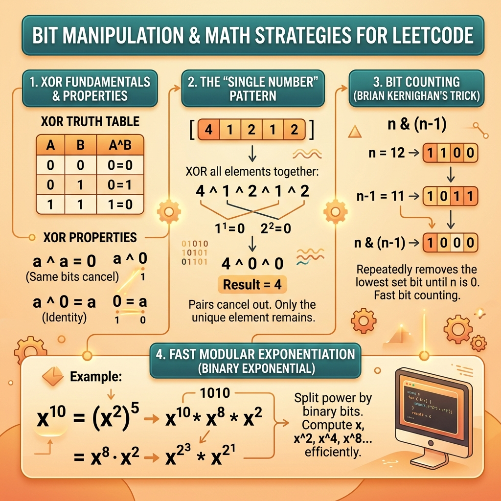

<!-- tags: leetcode, algorithms, coding-interview, bit-manipulation -->
# 🔢 Bit Manipulation & Math

> XOR tricks, bit counting, power of two, modular arithmetic, and math patterns for LeetCode

📅 Created: 2026-03-20 · 🔄 Updated: 2026-04-10 · ⏱️ 11 min read

| Aspect         | Detail                                       |
| -------------- | -------------------------------------------- |
| **Complexity** | O(1) bit ops, O(log n) math                  |
| **Use case**   | Single number, count bits, power checks, GCD |
| **Go stdlib**  | `math/bits`, `math`                          |
| **LeetCode**   | #7, #136, #190, #191, #268, #338, #371       |

---

### Interview template

> Copy-paste this snippet during interviews.

```go
// ── Common Bit Tricks ───────────────────────────────────────────
n & 1          // check odd/even (1=odd, 0=even)
n & (n-1)      // remove lowest set bit (n=0 if power of 2)
n & (-n)       // isolate lowest set bit
n >> 1         // divide by 2
n << 1         // multiply by 2
a ^ b          // XOR: a^a=0, a^0=a (find unique element)
^n             // bitwise NOT in Go (NOT ~n)

// ── Count set bits (Brian Kernighan) ────────────────────────────
count := 0
for n != 0 { n &= n - 1; count++ }

// ── XOR to find single number ───────────────────────────────────
result := 0
for _, n := range nums { result ^= n }  // all duplicates cancel
```
```typescript
// ── Common Bit Tricks ───────────────────────────────────────────
n & 1;         // check odd/even
n & (n - 1);   // remove lowest set bit
n & -n;        // isolate lowest set bit
n >> 1;        // divide by 2
n << 1;        // multiply by 2
a ^ b;         // XOR
~n;            // bitwise NOT

// ── Count set bits (Brian Kernighan) ────────────────────────────
let count = 0;
while (n !== 0) {
    n &= n - 1;
    count++;
}

// ── XOR to find single number ───────────────────────────────────
let result = 0;
for (const value of nums) result ^= value;
```
```rust
// ── Common Bit Tricks ───────────────────────────────────────────
n & 1;         // check odd/even
n & (n - 1);   // remove lowest set bit
n & (!n + 1);  // isolate lowest set bit
n >> 1;        // divide by 2
n << 1;        // multiply by 2
a ^ b;         // XOR
!n;            // bitwise NOT

// ── Count set bits (Brian Kernighan) ────────────────────────────
let mut count = 0;
while n != 0 {
    n &= n - 1;
    count += 1;
}

// ── XOR to find single number ───────────────────────────────────
let mut result = 0;
for value in nums {
    result ^= value;
}
```
```cpp
// ── Common Bit Tricks ───────────────────────────────────────────
n & 1;         // check odd/even
n & (n - 1);   // remove lowest set bit
n & (-n);      // isolate lowest set bit
n >> 1;        // divide by 2
n << 1;        // multiply by 2
a ^ b;         // XOR
~n;            // bitwise NOT

// ── Count set bits (Brian Kernighan) ────────────────────────────
int count = 0;
while (n != 0) {
    n &= n - 1;
    ++count;
}

// ── XOR to find single number ───────────────────────────────────
int result = 0;
for (int value : nums) result ^= value;
```
```python
# ── Common Bit Tricks ───────────────────────────────────────────
n & 1          # check odd/even
n & (n - 1)    # remove lowest set bit
n & -n         # isolate lowest set bit
n >> 1         # divide by 2
n << 1         # multiply by 2
a ^ b          # XOR
~n             # bitwise NOT

# ── Count set bits (Brian Kernighan) ────────────────────────────
count = 0
while n:
    n &= n - 1
    count += 1

# ── XOR to find single number ───────────────────────────────────
result = 0
for value in nums:
    result ^= value
```

---

## 1. DEFINE

Imagine you are in a LeetCode session and the problem looks very familiar. 🔢 Bit Manipulation & Math only becomes truly useful when it pulls you away from rote memorization to spot the correct family signal early.

`Bit Manipulation & Math` is a family that makes readers either fear it or love tricks too much. Both are dangerous. Interviews do not reward memorizing tricks. They reward spotting which representation simplifies the problem: bitmask, parity, gcd normalization, fast power, or modular reasoning.

The key to this family is shifting the question from a solid value to its internal structure. Once a number becomes a bit set, remainder, or reusable power, many seemingly different problems share the same reasoning family.

Core insight: **This family shines when the correct representation reveals simpler invariants than direct arithmetic views.**

| Variant | When to use | Key idea |
| ------- | ------- | ------- |
| XOR cancellation | Duplicates exist alongside a unique element | a ^ a = 0, order does not matter |
| Bit counting / mask DP | Need to count set bits, enumerate subsets, or compress state | Transform integers into bit sets and manipulate directly |
| Arithmetic pattern | Reverse number, power, gcd, modular cycle | Use arithmetic properties instead of step-by-step simulation |
| Number theory / state reduction | Single Number II, two unique numbers | Separate useful signals from noise using bit rules or modulo |

| Approach | Time | Space | When to choose |
| --- | --- | --- | --- |
| XOR folding | O(n) | O(1) | Use when duplicates cancel each other via XOR |
| Brian Kernighan / popcount | O(k) or O(word size) | O(1) | Use when counting set bits or clearing the lowest bit |
| Prefix math / fast power | O(log n) | O(1) | Use for exponentiation and divide-and-conquer arithmetic |
| Bit-state DP | Depends on bitmask states | Depends on states | Use when the subset problem is small but combinatorial |

### 1.1 Quick Identification

- The problem involves XOR, count bits, single number, power, modulo cycle, gcd/lcm, prime/sieve, or overflow boundaries.
- You must manipulate at the bit level, factor level, or on a smaller arithmetic invariant.
- If brute-force approaches a huge state count, bit/math representations are highly suspicious.

### 1.2 Invariants & Failure Modes

- Bit tricks are safe only when you can explain exactly which bit lane changes and why.
- Math tricks are reliable only when you control signs, overflows, modulo operations, and normalization.
- Common failure mode: memorizing `n & (n-1)` or XOR cancellation without knowing the protected invariant. It breaks upon slight variations.

## 2. VISUAL

Bit tricks and math patterns divide into three main groups. The image below categorizes them quickly to identify the right group upon seeing a signal.

### Overview — Bit Manipulation & Math



*Figure: Bit tricks turn O(n) into O(1) space. Math patterns equal arithmetic invariant recognition.*


### Level 1 — Core intuition

```text
Single Number with XOR
[4, 1, 2, 1, 2]
result = 0
0 ^ 4 = 4
4 ^ 1 = 5
5 ^ 2 = 7
7 ^ 1 = 6
6 ^ 2 = 4   => duplicates cancel, single remains

Brian Kernighan
n = 10110000
n & (n-1) => 10100000   // remove lowest set bit
```

*Caption*: Level 1 demonstrates two core intuitions. XOR utilizes self-cancellation. `n & (n-1)` turns bit counting into a sequence of clearing active bits.

### Level 2 — Detailed decision trace

- If a problem states "every element appears an even number of times except a few," try XOR before HashMaps.
- If a question involves parity, power-of-two, bit counts, or subset states, bit representation is almost always the natural language.
- With arithmetic, it is crucial to identify recurrences or identities: fast power, gcd, modular cycles, or carry handling.
- If a solution depends on sign bits, overflows, or integer widths, you must clearly separate each language's behavior during implementation.

Bit patterns have shown how XOR, AND, and shifts operate. Code implements these tricks, but overflow and sign handling are prime error spots.

## 3. CODE

Once the representation is clear, bit/math code should be concise and reasoned. We move from simple primitives to problems combining multiple invariants.

### Problem 1: Basic — XOR & Bit Counting [LC #136, #191, #338]
> **Goal**: Use XOR and popcount to solve unique number, hamming weight, and counting bits problems.
> **Approach**: Exploit XOR self-cancellation and use clear-lowest-set-bit instead of naive bit scanning.
> **Example**: [4,1,2,1,2] -> single number; n=11 -> hamming weight; n=5 -> counting bits.
> **Complexity**: O(n) or O(total set bits), O(1) extra space.

```go
// leetcode/bit_basic.go
package leetcode

import "math/bits"

// ✅ LC #136: Single Number
// XOR all elements: pairs cancel, single remains
// Time: O(n), Space: O(1) — better than HashMap O(n)
func singleNumber(nums []int) int {
    result := 0
    for _, n := range nums {
        result ^= n // ✅ a ^ a = 0, a ^ 0 = a
    }
    return result
}

// ✅ LC #191: Number of 1 Bits (Hamming Weight)
// Count set bits using Brian Kernighan's algorithm
// Time: O(k) — k = number of set bits
func hammingWeight(n uint32) int {
    count := 0
    for n > 0 {
        n &= n - 1 // ✅ Clear lowest set bit
        count++
    }
    return count
    // Alternative: return bits.OnesCount32(n)
}

// ✅ LC #338: Counting Bits (0 to n)
// dp[i] = dp[i & (i-1)] + 1  (clear lowest bit = remove 1 bit)
// Time: O(n), Space: O(n)
func countBits(n int) []int {
    dp := make([]int, n+1)
    for i := 1; i <= n; i++ {
        dp[i] = dp[i&(i-1)] + 1 // ✅ DP: i with lowest bit cleared + 1
    }
    return dp
}

// ✅ LC #268: Missing Number
// XOR all indices [0..n] with all nums → missing number remains
// Time: O(n), Space: O(1)
func missingNumber(nums []int) int {
    n := len(nums)
    result := n // ✅ Start with n (since we XOR 0..n-1)
    for i, num := range nums {
        result ^= i ^ num
    }
    return result
}

// ✅ LC #190: Reverse Bits
// Bit by bit reversal
// Time: O(32) = O(1)
func reverseBits(num uint32) uint32 {
    return bits.Reverse32(num)
    // Manual approach:
    // var result uint32
    // for i := 0; i < 32; i++ {
    //     result = (result << 1) | (num & 1)
    //     num >>= 1
    // }
    // return result
}
```
```typescript
// leetcode/bit_basic.ts
export function singleNumber(nums: number[]): number {
    let result = 0;
    for (const num of nums) result ^= num;
    return result;
}

export function hammingWeight(n: number): number {
    let count = 0;
    while (n !== 0) {
        n &= n - 1;
        count++;
    }
    return count;
}

export function countBits(n: number): number[] {
    const dp = Array.from({ length: n + 1 }, () => 0);
    for (let i = 1; i <= n; i++) dp[i] = dp[i & (i - 1)] + 1;
    return dp;
}

export function missingNumber(nums: number[]): number {
    let result = nums.length;
    for (let i = 0; i < nums.length; i++) result ^= i ^ nums[i];
    return result;
}

export function reverseBits(num: number): number {
    let result = 0;
    for (let i = 0; i < 32; i++) {
        result = (result << 1) | (num & 1);
        num >>>= 1;
    }
    return result >>> 0;
}
```
```rust
// leetcode/bit_basic.rs
pub fn single_number(nums: Vec<i32>) -> i32 {
    nums.into_iter().fold(0, |acc, num| acc ^ num)
}

pub fn hamming_weight(mut n: u32) -> i32 {
    let mut count = 0;
    while n > 0 {
        n &= n - 1;
        count += 1;
    }
    count
}

pub fn count_bits(n: i32) -> Vec<i32> {
    let mut dp = vec![0; n as usize + 1];
    for i in 1..=n as usize {
        dp[i] = dp[i & (i - 1)] + 1;
    }
    dp
}

pub fn missing_number(nums: Vec<i32>) -> i32 {
    let mut result = nums.len() as i32;
    for (idx, num) in nums.into_iter().enumerate() {
        result ^= idx as i32 ^ num;
    }
    result
}

pub fn reverse_bits(num: u32) -> u32 {
    num.reverse_bits()
}
```
```cpp
// leetcode/bit_basic.cpp
int singleNumber(std::vector<int>& nums) {
    int result = 0;
    for (int num : nums) result ^= num;
    return result;
}

int hammingWeight(uint32_t n) {
    int count = 0;
    while (n > 0) {
        n &= n - 1;
        ++count;
    }
    return count;
}

std::vector<int> countBits(int n) {
    std::vector<int> dp(n + 1, 0);
    for (int i = 1; i <= n; ++i) dp[i] = dp[i & (i - 1)] + 1;
    return dp;
}

int missingNumber(std::vector<int>& nums) {
    int result = static_cast<int>(nums.size());
    for (int i = 0; i < static_cast<int>(nums.size()); ++i) result ^= i ^ nums[i];
    return result;
}

uint32_t reverseBits(uint32_t num) {
    uint32_t result = 0;
    for (int i = 0; i < 32; ++i) {
        result = (result << 1) | (num & 1u);
        num >>= 1;
    }
    return result;
}
```
```python
# leetcode/bit_basic.py
def single_number(nums: list[int]) -> int:
    result = 0
    for num in nums:
        result ^= num
    return result

def hamming_weight(n: int) -> int:
    count = 0
    while n:
        n &= n - 1
        count += 1
    return count

def count_bits(n: int) -> list[int]:
    dp = [0] * (n + 1)
    for i in range(1, n + 1):
        dp[i] = dp[i & (i - 1)] + 1
    return dp

def missing_number(nums: list[int]) -> int:
    result = len(nums)
    for i, num in enumerate(nums):
        result ^= i ^ num
    return result

def reverse_bits(num: int) -> int:
    result = 0
    for _ in range(32):
        result = (result << 1) | (num & 1)
        num >>= 1
    return result
```

> **Why?** The strength of XOR is preserving the "odd occurrence" signal while eliminating paired noise. The `n & (n-1)` trick works because it strictly clears the lowest set bit. The loop runs exactly for the active bit count, not the word size.

> **Conclusion**: This **Basic** example demonstrates using `XOR & Bit Counting [LC #136, #191, #338]` to solve LeetCode problems without skipping reasoning. When constraints change or tighter optimization is needed, proceed to the next example.

> **✅ Achieved**: XOR single number, Hamming weight, counting bits DP, missing number, reverse bits.
> **⚠️ Takeaway**: Go's `math/bits` package includes built-in functions: `OnesCount`, `Reverse`, `LeadingZeros`.

---
### Problem 2: Intermediate — Math Patterns [LC #7, #9, #50, #371]
> **Goal**: Combine bit operations with arithmetic to solve reverse integer, palindrome number, pow(x,n), and sum without plus.
> **Approach**: Use fast exponentiation, simulate carries with bits, and guard against overflows based on word size.
> **Example**: x=2,n=10 -> fast power; a=5,b=7 -> sum via XOR + carry.
> **Complexity**: Usually O(log n) or O(word size), O(1) space.

```go
// leetcode/math_patterns.go
package leetcode

import "math"

// ✅ LC #7: Reverse Integer
// Handle overflow: check BEFORE multiply
// Time: O(log n), Space: O(1)
func reverse(x int) int {
    result := 0
    for x != 0 {
        digit := x % 10
        x /= 10

        // ⚠️ Overflow check BEFORE adding
        if result > math.MaxInt32/10 || (result == math.MaxInt32/10 && digit > 7) {
            return 0
        }
        if result < math.MinInt32/10 || (result == math.MinInt32/10 && digit < -8) {
            return 0
        }

        result = result*10 + digit
    }
    return result
}

// ✅ LC #9: Palindrome Number
// Reverse half the number and compare
// Time: O(log n), Space: O(1)
func isPalindromeNum(x int) bool {
    if x < 0 || (x%10 == 0 && x != 0) {
        return false // ⚠️ Negative or ends with 0
    }

    reversed := 0
    for x > reversed {
        reversed = reversed*10 + x%10
        x /= 10
    }

    // ✅ Even digits: x == reversed
    // Odd digits: x == reversed/10
    return x == reversed || x == reversed/10
}

// ✅ LC #50: Pow(x, n) — Fast Power
// Binary exponentiation: x^n → x^(n/2) * x^(n/2)
// Time: O(log n), Space: O(1)
func myPow(x float64, n int) float64 {
    if n < 0 {
        x = 1 / x
        n = -n
    }

    result := 1.0
    for n > 0 {
        if n&1 == 1 { // ✅ Odd power → multiply
            result *= x
        }
        x *= x   // ✅ Square
        n >>= 1  // ✅ Halve
    }
    return result
}

// ✅ LC #371: Sum of Two Integers (without + operator)
// Use XOR for sum, AND for carry
// Time: O(32) = O(1)
func getSum(a, b int) int {
    for b != 0 {
        carry := a & b     // ✅ Carry bits
        a = a ^ b          // ✅ Sum without carry
        b = carry << 1     // ✅ Carry shifted left
    }
    return a
}

// ✅ LC #202: Happy Number
// Sum of squared digits → eventually reaches 1 or cycles
// Pattern: Floyd's cycle detection
func isHappy(n int) bool {
    slow, fast := n, n
    for {
        slow = sumSquareDigits(slow)
        fast = sumSquareDigits(sumSquareDigits(fast))
        if slow == fast {
            break
        }
    }
    return slow == 1
}

func sumSquareDigits(n int) int {
    sum := 0
    for n > 0 {
        d := n % 10
        sum += d * d
        n /= 10
    }
    return sum
}
```
```typescript
// leetcode/math_patterns.ts
export function reverse(x: number): number {
    let result = 0;
    while (x !== 0) {
        const digit = x % 10;
        x = x < 0 ? Math.ceil(x / 10) : Math.floor(x / 10);
        if (result > 214748364 || (result === 214748364 && digit > 7)) return 0;
        if (result < -214748364 || (result === -214748364 && digit < -8)) return 0;
        result = result * 10 + digit;
    }
    return result;
}

export function isPalindromeNum(x: number): boolean {
    if (x < 0 || (x % 10 === 0 && x !== 0)) return false;
    let reversed = 0;
    while (x > reversed) {
        reversed = reversed * 10 + (x % 10);
        x = Math.floor(x / 10);
    }
    return x === reversed || x === Math.floor(reversed / 10);
}

export function myPow(x: number, n: number): number {
    let base = x;
    let exp = n;
    if (exp < 0) {
        base = 1 / base;
        exp = -exp;
    }
    let result = 1;
    while (exp > 0) {
        if (exp & 1) result *= base;
        base *= base;
        exp >>= 1;
    }
    return result;
}

export function getSum(a: number, b: number): number {
    while (b !== 0) {
        const carry = (a & b) << 1;
        a ^= b;
        b = carry;
    }
    return a;
}

export function isHappy(n: number): boolean {
    const sumSquareDigits = (value: number): number => {
        let sum = 0;
        while (value > 0) {
            const digit = value % 10;
            sum += digit * digit;
            value = Math.floor(value / 10);
        }
        return sum;
    };
    let slow = n;
    let fast = n;
    do {
        slow = sumSquareDigits(slow);
        fast = sumSquareDigits(sumSquareDigits(fast));
    } while (slow !== fast);
    return slow === 1;
}
```
```rust
// leetcode/math_patterns.rs
pub fn reverse(mut x: i32) -> i32 {
    let mut result = 0i32;
    while x != 0 {
        let digit = x % 10;
        x /= 10;
        if result > i32::MAX / 10 || (result == i32::MAX / 10 && digit > 7) {
            return 0;
        }
        if result < i32::MIN / 10 || (result == i32::MIN / 10 && digit < -8) {
            return 0;
        }
        result = result * 10 + digit;
    }
    result
}

pub fn is_palindrome_num(mut x: i32) -> bool {
    if x < 0 || (x % 10 == 0 && x != 0) {
        return false;
    }
    let mut reversed = 0;
    while x > reversed {
        reversed = reversed * 10 + x % 10;
        x /= 10;
    }
    x == reversed || x == reversed / 10
}

pub fn my_pow(mut x: f64, n: i32) -> f64 {
    let mut exp = n as i64;
    if exp < 0 {
        x = 1.0 / x;
        exp = -exp;
    }
    let mut result = 1.0;
    while exp > 0 {
        if exp & 1 == 1 {
            result *= x;
        }
        x *= x;
        exp >>= 1;
    }
    result
}

pub fn get_sum(mut a: i32, mut b: i32) -> i32 {
    while b != 0 {
        let carry = (a & b) << 1;
        a ^= b;
        b = carry;
    }
    a
}

pub fn is_happy(n: i32) -> bool {
    fn sum_square_digits(mut value: i32) -> i32 {
        let mut sum = 0;
        while value > 0 {
            let digit = value % 10;
            sum += digit * digit;
            value /= 10;
        }
        sum
    }

    let (mut slow, mut fast) = (n, n);
    loop {
        slow = sum_square_digits(slow);
        fast = sum_square_digits(sum_square_digits(fast));
        if slow == fast {
            return slow == 1;
        }
    }
}
```
```cpp
// leetcode/math_patterns.cpp
int reverse(int x) {
    int result = 0;
    while (x != 0) {
        int digit = x % 10;
        x /= 10;
        if (result > INT_MAX / 10 || (result == INT_MAX / 10 && digit > 7)) return 0;
        if (result < INT_MIN / 10 || (result == INT_MIN / 10 && digit < -8)) return 0;
        result = result * 10 + digit;
    }
    return result;
}

bool isPalindromeNum(int x) {
    if (x < 0 || (x % 10 == 0 && x != 0)) return false;
    int reversed = 0;
    while (x > reversed) {
        reversed = reversed * 10 + x % 10;
        x /= 10;
    }
    return x == reversed || x == reversed / 10;
}

double myPow(double x, int n) {
    long long exp = n;
    if (exp < 0) {
        x = 1.0 / x;
        exp = -exp;
    }
    double result = 1.0;
    while (exp > 0) {
        if (exp & 1LL) result *= x;
        x *= x;
        exp >>= 1;
    }
    return result;
}

int getSum(int a, int b) {
    while (b != 0) {
        int carry = (a & b) << 1;
        a ^= b;
        b = carry;
    }
    return a;
}

bool isHappy(int n) {
    auto sumSquareDigits = [](int value) {
        int sum = 0;
        while (value > 0) {
            int digit = value % 10;
            sum += digit * digit;
            value /= 10;
        }
        return sum;
    };

    int slow = n;
    int fast = n;
    do {
        slow = sumSquareDigits(slow);
        fast = sumSquareDigits(sumSquareDigits(fast));
    } while (slow != fast);
    return slow == 1;
}
```
```python
# leetcode/math_patterns.py
def reverse(x: int) -> int:
    result = 0
    while x:
        digit = int(x % 10) if x >= 0 else -int((-x) % 10)
        x = int(x / 10)
        if result > 214748364 or (result == 214748364 and digit > 7):
            return 0
        if result < -214748364 or (result == -214748364 and digit < -8):
            return 0
        result = result * 10 + digit
    return result

def is_palindrome_num(x: int) -> bool:
    if x < 0 or (x % 10 == 0 and x != 0):
        return False
    reversed_half = 0
    while x > reversed_half:
        reversed_half = reversed_half * 10 + x % 10
        x //= 10
    return x == reversed_half or x == reversed_half // 10

def my_pow(x: float, n: int) -> float:
    if n < 0:
        x = 1 / x
        n = -n
    result = 1.0
    while n > 0:
        if n & 1:
            result *= x
        x *= x
        n >>= 1
    return result

def get_sum(a: int, b: int) -> int:
    mask = 0xFFFFFFFF
    while b:
        carry = (a & b) << 1
        a = (a ^ b) & mask
        b = carry & mask
    return a if a <= 0x7FFFFFFF else ~(a ^ mask)

def is_happy(n: int) -> bool:
    def sum_square_digits(value: int) -> int:
        total = 0
        while value:
            digit = value % 10
            total += digit * digit
            value //= 10
        return total

    slow = fast = n
    while True:
        slow = sum_square_digits(slow)
        fast = sum_square_digits(sum_square_digits(fast))
        if slow == fast:
            return slow == 1
```

> **Why?** At this level, bits simulate addition/subtraction and exponentiation mechanisms instead of just flagging. `a ^ b` yields the sum without carries, while `(a & b) << 1` yields the carries. Fast power beats iterative multiplication because it reduces steps via binary exponent decomposition.

> **Conclusion**: This **Intermediate** example shows how to use `Math Patterns [LC #7, #9, #50, #371]` to solve LeetCode problems cleanly. When constraints shift or tighter optimization is needed, proceed to the next example.

> **✅ Achieved**: Reverse integer (overflow safe), palindrome number, fast power O(log n), bitwise addition.
> **⚠️ Takeaway**: Reverse integer — check for overflow BEFORE computing `result*10+digit`.

---
### Problem 3: Advanced — Bit DP & Number Theory [LC #137, #260]
> **Goal**: Handle problems with multiple single-number exceptions or extract two distinct signals from noise.
> **Approach**: Use modulo bit counting, partition using distinguishing bits, or encode subset states via bitmasks.
> **Example**: [2,2,3,2] -> Single Number II; nums has exactly two unique numbers -> partition by lowbit.
> **Complexity**: Usually O(n) time, O(1) or O(number of bits) space.

```go
// leetcode/bit_advanced.go
package leetcode

// ✅ LC #137: Single Number II — every element appears 3 times except one
// Count bits: for each bit position, count 1s, mod 3 = single number's bit
// Time: O(32n) = O(n), Space: O(1)
func singleNumberII(nums []int) int {
    result := int32(0)

    for i := 0; i < 32; i++ {
        bitSum := 0
        for _, num := range nums {
            bitSum += (num >> i) & 1 // ✅ Count 1s at bit position i
        }
        if bitSum%3 != 0 {
            result |= 1 << i // ✅ This bit belongs to single number
        }
    }

    return int(result)
}

// ✅ LC #260: Single Number III — two numbers appear once, rest twice
// XOR all → xor of the two unique numbers
// Use any set bit to partition into 2 groups
// Time: O(n), Space: O(1)
func singleNumberIII(nums []int) []int {
    // ✅ Step 1: XOR all → xorResult = a ^ b
    xorResult := 0
    for _, n := range nums {
        xorResult ^= n
    }

    // ✅ Step 2: Find ANY set bit (lowest set bit)
    // This bit is different between a and b
    diffBit := xorResult & (-xorResult)

    // ✅ Step 3: Partition by this bit and XOR each group
    a, b := 0, 0
    for _, n := range nums {
        if n&diffBit != 0 {
            a ^= n
        } else {
            b ^= n
        }
    }

    return []int{a, b}
}

// ✅ GCD & LCM (useful for math problems)
func gcd(a, b int) int {
    for b != 0 {
        a, b = b, a%b
    }
    return a
}

func lcm(a, b int) int {
    return a / gcd(a, b) * b // ⚠️ Divide first to avoid overflow
}

// ✅ Sieve of Eratosthenes — count primes up to n
// LC #204: Count Primes
// Time: O(n log log n), Space: O(n)
func countPrimes(n int) int {
    if n <= 2 {
        return 0
    }

    isPrime := make([]bool, n)
    for i := 2; i < n; i++ {
        isPrime[i] = true
    }

    for i := 2; i*i < n; i++ {
        if isPrime[i] {
            for j := i * i; j < n; j += i {
                isPrime[j] = false
            }
        }
    }

    count := 0
    for _, p := range isPrime {
        if p {
            count++
        }
    }
    return count
}
```
```typescript
// leetcode/bit_advanced.ts
export function singleNumberII(nums: number[]): number {
    let result = 0;
    for (let bit = 0; bit < 32; bit++) {
        let bitSum = 0;
        for (const num of nums) bitSum += (num >> bit) & 1;
        if (bitSum % 3 !== 0) result |= 1 << bit;
    }
    return result;
}

export function singleNumberIII(nums: number[]): number[] {
    let xorResult = 0;
    for (const num of nums) xorResult ^= num;
    const diffBit = xorResult & -xorResult;
    let a = 0;
    let b = 0;
    for (const num of nums) {
        if (num & diffBit) a ^= num;
        else b ^= num;
    }
    return [a, b];
}

export function gcd(a: number, b: number): number {
    while (b !== 0) [a, b] = [b, a % b];
    return a;
}

export function lcm(a: number, b: number): number {
    return (a / gcd(a, b)) * b;
}

export function countPrimes(n: number): number {
    if (n <= 2) return 0;
    const isPrime = Array.from({ length: n }, () => true);
    isPrime[0] = false;
    isPrime[1] = false;
    for (let i = 2; i * i < n; i++) {
        if (isPrime[i]) {
            for (let j = i * i; j < n; j += i) isPrime[j] = false;
        }
    }
    return isPrime.filter(Boolean).length;
}
```
```rust
// leetcode/bit_advanced.rs
pub fn single_number_ii(nums: Vec<i32>) -> i32 {
    let mut result = 0;
    for bit in 0..32 {
        let mut bit_sum = 0;
        for &num in &nums {
            bit_sum += (num >> bit) & 1;
        }
        if bit_sum % 3 != 0 {
            result |= 1 << bit;
        }
    }
    result
}

pub fn single_number_iii(nums: Vec<i32>) -> Vec<i32> {
    let xor_result = nums.iter().fold(0, |acc, &num| acc ^ num);
    let diff_bit = xor_result & -xor_result;
    let (mut a, mut b) = (0, 0);
    for num in nums {
        if num & diff_bit != 0 { a ^= num; } else { b ^= num; }
    }
    vec![a, b]
}

pub fn gcd(mut a: i32, mut b: i32) -> i32 {
    while b != 0 {
        let tmp = a % b;
        a = b;
        b = tmp;
    }
    a
}

pub fn lcm(a: i32, b: i32) -> i32 {
    a / gcd(a, b) * b
}

pub fn count_primes(n: i32) -> i32 {
    if n <= 2 {
        return 0;
    }
    let mut is_prime = vec![true; n as usize];
    is_prime[0] = false;
    is_prime[1] = false;
    let mut i = 2usize;
    while i * i < n as usize {
        if is_prime[i] {
            let mut j = i * i;
            while j < n as usize {
                is_prime[j] = false;
                j += i;
            }
        }
        i += 1;
    }
    is_prime.into_iter().filter(|&flag| flag).count() as i32
}
```
```cpp
// leetcode/bit_advanced.cpp
int singleNumberII(std::vector<int>& nums) {
    int result = 0;
    for (int bit = 0; bit < 32; ++bit) {
        int bitSum = 0;
        for (int num : nums) bitSum += (num >> bit) & 1;
        if (bitSum % 3 != 0) result |= 1 << bit;
    }
    return result;
}

std::vector<int> singleNumberIII(std::vector<int>& nums) {
    int xorResult = 0;
    for (int num : nums) xorResult ^= num;
    int diffBit = xorResult & -xorResult;
    int a = 0;
    int b = 0;
    for (int num : nums) {
        if (num & diffBit) a ^= num;
        else b ^= num;
    }
    return {a, b};
}

int gcd(int a, int b) {
    while (b != 0) {
        int tmp = a % b;
        a = b;
        b = tmp;
    }
    return a;
}

int lcm(int a, int b) {
    return a / gcd(a, b) * b;
}

int countPrimes(int n) {
    if (n <= 2) return 0;
    std::vector<bool> isPrime(n, true);
    isPrime[0] = false;
    isPrime[1] = false;
    for (int i = 2; i * i < n; ++i) {
        if (isPrime[i]) {
            for (int j = i * i; j < n; j += i) isPrime[j] = false;
        }
    }
    return std::count(isPrime.begin(), isPrime.end(), true);
}
```
```python
# leetcode/bit_advanced.py
def single_number_ii(nums: list[int]) -> int:
    result = 0
    for bit in range(32):
        bit_sum = 0
        for num in nums:
            bit_sum += (num >> bit) & 1
        if bit_sum % 3 != 0:
            result |= 1 << bit
    return result

def single_number_iii(nums: list[int]) -> list[int]:
    xor_result = 0
    for num in nums:
        xor_result ^= num
    diff_bit = xor_result & -xor_result
    a = b = 0
    for num in nums:
        if num & diff_bit:
            a ^= num
        else:
            b ^= num
    return [a, b]

def gcd(a: int, b: int) -> int:
    while b:
        a, b = b, a % b
    return a

def lcm(a: int, b: int) -> int:
    return a // gcd(a, b) * b

def count_primes(n: int) -> int:
    if n <= 2:
        return 0
    is_prime = [True] * n
    is_prime[0] = is_prime[1] = False
    i = 2
    while i * i < n:
        if is_prime[i]:
            for j in range(i * i, n, i):
                is_prime[j] = False
        i += 1
    return sum(is_prime)
```

> **Why?** When duplicates no longer form simple pairs, pure XOR is insufficient. You must revert to bit positions: either count bits via modulo or use a distinguishing bit to separate the numbers. This marks the transition from simple tricks to true binary representation reasoning.

> **Conclusion**: This **Advanced** example applies `Bit DP & Number Theory [LC #137, #260]` to solve LeetCode problems without skipping reasoning. When constraints change, adapt the approach.

> **✅ Achieved**: Single number variants (×3, two singles), GCD/LCM, Sieve of Eratosthenes.
> **⚠️ Takeaway**: LC #260 — lowest set bit `n & (-n)` is used to partition two unique numbers.

---
Bit tricks are concise and look elegant. However, "elegant" and "correct" are two different things — especially concerning negative numbers and overflows.

## 4. PITFALLS

These problems easily pass sample tests but fail hidden cases due to signs, overflows, or representation assumptions.

| # | Severity | Defect | Consequence | Fix |
|---|----------|-----|---------|-----|
| 1 | 🔴 Fatal | Integer overflow when reversing | Incorrect results or runtime errors | Check BEFORE `result*10`: `result > MaxInt32/10`. |
| 2 | 🟡 Common | Go uses `^x` for NOT, not `~x` | Compilation errors | Go uses `^` for bitwise NOT operations. |
| 3 | 🟡 Common | Negative modulo: `-7 % 3 = -1` (Go) | Unexpected negative results | Add divisor n: `(-7%3 + 3) % 3 = 2`. |
| 4 | 🔵 Minor | XOR: `0 ^ 0 = 0`, not identity | Incorrect initial values | Initial XOR result must be 0 (identity). |
| 5 | 🔵 Minor | Right shifting negatives: arithmetic shift | Unexpected sign preservation | Go uses `>>` as an arithmetic shift (preserves signs). |
| 6 | 🔵 Minor | Count primes: sieve starts from `i*i` | Performance issues, not correctness | Optimization: composites < i² are already marked. |

### 🔴 Pitfall #1 — Integer overflow when reversing a number

The reverse integer code looks simple:

```go
func reverse(x int) int {
    result := 0
    for x != 0 {
        result = result*10 + x%10  // ← overflows BEFORE checking!
        x /= 10
    }
    return result
}
```

When `result` approaches `MaxInt32/10`, the `result*10` operation overflows before you can check it. Result: random negative numbers or incorrect wrap-arounds.

**Fix**: Check BEFORE multiplying: `if result > math.MaxInt32/10 || result < math.MinInt32/10 { return 0 }`. Defensive checks must precede the calculation, not follow it.

---

## 5. REF

| Resource               | Link                                                                                                        | Difficulty |
| ---------------------- | ----------------------------------------------------------------------------------------------------------- | ---------- |
| LC #136 Single Number  | [leetcode.com/problems/single-number](https://leetcode.com/problems/single-number/)                         | 🟢 Easy    |
| LC #50 Pow(x,n)        | [leetcode.com/problems/powx-n](https://leetcode.com/problems/powx-n/)                                       | 🟡 Medium  |
| Go math/bits           | [pkg.go.dev/math/bits](https://pkg.go.dev/math/bits)                                                        | —          |
| Bit Manipulation Guide | [leetcode.com/discuss/general-discussion/1073221](https://leetcode.com/discuss/general-discussion/1073221/) | —          |

---

## 6. RECOMMEND

When bit-level representation is clear, the next step is differentiating the problems. Decide whether it only requires identities like XOR or low-bit, must escalate to bitmask DP state compression, or should revert to prefix sums or string processing instead of forcing bit tricks.

| Expansion | When to use | Reason | File/Link |
| ------- | ------- | ----- | --------- |
| Dynamic Programming | Bitmask DP for subsets | dp[mask] state tracking | [07-dynamic-programming](./07-dynamic-programming.md) |
| HashMap & Prefix Sum | XOR prefix sums | Combines bits with prefix sums | [13-hashmap-prefix-sum](./13-hashmap-prefix-sum.md) |
| Advanced DP | Digit DP, state = bitmasks | Upgrades bits with DP | [18-advanced-dp](./18-advanced-dp.md) |
| String | Bit manipulation on character sets | Optimizes string operations | [15-string](./15-string.md) |

---

## 7. QUICK REF

| Situation / Signal | Pattern / Approach | Complexity | When to use | Warning |
|--------------------|--------------------|------------|----------|----------|
| find single unique element | XOR all elements | O(n) · O(1) | Single numbers, missing numbers | a^a=0, a^0=a: cancellation properties |
| check power of 2 | n & (n-1) == 0 | O(1) · O(1) | Bitwise divisions, alignment checks | n must be > 0 |
| count set bits | Brian Kernighan: n &= n-1 | O(k) · O(1) | Hamming weights, bit distances | k = number of 1s, not 32 |
| reverse integer safely | Check overflow before ×10 | O(log n) · O(1) | LC #7: reverse digits | Check MaxInt32/10 BEFORE multiplying |
| GCD / modular arithmetic | Euclidean algorithm | O(log(min)) · O(1) | LCM, modular inverses | Go: negative modulo needs +n |
| count primes ≤ n | Sieve of Eratosthenes | O(n log log n) · O(n) | Prime counting, factorization | Sieve starts from i*i |

---

Let us revisit the opening "XOR find unique" question. Now you know that bit manipulation turns O(n) space into O(1). However, this only works when you fully understand Go operators (`^` instead of `~`) and sign semantics.

---

**Links**: [← Backtracking](./09-backtracking.md) · [→ Heap & Priority Queue](./11-heap-priority-queue.md)
