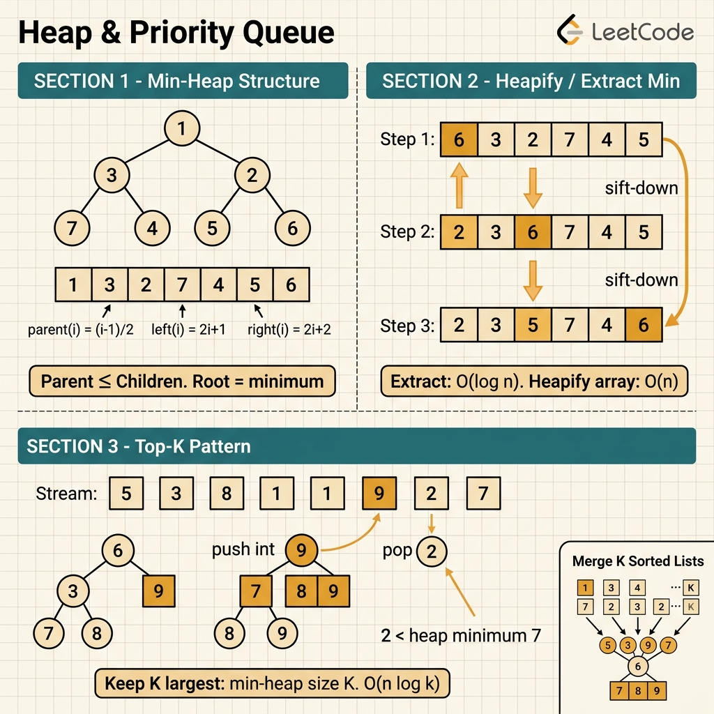

<!-- tags: leetcode, algorithms, coding-interview, stack-queue, heap -->
# 🏔️ Heap & Priority Queue

> Min-heap, max-heap, top-K, median stream, merge K sorted — Go container/heap

📅 Created: 2026-03-20 · 🔄 Updated: 2026-04-10 · ⏱️ 10 min read

| Aspect         | Detail                                         |
| -------------- | ---------------------------------------------- |
| **Complexity** | Push/Pop O(log n), Peek O(1)                   |
| **Use case**   | Top-K, streaming median, scheduling, Dijkstra  |
| **Go stdlib**  | `container/heap`                               |
| **LeetCode**   | #215, #295, #347, #355, #373, #621, #703, #973 |

---

### Interview template

> Copy-paste this snippet when solving heap problems in an interview.

```go
// ── Go Min-Heap (container/heap) ───────────────────────────────
import "container/heap"

type MinHeap []int
func (h MinHeap) Len() int            { return len(h) }
func (h MinHeap) Less(i, j int) bool  { return h[i] < h[j] }
func (h MinHeap) Swap(i, j int)       { h[i], h[j] = h[j], h[i] }
func (h *MinHeap) Push(x any)         { *h = append(*h, x.(int)) }
func (h *MinHeap) Pop() any           { old:=*h; x:=old[len(old)-1]; *h=old[:len(old)-1]; return x }

h := &MinHeap{}
heap.Init(h)
heap.Push(h, val)
top := heap.Pop(h).(int)
peek := (*h)[0]          // peek without pop

// Max-heap trick: push -val, pop and negate
```
```typescript
// ── TypeScript Min-Heap ────────────────────────────────────────
class MinHeap {
    private data: number[] = [];

    push(value: number): void {
        this.data.push(value);
        this.siftUp(this.data.length - 1);
    }

    pop(): number {
        const top = this.data[0];
        const last = this.data.pop()!;
        if (this.data.length > 0) {
            this.data[0] = last;
            this.siftDown(0);
        }
        return top;
    }

    peek(): number {
        return this.data[0];
    }

    size(): number {
        return this.data.length;
    }

    private siftUp(idx: number): void {
        while (idx > 0) {
            const parent = Math.floor((idx - 1) / 2);
            if (this.data[parent] <= this.data[idx]) break;
            [this.data[parent], this.data[idx]] = [this.data[idx], this.data[parent]];
            idx = parent;
        }
    }

    private siftDown(idx: number): void {
        while (true) {
            let smallest = idx;
            const left = idx * 2 + 1;
            const right = idx * 2 + 2;
            if (left < this.data.length && this.data[left] < this.data[smallest]) smallest = left;
            if (right < this.data.length && this.data[right] < this.data[smallest]) smallest = right;
            if (smallest === idx) break;
            [this.data[idx], this.data[smallest]] = [this.data[smallest], this.data[idx]];
            idx = smallest;
        }
    }
}

const heap = new MinHeap();
heap.push(val);
const top = heap.pop();
const peek = heap.peek();
```
```rust
// ── Rust Min-Heap via Reverse ──────────────────────────────────
use std::cmp::Reverse;
use std::collections::BinaryHeap;

let mut heap: BinaryHeap<Reverse<i32>> = BinaryHeap::new();
heap.push(Reverse(val));
let top = heap.pop().unwrap().0;
let peek = heap.peek().unwrap().0;
```
```cpp
// ── C++ Min-Heap via priority_queue ───────────────────────────
std::priority_queue<int, std::vector<int>, std::greater<int>> heap;
heap.push(val);
int top = heap.top();
heap.pop();
```
```python
# ── Python Min-Heap via heapq ──────────────────────────────────
import heapq

heap: list[int] = []
heapq.heappush(heap, val)
top = heapq.heappop(heap)
peek = heap[0]
```

---

## 1. DEFINE

When a problem asks for the "current best element" while data flows in, sorting everything is a red flag. The `Heap & Priority Queue` family exists exactly for this query type.

The difficulty lies beyond the basic push and pop API. You must understand what the heap promises. Only the top element is correct. The elements below lack a global order. If you forget this, you will misjudge both the algorithm and its complexity.

Core insight: **Heaps excel because they maintain the top candidate with low update costs, not because they are "nearly sorted".**

| Variant | When to use | Key idea |
| ------- | ------- | ------- |
| Min-heap / max-heap | Need the current smallest or largest element | The root always holds the highest priority element |
| Fixed-size heap | Top-K, Kth largest, smallest range | Keep only the K best candidates and discard the rest |
| Two-heaps | Median stream, balancing low and high halves | One heap stores the lower half, the other stores the upper half |
| Heap of tuples | Frequency, distance, deadline, score | Priority relies on a derived key rather than the raw value |

| Approach | Time | Space | When to choose |
| --- | --- | --- | --- |
| Full sort | O(n log n) | O(1) or O(n) | Choose when you need the complete sorted order |
| Size-k heap | O(n log k) | O(k) | Choose for top-k or kth-largest when k << n |
| Two-heaps balancing | O(log n) per update | O(n) | Choose when a stream requires a dynamic median or percentile |
| Priority queue simulation | Depends on push and pop counts | Depends on queue size | Choose for scheduling, shortest paths, or merging streams |

### 1.1 Quick recognition

- The prompt mentions top-k, merge k lists, k closest, stream median, or a scheduler.
- Data changes over time. You do not need a full sorted order at all times.
- The problem requires both "receiving new items" and "fetching the best item".

### 1.2 Invariants & Failure Modes

- A heap only guarantees that the top element is the best according to the current comparator.
- Your comparator or key must align with the problem objective. A wrong comparator breaks the entire logic.
- A common failure mode involves assuming a deep sorted order like an array. Another involves forgetting lazy deletion.

## 2. VISUAL

Heap problems split into four sub-families based on their primary use case. The image below helps you identify the active sub-family before writing code.

### Overview — Heap & Priority Queue



*Figure: Heap = O(log n) insert and extract. Use this when you need the best element continuously without a full sort.*

### Level 1 — Core intuition

```text
Top K Frequent (k = 3)
min-heap keeps only 3 best candidates

push 5(freq=9)  -> [5]
push 2(freq=4)  -> [2,5]
push 8(freq=7)  -> [2,5,8]
push 1(freq=3)  -> size=4 => pop smallest freq => remove 1

The root is always the weakest candidate in the current top-k.
```

*Caption*: Level 1 shows that a fixed-size heap does not store every element. It maintains exactly the K best candidates and uses the root as the eviction threshold.

### Level 2 — Detailed decision trace

- A min-heap of size `k` is the standard choice for top-k largest elements. The root acts as the weakest candidate kept.
- For two-heaps, the invariant ensures `size(left)` and `size(right)` differ by at most 1. All elements on the left are smaller than or equal to elements on the right.
- A priority queue only functions if the comparator encodes the optimization criteria. An incorrect comparator yields wrong logic.
- When a problem only needs the kth element, sorting the entire input is wasteful.

The heap structure reveals parent-child ordering. The code will now implement the heap interface in Go. Boilerplate is high, and a single wrong method breaks the structure.

## 3. CODE

Once the priority relation is clear, the code focuses on designing the comparator. You must push and pop at the right times. You also choose between one heap or two heaps.

### Problem 1: Basic — Kth Largest & Top K Frequent [LC #215, #347]
> **Objective**: Understand a fixed-size min-heap as a top-k filter instead of a full sort.
> **Approach**: Maintain a heap of size k. Discard any new element that fails to beat the root.
> **Example**: nums=[3,2,1,5,6,4], k=2 or Top K Frequent with a frequency map.
> **Complexity**: O(n log k) time. O(k) or O(n) space if frequency counting is required.

```go
// leetcode/heap_basic.go
package leetcode

import "container/heap"

// ═══════════════════════════════════════════
// Min-Heap for int
// ═══════════════════════════════════════════
type MinIntHeap []int

func (h MinIntHeap) Len() int            { return len(h) }
func (h MinIntHeap) Less(i, j int) bool  { return h[i] < h[j] }
func (h MinIntHeap) Swap(i, j int)       { h[i], h[j] = h[j], h[i] }
func (h *MinIntHeap) Push(x interface{}) { *h = append(*h, x.(int)) }
func (h *MinIntHeap) Pop() interface{} {
    old := *h
    n := len(old)
    x := old[n-1]
    *h = old[:n-1]
    return x
}

// ✅ LC #215: Kth Largest Element in an Array
// Min-heap of size K → root = kth largest
// Time: O(n log k), Space: O(k)
func findKthLargest(nums []int, k int) int {
    h := &MinIntHeap{}
    heap.Init(h)

    for _, num := range nums {
        heap.Push(h, num)
        if h.Len() > k {
            heap.Pop(h) // ⚠️ Remove smallest → keep K largest
        }
    }

    return (*h)[0] // ✅ Root = kth largest
}

// ✅ LC #347: Top K Frequent Elements
// Count freq + min-heap by freq, size K
// Time: O(n log k), Space: O(n)
type FreqItem struct {
    val, freq int
}
type FreqHeap []FreqItem

func (h FreqHeap) Len() int            { return len(h) }
func (h FreqHeap) Less(i, j int) bool  { return h[i].freq < h[j].freq }
func (h FreqHeap) Swap(i, j int)       { h[i], h[j] = h[j], h[i] }
func (h *FreqHeap) Push(x interface{}) { *h = append(*h, x.(FreqItem)) }
func (h *FreqHeap) Pop() interface{} {
    old := *h
    n := len(old)
    x := old[n-1]
    *h = old[:n-1]
    return x
}

func topKFrequent(nums []int, k int) []int {
    freq := make(map[int]int)
    for _, n := range nums {
        freq[n]++
    }

    h := &FreqHeap{}
    heap.Init(h)

    for val, f := range freq {
        heap.Push(h, FreqItem{val, f})
        if h.Len() > k {
            heap.Pop(h) // ✅ Keep top K frequent
        }
    }

    result := make([]int, k)
    for i := k - 1; i >= 0; i-- {
        result[i] = heap.Pop(h).(FreqItem).val
    }
    return result
}
```
```typescript
// leetcode/heap_basic.ts
class NumMinHeap {
    private data: number[] = [];

    push(value: number): void {
        this.data.push(value);
        this.up(this.data.length - 1);
    }

    pop(): number {
        const top = this.data[0];
        const last = this.data.pop()!;
        if (this.data.length) {
            this.data[0] = last;
            this.down(0);
        }
        return top;
    }

    peek(): number {
        return this.data[0];
    }

    size(): number {
        return this.data.length;
    }

    private up(i: number): void {
        while (i > 0) {
            const p = Math.floor((i - 1) / 2);
            if (this.data[p] <= this.data[i]) break;
            [this.data[p], this.data[i]] = [this.data[i], this.data[p]];
            i = p;
        }
    }

    private down(i: number): void {
        while (true) {
            let s = i;
            const l = i * 2 + 1;
            const r = i * 2 + 2;
            if (l < this.data.length && this.data[l] < this.data[s]) s = l;
            if (r < this.data.length && this.data[r] < this.data[s]) s = r;
            if (s === i) break;
            [this.data[i], this.data[s]] = [this.data[s], this.data[i]];
            i = s;
        }
    }
}

type FreqItem = { val: number; freq: number };

class FreqMinHeap {
    private data: FreqItem[] = [];

    push(value: FreqItem): void {
        this.data.push(value);
        this.up(this.data.length - 1);
    }

    pop(): FreqItem {
        const top = this.data[0];
        const last = this.data.pop()!;
        if (this.data.length) {
            this.data[0] = last;
            this.down(0);
        }
        return top;
    }

    size(): number {
        return this.data.length;
    }

    private up(i: number): void {
        while (i > 0) {
            const p = Math.floor((i - 1) / 2);
            if (this.data[p].freq <= this.data[i].freq) break;
            [this.data[p], this.data[i]] = [this.data[i], this.data[p]];
            i = p;
        }
    }

    private down(i: number): void {
        while (true) {
            let s = i;
            const l = i * 2 + 1;
            const r = i * 2 + 2;
            if (l < this.data.length && this.data[l].freq < this.data[s].freq) s = l;
            if (r < this.data.length && this.data[r].freq < this.data[s].freq) s = r;
            if (s === i) break;
            [this.data[i], this.data[s]] = [this.data[s], this.data[i]];
            i = s;
        }
    }
}

export function findKthLargest(nums: number[], k: number): number {
    const heap = new NumMinHeap();
    for (const num of nums) {
        heap.push(num);
        if (heap.size() > k) heap.pop();
    }
    return heap.peek();
}

export function topKFrequent(nums: number[], k: number): number[] {
    const freq = new Map<number, number>();
    for (const num of nums) freq.set(num, (freq.get(num) ?? 0) + 1);
    const heap = new FreqMinHeap();
    for (const [val, count] of freq) {
        heap.push({ val, freq: count });
        if (heap.size() > k) heap.pop();
    }
    const result = Array.from({ length: k }, () => 0);
    for (let i = k - 1; i >= 0; i--) result[i] = heap.pop().val;
    return result;
}
```
```rust
// leetcode/heap_basic.rs
use std::cmp::Reverse;
use std::collections::{BinaryHeap, HashMap};

pub fn find_kth_largest(nums: Vec<i32>, k: i32) -> i32 {
    let mut heap: BinaryHeap<Reverse<i32>> = BinaryHeap::new();
    for num in nums {
        heap.push(Reverse(num));
        if heap.len() > k as usize {
            heap.pop();
        }
    }
    heap.peek().unwrap().0
}

pub fn top_k_frequent(nums: Vec<i32>, k: i32) -> Vec<i32> {
    let mut freq = HashMap::new();
    for num in nums {
        *freq.entry(num).or_insert(0) += 1;
    }
    let mut heap: BinaryHeap<Reverse<(i32, i32)>> = BinaryHeap::new();
    for (val, count) in freq {
        heap.push(Reverse((count, val)));
        if heap.len() > k as usize {
            heap.pop();
        }
    }
    let mut result = Vec::new();
    while let Some(Reverse((_, val))) = heap.pop() {
        result.push(val);
    }
    result.reverse();
    result
}
```
```cpp
// leetcode/heap_basic.cpp
int findKthLargest(std::vector<int>& nums, int k) {
    std::priority_queue<int, std::vector<int>, std::greater<int>> heap;
    for (int num : nums) {
        heap.push(num);
        if (static_cast<int>(heap.size()) > k) heap.pop();
    }
    return heap.top();
}

std::vector<int> topKFrequent(std::vector<int>& nums, int k) {
    std::unordered_map<int, int> freq;
    for (int num : nums) ++freq[num];
    using Item = std::pair<int, int>;
    auto cmp = [](const Item& a, const Item& b) { return a.first > b.first; };
    std::priority_queue<Item, std::vector<Item>, decltype(cmp)> heap(cmp);
    for (auto [val, count] : freq) {
        heap.push({count, val});
        if (static_cast<int>(heap.size()) > k) heap.pop();
    }
    std::vector<int> result(k);
    for (int i = k - 1; i >= 0; --i) {
        result[i] = heap.top().second;
        heap.pop();
    }
    return result;
}
```
```python
# leetcode/heap_basic.py
import heapq
from collections import Counter

def find_kth_largest(nums: list[int], k: int) -> int:
    heap: list[int] = []
    for num in nums:
        heapq.heappush(heap, num)
        if len(heap) > k:
            heapq.heappop(heap)
    return heap[0]

def top_k_frequent(nums: list[int], k: int) -> list[int]:
    heap: list[tuple[int, int]] = []
    for val, count in Counter(nums).items():
        heapq.heappush(heap, (count, val))
        if len(heap) > k:
            heapq.heappop(heap)
    return [val for _, val in sorted(heap, reverse=True)]
```

> **Why?** A min-heap of size k works because the root is always the weakest element in the current top-k. Every new element only compares against the root to enter the top-k. This avoids maintaining a full sort.

> **Conclusion**: This **Basic** example demonstrates using `Kth Largest & Top K Frequent [LC #215, #347]` to solve LeetCode problems without skipping reasoning. Move to the next example for tighter constraints.

> **✅ Achieved**: Kth largest in O(n log k) time. Top K frequent in O(n log k) time.
> **⚠️ Caveat**: Use a min-heap of size K for "top K largest". The root is always the kth largest.

---
### Problem 2: Intermediate — K Closest Points [LC #973]
> **Objective**: Combine a priority queue with a comparator based on distance or score.
> **Approach**: Use a max-heap of size k or a global min-heap depending on the stream type.
> **Example**: points=[[1,3],[-2,2],[5,8]], k=1 -> keep the point closest to the origin.
> **Complexity**: O(n log k) time for a fixed-size heap. O(n log n) time to build a full heap and pop k times.

```go
// leetcode/heap_intermediate.go
package leetcode

import "container/heap"

// ✅ LC #973: K Closest Points to Origin
// Max-heap by distance, size K → keep K closest
// Time: O(n log k), Space: O(k)
type PointHeap [][]int

func (h PointHeap) Len() int { return len(h) }
func (h PointHeap) Less(i, j int) bool {
    // ⚠️ MAX heap (reverse for closest = pop farthest)
    di := h[i][0]*h[i][0] + h[i][1]*h[i][1]
    dj := h[j][0]*h[j][0] + h[j][1]*h[j][1]
    return di > dj // ⚠️ Greater = max-heap
}
func (h PointHeap) Swap(i, j int)       { h[i], h[j] = h[j], h[i] }
func (h *PointHeap) Push(x interface{}) { *h = append(*h, x.([]int)) }
func (h *PointHeap) Pop() interface{} {
    old := *h
    n := len(old)
    x := old[n-1]
    *h = old[:n-1]
    return x
}

func kClosest(points [][]int, k int) [][]int {
    h := &PointHeap{}
    heap.Init(h)

    for _, p := range points {
        heap.Push(h, p)
        if h.Len() > k {
            heap.Pop(h) // ✅ Remove farthest
        }
    }

    result := make([][]int, h.Len())
    for i := range result {
        result[i] = heap.Pop(h).([]int)
    }
    return result
}
```
```typescript
// leetcode/heap_intermediate.ts
type Point = [number, number];

class PointMaxHeap {
    private data: Point[] = [];

    private dist(p: Point): number {
        return p[0] * p[0] + p[1] * p[1];
    }

    push(value: Point): void {
        this.data.push(value);
        this.up(this.data.length - 1);
    }

    pop(): Point {
        const top = this.data[0];
        const last = this.data.pop()!;
        if (this.data.length) {
            this.data[0] = last;
            this.down(0);
        }
        return top;
    }

    size(): number {
        return this.data.length;
    }

    private up(i: number): void {
        while (i > 0) {
            const p = Math.floor((i - 1) / 2);
            if (this.dist(this.data[p]) >= this.dist(this.data[i])) break;
            [this.data[p], this.data[i]] = [this.data[i], this.data[p]];
            i = p;
        }
    }

    private down(i: number): void {
        while (true) {
            let s = i;
            const l = i * 2 + 1;
            const r = i * 2 + 2;
            if (l < this.data.length && this.dist(this.data[l]) > this.dist(this.data[s])) s = l;
            if (r < this.data.length && this.dist(this.data[r]) > this.dist(this.data[s])) s = r;
            if (s === i) break;
            [this.data[i], this.data[s]] = [this.data[s], this.data[i]];
            i = s;
        }
    }
}

export function kClosest(points: number[][], k: number): number[][] {
    const heap = new PointMaxHeap();
    for (const point of points as Point[]) {
        heap.push(point);
        if (heap.size() > k) heap.pop();
    }
    const result: number[][] = [];
    while (heap.size() > 0) result.push(heap.pop());
    return result;
}
```
```rust
// leetcode/heap_intermediate.rs
use std::collections::BinaryHeap;

pub fn k_closest(points: Vec<Vec<i32>>, k: i32) -> Vec<Vec<i32>> {
    let mut heap: BinaryHeap<(i32, Vec<i32>)> = BinaryHeap::new();
    for point in points {
        let dist = point[0] * point[0] + point[1] * point[1];
        heap.push((dist, point));
        if heap.len() > k as usize {
            heap.pop();
        }
    }
    heap.into_iter().map(|(_, point)| point).collect()
}
```
```cpp
// leetcode/heap_intermediate.cpp
std::vector<std::vector<int>> kClosest(std::vector<std::vector<int>>& points, int k) {
    auto dist = [](const std::vector<int>& p) { return p[0] * p[0] + p[1] * p[1]; };
    auto cmp = [&](const std::vector<int>& a, const std::vector<int>& b) { return dist(a) < dist(b); };
    std::priority_queue<std::vector<int>, std::vector<std::vector<int>>, decltype(cmp)> heap(cmp);
    for (const auto& point : points) {
        heap.push(point);
        if (static_cast<int>(heap.size()) > k) heap.pop();
    }
    std::vector<std::vector<int>> result;
    while (!heap.empty()) {
        result.push_back(heap.top());
        heap.pop();
    }
    return result;
}
```
```python
# leetcode/heap_intermediate.py
import heapq

def k_closest(points: list[list[int]], k: int) -> list[list[int]]:
    heap: list[tuple[int, list[int]]] = []
    for point in points:
        dist = -(point[0] * point[0] + point[1] * point[1])
        heapq.heappush(heap, (dist, point))
        if len(heap) > k:
            heapq.heappop(heap)
    return [point for _, point in heap]
```

> **Why?** In the Intermediate level, the priority key matters more than the stored value type. The queue runs but yields wrong results if the comparator fails to encode the distance or score. The heap only preserves order based on the comparator.

> **Conclusion**: This **Intermediate** example demonstrates using `K Closest Points [LC #973]` to solve LeetCode problems without skipping reasoning. Move to the next example for tighter constraints.

---
### Problem 3: Advanced — Find Median from Data Stream [LC #295]
> **Objective**: Use two balanced heaps to return an online median after each insertion.
> **Approach**: A max-heap holds the lower half. A min-heap holds the upper half. Rebalance after each update.
> **Example**: Stream 1, 2, 3, 4 -> the median shifts after each insertion.
> **Complexity**: O(log n) time per insertion. O(1) time to query the median. O(n) space.

```go
// leetcode/median_finder.go
package leetcode

import "container/heap"

// ✅ LC #295: Find Median from Data Stream (HARD)
// Two heaps:
//   maxHeap → lower half (root = max of lower)
//   minHeap → upper half (root = min of upper)
// Invariant: maxHeap.Len() == minHeap.Len() or maxHeap.Len() == minHeap.Len() + 1
type MaxIntHeap []int

func (h MaxIntHeap) Len() int            { return len(h) }
func (h MaxIntHeap) Less(i, j int) bool  { return h[i] > h[j] } // ⚠️ Max-heap
func (h MaxIntHeap) Swap(i, j int)       { h[i], h[j] = h[j], h[i] }
func (h *MaxIntHeap) Push(x interface{}) { *h = append(*h, x.(int)) }
func (h *MaxIntHeap) Pop() interface{} {
    old := *h
    n := len(old)
    x := old[n-1]
    *h = old[:n-1]
    return x
}

type MedianFinder struct {
    lower *MaxIntHeap // ✅ Max-heap: stores lower half
    upper *MinIntHeap // ✅ Min-heap: stores upper half
}

func NewMedianFinder() MedianFinder {
    lo := &MaxIntHeap{}
    up := &MinIntHeap{}
    heap.Init(lo)
    heap.Init(up)
    return MedianFinder{lower: lo, upper: up}
}

func (mf *MedianFinder) AddNum(num int) {
    // ✅ Step 1: Add to lower (max-heap)
    heap.Push(mf.lower, num)

    // ✅ Step 2: Ensure lower.top ≤ upper.top
    if mf.upper.Len() > 0 && (*mf.lower)[0] > (*mf.upper)[0] {
        val := heap.Pop(mf.lower).(int)
        heap.Push(mf.upper, val)
    }

    // ✅ Step 3: Balance sizes (lower can be at most 1 more)
    if mf.lower.Len() > mf.upper.Len()+1 {
        val := heap.Pop(mf.lower).(int)
        heap.Push(mf.upper, val)
    }
    if mf.upper.Len() > mf.lower.Len() {
        val := heap.Pop(mf.upper).(int)
        heap.Push(mf.lower, val)
    }
}

func (mf *MedianFinder) FindMedian() float64 {
    if mf.lower.Len() > mf.upper.Len() {
        return float64((*mf.lower)[0])
    }
    return float64((*mf.lower)[0]+(*mf.upper)[0]) / 2.0
}
```
```typescript
// leetcode/median_finder.ts
class Heap {
    constructor(private readonly cmp: (a: number, b: number) => boolean, private readonly data: number[] = []) {}

    push(value: number): void {
        this.data.push(value);
        this.up(this.data.length - 1);
    }

    pop(): number {
        const top = this.data[0];
        const last = this.data.pop()!;
        if (this.data.length) {
            this.data[0] = last;
            this.down(0);
        }
        return top;
    }

    peek(): number {
        return this.data[0];
    }

    size(): number {
        return this.data.length;
    }

    private up(i: number): void {
        while (i > 0) {
            const p = Math.floor((i - 1) / 2);
            if (this.cmp(this.data[p], this.data[i])) break;
            [this.data[p], this.data[i]] = [this.data[i], this.data[p]];
            i = p;
        }
    }

    private down(i: number): void {
        while (true) {
            let s = i;
            const l = i * 2 + 1;
            const r = i * 2 + 2;
            if (l < this.data.length && !this.cmp(this.data[s], this.data[l])) s = l;
            if (r < this.data.length && !this.cmp(this.data[s], this.data[r])) s = r;
            if (s === i) break;
            [this.data[i], this.data[s]] = [this.data[s], this.data[i]];
            i = s;
        }
    }
}

export class MedianFinder {
    private lower = new Heap((a, b) => a >= b);
    private upper = new Heap((a, b) => a <= b);

    addNum(num: number): void {
        this.lower.push(num);
        if (this.upper.size() > 0 && this.lower.peek() > this.upper.peek()) {
            this.upper.push(this.lower.pop());
        }
        if (this.lower.size() > this.upper.size() + 1) this.upper.push(this.lower.pop());
        if (this.upper.size() > this.lower.size()) this.lower.push(this.upper.pop());
    }

    findMedian(): number {
        if (this.lower.size() > this.upper.size()) return this.lower.peek();
        return (this.lower.peek() + this.upper.peek()) / 2;
    }
}
```
```rust
// leetcode/median_finder.rs
use std::cmp::Reverse;
use std::collections::BinaryHeap;

pub struct MedianFinder {
    lower: BinaryHeap<i32>,
    upper: BinaryHeap<Reverse<i32>>,
}

impl MedianFinder {
    pub fn new() -> Self {
        Self { lower: BinaryHeap::new(), upper: BinaryHeap::new() }
    }

    pub fn add_num(&mut self, num: i32) {
        self.lower.push(num);
        if let Some(&Reverse(top)) = self.upper.peek() {
            if self.lower.peek().copied().unwrap() > top {
                self.upper.push(Reverse(self.lower.pop().unwrap()));
            }
        }
        if self.lower.len() > self.upper.len() + 1 {
            self.upper.push(Reverse(self.lower.pop().unwrap()));
        }
        if self.upper.len() > self.lower.len() {
            self.lower.push(self.upper.pop().unwrap().0);
        }
    }

    pub fn find_median(&self) -> f64 {
        if self.lower.len() > self.upper.len() {
            *self.lower.peek().unwrap() as f64
        } else {
            (*self.lower.peek().unwrap() + self.upper.peek().unwrap().0) as f64 / 2.0
        }
    }
}
```
```cpp
// leetcode/median_finder.cpp
class MedianFinder {
public:
    void AddNum(int num) {
        lower.push(num);
        if (!upper.empty() && lower.top() > upper.top()) {
            upper.push(lower.top());
            lower.pop();
        }
        if (lower.size() > upper.size() + 1) {
            upper.push(lower.top());
            lower.pop();
        }
        if (upper.size() > lower.size()) {
            lower.push(upper.top());
            upper.pop();
        }
    }

    double FindMedian() const {
        if (lower.size() > upper.size()) return lower.top();
        return (lower.top() + upper.top()) / 2.0;
    }

private:
    std::priority_queue<int> lower;
    std::priority_queue<int, std::vector<int>, std::greater<int>> upper;
};
```
```python
# leetcode/median_finder.py
import heapq

class MedianFinder:
    def __init__(self) -> None:
        self.lower: list[int] = []
        self.upper: list[int] = []

    def add_num(self, num: int) -> None:
        heapq.heappush(self.lower, -num)
        if self.upper and -self.lower[0] > self.upper[0]:
            heapq.heappush(self.upper, -heapq.heappop(self.lower))
        if len(self.lower) > len(self.upper) + 1:
            heapq.heappush(self.upper, -heapq.heappop(self.lower))
        if len(self.upper) > len(self.lower):
            heapq.heappush(self.lower, -heapq.heappop(self.upper))

    def find_median(self) -> float:
        if len(self.lower) > len(self.upper):
            return float(-self.lower[0])
        return (-self.lower[0] + self.upper[0]) / 2.0
```

> **Why?** The median stream passes because two heaps divide the data into two relatively ordered halves. You avoid sorting the data repeatedly. The size and ordering invariants ensure the median stays at the root or averages the two roots.

> **Conclusion**: This **Advanced** example demonstrates using `Find Median from Data Stream [LC #295]` to solve LeetCode problems without skipping reasoning. Move to the next example for tighter constraints.

> **✅ Achieved**: Streaming median with O(log n) insertion and O(1) retrieval.
> **⚠️ Caveat**: Balance invariant requires `lower.Len()` to be either `upper.Len()` or `upper.Len() + 1`.

---
Go heap code is more verbose than Python or Java because it implements five methods. Verbosity creates bugs. Type assertions and the `Less()` direction often cause issues.

## 4. PITFALLS

Heap errors rarely come from a forgotten `pop`. They stem from incorrect priority definitions or using a heap when a global order is required.

| # | Severity | Defect | Consequence | Fix |
|---|----------|-----|---------|-----|
| 1 | 🔴 Fatal | Go `heap.Pop` returns `interface{}` | Wrong result or runtime error | Type assert: `heap.Pop(h).(int)` |
| 2 | 🟡 Common | Min-heap for "K largest" is correct | Wrong result or runtime error | Max-heap for "K smallest" feels counter-intuitive |
| 3 | 🟡 Common | Peek with `(*h)[0]` is not `heap.Pop` | Wrong result or runtime error | Pop removes the item. `(*h)[0]` only peeks |
| 4 | 🔵 Minor | Forgetting `heap.Init()` before usage | Wrong result or runtime error | You MUST initialize to establish the heap invariant |
| 5 | 🔵 Minor | Median: add to the wrong heap first | Wrong result or runtime error | Always add to the lower heap first, then rebalance |

### 🔴 Pitfall #1 — Go heap.Pop returns interface{}, missing type assertion

Code using container/heap:

```go
val := heap.Pop(h)  // val has type interface{}, not int
fmt.Println(val + 1) // ← compile error: cannot use + with interface{}
```

Go generics do not apply to container/heap yet. Every `Pop()` returns `interface{}`. You must type assert with `.(int)` or `.(Item)`. Forgetting this causes a compile error or a runtime panic.

**Fix**: `val := heap.Pop(h).(int)`. Always type assert immediately after a pop. If using a custom struct, use `item := heap.Pop(h).(*Item)`.

---

## 5. REF

| Resource | Link | Difficulty |
| --- | --- | --- |
| LC #215 Kth Largest | [leetcode.com/problems/kth-largest-element-in-an-array](https://leetcode.com/problems/kth-largest-element-in-an-array/) | 🟡 Medium |
| LC #295 Find Median | [leetcode.com/problems/find-median-from-data-stream](https://leetcode.com/problems/find-median-from-data-stream/) | 🔴 Hard |
| Go container/heap | [pkg.go.dev/container/heap](https://pkg.go.dev/container/heap) | — |

---

## 6. RECOMMEND

Once priority-driven extraction is clear, decide when a heap is the right primitive for the best-next frontier. Sometimes you should switch to a specialized partition or graph frontier.

| Expansion | When to use | Reason | File / Link |
| --- | --- | --- | --- |
| Sorting & Searching | Quickselect kth element | Yields O(n) average time instead of O(n log n) | [20-sorting-searching](./20-sorting-searching.md) |
| Design | LRU/LFU cache uses a heap variant | Design patterns combined with heaps | [16-design](./16-design.md) |
| Advanced Graph | Dijkstra uses a heap | Required for weighted shortest paths | [19-advanced-graph](./19-advanced-graph.md) |
| Two Pointers | Replace window max with a deque | Compares approach choices | [01-two-pointers](./01-two-pointers-sliding-window.md) |

---

## 7. QUICK REF

| Situation / Signal | Pattern / Approach | Complexity | When to use | Warning |
|--------------------|--------------------|------------|----------|----------|
| top-k / kth largest | Min-heap of size k | O(n log k) time. O(k) space | Kth largest, top-k frequent | Min-heap for top-k. Max-heap for bottom-k |
| streaming median | Two heaps: max and min | O(log n) time per operation | Running median, percentile | Balance sizes: \|maxH\| - \|minH\| ≤ 1 |
| merge k sorted | Min-heap of k heads | O(n log k) time. O(k) space | Merge k lists or arrays | Heap entry equals (value, listIdx, elemIdx) |
| schedule / best-next | Greedy plus heap | O(n log n) time. O(n) space | Task scheduler, string reorganization | Pop, process, then push back if remaining |
| sliding window max | Monotonic deque instead of heap | O(n) time. O(k) space | LC #239 prefers deque over heap | Heap O(n log n) is overkill for window max |

---

Return to the opening "top-K" problem. You now know that a heap maintains the exact top candidate in O(log n) time. Only the top is strictly ordered. The remaining elements lack a global sequence.

---

**Links**: [← Bit Manipulation](./10-bit-manipulation-math.md) · [→ Trie](./12-trie.md)
