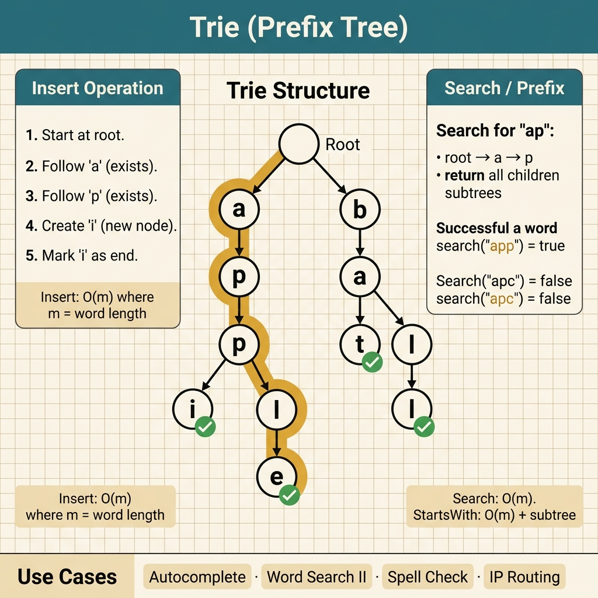

<!-- tags: leetcode, algorithms, coding-interview, tree, trie -->
# 🌳 Trie (Prefix Tree)

> Prefix matching, autocomplete, word search — data structure for string prefix operations

📅 Created: 2026-03-20 · 🔄 Updated: 2026-04-10 · ⏱️ 9 min read

| Aspect         | Detail                                     |
| -------------- | ------------------------------------------ |
| **Complexity** | Insert/Search O(L), L = word length        |
| **Use case**   | Autocomplete, spell check, prefix matching |
| **Go stdlib**  | No built-in; custom struct                 |
| **LeetCode**   | #208, #211, #212, #648, #720               |

---

### Interview template

> Copy-paste this snippet when encountering Trie problems in an interview.

```go
// ── Trie Node & Operations ──────────────────────────────────────
type TrieNode struct {
    children [26]*TrieNode
    isEnd    bool
}

type Trie struct{ root *TrieNode }

func (t *Trie) Insert(word string) {
    node := t.root
    for _, ch := range word {
        idx := ch - 'a'
        if node.children[idx] == nil {
            node.children[idx] = &TrieNode{}
        }
        node = node.children[idx]
    }
    node.isEnd = true
}

func (t *Trie) Search(word string) bool {
    node := t.root
    for _, ch := range word {
        idx := ch - 'a'
        if node.children[idx] == nil { return false }
        node = node.children[idx]
    }
    return node.isEnd
}
```
```typescript
// ── Trie Node & Operations ──────────────────────────────────────
class TrieNode {
  children: Array<TrieNode | null> = Array(26).fill(null);
  isEnd = false;
}

class Trie {
  root = new TrieNode();

  insert(word: string): void {
    let node = this.root;
    for (const ch of word) {
      const idx = ch.charCodeAt(0) - 97;
      node.children[idx] ??= new TrieNode();
      node = node.children[idx]!;
    }
    node.isEnd = true;
  }

  search(word: string): boolean {
    let node: TrieNode | null = this.root;
    for (const ch of word) {
      node = node.children[ch.charCodeAt(0) - 97];
      if (!node) return false;
    }
    return node.isEnd;
  }
}
```
```rust
// ── Trie Node & Operations ──────────────────────────────────────
#[derive(Default)]
struct TrieNode {
    children: [Option<Box<TrieNode>>; 26],
    is_end: bool,
}

#[derive(Default)]
struct Trie {
    root: TrieNode,
}

impl Trie {
    fn insert(&mut self, word: &str) {
        let mut node = &mut self.root;
        for ch in word.bytes() {
            let idx = (ch - b'a') as usize;
            node = node.children[idx].get_or_insert_with(|| Box::new(TrieNode::default()));
        }
        node.is_end = true;
    }

    fn search(&self, word: &str) -> bool {
        let mut node = &self.root;
        for ch in word.bytes() {
            let idx = (ch - b'a') as usize;
            match node.children[idx].as_deref() {
                Some(next) => node = next,
                None => return false,
            }
        }
        node.is_end
    }
}
```
```cpp
// ── Trie Node & Operations ──────────────────────────────────────
#include <array>
#include <memory>
#include <string>

struct TrieNode {
    std::array<std::unique_ptr<TrieNode>, 26> children{};
    bool is_end = false;
};

class Trie {
public:
    void insert(const std::string& word) {
        TrieNode* node = &root_;
        for (char ch : word) {
            int idx = ch - 'a';
            if (!node->children[idx]) node->children[idx] = std::make_unique<TrieNode>();
            node = node->children[idx].get();
        }
        node->is_end = true;
    }

    bool search(const std::string& word) const {
        const TrieNode* node = &root_;
        for (char ch : word) {
            node = node->children[ch - 'a'].get();
            if (!node) return false;
        }
        return node->is_end;
    }

private:
    TrieNode root_;
};
```
```python
# ── Trie Node & Operations ──────────────────────────────────────
class TrieNode:
    def __init__(self) -> None:
        self.children: list[TrieNode | None] = [None] * 26
        self.is_end = False

class Trie:
    def __init__(self) -> None:
        self.root = TrieNode()

    def insert(self, word: str) -> None:
        node = self.root
        for ch in word:
            idx = ord(ch) - ord("a")
            if node.children[idx] is None:
                node.children[idx] = TrieNode()
            node = node.children[idx]
        node.is_end = True

    def search(self, word: str) -> bool:
        node = self.root
        for ch in word:
            idx = ord(ch) - ord("a")
            node = node.children[idx]
            if node is None:
                return False
        return node.is_end
```

---

## 1. DEFINE

A hash map or set handles some string searches well. However, they become clumsy when handling prefix queries, wildcards, or dictionary traversals. The `Trie` family appears when the shared prefix holds more value than individual strings.

Many developers avoid the trie because they view it as a verbose character tree. The representation is the true core. A prefix becomes a path in the tree. Queries that normally rescan entire words instead traverse or stop at exact nodes.

Core insight: **A trie shines when shared prefixes form the actual problem domain. This justifies the memory cost in exchange for faster structural queries.**

| Variant | When to use | Key idea |
| ------- | ------- | ------- |
| Basic trie | Insert, search, or startsWith queries | Each edge represents a character. A node stores an end flag |
| Trie + wildcard | Word Dictionary or simple regex | Allows a wide branching step when a wildcard occurs |
| Trie + DFS on board | Word Search II or Boggle-like | Run DFS on a grid while pruning incorrect trie prefixes |
| Compressed / map-based trie | Large alphabet or sparse children | Use a map instead of a fixed array to save memory |

| Approach | Time | Space | When to choose |
| --- | --- | --- | --- |
| Array children[26] | O(L) per operation | O(total characters · alphabet) | Choose for a small fixed alphabet needing maximum speed |
| HashMap children | O(L) expected time | Less memory waste | Choose for a large or sparse alphabet |
| Trie + DFS pruning | O(board search with prune) | O(trie + recursion stack) | Choose when finding multiple words on the same board |
| Prefix set / hash fallback | O(L) or worse depending on query | Smaller than a trie | Choose when prefix queries are rare and memory is strict |

### 1.1 Quick recognition

- The prompt involves autocomplete, prefix search, a wildcard dictionary, word search II, or word replacements.
- Each new character pulls you into a deeper prefix node.
- A trie is highly suspect if the problem shares prefixes among words instead of treating them independently.

### 1.2 Invariants & Failure Modes

- Each node must represent exactly one prefix and its attached metadata.
- Reaching the end of a path does not confirm a word exists. You must verify the `isEnd` flag.
- A common failure involves using a trie without exploiting shared prefixes. Another is forgetting to prune state during board backtracking.

## 2. VISUAL

Trie problems revolve around the prefix tree. The image below categorizes three main operations to help you select the correct approach.

### Overview — Trie



*Figure: Trie = a tree specialized for string prefixes. O(m) time per operation, where m is the word length.*

### Level 1 — Core intuition

```text
Insert: cat, car, dog
root
├─ c
│  └─ a
│     ├─ t (isEnd)
│     └─ r (isEnd)
└─ d
   └─ o
      └─ g (isEnd)

The shared prefix "ca" is reused across multiple words.
```

*Caption*: Level 1 demonstrates the biggest advantage of a trie. Words with the same prefix share a path. The search or startsWith operations simply follow that prefix.

### Level 2 — Detailed decision trace

- Each node only stores two items. It holds edges to the next characters and an `isEnd` flag.
- The `search(word)` and `startsWith(prefix)` methods differ only in their termination condition. One requires `isEnd`, and the other does not.
- For Word Search II, the trie stops the DFS when the prefix leaves the dictionary. This cuts down explosive board branches.
- The biggest tradeoff is memory. Array children are fast but waste space if the alphabet is sparse.

The trie structure exposes prefix sharing. The code will implement insert, search, and startsWith methods. The `isEnd` flag is the most forgotten boundary.

## 3. CODE

Once the prefix representation is clear, the code focuses on managing nodes, children, and metadata. We progress from basic insertion to wildcards and board searches.

### Problem 1: Basic — Implement Trie [LC #208]
> **Objective**: Build the exact insert, search, and startsWith APIs. Understand prefix reuse.
> **Approach**: Use a trie node with children and an isEnd flag. Traverse characters and create nodes.
> **Example**: insert(apple), search(app), startsWith(app).
> **Complexity**: O(L) time for queries. O(total characters) space.

```go
// leetcode/trie.go
package leetcode

// ✅ LC #208: Implement Trie (Prefix Tree)
type TrieNode struct {
    children [26]*TrieNode
    isEnd    bool
}

type Trie struct {
    root *TrieNode
}

func NewTrie() Trie {
    return Trie{root: &TrieNode{}}
}

// ✅ Insert word: O(L)
func (t *Trie) Insert(word string) {
    node := t.root
    for _, ch := range word {
        idx := ch - 'a'
        if node.children[idx] == nil {
            node.children[idx] = &TrieNode{}
        }
        node = node.children[idx]
    }
    node.isEnd = true
}

// ✅ Search exact word: O(L)
func (t *Trie) Search(word string) bool {
    node := t.findNode(word)
    return node != nil && node.isEnd
}

// ✅ Check prefix exists: O(L)
func (t *Trie) StartsWith(prefix string) bool {
    return t.findNode(prefix) != nil
}

func (t *Trie) findNode(prefix string) *TrieNode {
    node := t.root
    for _, ch := range prefix {
        idx := ch - 'a'
        if node.children[idx] == nil {
            return nil
        }
        node = node.children[idx]
    }
    return node
}
```
```typescript
// leetcode/trie.ts
class TrieNode {
  children: Array<TrieNode | null> = Array(26).fill(null);
  isEnd = false;
}

class Trie {
  private root = new TrieNode();

  insert(word: string): void {
    let node = this.root;
    for (const ch of word) {
      const idx = ch.charCodeAt(0) - 97;
      node.children[idx] ??= new TrieNode();
      node = node.children[idx]!;
    }
    node.isEnd = true;
  }

  search(word: string): boolean {
    const node = this.findNode(word);
    return !!node && node.isEnd;
  }

  startsWith(prefix: string): boolean {
    return this.findNode(prefix) !== null;
  }

  private findNode(prefix: string): TrieNode | null {
    let node: TrieNode | null = this.root;
    for (const ch of prefix) {
      node = node.children[ch.charCodeAt(0) - 97];
      if (!node) return null;
    }
    return node;
  }
}
```
```rust
// leetcode/trie.rs
#[derive(Default)]
struct TrieNode {
    children: [Option<Box<TrieNode>>; 26],
    is_end: bool,
}

#[derive(Default)]
struct Trie {
    root: TrieNode,
}

impl Trie {
    fn insert(&mut self, word: &str) {
        let mut node = &mut self.root;
        for ch in word.bytes() {
            let idx = (ch - b'a') as usize;
            node = node.children[idx].get_or_insert_with(|| Box::new(TrieNode::default()));
        }
        node.is_end = true;
    }

    fn search(&self, word: &str) -> bool {
        self.find_node(word).is_some_and(|node| node.is_end)
    }

    fn starts_with(&self, prefix: &str) -> bool {
        self.find_node(prefix).is_some()
    }

    fn find_node(&self, prefix: &str) -> Option<&TrieNode> {
        let mut node = &self.root;
        for ch in prefix.bytes() {
            let idx = (ch - b'a') as usize;
            node = node.children[idx].as_deref()?;
        }
        Some(node)
    }
}
```
```cpp
// leetcode/trie.cpp
#include <array>
#include <memory>
#include <string>

struct TrieNode {
    std::array<std::unique_ptr<TrieNode>, 26> children{};
    bool is_end = false;
};

class Trie {
public:
    void insert(const std::string& word) {
        TrieNode* node = &root_;
        for (char ch : word) {
            int idx = ch - 'a';
            if (!node->children[idx]) node->children[idx] = std::make_unique<TrieNode>();
            node = node->children[idx].get();
        }
        node->is_end = true;
    }

    bool search(const std::string& word) const {
        const TrieNode* node = find_node(word);
        return node && node->is_end;
    }

    bool starts_with(const std::string& prefix) const {
        return find_node(prefix) != nullptr;
    }

private:
    const TrieNode* find_node(const std::string& prefix) const {
        const TrieNode* node = &root_;
        for (char ch : prefix) {
            node = node->children[ch - 'a'].get();
            if (!node) return nullptr;
        }
        return node;
    }

    TrieNode root_;
};
```
```python
# leetcode/trie.py
class TrieNode:
    def __init__(self) -> None:
        self.children: list[TrieNode | None] = [None] * 26
        self.is_end = False

class Trie:
    def __init__(self) -> None:
        self.root = TrieNode()

    def insert(self, word: str) -> None:
        node = self.root
        for ch in word:
            idx = ord(ch) - ord("a")
            if node.children[idx] is None:
                node.children[idx] = TrieNode()
            node = node.children[idx]
        node.is_end = True

    def search(self, word: str) -> bool:
        node = self._find_node(word)
        return node is not None and node.is_end

    def starts_with(self, prefix: str) -> bool:
        return self._find_node(prefix) is not None

    def _find_node(self, prefix: str) -> TrieNode | None:
        node = self.root
        for ch in prefix:
            idx = ord(ch) - ord("a")
            node = node.children[idx]
            if node is None:
                return None
        return node
```

> **Why?** A trie beats a hash set when querying prefixes often. Each query follows the corresponding prefix path instead of comparing full strings. The `isEnd` flag is crucial. A prefix path does not mean the complete word exists.

> **Conclusion**: This **Basic** example demonstrates using `Implement Trie [LC #208]` to solve LeetCode problems without skipping reasoning. Move to the next example for tighter constraints.

### Problem 2: Advanced — Word Search II [LC #212]
> **Objective**: Combine a trie with DFS on a board to find words and prune early.
> **Approach**: Build a trie from the dictionary. Run DFS on the board alongside the trie path.
> **Example**: A character board and a word list. Output words found on the board.
> **Complexity**: Worst-case time remains large, but prefix pruning drastically cuts useless branches.

```go
// leetcode/word_search_ii.go
package leetcode

// ✅ LC #212: Word Search II (HARD)
// Build trie from words, then DFS on grid matching trie paths
func findWords(board [][]byte, words []string) []string {
    trie := NewTrie()
    for _, w := range words {
        trie.Insert(w)
    }

    rows, cols := len(board), len(board[0])
    result := map[string]bool{}
    dirs := [4][2]int{{-1, 0}, {1, 0}, {0, -1}, {0, 1}}

    var dfs func(r, c int, node *TrieNode, path []byte)
    dfs = func(r, c int, node *TrieNode, path []byte) {
        if r < 0 || r >= rows || c < 0 || c >= cols || board[r][c] == '#' {
            return
        }

        ch := board[r][c]
        child := node.children[ch-'a']
        if child == nil {
            return // ⚠️ No trie path → prune
        }

        path = append(path, ch)
        if child.isEnd {
            result[string(path)] = true
            // ⚠️ Don't return — might have longer words
        }

        board[r][c] = '#' // Mark visited
        for _, d := range dirs {
            dfs(r+d[0], c+d[1], child, path)
        }
        board[r][c] = ch // Restore
    }

    for r := 0; r < rows; r++ {
        for c := 0; c < cols; c++ {
            dfs(r, c, trie.root, []byte{})
        }
    }

    keys := make([]string, 0, len(result))
    for k := range result {
        keys = append(keys, k)
    }
    return keys
}
```
```typescript
// leetcode/word_search_ii.ts
class TrieNode {
  children: Array<TrieNode | null> = Array(26).fill(null);
  isEnd = false;
}

function buildTrie(words: string[]): TrieNode {
  const root = new TrieNode();
  for (const word of words) {
    let node = root;
    for (const ch of word) {
      const idx = ch.charCodeAt(0) - 97;
      node.children[idx] ??= new TrieNode();
      node = node.children[idx]!;
    }
    node.isEnd = true;
  }
  return root;
}

function findWords(board: string[][], words: string[]): string[] {
  const root = buildTrie(words);
  const rows = board.length;
  const cols = board[0].length;
  const result = new Set<string>();
  const dirs = [[-1, 0], [1, 0], [0, -1], [0, 1]];

  const dfs = (r: number, c: number, node: TrieNode, path: string): void => {
    if (r < 0 || r >= rows || c < 0 || c >= cols || board[r][c] === "#") return;
    const ch = board[r][c];
    const child = node.children[ch.charCodeAt(0) - 97];
    if (!child) return;

    const nextPath = path + ch;
    if (child.isEnd) result.add(nextPath);

    board[r][c] = "#";
    for (const [dr, dc] of dirs) dfs(r + dr, c + dc, child, nextPath);
    board[r][c] = ch;
  };

  for (let r = 0; r < rows; r++) {
    for (let c = 0; c < cols; c++) dfs(r, c, root, "");
  }
  return [...result];
}
```
```rust
// leetcode/word_search_ii.rs
use std::collections::HashSet;

#[derive(Default)]
struct TrieNode {
    children: [Option<Box<TrieNode>>; 26],
    is_end: bool,
}

fn insert(root: &mut TrieNode, word: &str) {
    let mut node = root;
    for ch in word.bytes() {
        let idx = (ch - b'a') as usize;
        node = node.children[idx].get_or_insert_with(|| Box::new(TrieNode::default()));
    }
    node.is_end = true;
}

fn find_words(board: &mut Vec<Vec<char>>, words: Vec<String>) -> Vec<String> {
    let mut root = TrieNode::default();
    for word in &words {
        insert(&mut root, word);
    }

    let rows = board.len() as i32;
    let cols = board[0].len() as i32;
    let mut result = HashSet::new();
    let dirs = [(-1, 0), (1, 0), (0, -1), (0, 1)];

    fn dfs(
        board: &mut Vec<Vec<char>>,
        r: i32,
        c: i32,
        node: &TrieNode,
        path: &mut String,
        result: &mut HashSet<String>,
        dirs: &[(i32, i32); 4],
    ) {
        if r < 0 || c < 0 || r >= board.len() as i32 || c >= board[0].len() as i32 {
            return;
        }
        let ch = board[r as usize][c as usize];
        if ch == '#' {
            return;
        }
        let idx = (ch as u8 - b'a') as usize;
        let Some(child) = node.children[idx].as_deref() else { return };

        path.push(ch);
        if child.is_end {
            result.insert(path.clone());
        }

        board[r as usize][c as usize] = '#';
        for (dr, dc) in dirs {
            dfs(board, r + dr, c + dc, child, path, result, dirs);
        }
        board[r as usize][c as usize] = ch;
        path.pop();
    }

    for r in 0..rows {
        for c in 0..cols {
            dfs(board, r, c, &root, &mut String::new(), &mut result, &dirs);
        }
    }
    result.into_iter().collect()
}
```
```cpp
// leetcode/word_search_ii.cpp
#include <array>
#include <memory>
#include <set>
#include <string>
#include <vector>

struct TrieNode {
    std::array<std::unique_ptr<TrieNode>, 26> children{};
    bool is_end = false;
};

void insert(TrieNode& root, const std::string& word) {
    TrieNode* node = &root;
    for (char ch : word) {
        int idx = ch - 'a';
        if (!node->children[idx]) node->children[idx] = std::make_unique<TrieNode>();
        node = node->children[idx].get();
    }
    node->is_end = true;
}

std::vector<std::string> find_words(std::vector<std::vector<char>>& board,
                                    const std::vector<std::string>& words) {
    TrieNode root;
    for (const auto& word : words) insert(root, word);

    int rows = static_cast<int>(board.size());
    int cols = static_cast<int>(board[0].size());
    std::set<std::string> result;
    const std::array<std::pair<int, int>, 4> dirs{{{-1, 0}, {1, 0}, {0, -1}, {0, 1}}};

    std::function<void(int, int, TrieNode*, std::string&)> dfs =
        [&](int r, int c, TrieNode* node, std::string& path) {
            if (r < 0 || r >= rows || c < 0 || c >= cols || board[r][c] == '#') return;
            TrieNode* child = node->children[board[r][c] - 'a'].get();
            if (!child) return;

            char ch = board[r][c];
            path.push_back(ch);
            if (child->is_end) result.insert(path);

            board[r][c] = '#';
            for (auto [dr, dc] : dirs) dfs(r + dr, c + dc, child, path);
            board[r][c] = ch;
            path.pop_back();
        };

    for (int r = 0; r < rows; ++r) {
        for (int c = 0; c < cols; ++c) {
            std::string path;
            dfs(r, c, &root, path);
        }
    }
    return {result.begin(), result.end()};
}
```
```python
# leetcode/word_search_ii.py
class TrieNode:
    def __init__(self) -> None:
        self.children: dict[str, TrieNode] = {}
        self.is_end = False

def insert(root: TrieNode, word: str) -> None:
    node = root
    for ch in word:
        node = node.children.setdefault(ch, TrieNode())
    node.is_end = True

def find_words(board: list[list[str]], words: list[str]) -> list[str]:
    root = TrieNode()
    for word in words:
        insert(root, word)

    rows, cols = len(board), len(board[0])
    result: set[str] = set()
    dirs = [(-1, 0), (1, 0), (0, -1), (0, 1)]

    def dfs(r: int, c: int, node: TrieNode, path: list[str]) -> None:
        if r < 0 or r >= rows or c < 0 or c >= cols or board[r][c] == "#":
            return

        ch = board[r][c]
        child = node.children.get(ch)
        if child is None:
            return

        path.append(ch)
        if child.is_end:
            result.add("".join(path))

        board[r][c] = "#"
        for dr, dc in dirs:
            dfs(r + dr, c + dc, child, path)
        board[r][c] = ch
        path.pop()

    for r in range(rows):
        for c in range(cols):
            dfs(r, c, root, [])

    return list(result)
```

> **Why?** Running a separate DFS for every word repeats massive amounts of prefix checks. A trie groups words into a shared prefix graph. An invalid path gets pruned for all words simultaneously. Word Search II almost always requires a trie for large test cases.

> **Conclusion**: This **Advanced** example demonstrates using `Word Search II [LC #212]` to solve LeetCode problems without skipping reasoning. Move to the next example for tighter constraints.

> **✅ Achieved**: Basic Trie in O(L) time. Word Search II execution with trie pruning.
> **⚠️ Caveat**: Trie pruning makes word search much faster than backtracking each word independently.

---
Trie code is simple but carries a specific trait. Tests with few words always pass. Bugs only surface when one word is a prefix of another.

## 4. PITFALLS

This family fails when developers misjudge memory trade-offs or forget word-ending metadata.

| # | Severity | Defect | Consequence | Fix |
|---|----------|-----|---------|-----|
| 1 | 🔴 Fatal | Search returns true at a prefix | Wrong result or runtime error | Check `isEnd`. A prefix does not equal a word |
| 2 | 🟡 Common | Array [26] versus Map children | Wrong result or runtime error | Arrays are faster for lowercase. Maps fit unicode |
| 3 | 🟡 Common | Word Search II lacks deduplication | Wrong result or runtime error | Use `map[string]bool` for the result tracking |
| 4 | 🔵 Minor | Large tries waste massive memory | Wrong result or runtime error | Use a compressed radix tree for production |

### 🔴 Pitfall #1 — Search returns true at a prefix, forgetting to check isEnd

Code showing a trie search looks correct:

```go
func (t *Trie) Search(word string) bool {
    node := t.root
    for _, ch := range word {
        if node.children[ch-'a'] == nil { return false }
        node = node.children[ch-'a']
    }
    return true  // ← INCORRECT: "app" returns true even if only "apple" exists
}
```

Traversing a word and finding a node does not mean the word was inserted. "app" is a prefix of "apple". The path exists, but it is not a complete word.

**Fix**: `return node.isEnd`. The `isEnd` flag separates a prefix from a complete word. This separation defines the entire purpose of a trie.

---

## 5. REF

| Resource | Link | Difficulty |
| --- | --- | --- |
| LC #208 Implement Trie | [leetcode.com/problems/implement-trie-prefix-tree](https://leetcode.com/problems/implement-trie-prefix-tree/) | 🟡 Medium |
| LC #212 Word Search II | [leetcode.com/problems/word-search-ii](https://leetcode.com/problems/word-search-ii/) | 🔴 Hard |

---

## 6. RECOMMEND

Once prefix trees are clear, separate your problem types. Decide if the problem needs basic prefix checks, board backtracking, or bitwise representations.

| Expansion | When to use | Reason | File / Link |
| --- | --- | --- | --- |
| Backtracking | Word Search II, board traversal with pruning | Combines a trie with choose, explore, and undo steps | [09-backtracking](./09-backtracking.md) |
| String | Prefixes and pattern matching | Keeps abstraction simple when a trie is overkill | [15-string](./15-string.md) |
| Advanced Binary Tree | Compares tries with general node-based trees | Clarifies that a trie is a specialized traversal tree | [22-advanced-trees](./22-advanced-trees.md) |
| Bit Manipulation & Math | Maximum XOR pair, bitwise trie | Shifts from a string prefix to a bit-level representation | [10-bit-manipulation-math](./10-bit-manipulation-math.md) |

---

## 7. QUICK REF

| Situation / Signal | Pattern / Approach | Complexity | When to use | Warning |
|--------------------|--------------------|------------|----------|----------|
| prefix search / autocomplete | Basic Trie insert and search | O(m) time. O(Σ×n×m) space | LC #208: implement trie | The isEnd flag separates words from prefixes |
| wildcard search (. matches any) | Trie + DFS on wildcard | O(m×26) time. O(Σ×n×m) space | LC #211: add & search word | Branch DFS when hitting a wildcard |
| word search on board | Board DFS + Trie pruning | O(m×n×4ᴸ) time. O(Σ×W) space | LC #212: word search II | Prune visited trie branches correctly |
| IP routing / longest prefix | Compressed trie (Radix) | O(m) time. O(n×m) space | Networking, autocomplete | Compress single-child chains strictly |
| maximum XOR pair | Bitwise trie (XOR trie) | O(n×32) time. O(n×32) space | LC #421: max XOR | Build trie on bit representation |

---

Return to the opening "prefix search" problem. You now know a trie is not just a tree. It is a tree with boundary markers. Forgetting the boundary marker misses the entire design intent.

---

**Links**: [← Heap](./11-heap-priority-queue.md) · [→ HashMap & Prefix Sum](./13-hashmap-prefix-sum.md)
