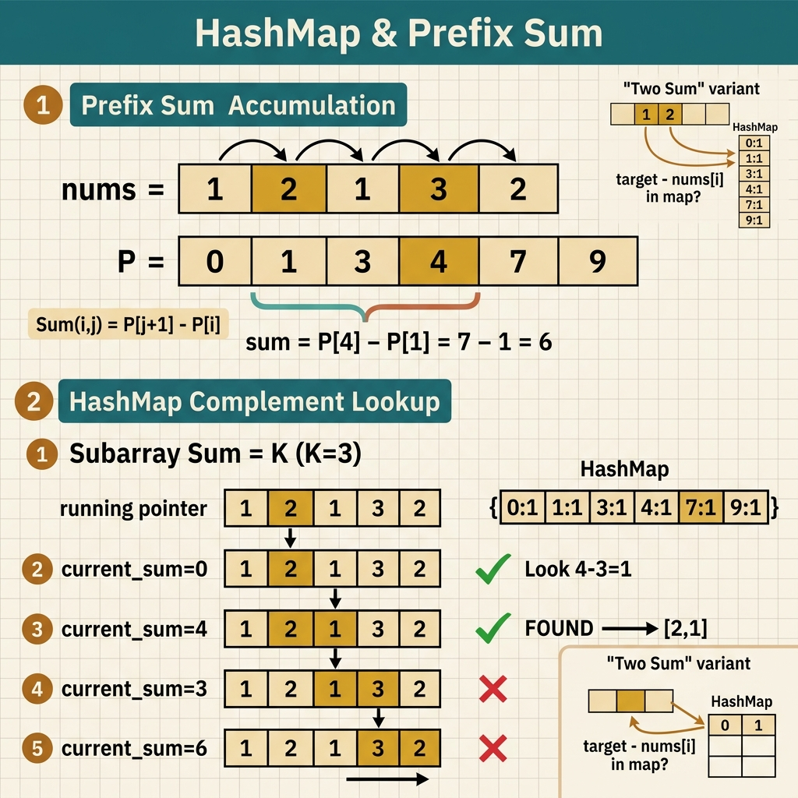

<!-- tags: leetcode, algorithms, coding-interview, hashing -->
# 🗂️ HashMap & Prefix Sum

> O(1) lookup, frequency counting, prefix sum for range queries, subarray sum patterns

📅 Created: 2026-03-20 · 🔄 Updated: 2026-04-10 · ⏱️ 9 min read

| Aspect         | Detail                                       |
| -------------- | -------------------------------------------- |
| **Complexity** | O(1) average lookup, O(n) prefix sum build   |
| **Use case**   | Frequency, lookup, range sum, subarray count |
| **Go stdlib**  | `map[K]V`                                    |
| **LeetCode**   | #1, #49, #128, #238, #347, #523, #560, #930  |

---

## 1. DEFINE

Some problems reveal that brute-force solutions or rescanning the past take too much time. The `HashMap & Prefix Sum` family solves this. Instead of restarting at each position, you carry the past as a state for instant lookups.

Interviews favor this family because it measures two skills at once. First, it tests if you can shift your view from a segment to a difference between two markers. Second, it tests if you know the correct past state to store.

Core insight: **This family beats brute-force when you encode history into a state small enough for average O(1) lookups at each step.**

| Variant | When to use | Key idea |
| ------- | ----------- | -------- |
| Frequency / lookup map | Two Sum, Anagram, counting | Store seen states to fetch the complement or count |
| Prefix sum | Subarray sum, range sum, cumulative balance | `prefix[j] - prefix[i]` represents the segment between two markers |
| Prefix + HashMap | Count subarray, equal 0/1, divisible by k | Map stores the frequency of each prefix state |
| Hash set state tracking | Longest consecutive, detect repeats | Needs membership check without full counts or positions |

| Approach | Time | Space | When to choose |
| --- | --- | --- | --- |
| HashMap lookup | O(n) expected | O(n) | Use for complements, grouping, or counting |
| Prefix array | O(n) preprocess + O(1) range query | O(n) | Use for multiple range queries on the same input |
| Prefix + frequency map | O(n) expected | O(n) | Use to count subarrays that meet specific conditions |
| Set-based scan | O(n) expected | O(n) | Use to check if an element has appeared |

### 1.1 Quick Recognition

- The problem involves two-sum, frequency counting, group anagrams, longest consecutive sequence, subarray sum equals k, equal 0/1, or divisible by k.
- You must compare the current part with a past state.
- The problem asks about a subarray but you can write it as the difference between two prefix states.

### 1.2 Invariants & Failure Modes

- The map must store the exact semantic required for comparison. This could be a count, first index, last index, or prefix state frequency.
- The prefix state helps when you understand what the difference between two markers represents.
- Common failure mode: remembering the prefix map trick but storing the wrong state or updating it out of order.

## 2. VISUAL

HashMap and prefix sum combinations solve most subarray sum problems in O(n). The image below categorizes four main sub-families.

### Overview — HashMap & Prefix Sum



*Figure: HashMap = O(1) lookup. Prefix sum = O(1) range query. Combination → solves subarray problems in O(n).*

### Level 1 — Core intuition

```text
nums = [1, 1, 1], k = 2
prefix: 0, 1, 2, 3

At current prefix = 2
need previous prefix = 2 - k = 0  => one subarray found

At current prefix = 3
need previous prefix = 3 - k = 1  => one more subarray found
```

*Caption*: Level 1 shows that the `subarray sum = k` problem asks if a prefix has appeared such that its difference with the current prefix equals `k`.

### Level 2 — Detailed decision trace

- For Two Sum, the state to remember is "which value we saw and at which index". For Prefix Sum, the state is "which prefix state appeared and its frequency".
- `prefixCount[0] = 1` is a crucial invariant. It represents the empty prefix, allowing us to count segments starting from index 0.
- If the problem asks "how many segments" instead of "does a segment exist", the map must store frequencies instead of booleans.
- Many problems look different but share the same core. They change the problem condition into a relationship between the current state and a past state.

The prefix sum diagram shows how a range query works. The code will combine prefix sum with a hashmap, but initialization is a hidden trap.

## 3. PLAYGROUND

This family guide groups two related but distinct concepts. These are state lookups using maps and accumulated states using prefixes. Therefore, the playground is active for the `prefix sum` half, where dynamic state building is visible.

Use it to watch the prefix state grow step by step and answer range queries using the difference between two markers. Then, return to the code to separate when you need a raw map and when you need a map of prefix states.

::: algorithm-playground
src: ./playgrounds/13-prefix-sum.playground.yml
:::

## 4. CODE

Once the map and prefix semantics are locked, the code requires querying before or after the update. We move from basic lookups to harder prefix-counting.

### Problem 1: Basic — HashMap Patterns [LC #1, #49, #128]
> **Goal**: Use map or set for complement lookups, grouping, and single-pass state tracking.
> **Approach**: Map value to index, apply sorted-signature grouping, or use set membership to detect sequence starts.
> **Examples**: Two Sum, Group Anagrams, Longest Consecutive Sequence.
> **Complexity**: O(n) expected time, O(n) space.

```go
// leetcode/hashmap_basic.go
package leetcode

import "sort"

// ✅ LC #49: Group Anagrams
// Key = sorted string → group all anagrams together
// Time: O(n × k log k), Space: O(n × k)
func groupAnagrams(strs []string) [][]string {
    groups := make(map[string][]string)

    for _, s := range strs {
        // ✅ Sort characters as key
        runes := []byte(s)
        sort.Slice(runes, func(i, j int) bool { return runes[i] < runes[j] })
        key := string(runes)
        groups[key] = append(groups[key], s)
    }

    result := make([][]string, 0, len(groups))
    for _, group := range groups {
        result = append(result, group)
    }
    return result
}

// ✅ LC #128: Longest Consecutive Sequence
// O(n) using HashSet — check if num is START of sequence
// Time: O(n), Space: O(n)
func longestConsecutive(nums []int) int {
    numSet := make(map[int]bool)
    for _, n := range nums {
        numSet[n] = true
    }

    maxLen := 0
    for num := range numSet {
        // ✅ Only start counting if num-1 NOT in set (= start of sequence)
        if !numSet[num-1] {
            length := 1
            for numSet[num+length] {
                length++
            }
            if length > maxLen {
                maxLen = length
            }
        }
    }
    return maxLen
}
```
```typescript
// leetcode/hashmap_basic.ts
function groupAnagrams(strs: string[]): string[][] {
  const groups = new Map<string, string[]>();
  for (const s of strs) {
    const key = [...s].sort().join("");
    groups.set(key, [...(groups.get(key) ?? []), s]);
  }
  return [...groups.values()];
}

function longestConsecutive(nums: number[]): number {
  const set = new Set(nums);
  let best = 0;

  for (const num of set) {
    if (set.has(num - 1)) continue;
    let length = 1;
    while (set.has(num + length)) length++;
    best = Math.max(best, length);
  }
  return best;
}
```
```rust
// leetcode/hashmap_basic.rs
use std::collections::{HashMap, HashSet};

fn group_anagrams(strs: Vec<String>) -> Vec<Vec<String>> {
    let mut groups: HashMap<String, Vec<String>> = HashMap::new();
    for s in strs {
        let mut chars: Vec<char> = s.chars().collect();
        chars.sort_unstable();
        let key: String = chars.into_iter().collect();
        groups.entry(key).or_default().push(s);
    }
    groups.into_values().collect()
}

fn longest_consecutive(nums: Vec<i32>) -> i32 {
    let set: HashSet<i32> = nums.into_iter().collect();
    let mut best = 0;
    for &num in &set {
        if set.contains(&(num - 1)) {
            continue;
        }
        let mut length = 1;
        while set.contains(&(num + length)) {
            length += 1;
        }
        best = best.max(length);
    }
    best
}
```
```cpp
// leetcode/hashmap_basic.cpp
#include <algorithm>
#include <string>
#include <unordered_map>
#include <unordered_set>
#include <vector>

std::vector<std::vector<std::string>> group_anagrams(const std::vector<std::string>& strs) {
    std::unordered_map<std::string, std::vector<std::string>> groups;
    for (const auto& s : strs) {
        std::string key = s;
        std::sort(key.begin(), key.end());
        groups[key].push_back(s);
    }
    std::vector<std::vector<std::string>> result;
    for (auto& [_, group] : groups) result.push_back(std::move(group));
    return result;
}

int longest_consecutive(const std::vector<int>& nums) {
    std::unordered_set<int> set(nums.begin(), nums.end());
    int best = 0;
    for (int num : set) {
        if (set.count(num - 1)) continue;
        int length = 1;
        while (set.count(num + length)) ++length;
        best = std::max(best, length);
    }
    return best;
}
```
```python
# leetcode/hashmap_basic.py
from collections import defaultdict

def group_anagrams(strs: list[str]) -> list[list[str]]:
    groups: dict[str, list[str]] = defaultdict(list)
    for s in strs:
        groups["".join(sorted(s))].append(s)
    return list(groups.values())

def longest_consecutive(nums: list[int]) -> int:
    num_set = set(nums)
    best = 0
    for num in num_set:
        if num - 1 in num_set:
            continue
        length = 1
        while num + length in num_set:
            length += 1
        best = max(best, length)
    return best
```

> **Why?** The common trait of this Basic group is that you do not need to iterate over the entire past. You store one representation of the past. For Two Sum, it is the complement lookup. For Anagram, it is the canonical key. For Longest Consecutive, it is the membership check to detect sequence starts.

> **Conclusion**: This **Basic** example demonstrates using `HashMap Patterns [LC #1, #49, #128]` to solve LeetCode problems cleanly. Move to the next example when constraints shift or you need stronger optimizations.

### Problem 2: Intermediate — Prefix Sum [LC #560, #238]
> **Goal**: Convert a contiguous segment problem into a state comparison between two markers.
> **Approach**: Accumulate the prefix state and use a map to store the frequency of each seen state.
> **Examples**: nums=[1,1,1], k=2 or Product Except Self with left and right products.
> **Complexity**: O(n) time, O(n) or O(1) extra space depending on the variant.

```go
// leetcode/prefix_sum.go
package leetcode

// ✅ LC #560: Subarray Sum Equals K
// prefix[j] - prefix[i] = k → count prefix[i] = prefix[j] - k
// Time: O(n), Space: O(n)
func subarraySum(nums []int, k int) int {
    count := 0
    prefixSum := 0
    prefixCount := map[int]int{0: 1} // ✅ Empty prefix = sum 0

    for _, num := range nums {
        prefixSum += num

        // ✅ How many previous prefix sums = prefixSum - k?
        if c, ok := prefixCount[prefixSum-k]; ok {
            count += c
        }

        prefixCount[prefixSum]++
    }

    return count
}

// ✅ LC #238: Product of Array Except Self (no division!)
// Left product × Right product
// Time: O(n), Space: O(1) (output array doesn't count)
func productExceptSelf(nums []int) []int {
    n := len(nums)
    result := make([]int, n)

    // ✅ Left products
    result[0] = 1
    for i := 1; i < n; i++ {
        result[i] = result[i-1] * nums[i-1]
    }

    // ✅ Right products (accumulated in variable)
    rightProduct := 1
    for i := n - 2; i >= 0; i-- {
        rightProduct *= nums[i+1]
        result[i] *= rightProduct
    }

    return result
}

// ✅ LC #523: Continuous Subarray Sum (sum = multiple of k)
// prefix[j] - prefix[i] ≡ 0 (mod k) → prefix[j] % k == prefix[i] % k
// Time: O(n), Space: O(min(n,k))
func checkSubarraySum(nums []int, k int) bool {
    remainderIdx := map[int]int{0: -1} // ✅ remainder → earliest index
    prefixSum := 0

    for i, num := range nums {
        prefixSum += num
        rem := prefixSum % k

        if idx, ok := remainderIdx[rem]; ok {
            if i-idx >= 2 { // ⚠️ Subarray length ≥ 2
                return true
            }
        } else {
            remainderIdx[rem] = i
        }
    }

    return false
}
```
```typescript
// leetcode/prefix_sum.ts
function subarraySum(nums: number[], k: number): number {
  let count = 0;
  let prefix = 0;
  const prefixCount = new Map<number, number>([[0, 1]]);

  for (const num of nums) {
    prefix += num;
    count += prefixCount.get(prefix - k) ?? 0;
    prefixCount.set(prefix, (prefixCount.get(prefix) ?? 0) + 1);
  }
  return count;
}

function productExceptSelf(nums: number[]): number[] {
  const result = Array(nums.length).fill(1);
  for (let i = 1; i < nums.length; i++) result[i] = result[i - 1] * nums[i - 1];

  let right = 1;
  for (let i = nums.length - 2; i >= 0; i--) {
    right *= nums[i + 1];
    result[i] *= right;
  }
  return result;
}

function checkSubarraySum(nums: number[], k: number): boolean {
  const remainderIdx = new Map<number, number>([[0, -1]]);
  let prefix = 0;
  for (let i = 0; i < nums.length; i++) {
    prefix += nums[i];
    const rem = ((prefix % k) + k) % k;
    if (remainderIdx.has(rem)) {
      if (i - remainderIdx.get(rem)! >= 2) return true;
    } else {
      remainderIdx.set(rem, i);
    }
  }
  return false;
}
```
```rust
// leetcode/prefix_sum.rs
use std::collections::HashMap;

fn subarray_sum(nums: Vec<i32>, k: i32) -> i32 {
    let mut count = 0;
    let mut prefix = 0;
    let mut prefix_count = HashMap::from([(0, 1)]);

    for num in nums {
        prefix += num;
        count += prefix_count.get(&(prefix - k)).copied().unwrap_or(0);
        *prefix_count.entry(prefix).or_insert(0) += 1;
    }
    count
}

fn product_except_self(nums: Vec<i32>) -> Vec<i32> {
    let n = nums.len();
    let mut result = vec![1; n];
    for i in 1..n {
        result[i] = result[i - 1] * nums[i - 1];
    }
    let mut right = 1;
    for i in (0..n.saturating_sub(1)).rev() {
        right *= nums[i + 1];
        result[i] *= right;
    }
    result
}

fn check_subarray_sum(nums: Vec<i32>, k: i32) -> bool {
    let mut remainder_idx = HashMap::from([(0, -1)]);
    let mut prefix = 0;
    for (i, num) in nums.into_iter().enumerate() {
        prefix += num;
        let rem = ((prefix % k) + k) % k;
        if let Some(&idx) = remainder_idx.get(&rem) {
            if i as i32 - idx >= 2 {
                return true;
            }
        } else {
            remainder_idx.insert(rem, i as i32);
        }
    }
    false
}
```
```cpp
// leetcode/prefix_sum.cpp
#include <unordered_map>
#include <vector>

int subarray_sum(const std::vector<int>& nums, int k) {
    std::unordered_map<int, int> prefix_count{{0, 1}};
    int prefix = 0, count = 0;
    for (int num : nums) {
        prefix += num;
        count += prefix_count[prefix - k];
        ++prefix_count[prefix];
    }
    return count;
}

std::vector<int> product_except_self(const std::vector<int>& nums) {
    std::vector<int> result(nums.size(), 1);
    for (size_t i = 1; i < nums.size(); ++i) result[i] = result[i - 1] * nums[i - 1];

    int right = 1;
    for (int i = static_cast<int>(nums.size()) - 2; i >= 0; --i) {
        right *= nums[i + 1];
        result[i] *= right;
    }
    return result;
}

bool check_subarray_sum(const std::vector<int>& nums, int k) {
    std::unordered_map<int, int> remainder_idx{{0, -1}};
    int prefix = 0;
    for (int i = 0; i < static_cast<int>(nums.size()); ++i) {
        prefix += nums[i];
        int rem = ((prefix % k) + k) % k;
        if (remainder_idx.count(rem)) {
            if (i - remainder_idx[rem] >= 2) return true;
        } else {
            remainder_idx[rem] = i;
        }
    }
    return false;
}
```
```python
# leetcode/prefix_sum.py
def subarray_sum(nums: list[int], k: int) -> int:
    count = prefix = 0
    prefix_count = {0: 1}
    for num in nums:
        prefix += num
        count += prefix_count.get(prefix - k, 0)
        prefix_count[prefix] = prefix_count.get(prefix, 0) + 1
    return count

def product_except_self(nums: list[int]) -> list[int]:
    result = [1] * len(nums)
    for i in range(1, len(nums)):
        result[i] = result[i - 1] * nums[i - 1]

    right = 1
    for i in range(len(nums) - 2, -1, -1):
        right *= nums[i + 1]
        result[i] *= right
    return result

def check_subarray_sum(nums: list[int], k: int) -> bool:
    remainder_idx = {0: -1}
    prefix = 0
    for i, num in enumerate(nums):
        prefix += num
        rem = prefix % k
        if rem in remainder_idx:
            if i - remainder_idx[rem] >= 2:
                return True
        else:
            remainder_idx[rem] = i
    return False
```

> **Why?** Prefix sum does not solve the subarray directly. It gives you a new language to express a subarray as the difference between two prefixes. Combined with a frequency HashMap, each position counts how many segments end there without backward loops.

> **Conclusion**: This **Intermediate** example demonstrates using `Prefix Sum [LC #560, #238]` to solve LeetCode problems cleanly. Move to the next example when you need advanced optimizations.

> **✅ Achieved**: Subarray sum count in O(n), product except self in O(n) or O(1) space, and modular prefix sum.
> **⚠️ Caution**: Prefix sum + HashMap requires `prefixCount[0] = 1` for the empty prefix. For LC #523, store the earliest index.

---

HashMap and prefix sum code is concise, often taking just 10 lines. But missing one initialization value ruins the entire output.

## 5. PITFALLS

Errors in this family typically stem from state semantics rather than map syntax.

| # | Severity | Error | Consequence | Fix |
|---|----------|-------|-------------|-----|
| 1   | 🔴 Fatal | Prefix sum: missing `{0: 1}` initialization | Wrong result or runtime error | Empty prefix has sum 0 — count it              |
| 2   | 🟡 Common | LC #128: check every number leading to O(n²) | Wrong result or runtime error | Only start from `num-1 NOT in set` for O(n)    |
| 3   | 🟡 Common | LC #238: using division                      | Wrong result or runtime error | The problem forbids division; use left/right products |
| 4   | 🔵 Minor | Prefix modulo: negative remainder            | Wrong result or runtime error | In Go, `-7 % 3 = -1`; add k using `(rem + k) % k` |
| 5   | 🔵 Minor | Group anagrams: sort key takes O(k log k)    | Wrong result or runtime error | Alternative: use frequency count as key O(k)   |

### 🔴 Pitfall #1 — Prefix sum: missing {0: 1} initialization

Consider this subarray sum equals K code:

```go
prefixMap := map[int]int{}  // ← missing {0: 1}!
sum := 0
for _, num := range nums {
    sum += num
    if count, ok := prefixMap[sum-k]; ok { result += count }
    prefixMap[sum]++
}
```

When a subarray starts at index 0 and has sum = K, `sum - K = 0`. The lookup for `prefixMap[0]` fails, missing the count. The empty prefix must be counted.

**Fix**: `prefixMap := map[int]int{0: 1}`. The empty prefix represents the segment starting from the beginning of the array.

---

## 6. REF

| Resource                    | Link                                                                                                              |
| --------------------------- | ----------------------------------------------------------------------------------------------------------------- |
| LC #560 Subarray Sum        | [leetcode.com/problems/subarray-sum-equals-k](https://leetcode.com/problems/subarray-sum-equals-k/)               |
| LC #128 Longest Consecutive | [leetcode.com/problems/longest-consecutive-sequence](https://leetcode.com/problems/longest-consecutive-sequence/) |
| LC #238 Product Except Self | [leetcode.com/problems/product-of-array-except-self](https://leetcode.com/problems/product-of-array-except-self/) |

---

## 7. RECOMMEND

HashMap and prefix sum are clear now. The next step is the matrix pattern for range queries on grids, or bit manipulation for XOR prefixes.

| Extension | When to use | Reason | File/Link |
| --------- | ----------- | ------ | --------- |
| Two Pointers | Complement lookup on sorted data | Combines hashing and pointers | [01-two-pointers](./01-two-pointers-sliding-window.md) |
| Matrix | 2D prefix sum | Expands to grids | [14-matrix](./14-matrix.md) |
| String | Rolling hash, Rabin-Karp | Hashes for pattern matching | [15-string](./15-string.md) |
| Bit Manipulation | XOR prefix sum | Combines bits and prefixes | [10-bit-manipulation-math](./10-bit-manipulation-math.md) |

---

## 8. QUICK REF

### Interview templates

```go
// HashMap — Frequency / Lookup
freq := make(map[T]int)
for _, v := range nums { freq[v]++ }

// Two Sum Pattern
seen := make(map[int]int)
for i, v := range nums {
    if j, ok := seen[target-v]; ok { return []int{j, i} }
    seen[v] = i
}

// Prefix Sum + HashMap (subarray sum = k)
prefixCount := map[int]int{0: 1}
sum, count := 0, 0
for _, v := range nums {
    sum += v
    count += prefixCount[sum-k]
    prefixCount[sum]++
}
```

| Situation / Signal | Pattern / Approach | Complexity | When to use | Warning |
|--------------------|--------------------|------------|-------------|---------|
| pair sum / complement lookup | HashMap seen → check | O(n) · O(n) | Two sum, isomorphic strings | Check first, save later to avoid self-pairs |
| group by property | HashMap key = signature | O(n×k) · O(n) | Group anagrams, encode-decode | Key must be sorted or a frequency tuple |
| subarray sum equals k | Prefix sum + HashMap | O(n) · O(n) | Subarray sum = k, count ranges | Initialize: prefixMap[0] = 1 |
| longest subarray with constraint | Prefix state + first occurrence | O(n) · O(n) | Contiguous array, max size | Store first occurrence of the prefix state |
| range sum query (mutable) | Prefix sum or BIT/segment | O(n) build · O(1) query | Static range queries | Use BIT for mutable, prefix for static |

---

Return to the "subarray sum = K" opening problem. Prefix sums turn range queries into O(1) lookups. But this only works when you count the empty prefix.

---

**Links**: [← Trie](./12-trie.md) · [→ Matrix](./14-matrix.md)
