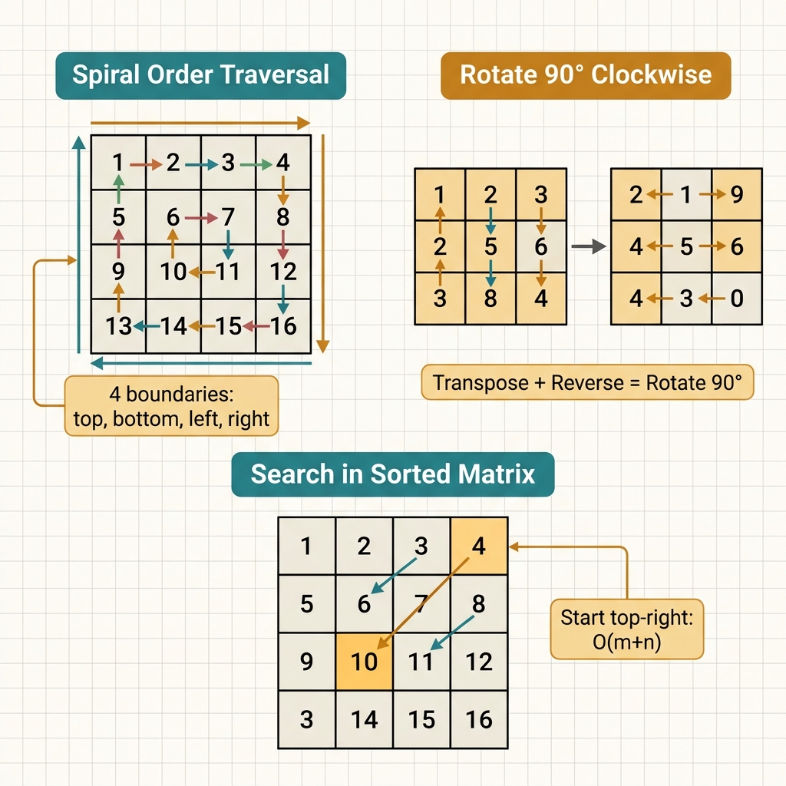

<!-- tags: leetcode, algorithms, coding-interview -->
# 🔲 Matrix

> Rotate, spiral, search, set zeroes — 2D matrix processing techniques

📅 Created: 2026-03-20 · 🔄 Updated: 2026-04-10 · ⏱️ 9 min read

| Aspect         | Detail                                             |
| -------------- | -------------------------------------------------- |
| **Complexity** | O(m×n) typical, O(log(m×n)) binary search          |
| **Use case**   | Image rotation, spiral print, search sorted matrix |
| **Go stdlib**  | 2D slice `[][]int`                                 |
| **LeetCode**   | #36, #48, #54, #73, #74, #240, #289                |

---

## 1. DEFINE

2D grids look simple, but boundary management causes most bugs. 🔲 Matrix helps you recognize boundaries before your code goes wrong.

Matrix problems present a uniform 2D surface, but interviews twist them in three ways. These are boundary traversal, in-place transform via symmetry, and structured search. The `Matrix` family prevents you from confusing these three reasoning methods.

The difficulty lies in boundary representation, movement direction, and processed cells. A slight 2D invariant drift will duplicate cells, skip cells, or destroy required data.

Core insight: **Matrix problems become clear when you define which cells belong to the current domain, which boundary shrinks, and which transformations preserve necessary data.**

| Variant | When to use | Key idea |
| ------- | ----------- | -------- |
| Boundary traversal | Spiral, layer by layer, perimeter walk | Manage the top, bottom, left, and right boundaries |
| In-place transform | Rotate, set zeroes, game of life | Leverage matrix structure to avoid new allocations |
| Sorted matrix search | Matrix sorted by row or column | Use a staircase or binary search instead of full scans |
| Grid simulation / BFS | Island, shortest path, flood fill | The matrix is a hidden graph with 4 or 8 movement directions |

| Approach | Time | Space | When to choose |
| --- | --- | --- | --- |
| Boundary shrinking | O(mn) | O(1) | Use for layer-by-layer or spiral traversals |
| Transpose + reverse | O(n^2) | O(1) | Use for 90-degree rotations on square matrices |
| Staircase search | O(m+n) | O(1) | Use when both rows and columns are sorted |
| BFS/DFS on grid | O(mn) | O(mn) or O(recursion) | Use for reachability, island, or shortest path problems |

### 1.1 Quick Recognition

- The problem involves rotation, spirals, setting zeroes, searching a matrix, island-like traversals, or in-place 2D transforms.
- You must reason about boundaries or local 2D neighborhoods instead of independent indices.
- If the input has row/column sorting or symmetry, it provides leverage for the solution.

### 1.2 Invariants & Failure Modes

- Boundaries must shrink in the correct direction and never cross at the wrong time.
- In-place transforms are safe when you know which data needs reading and which data allows overwriting.
- Common failure mode: treating the matrix like a folded 1D array, which destroys the row/column structure or symmetry.

## 2. VISUAL

Matrix problems divide into three main technique groups. The image below helps you recognize the correct approach based on problem signals.

### Overview — Matrix



*Figure: Matrix = 2D array. Most tricks involve boundary management or applying 1D techniques to 2D.*

### Level 1 — Core intuition

```text
Rotate 90° clockwise
1 2 3      1 4 7      7 4 1
4 5 6  ->  2 5 8  ->  8 5 2
7 8 9      3 6 9      9 6 3
transpose    reverse rows

Spiral order
[top row] -> [right col] -> [bottom row reversed] -> [left col upwards]
```

*Caption*: Level 1 highlights two popular invariants. These are geometric transforms using transpose-plus-reverse and boundary shrinking during spiral traversals.

### Level 2 — Detailed decision trace

- Rotation requires a transpose and row reversal. Reversing these steps produces a different transform.
- For spirals, update the corresponding boundary after completing an edge. Next, re-check `top <= bottom` and `left <= right`.
- For Set Matrix Zeroes, use the first row and column as markers to save space. Keep a separate state for the first row and column.
- For Search Matrix II, the matrix is both a 2D board and a sorted space. Staircase searches work when both rows and columns are monotonic.

The matrix diagram shows boundary movements. The code implements spiral, rotate, and search patterns. An off-by-one error on the boundary is the most common mistake.

## 3. CODE

Once the 2D domain is locked, the code requires implementing the correct moving and writing order. We move from base traversals to structured transforms.

### Problem 1: Basic — Rotate & Spiral [LC #48, #54, #73]
> **Goal**: Master the three basic matrix invariants. These are transpose-plus-reverse, four boundaries, and marker rows/cols.
> **Approach**: Manage the matrix geometry instead of handling separate cases.
> **Examples**: 3x3 matrix rotation, spiral traversal, or setting zeroes in-place.
> **Complexity**: O(mn) or O(n^2) time, O(1) extra space for in-place updates.

```go
// leetcode/matrix.go
package leetcode

// ✅ LC #48: Rotate Image (90° clockwise, in-place)
// Step 1: Transpose  Step 2: Reverse each row
// Time: O(n²), Space: O(1)
func rotate(matrix [][]int) {
    n := len(matrix)

    // ✅ Transpose: swap matrix[i][j] ↔ matrix[j][i]
    for i := 0; i < n; i++ {
        for j := i + 1; j < n; j++ {
            matrix[i][j], matrix[j][i] = matrix[j][i], matrix[i][j]
        }
    }

    // ✅ Reverse each row
    for i := 0; i < n; i++ {
        for l, r := 0, n-1; l < r; l, r = l+1, r-1 {
            matrix[i][l], matrix[i][r] = matrix[i][r], matrix[i][l]
        }
    }
}

// ✅ LC #54: Spiral Matrix
// 4 boundaries: top, bottom, left, right
// Time: O(m×n), Space: O(1) not counting output
func spiralOrder(matrix [][]int) []int {
    if len(matrix) == 0 {
        return nil
    }
    result := []int{}
    top, bottom := 0, len(matrix)-1
    left, right := 0, len(matrix[0])-1

    for top <= bottom && left <= right {
        // ✅ Right →
        for c := left; c <= right; c++ {
            result = append(result, matrix[top][c])
        }
        top++
        // ✅ Down ↓
        for r := top; r <= bottom; r++ {
            result = append(result, matrix[r][right])
        }
        right--
        // ✅ Left ← (check top <= bottom)
        if top <= bottom {
            for c := right; c >= left; c-- {
                result = append(result, matrix[bottom][c])
            }
            bottom--
        }
        // ✅ Up ↑ (check left <= right)
        if left <= right {
            for r := bottom; r >= top; r-- {
                result = append(result, matrix[r][left])
            }
            left++
        }
    }
    return result
}

// ✅ LC #73: Set Matrix Zeroes
// Use first row/col as markers → O(1) extra space
// Time: O(m×n), Space: O(1)
func setZeroes(matrix [][]int) {
    m, n := len(matrix), len(matrix[0])
    firstRowZero, firstColZero := false, false

    // ✅ Check if first row/col should be zeroed
    for c := 0; c < n; c++ {
        if matrix[0][c] == 0 {
            firstRowZero = true
        }
    }
    for r := 0; r < m; r++ {
        if matrix[r][0] == 0 {
            firstColZero = true
        }
    }

    // ✅ Mark zeros in first row/col
    for r := 1; r < m; r++ {
        for c := 1; c < n; c++ {
            if matrix[r][c] == 0 {
                matrix[r][0] = 0
                matrix[0][c] = 0
            }
        }
    }

    // ✅ Zero cells based on markers
    for r := 1; r < m; r++ {
        for c := 1; c < n; c++ {
            if matrix[r][0] == 0 || matrix[0][c] == 0 {
                matrix[r][c] = 0
            }
        }
    }

    // ✅ Zero first row/col if needed
    if firstRowZero {
        for c := 0; c < n; c++ {
            matrix[0][c] = 0
        }
    }
    if firstColZero {
        for r := 0; r < m; r++ {
            matrix[r][0] = 0
        }
    }
}
```
```typescript
// leetcode/matrix.ts
function rotate(matrix: number[][]): void {
  const n = matrix.length;
  for (let i = 0; i < n; i++) {
    for (let j = i + 1; j < n; j++) [matrix[i][j], matrix[j][i]] = [matrix[j][i], matrix[i][j]];
    matrix[i].reverse();
  }
}

function spiralOrder(matrix: number[][]): number[] {
  const result: number[] = [];
  let top = 0, bottom = matrix.length - 1;
  let left = 0, right = matrix[0].length - 1;

  while (top <= bottom && left <= right) {
    for (let c = left; c <= right; c++) result.push(matrix[top][c]);
    top++;
    for (let r = top; r <= bottom; r++) result.push(matrix[r][right]);
    right--;
    if (top <= bottom) for (let c = right; c >= left; c--) result.push(matrix[bottom][c]);
    bottom--;
    if (left <= right) for (let r = bottom; r >= top; r--) result.push(matrix[r][left]);
    left++;
  }
  return result;
}

function setZeroes(matrix: number[][]): void {
  const rows = new Set<number>();
  const cols = new Set<number>();
  for (let r = 0; r < matrix.length; r++) {
    for (let c = 0; c < matrix[0].length; c++) {
      if (matrix[r][c] === 0) {
        rows.add(r);
        cols.add(c);
      }
    }
  }
  for (let r = 0; r < matrix.length; r++) {
    for (let c = 0; c < matrix[0].length; c++) {
      if (rows.has(r) || cols.has(c)) matrix[r][c] = 0;
    }
  }
}
```
```rust
// leetcode/matrix.rs
fn rotate(matrix: &mut Vec<Vec<i32>>) {
    let n = matrix.len();
    for i in 0..n {
        for j in i + 1..n {
            let tmp = matrix[i][j];
            matrix[i][j] = matrix[j][i];
            matrix[j][i] = tmp;
        }
        matrix[i].reverse();
    }
}

fn spiral_order(matrix: Vec<Vec<i32>>) -> Vec<i32> {
    let mut result = Vec::new();
    let (mut top, mut bottom) = (0_i32, matrix.len() as i32 - 1);
    let (mut left, mut right) = (0_i32, matrix[0].len() as i32 - 1);

    while top <= bottom && left <= right {
        for c in left..=right { result.push(matrix[top as usize][c as usize]); }
        top += 1;
        for r in top..=bottom { result.push(matrix[r as usize][right as usize]); }
        right -= 1;
        if top <= bottom {
            for c in (left..=right).rev() { result.push(matrix[bottom as usize][c as usize]); }
            bottom -= 1;
        }
        if left <= right {
            for r in (top..=bottom).rev() { result.push(matrix[r as usize][left as usize]); }
            left += 1;
        }
    }
    result
}

fn set_zeroes(matrix: &mut Vec<Vec<i32>>) {
    let mut rows = std::collections::HashSet::new();
    let mut cols = std::collections::HashSet::new();
    for r in 0..matrix.len() {
        for c in 0..matrix[0].len() {
            if matrix[r][c] == 0 {
                rows.insert(r);
                cols.insert(c);
            }
        }
    }
    for r in 0..matrix.len() {
        for c in 0..matrix[0].len() {
            if rows.contains(&r) || cols.contains(&c) {
                matrix[r][c] = 0;
            }
        }
    }
}
```
```cpp
// leetcode/matrix.cpp
#include <algorithm>
#include <unordered_set>
#include <vector>

void rotate(std::vector<std::vector<int>>& matrix) {
    int n = static_cast<int>(matrix.size());
    for (int i = 0; i < n; ++i) {
        for (int j = i + 1; j < n; ++j) std::swap(matrix[i][j], matrix[j][i]);
        std::reverse(matrix[i].begin(), matrix[i].end());
    }
}

std::vector<int> spiral_order(const std::vector<std::vector<int>>& matrix) {
    std::vector<int> result;
    int top = 0, bottom = static_cast<int>(matrix.size()) - 1;
    int left = 0, right = static_cast<int>(matrix[0].size()) - 1;
    while (top <= bottom && left <= right) {
        for (int c = left; c <= right; ++c) result.push_back(matrix[top][c]);
        ++top;
        for (int r = top; r <= bottom; ++r) result.push_back(matrix[r][right]);
        --right;
        if (top <= bottom) {
            for (int c = right; c >= left; --c) result.push_back(matrix[bottom][c]);
            --bottom;
        }
        if (left <= right) {
            for (int r = bottom; r >= top; --r) result.push_back(matrix[r][left]);
            ++left;
        }
    }
    return result;
}

void set_zeroes(std::vector<std::vector<int>>& matrix) {
    std::unordered_set<int> rows, cols;
    for (int r = 0; r < static_cast<int>(matrix.size()); ++r) {
        for (int c = 0; c < static_cast<int>(matrix[0].size()); ++c) {
            if (matrix[r][c] == 0) {
                rows.insert(r);
                cols.insert(c);
            }
        }
    }
    for (int r = 0; r < static_cast<int>(matrix.size()); ++r) {
        for (int c = 0; c < static_cast<int>(matrix[0].size()); ++c) {
            if (rows.count(r) || cols.count(c)) matrix[r][c] = 0;
        }
    }
}
```
```python
# leetcode/matrix.py
def rotate(matrix: list[list[int]]) -> None:
    n = len(matrix)
    for i in range(n):
        for j in range(i + 1, n):
            matrix[i][j], matrix[j][i] = matrix[j][i], matrix[i][j]
        matrix[i].reverse()

def spiral_order(matrix: list[list[int]]) -> list[int]:
    result: list[int] = []
    top, bottom = 0, len(matrix) - 1
    left, right = 0, len(matrix[0]) - 1
    while top <= bottom and left <= right:
        for c in range(left, right + 1):
            result.append(matrix[top][c])
        top += 1
        for r in range(top, bottom + 1):
            result.append(matrix[r][right])
        right -= 1
        if top <= bottom:
            for c in range(right, left - 1, -1):
                result.append(matrix[bottom][c])
            bottom -= 1
        if left <= right:
            for r in range(bottom, top - 1, -1):
                result.append(matrix[r][left])
            left += 1
    return result

def set_zeroes(matrix: list[list[int]]) -> None:
    zero_rows = {r for r, row in enumerate(matrix) if 0 in row}
    zero_cols = {c for c in range(len(matrix[0])) if any(matrix[r][c] == 0 for r in range(len(matrix)))}
    for r in range(len(matrix)):
        for c in range(len(matrix[0])):
            if r in zero_rows or c in zero_cols:
                matrix[r][c] = 0
```

> **Why?** The Basic group is difficult because a geometric invariant shifts one step out of bounds. Rotation works through two sequential transforms. Spirals work through four controlled shrinking boundaries. Setting zeroes works through reading and writing markers in the correct order.

> **Conclusion**: This **Basic** example demonstrates using `Rotate & Spiral [LC #48, #54, #73]` to solve LeetCode problems cleanly. Move to the next example when constraints shift or you need stronger optimizations.

### Problem 2: Advanced — Search Matrix II [LC #240]
> **Goal**: Exploit row and column monotonicity to discard an entire row or column per step.
> **Approach**: Use a staircase search starting from the top-right or bottom-left corner.
> **Examples**: A matrix sorted by row and column. Find a specific target.
> **Complexity**: O(m+n) time, O(1) space.

```go
// ✅ LC #240: Search a 2D Matrix II
// Matrix sorted row-wise AND column-wise
// Staircase search: start top-right corner
// Time: O(m + n), Space: O(1)
func searchMatrixII(matrix [][]int, target int) bool {
    if len(matrix) == 0 {
        return false
    }
    row, col := 0, len(matrix[0])-1 // ✅ Start top-right

    for row < len(matrix) && col >= 0 {
        if matrix[row][col] == target {
            return true
        } else if matrix[row][col] > target {
            col-- // ✅ Too large → go left
        } else {
            row++ // ✅ Too small → go down
        }
    }
    return false
}
```
```typescript
// ✅ LC #240: Search a 2D Matrix II
function searchMatrixII(matrix: number[][], target: number): boolean {
  if (matrix.length === 0) return false;
  let row = 0;
  let col = matrix[0].length - 1;

  while (row < matrix.length && col >= 0) {
    if (matrix[row][col] === target) return true;
    if (matrix[row][col] > target) col--;
    else row++;
  }
  return false;
}
```
```rust
// ✅ LC #240: Search a 2D Matrix II
fn search_matrix_ii(matrix: Vec<Vec<i32>>, target: i32) -> bool {
    if matrix.is_empty() {
        return false;
    }
    let mut row = 0usize;
    let mut col = matrix[0].len() as i32 - 1;

    while row < matrix.len() && col >= 0 {
        let val = matrix[row][col as usize];
        if val == target {
            return true;
        } else if val > target {
            col -= 1;
        } else {
            row += 1;
        }
    }
    false
}
```
```cpp
// ✅ LC #240: Search a 2D Matrix II
bool search_matrix_ii(const std::vector<std::vector<int>>& matrix, int target) {
    if (matrix.empty()) return false;
    int row = 0;
    int col = static_cast<int>(matrix[0].size()) - 1;
    while (row < static_cast<int>(matrix.size()) && col >= 0) {
        if (matrix[row][col] == target) return true;
        if (matrix[row][col] > target) --col;
        else ++row;
    }
    return false;
}
```
```python
# ✅ LC #240: Search a 2D Matrix II
def search_matrix_ii(matrix: list[list[int]], target: int) -> bool:
    if not matrix:
        return False
    row, col = 0, len(matrix[0]) - 1
    while row < len(matrix) and col >= 0:
        if matrix[row][col] == target:
            return True
        if matrix[row][col] > target:
            col -= 1
        else:
            row += 1
    return False
```

> **Why?** The staircase search passes because each step at the strategic corner eliminates a row or column. If you start from the wrong corner, you lose the information needed to decide the direction. This reduces the approach to brute-force.

> **Conclusion**: This **Advanced** example demonstrates using `Search Matrix II [LC #240]` to solve LeetCode problems cleanly. Move to the next example when you need advanced optimizations.

> **✅ Achieved**: Rotation in O(1) space, spiral traversal, set zeroes in O(1) space, and staircase search in O(m+n).
> **⚠️ Caution**: For LC #73, using the first row and column as markers is the key O(1) space trick.

---

Matrix code fails at boundaries due to incorrect update orders or inverted rotation directions. Tests with 2x2 grids pass, but 3x3 grids reveal errors.

## 4. PITFALLS

Matrix errors do not appear at once. They reveal themselves through duplicated cells, skipped cells, or overwritten data.

| # | Severity | Error | Consequence | Fix |
|---|----------|-------|-------------|-----|
| 1   | 🔴 Fatal | Rotate: incorrect transpose and reverse order | Wrong result or runtime error | CW: transpose then reverse rows. CCW: transpose then reverse columns |
| 2   | 🟡 Common | Spiral: forgot to check `top <= bottom` | Wrong result or runtime error | Non-square matrices need extra boundary checks              |
| 3   | 🟡 Common | Set zeroes: overwritten markers         | Wrong result or runtime error | Process the first row and column LAST                       |
| 4   | 🔵 Minor | Search Matrix II: wrong start corner    | Wrong result or runtime error | Start top-right or bottom-left (NOT top-left)               |

### 🔴 Pitfall #1 — Rotate matrix: incorrect transpose and reverse order

Consider this 90° CW rotation code:

```go
// Step 1: Transpose
for i := 0; i < n; i++ {
    for j := i+1; j < n; j++ { matrix[i][j], matrix[j][i] = matrix[j][i], matrix[i][j] }
}
// Step 2: Reverse COLUMNS ← WRONG! CW needs reversed ROWS
for i := 0; i < n; i++ {
    for j := 0; j < n/2; j++ { matrix[j][i], matrix[n-1-j][i] = matrix[n-1-j][i], matrix[j][i] }
}
```

CW 90° requires a transpose and reversing **each row**. CCW 90° requires a transpose and reversing **each column**. Reversing the direction rotates the matrix backward.

**Fix**: For CW, `transpose → for each row: reverse left↔right`. For CCW, `transpose → for each col: reverse top↔bottom`.

---

## 5. REF

| Resource                 | Link                                                                                                |
| ------------------------ | --------------------------------------------------------------------------------------------------- |
| LC #48 Rotate Image      | [leetcode.com/problems/rotate-image](https://leetcode.com/problems/rotate-image/)                   |
| LC #54 Spiral Matrix     | [leetcode.com/problems/spiral-matrix](https://leetcode.com/problems/spiral-matrix/)                 |
| LC #240 Search Matrix II | [leetcode.com/problems/search-a-2d-matrix-ii](https://leetcode.com/problems/search-a-2d-matrix-ii/) |

---

## 6. RECOMMEND

You now see matrices as 2D spaces with sweep directions, layers, and boundaries. The next step is distinguishing local layout transforms from grid graph traversals and 2D dynamic programming.

| Extension | When to use | Reason | File/Link |
| --------- | ----------- | ------ | --------- |
| Graph BFS/DFS | Island counting, flood fill | Grid traversal | [06-graph-bfs-dfs](./06-graph-bfs-dfs.md) |
| HashMap & Prefix Sum | 2D prefix sum | Range queries on matrices | [13-hashmap-prefix-sum](./13-hashmap-prefix-sum.md) |
| Dynamic Programming | DP on grids | Unique paths, min path sum | [07-dynamic-programming](./07-dynamic-programming.md) |
| Binary Search | Search sorted matrices | Staircase and binary search | [02-binary-search](./02-binary-search.md) |

---

## 7. QUICK REF

### Interview template

> Copy-paste when encountering this type of problem in an interview.

```go
// ── Matrix BFS (multi-source / flood fill) ──────────────────────
dirs := [][2]int{{0, 1}, {0, -1}, {1, 0}, {-1, 0}}
// enqueue all source cells, mark visited
for len(queue) > 0 {
    r, c := queue[0][0], queue[0][1]; queue = queue[1:]
    for _, d := range dirs {
        nr, nc := r+d[0], c+d[1]
        if nr >= 0 && nr < rows && nc >= 0 && nc < cols && !visited[nr][nc] {
            visited[nr][nc] = true
            queue = append(queue, [2]int{nr, nc})
        }
    }
}

// ── Rotate Matrix 90° CW (in-place) ─────────────────────────────
// Step 1: Transpose  →  Step 2: Reverse each row
for i := 0; i < n; i++ {
    for j := i + 1; j < n; j++ { matrix[i][j], matrix[j][i] = matrix[j][i], matrix[i][j] }
}
for i := 0; i < n; i++ {
    for l, r := 0, n-1; l < r; l, r = l+1, r-1 { matrix[i][l], matrix[i][r] = matrix[i][r], matrix[i][l] }
}
```
```typescript
// ── Matrix BFS (multi-source / flood fill) ──────────────────────
const dirs = [[0, 1], [0, -1], [1, 0], [-1, 0]];
while (queue.length > 0) {
  const [r, c] = queue.shift()!;
  for (const [dr, dc] of dirs) {
    const nr = r + dr, nc = c + dc;
    if (nr >= 0 && nr < rows && nc >= 0 && nc < cols && !visited[nr][nc]) {
      visited[nr][nc] = true;
      queue.push([nr, nc]);
    }
  }
}

// ── Rotate Matrix 90° CW (in-place) ─────────────────────────────
for (let i = 0; i < n; i++) {
  for (let j = i + 1; j < n; j++) [matrix[i][j], matrix[j][i]] = [matrix[j][i], matrix[i][j]];
}
for (let i = 0; i < n; i++) matrix[i].reverse();
```
```rust
// ── Matrix BFS (multi-source / flood fill) ──────────────────────
let dirs = [(0, 1), (0, -1), (1, 0), (-1, 0)];
while let Some((r, c)) = queue.pop_front() {
    for (dr, dc) in dirs {
        let (nr, nc) = (r + dr, c + dc);
        if nr >= 0 && nr < rows && nc >= 0 && nc < cols && !visited[nr as usize][nc as usize] {
            visited[nr as usize][nc as usize] = true;
            queue.push_back((nr, nc));
        }
    }
}

// ── Rotate Matrix 90° CW (in-place) ─────────────────────────────
for i in 0..n {
    for j in i + 1..n {
        let tmp = matrix[i][j];
        matrix[i][j] = matrix[j][i];
        matrix[j][i] = tmp;
    }
    matrix[i].reverse();
}
```
```cpp
// ── Matrix BFS (multi-source / flood fill) ──────────────────────
#include <deque>
#include <vector>

const std::vector<std::pair<int, int>> dirs{{0, 1}, {0, -1}, {1, 0}, {-1, 0}};
while (!queue.empty()) {
    auto [r, c] = queue.front();
    queue.pop_front();
    for (auto [dr, dc] : dirs) {
        int nr = r + dr, nc = c + dc;
        if (nr >= 0 && nr < rows && nc >= 0 && nc < cols && !visited[nr][nc]) {
            visited[nr][nc] = true;
            queue.push_back({nr, nc});
        }
    }
}

// ── Rotate Matrix 90° CW (in-place) ─────────────────────────────
for (int i = 0; i < n; ++i) {
    for (int j = i + 1; j < n; ++j) std::swap(matrix[i][j], matrix[j][i]);
    std::reverse(matrix[i].begin(), matrix[i].end());
}
```
```python
# ── Matrix BFS (multi-source / flood fill) ──────────────────────
from collections import deque

dirs = [(0, 1), (0, -1), (1, 0), (-1, 0)]
while queue:
    r, c = queue.popleft()
    for dr, dc in dirs:
        nr, nc = r + dr, c + dc
        if 0 <= nr < rows and 0 <= nc < cols and not visited[nr][nc]:
            visited[nr][nc] = True
            queue.append((nr, nc))

# ── Rotate Matrix 90° CW (in-place) ─────────────────────────────
for i in range(n):
    for j in range(i + 1, n):
        matrix[i][j], matrix[j][i] = matrix[j][i], matrix[i][j]
    matrix[i].reverse()
```

| Situation / Signal | Pattern / Approach | Complexity | When to use | Warning |
|--------------------|--------------------|------------|-------------|---------|
| spiral order traversal | Layer-by-layer 4 boundaries | O(m×n) · O(1) | Spiral matrix, print spiral | Update boundaries after each direction |
| rotate matrix 90° | Transpose + reverse rows | O(m×n) · O(1) | In-place rotation | Transpose equals swap [i][j] ↔ [j][i] |
| set matrix zeroes | First row/col as markers | O(m×n) · O(1) | In-place zero propagation | Process the first row and column last |
| search sorted matrix | Binary search / staircase | O(log(m·n)) · O(1) | Search element in a matrix | Identify the sorted type: row-first or row-and-col |
| game of life / island | In-place state encoding | O(m×n) · O(1) | Simultaneous updates | Encode old and new states in the same cell |

---

Return to the "spiral order" opening problem. Matrix tricks revolve around boundary management. Being off by one index breaks the entire output.

---

**Links**: [← HashMap & Prefix Sum](./13-hashmap-prefix-sum.md) · [→ String](./15-string.md)
