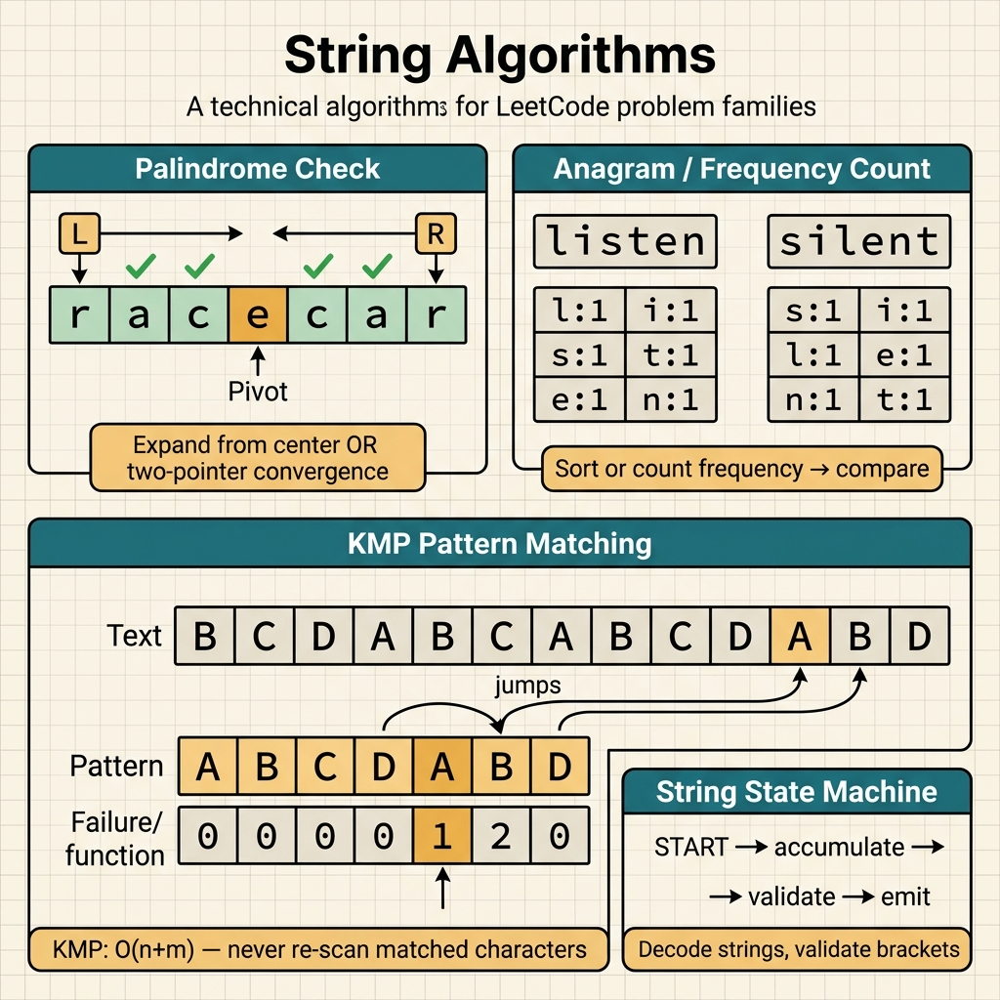

<!-- tags: leetcode, algorithms, coding-interview, arrays -->
# 🔤 String

> Anagram, palindrome, encoding, KMP, string manipulation patterns

📅 Created: 2026-03-20 · 🔄 Updated: 2026-04-10 · ⏱️ 9 min read

| Aspect         | Detail                                         |
| -------------- | ---------------------------------------------- |
| **Complexity** | O(n) typical, O(n+m) KMP                       |
| **Use case**   | Matching, encoding, transformation, validation |
| **Go stdlib**  | `strings`, `unicode`, `strconv`                |
| **LeetCode**   | #3, #5, #8, #14, #49, #125, #242, #271, #394   |

---

### Interview template

> Copy-paste when encountering this type of problem in interviews.

```go
// ── String Builder (avoid O(n²) concatenation) ──────────────────
var sb strings.Builder
for _, ch := range s {
    sb.WriteRune(ch)
}
result := sb.String()

// ── Sliding Window — Substring ──────────────────────────────────
need := make(map[byte]int)   // target char frequencies
window := make(map[byte]int)
l, have, total := 0, 0, len(need)
for r := 0; r < len(s); r++ {
    window[s[r]]++
    if need[s[r]] > 0 && window[s[r]] == need[s[r]] { have++ }
    for have == total {
        // update answer
        window[s[l]]--
        if need[s[l]] > 0 && window[s[l]] < need[s[l]] { have-- }
        l++
    }
}
```
```typescript
// ── String Builder (avoid O(n²) concatenation) ──────────────────
const parts: string[] = [];
for (const ch of s) parts.push(ch);
const result = parts.join("");

// ── Sliding Window — Substring ──────────────────────────────────
const need = new Map<string, number>();
const window = new Map<string, number>();
let l = 0, have = 0, total = need.size;
for (let r = 0; r < s.length; r++) {
  window.set(s[r], (window.get(s[r]) ?? 0) + 1);
  if ((need.get(s[r]) ?? 0) > 0 && window.get(s[r]) === need.get(s[r])) have++;
  while (have === total) {
    window.set(s[l], (window.get(s[l]) ?? 0) - 1);
    if ((need.get(s[l]) ?? 0) > 0 && (window.get(s[l]) ?? 0) < (need.get(s[l]) ?? 0)) have--;
    l++;
  }
}
```
```rust
// ── String Builder (avoid O(n²) concatenation) ──────────────────
let mut result = String::new();
for ch in s.chars() {
    result.push(ch);
}

// ── Sliding Window — Substring ──────────────────────────────────
use std::collections::HashMap;

let need: HashMap<u8, i32> = HashMap::new();
let mut window: HashMap<u8, i32> = HashMap::new();
let (mut l, mut have, total) = (0usize, 0, need.len() as i32);
for (r, &ch) in s.as_bytes().iter().enumerate() {
    *window.entry(ch).or_insert(0) += 1;
    if need.get(&ch).copied().unwrap_or(0) > 0 && window[&ch] == need[&ch] {
        have += 1;
    }
    while have == total {
        let left = s.as_bytes()[l];
        *window.entry(left).or_insert(0) -= 1;
        if need.get(&left).copied().unwrap_or(0) > 0 && window[&left] < need[&left] {
            have -= 1;
        }
        l += 1;
    }
}
```
```cpp
// ── String Builder (avoid O(n²) concatenation) ──────────────────
#include <string>
#include <unordered_map>

std::string result;
for (char ch : s) result.push_back(ch);

// ── Sliding Window — Substring ──────────────────────────────────
std::unordered_map<char, int> need, window;
int l = 0, have = 0, total = static_cast<int>(need.size());
for (int r = 0; r < static_cast<int>(s.size()); ++r) {
    ++window[s[r]];
    if (need[s[r]] > 0 && window[s[r]] == need[s[r]]) ++have;
    while (have == total) {
        --window[s[l]];
        if (need[s[l]] > 0 && window[s[l]] < need[s[l]]) --have;
        ++l;
    }
}
```
```python
# ── String Builder (avoid O(n²) concatenation) ──────────────────
parts: list[str] = []
for ch in s:
    parts.append(ch)
result = "".join(parts)

# ── Sliding Window — Substring ──────────────────────────────────
need: dict[str, int] = {}
window: dict[str, int] = {}
l = have = 0
total = len(need)
for r, ch in enumerate(s):
    window[ch] = window.get(ch, 0) + 1
    if need.get(ch, 0) > 0 and window[ch] == need[ch]:
        have += 1
    while have == total:
        left = s[l]
        window[left] -= 1
        if need.get(left, 0) > 0 and window[left] < need[left]:
            have -= 1
        l += 1
```

---

## 1. DEFINE

String problems seem diverse but reduce to a few primitives. These include frequency counting, two pointers on characters, or dynamic programming on subsequences. This family helps you identify boundaries before writing incorrect code.

Developers often jump between techniques without tracking the current string structure. This structure could be single characters, prefixes, contiguous substrings, or center symmetry. The `String` family unifies these problems. You must determine which string representation prevents redundant comparisons.

This problem family is not difficult because of syntax. It is difficult because of boundaries and semantics. Substrings differ from subsequences. Prefixes differ from full words. Palindrome checking differs from palindrome enumeration. Choosing the wrong representation derails the solution.

Core insight: **String problems become tractable when you lock in the correct representation for the prompt. This can be a window, prefix table, center, encoding state, or frequency map.**

| Variant | When to use | Core idea |
| ------- | ------- | ------- |
| Two pointers | Palindromes, reverse, trim | Match both ends and skip invalid characters. |
| Frequency map | Anagrams, permutations, counts | Convert the string into a character multiset. |
| Stack parser | Decode strings, calculators, brackets | Each token affects the current parse state. |
| Sliding window | Longest substring, minimum window | Maintain a valid or optimal character window. |

| Approach | Time | Space | When to choose |
| --- | --- | --- | --- |
| Pointer scan | O(n) | O(1) | Choose when observing two ends or doing a linear scan. |
| Frequency table | O(n) | O(alphabet) | Choose when comparing character composition. |
| Stack parser | O(n) | O(n) | Choose for nested structures or delayed expansion. |
| Window with counts | O(n) amortized | O(alphabet) or O(k) | Choose for optimal substrings under constraints. |

### 1.1 Quick Identification

- The prompt mentions palindromes, anagrams, decoding, encoding, KMP, substring searches, or case normalization.
- The question revolves around boundaries, overlaps, or repeating structures.
- If you must scan the same string segment multiple times, question your current representation.

### 1.2 Invariants & Failure Modes

- The string representation must hold exactly the information needed for the next step.
- You must update boundaries like left/right, prefix lengths, or centers with strict discipline. Missing one beat causes omissions or double counting.
- Common failure mode: You apply a pattern for one string variant to another variant with different semantics.

## 2. VISUAL

String problems divide into four main technical groups. The image below routes you quickly to the correct approach.

### Overview — String



*Figure: String problems require character-level reasoning. Most use a frequency map or two pointers.*


### Level 1 — Core intuition

```text
Valid Palindrome
A man, a plan, a canal: Panama
L ------------------------------ R
skip non-alnum, compare normalized chars

Decode String
3[a2[c]]
stack:
3 [ a 2 [ c ] ]
          ^ close -> expand cc
      ^ close -> expand accaccacc
```

*Caption*: Level 1 highlights two main states in string problems. These are converging pointers on normalized sequences and stack parser states for nested expressions.

### Level 2 — Detailed decision trace

- Palindromes and anagrams only need a canonical character representation. Processing raw strings directly invites errors with case-folding or punctuation.
- Sliding windows on strings always tie to a frequency or distinct-count invariant.
- Decoder, encoder, and parser problems separate tokens, current segments, and nesting history. A stack stores delayed contexts.
- With multi-byte characters, you must decide early whether you are processing bytes or runes.

String patterns demonstrate how frequency maps and windows operate. The code implements palindromes and anagrams. Go string immutability is the first trap.

## 3. CODE

Once the string representation stabilizes, coding involves maintaining boundaries, prefix tables, or encoding states.

### Problem 1: Basic — Palindrome & Anagram [LC #125, #242]
> **Goal**: Use two pointers and frequency counting for foundational string problems.
> **Approach**: Normalize the input and compare both ends, or count character frequencies on a fixed alphabet.
> **Example**: "A man, a plan..." for palindromes. "anagram" vs "nagaram" for frequencies.
> **Complexity**: O(n) time. O(1) or O(alphabet) space.

```go
// leetcode/string_basic.go
package leetcode

import (
    "strings"
    "unicode"
)

// ✅ LC #125: Valid Palindrome (alphanumeric only)
// Two pointers: skip non-alphanumeric
// Time: O(n), Space: O(1)
func isPalindromeStr(s string) bool {
    s = strings.ToLower(s)
    l, r := 0, len(s)-1

    for l < r {
        for l < r && !isAlphaNum(s[l]) {
            l++
        }
        for l < r && !isAlphaNum(s[r]) {
            r--
        }
        if s[l] != s[r] {
            return false
        }
        l++
        r--
    }
    return true
}

func isAlphaNum(c byte) bool {
    return (c >= 'a' && c <= 'z') || (c >= '0' && c <= '9')
}

// ✅ LC #242: Valid Anagram
// Frequency count comparison
// Time: O(n), Space: O(26) = O(1)
func isAnagram(s, t string) bool {
    if len(s) != len(t) {
        return false
    }
    var freq [26]int
    for i := 0; i < len(s); i++ {
        freq[s[i]-'a']++
        freq[t[i]-'a']--
    }
    for _, f := range freq {
        if f != 0 {
            return false
        }
    }
    return true
}

// ✅ LC #14: Longest Common Prefix
// Vertical scanning: compare char by char across all strings
// Time: O(S) total chars, Space: O(1)
func longestCommonPrefix(strs []string) string {
    if len(strs) == 0 {
        return ""
    }
    for i := 0; i < len(strs[0]); i++ {
        ch := strs[0][i]
        for j := 1; j < len(strs); j++ {
            if i >= len(strs[j]) || strs[j][i] != ch {
                return strs[0][:i]
            }
        }
    }
    return strs[0]
}
```
```typescript
// leetcode/string_basic.ts
function isPalindromeStr(s: string): boolean {
  const normalized = s.toLowerCase();
  let l = 0, r = normalized.length - 1;
  const isAlphaNum = (ch: string) => /[a-z0-9]/.test(ch);

  while (l < r) {
    while (l < r && !isAlphaNum(normalized[l])) l++;
    while (l < r && !isAlphaNum(normalized[r])) r--;
    if (normalized[l] !== normalized[r]) return false;
    l++;
    r--;
  }
  return true;
}

function isAnagram(s: string, t: string): boolean {
  if (s.length !== t.length) return false;
  const freq = Array(26).fill(0);
  for (let i = 0; i < s.length; i++) {
    freq[s.charCodeAt(i) - 97]++;
    freq[t.charCodeAt(i) - 97]--;
  }
  return freq.every(v => v === 0);
}

function longestCommonPrefix(strs: string[]): string {
  if (strs.length === 0) return "";
  for (let i = 0; i < strs[0].length; i++) {
    const ch = strs[0][i];
    for (let j = 1; j < strs.length; j++) {
      if (i >= strs[j].length || strs[j][i] !== ch) return strs[0].slice(0, i);
    }
  }
  return strs[0];
}
```
```rust
// leetcode/string_basic.rs
fn is_palindrome_str(s: &str) -> bool {
    let bytes = s.to_lowercase().into_bytes();
    let (mut l, mut r) = (0usize, bytes.len().saturating_sub(1));
    while l < r {
        while l < r && !bytes[l].is_ascii_alphanumeric() { l += 1; }
        while l < r && !bytes[r].is_ascii_alphanumeric() { r -= 1; }
        if bytes[l] != bytes[r] { return false; }
        l += 1;
        r -= 1;
    }
    true
}

fn is_anagram(s: &str, t: &str) -> bool {
    if s.len() != t.len() { return false; }
    let mut freq = [0; 26];
    for (&a, &b) in s.as_bytes().iter().zip(t.as_bytes()) {
        freq[(a - b'a') as usize] += 1;
        freq[(b - b'a') as usize] -= 1;
    }
    freq.into_iter().all(|v| v == 0)
}

fn longest_common_prefix(strs: Vec<String>) -> String {
    if strs.is_empty() { return String::new(); }
    for i in 0..strs[0].len() {
        let ch = strs[0].as_bytes()[i];
        for s in strs.iter().skip(1) {
            if i >= s.len() || s.as_bytes()[i] != ch {
                return strs[0][..i].to_string();
            }
        }
    }
    strs[0].clone()
}
```
```cpp
// leetcode/string_basic.cpp
#include <algorithm>
#include <array>
#include <cctype>
#include <string>
#include <vector>

bool is_palindrome_str(const std::string& s) {
    int l = 0, r = static_cast<int>(s.size()) - 1;
    while (l < r) {
        while (l < r && !std::isalnum(s[l])) ++l;
        while (l < r && !std::isalnum(s[r])) --r;
        if (std::tolower(s[l]) != std::tolower(s[r])) return false;
        ++l;
        --r;
    }
    return true;
}

bool is_anagram(const std::string& s, const std::string& t) {
    if (s.size() != t.size()) return false;
    std::array<int, 26> freq{};
    for (size_t i = 0; i < s.size(); ++i) {
        ++freq[s[i] - 'a'];
        --freq[t[i] - 'a'];
    }
    return std::all_of(freq.begin(), freq.end(), [](int v) { return v == 0; });
}

std::string longest_common_prefix(const std::vector<std::string>& strs) {
    if (strs.empty()) return "";
    for (size_t i = 0; i < strs[0].size(); ++i) {
        char ch = strs[0][i];
        for (size_t j = 1; j < strs.size(); ++j) {
            if (i >= strs[j].size() || strs[j][i] != ch) return strs[0].substr(0, i);
        }
    }
    return strs[0];
}
```
```python
# leetcode/string_basic.py
def is_palindrome_str(s: str) -> bool:
    chars = [ch.lower() for ch in s if ch.isalnum()]
    return chars == chars[::-1]

def is_anagram(s: str, t: str) -> bool:
    if len(s) != len(t):
        return False
    freq = [0] * 26
    for a, b in zip(s, t):
        freq[ord(a) - ord("a")] += 1
        freq[ord(b) - ord("a")] -= 1
    return all(v == 0 for v in freq)

def longest_common_prefix(strs: list[str]) -> str:
    if not strs:
        return ""
    for i, ch in enumerate(strs[0]):
        for word in strs[1:]:
            if i >= len(word) or word[i] != ch:
                return strs[0][:i]
    return strs[0]
```

> **Why?** These problems look like string tricks, but the core is representation. Palindromes only work when you normalize and skip invalid characters. Anagrams only work when you compare strings as character multisets instead of by original positions.

> **Conclusion**: This **Basic** example shows how to use `Palindrome & Anagram [LC #125, #242]` to solve LeetCode problems without skipping reasoning. When constraints change or you need deeper optimization, move to the next example.

### Problem 2: Intermediate — Decode String & Encode/Decode [LC #394, #271]
> **Goal**: Solve string problems with clear nesting or serialization requirements.
> **Approach**: Use a stack or parser state machine to handle nested segments and token boundaries.
> **Example**: "3[a2[c]]" or a string list needing lossless encoding and decoding.
> **Complexity**: O(n) time. O(n) space for stacks or buffers.

```go
// leetcode/string_intermediate.go
package leetcode

import (
    "fmt"
    "strconv"
    "strings"
)

// ✅ LC #394: Decode String
// "3[a2[c]]" → "accaccacc"
// Pattern: Stack — push on '[', pop on ']'
// Time: O(n × maxK), Space: O(n)
func decodeString(s string) string {
    numStack := []int{}
    strStack := []string{}
    current := ""
    num := 0

    for _, ch := range s {
        switch {
        case ch >= '0' && ch <= '9':
            num = num*10 + int(ch-'0')

        case ch == '[':
            numStack = append(numStack, num)
            strStack = append(strStack, current)
            num = 0
            current = ""

        case ch == ']':
            // ✅ Pop repeat count and previous string
            repeatCount := numStack[len(numStack)-1]
            numStack = numStack[:len(numStack)-1]
            prevStr := strStack[len(strStack)-1]
            strStack = strStack[:len(strStack)-1]

            current = prevStr + strings.Repeat(current, repeatCount)

        default:
            current += string(ch)
        }
    }

    return current
}

// ✅ LC #271: Encode and Decode Strings (Premium)
// Encode: "len:string" format → unambiguous
// Time: O(n), Space: O(n)
func encode(strs []string) string {
    var sb strings.Builder
    for _, s := range strs {
        sb.WriteString(fmt.Sprintf("%d:%s", len(s), s))
    }
    return sb.String()
}

func decode(s string) []string {
    result := []string{}
    i := 0

    for i < len(s) {
        // ✅ Find ':'
        j := i
        for s[j] != ':' {
            j++
        }
        length, _ := strconv.Atoi(s[i:j])
        word := s[j+1 : j+1+length]
        result = append(result, word)
        i = j + 1 + length
    }

    return result
}

// ✅ LC #438: Find All Anagrams in a String
// Sliding window + frequency comparison
// Time: O(n), Space: O(26) = O(1)
func findAnagrams(s, p string) []int {
    if len(s) < len(p) {
        return nil
    }

    var pFreq, wFreq [26]int
    for _, ch := range p {
        pFreq[ch-'a']++
    }

    result := []int{}
    for i := 0; i < len(s); i++ {
        wFreq[s[i]-'a']++

        if i >= len(p) {
            wFreq[s[i-len(p)]-'a']-- // ⚠️ Remove left element
        }

        if wFreq == pFreq { // ✅ Go arrays are comparable!
            result = append(result, i-len(p)+1)
        }
    }

    return result
}
```
```typescript
// leetcode/string_intermediate.ts
function decodeString(s: string): string {
  const numStack: number[] = [];
  const strStack: string[] = [];
  let current = "";
  let num = 0;

  for (const ch of s) {
    if (/\d/.test(ch)) num = num * 10 + Number(ch);
    else if (ch === "[") {
      numStack.push(num);
      strStack.push(current);
      num = 0;
      current = "";
    } else if (ch === "]") {
      const repeat = numStack.pop()!;
      const prev = strStack.pop()!;
      current = prev + current.repeat(repeat);
    } else {
      current += ch;
    }
  }
  return current;
}

function encode(strs: string[]): string {
  return strs.map(s => `${s.length}:${s}`).join("");
}

function decode(s: string): string[] {
  const result: string[] = [];
  let i = 0;
  while (i < s.length) {
    let j = i;
    while (s[j] !== ":") j++;
    const length = Number(s.slice(i, j));
    result.push(s.slice(j + 1, j + 1 + length));
    i = j + 1 + length;
  }
  return result;
}

function findAnagrams(s: string, p: string): number[] {
  if (s.length < p.length) return [];
  const pFreq = Array(26).fill(0);
  const wFreq = Array(26).fill(0);
  for (const ch of p) pFreq[ch.charCodeAt(0) - 97]++;

  const result: number[] = [];
  for (let i = 0; i < s.length; i++) {
    wFreq[s.charCodeAt(i) - 97]++;
    if (i >= p.length) wFreq[s.charCodeAt(i - p.length) - 97]--;
    if (pFreq.every((v, idx) => v === wFreq[idx])) result.push(i - p.length + 1);
  }
  return result;
}
```
```rust
// leetcode/string_intermediate.rs
fn decode_string(s: &str) -> String {
    let (mut num_stack, mut str_stack) = (Vec::new(), Vec::new());
    let (mut current, mut num) = (String::new(), 0usize);

    for ch in s.chars() {
        match ch {
            '0'..='9' => num = num * 10 + ch.to_digit(10).unwrap() as usize,
            '[' => {
                num_stack.push(num);
                str_stack.push(current);
                current = String::new();
                num = 0;
            }
            ']' => {
                let repeat = num_stack.pop().unwrap();
                let prev = str_stack.pop().unwrap();
                current = prev + &current.repeat(repeat);
            }
            _ => current.push(ch),
        }
    }
    current
}

fn encode(strs: Vec<String>) -> String {
    strs.into_iter().map(|s| format!("{}:{}", s.len(), s)).collect()
}

fn decode(s: &str) -> Vec<String> {
    let mut result = Vec::new();
    let bytes = s.as_bytes();
    let mut i = 0usize;
    while i < bytes.len() {
        let mut j = i;
        while bytes[j] != b':' { j += 1; }
        let len: usize = s[i..j].parse().unwrap();
        result.push(s[j + 1..j + 1 + len].to_string());
        i = j + 1 + len;
    }
    result
}

fn find_anagrams(s: &str, p: &str) -> Vec<i32> {
    if s.len() < p.len() { return vec![]; }
    let mut p_freq = [0; 26];
    let mut w_freq = [0; 26];
    for &ch in p.as_bytes() { p_freq[(ch - b'a') as usize] += 1; }
    let mut result = Vec::new();
    for (i, &ch) in s.as_bytes().iter().enumerate() {
        w_freq[(ch - b'a') as usize] += 1;
        if i >= p.len() {
            w_freq[(s.as_bytes()[i - p.len()] - b'a') as usize] -= 1;
        }
        if w_freq == p_freq { result.push((i + 1 - p.len()) as i32); }
    }
    result
}
```
```cpp
// leetcode/string_intermediate.cpp
#include <array>
#include <string>
#include <vector>

std::string decode_string(const std::string& s) {
    std::vector<int> num_stack;
    std::vector<std::string> str_stack;
    std::string current;
    int num = 0;

    for (char ch : s) {
        if (std::isdigit(ch)) num = num * 10 + (ch - '0');
        else if (ch == '[') {
            num_stack.push_back(num);
            str_stack.push_back(current);
            current.clear();
            num = 0;
        } else if (ch == ']') {
            std::string repeated;
            for (int i = 0; i < num_stack.back(); ++i) repeated += current;
            current = str_stack.back() + repeated;
            num_stack.pop_back();
            str_stack.pop_back();
        } else {
            current.push_back(ch);
        }
    }
    return current;
}

std::string encode(const std::vector<std::string>& strs) {
    std::string out;
    for (const auto& s : strs) out += std::to_string(s.size()) + ":" + s;
    return out;
}

std::vector<std::string> decode(const std::string& s) {
    std::vector<std::string> result;
    int i = 0;
    while (i < static_cast<int>(s.size())) {
        int j = i;
        while (s[j] != ':') ++j;
        int len = std::stoi(s.substr(i, j - i));
        result.push_back(s.substr(j + 1, len));
        i = j + 1 + len;
    }
    return result;
}

std::vector<int> find_anagrams(const std::string& s, const std::string& p) {
    if (s.size() < p.size()) return {};
    std::array<int, 26> p_freq{}, w_freq{};
    for (char ch : p) ++p_freq[ch - 'a'];

    std::vector<int> result;
    for (int i = 0; i < static_cast<int>(s.size()); ++i) {
        ++w_freq[s[i] - 'a'];
        if (i >= static_cast<int>(p.size())) --w_freq[s[i - p.size()] - 'a'];
        if (w_freq == p_freq) result.push_back(i - static_cast<int>(p.size()) + 1);
    }
    return result;
}
```
```python
# leetcode/string_intermediate.py
def decode_string(s: str) -> str:
    num_stack: list[int] = []
    str_stack: list[str] = []
    current = ""
    num = 0
    for ch in s:
        if ch.isdigit():
            num = num * 10 + int(ch)
        elif ch == "[":
            num_stack.append(num)
            str_stack.append(current)
            current = ""
            num = 0
        elif ch == "]":
            repeat = num_stack.pop()
            prev = str_stack.pop()
            current = prev + current * repeat
        else:
            current += ch
    return current

def encode(strs: list[str]) -> str:
    return "".join(f"{len(s)}:{s}" for s in strs)

def decode(s: str) -> list[str]:
    result: list[str] = []
    i = 0
    while i < len(s):
        j = i
        while s[j] != ":":
            j += 1
        length = int(s[i:j])
        result.append(s[j + 1 : j + 1 + length])
        i = j + 1 + length
    return result

def find_anagrams(s: str, p: str) -> list[int]:
    if len(s) < len(p):
        return []
    p_freq = [0] * 26
    w_freq = [0] * 26
    for ch in p:
        p_freq[ord(ch) - ord("a")] += 1

    result: list[int] = []
    for i, ch in enumerate(s):
        w_freq[ord(ch) - ord("a")] += 1
        if i >= len(p):
            w_freq[ord(s[i - len(p)]) - ord("a")] -= 1
        if w_freq == p_freq:
            result.append(i - len(p) + 1)
    return result
```

> **Why?** You cannot solve this problem group reliably with random string concatenations. When you encounter an opening bracket or delimiter, you must store the current context. You return to that context upon closing. A stack stores delayed work in the correct nested order.

> **Conclusion**: This **Intermediate** example shows how to use `Decode String & Encode/Decode [LC #394, #271]` to solve LeetCode problems without skipping reasoning. When constraints change or you need deeper optimization, explore advanced topics.

> **✅ Achieved**: Decode strings with a stack. Encode and decode strings. Find all anagrams in O(n) time.
> **⚠️ Note**: Go `[26]int` arrays are directly comparable with `==`. Encoding uses a `len:str` format.

---
String code in Go differs from Python or Java because of immutability. The pitfalls below are Go-specific errors that developers from other languages often face.

## 4. PITFALLS

String problems usually fail on boundaries and semantics rather than character loops.

| # | Severity | Error | Consequence | Fix |
|---|----------|-------|-------------|-----|
| 1 | 🔴 Fatal | Go strings are immutable. `s[i] = 'x'` fails. | Wrong result or runtime error. | Convert to `[]byte` for mutations. |
| 2 | 🟡 Common | `s[i]` returns a byte, not a rune. | Wrong result or runtime error. | Use `[]rune(s)` for Unicode. |
| 3 | 🟡 Common | String concatenation in loops creates O(n²) time. | Timeout or wrong result. | Use `strings.Builder`. |
| 4 | 🔵 Minor | Anagram: Forgetting to check `len(s) == len(t)`. | Wrong result or runtime error. | Different lengths mean no anagram. |
| 5 | 🔵 Minor | Decode string: Missing multi-digit numbers. | Wrong result or runtime error. | Accumulate with `num = num*10 + digit`. |

### 🔴 Pitfall #1 — Go string immutable: mutation compile error

Code that looks correct:

```go
s := "hello"
s[0] = 'H'  // ← compile error: cannot assign to s[0]
```

A Go string is an immutable byte sequence. You cannot modify it in place. Any mutation requires converting to `[]byte` or `[]rune`, modifying it, and converting back.

**Fix**: `bs := []byte(s); bs[0] = 'H'; s = string(bs)`. Alternatively, use `strings.Builder` for efficient concatenation.


---

## 5. REF

| Resource              | Link                                                                                                                |
| --------------------- | ------------------------------------------------------------------------------------------------------------------- |
| LC #394 Decode String | [leetcode.com/problems/decode-string](https://leetcode.com/problems/decode-string/)                                 |
| LC #438 Find Anagrams | [leetcode.com/problems/find-all-anagrams-in-a-string](https://leetcode.com/problems/find-all-anagrams-in-a-string/) |
| Go strings package    | [pkg.go.dev/strings](https://pkg.go.dev/strings)                                                                    |

---

## 6. RECOMMEND

When string pattern recognition becomes clear, separate local scanning tasks from window or two-pointer tasks. Identify problems needing prefix structures like tries. Recognize problems transitioning to palindrome recurrence or sequence dynamic programming.

| Extension | When to use | Reason | File/Link |
| --------- | ----------- | ------ | --------- |
| Two Pointers | Palindromes, windows | Combines pointers and strings. | [01-two-pointers](./01-two-pointers-sliding-window.md) |
| Trie | Prefix searches, autocomplete | A string-specific tree. | [12-trie](./12-trie.md) |
| HashMap & Prefix Sum | Anagram grouping, frequencies | Hash-based string operations. | [13-hashmap-prefix-sum](./13-hashmap-prefix-sum.md) |
| DP Sequences | Palindrome DP, word breaks | Upgrades string dynamic programming. | [23-dp-sequences](./23-dp-sequences.md) |

---

## 7. QUICK REF

| Situation / Signal | Pattern / Approach | Complexity | When to use | Warning |
|--------------------|--------------------|------------|-------------|---------|
| Palindrome check or longest | Two pointers or expand center | O(n) or O(n²) | Valid palindromes, longest palindromes. | Skip non-alphanumeric characters and ignore case. |
| Anagram detection | Frequency map comparison | O(n) + O(26) | Group anagrams, find anagrams. | Use sorted keys or frequency array keys. |
| Substring window | Sliding window and frequency map | O(n) + O(k) | Minimum window substrings, permutations. | Combine with the Two Pointers family. |
| Decode or encode strings | Stack-based processing | O(n) space and time | Decode strings, basic calculators. | Use stacks for nested structures. |
| Pattern matching | KMP, Rabin-Karp, or Z-algo | O(n+m) time, O(m) space | `strStr`, repeated substrings. | Build prefix functions for KMP. |
| String reversal or manipulation | In-place two pointers | O(n) time, O(1) space | Reverse words, reverse strings. | Reverse entirely, then reverse each word. |

---

Return to the opening "palindrome" problem. You now know string problems demand character-level reasoning. In Go, you must choose between `[]byte` for ASCII and `[]rune` for Unicode depending on the task.

---

**Links**: [← Matrix](./14-matrix.md) · [→ Design](./16-design.md)
