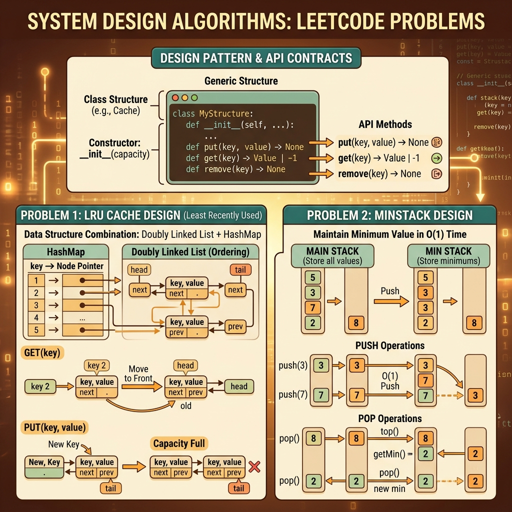

<!-- tags: leetcode, algorithms, coding-interview -->
# 🏗️ Design

> LRU Cache, Min Stack, Twitter Feed, Serialization — system design patterns cho LeetCode

📅 Ngày tạo: 2026-03-20 · 🔄 Cập nhật: 2026-04-10 · ⏱️ 10 phút đọc

| Aspect         | Detail                                              |
| -------------- | --------------------------------------------------- |
| **Complexity** | O(1) amortized for most operations                  |
| **Use case**   | Cache, data structure design, serialization         |
| **Go stdlib**  | `container/list`, `container/heap`, `encoding/json` |
| **LeetCode**   | #146, #155, #208, #295, #297, #355, #380, #588      |

---

### Interview template

> Copy-paste when encountering this type of problem in interviews.

```go
// ── LRU Cache (HashMap + Doubly Linked List) ────────────────────
type LRUCache struct {
    cap        int
    cache      map[int]*Node
    head, tail *Node  // dummy sentinels
}
// Get: find in map, move to front → O(1)
// Put: insert at front; if cap exceeded, remove from tail and map → O(1)

// ── Min Stack (two stacks) ──────────────────────────────────────
type MinStack struct {
    stack    []int
    minStack []int  // tracks current min at each state
}
func (s *MinStack) Push(val int) {
    s.stack = append(s.stack, val)
    if len(s.minStack) == 0 || val <= s.minStack[len(s.minStack)-1] {
        s.minStack = append(s.minStack, val)
    }
}
```
```typescript
// ── LRU Cache (HashMap + Doubly Linked List) ────────────────────
class Node {
  constructor(
    public key = 0,
    public val = 0,
    public prev: Node | null = null,
    public next: Node | null = null,
  ) {}
}

class LRUCache {
  cache = new Map<number, Node>();
  head = new Node();
  tail = new Node();

  constructor(public capacity: number) {
    this.head.next = this.tail;
    this.tail.prev = this.head;
  }
}

// ── Min Stack (two stacks) ──────────────────────────────────────
class MinStack {
  stack: number[] = [];
  minStack: number[] = [];

  push(val: number): void {
    this.stack.push(val);
    if (this.minStack.length === 0 || val <= this.minStack[this.minStack.length - 1]) {
      this.minStack.push(val);
    }
  }
}
```
```rust
// ── LRU Cache (HashMap + Doubly Linked List) ────────────────────
use std::collections::HashMap;

#[derive(Default)]
struct Node {
    key: i32,
    val: i32,
    prev: Option<usize>,
    next: Option<usize>,
}

struct LruCache {
    cap: usize,
    cache: HashMap<i32, usize>,
    nodes: Vec<Node>,
    head: usize,
    tail: usize,
}

// ── Min Stack (two stacks) ──────────────────────────────────────
#[derive(Default)]
struct MinStack {
    stack: Vec<i32>,
    min_stack: Vec<i32>,
}

impl MinStack {
    fn push(&mut self, val: i32) {
        self.stack.push(val);
        if self.min_stack.last().is_none_or(|&m| val <= m) {
            self.min_stack.push(val);
        }
    }
}
```
```cpp
// ── LRU Cache (HashMap + Doubly Linked List) ────────────────────
#include <unordered_map>
#include <vector>

struct Node {
    int key = 0, val = 0;
    Node* prev = nullptr;
    Node* next = nullptr;
};

class LRUCache {
public:
    int cap;
    std::unordered_map<int, Node*> cache;
    Node head, tail;
    explicit LRUCache(int capacity) : cap(capacity) {
        head.next = &tail;
        tail.prev = &head;
    }
};

// ── Min Stack (two stacks) ──────────────────────────────────────
class MinStack {
    std::vector<int> stack_;
    std::vector<int> min_stack_;
public:
    void push(int val) {
        stack_.push_back(val);
        if (min_stack_.empty() || val <= min_stack_.back()) min_stack_.push_back(val);
    }
};
```
```python
# ── LRU Cache (HashMap + Doubly Linked List) ────────────────────
class Node:
    def __init__(self, key: int = 0, val: int = 0) -> None:
        self.key = key
        self.val = val
        self.prev: Node | None = None
        self.next: Node | None = None

class LRUCache:
    def __init__(self, capacity: int) -> None:
        self.capacity = capacity
        self.cache: dict[int, Node] = {}
        self.head = Node()
        self.tail = Node()
        self.head.next = self.tail
        self.tail.prev = self.head

# ── Min Stack (two stacks) ──────────────────────────────────────
class MinStack:
    def __init__(self) -> None:
        self.stack: list[int] = []
        self.min_stack: list[int] = []

    def push(self, val: int) -> None:
        self.stack.append(val)
        if not self.min_stack or val <= self.min_stack[-1]:
            self.min_stack.append(val)
```

---

## 1. DEFINE

`Design` problems in LeetCode differ greatly from pure algorithms. They do not evaluate a single query. This family helps you establish boundaries before coding in the wrong direction.

These problems ask you to build a small API disciplined enough to endure long operation chains. Examples include caches, randomized sets, median finders, and serializers. Correctness here does not live in a single loop. It lives in the contract across multiple operations.

This family measures your understanding of data structures and invariants better than one-shot calculations. If one operation updates state asynchronously from another, the object contradicts itself internally. The API shell might look clean, but the core breaks.

Core insight: **Design problems succeed when every operation protects a consistent internal representation. This structure must support the complexity commitments of every API endpoint.**

| Variant | When to use | Core idea |
| ------- | ------- | ------- |
| Cache design | LRU or LFU, O(1) get/put | Combine multiple data structures to maintain lookup and ordering. |
| Randomized structure | O(1) GetRandom | Support both key access and index access simultaneously. |
| Stateful serializer | Tree serializers, iterators | Objects must store enough state to reconstruct data accurately. |
| API data structure | MinStack, Twitter feeds | Operation invariants matter more than method syntax. |

| Approach | Time | Space | When to choose |
| --- | --- | --- | --- |
| HashMap + doubly linked list | O(1) operations | O(capacity) | Use for LRU or LFU caches needing dynamic ordering. |
| Dynamic array + hash map | O(1) amortized | O(n) | Use for random access and deletion by value. |
| Queue / heap / timestamps | Varies | Depends on state count | Use when timelines or feeds require chronological merging. |
| Recursive serialize/deserialize | O(n) | O(n) | Use when structures require lossless round-trips. |

### 1.1 Quick Identification

- The prompt asks you to implement a class or data structure with multiple operations and target complexities.
- You must design a representation where methods read and write without breaking mutual invariants.
- Suspect this family if the problem mentions O(1), O(log n), random access, serialization, streams, or caches.

### 1.2 Invariants & Failure Modes

- Every operation must update all auxiliary structures before the object reaches a stable state again.
- The internal representation must reflect the external contract after any sequence of method calls.
- Common failure mode: Main methods pass individually. However, combining methods causes state drift because an auxiliary structure loses sync.

## 2. VISUAL

Design problems yêu cầu implement class thỏa operation contract. Hình dưới phân loại bốn sub-family chính để chọn đúng data structure nền.

### Overview — Design Problems



*Hình: Design = implement class thỏa operation contract. Quan trọng: chọn đúng data structure nền.*


### Level 1 — Core intuition

```text
LRU Cache
map[key] -> node in doubly linked list

HEAD <-> most recently used ... least recently used <-> TAIL

Get(key):  find node in map -> move node to front
Put(key):  insert/update node at front
Evict:     remove node near tail
```

*Caption*: Level 1 shows that an O(1) cache requires multiple structures. A map handles lookups. A doubly linked list tracks recency order.

### Level 2 — Detailed decision trace

- For design questions, view every method as a mutation on a shared state machine. They are not independent functions.
- LRU caches succeed because every `get` or `put` updates the recency order and syncs the map.
- RandomizedSet achieves O(1) because deletions swap elements with the last position. The map then updates the moved index.
- Serialization succeeds when the format encodes enough data to rebuild structures, including null markers.

The diagram shows internal data structures. The code implements operation contracts. Syncing between HashMaps and linked lists is the most common failure point.

## 3. CODE

Once the object invariant locks, your code should revolve around data and method interactions rather than isolated tricks. We move from basic caches to streams and serializers.

### Problem 1: Basic — LRU Cache [LC #146]
> **Goal**: Design a cache with O(1) `get` and `put` operations and recency-based eviction.
> **Approach**: Use a HashMap for lookups and a doubly linked list for ordering.
> **Example**: Sequences of `put` and `get` operations under constrained capacity testing evictions.
> **Complexity**: O(1) time for `get` and `put`. O(capacity) space.

```go
// leetcode/lru_cache.go
package leetcode

// ✅ LC #146: LRU Cache
// HashMap (key → node) + Doubly Linked List (order)
// All operations O(1)

type DLLNode struct {
    key, val   int
    prev, next *DLLNode
}

type LRUCache struct {
    capacity int
    cache    map[int]*DLLNode
    head     *DLLNode // ✅ Dummy head (MRU side)
    tail     *DLLNode // ✅ Dummy tail (LRU side)
}

func NewLRUCache(capacity int) LRUCache {
    head := &DLLNode{}
    tail := &DLLNode{}
    head.next = tail
    tail.prev = head

    return LRUCache{
        capacity: capacity,
        cache:    make(map[int]*DLLNode),
        head:     head,
        tail:     tail,
    }
}

func (c *LRUCache) Get(key int) int {
    if node, ok := c.cache[key]; ok {
        c.moveToFront(node) // ✅ Mark as recently used
        return node.val
    }
    return -1
}

func (c *LRUCache) Put(key, value int) {
    if node, ok := c.cache[key]; ok {
        node.val = value
        c.moveToFront(node)
        return
    }

    // ✅ New node
    node := &DLLNode{key: key, val: value}
    c.cache[key] = node
    c.addToFront(node)

    // ✅ Evict LRU if over capacity
    if len(c.cache) > c.capacity {
        lru := c.tail.prev
        c.removeNode(lru)
        delete(c.cache, lru.key) // ⚠️ Need key stored in node
    }
}

func (c *LRUCache) addToFront(node *DLLNode) {
    node.prev = c.head
    node.next = c.head.next
    c.head.next.prev = node
    c.head.next = node
}

func (c *LRUCache) removeNode(node *DLLNode) {
    node.prev.next = node.next
    node.next.prev = node.prev
}

func (c *LRUCache) moveToFront(node *DLLNode) {
    c.removeNode(node)
    c.addToFront(node)
}
```
```typescript
// leetcode/lru_cache.ts
class Node {
  constructor(
    public key = 0,
    public val = 0,
    public prev: Node | null = null,
    public next: Node | null = null,
  ) {}
}

class LRUCache {
  private cache = new Map<number, Node>();
  private head = new Node();
  private tail = new Node();

  constructor(private capacity: number) {
    this.head.next = this.tail;
    this.tail.prev = this.head;
  }

  get(key: number): number {
    const node = this.cache.get(key);
    if (!node) return -1;
    this.moveToFront(node);
    return node.val;
  }

  put(key: number, value: number): void {
    const existing = this.cache.get(key);
    if (existing) {
      existing.val = value;
      this.moveToFront(existing);
      return;
    }

    const node = new Node(key, value);
    this.cache.set(key, node);
    this.addToFront(node);

    if (this.cache.size > this.capacity) {
      const lru = this.tail.prev!;
      this.removeNode(lru);
      this.cache.delete(lru.key);
    }
  }

  private addToFront(node: Node): void {
    node.prev = this.head;
    node.next = this.head.next;
    this.head.next!.prev = node;
    this.head.next = node;
  }

  private removeNode(node: Node): void {
    node.prev!.next = node.next;
    node.next!.prev = node.prev;
  }

  private moveToFront(node: Node): void {
    this.removeNode(node);
    this.addToFront(node);
  }
}
```
```rust
// leetcode/lru_cache.rs
use std::collections::{HashMap, VecDeque};

struct LruCache {
    capacity: usize,
    order: VecDeque<i32>,
    values: HashMap<i32, i32>,
}

impl LruCache {
    fn new(capacity: i32) -> Self {
        Self {
            capacity: capacity as usize,
            order: VecDeque::new(),
            values: HashMap::new(),
        }
    }

    fn get(&mut self, key: i32) -> i32 {
        if let Some(&val) = self.values.get(&key) {
            self.order.retain(|&k| k != key);
            self.order.push_front(key);
            val
        } else {
            -1
        }
    }

    fn put(&mut self, key: i32, value: i32) {
        if self.values.contains_key(&key) {
            self.order.retain(|&k| k != key);
        } else if self.values.len() == self.capacity {
            if let Some(lru) = self.order.pop_back() {
                self.values.remove(&lru);
            }
        }
        self.values.insert(key, value);
        self.order.push_front(key);
    }
}
```
```cpp
// leetcode/lru_cache.cpp
#include <list>
#include <unordered_map>

class LRUCache {
    using It = std::list<std::pair<int, int>>::iterator;
    int capacity_;
    std::list<std::pair<int, int>> dll_;
    std::unordered_map<int, It> cache_;

public:
    explicit LRUCache(int capacity) : capacity_(capacity) {}

    int get(int key) {
        auto it = cache_.find(key);
        if (it == cache_.end()) return -1;
        dll_.splice(dll_.begin(), dll_, it->second);
        return it->second->second;
    }

    void put(int key, int value) {
        if (auto it = cache_.find(key); it != cache_.end()) {
            it->second->second = value;
            dll_.splice(dll_.begin(), dll_, it->second);
            return;
        }
        dll_.push_front({key, value});
        cache_[key] = dll_.begin();
        if (static_cast<int>(cache_.size()) > capacity_) {
            auto [old_key, _] = dll_.back();
            cache_.erase(old_key);
            dll_.pop_back();
        }
    }
};
```
```python
# leetcode/lru_cache.py
class Node:
    def __init__(self, key: int = 0, val: int = 0) -> None:
        self.key = key
        self.val = val
        self.prev: Node | None = None
        self.next: Node | None = None

class LRUCache:
    def __init__(self, capacity: int) -> None:
        self.capacity = capacity
        self.cache: dict[int, Node] = {}
        self.head = Node()
        self.tail = Node()
        self.head.next = self.tail
        self.tail.prev = self.head

    def get(self, key: int) -> int:
        node = self.cache.get(key)
        if node is None:
            return -1
        self._move_to_front(node)
        return node.val

    def put(self, key: int, value: int) -> None:
        if key in self.cache:
            node = self.cache[key]
            node.val = value
            self._move_to_front(node)
            return

        node = Node(key, value)
        self.cache[key] = node
        self._add_to_front(node)
        if len(self.cache) > self.capacity:
            lru = self.tail.prev
            assert lru is not None
            self._remove_node(lru)
            del self.cache[lru.key]

    def _add_to_front(self, node: Node) -> None:
        node.prev = self.head
        node.next = self.head.next
        self.head.next.prev = node
        self.head.next = node

    def _remove_node(self, node: Node) -> None:
        node.prev.next = node.next
        node.next.prev = node.prev

    def _move_to_front(self, node: Node) -> None:
        self._remove_node(node)
        self._add_to_front(node)
```

> **Why?** A map alone fails because it loses recency order. A linked list alone requires O(n) lookups. LRU perfectly demonstrates coordinating two structures to balance fast queries and fast reordering.

> **Conclusion**: This **Basic** example demonstrates solving `LRU Cache [LC #146]` while preserving invariants. When interviews demand extra APIs or durability, expand this skeleton instead of rewriting everything.

### Problem 2: Intermediate — Insert Delete GetRandom O(1) [LC #380]
> **Goal**: Combine arrays and maps to support insertions, deletions, and random selections in amortized O(1) time.
> **Approach**: Store elements in an array and map values to indices. Delete by swapping with the last element and popping.
> **Example**: Chains of insertions, deletions, and random requests on a dynamic set.
> **Complexity**: Amortized O(1) time per operation. O(n) space.

```go
// leetcode/randomized_set.go
package leetcode

import "math/rand"

// ✅ LC #380: Insert Delete GetRandom O(1)
// HashMap (val → index) + Dynamic Array
type RandomizedSet struct {
    valToIdx map[int]int
    vals     []int
}

func NewRandomizedSet() RandomizedSet {
    return RandomizedSet{valToIdx: make(map[int]int)}
}

func (s *RandomizedSet) Insert(val int) bool {
    if _, ok := s.valToIdx[val]; ok {
        return false
    }
    s.valToIdx[val] = len(s.vals)
    s.vals = append(s.vals, val)
    return true
}

func (s *RandomizedSet) Remove(val int) bool {
    idx, ok := s.valToIdx[val]
    if !ok {
        return false
    }

    // ✅ Swap with last element → O(1) removal
    lastVal := s.vals[len(s.vals)-1]
    s.vals[idx] = lastVal
    s.valToIdx[lastVal] = idx

    s.vals = s.vals[:len(s.vals)-1]
    delete(s.valToIdx, val)
    return true
}

func (s *RandomizedSet) GetRandom() int {
    return s.vals[rand.Intn(len(s.vals))]
}
```
```typescript
// leetcode/randomized_set.ts
class RandomizedSet {
  private valToIdx = new Map<number, number>();
  private vals: number[] = [];

  insert(val: number): boolean {
    if (this.valToIdx.has(val)) return false;
    this.valToIdx.set(val, this.vals.length);
    this.vals.push(val);
    return true;
  }

  remove(val: number): boolean {
    const idx = this.valToIdx.get(val);
    if (idx === undefined) return false;

    const lastVal = this.vals[this.vals.length - 1];
    this.vals[idx] = lastVal;
    this.valToIdx.set(lastVal, idx);
    this.vals.pop();
    this.valToIdx.delete(val);
    return true;
  }

  getRandom(): number {
    return this.vals[Math.floor(Math.random() * this.vals.length)];
  }
}
```
```rust
// leetcode/randomized_set.rs
use std::collections::HashMap;

struct RandomizedSet {
    val_to_idx: HashMap<i32, usize>,
    vals: Vec<i32>,
}

impl RandomizedSet {
    fn new() -> Self {
        Self { val_to_idx: HashMap::new(), vals: Vec::new() }
    }

    fn insert(&mut self, val: i32) -> bool {
        if self.val_to_idx.contains_key(&val) { return false; }
        self.val_to_idx.insert(val, self.vals.len());
        self.vals.push(val);
        true
    }

    fn remove(&mut self, val: i32) -> bool {
        let Some(&idx) = self.val_to_idx.get(&val) else { return false };
        let last = *self.vals.last().unwrap();
        self.vals[idx] = last;
        self.val_to_idx.insert(last, idx);
        self.vals.pop();
        self.val_to_idx.remove(&val);
        true
    }
}
```
```cpp
// leetcode/randomized_set.cpp
#include <cstdlib>
#include <unordered_map>
#include <vector>

class RandomizedSet {
    std::unordered_map<int, int> val_to_idx_;
    std::vector<int> vals_;

public:
    bool insert(int val) {
        if (val_to_idx_.count(val)) return false;
        val_to_idx_[val] = static_cast<int>(vals_.size());
        vals_.push_back(val);
        return true;
    }

    bool remove(int val) {
        auto it = val_to_idx_.find(val);
        if (it == val_to_idx_.end()) return false;
        int idx = it->second;
        int last = vals_.back();
        vals_[idx] = last;
        val_to_idx_[last] = idx;
        vals_.pop_back();
        val_to_idx_.erase(val);
        return true;
    }

    int get_random() const {
        return vals_[std::rand() % vals_.size()];
    }
};
```
```python
# leetcode/randomized_set.py
import random

class RandomizedSet:
    def __init__(self) -> None:
        self.val_to_idx: dict[int, int] = {}
        self.vals: list[int] = []

    def insert(self, val: int) -> bool:
        if val in self.val_to_idx:
            return False
        self.val_to_idx[val] = len(self.vals)
        self.vals.append(val)
        return True

    def remove(self, val: int) -> bool:
        if val not in self.val_to_idx:
            return False
        idx = self.val_to_idx[val]
        last = self.vals[-1]
        self.vals[idx] = last
        self.val_to_idx[last] = idx
        self.vals.pop()
        del self.val_to_idx[val]
        return True

    def get_random(self) -> int:
        return random.choice(self.vals)
```

> **Why?** Deletion poses the hardest O(1) challenge. The swap-with-last trick works because arrays afford random access, and maps store the deletion target's index. Failing to update the swapped index corrupts the structure for future deletions.

> **Conclusion**: This **Intermediate** example demonstrates solving `Insert Delete GetRandom O(1) [LC #380]` while preserving invariants. When interviews demand extra APIs or durability, expand this skeleton instead of rewriting everything.

### Problem 3: Advanced — Serialize/Deserialize Binary Tree [LC #297]
> **Goal**: Build a serialization format rich enough to reconstruct trees accurately.
> **Approach**: Use Preorder or BFS traversals with null markers. A parser reads back using the same contract.
> **Example**: A binary tree with sparse branches requires a lossless round-trip.
> **Complexity**: O(n) time and O(n) space.

```go
// leetcode/serialize_tree.go
package leetcode

import (
    "strconv"
    "strings"
)

// ✅ LC #297: Serialize and Deserialize Binary Tree (HARD)
// Preorder DFS with "null" markers
type Codec struct{}

func (c *Codec) serialize(root *TreeNode) string {
    var sb strings.Builder
    c.serializeDFS(root, &sb)
    return sb.String()
}

func (c *Codec) serializeDFS(node *TreeNode, sb *strings.Builder) {
    if node == nil {
        sb.WriteString("null,")
        return
    }
    sb.WriteString(strconv.Itoa(node.Val))
    sb.WriteByte(',')
    c.serializeDFS(node.Left, sb)
    c.serializeDFS(node.Right, sb)
}

func (c *Codec) deserialize(data string) *TreeNode {
    vals := strings.Split(data, ",")
    idx := 0
    return c.deserializeDFS(vals, &idx)
}

func (c *Codec) deserializeDFS(vals []string, idx *int) *TreeNode {
    if *idx >= len(vals) || vals[*idx] == "null" {
        *idx++
        return nil
    }
    val, _ := strconv.Atoi(vals[*idx])
    *idx++
    node := &TreeNode{Val: val}
    node.Left = c.deserializeDFS(vals, idx)
    node.Right = c.deserializeDFS(vals, idx)
    return node
}
```
```typescript
// leetcode/serialize_tree.ts
class TreeNode {
  constructor(
    public val = 0,
    public left: TreeNode | null = null,
    public right: TreeNode | null = null,
  ) {}
}

class Codec {
  serialize(root: TreeNode | null): string {
    const out: string[] = [];
    const dfs = (node: TreeNode | null): void => {
      if (!node) {
        out.push("null");
        return;
      }
      out.push(String(node.val));
      dfs(node.left);
      dfs(node.right);
    };
    dfs(root);
    return out.join(",");
  }

  deserialize(data: string): TreeNode | null {
    const vals = data.split(",");
    let idx = 0;
    const dfs = (): TreeNode | null => {
      if (idx >= vals.length || vals[idx] === "null") {
        idx++;
        return null;
      }
      const node = new TreeNode(Number(vals[idx++]));
      node.left = dfs();
      node.right = dfs();
      return node;
    };
    return dfs();
  }
}
```
```rust
// leetcode/serialize_tree.rs
#[derive(Clone)]
struct TreeNode {
    val: i32,
    left: Option<Box<TreeNode>>,
    right: Option<Box<TreeNode>>,
}

struct Codec;

impl Codec {
    fn serialize(root: &Option<Box<TreeNode>>) -> String {
        fn dfs(node: &Option<Box<TreeNode>>, out: &mut Vec<String>) {
            if let Some(node) = node {
                out.push(node.val.to_string());
                dfs(&node.left, out);
                dfs(&node.right, out);
            } else {
                out.push("null".to_string());
            }
        }
        let mut out = Vec::new();
        dfs(root, &mut out);
        out.join(",")
    }

    fn deserialize(data: String) -> Option<Box<TreeNode>> {
        fn dfs(vals: &[&str], idx: &mut usize) -> Option<Box<TreeNode>> {
            if *idx >= vals.len() || vals[*idx] == "null" {
                *idx += 1;
                return None;
            }
            let val = vals[*idx].parse().unwrap();
            *idx += 1;
            Some(Box::new(TreeNode {
                val,
                left: dfs(vals, idx),
                right: dfs(vals, idx),
            }))
        }
        let vals: Vec<_> = data.split(',').collect();
        dfs(&vals, &mut 0)
    }
}
```
```cpp
// leetcode/serialize_tree.cpp
#include <sstream>
#include <string>
#include <vector>

struct TreeNode {
    int val;
    TreeNode* left;
    TreeNode* right;
    explicit TreeNode(int x) : val(x), left(nullptr), right(nullptr) {}
};

class Codec {
public:
    std::string serialize(TreeNode* root) {
        std::ostringstream out;
        serialize_dfs(root, out);
        return out.str();
    }

    TreeNode* deserialize(const std::string& data) {
        std::vector<std::string> vals;
        std::stringstream ss(data);
        std::string item;
        while (std::getline(ss, item, ',')) vals.push_back(item);
        int idx = 0;
        return deserialize_dfs(vals, idx);
    }

private:
    void serialize_dfs(TreeNode* node, std::ostringstream& out) {
        if (!node) {
            out << "null,";
            return;
        }
        out << node->val << ',';
        serialize_dfs(node->left, out);
        serialize_dfs(node->right, out);
    }

    TreeNode* deserialize_dfs(const std::vector<std::string>& vals, int& idx) {
        if (idx >= static_cast<int>(vals.size()) || vals[idx] == "null") {
            ++idx;
            return nullptr;
        }
        TreeNode* node = new TreeNode(std::stoi(vals[idx++]));
        node->left = deserialize_dfs(vals, idx);
        node->right = deserialize_dfs(vals, idx);
        return node;
    }
};
```
```python
# leetcode/serialize_tree.py
class TreeNode:
    def __init__(self, val: int = 0, left: "TreeNode | None" = None, right: "TreeNode | None" = None) -> None:
        self.val = val
        self.left = left
        self.right = right

class Codec:
    def serialize(self, root: TreeNode | None) -> str:
        out: list[str] = []

        def dfs(node: TreeNode | None) -> None:
            if node is None:
                out.append("null")
                return
            out.append(str(node.val))
            dfs(node.left)
            dfs(node.right)

        dfs(root)
        return ",".join(out)

    def deserialize(self, data: str) -> TreeNode | None:
        vals = data.split(",")
        idx = 0

        def dfs() -> TreeNode | None:
            nonlocal idx
            if idx >= len(vals) or vals[idx] == "null":
                idx += 1
                return None
            node = TreeNode(int(vals[idx]))
            idx += 1
            node.left = dfs()
            node.right = dfs()
            return node

        return dfs()
```

> **Why?** Serialization requires design skills because you must establish a data contract. If formats lack null markers or consistent traversal orders, the sender and receiver rebuild completely different trees.

> **Conclusion**: This **Advanced** example demonstrates solving `Serialize/Deserialize Binary Tree [LC #297]` while preserving invariants. When interviews demand extra APIs or durability, expand this skeleton instead of rewriting everything.

> **✅ Achieved**: O(1) LRU Cache, O(1) RandomizedSet, and Tree serialization.
> **⚠️ Note**: For LRU, store keys inside doubly linked list nodes for O(1) evictions. For RandomizedSet, leverage the swap-with-last trick.

---
Design problems create the illusion that passing single methods equals success. However, combining methods often triggers state drift. The pitfalls below highlight these patterns.

## 4. PITFALLS

Design errors rarely manifest in a single method. They surface when overlapping operations cause representation drift.

| # | Severity | Error | Consequence | Fix |
|---|----------|-------|-------------|-----|
| 1 | 🔴 Fatal | LRU: Forgetting to store keys in nodes. | Wrong result or runtime error. | You need keys to delete HashMap entries during evictions. |
| 2 | 🟡 Common | LRU: Missing dummy head and tail. | Wrong result or runtime error. | Dummy nodes eliminate nil checks for edge cases. |
| 3 | 🟡 Common | RandomizedSet: O(n) remove operations. | Timeout or wrong result. | Swap the target with the last array element for O(1) deletion. |
| 4 | 🔵 Minor | Serialize: Delimiter conflicts. | Wrong result or runtime error. | Use unique delimiters and handle null markers properly. |

### 🔴 Pitfall #1 — LRU Cache: Forgetting to store keys in nodes

LRU Cache code using a HashMap and a doubly linked list:

```go
type Node struct {
    val        int
    prev, next *Node
}
// Evict: remove tail.prev from list → nhưng xóa entry nào trong HashMap?
```

When capacity caps, you remove the tail node. To delete the matching HashMap entry, you must know the node's key. If the node stores only values, you cannot identify the HashMap key. This causes memory leaks.

**Fix**: `type Node struct { key, val int; prev, next *Node }`. Store keys inside nodes so evictions can clear HashMap entries accurately.


---

## 5. REF

| Resource               | Link                                                                                                                                |
| ---------------------- | ----------------------------------------------------------------------------------------------------------------------------------- |
| LC #146 LRU Cache      | [leetcode.com/problems/lru-cache](https://leetcode.com/problems/lru-cache/)                                                         |
| LC #380 RandomizedSet  | [leetcode.com/problems/insert-delete-getrandom-o1](https://leetcode.com/problems/insert-delete-getrandom-o1/)                       |
| LC #297 Serialize Tree | [leetcode.com/problems/serialize-and-deserialize-binary-tree](https://leetcode.com/problems/serialize-and-deserialize-binary-tree/) |

---

## 6. RECOMMEND

When you master composing primitives for operation contracts, you must categorize new problems. Decide if a problem requires list-and-map caches, a foundational heap, a trie, or a simpler handbook approach.

| Extension | When to use | Reason | File/Link |
| --------- | ----------- | ------ | --------- |
| Linked List | LRU or LFU with a doubly linked list and map. | Master primitive rewiring behind cache designs. | [04-linked-list](./04-linked-list.md) |
| Heap & Priority Queue | Median finders, scheduling, top-priority tasks. | Many design problems decompose into priority structures. | [11-heap-priority-queue](./11-heap-priority-queue.md) |
| Trie | File systems, autocomplete, prefix dictionaries. | Switch to specialized trees for prefix-based keys. | [12-trie](./12-trie.md) |
| Advanced Binary Tree | Iterators, serialization, tree components. | Compare object designs against node-based recursion. | [22-advanced-trees](./22-advanced-trees.md) |

---

## 7. QUICK REF

| Situation / Signal | Pattern / Approach | Complexity | When to use | Warning |
|--------------------|--------------------|------------|-------------|---------|
| LRU cache, O(1) get/put | HashMap and Doubly Linked List | O(1) time, O(capacity) space | LC #146: LRU Cache | Dummy heads and tails eliminate edge cases. |
| Min or max in O(1) | Two stacks: main and auxiliary | O(1) time, O(n) space | LC #155: Min Stack | Push to the min stack when values are smaller or equal. |
| Streaming median | Max-heap and min-heap | O(log n) per operation | LC #295: Find Median | Balance sizes to keep differences below two. |
| O(1) insert, delete, random | Array and HashMap (value to index) | O(1) amortized, O(n) space | LC #380: Random Set | Swap deleted targets with the last array element. |
| Serialize tree | DFS or BFS with delimiter encoding | O(n) time, O(n) space | LC #297: Serialize Tree | Encode null markers accurately for reconstruction. |

---

Return to the opening class implementation problem. You now know design problems demand consistent internal representations. Every operation must rigorously protect this state.

---

**Links**: [← String](./15-string.md) · [→ README](./README.md)
