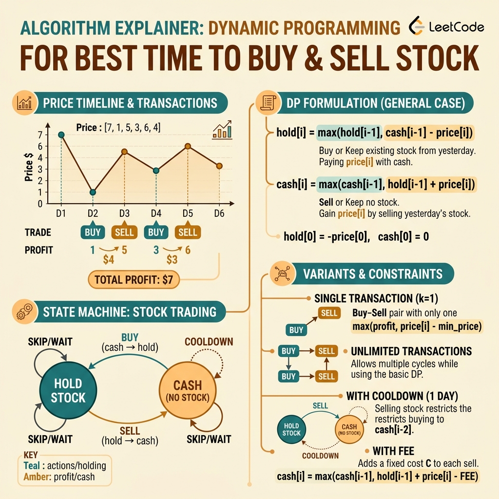

<!-- tags: leetcode, algorithms, coding-interview -->
# 📈 Buy & Sell Stock Series

> State machine DP — solves the complete set of 6 Best Time to Buy and Sell Stock problems.

📅 Created: 2026-03-20 · 🔄 Updated: 2026-04-10 · ⏱️ 11 min read

| Aspect         | Detail                                       |
| -------------- | -------------------------------------------- |
| **Complexity** | O(n) for all variants                        |
| **Use case**   | Stock trading optimization, state machine DP |
| **Go stdlib**  | `math.MaxInt`                                |
| **LeetCode**   | #121, #122, #123, #188, #309, #714           |

---

### Interview template

> Copy-paste this template when encountering this problem type in interviews.

```go
// ── Stock I — One transaction ───────────────────────────────────
minPrice, maxProfit := prices[0], 0
for _, p := range prices {
    maxProfit = max(maxProfit, p-minPrice)
    minPrice  = min(minPrice, p)
}

// ── Stock State Machine — General ───────────────────────────────
// States: hold=have stock, cash=no stock
hold := -prices[0]   // bought on day 0
cash := 0
for _, p := range prices[1:] {
    hold = max(hold, cash-p)    // keep or buy
    cash = max(cash, hold+p)    // keep or sell
}
return cash
```
```typescript
// ── Stock I — One transaction ───────────────────────────────────
let minPrice = prices[0], maxProfit = 0;
for (const p of prices) {
  maxProfit = Math.max(maxProfit, p - minPrice);
  minPrice = Math.min(minPrice, p);
}

// ── Stock State Machine — General ───────────────────────────────
let hold = -prices[0];
let cash = 0;
for (const p of prices.slice(1)) {
  const nextHold = Math.max(hold, cash - p);
  const nextCash = Math.max(cash, hold + p);
  hold = nextHold;
  cash = nextCash;
}
return cash;
```
```rust
// ── Stock I — One transaction ───────────────────────────────────
let (mut min_price, mut max_profit) = (prices[0], 0);
for &p in &prices {
    max_profit = max_profit.max(p - min_price);
    min_price = min_price.min(p);
}

// ── Stock State Machine — General ───────────────────────────────
let (mut hold, mut cash) = (-prices[0], 0);
for &p in prices.iter().skip(1) {
    let next_hold = hold.max(cash - p);
    let next_cash = cash.max(hold + p);
    hold = next_hold;
    cash = next_cash;
}
cash
```
```cpp
// ── Stock I — One transaction ───────────────────────────────────
int min_price = prices[0], max_profit = 0;
for (int p : prices) {
    max_profit = std::max(max_profit, p - min_price);
    min_price = std::min(min_price, p);
}

// ── Stock State Machine — General ───────────────────────────────
int hold = -prices[0], cash = 0;
for (size_t i = 1; i < prices.size(); ++i) {
    int next_hold = std::max(hold, cash - prices[i]);
    int next_cash = std::max(cash, hold + prices[i]);
    hold = next_hold;
    cash = next_cash;
}
return cash;
```
```python
# ── Stock I — One transaction ───────────────────────────────────
min_price, max_profit = prices[0], 0
for p in prices:
    max_profit = max(max_profit, p - min_price)
    min_price = min(min_price, p)

# ── Stock State Machine — General ───────────────────────────────
hold, cash = -prices[0], 0
for p in prices[1:]:
    hold, cash = max(hold, cash - p), max(cash, hold + p)
return cash
```

---

## 1. DEFINE

Stock problems appear similar but small constraints change everything. The difference between one transaction, unlimited, K, cooldown, or fee dictates the approach. The Buy & Sell Stock series helps you identify these boundaries before writing incorrect code.

These problems trap many candidates with intuitive greedy logic. Picking the best buy and sell points on a chart seems logical. This intuition breaks completely when adding cooldowns, fees, or transaction limits. The Buy & Sell Stock family is actually a clean state machine DP.

The core lesson is not about the stock market. It is about converting a financial narrative into mechanical states. You track holding status, cash balance, remaining transactions, and cooldown periods. Different variants consolidate cleanly once you define the correct state.

Core insight: **The stock family becomes clear when you describe every trading day using minimal states that encode current constraints.**

| Variant | Signal | Core Idea |
| ------- | ------ | --------- |
| One transaction | Allowed only one buy and sell | Track the minimum seen price to maximize profit. |
| Unlimited transactions | Allowed multiple trades | Simple `hold/cash` state machine allows rebuying after selling. |
| Cooldown / fee | Constraints after selling or fee per trade | Transitions must reference past states from the correct day or subtract fees. |
| K transactions | Limited to maximum k trades | Expand the state machine with an extra dimension for transaction counts. |

| Approach | Time | Space | When to use |
| --- | --- | --- | --- |
| Track-min greedy | O(n) | O(1) | Use for Stock I when allowed only one transaction. |
| Two-state DP | O(n) | O(1) | Use for unlimited transactions or basic fees. |
| State machine with delayed cash | O(n) | O(1) | Use for cooldowns where buys must reference older cash states. |
| DP over transaction count | O(nk) | O(k) or O(nk) | Use when the problem restricts the total number of transactions. |

### 1.1 Quick Identification

- The problem mentions buy/sell, max profit, cooldowns, fees, or a `k` transaction limit.
- Each day transitions from one asset state to another with explicit gains or losses.
- Suspect a state machine DP if greedy logic fails upon adding minor constraints.

### 1.2 Invariants & Failure Modes

- The state must accurately encode your holding status and active constraints.
- Daily transitions must only use states from the previous day or valid cooldown days.
- Common failure: memorizing the profit formula without understanding the `hold/cash` state representation. This causes errors when adding fees or K transactions.

## 2. VISUAL

Stock problems represent state machine DPs with clear structures. The image below categorizes four variants based on trade constraints.

### Overview — Buy & Sell Stock



*Image: Stock = state machine DP. States: hold/cash/cooldown. Transition = buy/sell/rest.*


### Level 1 — Core intuition

```text
State machine
CASH --buy(-price)--> HOLD
HOLD --sell(+price)--> CASH

Each day:
- Keep the previous state.
- Or transition if today's action yields better profit.
```

*Caption*: Level 1 demonstrates that the entire stock family reduces to two daily questions. Are you holding stock or holding cash?

### Level 2 — Detailed decision trace

- Stock I requires one `minPrice` variable for a single buy and sell.
- Stock II, fee, and cooldown variants use two-state machines. They differ in which cash state is valid for rebuying.
- Cooldown variants prevent the buy state from reading the cash state of the immediate post-sell day.
- K transaction variants assign a `hold[t] / cash[t]` pair to each tier. Incorrect update order breaks invariants.

The state machine diagram illustrates state transitions. The code implements this logic. The transaction limit constraint dictates the correct formula.

## 3. CODE

Once the state machine locks in, the code simply updates daily states. We progress from basic stock problems to cooldowns, fees, and transaction limits.

### Problem 1: Basic — Stock I & II [LC #121, #122]
> **Objective**: See the link between single-transaction greedy logic and unlimited-transaction state machines.
> **Approach**: Track the minimum price for Stock I. Elevate this to `hold/cash` for multiple trades.
> **Example**: prices = [7,1,5,3,6,4] or [1,2,3,4,5].
> **Complexity**: O(n) time, O(1) space.

```go
// leetcode/stock_basic.go
package leetcode

// ✅ LC #121: Best Time to Buy and Sell Stock (1 transaction)
// Greedy: track min price, maximize (price - minPrice)
// Time: O(n), Space: O(1)
func maxProfitI(prices []int) int {
    minPrice := prices[0]
    maxProfit := 0

    for _, price := range prices {
        if price < minPrice {
            minPrice = price // ✅ Update min buy price
        }
        if profit := price - minPrice; profit > maxProfit {
            maxProfit = profit // ✅ Update max profit
        }
    }

    return maxProfit
}

// ✅ State machine version of Stock I
// hold = max profit while holding (1 buy allowed from 0)
// cash = max profit while not holding (after sell)
func maxProfitISM(prices []int) int {
    hold := -prices[0] // ⚠️ Buy on day 0
    cash := 0

    for i := 1; i < len(prices); i++ {
        if -prices[i] > hold {
            hold = -prices[i] // ✅ Buy at lower price (from 0, not cash)
        }
        if hold + prices[i] > cash {
            cash = hold + prices[i] // ✅ Sell
        }
    }

    return cash
}

// ✅ LC #122: Best Time to Buy and Sell Stock II (unlimited transactions)
// Greedy: capture EVERY upward movement
// Time: O(n), Space: O(1)
func maxProfitII(prices []int) int {
    profit := 0

    for i := 1; i < len(prices); i++ {
        if prices[i] > prices[i-1] {
            profit += prices[i] - prices[i-1] // ✅ Capture gain
        }
    }

    return profit
}

// ✅ State machine version of Stock II
func maxProfitIISM(prices []int) int {
    hold := -prices[0]
    cash := 0

    for i := 1; i < len(prices); i++ {
        newHold := hold
        if cash - prices[i] > newHold {
            newHold = cash - prices[i] // ✅ Buy (from cash, not 0)
        }
        newCash := cash
        if hold + prices[i] > newCash {
            newCash = hold + prices[i] // ✅ Sell
        }
        hold, cash = newHold, newCash
    }

    return cash
}
```
```typescript
// leetcode/stock_basic.ts
function maxProfitI(prices: number[]): number {
  let minPrice = prices[0];
  let maxProfit = 0;
  for (const price of prices) {
    minPrice = Math.min(minPrice, price);
    maxProfit = Math.max(maxProfit, price - minPrice);
  }
  return maxProfit;
}

function maxProfitISM(prices: number[]): number {
  let hold = -prices[0];
  let cash = 0;
  for (let i = 1; i < prices.length; i++) {
    hold = Math.max(hold, -prices[i]);
    cash = Math.max(cash, hold + prices[i]);
  }
  return cash;
}

function maxProfitII(prices: number[]): number {
  let profit = 0;
  for (let i = 1; i < prices.length; i++) {
    if (prices[i] > prices[i - 1]) profit += prices[i] - prices[i - 1];
  }
  return profit;
}

function maxProfitIISM(prices: number[]): number {
  let hold = -prices[0];
  let cash = 0;
  for (let i = 1; i < prices.length; i++) {
    const nextHold = Math.max(hold, cash - prices[i]);
    const nextCash = Math.max(cash, hold + prices[i]);
    hold = nextHold;
    cash = nextCash;
  }
  return cash;
}
```
```rust
// leetcode/stock_basic.rs
fn max_profit_i(prices: Vec<i32>) -> i32 {
    let (mut min_price, mut max_profit) = (prices[0], 0);
    for &price in &prices {
        min_price = min_price.min(price);
        max_profit = max_profit.max(price - min_price);
    }
    max_profit
}

fn max_profit_i_sm(prices: Vec<i32>) -> i32 {
    let (mut hold, mut cash) = (-prices[0], 0);
    for &price in prices.iter().skip(1) {
        hold = hold.max(-price);
        cash = cash.max(hold + price);
    }
    cash
}

fn max_profit_ii(prices: Vec<i32>) -> i32 {
    prices.windows(2).map(|w| (w[1] - w[0]).max(0)).sum()
}

fn max_profit_ii_sm(prices: Vec<i32>) -> i32 {
    let (mut hold, mut cash) = (-prices[0], 0);
    for &price in prices.iter().skip(1) {
        let next_hold = hold.max(cash - price);
        let next_cash = cash.max(hold + price);
        hold = next_hold;
        cash = next_cash;
    }
    cash
}
```
```cpp
// leetcode/stock_basic.cpp
#include <algorithm>
#include <vector>

int max_profit_i(const std::vector<int>& prices) {
    int min_price = prices[0], max_profit = 0;
    for (int price : prices) {
        min_price = std::min(min_price, price);
        max_profit = std::max(max_profit, price - min_price);
    }
    return max_profit;
}

int max_profit_i_sm(const std::vector<int>& prices) {
    int hold = -prices[0], cash = 0;
    for (size_t i = 1; i < prices.size(); ++i) {
        hold = std::max(hold, -prices[i]);
        cash = std::max(cash, hold + prices[i]);
    }
    return cash;
}

int max_profit_ii(const std::vector<int>& prices) {
    int profit = 0;
    for (size_t i = 1; i < prices.size(); ++i) {
        if (prices[i] > prices[i - 1]) profit += prices[i] - prices[i - 1];
    }
    return profit;
}

int max_profit_ii_sm(const std::vector<int>& prices) {
    int hold = -prices[0], cash = 0;
    for (size_t i = 1; i < prices.size(); ++i) {
        int next_hold = std::max(hold, cash - prices[i]);
        int next_cash = std::max(cash, hold + prices[i]);
        hold = next_hold;
        cash = next_cash;
    }
    return cash;
}
```
```python
# leetcode/stock_basic.py
def max_profit_i(prices: list[int]) -> int:
    min_price = prices[0]
    max_profit = 0
    for price in prices:
        min_price = min(min_price, price)
        max_profit = max(max_profit, price - min_price)
    return max_profit

def max_profit_i_sm(prices: list[int]) -> int:
    hold, cash = -prices[0], 0
    for price in prices[1:]:
        hold = max(hold, -price)
        cash = max(cash, hold + price)
    return cash

def max_profit_ii(prices: list[int]) -> int:
    return sum(max(0, prices[i] - prices[i - 1]) for i in range(1, len(prices)))

def max_profit_ii_sm(prices: list[int]) -> int:
    hold, cash = -prices[0], 0
    for price in prices[1:]:
        hold, cash = max(hold, cash - price), max(cash, hold + price)
    return cash
```

> **Why?** Stock I and Stock II seem different but both maintain the best state up to the current day. Stock I retains the minimum price once. Stock II permits rebuying after selling. The `hold/cash` model fits naturally.

> **Conclusion**: This **Basic** example demonstrates solving `Stock I & II [LC #121, #122]` without skipping reasoning steps. When constraints change or require optimization, proceed to the next example.

> **✅ Achieved**: Stock I greedy + state machine, Stock II greedy + state machine.
> **⚠️ Note**: Stock I: `hold = max(hold, -prices[i])` (buy from 0). Stock II: `hold = max(hold, cash - prices[i])` (buy from cash).

---
### Problem 2: Intermediate — Cooldown & Fee [LC #309, #714]
> **Objective**: Add business constraints to the state machine without breaking core state invariants.
> **Approach**: Delay the cash state by one day for cooldowns. Subtract fees consistently during buy or sell transitions.
> **Example**: Fluctuating price timelines with a fixed cooldown or fee.
> **Complexity**: O(n) time, O(1) space.

```go
// leetcode/stock_intermediate.go
package leetcode

// ✅ LC #309: Best Time to Buy and Sell Stock with Cooldown
// After selling, must wait 1 day before buying again
// States: hold, cash, cooldown
// Time: O(n), Space: O(1)
func maxProfitCooldown(prices []int) int {
    if len(prices) <= 1 {
        return 0
    }

    hold := -prices[0]  // ✅ Holding stock
    cash := 0           // ✅ Not holding, can buy tomorrow
    cooldown := 0       // ✅ Just sold, must wait

    for i := 1; i < len(prices); i++ {
        newHold := hold
        if cash - prices[i] > newHold {
            newHold = cash - prices[i] // ✅ Buy (only from cash, NOT cooldown)
        }
        newCash := cash
        if cooldown > newCash {
            newCash = cooldown // ✅ Cooldown ends → become cash
        }
        newCooldown := hold + prices[i] // ✅ Sell → enter cooldown

        hold, cash, cooldown = newHold, newCash, newCooldown
    }

    // ✅ Max of cash or cooldown (holding is never optimal at end)
    if cooldown > cash {
        return cooldown
    }
    return cash
}

// ✅ Simplified: 2-variable version (prevCash)
func maxProfitCooldown2(prices []int) int {
    hold := -prices[0]
    cash := 0
    prevCash := 0 // ✅ cash[i-2] for cooldown

    for i := 1; i < len(prices); i++ {
        newHold := hold
        if prevCash - prices[i] > newHold {
            newHold = prevCash - prices[i] // ⚠️ Buy from prevCash (2 days ago)
        }
        newCash := cash
        if hold + prices[i] > newCash {
            newCash = hold + prices[i]
        }

        prevCash = cash
        hold = newHold
        cash = newCash
    }

    return cash
}

// ✅ LC #714: Best Time to Buy and Sell Stock with Transaction Fee
// Same as unlimited, but subtract fee on sell
// Time: O(n), Space: O(1)
func maxProfitFee(prices []int, fee int) int {
    hold := -prices[0]
    cash := 0

    for i := 1; i < len(prices); i++ {
        newHold := hold
        if cash - prices[i] > newHold {
            newHold = cash - prices[i]
        }
        newCash := cash
        if hold + prices[i] - fee > newCash {
            newCash = hold + prices[i] - fee // ✅ Sell minus fee
        }
        hold, cash = newHold, newCash
    }

    return cash
}
```
```typescript
// leetcode/stock_intermediate.ts
function maxProfitCooldown(prices: number[]): number {
  let hold = -prices[0], cash = 0, cooldown = 0;
  for (let i = 1; i < prices.length; i++) {
    const nextHold = Math.max(hold, cash - prices[i]);
    const nextCash = Math.max(cash, cooldown);
    const nextCooldown = hold + prices[i];
    hold = nextHold;
    cash = nextCash;
    cooldown = nextCooldown;
  }
  return Math.max(cash, cooldown);
}

function maxProfitCooldown2(prices: number[]): number {
  let hold = -prices[0], cash = 0, prevCash = 0;
  for (let i = 1; i < prices.length; i++) {
    const nextHold = Math.max(hold, prevCash - prices[i]);
    const nextCash = Math.max(cash, hold + prices[i]);
    prevCash = cash;
    hold = nextHold;
    cash = nextCash;
  }
  return cash;
}

function maxProfitFee(prices: number[], fee: number): number {
  let hold = -prices[0], cash = 0;
  for (let i = 1; i < prices.length; i++) {
    const nextHold = Math.max(hold, cash - prices[i]);
    const nextCash = Math.max(cash, hold + prices[i] - fee);
    hold = nextHold;
    cash = nextCash;
  }
  return cash;
}
```
```rust
// leetcode/stock_intermediate.rs
fn max_profit_cooldown(prices: Vec<i32>) -> i32 {
    let (mut hold, mut cash, mut cooldown) = (-prices[0], 0, 0);
    for &price in prices.iter().skip(1) {
        let next_hold = hold.max(cash - price);
        let next_cash = cash.max(cooldown);
        let next_cooldown = hold + price;
        hold = next_hold;
        cash = next_cash;
        cooldown = next_cooldown;
    }
    cash.max(cooldown)
}

fn max_profit_cooldown2(prices: Vec<i32>) -> i32 {
    let (mut hold, mut cash, mut prev_cash) = (-prices[0], 0, 0);
    for &price in prices.iter().skip(1) {
        let next_hold = hold.max(prev_cash - price);
        let next_cash = cash.max(hold + price);
        prev_cash = cash;
        hold = next_hold;
        cash = next_cash;
    }
    cash
}

fn max_profit_fee(prices: Vec<i32>, fee: i32) -> i32 {
    let (mut hold, mut cash) = (-prices[0], 0);
    for &price in prices.iter().skip(1) {
        let next_hold = hold.max(cash - price);
        let next_cash = cash.max(hold + price - fee);
        hold = next_hold;
        cash = next_cash;
    }
    cash
}
```
```cpp
// leetcode/stock_intermediate.cpp
int max_profit_cooldown(const std::vector<int>& prices) {
    int hold = -prices[0], cash = 0, cooldown = 0;
    for (size_t i = 1; i < prices.size(); ++i) {
        int next_hold = std::max(hold, cash - prices[i]);
        int next_cash = std::max(cash, cooldown);
        int next_cooldown = hold + prices[i];
        hold = next_hold;
        cash = next_cash;
        cooldown = next_cooldown;
    }
    return std::max(cash, cooldown);
}

int max_profit_cooldown2(const std::vector<int>& prices) {
    int hold = -prices[0], cash = 0, prev_cash = 0;
    for (size_t i = 1; i < prices.size(); ++i) {
        int next_hold = std::max(hold, prev_cash - prices[i]);
        int next_cash = std::max(cash, hold + prices[i]);
        prev_cash = cash;
        hold = next_hold;
        cash = next_cash;
    }
    return cash;
}

int max_profit_fee(const std::vector<int>& prices, int fee) {
    int hold = -prices[0], cash = 0;
    for (size_t i = 1; i < prices.size(); ++i) {
        int next_hold = std::max(hold, cash - prices[i]);
        int next_cash = std::max(cash, hold + prices[i] - fee);
        hold = next_hold;
        cash = next_cash;
    }
    return cash;
}
```
```python
# leetcode/stock_intermediate.py
def max_profit_cooldown(prices: list[int]) -> int:
    hold, cash, cooldown = -prices[0], 0, 0
    for price in prices[1:]:
        hold, cash, cooldown = max(hold, cash - price), max(cash, cooldown), hold + price
    return max(cash, cooldown)

def max_profit_cooldown2(prices: list[int]) -> int:
    hold, cash, prev_cash = -prices[0], 0, 0
    for price in prices[1:]:
        next_hold = max(hold, prev_cash - price)
        next_cash = max(cash, hold + price)
        prev_cash, hold, cash = cash, next_hold, next_cash
    return cash

def max_profit_fee(prices: list[int], fee: int) -> int:
    hold, cash = -prices[0], 0
    for price in prices[1:]:
        hold, cash = max(hold, cash - price), max(cash, hold + price - fee)
    return cash
```

> **Why?** The intermediate difficulty arises because transitions lose their symmetric look-back. Cooldowns force a mandatory rest day after selling. Fees require a consistent deduction choice during either buy or sell actions.

> **Conclusion**: This **Intermediate** example solves `Cooldown & Fee [LC #309, #714]` systematically. Move to the advanced section when constraints require further optimization.

> **✅ Achieved**: Cooldown using 3 states or the prevCash trick. Fee deduction during sell actions.
> **⚠️ Note**: Cooldown requires buying from `prevCash` (cash 2 days ago), NOT current cash.

---
### Problem 3: Advanced — K Transactions [LC #123, #188]
> **Objective**: Expand the state machine across multiple transaction tiers while maintaining accurate daily updates.
> **Approach**: Use `hold[t]` and `cash[t]` arrays or space-optimized 2D DP.
> **Example**: k = 2 or any k value with fluctuating prices.
> **Complexity**: O(nk) time, O(k) space.

```go
// leetcode/stock_advanced.go
package leetcode

import "math"

// ✅ LC #123: Best Time to Buy and Sell Stock III (at most 2 transactions)
// 4 states: hold1, cash1, hold2, cash2
// Time: O(n), Space: O(1)
func maxProfitIII(prices []int) int {
    hold1 := math.MinInt32
    cash1 := 0
    hold2 := math.MinInt32
    cash2 := 0

    for _, price := range prices {
        // ✅ Transaction 1
        if -price > hold1 {
            hold1 = -price // Buy 1st (from 0)
        }
        if hold1 + price > cash1 {
            cash1 = hold1 + price // Sell 1st
        }
        // ✅ Transaction 2
        if cash1 - price > hold2 {
            hold2 = cash1 - price // Buy 2nd (from cash1)
        }
        if hold2 + price > cash2 {
            cash2 = hold2 + price // Sell 2nd
        }
    }

    return cash2
}

// ✅ LC #188: Best Time to Buy and Sell Stock IV (at most K transactions)
// Generalized version: K hold/cash states
// Time: O(n × K), Space: O(K)
func maxProfitIV(k int, prices []int) int {
    n := len(prices)
    if n == 0 || k == 0 {
        return 0
    }

    // ⚠️ If k >= n/2, it's equivalent to unlimited transactions
    if k >= n/2 {
        profit := 0
        for i := 1; i < n; i++ {
            if prices[i] > prices[i-1] {
                profit += prices[i] - prices[i-1]
            }
        }
        return profit
    }

    // ✅ K transactions: hold[j] and cash[j] for j-th transaction
    hold := make([]int, k+1)
    cash := make([]int, k+1)
    for j := 0; j <= k; j++ {
        hold[j] = math.MinInt32
    }

    for _, price := range prices {
        for j := 1; j <= k; j++ {
            // ✅ Buy j-th: from cash of (j-1)-th transaction
            if cash[j-1] - price > hold[j] {
                hold[j] = cash[j-1] - price
            }
            // ✅ Sell j-th
            if hold[j] + price > cash[j] {
                cash[j] = hold[j] + price
            }
        }
    }

    return cash[k]
}
```
```typescript
// leetcode/stock_advanced.ts
function maxProfitIII(prices: number[]): number {
  let hold1 = -Infinity, cash1 = 0;
  let hold2 = -Infinity, cash2 = 0;

  for (const price of prices) {
    hold1 = Math.max(hold1, -price);
    cash1 = Math.max(cash1, hold1 + price);
    hold2 = Math.max(hold2, cash1 - price);
    cash2 = Math.max(cash2, hold2 + price);
  }
  return cash2;
}

function maxProfitIV(k: number, prices: number[]): number {
  const n = prices.length;
  if (n === 0 || k === 0) return 0;
  if (k >= Math.floor(n / 2)) return maxProfitII(prices);

  const hold = Array(k + 1).fill(-Infinity);
  const cash = Array(k + 1).fill(0);
  for (const price of prices) {
    for (let j = 1; j <= k; j++) {
      hold[j] = Math.max(hold[j], cash[j - 1] - price);
      cash[j] = Math.max(cash[j], hold[j] + price);
    }
  }
  return cash[k];
}
```
```rust
// leetcode/stock_advanced.rs
fn max_profit_iii(prices: Vec<i32>) -> i32 {
    let (mut hold1, mut cash1) = (i32::MIN, 0);
    let (mut hold2, mut cash2) = (i32::MIN, 0);
    for price in prices {
        hold1 = hold1.max(-price);
        cash1 = cash1.max(hold1 + price);
        hold2 = hold2.max(cash1 - price);
        cash2 = cash2.max(hold2 + price);
    }
    cash2
}

fn max_profit_iv(k: usize, prices: Vec<i32>) -> i32 {
    let n = prices.len();
    if n == 0 || k == 0 { return 0; }
    if k >= n / 2 { return max_profit_ii(prices); }

    let mut hold = vec![i32::MIN; k + 1];
    let mut cash = vec![0; k + 1];
    for price in prices {
        for j in 1..=k {
            hold[j] = hold[j].max(cash[j - 1] - price);
            cash[j] = cash[j].max(hold[j] + price);
        }
    }
    cash[k]
}
```
```cpp
// leetcode/stock_advanced.cpp
int max_profit_iii(const std::vector<int>& prices) {
    int hold1 = std::numeric_limits<int>::min(), cash1 = 0;
    int hold2 = std::numeric_limits<int>::min(), cash2 = 0;
    for (int price : prices) {
        hold1 = std::max(hold1, -price);
        cash1 = std::max(cash1, hold1 + price);
        hold2 = std::max(hold2, cash1 - price);
        cash2 = std::max(cash2, hold2 + price);
    }
    return cash2;
}

int max_profit_iv(int k, const std::vector<int>& prices) {
    int n = static_cast<int>(prices.size());
    if (n == 0 || k == 0) return 0;
    if (k >= n / 2) return max_profit_ii(prices);

    std::vector<int> hold(k + 1, std::numeric_limits<int>::min());
    std::vector<int> cash(k + 1, 0);
    for (int price : prices) {
        for (int j = 1; j <= k; ++j) {
            hold[j] = std::max(hold[j], cash[j - 1] - price);
            cash[j] = std::max(cash[j], hold[j] + price);
        }
    }
    return cash[k];
}
```
```python
# leetcode/stock_advanced.py
def max_profit_iii(prices: list[int]) -> int:
    hold1 = hold2 = float("-inf")
    cash1 = cash2 = 0
    for price in prices:
        hold1 = max(hold1, -price)
        cash1 = max(cash1, hold1 + price)
        hold2 = max(hold2, cash1 - price)
        cash2 = max(cash2, hold2 + price)
    return cash2

def max_profit_iv(k: int, prices: list[int]) -> int:
    n = len(prices)
    if n == 0 or k == 0:
        return 0
    if k >= n // 2:
        return max_profit_ii(prices)

    hold = [float("-inf")] * (k + 1)
    cash = [0] * (k + 1)
    for price in prices:
        for j in range(1, k + 1):
            hold[j] = max(hold[j], cash[j - 1] - price)
            cash[j] = max(cash[j], hold[j] + price)
    return cash[k]
```

> **Why?** Transaction limits require distinct state pairs for each tier. A common error updates `cash[t]` and uses that new value to update `hold[t]` in the same loop. This accidentally executes multiple invalid transitions on the same day.

> **Conclusion**: This **Advanced** example handles `K Transactions [LC #123, #188]` with proper reasoning.

> **✅ Achieved**: Stock III O(n)/O(1). Stock IV O(n×K)/O(K) generalized approach.
> **⚠️ Note**: K ≥ n/2 optimization converts to unlimited trades for O(n) time. This prevents TLE.

---
Buy/sell code is concise, often taking just 5-10 lines. Failing to respect constraints like 1 trade, unlimited trades, or K trades ruins the output.

## 4. PITFALLS

Errors in this family originate from missing constraint dimensions rather than incorrect profit addition.

| # | Severity | Defect | Consequence | Fix |
|---|----------|--------|-------------|-----|
| 1   | Stock I: `hold = max(hold, cash - p)` | —       | Wrong! Stock I limits to 1 trade: `hold = max(hold, -p)`. |
| 2   | Cooldown: buy from current cash | —       | Must buy from `prevCash` (cash 2 days ago). |
| 3   | Fee: deduct fee during buy | —       | Deduct fee during sell. Stay consistent if choosing buy. |
| 4   | Stock IV: TLE with large k | —       | Check `k >= n/2` to convert to unlimited trades. |
| 5   | Initialize hold = 0 | —       | Must initialize `hold = -prices[0]` or `MinInt`. |
| 6   | State update: using old values | —       | Compute new values first before assignment. |

### 🔴 Pitfall #1 — Stock I: hold = max(hold, cash - p) instead of -p

State machine code for Stock I (1 transaction only):

```go
hold := math.MinInt32
cash := 0
for _, p := range prices {
    hold = max(hold, cash - p)  // ← WRONG: implies unlimited transactions!
    cash = max(cash, hold + p)
}
```

The expression `cash - p` permits rebuying after selling. Stock I allows exactly one buy action. Using `cash - p` morphs Stock I into Stock II.

**Fix**: Use `hold = max(hold, -p)` for Stock I. Use `hold = max(hold, cash - p)` for Stock II. Add comments to distinguish them.

---

## 5. REF

| Resource               | Link                                                                                                                                                              |
| ---------------------- | ----------------------------------------------------------------------------------------------------------------------------------------------------------------- |
| LC #121 Stock I        | [leetcode.com/problems/best-time-to-buy-and-sell-stock](https://leetcode.com/problems/best-time-to-buy-and-sell-stock/)                                           |
| LC #122 Stock II       | [leetcode.com/problems/best-time-to-buy-and-sell-stock-ii](https://leetcode.com/problems/best-time-to-buy-and-sell-stock-ii/)                                     |
| LC #123 Stock III      | [leetcode.com/problems/best-time-to-buy-and-sell-stock-iii](https://leetcode.com/problems/best-time-to-buy-and-sell-stock-iii/)                                   |
| LC #188 Stock IV       | [leetcode.com/problems/best-time-to-buy-and-sell-stock-iv](https://leetcode.com/problems/best-time-to-buy-and-sell-stock-iv/)                                     |
| LC #309 Cooldown       | [leetcode.com/problems/best-time-to-buy-and-sell-stock-with-cooldown](https://leetcode.com/problems/best-time-to-buy-and-sell-stock-with-cooldown/)               |
| LC #714 Fee            | [leetcode.com/problems/best-time-to-buy-and-sell-stock-with-transaction-fee](https://leetcode.com/problems/best-time-to-buy-and-sell-stock-with-transaction-fee/) |
| Stock Problems Summary | [leetcode.com/discuss/general-discussion/778792](https://leetcode.com/discuss/general-discussion/778792/)                                                         |

---

## 6. RECOMMEND

Once the hold and cash state machine makes sense, separate the problems. Identify which problems are simple state transitions. Recognize which reduce to greedy logic. View the remaining complex problems as DP branches rather than trick formulas.

| Extension | When to use | Rationale | File/Link |
| --------- | ----------- | --------- | --------- |
| Dynamic Programming | Base DP: state + transition | Solidify basic DP concepts before tackling stock variants. | [07-dynamic-programming](./07-dynamic-programming.md) |
| Greedy & Intervals | Greedy for unlimited trades | Compare greedy approaches against DP solutions. | [08-greedy-intervals](./08-greedy-intervals.md) |
| Advanced DP | Expanded state machines | Learn edit distance and interleaving. | [18-advanced-dp](./18-advanced-dp.md) |
| DP Sequences | Kadane variant for stocks | Connect max subarray concepts to max profit calculations. | [23-dp-sequences](./23-dp-sequences.md) |

---

## 7. QUICK REF

| Situation / Signal | Pattern / Approach | Complexity | When to use | Warning |
|--------------------|--------------------|------------|-------------|---------|
| single buy/sell | Track min price + max profit | O(n) · O(1) | LC #121: one transaction | Update min BEFORE max profit. |
| unlimited trades | Collect every upswing | O(n) · O(1) | LC #122: greedy approach | Sum all positive diffs. |
| cooldown after sell | State machine: hold/cash/cool | O(n) · O(1) | LC #309: cooldown | 3 states with daily transitions. |
| transaction fee | hold/cash DP with fee | O(n) · O(1) | LC #714: with fee | Subtract fee during sell. |
| at most k transactions | dp[k][day] state | O(n×k) · O(k) | LC #188: k transactions | Track best_buy per k level. |

---

Return to the opening goal of maximizing profit with constraints. You now understand that buy and sell problems are state machine DPs. Constraints determine the state space, not the formula.

---

**Links**: [← Design](./16-design.md) · [→ Advanced DP](./18-advanced-dp.md)
