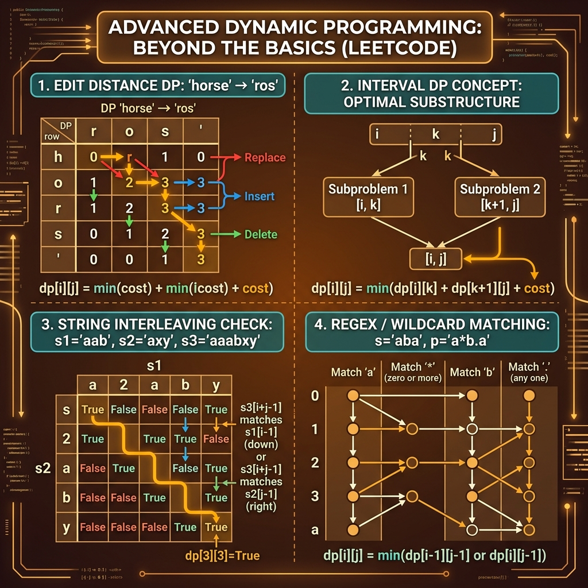

<!-- tags: leetcode, algorithms, coding-interview, dynamic-programming -->
# 🧠 Advanced Dynamic Programming

> Edit distance, regex matching, burst balloons, interleaving string — advanced DP for HARD problems.

📅 Created: 2026-03-20 · 🔄 Updated: 2026-04-10 · ⏱️ 11 min read

| Aspect         | Detail                                                         |
| -------------- | -------------------------------------------------------------- |
| **Complexity** | O(n²), O(n³), O(n×m)                                           |
| **Use case**   | String transformation, interval optimization, pattern matching |
| **Go stdlib**  | `math.MaxInt32`                                                |
| **LeetCode**   | #10, #44, #72, #97, #115, #312, #329, #518                     |

---

### Interview template

> Copy-paste this template when encountering this problem type in interviews.

```go
// ── Interval DP (e.g. Burst Balloons) ──────────────────────────
dp := make([][]int, n+2)
for i := range dp { dp[i] = make([]int, n+2) }
for length := 1; length <= n; length++ {
    for left := 1; left <= n-length+1; left++ {
        right := left + length - 1
        for k := left; k <= right; k++ {
            dp[left][right] = max(dp[left][right],
                nums[left-1]*nums[k]*nums[right+1]+dp[left][k-1]+dp[k+1][right])
        }
    }
}

// ── Edit Distance (string DP) ───────────────────────────────────
dp[i][j] = dp[i-1][j-1]                           // if s1[i-1]==s2[j-1]
dp[i][j] = 1 + min(dp[i-1][j], dp[i][j-1], dp[i-1][j-1])  // insert/delete/replace
```
```typescript
// ── Interval DP (e.g. Burst Balloons) ──────────────────────────
const dp = Array.from({ length: n + 2 }, () => Array.from({ length: n + 2 }, () => 0));
for (let length = 1; length <= n; length++) {
    for (let left = 1; left <= n - length + 1; left++) {
        const right = left + length - 1;
        for (let k = left; k <= right; k++) {
            dp[left][right] = Math.max(
                dp[left][right],
                nums[left - 1] * nums[k] * nums[right + 1] + dp[left][k - 1] + dp[k + 1][right],
            );
        }
    }
}

// ── Edit Distance (string DP) ───────────────────────────────────
dp[i][j] = dp[i - 1][j - 1];
dp[i][j] = 1 + Math.min(dp[i - 1][j], dp[i][j - 1], dp[i - 1][j - 1]);
```
```rust
// ── Interval DP (e.g. Burst Balloons) ──────────────────────────
let mut dp = vec![vec![0; n + 2]; n + 2];
for length in 1..=n {
    for left in 1..=n - length + 1 {
        let right = left + length - 1;
        for k in left..=right {
            dp[left][right] = dp[left][right].max(
                nums[left - 1] * nums[k] * nums[right + 1] + dp[left][k - 1] + dp[k + 1][right],
            );
        }
    }
}

// ── Edit Distance (string DP) ───────────────────────────────────
dp[i][j] = dp[i - 1][j - 1];
dp[i][j] = 1 + dp[i - 1][j].min(dp[i][j - 1]).min(dp[i - 1][j - 1]);
```
```cpp
// ── Interval DP (e.g. Burst Balloons) ──────────────────────────
std::vector<std::vector<int>> dp(n + 2, std::vector<int>(n + 2, 0));
for (int length = 1; length <= n; ++length) {
    for (int left = 1; left <= n - length + 1; ++left) {
        int right = left + length - 1;
        for (int k = left; k <= right; ++k) {
            dp[left][right] = std::max(
                dp[left][right],
                nums[left - 1] * nums[k] * nums[right + 1] + dp[left][k - 1] + dp[k + 1][right]
            );
        }
    }
}

// ── Edit Distance (string DP) ───────────────────────────────────
dp[i][j] = dp[i - 1][j - 1];
dp[i][j] = 1 + std::min({dp[i - 1][j], dp[i][j - 1], dp[i - 1][j - 1]});
```
```python
# ── Interval DP (e.g. Burst Balloons) ──────────────────────────
dp = [[0] * (n + 2) for _ in range(n + 2)]
for length in range(1, n + 1):
    for left in range(1, n - length + 2):
        right = left + length - 1
        for k in range(left, right + 1):
            dp[left][right] = max(
                dp[left][right],
                nums[left - 1] * nums[k] * nums[right + 1] + dp[left][k - 1] + dp[k + 1][right],
            )

# ── Edit Distance (string DP) ───────────────────────────────────
dp[i][j] = dp[i - 1][j - 1]
dp[i][j] = 1 + min(dp[i - 1][j], dp[i][j - 1], dp[i - 1][j - 1])
```

---

## 1. DEFINE

Imagine you are practicing LeetCode and a problem looks deceptively familiar. Advanced Dynamic Programming becomes useful when it breaks your solve-by-memory habit. It helps you recognize the correct family signal immediately.

Basic DP fails when states lose their simple linear progression. Interviews introduce complex state problems like edit distance, regex matching, burst balloons, and interleaving strings. Simply knowing a problem requires DP is insufficient. You must select the correct state shape and dependency graph.

The true challenge lies in representation. Some problems require 2D edit alignment or interval DP. Others need automaton-like matching logic. Forcing everything into a rigid 1D mindset turns the DP table into a confusing maze.

Core insight: **Advanced DP becomes manageable when you categorize the problem correctly. Identify alignment, interval, graph-on-grid-state, or automaton styles before defining the state.**

| Variant | Signal | Core Idea |
| ------- | ------ | --------- |
| String DP | Edit distance, regex, interleaving | States map to prefixes of one or two strings. |
| Interval DP | Burst Balloons, matrix chain | Choose a split point or the last processed element in an interval. |
| Counting DP | Decode ways, distinct subsequences | States count valid combinations rather than tracking maximums. |
| DFS + memo / DAG DP | Longest path in matrix | Convert recursion into DP on an implicit acyclic graph. |

| Approach | Time | Space | When to use |
| --- | --- | --- | --- |
| 2D tabulation | O(nm) | O(nm) or O(m) | Use for string DP when transitions rely clearly on prefixes. |
| Interval DP | Typically O(n³) | O(n²) | Use when an interval's answer depends on its split point. |
| Memoized DFS | By reachable states | By states + recursion stack | Use when the state graph is sparse or recursive logic feels natural. |
| Counting recurrence | By number of states | By table size | Use when asking for counts of ways, strings, or combinations. |

### 1.1 Quick Identification

- The problem involves string transformations, regex, burst intervals, interleaving, or complex decode ways.
- The state requires more than a single index. It usually spans two dimensions, an interval, or an automaton state.
- If your recursion works but the dependency graph looks chaotic, you face an advanced DP problem.

### 1.2 Invariants & Failure Modes

- The state must precisely match the reusable substructure of the problem.
- The fill order acts as the most common trap in advanced DP. Incorrect ordering forces you to evaluate incomplete dependencies.
- Common failure: memorizing the core transition without recognizing the problem family. This obscures why the table fills in a specific direction.

## 2. VISUAL

Advanced DP demands complex state definitions. The image below categorizes four major sub-families.

### Overview — Advanced DP



*Image: Advanced DP equals complex state definitions. It often requires 2D or 3D reasoning.*


### Level 1 — Core intuition

```text
Edit Distance
dp[i][j] = min cost to convert word1[0..i) -> word2[0..j)

Burst Balloons
dp[l][r] = best answer for interval (l..r)
choose k as last balloon popped inside interval
```

*Caption*: Level 1 demonstrates prefix-product states and interval states. These represent two classic advanced DP patterns.

### Level 2 — Detailed decision trace

- String DP fills from smaller prefixes to larger ones because each state reads from previous rows.
- Interval DP isolates subproblems cleanly by selecting the last processed element in the interval.
- Memoized DFS works best for sparse graph states or natural recursive transitions.
- Counting DP requires strict attention to modulos, base cases, and valid branch accumulation.

The DP table reveals state transitions. The code handles the fill order. Do not forget base case initialization in 2D grids.

## 3. CODE

Once the dependency graph locks, complex DP code gains order. We progress from alignments to heavy interval and string matching.

### Problem 1: Basic — Edit Distance & Decode Ways [LC #72, #91]
> **Objective**: Build intuition for string transformations and counting sequences.
> **Approach**: Use 2D DP for edit distance. Use 1D counting DP for decode ways.
> **Example**: word1 = horse, word2 = ros. s = 226 for decode ways.
> **Complexity**: O(nm) or O(n) time depending on the problem.

```go
// leetcode/advanced_dp_basic.go
package leetcode

// ✅ LC #72: Edit Distance (HARD but essential)
// dp[i][j] = min operations to convert word1[0:i] to word2[0:j]
// Operations: insert, delete, replace
// Time: O(m×n), Space: O(m×n) — can optimize to O(n)
func minDistance(word1, word2 string) int {
    m, n := len(word1), len(word2)
    dp := make([][]int, m+1)
    for i := range dp {
        dp[i] = make([]int, n+1)
        dp[i][0] = i // ✅ Delete all from word1
    }
    for j := 0; j <= n; j++ {
        dp[0][j] = j // ✅ Insert all from word2
    }

    for i := 1; i <= m; i++ {
        for j := 1; j <= n; j++ {
            if word1[i-1] == word2[j-1] {
                dp[i][j] = dp[i-1][j-1] // ✅ Match: no operation
            } else {
                // ✅ min(replace, delete from word1, insert into word1)
                dp[i][j] = 1 + min3(
                    dp[i-1][j-1], // Replace
                    dp[i-1][j],   // Delete
                    dp[i][j-1],   // Insert
                )
            }
        }
    }

    return dp[m][n]
}

func min3(a, b, c int) int {
    if a <= b && a <= c {
        return a
    }
    if b <= c {
        return b
    }
    return c
}

// ✅ LC #91: Decode Ways
// "226" → [2,2,6], [22,6], [2,26] → 3 ways
// dp[i] = number of ways to decode s[0:i]
// Time: O(n), Space: O(1)
func numDecodings(s string) int {
    if s[0] == '0' {
        return 0
    }

    prev2, prev1 := 1, 1 // dp[0]=1, dp[1]=1

    for i := 2; i <= len(s); i++ {
        curr := 0

        // ✅ Single digit decode (1-9)
        if s[i-1] != '0' {
            curr += prev1
        }

        // ✅ Two digit decode (10-26)
        twoDigit := (s[i-2]-'0')*10 + (s[i-1] - '0')
        if twoDigit >= 10 && twoDigit <= 26 {
            curr += prev2
        }

        prev2 = prev1
        prev1 = curr
    }

    return prev1
}

// ✅ LC #518: Coin Change II (Count combinations)
// Unbounded knapsack — count number of combinations
// FORWARDS iteration = unbounded
// Time: O(n × amount), Space: O(amount)
func change(amount int, coins []int) int {
    dp := make([]int, amount+1)
    dp[0] = 1 // ✅ 1 way to make 0

    for _, coin := range coins { // ⚠️ Outer: coins (combinations, not permutations)
        for j := coin; j <= amount; j++ { // ⚠️ FORWARDS = unbounded
            dp[j] += dp[j-coin]
        }
    }

    return dp[amount]
}
```
```typescript
// leetcode/advanced_dp_basic.ts
const min3 = (a: number, b: number, c: number): number => Math.min(a, b, c);

export function minDistance(word1: string, word2: string): number {
    const m = word1.length;
    const n = word2.length;
    const dp = Array.from({ length: m + 1 }, (_, i) =>
        Array.from({ length: n + 1 }, (_, j) => (j === 0 ? i : i === 0 ? j : 0)),
    );
    for (let i = 1; i <= m; i++) {
        for (let j = 1; j <= n; j++) {
            if (word1[i - 1] === word2[j - 1]) dp[i][j] = dp[i - 1][j - 1];
            else dp[i][j] = 1 + min3(dp[i - 1][j - 1], dp[i - 1][j], dp[i][j - 1]);
        }
    }
    return dp[m][n];
}

export function numDecodings(s: string): number {
    if (s[0] === "0") return 0;
    let prev2 = 1;
    let prev1 = 1;
    for (let i = 2; i <= s.length; i++) {
        let curr = 0;
        if (s[i - 1] !== "0") curr += prev1;
        const twoDigit = Number(s.slice(i - 2, i));
        if (10 <= twoDigit && twoDigit <= 26) curr += prev2;
        prev2 = prev1;
        prev1 = curr;
    }
    return prev1;
}

export function change(amount: number, coins: number[]): number {
    const dp = Array.from({ length: amount + 1 }, () => 0);
    dp[0] = 1;
    for (const coin of coins) {
        for (let value = coin; value <= amount; value++) {
            dp[value] += dp[value - coin];
        }
    }
    return dp[amount];
}
```
```rust
// leetcode/advanced_dp_basic.rs
fn min3(a: i32, b: i32, c: i32) -> i32 {
    a.min(b).min(c)
}

pub fn min_distance(word1: String, word2: String) -> i32 {
    let a = word1.as_bytes();
    let b = word2.as_bytes();
    let mut dp = vec![vec![0; b.len() + 1]; a.len() + 1];
    for i in 0..=a.len() {
        dp[i][0] = i as i32;
    }
    for j in 0..=b.len() {
        dp[0][j] = j as i32;
    }
    for i in 1..=a.len() {
        for j in 1..=b.len() {
            if a[i - 1] == b[j - 1] {
                dp[i][j] = dp[i - 1][j - 1];
            } else {
                dp[i][j] = 1 + min3(dp[i - 1][j - 1], dp[i - 1][j], dp[i][j - 1]);
            }
        }
    }
    dp[a.len()][b.len()]
}

pub fn num_decodings(s: String) -> i32 {
    let bytes = s.as_bytes();
    if bytes[0] == b'0' {
        return 0;
    }
    let (mut prev2, mut prev1) = (1, 1);
    for i in 2..=bytes.len() {
        let mut curr = 0;
        if bytes[i - 1] != b'0' {
            curr += prev1;
        }
        let two_digit = ((bytes[i - 2] - b'0') as i32) * 10 + (bytes[i - 1] - b'0') as i32;
        if (10..=26).contains(&two_digit) {
            curr += prev2;
        }
        prev2 = prev1;
        prev1 = curr;
    }
    prev1
}

pub fn change(amount: i32, coins: Vec<i32>) -> i32 {
    let mut dp = vec![0; amount as usize + 1];
    dp[0] = 1;
    for coin in coins {
        for value in coin as usize..=amount as usize {
            dp[value] += dp[value - coin as usize];
        }
    }
    dp[amount as usize]
}
```
```cpp
// leetcode/advanced_dp_basic.cpp
int min3(int a, int b, int c) {
    return std::min(a, std::min(b, c));
}

int minDistance(std::string word1, std::string word2) {
    std::vector<std::vector<int>> dp(word1.size() + 1, std::vector<int>(word2.size() + 1, 0));
    for (int i = 0; i <= static_cast<int>(word1.size()); ++i) dp[i][0] = i;
    for (int j = 0; j <= static_cast<int>(word2.size()); ++j) dp[0][j] = j;
    for (int i = 1; i <= static_cast<int>(word1.size()); ++i) {
        for (int j = 1; j <= static_cast<int>(word2.size()); ++j) {
            if (word1[i - 1] == word2[j - 1]) dp[i][j] = dp[i - 1][j - 1];
            else dp[i][j] = 1 + min3(dp[i - 1][j - 1], dp[i - 1][j], dp[i][j - 1]);
        }
    }
    return dp[word1.size()][word2.size()];
}

int numDecodings(std::string s) {
    if (s[0] == '0') return 0;
    int prev2 = 1;
    int prev1 = 1;
    for (int i = 2; i <= static_cast<int>(s.size()); ++i) {
        int curr = 0;
        if (s[i - 1] != '0') curr += prev1;
        int twoDigit = (s[i - 2] - '0') * 10 + (s[i - 1] - '0');
        if (10 <= twoDigit && twoDigit <= 26) curr += prev2;
        prev2 = prev1;
        prev1 = curr;
    }
    return prev1;
}

int change(int amount, std::vector<int>& coins) {
    std::vector<int> dp(amount + 1, 0);
    dp[0] = 1;
    for (int coin : coins) {
        for (int value = coin; value <= amount; ++value) {
            dp[value] += dp[value - coin];
        }
    }
    return dp[amount];
}
```
```python
# leetcode/advanced_dp_basic.py
def min_distance(word1: str, word2: str) -> int:
    m, n = len(word1), len(word2)
    dp = [[0] * (n + 1) for _ in range(m + 1)]
    for i in range(m + 1):
        dp[i][0] = i
    for j in range(n + 1):
        dp[0][j] = j
    for i in range(1, m + 1):
        for j in range(1, n + 1):
            if word1[i - 1] == word2[j - 1]:
                dp[i][j] = dp[i - 1][j - 1]
            else:
                dp[i][j] = 1 + min(dp[i - 1][j - 1], dp[i - 1][j], dp[i][j - 1])
    return dp[m][n]

def num_decodings(s: str) -> int:
    if s[0] == "0":
        return 0
    prev2 = prev1 = 1
    for i in range(2, len(s) + 1):
        curr = 0
        if s[i - 1] != "0":
            curr += prev1
        two_digit = int(s[i - 2:i])
        if 10 <= two_digit <= 26:
            curr += prev2
        prev2, prev1 = prev1, curr
    return prev1

def change(amount: int, coins: list[int]) -> int:
    dp = [0] * (amount + 1)
    dp[0] = 1
    for coin in coins:
        for value in range(coin, amount + 1):
            dp[value] += dp[value - coin]
    return dp[amount]
```

> **Why?** These basic examples show that advanced DP starts with fundamental questions. What prefix does the state represent? How many ways or costs lead to the current state? Defining this prevents blindly memorizing formulas.

> **Conclusion**: This **Basic** example covers `Edit Distance & Decode Ways [LC #72, #91]` thoroughly. Move to intermediate problems when complexity increases.

> **✅ Achieved**: Edit distance O(n×m), decode ways O(n), coin change II combinations.
> **⚠️ Note**: For Coin Change II, placing coins in the outer loop calculates combinations. Placing amounts outer calculates permutations.

---
### Problem 2: Intermediate — Regex & Interleaving [LC #10, #97, #115]
> **Objective**: Solve problems where transitions rely on complex logic branches across multiple strings.
> **Approach**: Employ 2D DP with careful match and skip branching. Strictly control base cases.
> **Example**: Compare string to pattern for regex. Interleave s1 and s2 to form s3.
> **Complexity**: Typically O(nm) time and O(nm) space.

```go
// leetcode/advanced_dp_intermediate.go
package leetcode

// ✅ LC #10: Regular Expression Matching (HARD)
// '.' matches any single char, '*' matches zero or more of preceding
// dp[i][j] = s[0:i] matches p[0:j]
// Time: O(m×n), Space: O(m×n)
func isMatch(s, p string) bool {
    m, n := len(s), len(p)
    dp := make([][]bool, m+1)
    for i := range dp {
        dp[i] = make([]bool, n+1)
    }
    dp[0][0] = true

    // ✅ Base: empty string vs pattern (a*, a*b*, etc.)
    for j := 2; j <= n; j++ {
        if p[j-1] == '*' {
            dp[0][j] = dp[0][j-2] // ✅ x* matches empty
        }
    }

    for i := 1; i <= m; i++ {
        for j := 1; j <= n; j++ {
            if p[j-1] == '*' {
                // ✅ Option 1: x* matches ZERO of x
                dp[i][j] = dp[i][j-2]

                // ✅ Option 2: x* matches ONE MORE of x
                if p[j-2] == s[i-1] || p[j-2] == '.' {
                    dp[i][j] = dp[i][j] || dp[i-1][j]
                }
            } else if p[j-1] == '.' || p[j-1] == s[i-1] {
                // ✅ Direct match
                dp[i][j] = dp[i-1][j-1]
            }
        }
    }

    return dp[m][n]
}

// ✅ LC #97: Interleaving String
// Is s3 an interleaving of s1 and s2?
// dp[i][j] = s1[0:i] + s2[0:j] can form s3[0:i+j]
// Time: O(m×n), Space: O(n)
func isInterleave(s1, s2, s3 string) bool {
    m, n := len(s1), len(s2)
    if m+n != len(s3) {
        return false
    }

    dp := make([]bool, n+1)
    dp[0] = true

    // ✅ Base: only s2
    for j := 1; j <= n; j++ {
        dp[j] = dp[j-1] && s2[j-1] == s3[j-1]
    }

    for i := 1; i <= m; i++ {
        dp[0] = dp[0] && s1[i-1] == s3[i-1] // ✅ Only s1

        for j := 1; j <= n; j++ {
            dp[j] = (dp[j] && s1[i-1] == s3[i+j-1]) || // ✅ Take from s1
                    (dp[j-1] && s2[j-1] == s3[i+j-1])   // ✅ Take from s2
        }
    }

    return dp[n]
}

// ✅ LC #115: Distinct Subsequences
// How many subsequences of s equal t?
// dp[i][j] = number of subsequences of s[0:i] that equal t[0:j]
// Time: O(m×n), Space: O(n)
func numDistinct(s, t string) int {
    m, n := len(s), len(t)
    dp := make([]int, n+1)
    dp[0] = 1 // ✅ Empty t is subsequence of any s

    for i := 1; i <= m; i++ {
        // ⚠️ Iterate BACKWARDS to avoid using same element twice
        for j := n; j >= 1; j-- {
            if s[i-1] == t[j-1] {
                dp[j] += dp[j-1] // ✅ Use s[i-1] or skip it
            }
            // If not equal, dp[j] stays (skip s[i-1])
        }
    }

    return dp[n]
}
```
```typescript
// leetcode/advanced_dp_intermediate.ts
export function isMatch(s: string, p: string): boolean {
    const m = s.length;
    const n = p.length;
    const dp = Array.from({ length: m + 1 }, () => Array.from({ length: n + 1 }, () => false));
    dp[0][0] = true;
    for (let j = 2; j <= n; j++) {
        if (p[j - 1] === "*") dp[0][j] = dp[0][j - 2];
    }
    for (let i = 1; i <= m; i++) {
        for (let j = 1; j <= n; j++) {
            if (p[j - 1] === "*") {
                dp[i][j] = dp[i][j - 2];
                if (p[j - 2] === "." || p[j - 2] === s[i - 1]) dp[i][j] ||= dp[i - 1][j];
            } else if (p[j - 1] === "." || p[j - 1] === s[i - 1]) {
                dp[i][j] = dp[i - 1][j - 1];
            }
        }
    }
    return dp[m][n];
}

export function isInterleave(s1: string, s2: string, s3: string): boolean {
    if (s1.length + s2.length !== s3.length) return false;
    const dp = Array.from({ length: s2.length + 1 }, () => false);
    dp[0] = true;
    for (let j = 1; j <= s2.length; j++) dp[j] = dp[j - 1] && s2[j - 1] === s3[j - 1];
    for (let i = 1; i <= s1.length; i++) {
        dp[0] = dp[0] && s1[i - 1] === s3[i - 1];
        for (let j = 1; j <= s2.length; j++) {
            dp[j] =
                (dp[j] && s1[i - 1] === s3[i + j - 1]) ||
                (dp[j - 1] && s2[j - 1] === s3[i + j - 1]);
        }
    }
    return dp[s2.length];
}

export function numDistinct(s: string, t: string): number {
    const dp = Array.from({ length: t.length + 1 }, () => 0);
    dp[0] = 1;
    for (let i = 1; i <= s.length; i++) {
        for (let j = t.length; j >= 1; j--) {
            if (s[i - 1] === t[j - 1]) dp[j] += dp[j - 1];
        }
    }
    return dp[t.length];
}
```
```rust
// leetcode/advanced_dp_intermediate.rs
pub fn is_match(s: String, p: String) -> bool {
    let a = s.as_bytes();
    let b = p.as_bytes();
    let mut dp = vec![vec![false; b.len() + 1]; a.len() + 1];
    dp[0][0] = true;
    for j in 2..=b.len() {
        if b[j - 1] == b'*' {
            dp[0][j] = dp[0][j - 2];
        }
    }
    for i in 1..=a.len() {
        for j in 1..=b.len() {
            if b[j - 1] == b'*' {
                dp[i][j] = dp[i][j - 2];
                if b[j - 2] == b'.' || b[j - 2] == a[i - 1] {
                    dp[i][j] |= dp[i - 1][j];
                }
            } else if b[j - 1] == b'.' || b[j - 1] == a[i - 1] {
                dp[i][j] = dp[i - 1][j - 1];
            }
        }
    }
    dp[a.len()][b.len()]
}

pub fn is_interleave(s1: String, s2: String, s3: String) -> bool {
    if s1.len() + s2.len() != s3.len() {
        return false;
    }
    let a = s1.as_bytes();
    let b = s2.as_bytes();
    let c = s3.as_bytes();
    let mut dp = vec![false; b.len() + 1];
    dp[0] = true;
    for j in 1..=b.len() {
        dp[j] = dp[j - 1] && b[j - 1] == c[j - 1];
    }
    for i in 1..=a.len() {
        dp[0] = dp[0] && a[i - 1] == c[i - 1];
        for j in 1..=b.len() {
            dp[j] = (dp[j] && a[i - 1] == c[i + j - 1]) || (dp[j - 1] && b[j - 1] == c[i + j - 1]);
        }
    }
    dp[b.len()]
}

pub fn num_distinct(s: String, t: String) -> i64 {
    let a = s.as_bytes();
    let b = t.as_bytes();
    let mut dp = vec![0i64; b.len() + 1];
    dp[0] = 1;
    for i in 1..=a.len() {
        for j in (1..=b.len()).rev() {
            if a[i - 1] == b[j - 1] {
                dp[j] += dp[j - 1];
            }
        }
    }
    dp[b.len()]
}
```
```cpp
// leetcode/advanced_dp_intermediate.cpp
bool isMatch(std::string s, std::string p) {
    std::vector<std::vector<bool>> dp(s.size() + 1, std::vector<bool>(p.size() + 1, false));
    dp[0][0] = true;
    for (int j = 2; j <= static_cast<int>(p.size()); ++j) {
        if (p[j - 1] == '*') dp[0][j] = dp[0][j - 2];
    }
    for (int i = 1; i <= static_cast<int>(s.size()); ++i) {
        for (int j = 1; j <= static_cast<int>(p.size()); ++j) {
            if (p[j - 1] == '*') {
                dp[i][j] = dp[i][j - 2];
                if (p[j - 2] == '.' || p[j - 2] == s[i - 1]) dp[i][j] = dp[i][j] || dp[i - 1][j];
            } else if (p[j - 1] == '.' || p[j - 1] == s[i - 1]) {
                dp[i][j] = dp[i - 1][j - 1];
            }
        }
    }
    return dp[s.size()][p.size()];
}

bool isInterleave(std::string s1, std::string s2, std::string s3) {
    if (s1.size() + s2.size() != s3.size()) return false;
    std::vector<bool> dp(s2.size() + 1, false);
    dp[0] = true;
    for (int j = 1; j <= static_cast<int>(s2.size()); ++j) dp[j] = dp[j - 1] && s2[j - 1] == s3[j - 1];
    for (int i = 1; i <= static_cast<int>(s1.size()); ++i) {
        dp[0] = dp[0] && s1[i - 1] == s3[i - 1];
        for (int j = 1; j <= static_cast<int>(s2.size()); ++j) {
            dp[j] = (dp[j] && s1[i - 1] == s3[i + j - 1]) || (dp[j - 1] && s2[j - 1] == s3[i + j - 1]);
        }
    }
    return dp[s2.size()];
}

long long numDistinct(std::string s, std::string t) {
    std::vector<long long> dp(t.size() + 1, 0);
    dp[0] = 1;
    for (int i = 1; i <= static_cast<int>(s.size()); ++i) {
        for (int j = static_cast<int>(t.size()); j >= 1; --j) {
            if (s[i - 1] == t[j - 1]) dp[j] += dp[j - 1];
        }
    }
    return dp[t.size()];
}
```
```python
# leetcode/advanced_dp_intermediate.py
def is_match(s: str, p: str) -> bool:
    dp = [[False] * (len(p) + 1) for _ in range(len(s) + 1)]
    dp[0][0] = True
    for j in range(2, len(p) + 1):
        if p[j - 1] == "*":
            dp[0][j] = dp[0][j - 2]
    for i in range(1, len(s) + 1):
        for j in range(1, len(p) + 1):
            if p[j - 1] == "*":
                dp[i][j] = dp[i][j - 2]
                if p[j - 2] in {".", s[i - 1]}:
                    dp[i][j] = dp[i][j] or dp[i - 1][j]
            elif p[j - 1] in {".", s[i - 1]}:
                dp[i][j] = dp[i - 1][j - 1]
    return dp[-1][-1]

def is_interleave(s1: str, s2: str, s3: str) -> bool:
    if len(s1) + len(s2) != len(s3):
        return False
    dp = [False] * (len(s2) + 1)
    dp[0] = True
    for j in range(1, len(s2) + 1):
        dp[j] = dp[j - 1] and s2[j - 1] == s3[j - 1]
    for i in range(1, len(s1) + 1):
        dp[0] = dp[0] and s1[i - 1] == s3[i - 1]
        for j in range(1, len(s2) + 1):
            dp[j] = (dp[j] and s1[i - 1] == s3[i + j - 1]) or (dp[j - 1] and s2[j - 1] == s3[i + j - 1])
    return dp[-1]

def num_distinct(s: str, t: str) -> int:
    dp = [0] * (len(t) + 1)
    dp[0] = 1
    for i in range(1, len(s) + 1):
        for j in range(len(t), 0, -1):
            if s[i - 1] == t[j - 1]:
                dp[j] += dp[j - 1]
    return dp[-1]
```

> **Why?** Intermediate problems complicate state paths with asymmetric branches. Regex includes a skip branch for `*`. Interleaving must map every character in `s3` to its exact origin. Missing one base case derails the entire grid.

> **Conclusion**: This **Intermediate** example solves `Regex & Interleaving [LC #10, #97, #115]` without skipping logic. Explore the advanced section for harder constraints.

> **✅ Achieved**: Regex matching, interleaving checks, and distinct subsequence counting.
> **⚠️ Note**: Regex `*` — always handle zero matches first (`dp[i][j-2]`), then check for additional matches.

---
### Problem 3: Advanced — Burst Balloons & Longest Increasing Path [LC #312, #329]
> **Objective**: Master interval DP and DFS with memoization. These represent the hardest recurring patterns.
> **Approach**: Select k as the final interval action. Alternatively, convert a matrix path into an implicit DAG.
> **Example**: Use balloon padding in a nums array or find an increasing path in a grid.
> **Complexity**: O(n³) for interval DP. O(mn) states for DFS with memoization.

```go
// leetcode/advanced_dp_hard.go
package leetcode

// ✅ LC #312: Burst Balloons (HARD)
// Think REVERSE: which balloon is LAST to burst in interval [i..j]?
// dp[i][j] = max coins bursting balloons in interval (i, j) exclusive
// Time: O(n³), Space: O(n²)
func maxCoins(nums []int) int {
    // ✅ Pad with 1 at boundaries
    n := len(nums) + 2
    padded := make([]int, n)
    padded[0], padded[n-1] = 1, 1
    copy(padded[1:], nums)

    dp := make([][]int, n)
    for i := range dp {
        dp[i] = make([]int, n)
    }

    // ✅ Interval DP: iterate by length
    for length := 2; length < n; length++ {
        for left := 0; left < n-length; left++ {
            right := left + length

            // ✅ Try each balloon as LAST to burst in interval
            for k := left + 1; k < right; k++ {
                coins := padded[left] * padded[k] * padded[right]
                total := dp[left][k] + coins + dp[k][right]

                if total > dp[left][right] {
                    dp[left][right] = total
                }
            }
        }
    }

    return dp[0][n-1]
}

// ✅ LC #329: Longest Increasing Path in a Matrix (HARD)
// DFS + Memoization — DP on grid with 4-directional movement
// Time: O(m×n), Space: O(m×n)
func longestIncreasingPath(matrix [][]int) int {
    if len(matrix) == 0 {
        return 0
    }

    rows, cols := len(matrix), len(matrix[0])
    memo := make([][]int, rows)
    for i := range memo {
        memo[i] = make([]int, cols)
    }

    dirs := [4][2]int{{-1, 0}, {1, 0}, {0, -1}, {0, 1}}
    maxPath := 0

    var dfs func(r, c int) int
    dfs = func(r, c int) int {
        if memo[r][c] != 0 {
            return memo[r][c] // ✅ Already computed
        }

        memo[r][c] = 1 // ✅ At least the cell itself

        for _, d := range dirs {
            nr, nc := r+d[0], c+d[1]
            if nr >= 0 && nr < rows && nc >= 0 && nc < cols &&
                matrix[nr][nc] > matrix[r][c] { // ✅ Strictly increasing
                pathLen := 1 + dfs(nr, nc)
                if pathLen > memo[r][c] {
                    memo[r][c] = pathLen
                }
            }
        }

        return memo[r][c]
    }

    for r := 0; r < rows; r++ {
        for c := 0; c < cols; c++ {
            if pathLen := dfs(r, c); pathLen > maxPath {
                maxPath = pathLen
            }
        }
    }

    return maxPath
}
```
```typescript
// leetcode/advanced_dp_hard.ts
export function maxCoins(nums: number[]): number {
    const padded = [1, ...nums, 1];
    const n = padded.length;
    const dp = Array.from({ length: n }, () => Array.from({ length: n }, () => 0));
    for (let length = 2; length < n; length++) {
        for (let left = 0; left < n - length; left++) {
            const right = left + length;
            for (let k = left + 1; k < right; k++) {
                const total = dp[left][k] + padded[left] * padded[k] * padded[right] + dp[k][right];
                dp[left][right] = Math.max(dp[left][right], total);
            }
        }
    }
    return dp[0][n - 1];
}

export function longestIncreasingPath(matrix: number[][]): number {
    if (matrix.length === 0) return 0;
    const rows = matrix.length;
    const cols = matrix[0].length;
    const memo = Array.from({ length: rows }, () => Array.from({ length: cols }, () => 0));
    const dirs = [[-1, 0], [1, 0], [0, -1], [0, 1]];
    const dfs = (r: number, c: number): number => {
        if (memo[r][c] !== 0) return memo[r][c];
        memo[r][c] = 1;
        for (const [dr, dc] of dirs) {
            const nr = r + dr;
            const nc = c + dc;
            if (0 <= nr && nr < rows && 0 <= nc && nc < cols && matrix[nr][nc] > matrix[r][c]) {
                memo[r][c] = Math.max(memo[r][c], 1 + dfs(nr, nc));
            }
        }
        return memo[r][c];
    };
    let best = 0;
    for (let r = 0; r < rows; r++) {
        for (let c = 0; c < cols; c++) {
            best = Math.max(best, dfs(r, c));
        }
    }
    return best;
}
```
```rust
// leetcode/advanced_dp_hard.rs
pub fn max_coins(nums: Vec<i32>) -> i32 {
    let mut padded = vec![1];
    padded.extend(nums);
    padded.push(1);
    let n = padded.len();
    let mut dp = vec![vec![0; n]; n];
    for length in 2..n {
        for left in 0..n - length {
            let right = left + length;
            for k in left + 1..right {
                let total = dp[left][k] + padded[left] * padded[k] * padded[right] + dp[k][right];
                dp[left][right] = dp[left][right].max(total);
            }
        }
    }
    dp[0][n - 1]
}

pub fn longest_increasing_path(matrix: Vec<Vec<i32>>) -> i32 {
    if matrix.is_empty() {
        return 0;
    }
    fn dfs(r: usize, c: usize, matrix: &[Vec<i32>], memo: &mut [Vec<i32>]) -> i32 {
        if memo[r][c] != 0 {
            return memo[r][c];
        }
        memo[r][c] = 1;
        for (dr, dc) in [(-1, 0), (1, 0), (0, -1), (0, 1)] {
            let nr = r as i32 + dr;
            let nc = c as i32 + dc;
            if nr >= 0
                && nc >= 0
                && (nr as usize) < matrix.len()
                && (nc as usize) < matrix[0].len()
                && matrix[nr as usize][nc as usize] > matrix[r][c]
            {
                memo[r][c] = memo[r][c].max(1 + dfs(nr as usize, nc as usize, matrix, memo));
            }
        }
        memo[r][c]
    }

    let rows = matrix.len();
    let cols = matrix[0].len();
    let mut memo = vec![vec![0; cols]; rows];
    let mut best = 0;
    for r in 0..rows {
        for c in 0..cols {
            best = best.max(dfs(r, c, &matrix, &mut memo));
        }
    }
    best
}
```
```cpp
// leetcode/advanced_dp_hard.cpp
int maxCoins(std::vector<int>& nums) {
    std::vector<int> padded{1};
    padded.insert(padded.end(), nums.begin(), nums.end());
    padded.push_back(1);
    int n = static_cast<int>(padded.size());
    std::vector<std::vector<int>> dp(n, std::vector<int>(n, 0));
    for (int length = 2; length < n; ++length) {
        for (int left = 0; left < n - length; ++left) {
            int right = left + length;
            for (int k = left + 1; k < right; ++k) {
                dp[left][right] = std::max(
                    dp[left][right],
                    dp[left][k] + padded[left] * padded[k] * padded[right] + dp[k][right]
                );
            }
        }
    }
    return dp[0][n - 1];
}

int longestIncreasingPath(std::vector<std::vector<int>>& matrix) {
    if (matrix.empty()) return 0;
    int rows = static_cast<int>(matrix.size());
    int cols = static_cast<int>(matrix[0].size());
    std::vector<std::vector<int>> memo(rows, std::vector<int>(cols, 0));
    std::function<int(int, int)> dfs = [&](int r, int c) {
        if (memo[r][c] != 0) return memo[r][c];
        memo[r][c] = 1;
        for (auto [dr, dc] : std::vector<std::pair<int, int>>{{-1, 0}, {1, 0}, {0, -1}, {0, 1}}) {
            int nr = r + dr;
            int nc = c + dc;
            if (0 <= nr && nr < rows && 0 <= nc && nc < cols && matrix[nr][nc] > matrix[r][c]) {
                memo[r][c] = std::max(memo[r][c], 1 + dfs(nr, nc));
            }
        }
        return memo[r][c];
    };
    int best = 0;
    for (int r = 0; r < rows; ++r) {
        for (int c = 0; c < cols; ++c) {
            best = std::max(best, dfs(r, c));
        }
    }
    return best;
}
```
```python
# leetcode/advanced_dp_hard.py
def max_coins(nums: list[int]) -> int:
    padded = [1] + nums + [1]
    n = len(padded)
    dp = [[0] * n for _ in range(n)]
    for length in range(2, n):
        for left in range(0, n - length):
            right = left + length
            for k in range(left + 1, right):
                dp[left][right] = max(
                    dp[left][right],
                    dp[left][k] + padded[left] * padded[k] * padded[right] + dp[k][right],
                )
    return dp[0][n - 1]

def longest_increasing_path(matrix: list[list[int]]) -> int:
    if not matrix:
        return 0
    rows, cols = len(matrix), len(matrix[0])
    memo = [[0] * cols for _ in range(rows)]
    dirs = [(-1, 0), (1, 0), (0, -1), (0, 1)]

    def dfs(r: int, c: int) -> int:
        if memo[r][c]:
            return memo[r][c]
        memo[r][c] = 1
        for dr, dc in dirs:
            nr, nc = r + dr, c + dc
            if 0 <= nr < rows and 0 <= nc < cols and matrix[nr][nc] > matrix[r][c]:
                memo[r][c] = max(memo[r][c], 1 + dfs(nr, nc))
        return memo[r][c]

    return max(dfs(r, c) for r in range(rows) for c in range(cols))
```

> **Why?** Burst Balloons requires reverse thinking. Choosing the first balloon tangles subproblems. Choosing the last balloon separates them cleanly. The Longest Increasing Path simply requires spotting the acyclic nature of strictly increasing numbers.

> **Conclusion**: This **Advanced** section explains `Burst Balloons & Longest Increasing Path [LC #312, #329]` clearly.

> **✅ Achieved**: Burst Balloons O(n³) interval DP. Longest increasing path O(m×n) DFS with memoization.
> **⚠️ Note**: Burst Balloons — think of the LAST to burst. Grid path — no visited set needed because increasing values prevent cycles.

---
Advanced DP rarely fails due to syntax. It fails on incorrect dimensions, missing base cases, or wrong fill directions.

## 4. PITFALLS

Advanced DP rarely fails due to syntax. Problems stem from incorrect state shapes and grid filling sequences.

| # | Severity | Defect | Consequence | Fix |
|---|----------|--------|-------------|-----|
| 1   | Edit distance: missing base cases | —       | `dp[i][0] = i`, `dp[0][j] = j` |
| 2   | Regex: `*` matches zero → `dp[i][j-2]` | —       | Must check j ≥ 2 for `*` access. |
| 3   | Burst Balloons: burst from left to right | —       | Think REVERSE: which balloon pops LAST. |
| 4   | Distinct subsequences: forwards iteration | —       | Iterate BACKWARDS to prevent double-counting. |
| 5   | Grid DP: using a visited set | —       | Strictly increasing means no cycles exist. Drop the visited set. |
| 6   | Coin Change II: confusing permutations and combinations | —       | Outer loop coins creates combinations. Outer loop amounts creates permutations. |

### 🔴 Pitfall #1 — Edit distance: missing base cases

DP code for edit distance often starts at `dp[1][1]`:

```go
for i := 1; i <= m; i++ {
    for j := 1; j <= n; j++ {
        if word1[i-1] == word2[j-1] { dp[i][j] = dp[i-1][j-1] }
        // ...
    }
}
// dp[m][n] holds the result... but dp[0][j] and dp[i][0] are both 0!
```

Transforming an empty `word1` requires exactly `j` insertions. Deleting `word2` requires `i` deletions. Missing base cases forces the DP to start from zero. This produces artificially low results.

**Fix**: `for i := 0; i <= m; i++ { dp[i][0] = i }` and `for j := 0; j <= n; j++ { dp[0][j] = j }`.

---

## 5. REF

| Resource                        | Link                                                                                                                            |
| ------------------------------- | ------------------------------------------------------------------------------------------------------------------------------- |
| LC #72 Edit Distance            | [leetcode.com/problems/edit-distance](https://leetcode.com/problems/edit-distance/)                                             |
| LC #10 Regex Matching           | [leetcode.com/problems/regular-expression-matching](https://leetcode.com/problems/regular-expression-matching/)                 |
| LC #312 Burst Balloons          | [leetcode.com/problems/burst-balloons](https://leetcode.com/problems/burst-balloons/)                                           |
| LC #329 Longest Increasing Path | [leetcode.com/problems/longest-increasing-path-in-a-matrix](https://leetcode.com/problems/longest-increasing-path-in-a-matrix/) |
| Advanced DP Patterns            | [leetcode.com/discuss/general-discussion/662866](https://leetcode.com/discuss/general-discussion/662866/)                       |

---

## 6. RECOMMEND

Once comfortable with reshaping states, return to narrower families. You will recognize when advanced DP is truly necessary and when simpler state models suffice.

| Extension | When to use | Rationale | File/Link |
| --------- | ----------- | --------- | --------- |
| Dynamic Programming | Basic DP foundation | Master basics before tackling advanced problems. | [07-dynamic-programming](./07-dynamic-programming.md) |
| Buy & Sell Stock | State machine DP | Apply specific state models effectively. | [17-buy-sell-stock](./17-buy-sell-stock.md) |
| DP Sequences | Palindromes and Kadane | Explore sequence-specific DP logic. | [23-dp-sequences](./23-dp-sequences.md) |
| Bit Manipulation | Bitmask DP | Manage states using bitwise integers. | [10-bit-manipulation-math](./10-bit-manipulation-math.md) |

---

## 7. QUICK REF

| Situation / Signal | Pattern / Approach | Complexity | When to use | Warning |
|--------------------|--------------------|------------|-------------|---------|
| transform string A to B | Edit distance DP | O(n×m) · O(n×m) | LC #72: min insert/delete/replace | dp[i][j] tracks min ops for prefix. |
| pattern with * and ? | Regex/wildcard matching DP | O(n×m) · O(n×m) | LC #10, #44: pattern matching | `*` matches 0+ characters. Check base cases. |
| range-based optimization | Interval DP | O(n³) · O(n²) | Burst balloons, matrix chain | dp[i][j] stores the best outcome for range [i..j]. |
| merge two strings keeping order | Interleaving DP | O(n×m) · O(n×m) | LC #97: interleaving string | dp[i][j] checks if s1[:i]+s2[:j] forms the target. |
| distinct subsequences | Counting DP | O(n×m) · O(m) | LC #115: num distinct | Accumulate dp[j] += dp[j-1] upon a match. |

---

Return to the edit distance and regex matching challenges. You now realize advanced DP requires the correct state representation. Each variant drastically alters the table fill approach.

---

**Links**: [← Buy Sell Stock](./17-buy-sell-stock.md) · [→ Advanced Graph](./19-advanced-graph.md)
