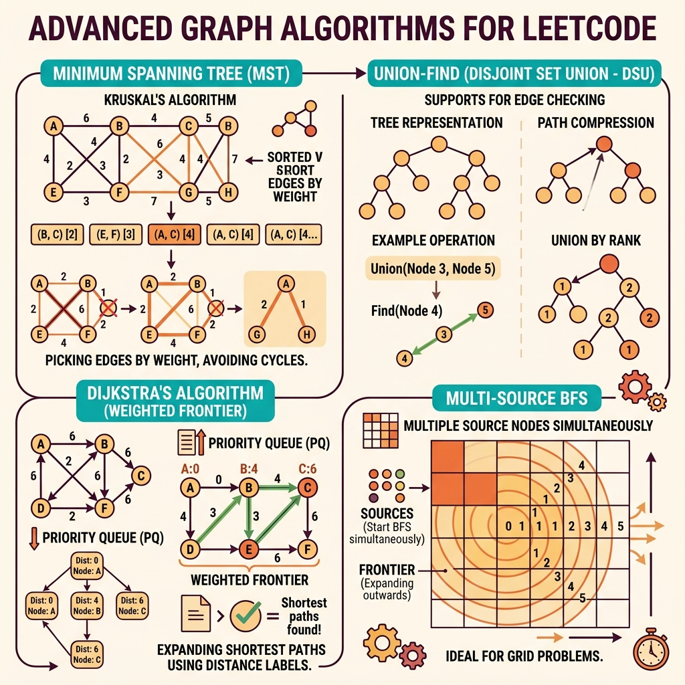

<!-- tags: leetcode, algorithms, coding-interview, graph -->
# 🌐 Advanced Graph

> Bipartite check, MST (Kruskal/Prim), multi-source BFS, shortest path variants, Euler path

📅 Date created: 2026-03-20 · 🔄 Last updated: 2026-04-10 · ⏱️ 11 minutes read

| Aspect         | Detail                                                    |
| -------------- | --------------------------------------------------------- |
| **Complexity** | O(V+E) BFS/DFS, O(E log E) MST, O(VE) Bellman-Ford        |
| **Use case**   | 2-coloring, minimum spanning tree, multi-source expansion |
| **Go stdlib**  | `container/heap`, `sort`                                  |
| **LeetCode**   | #127, #269, #399, #684, #785, #787, #934, #994, #1584     |

---

### Interview template

> Copy-paste this when encountering this problem type in interviews.

```go
// ── Bipartite Check (BFS 2-Coloring) ────────────────────────
color := make([]int, n) // 0=unvisited, 1=red, 2=blue
for i := range color {
    if color[i] != 0 { continue }
    queue := []int{i}
    color[i] = 1
    for len(queue) > 0 {
        node := queue[0]; queue = queue[1:]
        for _, nb := range graph[node] {
            if color[nb] == 0 { color[nb] = 3 - color[node]; queue = append(queue, nb) } else if color[nb] == color[node] { return false }
        }
    }
}

// ── Multi-source BFS ──────────────────────────────────────────
queue := [][2]int{}
for r := range grid {
    for c := range grid[r] {
        if grid[r][c] == SOURCE { queue = append(queue, [2]int{r, c}) }
    }
}
dirs := [4][2]int{{-1,0},{1,0},{0,-1},{0,1}}
for len(queue) > 0 {
    cell := queue[0]; queue = queue[1:]
    for _, d := range dirs {
        nr, nc := cell[0]+d[0], cell[1]+d[1]
        if inBounds(nr, nc) && grid[nr][nc] == FRESH { grid[nr][nc] = SOURCE; queue = append(queue, [2]int{nr, nc}) }
    }
}

// ── Bellman-Ford (K stops) ────────────────────────────────────
prices := make([]int, n); for i := range prices { prices[i] = INF }; prices[src] = 0
for i := 0; i <= k; i++ {
    tmp := make([]int, n); copy(tmp, prices)
    for _, f := range flights {
        if prices[f[0]] != INF && prices[f[0]]+f[2] < tmp[f[1]] { tmp[f[1]] = prices[f[0]] + f[2] }
    }
    prices = tmp
}
```
```typescript
// ── Bipartite Check (BFS 2-Coloring) ────────────────────────
const color = Array.from({ length: n }, () => 0);
for (let i = 0; i < n; i++) {
    if (color[i] !== 0) continue;
    const queue: number[] = [i];
    color[i] = 1;
    while (queue.length > 0) {
        const node = queue.shift()!;
        for (const next of graph[node]) {
            if (color[next] === 0) {
                color[next] = 3 - color[node];
                queue.push(next);
            } else if (color[next] === color[node]) {
                return false;
            }
        }
    }
}

// ── Multi-source BFS ──────────────────────────────────────────
const queue: [number, number][] = [];
for (let r = 0; r < grid.length; r++) {
    for (let c = 0; c < grid[r].length; c++) {
        if (grid[r][c] === SOURCE) queue.push([r, c]);
    }
}
const dirs = [[-1, 0], [1, 0], [0, -1], [0, 1]];

// ── Bellman-Ford (K stops) ────────────────────────────────────
let prices = Array.from({ length: n }, () => INF);
prices[src] = 0;
for (let i = 0; i <= k; i++) {
    const next = [...prices];
    for (const [from, to, cost] of flights) {
        if (prices[from] !== INF && prices[from] + cost < next[to]) next[to] = prices[from] + cost;
    }
    prices = next;
}
```
```rust
// ── Bipartite Check (BFS 2-Coloring) ────────────────────────
let mut color = vec![0; n];
for start in 0..n {
    if color[start] != 0 {
        continue;
    }
    let mut queue = std::collections::VecDeque::from([start]);
    color[start] = 1;
    while let Some(node) = queue.pop_front() {
        for &next in &graph[node] {
            if color[next] == 0 {
                color[next] = 3 - color[node];
                queue.push_back(next);
            } else if color[next] == color[node] {
                return false;
            }
        }
    }
}

// ── Multi-source BFS ──────────────────────────────────────────
let mut queue = std::collections::VecDeque::new();
for r in 0..grid.len() {
    for c in 0..grid[0].len() {
        if grid[r][c] == SOURCE {
            queue.push_back((r, c));
        }
    }
}

// ── Bellman-Ford (K stops) ────────────────────────────────────
let mut prices = vec![inf; n];
prices[src] = 0;
for _ in 0..=k {
    let mut next = prices.clone();
    for flight in &flights {
        if prices[flight[0]] != inf && prices[flight[0]] + flight[2] < next[flight[1]] {
            next[flight[1]] = prices[flight[0]] + flight[2];
        }
    }
    prices = next;
}
```
```cpp
// ── Bipartite Check (BFS 2-Coloring) ────────────────────────
std::vector<int> color(n, 0);
for (int i = 0; i < n; ++i) {
    if (color[i] != 0) continue;
    std::queue<int> queue;
    queue.push(i);
    color[i] = 1;
    while (!queue.empty()) {
        int node = queue.front();
        queue.pop();
        for (int next : graph[node]) {
            if (color[next] == 0) {
                color[next] = 3 - color[node];
                queue.push(next);
            } else if (color[next] == color[node]) {
                return false;
            }
        }
    }
}

// ── Multi-source BFS ──────────────────────────────────────────
std::queue<std::pair<int, int>> queue;
for (int r = 0; r < static_cast<int>(grid.size()); ++r) {
    for (int c = 0; c < static_cast<int>(grid[r].size()); ++c) {
        if (grid[r][c] == SOURCE) queue.push({r, c});
    }
}

// ── Bellman-Ford (K stops) ────────────────────────────────────
std::vector<int> prices(n, INF);
prices[src] = 0;
for (int i = 0; i <= k; ++i) {
    auto next = prices;
    for (const auto& flight : flights) {
        if (prices[flight[0]] != INF && prices[flight[0]] + flight[2] < next[flight[1]]) {
            next[flight[1]] = prices[flight[0]] + flight[2];
        }
    }
    prices = next;
}
```
```python
# ── Bipartite Check (BFS 2-Coloring) ────────────────────────
color = [0] * n
for start in range(n):
    if color[start] != 0:
        continue
    queue = collections.deque([start])
    color[start] = 1
    while queue:
        node = queue.popleft()
        for nxt in graph[node]:
            if color[nxt] == 0:
                color[nxt] = 3 - color[node]
                queue.append(nxt)
            elif color[nxt] == color[node]:
                return False

# ── Multi-source BFS ──────────────────────────────────────────
queue = collections.deque()
for r in range(len(grid)):
    for c in range(len(grid[0])):
        if grid[r][c] == SOURCE:
            queue.append((r, c))

# ── Bellman-Ford (K stops) ────────────────────────────────────
prices = [INF] * n
prices[src] = 0
for _ in range(k + 1):
    nxt = prices[:]
    for frm, to, cost in flights:
        if prices[frm] != INF and prices[frm] + cost < nxt[to]:
            nxt[to] = prices[frm] + cost
    prices = nxt
```

---

## 1. DEFINE

Imagine you are in a LeetCode session and the problem looks familiar. 🌐 Advanced Graph is only useful when it breaks your solve-by-memory habit. It forces you to see the correct family signal early.

When basic BFS/DFS fails, graph interviews shift to deeper primitives. These include MST, bipartite check, multi-source propagation, constrained shortest path, DSU, and implicit graphs. The `Advanced Graph` family forces you to identify the exact relationship type.

Many candidates use the right algorithm but cannot explain its correctness here. Without understanding cut properties, admissible frontiers, or component invariants, advanced graphs become a disjointed set of tricks.

Core insight: **Advanced graphs make sense when reduced to true primitives. Focus on weighted frontiers, component merges, cut minimization, coloring, or multi-source propagation.**

| Variant | When to use | Core idea |
| ------- | ------- | ------- |
| Coloring / bipartite | Split graph into 2 sets, check odd cycles | Each edge must connect two different colors |
| Multi-source BFS | Multiple sources spread simultaneously | Distance is calculated from the nearest frontier |
| Constrained shortest path | Flights with K stops, weighted path rules | Standard shortest path must respect constraints |
| MST / connectivity | Kruskal, Prim, redundant connection | Pick edges connecting components without forming cycles |

| Approach | Time | Space | When to choose |
| --- | --- | --- | --- |
| BFS / DFS coloring | O(V+E) | O(V) | Use for bipartite checks and component traversal |
| Multi-source BFS | O(V+E) or O(mn) on grid | O(queue) | Use when multiple sources spread simultaneously |
| Bellman-Ford style relaxation | O(kE) or O(VE) | O(V) | Use when shortest paths have stop limits |
| Kruskal / Prim | O(E log E) or O(E log V) | O(V) | Use when a minimum spanning tree is needed |

### 1.1 Quick Identification

- The problem mentions MST, word ladders, rotten oranges, or bipartite states. It involves constrained paths, redundant connections, or alien dictionaries.
- The task requires more than one basic traversal. It often needs a heap, DSU, coloring, indegree, or multi-source frontier.
- If basic graph primitives exist but cannot explain correctness, it is an advanced graph.

### 1.2 Invariants & Failure Modes

- Each advanced graph pattern demands a specific invariant. This includes cuts, component IDs, distance frontiers, color partitions, or topological orders.
- Traversal is only a means to an end. Correctness comes from the auxiliary state tracking the primitive.
- A common failure mode is throwing basic BFS/DFS at an advanced graph without verifying the relationship type.

## 2. VISUAL

Advanced graph problems extend from basic BFS/DFS to weighted paths, connectivity queries, and global structure analysis. The diagram below categorizes four sub-families.

### Overview — Advanced Graph



*Figure: Advanced graphs involve weighted edges, connectivity queries, or global structure analysis.*

### Level 1 — Core intuition

```text
Bipartite 2-coloring
A(red) -> B(blue) -> C(red) -> D(blue)

Multi-source BFS
S   S
 \ /
  frontier spreads layer by layer
 / \\
cell gets distance from nearest source
```

*Caption*: Level 1 shows two baseline graph variants. These are layer-based propagation and color invariants on edges.

### Level 2 — Detailed decision trace

- Bipartite checks ask "visited with which color" rather than just "visited".
- Multi-source BFS must enqueue all sources initially. Enqueueing sources separately produces incorrect or slow distance results.
- Cheapest Flights with K stops is a turn-based relaxation problem. It is not an unweighted shortest path problem.
- Kruskal's MST relies on picking the lightest edge connecting two distinct components. Union-Find exists to verify that connection quickly.

The diagram shows how Dijkstra, Bellman-Ford, and MST operate. The code implements these algorithms. However, initialization and edge case handling dictate primitive correctness.

## 3. CODE

Once the primitive and invariant lock in, code organization remains. You just sequence the heap, DSU, coloring, or indegree processing correctly.

### Problem 1: Basic — Bipartite & Redundant Connection [LC #785, #684]
> **Goal**: Identify two core patterns of advanced graphs. These are color invariants and cycle detection.
> **Approach**: BFS/DFS 2-coloring for bipartite checks. Union-Find for redundant connections.
> **Example**: An adjacency list or edge list needs redundant cycle verification.
> **Complexity**: O(V+E) or O(E α(V)) time, O(V) space.

```go
// leetcode/advanced_graph_basic.go
package leetcode

// ✅ LC #785: Is Graph Bipartite?
// BFS coloring: 2 colors, adjacent must differ
// Time: O(V+E), Space: O(V)
func isBipartite(graph [][]int) bool {
    n := len(graph)
    color := make([]int, n) // 0=unvisited, 1=red, 2=blue

    for i := 0; i < n; i++ {
        if color[i] != 0 {
            continue
        }

        // ✅ BFS coloring
        queue := []int{i}
        color[i] = 1

        for len(queue) > 0 {
            node := queue[0]
            queue = queue[1:]

            for _, neighbor := range graph[node] {
                if color[neighbor] == 0 {
                    // ✅ Color with opposite
                    color[neighbor] = 3 - color[node] // 1→2, 2→1
                    queue = append(queue, neighbor)
                } else if color[neighbor] == color[node] {
                    return false // ⚠️ Same color = not bipartite
                }
            }
        }
    }

    return true
}

// ✅ LC #684: Redundant Connection
// Find the edge that causes a cycle in undirected graph
// Pattern: Union-Find — edge causing cycle = redundant
// Time: O(E·α(V)), Space: O(V)
func findRedundantConnection(edges [][]int) []int {
    n := len(edges)
    parent := make([]int, n+1)
    rank := make([]int, n+1)
    for i := range parent {
        parent[i] = i
    }

    var find func(x int) int
    find = func(x int) int {
        if parent[x] != x {
            parent[x] = find(parent[x])
        }
        return parent[x]
    }

    for _, e := range edges {
        px, py := find(e[0]), find(e[1])
        if px == py {
            return e // ✅ Already connected → this edge is redundant
        }
        if rank[px] < rank[py] {
            px, py = py, px
        }
        parent[py] = px
        if rank[px] == rank[py] {
            rank[px]++
        }
    }

    return nil
}
```
```typescript
// leetcode/advanced_graph_basic.ts
export function isBipartite(graph: number[][]): boolean {
    const color = Array.from({ length: graph.length }, () => 0);
    for (let start = 0; start < graph.length; start++) {
        if (color[start] !== 0) continue;
        const queue: number[] = [start];
        color[start] = 1;
        while (queue.length > 0) {
            const node = queue.shift()!;
            for (const next of graph[node]) {
                if (color[next] === 0) {
                    color[next] = 3 - color[node];
                    queue.push(next);
                } else if (color[next] === color[node]) {
                    return false;
                }
            }
        }
    }
    return true;
}

export function findRedundantConnection(edges: number[][]): number[] {
    const parent = Array.from({ length: edges.length + 1 }, (_, idx) => idx);
    const rank = Array.from({ length: edges.length + 1 }, () => 0);
    const find = (x: number): number => {
        if (parent[x] !== x) parent[x] = find(parent[x]);
        return parent[x];
    };
    for (const [u, v] of edges) {
        let pu = find(u);
        let pv = find(v);
        if (pu === pv) return [u, v];
        if (rank[pu] < rank[pv]) [pu, pv] = [pv, pu];
        parent[pv] = pu;
        if (rank[pu] === rank[pv]) rank[pu]++;
    }
    return [];
}
```
```rust
// leetcode/advanced_graph_basic.rs
use std::collections::VecDeque;

pub fn is_bipartite(graph: Vec<Vec<i32>>) -> bool {
    let n = graph.len();
    let mut color = vec![0; n];
    for start in 0..n {
        if color[start] != 0 {
            continue;
        }
        let mut queue = VecDeque::from([start]);
        color[start] = 1;
        while let Some(node) = queue.pop_front() {
            for &next in &graph[node] {
                let next = next as usize;
                if color[next] == 0 {
                    color[next] = 3 - color[node];
                    queue.push_back(next);
                } else if color[next] == color[node] {
                    return false;
                }
            }
        }
    }
    true
}

pub fn find_redundant_connection(edges: Vec<Vec<i32>>) -> Vec<i32> {
    let n = edges.len();
    let mut parent: Vec<usize> = (0..=n).collect();
    let mut rank = vec![0; n + 1];
    fn find(x: usize, parent: &mut [usize]) -> usize {
        if parent[x] != x {
            parent[x] = find(parent[x], parent);
        }
        parent[x]
    }
    for edge in edges {
        let (u, v) = (edge[0] as usize, edge[1] as usize);
        let (mut pu, mut pv) = (find(u, &mut parent), find(v, &mut parent));
        if pu == pv {
            return vec![u as i32, v as i32];
        }
        if rank[pu] < rank[pv] {
            std::mem::swap(&mut pu, &mut pv);
        }
        parent[pv] = pu;
        if rank[pu] == rank[pv] {
            rank[pu] += 1;
        }
    }
    vec![]
}
```
```cpp
// leetcode/advanced_graph_basic.cpp
bool isBipartite(std::vector<std::vector<int>>& graph) {
    std::vector<int> color(graph.size(), 0);
    for (int start = 0; start < static_cast<int>(graph.size()); ++start) {
        if (color[start] != 0) continue;
        std::queue<int> queue;
        queue.push(start);
        color[start] = 1;
        while (!queue.empty()) {
            int node = queue.front();
            queue.pop();
            for (int next : graph[node]) {
                if (color[next] == 0) {
                    color[next] = 3 - color[node];
                    queue.push(next);
                } else if (color[next] == color[node]) {
                    return false;
                }
            }
        }
    }
    return true;
}

std::vector<int> findRedundantConnection(std::vector<std::vector<int>>& edges) {
    int n = static_cast<int>(edges.size());
    std::vector<int> parent(n + 1), rank(n + 1, 0);
    std::iota(parent.begin(), parent.end(), 0);
    std::function<int(int)> find = [&](int x) {
        if (parent[x] != x) parent[x] = find(parent[x]);
        return parent[x];
    };
    for (const auto& edge : edges) {
        int pu = find(edge[0]);
        int pv = find(edge[1]);
        if (pu == pv) return edge;
        if (rank[pu] < rank[pv]) std::swap(pu, pv);
        parent[pv] = pu;
        if (rank[pu] == rank[pv]) ++rank[pu];
    }
    return {};
}
```
```python
# leetcode/advanced_graph_basic.py
from collections import deque

def is_bipartite(graph: list[list[int]]) -> bool:
    color = [0] * len(graph)
    for start in range(len(graph)):
        if color[start] != 0:
            continue
        queue = deque([start])
        color[start] = 1
        while queue:
            node = queue.popleft()
            for nxt in graph[node]:
                if color[nxt] == 0:
                    color[nxt] = 3 - color[node]
                    queue.append(nxt)
                elif color[nxt] == color[node]:
                    return False
    return True

def find_redundant_connection(edges: list[list[int]]) -> list[int]:
    parent = list(range(len(edges) + 1))
    rank = [0] * (len(edges) + 1)

    def find(x: int) -> int:
        if parent[x] != x:
            parent[x] = find(parent[x])
        return parent[x]

    for u, v in edges:
        pu, pv = find(u), find(v)
        if pu == pv:
            return [u, v]
        if rank[pu] < rank[pv]:
            pu, pv = pv, pu
        parent[pv] = pu
        if rank[pu] == rank[pv]:
            rank[pu] += 1
    return []
```

> **Why?** Basic problems are tricky because the visited state holds different meanings. Bipartite requires color memory. Redundant Connection tracks representative components. Using a simple boolean visited state drops crucial information.

> **Conclusion**: This **Basic** example demonstrates solving `Bipartite & Redundant Connection [LC #785, #684]` without skipping reasoning steps. If constraints shift, move to the next example.

---
### Problem 2: Intermediate — Multi-Source BFS & Word Ladder [LC #994, #127]
> **Goal**: Solve layer-based propagation or find the shortest path on a dynamic unweighted graph.
> **Approach**: Initialize the frontier correctly from multiple sources or the entire current layer.
> **Example**: A grid holds multiple rotten oranges, or a dictionary forms a Word Ladder transform graph.
> **Complexity**: O(V+E) or O(mn) time, O(queue) space.

```go
// leetcode/advanced_graph_intermediate.go
package leetcode

// ✅ LC #994: Rotting Oranges
// Multi-source BFS: start from ALL rotten oranges simultaneously
// Time: O(m×n), Space: O(m×n)
func orangesRotting(grid [][]int) int {
    rows, cols := len(grid), len(grid[0])
    queue := [][2]int{} // ✅ Multi-source: all rotten oranges
    fresh := 0

    for r := 0; r < rows; r++ {
        for c := 0; c < cols; c++ {
            if grid[r][c] == 2 {
                queue = append(queue, [2]int{r, c})
            } else if grid[r][c] == 1 {
                fresh++
            }
        }
    }

    if fresh == 0 {
        return 0
    }

    dirs := [4][2]int{{-1, 0}, {1, 0}, {0, -1}, {0, 1}}
    minutes := 0

    for len(queue) > 0 {
        size := len(queue)
        for i := 0; i < size; i++ {
            cell := queue[0]
            queue = queue[1:]

            for _, d := range dirs {
                nr, nc := cell[0]+d[0], cell[1]+d[1]
                if nr >= 0 && nr < rows && nc >= 0 && nc < cols && grid[nr][nc] == 1 {
                    grid[nr][nc] = 2
                    fresh--
                    queue = append(queue, [2]int{nr, nc})
                }
            }
        }
        if len(queue) > 0 {
            minutes++
        }
    }

    if fresh > 0 {
        return -1 // ⚠️ Unreachable fresh oranges
    }
    return minutes
}

// ✅ LC #127: Word Ladder (HARD)
// BFS on word transformation graph
// Each word = node, edge = differ by 1 char
// Time: O(n × 26 × L²), Space: O(n × L)
func ladderLength(beginWord, endWord string, wordList []string) int {
    wordSet := make(map[string]bool)
    for _, w := range wordList {
        wordSet[w] = true
    }
    if !wordSet[endWord] {
        return 0
    }

    queue := []string{beginWord}
    visited := map[string]bool{beginWord: true}
    level := 1

    for len(queue) > 0 {
        size := len(queue)
        for i := 0; i < size; i++ {
            word := queue[0]
            queue = queue[1:]

            // ✅ Try changing each character
            chars := []byte(word)
            for j := 0; j < len(chars); j++ {
                original := chars[j]
                for c := byte('a'); c <= 'z'; c++ {
                    if c == original {
                        continue
                    }
                    chars[j] = c
                    next := string(chars)

                    if next == endWord {
                        return level + 1 // ✅ Found!
                    }
                    if wordSet[next] && !visited[next] {
                        visited[next] = true
                        queue = append(queue, next)
                    }
                }
                chars[j] = original // Restore
            }
        }
        level++
    }

    return 0
}
```
```typescript
// leetcode/advanced_graph_intermediate.ts
export function orangesRotting(grid: number[][]): number {
    const rows = grid.length;
    const cols = grid[0].length;
    const queue: [number, number][] = [];
    let fresh = 0;
    for (let r = 0; r < rows; r++) {
        for (let c = 0; c < cols; c++) {
            if (grid[r][c] === 2) queue.push([r, c]);
            else if (grid[r][c] === 1) fresh++;
        }
    }
    if (fresh === 0) return 0;
    const dirs = [[-1, 0], [1, 0], [0, -1], [0, 1]];
    let minutes = 0;
    while (queue.length > 0) {
        let size = queue.length;
        while (size-- > 0) {
            const [r, c] = queue.shift()!;
            for (const [dr, dc] of dirs) {
                const nr = r + dr;
                const nc = c + dc;
                if (0 <= nr && nr < rows && 0 <= nc && nc < cols && grid[nr][nc] === 1) {
                    grid[nr][nc] = 2;
                    fresh--;
                    queue.push([nr, nc]);
                }
            }
        }
        if (queue.length > 0) minutes++;
    }
    return fresh > 0 ? -1 : minutes;
}

export function ladderLength(beginWord: string, endWord: string, wordList: string[]): number {
    const words = new Set(wordList);
    if (!words.has(endWord)) return 0;
    const queue: string[] = [beginWord];
    const visited = new Set<string>([beginWord]);
    let level = 1;
    while (queue.length > 0) {
        const size = queue.length;
        for (let i = 0; i < size; i++) {
            const word = queue.shift()!;
            const chars = word.split("");
            for (let pos = 0; pos < chars.length; pos++) {
                const original = chars[pos];
                for (let code = 97; code <= 122; code++) {
                    const ch = String.fromCharCode(code);
                    if (ch === original) continue;
                    chars[pos] = ch;
                    const next = chars.join("");
                    if (next === endWord) return level + 1;
                    if (words.has(next) && !visited.has(next)) {
                        visited.add(next);
                        queue.push(next);
                    }
                }
                chars[pos] = original;
            }
        }
        level++;
    }
    return 0;
}
```
```rust
// leetcode/advanced_graph_intermediate.rs
use std::collections::{HashSet, VecDeque};

pub fn oranges_rotting(mut grid: Vec<Vec<i32>>) -> i32 {
    let (rows, cols) = (grid.len(), grid[0].len());
    let mut queue = VecDeque::new();
    let mut fresh = 0;
    for r in 0..rows {
        for c in 0..cols {
            if grid[r][c] == 2 {
                queue.push_back((r, c));
            } else if grid[r][c] == 1 {
                fresh += 1;
            }
        }
    }
    if fresh == 0 {
        return 0;
    }
    let mut minutes = 0;
    while !queue.is_empty() {
        let size = queue.len();
        for _ in 0..size {
            let (r, c) = queue.pop_front().unwrap();
            for (dr, dc) in [(-1, 0), (1, 0), (0, -1), (0, 1)] {
                let nr = r as i32 + dr;
                let nc = c as i32 + dc;
                if nr >= 0 && nc >= 0 && (nr as usize) < rows && (nc as usize) < cols && grid[nr as usize][nc as usize] == 1 {
                    grid[nr as usize][nc as usize] = 2;
                    fresh -= 1;
                    queue.push_back((nr as usize, nc as usize));
                }
            }
        }
        if !queue.is_empty() {
            minutes += 1;
        }
    }
    if fresh > 0 { -1 } else { minutes }
}

pub fn ladder_length(begin_word: String, end_word: String, word_list: Vec<String>) -> i32 {
    let words: HashSet<String> = word_list.into_iter().collect();
    if !words.contains(&end_word) {
        return 0;
    }
    let mut queue = VecDeque::from([begin_word.clone()]);
    let mut visited: HashSet<String> = HashSet::from([begin_word]);
    let mut level = 1;
    while !queue.is_empty() {
        for _ in 0..queue.len() {
            let word = queue.pop_front().unwrap();
            let mut chars: Vec<u8> = word.into_bytes();
            for idx in 0..chars.len() {
                let original = chars[idx];
                for ch in b'a'..=b'z' {
                    if ch == original {
                        continue;
                    }
                    chars[idx] = ch;
                    let next = String::from_utf8(chars.clone()).unwrap();
                    if next == end_word {
                        return level + 1;
                    }
                    if words.contains(&next) && !visited.contains(&next) {
                        visited.insert(next.clone());
                        queue.push_back(next);
                    }
                }
                chars[idx] = original;
            }
        }
        level += 1;
    }
    0
}
```
```cpp
// leetcode/advanced_graph_intermediate.cpp
int orangesRotting(std::vector<std::vector<int>>& grid) {
    int rows = static_cast<int>(grid.size());
    int cols = static_cast<int>(grid[0].size());
    std::queue<std::pair<int, int>> queue;
    int fresh = 0;
    for (int r = 0; r < rows; ++r) {
        for (int c = 0; c < cols; ++c) {
            if (grid[r][c] == 2) queue.push({r, c});
            else if (grid[r][c] == 1) ++fresh;
        }
    }
    if (fresh == 0) return 0;
    int minutes = 0;
    while (!queue.empty()) {
        int size = static_cast<int>(queue.size());
        while (size-- > 0) {
            auto [r, c] = queue.front();
            queue.pop();
            for (auto [dr, dc] : std::vector<std::pair<int, int>>{{-1, 0}, {1, 0}, {0, -1}, {0, 1}}) {
                int nr = r + dr;
                int nc = c + dc;
                if (0 <= nr && nr < rows && 0 <= nc && nc < cols && grid[nr][nc] == 1) {
                    grid[nr][nc] = 2;
                    --fresh;
                    queue.push({nr, nc});
                }
            }
        }
        if (!queue.empty()) ++minutes;
    }
    return fresh > 0 ? -1 : minutes;
}

int ladderLength(std::string beginWord, std::string endWord, std::vector<std::string>& wordList) {
    std::unordered_set<std::string> words(wordList.begin(), wordList.end());
    if (!words.count(endWord)) return 0;
    std::queue<std::string> queue;
    std::unordered_set<std::string> visited{beginWord};
    queue.push(beginWord);
    int level = 1;
    while (!queue.empty()) {
        int size = static_cast<int>(queue.size());
        while (size-- > 0) {
            std::string word = queue.front();
            queue.pop();
            for (int idx = 0; idx < static_cast<int>(word.size()); ++idx) {
                char original = word[idx];
                for (char ch = 'a'; ch <= 'z'; ++ch) {
                    if (ch == original) continue;
                    word[idx] = ch;
                    if (word == endWord) return level + 1;
                    if (words.count(word) && !visited.count(word)) {
                        visited.insert(word);
                        queue.push(word);
                    }
                }
                word[idx] = original;
            }
        }
        ++level;
    }
    return 0;
}
```
```python
# leetcode/advanced_graph_intermediate.py
from collections import deque

def oranges_rotting(grid: list[list[int]]) -> int:
    rows, cols = len(grid), len(grid[0])
    queue = deque()
    fresh = 0
    for r in range(rows):
        for c in range(cols):
            if grid[r][c] == 2:
                queue.append((r, c))
            elif grid[r][c] == 1:
                fresh += 1
    if fresh == 0:
        return 0
    minutes = 0
    for_dirs = [(-1, 0), (1, 0), (0, -1), (0, 1)]
    while queue:
        for _ in range(len(queue)):
            r, c = queue.popleft()
            for dr, dc in for_dirs:
                nr, nc = r + dr, c + dc
                if 0 <= nr < rows and 0 <= nc < cols and grid[nr][nc] == 1:
                    grid[nr][nc] = 2
                    fresh -= 1
                    queue.append((nr, nc))
        if queue:
            minutes += 1
    return -1 if fresh > 0 else minutes

def ladder_length(begin_word: str, end_word: str, word_list: list[str]) -> int:
    words = set(word_list)
    if end_word not in words:
        return 0
    queue = deque([begin_word])
    visited = {begin_word}
    level = 1
    while queue:
        for _ in range(len(queue)):
            word = queue.popleft()
            chars = list(word)
            for idx, original in enumerate(chars):
                for code in range(ord("a"), ord("z") + 1):
                    ch = chr(code)
                    if ch == original:
                        continue
                    chars[idx] = ch
                    nxt = "".join(chars)
                    if nxt == end_word:
                        return level + 1
                    if nxt in words and nxt not in visited:
                        visited.add(nxt)
                        queue.append(nxt)
                chars[idx] = original
        level += 1
    return 0
```

> **Why?** BFS is only correct when the queue represents exact distance layers. Multi-source BFS must start with all sources at layer 0. Word Ladder must mark nodes visited at the exact right moment to prevent redundant enqueueing.

> **Conclusion**: This **Intermediate** example shows how to use `Multi-Source BFS & Word Ladder [LC #994, #127]` without skipping reasoning steps. If constraints shift, move to the next example.

---
### Problem 3: Advanced — Cheapest Flights & MST [LC #787, #1584]
> **Goal**: Combine weighted graphs with secondary constraints or global objectives like spanning trees.
> **Approach**: Bellman-Ford style relaxation for bounded stops. Kruskal/Prim for minimum spanning trees.
> **Example**: Flights have a maximum k stops limit, or a point set needs minimum cost connection.
> **Complexity**: O(kE) or O(E log E) time, O(V) space.

```go
// leetcode/advanced_graph_hard.go
package leetcode

import "sort"

// ✅ LC #787: Cheapest Flights Within K Stops (HARD)
// Bellman-Ford variant with K+1 relaxation rounds
// Time: O(K × E), Space: O(V)
func findCheapestPrice(n int, flights [][]int, src, dst, k int) int {
    const INF = 1<<31 - 1
    prices := make([]int, n)
    for i := range prices {
        prices[i] = INF
    }
    prices[src] = 0

    // ✅ K+1 rounds of relaxation (K stops = K+1 edges)
    for i := 0; i <= k; i++ {
        tmpPrices := make([]int, n)
        copy(tmpPrices, prices)

        for _, f := range flights {
            from, to, cost := f[0], f[1], f[2]
            if prices[from] != INF && prices[from]+cost < tmpPrices[to] {
                tmpPrices[to] = prices[from] + cost
            }
        }

        prices = tmpPrices
    }

    if prices[dst] == INF {
        return -1
    }
    return prices[dst]
}

// ✅ LC #1584: Min Cost to Connect All Points (MST)
// Kruskal's algorithm with Union-Find
// Time: O(n² log n), Space: O(n²)
func minCostConnectPoints(points [][]int) int {
    n := len(points)

    // ✅ Build all edges with Manhattan distance
    type Edge struct {
        u, v, cost int
    }
    edges := []Edge{}
    for i := 0; i < n; i++ {
        for j := i + 1; j < n; j++ {
            cost := abs(points[i][0]-points[j][0]) + abs(points[i][1]-points[j][1])
            edges = append(edges, Edge{i, j, cost})
        }
    }

    // ✅ Sort by cost
    sort.Slice(edges, func(i, j int) bool {
        return edges[i].cost < edges[j].cost
    })

    // ✅ Kruskal's with Union-Find
    parent := make([]int, n)
    rank := make([]int, n)
    for i := range parent {
        parent[i] = i
    }

    var find func(x int) int
    find = func(x int) int {
        if parent[x] != x {
            parent[x] = find(parent[x])
        }
        return parent[x]
    }

    totalCost := 0
    edgesUsed := 0

    for _, e := range edges {
        px, py := find(e.u), find(e.v)
        if px != py {
            if rank[px] < rank[py] {
                px, py = py, px
            }
            parent[py] = px
            if rank[px] == rank[py] {
                rank[px]++
            }
            totalCost += e.cost
            edgesUsed++
            if edgesUsed == n-1 {
                break // ✅ MST complete
            }
        }
    }

    return totalCost
}

func abs(x int) int {
    if x < 0 {
        return -x
    }
    return x
}
```
```typescript
// leetcode/advanced_graph_hard.ts
export function findCheapestPrice(n: number, flights: number[][], src: number, dst: number, k: number): number {
    const INF = Number.MAX_SAFE_INTEGER;
    let prices = Array.from({ length: n }, () => INF);
    prices[src] = 0;
    for (let round = 0; round <= k; round++) {
        const next = [...prices];
        for (const [from, to, cost] of flights) {
            if (prices[from] !== INF && prices[from] + cost < next[to]) {
                next[to] = prices[from] + cost;
            }
        }
        prices = next;
    }
    return prices[dst] === INF ? -1 : prices[dst];
}

export function minCostConnectPoints(points: number[][]): number {
    const edges: [number, number, number][] = [];
    for (let i = 0; i < points.length; i++) {
        for (let j = i + 1; j < points.length; j++) {
            const cost = Math.abs(points[i][0] - points[j][0]) + Math.abs(points[i][1] - points[j][1]);
            edges.push([i, j, cost]);
        }
    }
    edges.sort((a, b) => a[2] - b[2]);
    const parent = Array.from({ length: points.length }, (_, idx) => idx);
    const rank = Array.from({ length: points.length }, () => 0);
    const find = (x: number): number => {
        if (parent[x] !== x) parent[x] = find(parent[x]);
        return parent[x];
    };
    let total = 0;
    let used = 0;
    for (const [u, v, cost] of edges) {
        let pu = find(u);
        let pv = find(v);
        if (pu === pv) continue;
        if (rank[pu] < rank[pv]) [pu, pv] = [pv, pu];
        parent[pv] = pu;
        if (rank[pu] === rank[pv]) rank[pu]++;
        total += cost;
        used++;
        if (used === points.length - 1) break;
    }
    return total;
}
```
```rust
// leetcode/advanced_graph_hard.rs
pub fn find_cheapest_price(n: i32, flights: Vec<Vec<i32>>, src: i32, dst: i32, k: i32) -> i32 {
    let inf = i32::MAX / 4;
    let mut prices = vec![inf; n as usize];
    prices[src as usize] = 0;
    for _ in 0..=k {
        let mut next = prices.clone();
        for flight in &flights {
            let (from, to, cost) = (flight[0] as usize, flight[1] as usize, flight[2]);
            if prices[from] != inf && prices[from] + cost < next[to] {
                next[to] = prices[from] + cost;
            }
        }
        prices = next;
    }
    if prices[dst as usize] == inf { -1 } else { prices[dst as usize] }
}

pub fn min_cost_connect_points(points: Vec<Vec<i32>>) -> i32 {
    let n = points.len();
    let mut edges = Vec::new();
    for i in 0..n {
        for j in i + 1..n {
            let cost = (points[i][0] - points[j][0]).abs() + (points[i][1] - points[j][1]).abs();
            edges.push((cost, i, j));
        }
    }
    edges.sort_unstable();
    let mut parent: Vec<usize> = (0..n).collect();
    let mut rank = vec![0; n];
    fn find(x: usize, parent: &mut [usize]) -> usize {
        if parent[x] != x {
            parent[x] = find(parent[x], parent);
        }
        parent[x]
    }
    let (mut total, mut used) = (0, 0);
    for (cost, u, v) in edges {
        let (mut pu, mut pv) = (find(u, &mut parent), find(v, &mut parent));
        if pu == pv {
            continue;
        }
        if rank[pu] < rank[pv] {
            std::mem::swap(&mut pu, &mut pv);
        }
        parent[pv] = pu;
        if rank[pu] == rank[pv] {
            rank[pu] += 1;
        }
        total += cost;
        used += 1;
        if used == n - 1 {
            break;
        }
    }
    total
}
```
```cpp
// leetcode/advanced_graph_hard.cpp
int findCheapestPrice(int n, std::vector<std::vector<int>>& flights, int src, int dst, int k) {
    const int INF = INT_MAX / 4;
    std::vector<int> prices(n, INF);
    prices[src] = 0;
    for (int round = 0; round <= k; ++round) {
        auto next = prices;
        for (const auto& flight : flights) {
            int from = flight[0], to = flight[1], cost = flight[2];
            if (prices[from] != INF && prices[from] + cost < next[to]) next[to] = prices[from] + cost;
        }
        prices = next;
    }
    return prices[dst] == INF ? -1 : prices[dst];
}

int minCostConnectPoints(std::vector<std::vector<int>>& points) {
    std::vector<std::tuple<int, int, int>> edges;
    for (int i = 0; i < static_cast<int>(points.size()); ++i) {
        for (int j = i + 1; j < static_cast<int>(points.size()); ++j) {
            int cost = std::abs(points[i][0] - points[j][0]) + std::abs(points[i][1] - points[j][1]);
            edges.emplace_back(cost, i, j);
        }
    }
    std::sort(edges.begin(), edges.end());
    std::vector<int> parent(points.size()), rank(points.size(), 0);
    std::iota(parent.begin(), parent.end(), 0);
    std::function<int(int)> find = [&](int x) {
        if (parent[x] != x) parent[x] = find(parent[x]);
        return parent[x];
    };
    int total = 0;
    int used = 0;
    for (auto [cost, u, v] : edges) {
        int pu = find(u);
        int pv = find(v);
        if (pu == pv) continue;
        if (rank[pu] < rank[pv]) std::swap(pu, pv);
        parent[pv] = pu;
        if (rank[pu] == rank[pv]) ++rank[pu];
        total += cost;
        if (++used == static_cast<int>(points.size()) - 1) break;
    }
    return total;
}
```
```python
# leetcode/advanced_graph_hard.py
def find_cheapest_price(n: int, flights: list[list[int]], src: int, dst: int, k: int) -> int:
    INF = 10**15
    prices = [INF] * n
    prices[src] = 0
    for _ in range(k + 1):
        nxt = prices[:]
        for frm, to, cost in flights:
            if prices[frm] != INF and prices[frm] + cost < nxt[to]:
                nxt[to] = prices[frm] + cost
        prices = nxt
    return -1 if prices[dst] == INF else prices[dst]

def min_cost_connect_points(points: list[list[int]]) -> int:
    edges: list[tuple[int, int, int]] = []
    for i in range(len(points)):
        for j in range(i + 1, len(points)):
            cost = abs(points[i][0] - points[j][0]) + abs(points[i][1] - points[j][1])
            edges.append((cost, i, j))
    edges.sort()
    parent = list(range(len(points)))
    rank = [0] * len(points)

    def find(x: int) -> int:
        if parent[x] != x:
            parent[x] = find(parent[x])
        return parent[x]

    total = used = 0
    for cost, u, v in edges:
        pu, pv = find(u), find(v)
        if pu == pv:
            continue
        if rank[pu] < rank[pv]:
            pu, pv = pv, pu
        parent[pv] = pu
        if rank[pu] == rank[pv]:
            rank[pu] += 1
        total += cost
        used += 1
        if used == len(points) - 1:
            break
    return total
```

> **Why?** Advanced problems focus on maintaining correct objectives under specific constraints. Cheapest Flights cannot use simple BFS because edges have weights. MST optimizes an entire forest rather than finding a simple shortest path.

> **Conclusion**: This **Advanced** example shows how to use `Cheapest Flights & MST [LC #787, #1584]` without skipping reasoning steps. If constraints shift, move to the next example.

> **✅ Achieved**: Cheapest flights with K stops via Bellman-Ford, MST with Kruskal's.
> **⚠️ Note**: LC #787 — MUST use a copy of prices per round to avoid paths longer than K stops.

---
Advanced graph code is longer than basic BFS/DFS. However, bugs hide in false structural assumptions rather than loop logic.

## 4. PITFALLS

This family fails due to incorrect primitive selection rather than loop typos.

| # | Severity | Defect | Consequence | Fix |
|---|----------|-----|---------|-----|
| 1 | Bipartite: forgot disconnected components | — | Loops through node 0 only | Loop through ALL nodes |
| 2 | Multi-source BFS: forgot all sources | — | BFS starts from one source | Collect ALL sources BEFORE BFS starts |
| 3 | Word Ladder: check all words O(n²) | — | Times out on large sets | Change each char × 26 = O(26L) per word |
| 4 | Bellman-Ford with K stops: use same array | — | Uses paths longer than K stops | MUST copy prices per round |
| 5 | MST: forget to check n-1 edges | — | Wastes time checking all edges | MST has exactly V-1 edges |

### 🔴 Pitfall #1 — Bipartite check: forgot disconnected components

BFS bipartite check code:

```go
color[0] = 1
queue := []int{0}
for len(queue) > 0 {
    node := queue[0]; queue = queue[1:]
    for _, next := range adj[node] {
        if color[next] == 0 { color[next] = -color[node]; queue = append(queue, next) }
        else if color[next] == color[node] { return false }
    }
}
return true  // ← WRONG if graph has >1 component!
```

Starting from node 0 only colors one connected component. Nodes in other components remain unvisited. This returns true even if another component is not bipartite.

**Fix**: Loop through ALL nodes: `for i := 0; i < n; i++ { if color[i] == 0 { BFS(i) } }`.


---

## 5. REF

| Resource                  | Link                                                                                                                    |
| ------------------------- | ----------------------------------------------------------------------------------------------------------------------- |
| LC #127 Word Ladder       | [leetcode.com/problems/word-ladder](https://leetcode.com/problems/word-ladder/)                                         |
| LC #787 Cheapest Flights  | [leetcode.com/problems/cheapest-flights-within-k-stops](https://leetcode.com/problems/cheapest-flights-within-k-stops/) |
| LC #994 Rotting Oranges   | [leetcode.com/problems/rotting-oranges](https://leetcode.com/problems/rotting-oranges/)                                 |
| LC #1584 Min Cost Connect | [leetcode.com/problems/min-cost-to-connect-all-points](https://leetcode.com/problems/min-cost-to-connect-all-points/)   |

---

## 6. RECOMMEND

Once weighted paths and MST properties make sense, you must differentiate them. Decide if a problem needs unweighted traversal, a heap primitive, or a dynamic programming approach on edges.

| Extension | When to use | Reason | File/Link |
| ------- | ------- | ----- | --------- |
| Graph BFS/DFS | Basic unweighted graph | Needs solid BFS/DFS foundation | [06-graph-bfs-dfs](./06-graph-bfs-dfs.md) |
| Heap & Priority Queue | Dijkstra needs a heap | Weighted shortest path | [11-heap-priority-queue](./11-heap-priority-queue.md) |
| Dynamic Programming | Shortest path constraints | Bellman-Ford acts as edge DP | [07-dynamic-programming](./07-dynamic-programming.md) |
| Greedy & Intervals | Kruskal MST is greedy | Combines edge sorting and DSU | [08-greedy-intervals](./08-greedy-intervals.md) |

---

## 7. QUICK REF

| Situation / Signal | Pattern / Approach | Complexity | When to use | Warning |
|--------------------|--------------------|------------|----------|----------|
| shortest weighted path | Dijkstra (min-heap) | O(E log V) · O(V) | Network delay, cheapest flight | Do not use for negative weights |
| negative edges allowed | Bellman-Ford | O(V×E) · O(V) | Currency arbitrage, cheapest k stops | Detect negative cycle on V-th relaxation |
| dynamic connectivity | Union-Find (DSU) | O(α(n)) · O(n) | Connect components, redundant edge | Use path compression and union by rank |
| minimum spanning tree | Kruskal (sort + DSU) | O(E log E) · O(V) | Min cost connect all, network | Sort edges, then greedily add |
| critical connections | Tarjan bridge/articulation | O(V+E) · O(V) | LC #1192: critical connections | Detect back edges via discovery time |

---

Return to the opening "shortest path with constraints" problem. You now know that selecting the wrong primitive yields incorrect results or timeouts. Understanding when to use BFS, Dijkstra, or Bellman-Ford matters more than basic implementation.

---

**Links**: [← Advanced DP](./18-advanced-dp.md) · [→ Sorting & Searching](./20-sorting-searching.md)
