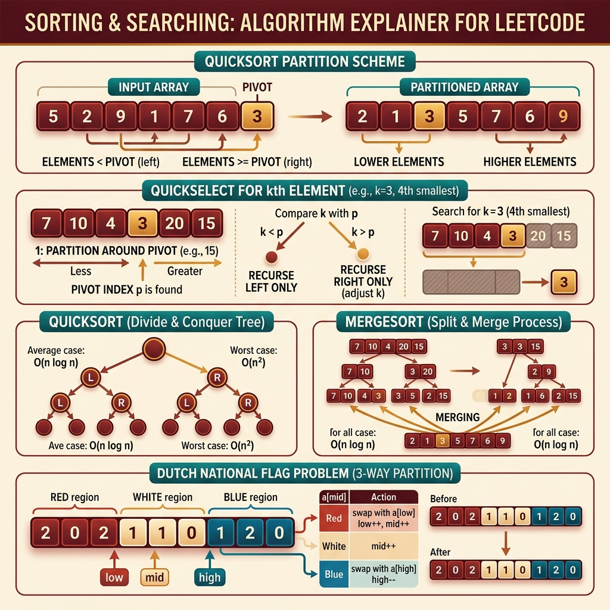

<!-- tags: leetcode, algorithms, coding-interview -->
# 🔀 Sorting & Searching

> Sort Colors, Kth Element (Quickselect), Merge Sort LL, Bucket Sort, Top K — sorting techniques for LeetCode

📅 Date created: 2026-03-20 · 🔄 Last updated: 2026-04-10 · ⏱️ 11 minutes read

| Aspect         | Detail                                      |
| -------------- | ------------------------------------------- |
| **Complexity** | O(n) Quickselect avg, O(n log n) merge sort |
| **Use case**   | K-way partition, median, custom sorting     |
| **Go stdlib**  | `sort.Slice`, `sort.Search`                 |
| **LeetCode**   | #4, #75, #148, #215, #274, #324, #347, #912 |

---

### Interview template

> Copy-paste this when encountering this problem type in interviews.

```go
// ── Dutch National Flag (3-Way Partition) ───────────────────
lo, mid, hi := 0, 0, len(nums)-1
for mid <= hi {
    switch nums[mid] {
    case 0: nums[lo], nums[mid] = nums[mid], nums[lo]; lo++; mid++
    case 1: mid++
    case 2: nums[mid], nums[hi] = nums[hi], nums[mid]; hi--
    }
}

// ── Quickselect (Kth Largest) ────────────────────────────────
var quickselect func(l, r, k int) int
quickselect = func(l, r, k int) int {
    pivot := nums[r]
    p := l
    for i := l; i < r; i++ {
        if nums[i] >= pivot { nums[p], nums[i] = nums[i], nums[p]; p++ }
    }
    nums[p], nums[r] = nums[r], nums[p]
    if p == k { return nums[p] } else if p < k { return quickselect(p+1, r, k) } else { return quickselect(l, p-1, k) }
}

// ── Binary Search on Answer ───────────────────────────────────
lo, hi := minVal, maxVal
for lo < hi {
    mid := lo + (hi-lo)/2
    if feasible(mid) { hi = mid } else { lo = mid + 1 }
}
```
```typescript
// ── Dutch National Flag (3-Way Partition) ───────────────────
let lo = 0, mid = 0, hi = nums.length - 1;
while (mid <= hi) {
    switch (nums[mid]) {
        case 0:
            [nums[lo], nums[mid]] = [nums[mid], nums[lo]];
            lo++;
            mid++;
            break;
        case 1:
            mid++;
            break;
        case 2:
            [nums[mid], nums[hi]] = [nums[hi], nums[mid]];
            hi--;
            break;
    }
}

// ── Quickselect (Kth Largest) ────────────────────────────────
const quickselect = (left: number, right: number, k: number): number => {
    const pivot = nums[right];
    let p = left;
    for (let i = left; i < right; i++) {
        if (nums[i] >= pivot) {
            [nums[p], nums[i]] = [nums[i], nums[p]];
            p++;
        }
    }
    [nums[p], nums[right]] = [nums[right], nums[p]];
    if (p === k) return nums[p];
    if (p < k) return quickselect(p + 1, right, k);
    return quickselect(left, p - 1, k);
};

// ── Binary Search on Answer ───────────────────────────────────
while (lo < hi) {
    const midVal = lo + ((hi - lo) >> 1);
    if (feasible(midVal)) hi = midVal;
    else lo = midVal + 1;
}
```
```rust
// ── Dutch National Flag (3-Way Partition) ───────────────────
let (mut lo, mut mid, mut hi) = (0usize, 0usize, nums.len() - 1);
while mid <= hi {
    match nums[mid] {
        0 => {
            nums.swap(lo, mid);
            lo += 1;
            mid += 1;
        }
        1 => mid += 1,
        2 => {
            nums.swap(mid, hi);
            if hi == 0 { break; }
            hi -= 1;
        }
        _ => unreachable!(),
    }
}

// ── Quickselect (Kth Largest) ────────────────────────────────
fn quickselect(nums: &mut [i32], left: usize, right: usize, k: usize) -> i32 {
    let pivot = nums[right];
    let mut p = left;
    for i in left..right {
        if nums[i] >= pivot {
            nums.swap(p, i);
            p += 1;
        }
    }
    nums.swap(p, right);
    if p == k {
        nums[p]
    } else if p < k {
        quickselect(nums, p + 1, right, k)
    } else {
        quickselect(nums, left, p - 1, k)
    }
}

// ── Binary Search on Answer ───────────────────────────────────
while lo < hi {
    let mid = lo + (hi - lo) / 2;
    if feasible(mid) { hi = mid; } else { lo = mid + 1; }
}
```
```cpp
// ── Dutch National Flag (3-Way Partition) ───────────────────
int lo = 0, mid = 0, hi = static_cast<int>(nums.size()) - 1;
while (mid <= hi) {
    switch (nums[mid]) {
        case 0:
            std::swap(nums[lo++], nums[mid++]);
            break;
        case 1:
            ++mid;
            break;
        case 2:
            std::swap(nums[mid], nums[hi--]);
            break;
    }
}

// ── Quickselect (Kth Largest) ────────────────────────────────
std::function<int(int, int, int)> quickselect = [&](int left, int right, int k) {
    int pivot = nums[right];
    int p = left;
    for (int i = left; i < right; ++i) {
        if (nums[i] >= pivot) std::swap(nums[p++], nums[i]);
    }
    std::swap(nums[p], nums[right]);
    if (p == k) return nums[p];
    if (p < k) return quickselect(p + 1, right, k);
    return quickselect(left, p - 1, k);
};

// ── Binary Search on Answer ───────────────────────────────────
while (lo < hi) {
    int midVal = lo + (hi - lo) / 2;
    if (feasible(midVal)) hi = midVal;
    else lo = midVal + 1;
}
```
```python
# ── Dutch National Flag (3-Way Partition) ───────────────────
lo = mid = 0
hi = len(nums) - 1
while mid <= hi:
    if nums[mid] == 0:
        nums[lo], nums[mid] = nums[mid], nums[lo]
        lo += 1
        mid += 1
    elif nums[mid] == 1:
        mid += 1
    else:
        nums[mid], nums[hi] = nums[hi], nums[mid]
        hi -= 1

# ── Quickselect (Kth Largest) ────────────────────────────────
def quickselect(left: int, right: int, k: int) -> int:
    pivot = nums[right]
    p = left
    for i in range(left, right):
        if nums[i] >= pivot:
            nums[p], nums[i] = nums[i], nums[p]
            p += 1
    nums[p], nums[right] = nums[right], nums[p]
    if p == k:
        return nums[p]
    if p < k:
        return quickselect(p + 1, right, k)
    return quickselect(left, p - 1, k)

# ── Binary Search on Answer ───────────────────────────────────
while lo < hi:
    mid_val = lo + (hi - lo) // 2
    if feasible(mid_val):
        hi = mid_val
    else:
        lo = mid_val + 1
```

---

## 1. DEFINE

Sorting in interviews is not just calling `sort()`. It tests your understanding of custom comparisons and linear time algorithms. It checks if you know when partial sorting beats full sorting. 🔀 Sorting & Searching helps you identify these boundaries early.

Sorting and searching require recognizing when data order is the primary asset. Sometimes picking the kth element or partitioning data correctly is the true goal.

This family is valuable because many array manipulation problems demand strong order guarantees. Establishing correct order simplifies the rest of the problem. If you attempt a direct solution on chaotic data, your code becomes messy.

Core insight: **Sorting and searching excel when you understand the exact required order pattern. Avoid sorting data blindly by habit.**

| Variant | When to use | Core idea |
| ------- | ------- | ------- |
| Partition-based sorting | Sort Colors, Wiggle, Dutch flag | Split data into zones using a multi-pointer invariant |
| Selection | Kth element, median, top-k | Find specific elements without sorting the entire array |
| Stable divide-and-conquer | Merge sort on linked list / arrays | Divide data and merge according to global order |
| Binary search on answer | Capacity, speed, threshold problems | Search an answer space using a monotonic predicate |

| Approach | Time | Space | When to choose |
| --- | --- | --- | --- |
| Dutch National Flag | O(n) | O(1) | Use for small discrete value groups needing in-place partitioning |
| Quickselect | O(n) average | O(1) / O(log n) recursion | Use when finding the kth element or approximate median |
| Merge sort | O(n log n) | O(log n) or O(n) | Use when stable order or linked list sorting is required |
| Binary search on answer | O(n log range) | O(1) | Use when seeking the smallest or largest valid answer threshold |

### 1.1 Quick Identification

- The problem features sort colors, kth elements, list merge sorts, or medians. It might involve pivot partitions or insertion positions.
- You need a global order or a sufficient local order to extract an answer.
- If the objective is top-k, medians, partitions, or ordered boundaries, this is the core family.

### 1.2 Invariants & Failure Modes

- Each sort pass or partition must maintain a clear invariant about stabilized zones.
- Not every sorting problem requires a complete array sort. Selection and partition primitives are often better.
- A common failure mode is over-sorting everything by default. This wastes time and space while obscuring the core invariant.

## 2. VISUAL

Sorting problems focus on exploiting order properties. The diagram below categorizes four main approaches.

### Overview — Sorting & Searching



*Figure: Sorting problems involve selecting the right algorithm or exploiting order properties.*

### Level 1 — Core intuition

```text
Dutch National Flag
[0..lo-1] = 0-zone
[lo..mid-1] = 1-zone
[mid..hi] = unknown
[hi+1..end] = 2-zone

Quickselect
partition by pivot
pivot index tells which half to discard next
```

*Caption*: Level 1 shows that sorting and searching heavily rely on invariants and elimination. They do not always sort the full array.

### Level 2 — Detailed decision trace

- The Dutch flag algorithm ensures every swap expands at least one known zone.
- Quickselect only recurses into the half containing the kth element. Recursing both halves wastes resources.
- Merge sorting a linked list differs from arrays. Split and merge pointer operations are crucial without random access.
- Binary search on answers only works when the predicate exhibits monotonicity across the space.

The trace reveals how partition boundaries shift. Your code implements this shift. The invariant defining which pointer advances guarantees correctness.

## 3. CODE

Once the order invariant is clear, select the right primitive. Choose among global sorts, partitions, quickselect, or binary searches on ordered data.

### Problem 1: Basic — Sort Colors & H-Index [LC #75, #274]
> **Goal**: Use partitions and sorting-based counting to build sufficient order without over-engineering.
> **Approach**: Dutch National Flag for three colors. Sort and count logic for H-Index.
> **Example**: An array contains only 0/1/2, or citation counts define an H threshold.
> **Complexity**: O(n) or O(n log n) time. O(1) extra space if in-place.

```go
// leetcode/sorting_basic.go
package leetcode

// ✅ LC #75: Sort Colors (Dutch National Flag)
// 3-way partition: 0s left, 1s middle, 2s right
// Time: O(n), Space: O(1), ONE PASS
func sortColors(nums []int) {
    lo, mid, hi := 0, 0, len(nums)-1

    for mid <= hi {
        switch nums[mid] {
        case 0:
            nums[lo], nums[mid] = nums[mid], nums[lo]
            lo++
            mid++
        case 1:
            mid++ // ✅ 1 stays in middle
        case 2:
            nums[mid], nums[hi] = nums[hi], nums[mid]
            hi--
            // ⚠️ Don't advance mid — swapped element needs checking
        }
    }
}

// ✅ LC #274: H-Index
// Counting sort approach: O(n) time, O(n) space
func hIndex(citations []int) int {
    n := len(citations)
    // ✅ Count: papers with exactly i citations (cap at n)
    count := make([]int, n+1)
    for _, c := range citations {
        if c >= n {
            count[n]++ // ⚠️ Cap at n
        } else {
            count[c]++
        }
    }

    // ✅ From right: accumulate papers with ≥ i citations
    total := 0
    for i := n; i >= 0; i-- {
        total += count[i]
        if total >= i {
            return i // ✅ h papers have ≥ h citations
        }
    }
    return 0
}
```
```typescript
// leetcode/sorting_basic.ts
export function sortColors(nums: number[]): void {
    let lo = 0, mid = 0, hi = nums.length - 1;
    while (mid <= hi) {
        if (nums[mid] === 0) {
            [nums[lo], nums[mid]] = [nums[mid], nums[lo]];
            lo++;
            mid++;
        } else if (nums[mid] === 1) {
            mid++;
        } else {
            [nums[mid], nums[hi]] = [nums[hi], nums[mid]];
            hi--;
        }
    }
}

export function hIndex(citations: number[]): number {
    const n = citations.length;
    const count = Array.from({ length: n + 1 }, () => 0);
    for (const c of citations) count[Math.min(c, n)]++;
    let total = 0;
    for (let i = n; i >= 0; i--) {
        total += count[i];
        if (total >= i) return i;
    }
    return 0;
}
```
```rust
// leetcode/sorting_basic.rs
pub fn sort_colors(nums: &mut Vec<i32>) {
    let (mut lo, mut mid, mut hi) = (0usize, 0usize, nums.len() - 1);
    while mid <= hi {
        match nums[mid] {
            0 => {
                nums.swap(lo, mid);
                lo += 1;
                mid += 1;
            }
            1 => mid += 1,
            2 => {
                nums.swap(mid, hi);
                if hi == 0 { break; }
                hi -= 1;
            }
            _ => unreachable!(),
        }
    }
}

pub fn h_index(citations: Vec<i32>) -> i32 {
    let n = citations.len();
    let mut count = vec![0; n + 1];
    for c in citations {
        count[c.min(n as i32) as usize] += 1;
    }
    let mut total = 0;
    for i in (0..=n).rev() {
        total += count[i];
        if total >= i as i32 {
            return i as i32;
        }
    }
    0
}
```
```cpp
// leetcode/sorting_basic.cpp
void sortColors(std::vector<int>& nums) {
    int lo = 0, mid = 0, hi = static_cast<int>(nums.size()) - 1;
    while (mid <= hi) {
        if (nums[mid] == 0) std::swap(nums[lo++], nums[mid++]);
        else if (nums[mid] == 1) ++mid;
        else std::swap(nums[mid], nums[hi--]);
    }
}

int hIndex(std::vector<int>& citations) {
    int n = static_cast<int>(citations.size());
    std::vector<int> count(n + 1, 0);
    for (int c : citations) ++count[std::min(c, n)];
    int total = 0;
    for (int i = n; i >= 0; --i) {
        total += count[i];
        if (total >= i) return i;
    }
    return 0;
}
```
```python
# leetcode/sorting_basic.py
def sort_colors(nums: list[int]) -> None:
    lo = mid = 0
    hi = len(nums) - 1
    while mid <= hi:
        if nums[mid] == 0:
            nums[lo], nums[mid] = nums[mid], nums[lo]
            lo += 1
            mid += 1
        elif nums[mid] == 1:
            mid += 1
        else:
            nums[mid], nums[hi] = nums[hi], nums[mid]
            hi -= 1

def h_index(citations: list[int]) -> int:
    n = len(citations)
    count = [0] * (n + 1)
    for c in citations:
        count[min(c, n)] += 1
    total = 0
    for i in range(n, -1, -1):
        total += count[i]
        if total >= i:
            return i
    return 0
```

> **Why?** Basic sorting problems hinge on visualizing data zones. Sort Colors succeeds because every step expands one specific color zone. H-Index succeeds because bucketizing transforms the problem into simple threshold counting.

> **Conclusion**: This **Basic** example demonstrates solving `Sort Colors & H-Index [LC #75, #274]` without skipping reasoning steps. If constraints shift, move to the next example.

---
### Problem 2: Intermediate — Merge Sort LL & Wiggle Sort [LC #148, #324]
> **Goal**: Combine divide-and-conquer patterns or specific rearrangements rather than calling a default sort.
> **Approach**: Merge sort a linked list, or sort and remap positions for a wiggle invariant.
> **Example**: A long linked list needs a stable sort, or an array requires alternating large-small values.
> **Complexity**: O(n log n) time. Space depends on the specific merge strategy.

```go
// leetcode/sorting_intermediate.go
package leetcode

// ✅ LC #148: Sort List (Merge Sort on Linked List)
// Merge sort: split at middle → sort halves → merge
// Time: O(n log n), Space: O(log n) recursion / O(1) iterative
func sortList(head *ListNode) *ListNode {
    if head == nil || head.Next == nil {
        return head
    }

    // ✅ Step 1: Find middle
    slow, fast := head, head.Next
    for fast != nil && fast.Next != nil {
        slow = slow.Next
        fast = fast.Next.Next
    }

    // ✅ Step 2: Split
    mid := slow.Next
    slow.Next = nil

    // ✅ Step 3: Sort each half
    left := sortList(head)
    right := sortList(mid)

    // ✅ Step 4: Merge sorted halves
    return mergeSorted(left, right)
}

func mergeSorted(l1, l2 *ListNode) *ListNode {
    dummy := &ListNode{}
    curr := dummy

    for l1 != nil && l2 != nil {
        if l1.Val <= l2.Val {
            curr.Next = l1
            l1 = l1.Next
        } else {
            curr.Next = l2
            l2 = l2.Next
        }
        curr = curr.Next
    }

    if l1 != nil {
        curr.Next = l1
    } else {
        curr.Next = l2
    }

    return dummy.Next
}

// ✅ LC #912: Sort an Array (Merge Sort / Quick Sort)
// Merge sort — stable, guaranteed O(n log n)
func sortArray(nums []int) []int {
    if len(nums) <= 1 {
        return nums
    }

    mid := len(nums) / 2
    left := sortArray(nums[:mid])
    right := sortArray(nums[mid:])

    return mergeArrays(left, right)
}

func mergeArrays(a, b []int) []int {
    result := make([]int, 0, len(a)+len(b))
    i, j := 0, 0

    for i < len(a) && j < len(b) {
        if a[i] <= b[j] {
            result = append(result, a[i])
            i++
        } else {
            result = append(result, b[j])
            j++
        }
    }

    result = append(result, a[i:]...)
    result = append(result, b[j:]...)
    return result
}
```
```typescript
// leetcode/sorting_intermediate.ts
type ListNode = { val: number; next: ListNode | null };

export function sortList(head: ListNode | null): ListNode | null {
    if (!head || !head.next) return head;
    let slow = head;
    let fast = head.next;
    while (fast && fast.next) {
        slow = slow.next!;
        fast = fast.next.next;
    }
    const mid = slow.next;
    slow.next = null;
    return mergeSorted(sortList(head), sortList(mid));
}

function mergeSorted(l1: ListNode | null, l2: ListNode | null): ListNode | null {
    const dummy: ListNode = { val: 0, next: null };
    let curr = dummy;
    while (l1 && l2) {
        if (l1.val <= l2.val) {
            curr.next = l1;
            l1 = l1.next;
        } else {
            curr.next = l2;
            l2 = l2.next;
        }
        curr = curr.next;
    }
    curr.next = l1 ?? l2;
    return dummy.next;
}

export function sortArray(nums: number[]): number[] {
    if (nums.length <= 1) return nums;
    const mid = nums.length >> 1;
    return mergeArrays(sortArray(nums.slice(0, mid)), sortArray(nums.slice(mid)));
}

function mergeArrays(a: number[], b: number[]): number[] {
    const result: number[] = [];
    let i = 0, j = 0;
    while (i < a.length && j < b.length) {
        if (a[i] <= b[j]) result.push(a[i++]);
        else result.push(b[j++]);
    }
    return result.concat(a.slice(i), b.slice(j));
}
```
```rust
// leetcode/sorting_intermediate.rs
#[derive(Clone)]
pub struct ListNode {
    pub val: i32,
    pub next: Option<Box<ListNode>>,
}

pub fn sort_list(mut head: Option<Box<ListNode>>) -> Option<Box<ListNode>> {
    let mut vals = Vec::new();
    while let Some(mut node) = head {
        vals.push(node.val);
        head = node.next.take();
    }
    vals.sort_unstable();
    let mut result = None;
    for val in vals.into_iter().rev() {
        result = Some(Box::new(ListNode { val, next: result }));
    }
    result
}

pub fn sort_array(nums: Vec<i32>) -> Vec<i32> {
    if nums.len() <= 1 {
        return nums;
    }
    let mid = nums.len() / 2;
    merge_arrays(sort_array(nums[..mid].to_vec()), sort_array(nums[mid..].to_vec()))
}

fn merge_arrays(a: Vec<i32>, b: Vec<i32>) -> Vec<i32> {
    let (mut i, mut j) = (0, 0);
    let mut result = Vec::with_capacity(a.len() + b.len());
    while i < a.len() && j < b.len() {
        if a[i] <= b[j] {
            result.push(a[i]);
            i += 1;
        } else {
            result.push(b[j]);
            j += 1;
        }
    }
    result.extend_from_slice(&a[i..]);
    result.extend_from_slice(&b[j..]);
    result
}
```
```cpp
// leetcode/sorting_intermediate.cpp
struct ListNode {
    int val;
    ListNode* next;
};

ListNode* mergeSorted(ListNode* l1, ListNode* l2) {
    ListNode dummy{0, nullptr};
    ListNode* curr = &dummy;
    while (l1 && l2) {
        if (l1->val <= l2->val) {
            curr->next = l1;
            l1 = l1->next;
        } else {
            curr->next = l2;
            l2 = l2->next;
        }
        curr = curr->next;
    }
    curr->next = l1 ? l1 : l2;
    return dummy.next;
}

ListNode* sortList(ListNode* head) {
    if (!head || !head->next) return head;
    ListNode* slow = head;
    ListNode* fast = head->next;
    while (fast && fast->next) {
        slow = slow->next;
        fast = fast->next->next;
    }
    ListNode* mid = slow->next;
    slow->next = nullptr;
    return mergeSorted(sortList(head), sortList(mid));
}

std::vector<int> mergeArrays(const std::vector<int>& a, const std::vector<int>& b) {
    std::vector<int> result;
    int i = 0, j = 0;
    while (i < static_cast<int>(a.size()) && j < static_cast<int>(b.size())) {
        if (a[i] <= b[j]) result.push_back(a[i++]);
        else result.push_back(b[j++]);
    }
    result.insert(result.end(), a.begin() + i, a.end());
    result.insert(result.end(), b.begin() + j, b.end());
    return result;
}

std::vector<int> sortArray(std::vector<int> nums) {
    if (nums.size() <= 1) return nums;
    int mid = static_cast<int>(nums.size()) / 2;
    return mergeArrays(
        sortArray(std::vector<int>(nums.begin(), nums.begin() + mid)),
        sortArray(std::vector<int>(nums.begin() + mid, nums.end()))
    );
}
```
```python
# leetcode/sorting_intermediate.py
class ListNode:
    def __init__(self, val: int = 0, next: "ListNode | None" = None) -> None:
        self.val = val
        self.next = next

def merge_sorted(l1: ListNode | None, l2: ListNode | None) -> ListNode | None:
    dummy = ListNode()
    curr = dummy
    while l1 and l2:
        if l1.val <= l2.val:
            curr.next = l1
            l1 = l1.next
        else:
            curr.next = l2
            l2 = l2.next
        curr = curr.next
    curr.next = l1 or l2
    return dummy.next

def sort_list(head: ListNode | None) -> ListNode | None:
    if not head or not head.next:
        return head
    slow, fast = head, head.next
    while fast and fast.next:
        slow = slow.next
        fast = fast.next.next
    mid = slow.next
    slow.next = None
    return merge_sorted(sort_list(head), sort_list(mid))

def sort_array(nums: list[int]) -> list[int]:
    if len(nums) <= 1:
        return nums
    mid = len(nums) // 2
    left = sort_array(nums[:mid])
    right = sort_array(nums[mid:])
    result: list[int] = []
    i = j = 0
    while i < len(left) and j < len(right):
        if left[i] <= right[j]:
            result.append(left[i])
            i += 1
        else:
            result.append(right[j])
            j += 1
    return result + left[i:] + right[j:]
```

> **Why?** The intermediate level demands deep data structure knowledge. Linked lists resist quicksort array tricks. Wiggle Sort requires sorting followed by precise positional redistribution to maintain local inequalities.

> **Conclusion**: This **Intermediate** example shows how to use `Merge Sort LL & Wiggle Sort [LC #148, #324]` without skipping reasoning steps. If constraints shift, move to the next example.

---
### Problem 3: Advanced — Quickselect & Median of Two Sorted [LC #215, #4]
> **Goal**: Execute selection and search tasks within strongly structured spaces.
> **Approach**: Quickselect for O(n) average kth elements. Binary partition for medians of two sorted arrays.
> **Example**: A large array needs the kth largest element. Two sorted arrays need a global median without merging.
> **Complexity**: O(n) average for quickselect. O(log(min(m,n))) for medians of two arrays.

```go
// leetcode/sorting_advanced.go
package leetcode

import "math/rand"

// ✅ LC #215: Kth Largest Element — Quickselect
// Average O(n), worst O(n²) — randomized pivot helps
// Space: O(1)
func findKthLargestQS(nums []int, k int) int {
    target := len(nums) - k // ✅ Kth largest = (n-k)th smallest

    var quickselect func(lo, hi int) int
    quickselect = func(lo, hi int) int {
        // ✅ Random pivot to avoid O(n²) worst case
        randIdx := lo + rand.Intn(hi-lo+1)
        nums[randIdx], nums[hi] = nums[hi], nums[randIdx]

        pivot := nums[hi]
        storeIdx := lo

        for i := lo; i < hi; i++ {
            if nums[i] < pivot {
                nums[i], nums[storeIdx] = nums[storeIdx], nums[i]
                storeIdx++
            }
        }
        nums[storeIdx], nums[hi] = nums[hi], nums[storeIdx]

        if storeIdx == target {
            return nums[storeIdx] // ✅ Found
        } else if storeIdx < target {
            return quickselect(storeIdx+1, hi)
        }
        return quickselect(lo, storeIdx-1)
    }

    return quickselect(0, len(nums)-1)
}

// ✅ LC #4: Median of Two Sorted Arrays (HARD)
// Binary search on smaller array partition
// Time: O(log(min(m,n))), Space: O(1)
func findMedianSortedArrays(nums1, nums2 []int) float64 {
    // ✅ Ensure nums1 is shorter
    if len(nums1) > len(nums2) {
        return findMedianSortedArrays(nums2, nums1)
    }

    m, n := len(nums1), len(nums2)
    lo, hi := 0, m
    halfLen := (m + n + 1) / 2

    for lo <= hi {
        i := (lo + hi) / 2   // ✅ Partition point in nums1
        j := halfLen - i      // ✅ Partition point in nums2

        // ✅ Boundary values
        var maxLeft1, maxLeft2, minRight1, minRight2 int

        if i == 0 {
            maxLeft1 = -(1 << 31)
        } else {
            maxLeft1 = nums1[i-1]
        }
        if i == m {
            minRight1 = 1<<31 - 1
        } else {
            minRight1 = nums1[i]
        }
        if j == 0 {
            maxLeft2 = -(1 << 31)
        } else {
            maxLeft2 = nums2[j-1]
        }
        if j == n {
            minRight2 = 1<<31 - 1
        } else {
            minRight2 = nums2[j]
        }

        // ✅ Valid partition: maxLeft1 ≤ minRight2 AND maxLeft2 ≤ minRight1
        if maxLeft1 <= minRight2 && maxLeft2 <= minRight1 {
            if (m+n)%2 == 0 {
                maxLeft := maxLeft1
                if maxLeft2 > maxLeft {
                    maxLeft = maxLeft2
                }
                minRight := minRight1
                if minRight2 < minRight {
                    minRight = minRight2
                }
                return float64(maxLeft+minRight) / 2.0
            }
            if maxLeft1 > maxLeft2 {
                return float64(maxLeft1)
            }
            return float64(maxLeft2)
        } else if maxLeft1 > minRight2 {
            hi = i - 1 // ✅ Too far right in nums1
        } else {
            lo = i + 1 // ✅ Too far left in nums1
        }
    }

    return 0.0
}
```
```typescript
// leetcode/sorting_advanced.ts
export function findKthLargestQS(nums: number[], k: number): number {
    const target = nums.length - k;
    const quickselect = (lo: number, hi: number): number => {
        const pivot = nums[hi];
        let store = lo;
        for (let i = lo; i < hi; i++) {
            if (nums[i] < pivot) {
                [nums[i], nums[store]] = [nums[store], nums[i]];
                store++;
            }
        }
        [nums[store], nums[hi]] = [nums[hi], nums[store]];
        if (store === target) return nums[store];
        if (store < target) return quickselect(store + 1, hi);
        return quickselect(lo, store - 1);
    };
    return quickselect(0, nums.length - 1);
}

export function findMedianSortedArrays(nums1: number[], nums2: number[]): number {
    if (nums1.length > nums2.length) return findMedianSortedArrays(nums2, nums1);
    const m = nums1.length;
    const n = nums2.length;
    let lo = 0, hi = m;
    const half = (m + n + 1) >> 1;
    while (lo <= hi) {
        const i = (lo + hi) >> 1;
        const j = half - i;
        const maxLeft1 = i === 0 ? -Infinity : nums1[i - 1];
        const minRight1 = i === m ? Infinity : nums1[i];
        const maxLeft2 = j === 0 ? -Infinity : nums2[j - 1];
        const minRight2 = j === n ? Infinity : nums2[j];
        if (maxLeft1 <= minRight2 && maxLeft2 <= minRight1) {
            if ((m + n) % 2 === 0) return (Math.max(maxLeft1, maxLeft2) + Math.min(minRight1, minRight2)) / 2;
            return Math.max(maxLeft1, maxLeft2);
        }
        if (maxLeft1 > minRight2) hi = i - 1;
        else lo = i + 1;
    }
    return 0;
}
```
```rust
// leetcode/sorting_advanced.rs
pub fn find_kth_largest_qs(mut nums: Vec<i32>, k: i32) -> i32 {
    let target = nums.len() - k as usize;
    fn quickselect(nums: &mut [i32], lo: usize, hi: usize, target: usize) -> i32 {
        let pivot = nums[hi];
        let mut store = lo;
        for i in lo..hi {
            if nums[i] < pivot {
                nums.swap(i, store);
                store += 1;
            }
        }
        nums.swap(store, hi);
        if store == target {
            nums[store]
        } else if store < target {
            quickselect(nums, store + 1, hi, target)
        } else {
            quickselect(nums, lo, store - 1, target)
        }
    }
    let len = nums.len();
    quickselect(&mut nums, 0, len - 1, target)
}

pub fn find_median_sorted_arrays(nums1: Vec<i32>, nums2: Vec<i32>) -> f64 {
    if nums1.len() > nums2.len() {
        return find_median_sorted_arrays(nums2, nums1);
    }
    let (m, n) = (nums1.len(), nums2.len());
    let (mut lo, mut hi) = (0usize, m);
    let half = (m + n + 1) / 2;
    while lo <= hi {
        let i = (lo + hi) / 2;
        let j = half - i;
        let max_left1 = if i == 0 { i32::MIN } else { nums1[i - 1] };
        let min_right1 = if i == m { i32::MAX } else { nums1[i] };
        let max_left2 = if j == 0 { i32::MIN } else { nums2[j - 1] };
        let min_right2 = if j == n { i32::MAX } else { nums2[j] };
        if max_left1 <= min_right2 && max_left2 <= min_right1 {
            if (m + n) % 2 == 0 {
                return (max_left1.max(max_left2) + min_right1.min(min_right2)) as f64 / 2.0;
            }
            return max_left1.max(max_left2) as f64;
        }
        if max_left1 > min_right2 {
            if i == 0 { break; }
            hi = i - 1;
        } else {
            lo = i + 1;
        }
    }
    0.0
}
```
```cpp
// leetcode/sorting_advanced.cpp
int findKthLargestQS(std::vector<int>& nums, int k) {
    int target = static_cast<int>(nums.size()) - k;
    std::function<int(int, int)> quickselect = [&](int lo, int hi) {
        int pivot = nums[hi];
        int store = lo;
        for (int i = lo; i < hi; ++i) {
            if (nums[i] < pivot) std::swap(nums[i], nums[store++]);
        }
        std::swap(nums[store], nums[hi]);
        if (store == target) return nums[store];
        if (store < target) return quickselect(store + 1, hi);
        return quickselect(lo, store - 1);
    };
    return quickselect(0, static_cast<int>(nums.size()) - 1);
}

double findMedianSortedArrays(std::vector<int>& nums1, std::vector<int>& nums2) {
    if (nums1.size() > nums2.size()) return findMedianSortedArrays(nums2, nums1);
    int m = static_cast<int>(nums1.size()), n = static_cast<int>(nums2.size());
    int lo = 0, hi = m, half = (m + n + 1) / 2;
    while (lo <= hi) {
        int i = (lo + hi) / 2;
        int j = half - i;
        int maxLeft1 = i == 0 ? INT_MIN : nums1[i - 1];
        int minRight1 = i == m ? INT_MAX : nums1[i];
        int maxLeft2 = j == 0 ? INT_MIN : nums2[j - 1];
        int minRight2 = j == n ? INT_MAX : nums2[j];
        if (maxLeft1 <= minRight2 && maxLeft2 <= minRight1) {
            if ((m + n) % 2 == 0) return (std::max(maxLeft1, maxLeft2) + std::min(minRight1, minRight2)) / 2.0;
            return std::max(maxLeft1, maxLeft2);
        }
        if (maxLeft1 > minRight2) hi = i - 1;
        else lo = i + 1;
    }
    return 0.0;
}
```
```python
# leetcode/sorting_advanced.py
def find_kth_largest_qs(nums: list[int], k: int) -> int:
    target = len(nums) - k

    def quickselect(lo: int, hi: int) -> int:
        pivot = nums[hi]
        store = lo
        for i in range(lo, hi):
            if nums[i] < pivot:
                nums[i], nums[store] = nums[store], nums[i]
                store += 1
        nums[store], nums[hi] = nums[hi], nums[store]
        if store == target:
            return nums[store]
        if store < target:
            return quickselect(store + 1, hi)
        return quickselect(lo, store - 1)

    return quickselect(0, len(nums) - 1)

def find_median_sorted_arrays(nums1: list[int], nums2: list[int]) -> float:
    if len(nums1) > len(nums2):
        return find_median_sorted_arrays(nums2, nums1)
    m, n = len(nums1), len(nums2)
    lo, hi = 0, m
    half = (m + n + 1) // 2
    while lo <= hi:
        i = (lo + hi) // 2
        j = half - i
        max_left1 = float("-inf") if i == 0 else nums1[i - 1]
        min_right1 = float("inf") if i == m else nums1[i]
        max_left2 = float("-inf") if j == 0 else nums2[j - 1]
        min_right2 = float("inf") if j == n else nums2[j]
        if max_left1 <= min_right2 and max_left2 <= min_right1:
            if (m + n) % 2 == 0:
                return (max(max_left1, max_left2) + min(min_right1, min_right2)) / 2
            return float(max(max_left1, max_left2))
        if max_left1 > min_right2:
            hi = i - 1
        else:
            lo = i + 1
    return 0.0
```

> **Why?** Quickselect discards half the search space per partition without touching irrelevant data. The two-array median approach is stronger. It binary searches the cut point, using array invariants instead of a full data merge.

> **Conclusion**: This **Advanced** example shows how to use `Quickselect & Median of Two Sorted [LC #215, #4]` without skipping reasoning steps. If constraints shift, move to the next example.

> **✅ Achieved**: Quickselect O(n) average, median of two sorted O(log(min(m,n))).
> **⚠️ Note**: Quickselect needs a randomized pivot to avoid O(n²) worst cases. Median searches focus on the SHORTER array.

---
Sorting code looks simple, but pointer boundary errors are common. Small test cases pass while edge cases fail.

## 4. PITFALLS

Failures in this family stem from misunderstanding the required order depth rather than missing loops.

| # | Severity | Defect | Consequence | Fix |
|---|----------|-----|---------|-----|
| 1 | Sort Colors: advance mid on 2 swap | — | Swapped element skips checking | Do not advance mid after swap |
| 2 | Quickselect: deterministic pivot | — | O(n²) worst case time | Use random pivot or median-of-3 |
| 3 | Merge Sort LL: forgot `slow.Next = nil` | — | Infinite loop | MUST cut list at middle |
| 4 | Find middle LL: fast initialization | — | Skips proper middle on evens | `fast = head.Next` for first middle |
| 5 | Median: search on LONGER array | — | Index out of bounds | MUST search on SHORTER array |
| 6 | Go `sort.Slice`: unstable | — | Order changes randomly | Use `sort.SliceStable` if needed |

### 🔴 Pitfall #1 — Sort Colors: advance mid pointer on 2 swap

Dutch National Flag code:

```go
if nums[mid] == 2 {
    nums[mid], nums[hi] = nums[hi], nums[mid]
    hi--
    mid++  // ← WRONG: swapped element is unverified!
}
```

When swapping `nums[mid]` with `nums[hi]`, the incoming element could be a 0 or a 1. Advancing `mid++` skips classifying this new element.

**Fix**: When swapping with hi, ONLY apply `hi--`. Do NOT apply `mid++`. The swapped element must be verified in the next iteration.

---

## 5. REF

| Resource                   | Link                                                                                                            |
| -------------------------- | --------------------------------------------------------------------------------------------------------------- |
| LC #75 Sort Colors         | [leetcode.com/problems/sort-colors](https://leetcode.com/problems/sort-colors/)                                 |
| LC #4 Median of Two Sorted | [leetcode.com/problems/median-of-two-sorted-arrays](https://leetcode.com/problems/median-of-two-sorted-arrays/) |
| LC #148 Sort List          | [leetcode.com/problems/sort-list](https://leetcode.com/problems/sort-list/)                                     |
| Go sort package            | [pkg.go.dev/sort](https://pkg.go.dev/sort)                                                                      |
| Quickselect                | [en.wikipedia.org/wiki/Quickselect](https://en.wikipedia.org/wiki/Quickselect)                                  |

---

## 6. RECOMMEND

When a problem routes into full sort, partition, or search spaces, connect it to the optimal family for the exact required order.

| Extension | When to use | Reason | File/Link |
| ------- | ------- | ----- | --------- |
| Binary Search | Sorted data + O(log n) | Combines sorting and BS | [02-binary-search](./02-binary-search.md) |
| Heap & Priority Queue | Top-K using a heap | O(n log k) beats O(n log n) | [11-heap-priority-queue](./11-heap-priority-queue.md) |
| HashMap & Prefix Sum | Bucket sort by frequency | Avoids comparison sorting | [13-hashmap-prefix-sum](./13-hashmap-prefix-sum.md) |
| Array Techniques | Dutch national flag | Applies 3-way partition | [21-array-techniques](./21-array-techniques.md) |

---

## 7. QUICK REF

| Situation / Signal | Pattern / Approach | Complexity | When to use | Warning |
|--------------------|--------------------|------------|----------|----------|
| kth largest / kth smallest | QuickSelect partition | O(n) avg · O(1) | LC #215: kth largest | Worst case O(n²): randomize pivot |
| count inversions | Merge sort + count | O(n log n) · O(n) | Count reverse pairs | Count during merge step |
| sort colors (3-way) | Dutch national flag | O(n) · O(1) | LC #75: sort 3 values | Use three pointers: lo, mid, hi |
| largest number from array | Custom comparator sort | O(n log n) · O(n) | LC #179: form largest number | Compare strings: a+b vs b+a |
| top-k frequent | Bucket sort by frequency | O(n) · O(n) | LC #347: top k frequent | Bucket[freq] holds element list |

---

Return to the opening "sort with constraints" problem. You now know that sorting problems do not simply call sort. They require understanding custom partitions, stable sorts, and linear time alternatives.

---

**Links**: [← Advanced Graph](./19-advanced-graph.md) · [→ Array Techniques](./21-array-techniques.md)
