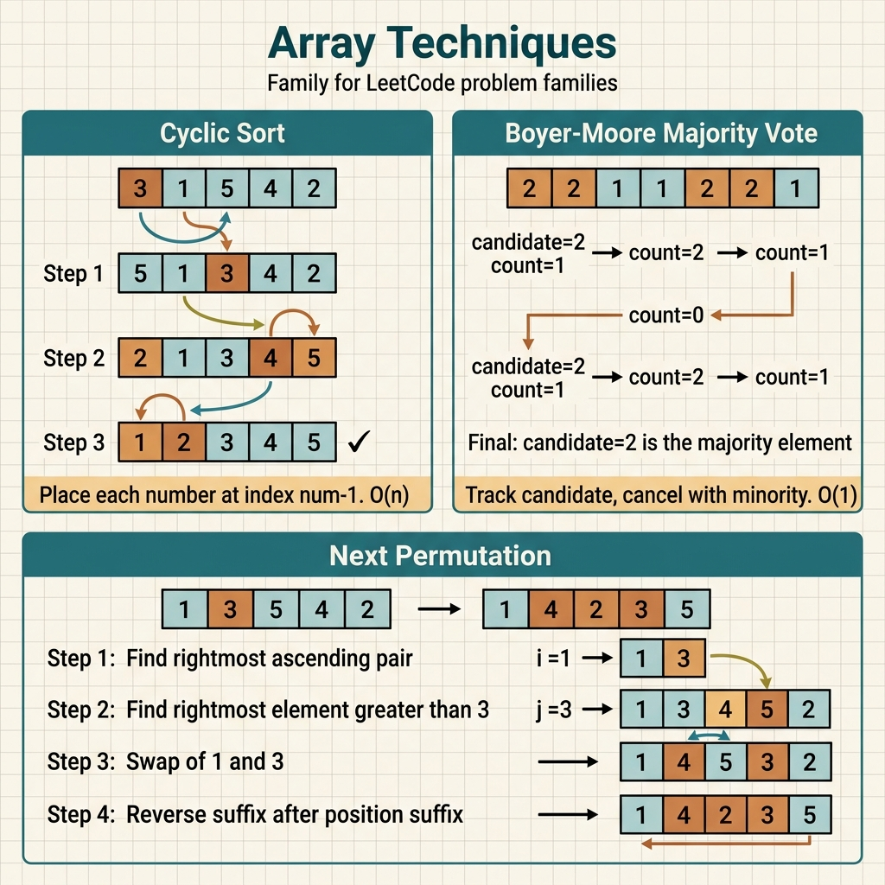

<!-- tags: leetcode, algorithms, coding-interview, arrays -->
# 🔧 Array Techniques

> In-place operations, next permutation, majority element, rotate, first missing positive — advanced array techniques

📅 Created: 2026-03-20 · 🔄 Updated: 2026-04-10 · ⏱️ 12 min read

| Aspect         | Detail                                            |
| -------------- | ------------------------------------------------- |
| **Complexity** | O(n) in-place, O(1) space                         |
| **Use case**   | Array manipulation without extra space            |
| **Go stdlib**  | `sort`, slice operations                          |
| **LeetCode**   | #31, #41, #48, #169, #189, #229, #283, #287, #442 |

---

### Interview template

> Copy-paste this template when facing this problem type in an interview.

```go
// ── Boyer-Moore Majority Vote ────────────────────────────────
candidate, count := 0, 0
for _, n := range nums {
    if count == 0 { candidate = n }
    if n == candidate { count++ } else { count-- }
}

// ── Next Permutation ─────────────────────────────────────────
i := len(nums) - 2
for i >= 0 && nums[i] >= nums[i+1] { i-- }
if i >= 0 {
    j := len(nums) - 1
    for j >= 0 && nums[j] <= nums[i] { j-- }
    nums[i], nums[j] = nums[j], nums[i]
}
// Reverse suffix
for l, r := i+1, len(nums)-1; l < r; l, r = l+1, r-1 { nums[l], nums[r] = nums[r], nums[l] }

// ── Cyclic Sort ───────────────────────────────────────────────
i := 0
for i < len(nums) {
    j := nums[i] - 1 // expected position
    if nums[i] > 0 && nums[i] <= len(nums) && nums[i] != nums[j] { nums[i], nums[j] = nums[j], nums[i] } else { i++ }
}

// ── Floyd Cycle (Find Duplicate) ─────────────────────────────
slow, fast := nums[0], nums[nums[0]]
for slow != fast { slow = nums[slow]; fast = nums[nums[fast]] }
slow = 0
for slow != fast { slow = nums[slow]; fast = nums[fast] }
// slow == fast == duplicate
```
```typescript
// ── Boyer-Moore Majority Vote ────────────────────────────────
let candidate = 0;
let count = 0;
for (const num of nums) {
    if (count === 0) candidate = num;
    if (num === candidate) count++;
    else count--;
}

// ── Next Permutation ─────────────────────────────────────────
let i = nums.length - 2;
while (i >= 0 && nums[i] >= nums[i + 1]) i--;
if (i >= 0) {
    let j = nums.length - 1;
    while (j >= 0 && nums[j] <= nums[i]) j--;
    [nums[i], nums[j]] = [nums[j], nums[i]];
}
for (let left = i + 1, right = nums.length - 1; left < right; left++, right--) {
    [nums[left], nums[right]] = [nums[right], left]];
}

// ── Cyclic Sort ───────────────────────────────────────────────
let idx = 0;
while (idx < nums.length) {
    const target = nums[idx] - 1;
    if (nums[idx] > 0 && nums[idx] <= nums.length && nums[idx] !== nums[target]) {
        [nums[idx], nums[target]] = [nums[target], nums[idx]];
    } else {
        idx++;
    }
}

// ── Floyd Cycle (Find Duplicate) ─────────────────────────────
let slow = nums[0];
let fast = nums[nums[0]];
while (slow !== fast) {
    slow = nums[slow];
    fast = nums[nums[fast]];
}
slow = 0;
while (slow !== fast) {
    slow = nums[slow];
    fast = nums[fast];
}
```
```rust
// ── Boyer-Moore Majority Vote ────────────────────────────────
let (mut candidate, mut count) = (0, 0);
for &num in &nums {
    if count == 0 {
        candidate = num;
    }
    if num == candidate {
        count += 1;
    } else {
        count -= 1;
    }
}

// ── Next Permutation ─────────────────────────────────────────
let mut i = nums.len() as i32 - 2;
while i >= 0 && nums[i as usize] >= nums[i as usize + 1] {
    i -= 1;
}
if i >= 0 {
    let mut j = nums.len() as i32 - 1;
    while j >= 0 && nums[j as usize] <= nums[i as usize] {
        j -= 1;
    }
    nums.swap(i as usize, j as usize);
}
nums[i as usize + 1..].reverse();

// ── Cyclic Sort ───────────────────────────────────────────────
let mut idx = 0usize;
while idx < nums.len() {
    let target = nums[idx] as usize - 1;
    if nums[idx] > 0 && nums[idx] as usize <= nums.len() && nums[idx] != nums[target] {
        nums.swap(idx, target);
    } else {
        idx += 1;
    }
}

// ── Floyd Cycle (Find Duplicate) ─────────────────────────────
let (mut slow, mut fast) = (nums[0] as usize, nums[nums[0] as usize] as usize);
while slow != fast {
    slow = nums[slow] as usize;
    fast = nums[nums[fast] as usize] as usize;
}
slow = 0;
while slow != fast {
    slow = nums[slow] as usize;
    fast = nums[fast] as usize;
}
```
```cpp
// ── Boyer-Moore Majority Vote ────────────────────────────────
int candidate = 0;
int count = 0;
for (int num : nums) {
    if (count == 0) candidate = num;
    if (num == candidate) ++count;
    else --count;
}

// ── Next Permutation ─────────────────────────────────────────
int i = static_cast<int>(nums.size()) - 2;
while (i >= 0 && nums[i] >= nums[i + 1]) --i;
if (i >= 0) {
    int j = static_cast<int>(nums.size()) - 1;
    while (j >= 0 && nums[j] <= nums[i]) --j;
    std::swap(nums[i], nums[j]);
}
std::reverse(nums.begin() + i + 1, nums.end());

// ── Cyclic Sort ───────────────────────────────────────────────
int idx = 0;
while (idx < static_cast<int>(nums.size())) {
    int target = nums[idx] - 1;
    if (nums[idx] > 0 && nums[idx] <= static_cast<int>(nums.size()) && nums[idx] != nums[target]) {
        std::swap(nums[idx], nums[target]);
    } else {
        ++idx;
    }
}

// ── Floyd Cycle (Find Duplicate) ─────────────────────────────
int slow = nums[0];
int fast = nums[nums[0]];
while (slow != fast) {
    slow = nums[slow];
    fast = nums[nums[fast]];
}
slow = 0;
while (slow != fast) {
    slow = nums[slow];
    fast = nums[fast];
}
```
```python
# ── Boyer-Moore Majority Vote ────────────────────────────────
candidate = count = 0
for num in nums:
    if count == 0:
        candidate = num
    if num == candidate:
        count += 1
    else:
        count -= 1

# ── Next Permutation ─────────────────────────────────────────
i = len(nums) - 2
while i >= 0 and nums[i] >= nums[i + 1]:
    i -= 1
if i >= 0:
    j = len(nums) - 1
    while j >= 0 and nums[j] <= nums[i]:
        j -= 1
    nums[i], nums[j] = nums[j], nums[i]
nums[i + 1:] = reversed(nums[i + 1:])

# ── Cyclic Sort ───────────────────────────────────────────────
idx = 0
while idx < len(nums):
    target = nums[idx] - 1
    if 0 < nums[idx] <= len(nums) and nums[idx] != nums[target]:
        nums[idx], nums[target] = nums[target], nums[idx]
    else:
        idx += 1

# ── Floyd Cycle (Find Duplicate) ─────────────────────────────
slow = nums[0]
fast = nums[nums[0]]
while slow != fast:
    slow = nums[slow]
    fast = nums[nums[fast]]
slow = 0
while slow != fast:
    slow = nums[slow]
    fast = nums[fast]
```

---

## 1. DEFINE

Some array problems avoid two-pointers, hashing, or binary search. They rely on distinct mental models like Boyer-Moore, cyclic sort, next permutation, in-place marking, and Floyd cycle. The `Array Techniques` family groups these clever representation hacks together.

What do they share? They transform the input array into a carrier for extra information. This includes correct positions, visited marks, majority candidates, or hidden linked lists. Without this perspective shift, these problems seem like isolated tricks.

Core insight: **This family excels when you leverage the existing array structure to encode extra state. Avoid building unnecessary heavy structures.**

| Variant | Trigger | Core Idea |
| ------- | ------- | --------- |
| In-place reordering | Move Zeroes, Rotate, Next Permutation | Use controlled swaps, reverses, or overwrites. |
| Index-as-bucket | First Missing Positive, Find All Duplicates | Place valid values at their target indices. |
| Vote / state compression | Majority Element, Boyer-Moore | Retain only the absolute minimum required state. |
| Cycle interpretation | Find Duplicate, linked-array loops | Treat the array as a hidden graph or permutation. |

| Approach | Time | Space | Use Case |
| --- | --- | --- | --- |
| Two-pointer overwrite | O(n) | O(1) | Group valid elements at the front or back. |
| Reverse / rotate tricks | O(n) | O(1) | Perform in-place permutations or rotations. |
| Cyclic sort placement | O(n) | O(1) | Map values to a natural 1..n or 0..n-1 index range. |
| Floyd / voting | O(n) | O(1) | Find cycles or majority elements without extra allocations. |

### 1.1 Quick recognition

- The problem involves next permutation, first missing positive, majority element, duplicates in [1..n], array rotation, or cyclic placement.
- The input array contains enough address data or signals to carry extra state natively.
- A special index-value relationship appears. This family is highly suspect.

### 1.2 Invariants & Failure Modes

- Every swap, mark, or in-place rewrite must preserve enough information to proceed.
- When using the array as state storage, you must know which parts are safe and which are unprocessed.
- Common failure mode: applying an in-place trick blindly. This destroys unused data or breaks the index-value mapping.

## 2. VISUAL

Array technique problems revolve around creative indexing to avoid extra space. The image below categorizes four main sub-families.

### Overview — Array Techniques



*Figure: Array techniques equal creative indexing to avoid extra space. The pattern relies on swaps, marks, and overwrites.*

### Level 1 — Core intuition

```text
Next Permutation
find first descending pivot from right
swap with next greater element on suffix
reverse suffix

First Missing Positive
value x belongs to index x-1
swap until each reachable value is at its home index
```

*Caption*: Level 1 shows that hard array problems win by placing the right items in the right spots. They avoid adding secondary structures.

### Level 2 — Detailed decision trace

- Next Permutation works because the suffix after the initial pivot is descending. Reversing the suffix after the swap creates the smallest possible suffix.
- Cyclic sort succeeds only when the value range maps naturally to the index range. Otherwise, blind swapping breaks the logic.
- Boyer-Moore functions by canceling non-majority pairs along a single scan pass.
- Find Duplicate uses Floyd's algorithm. The range-limited array forms a functional graph containing a cycle.

The diagram shows in-place manipulation. The code implements this logic. However, the swap count determines correctness versus a wrong answer.

## 3. CODE

Once the index-value mapping is locked, in-place code feels less like a trick. We progress from baseline majority and cyclic sorts to harder variants.

### Problem 1: Basic — Move Zeroes & Majority Element [LC #283, #169]
> **Objective**: Solve two baseline array problems using minimal state and controlled in-place operations.
> **Approach**: Use two-pointer overwrites for Move Zeroes. Use Boyer-Moore voting for Majority Element.
> **Example**: Shift array zeros to the end. Find a guaranteed majority element.
> **Complexity**: O(n) time, O(1) space.

```go
// leetcode/array_basic.go
package leetcode

// ✅ LC #283: Move Zeroes
// Move all 0s to end, maintain relative order of non-zero
// Read-write pointer pattern
// Time: O(n), Space: O(1)
func moveZeroes(nums []int) {
    writeIdx := 0

    // ✅ Write non-zero elements to front
    for _, num := range nums {
        if num != 0 {
            nums[writeIdx] = num
            writeIdx++
        }
    }

    // ✅ Fill remaining with zeros
    for i := writeIdx; i < len(nums); i++ {
        nums[i] = 0
    }
}

// ✅ LC #169: Majority Element (appears > n/2 times)
// Boyer-Moore Voting Algorithm
// Time: O(n), Space: O(1)
func majorityElement(nums []int) int {
    candidate := nums[0]
    count := 1

    for i := 1; i < len(nums); i++ {
        if count == 0 {
            candidate = nums[i] // ✅ New candidate
            count = 1
        } else if nums[i] == candidate {
            count++ // ✅ Same → strengthen
        } else {
            count-- // ✅ Different → weaken
        }
    }

    return candidate // ⚠️ Guaranteed to exist per problem constraint
}

// ✅ LC #229: Majority Element II (appears > n/3 times)
// Extended Boyer-Moore: at most 2 candidates
// Time: O(n), Space: O(1)
func majorityElementII(nums []int) []int {
    cand1, cand2 := 0, 1
    count1, count2 := 0, 0

    // ✅ Phase 1: Find candidates
    for _, num := range nums {
        if num == cand1 {
            count1++
        } else if num == cand2 {
            count2++
        } else if count1 == 0 {
            cand1 = num
            count1 = 1
        } else if count2 == 0 {
            cand2 = num
            count2 = 1
        } else {
            count1--
            count2--
        }
    }

    // ✅ Phase 2: Verify candidates
    count1, count2 = 0, 0
    for _, num := range nums {
        if num == cand1 {
            count1++
        } else if num == cand2 {
            count2++
        }
    }

    result := []int{}
    threshold := len(nums) / 3
    if count1 > threshold {
        result = append(result, cand1)
    }
    if count2 > threshold {
        result = append(result, cand2)
    }
    return result
}
```
```typescript
// leetcode/array_basic.ts
export function moveZeroes(nums: number[]): void {
    let writeIdx = 0;
    for (const num of nums) {
        if (num !== 0) nums[writeIdx++] = num;
    }
    while (writeIdx < nums.length) nums[writeIdx++] = 0;
}

export function majorityElement(nums: number[]): number {
    let candidate = nums[0];
    let count = 1;
    for (let i = 1; i < nums.length; i++) {
        if (count === 0) {
            candidate = nums[i];
            count = 1;
        } else if (nums[i] === candidate) count++;
        else count--;
    }
    return candidate;
}

export function majorityElementII(nums: number[]): number[] {
    let cand1 = 0;
    let cand2 = 1;
    let count1 = 0;
    let count2 = 0;
    for (const num of nums) {
        if (num === cand1) count1++;
        else if (num === cand2) count2++;
        else if (count1 === 0) {
            cand1 = num;
            count1 = 1;
        } else if (count2 === 0) {
            cand2 = num;
            count2 = 1;
        } else {
            count1--;
            count2--;
        }
    }
    count1 = 0;
    count2 = 0;
    for (const num of nums) {
        if (num === cand1) count1++;
        else if (num === cand2) count2++;
    }
    const result: number[] = [];
    const threshold = Math.floor(nums.length / 3);
    if (count1 > threshold) result.push(cand1);
    if (count2 > threshold) result.push(cand2);
    return result;
}
```
```rust
// leetcode/array_basic.rs
pub fn move_zeroes(nums: &mut Vec<i32>) {
    let mut write_idx = 0usize;
    for idx in 0..nums.len() {
        if nums[idx] != 0 {
            nums[write_idx] = nums[idx];
            write_idx += 1;
        }
    }
    while write_idx < nums.len() {
        nums[write_idx] = 0;
        write_idx += 1;
    }
}

pub fn majority_element(nums: Vec<i32>) -> i32 {
    let mut candidate = nums[0];
    let mut count = 1;
    for &num in nums.iter().skip(1) {
        if count == 0 {
            candidate = num;
            count = 1;
        } else if num == candidate {
            count += 1;
        } else {
            count -= 1;
        }
    }
    candidate
}

pub fn majority_element_ii(nums: Vec<i32>) -> Vec<i32> {
    let (mut cand1, mut cand2) = (0, 1);
    let (mut count1, mut count2) = (0, 0);
    for &num in &nums {
        if num == cand1 {
            count1 += 1;
        } else if num == cand2 {
            count2 += 1;
        } else if count1 == 0 {
            cand1 = num;
            count1 = 1;
        } else if count2 == 0 {
            cand2 = num;
            count2 = 1;
        } else {
            count1 -= 1;
            count2 -= 1;
        }
    }
    count1 = 0;
    count2 = 0;
    for &num in &nums {
        if num == cand1 {
            count1 += 1;
        } else if num == cand2 {
            count2 += 1;
        }
    }
    let threshold = nums.len() as i32 / 3;
    let mut result = Vec::new();
    if count1 > threshold {
        result.push(cand1);
    }
    if count2 > threshold {
        result.push(cand2);
    }
    result
}
```
```cpp
// leetcode/array_basic.cpp
void moveZeroes(std::vector<int>& nums) {
    int writeIdx = 0;
    for (int num : nums) {
        if (num != 0) nums[writeIdx++] = num;
    }
    while (writeIdx < static_cast<int>(nums.size())) nums[writeIdx++] = 0;
}

int majorityElement(std::vector<int>& nums) {
    int candidate = nums[0];
    int count = 1;
    for (int i = 1; i < static_cast<int>(nums.size()); ++i) {
        if (count == 0) {
            candidate = nums[i];
            count = 1;
        } else if (nums[i] == candidate) ++count;
        else --count;
    }
    return candidate;
}

std::vector<int> majorityElementII(std::vector<int>& nums) {
    int cand1 = 0, cand2 = 1;
    int count1 = 0, count2 = 0;
    for (int num : nums) {
        if (num == cand1) ++count1;
        else if (num == cand2) ++count2;
        else if (count1 == 0) {
            cand1 = num;
            count1 = 1;
        } else if (count2 == 0) {
            cand2 = num;
            count2 = 1;
        } else {
            --count1;
            --count2;
        }
    }
    count1 = count2 = 0;
    for (int num : nums) {
        if (num == cand1) ++count1;
        else if (num == cand2) ++count2;
    }
    std::vector<int> result;
    int threshold = static_cast<int>(nums.size()) / 3;
    if (count1 > threshold) result.push_back(cand1);
    if (count2 > threshold) result.push_back(cand2);
    return result;
}
```
```python
# leetcode/array_basic.py
def move_zeroes(nums: list[int]) -> None:
    write_idx = 0
    for num in nums:
        if num != 0:
            nums[write_idx] = num
            write_idx += 1
    while write_idx < len(nums):
        nums[write_idx] = 0
        write_idx += 1

def majority_element(nums: list[int]) -> int:
    candidate = nums[0]
    count = 1
    for num in nums[1:]:
        if count == 0:
            candidate = num
            count = 1
        elif num == candidate:
            count += 1
        else:
            count -= 1
    return candidate

def majority_element_ii(nums: list[int]) -> list[int]:
    cand1, cand2 = 0, 1
    count1 = count2 = 0
    for num in nums:
        if num == cand1:
            count1 += 1
        elif num == cand2:
            count2 += 1
        elif count1 == 0:
            cand1 = num
            count1 = 1
        elif count2 == 0:
            cand2 = num
            count2 = 1
        else:
            count1 -= 1
            count2 -= 1
    result: list[int] = []
    threshold = len(nums) // 3
    if nums.count(cand1) > threshold:
        result.append(cand1)
    if cand2 != cand1 and nums.count(cand2) > threshold:
        result.append(cand2)
    return result
```

> **Why?** These basic problems prove you do not need large secondary structures when the invariant is strong. Move Zeroes only tracks the next write position. Majority Element needs only a candidate and count because non-majority elements cancel out during the scan.

> **Conclusion**: This **Basic** example demonstrates `Move Zeroes & Majority Element [LC #283, #169]` without skipping reasoning steps. If constraints shift or require heavy optimization, move to the next example.

> **✅ Achieved**: In-place move zeroes, Boyer-Moore majority voting in O(n) time and O(1) space.
> **⚠️ Caveat**: Boyer-Moore II requires a verification phase. Candidates might not exist.

---
### Problem 2: Intermediate — Next Permutation & Rotate [LC #31, #189]
> **Objective**: Master in-place transformations where operation order dictates correctness entirely.
> **Approach**: Use a pivot and suffix reversal for permutation. Use segment reversals or modular mapping for rotation.
> **Example**: Generate the next array permutation. Rotate the array by k steps without extra allocations.
> **Complexity**: O(n) time, O(1) space.

```go
// leetcode/array_intermediate.go
package leetcode

// ✅ LC #31: Next Permutation
// Find lexicographically next permutation in-place
// Time: O(n), Space: O(1)
func nextPermutation(nums []int) {
    n := len(nums)

    // ✅ Step 1: Find rightmost ascending pair nums[i] < nums[i+1]
    i := n - 2
    for i >= 0 && nums[i] >= nums[i+1] {
        i--
    }

    if i >= 0 {
        // ✅ Step 2: Find rightmost element > nums[i]
        j := n - 1
        for nums[j] <= nums[i] {
            j--
        }
        // ✅ Step 3: Swap
        nums[i], nums[j] = nums[j], nums[i]
    }

    // ✅ Step 4: Reverse suffix from i+1
    reverse(nums, i+1, n-1)
}

func reverse(nums []int, l, r int) {
    for l < r {
        nums[l], nums[r] = nums[r], nums[l]
        l++
        r--
    }
}

// ✅ LC #189: Rotate Array by K positions
// Three-reverse technique
// Time: O(n), Space: O(1)
func rotateArray(nums []int, k int) {
    n := len(nums)
    k = k % n // ⚠️ Handle k > n

    // [1,2,3,4,5,6,7] k=3
    // Step 1: reverse all    [7,6,5,4,3,2,1]
    // Step 2: reverse [0,k)  [5,6,7,4,3,2,1]
    // Step 3: reverse [k,n)  [5,6,7,1,2,3,4] ✅
    reverse(nums, 0, n-1)
    reverse(nums, 0, k-1)
    reverse(nums, k, n-1)
}

// ✅ LC #26: Remove Duplicates from Sorted Array
// Read-write pointer on sorted array
// Time: O(n), Space: O(1)
func removeDuplicates(nums []int) int {
    if len(nums) == 0 {
        return 0
    }

    writeIdx := 1
    for i := 1; i < len(nums); i++ {
        if nums[i] != nums[i-1] {
            nums[writeIdx] = nums[i]
            writeIdx++
        }
    }
    return writeIdx
}
```
```typescript
// leetcode/array_intermediate.ts
const reverse = (nums: number[], left: number, right: number): void => {
    while (left < right) {
        [nums[left], nums[right]] = [nums[right], nums[left]];
        left++;
        right--;
    }
};

export function nextPermutation(nums: number[]): void {
    let i = nums.length - 2;
    while (i >= 0 && nums[i] >= nums[i + 1]) i--;
    if (i >= 0) {
        let j = nums.length - 1;
        while (nums[j] <= nums[i]) j--;
        [nums[i], nums[j]] = [nums[j], nums[i]];
    }
    reverse(nums, i + 1, nums.length - 1);
}

export function rotateArray(nums: number[], k: number): void {
    const n = nums.length;
    k %= n;
    reverse(nums, 0, n - 1);
    reverse(nums, 0, k - 1);
    reverse(nums, k, n - 1);
}

export function removeDuplicates(nums: number[]): number {
    if (nums.length === 0) return 0;
    let writeIdx = 1;
    for (let i = 1; i < nums.length; i++) {
        if (nums[i] !== nums[i - 1]) nums[writeIdx++] = nums[i];
    }
    return writeIdx;
}
```
```rust
// leetcode/array_intermediate.rs
fn reverse(nums: &mut [i32], mut left: usize, mut right: usize) {
    while left < right {
        nums.swap(left, right);
        left += 1;
        right -= 1;
    }
}

pub fn next_permutation(nums: &mut Vec<i32>) {
    let mut i = nums.len() as i32 - 2;
    while i >= 0 && nums[i as usize] >= nums[i as usize + 1] {
        i -= 1;
    }
    if i >= 0 {
        let mut j = nums.len() as i32 - 1;
        while nums[j as usize] <= nums[i as usize] {
            j -= 1;
        }
        nums.swap(i as usize, j as usize);
    }
    nums[i as usize + 1..].reverse();
}

pub fn rotate_array(nums: &mut Vec<i32>, k: i32) {
    let n = nums.len();
    let k = k as usize % n;
    reverse(nums, 0, n - 1);
    reverse(nums, 0, k.saturating_sub(1));
    reverse(nums, k, n - 1);
}

pub fn remove_duplicates(nums: &mut [i32]) -> i32 {
    if nums.is_empty() {
        return 0;
    }
    let mut write_idx = 1usize;
    for i in 1..nums.len() {
        if nums[i] != nums[i - 1] {
            nums[write_idx] = nums[i];
            write_idx += 1;
        }
    }
    write_idx as i32
}
```
```cpp
// leetcode/array_intermediate.cpp
void reverseRange(std::vector<int>& nums, int left, int right) {
    while (left < right) {
        std::swap(nums[left], nums[right]);
        ++left;
        --right;
    }
}

void nextPermutation(std::vector<int>& nums) {
    int i = static_cast<int>(nums.size()) - 2;
    while (i >= 0 && nums[i] >= nums[i + 1]) --i;
    if (i >= 0) {
        int j = static_cast<int>(nums.size()) - 1;
        while (nums[j] <= nums[i]) --j;
        std::swap(nums[i], nums[j]);
    }
    reverseRange(nums, i + 1, static_cast<int>(nums.size()) - 1);
}

void rotateArray(std::vector<int>& nums, int k) {
    int n = static_cast<int>(nums.size());
    k %= n;
    reverseRange(nums, 0, n - 1);
    reverseRange(nums, 0, k - 1);
    reverseRange(nums, k, n - 1);
}

int removeDuplicates(std::vector<int>& nums) {
    if (nums.empty()) return 0;
    int writeIdx = 1;
    for (int i = 1; i < static_cast<int>(nums.size()); ++i) {
        if (nums[i] != nums[i - 1]) nums[writeIdx++] = nums[i];
    }
    return writeIdx;
}
```
```python
# leetcode/array_intermediate.py
def reverse(nums: list[int], left: int, right: int) -> None:
    while left < right:
        nums[left], nums[right] = nums[right], nums[left]
        left += 1
        right -= 1

def next_permutation(nums: list[int]) -> None:
    i = len(nums) - 2
    while i >= 0 and nums[i] >= nums[i + 1]:
        i -= 1
    if i >= 0:
        j = len(nums) - 1
        while nums[j] <= nums[i]:
            j -= 1
        nums[i], nums[j] = nums[j], nums[i]
    reverse(nums, i + 1, len(nums) - 1)

def rotate_array(nums: list[int], k: int) -> None:
    n = len(nums)
    k %= n
    reverse(nums, 0, n - 1)
    reverse(nums, 0, k - 1)
    reverse(nums, k, n - 1)

def remove_duplicates(nums: list[int]) -> int:
    if not nums:
        return 0
    write_idx = 1
    for i in range(1, len(nums)):
        if nums[i] != nums[i - 1]:
            nums[write_idx] = nums[i]
            write_idx += 1
    return write_idx
```

> **Why?** At the intermediate level, correct operations in the wrong order yield completely wrong results. Next Permutation succeeds only if you find the right-to-left pivot and reverse the exact suffix. Array rotation via three reversals must follow a strict sequence to preserve position mappings.

> **Conclusion**: This **Intermediate** example demonstrates `Next Permutation & Rotate [LC #31, #189]` without skipping reasoning steps. If constraints shift or require heavy optimization, move to the next example.

> **✅ Achieved**: Next permutation O(n), rotate array via three reversals, remove duplicates.
> **⚠️ Caveat**: Next permutation handles fully descending arrays via wrap-around. Reversing everything yields the smallest permutation.

---
### Problem 3: Advanced — First Missing Positive & Find Duplicate [LC #41, #287, #442]
> **Objective**: Exploit deep relationships between values and indices or hidden array graphs.
> **Approach**: Use cyclic placement for range-index problems. Use Floyd's cycle detection for duplicates in functional graphs.
> **Example**: The array contains values in 1..n or n+1. The problem demands O(1) space.
> **Complexity**: O(n) time, O(1) space.

```go
// leetcode/array_advanced.go
package leetcode

// ✅ LC #41: First Missing Positive (HARD)
// Cyclic sort: place each n at index n-1
// Time: O(n), Space: O(1) — the hard part!
func firstMissingPositive(nums []int) int {
    n := len(nums)

    // ✅ Place each value 1..n at correct index
    for i := 0; i < n; i++ {
        // ⚠️ While loop: keep swapping until correct or out of range
        for nums[i] > 0 && nums[i] <= n && nums[nums[i]-1] != nums[i] {
            // Swap nums[i] to its correct position
            target := nums[i] - 1
            nums[i], nums[target] = nums[target], nums[i]
        }
    }

    // ✅ Find first index where nums[i] != i+1
    for i := 0; i < n; i++ {
        if nums[i] != i+1 {
            return i + 1
        }
    }

    return n + 1 // All 1..n present
}

// ✅ LC #287: Find the Duplicate Number
// Floyd's Tortoise and Hare on array (treat as linked list)
// nums[i] → next node = nums[nums[i]]
// Time: O(n), Space: O(1) — no modify array!
func findDuplicate(nums []int) int {
    // ✅ Phase 1: Detect cycle
    slow, fast := nums[0], nums[nums[0]]
    for slow != fast {
        slow = nums[slow]
        fast = nums[nums[fast]]
    }

    // ✅ Phase 2: Find cycle entrance = duplicate
    slow = 0
    for slow != fast {
        slow = nums[slow]
        fast = nums[fast]
    }

    return slow
}

// ✅ LC #442: Find All Duplicates in an Array
// Negation marking: nums[abs(nums[i])-1] *= -1
// If already negative → duplicate!
// Time: O(n), Space: O(1)
func findDuplicates(nums []int) []int {
    result := []int{}

    for _, num := range nums {
        idx := num
        if idx < 0 {
            idx = -idx
        }
        idx-- // ✅ 0-indexed

        if nums[idx] < 0 {
            result = append(result, idx+1) // ✅ Already seen → duplicate
        } else {
            nums[idx] = -nums[idx] // ✅ Mark as seen
        }
    }

    return result
}

// ✅ LC #448: Find All Numbers Disappeared in an Array
// Same negation marking technique
// Time: O(n), Space: O(1)
func findDisappearedNumbers(nums []int) []int {
    // ✅ Mark presence
    for _, num := range nums {
        idx := num
        if idx < 0 {
            idx = -idx
        }
        idx--
        if nums[idx] > 0 {
            nums[idx] = -nums[idx]
        }
    }

    // ✅ Collect unmarked (positive) indices
    result := []int{}
    for i, num := range nums {
        if num > 0 {
            result = append(result, i+1)
        }
    }
    return result
}
```
```typescript
// leetcode/array_advanced.ts
export function firstMissingPositive(nums: number[]): number {
    const n = nums.length;
    for (let i = 0; i < n; i++) {
        while (nums[i] > 0 && nums[i] <= n && nums[nums[i] - 1] !== nums[i]) {
            const target = nums[i] - 1;
            [nums[i], nums[target]] = [nums[target], nums[i]];
        }
    }
    for (let i = 0; i < n; i++) {
        if (nums[i] !== i + 1) return i + 1;
    }
    return n + 1;
}

export function findDuplicate(nums: number[]): number {
    let slow = nums[0];
    let fast = nums[nums[0]];
    while (slow !== fast) {
        slow = nums[slow];
        fast = nums[nums[fast]];
    }
    slow = 0;
    while (slow !== fast) {
        slow = nums[slow];
        fast = nums[fast];
    }
    return slow;
}

export function findDuplicates(nums: number[]): number[] {
    const result: number[] = [];
    for (const num of nums) {
        const idx = Math.abs(num) - 1;
        if (nums[idx] < 0) result.push(idx + 1);
        else nums[idx] = -nums[idx];
    }
    return result;
}

export function findDisappearedNumbers(nums: number[]): number[] {
    for (const num of nums) {
        const idx = Math.abs(num) - 1;
        if (nums[idx] > 0) nums[idx] = -nums[idx];
    }
    const result: number[] = [];
    for (let i = 0; i < nums.length; i++) {
        if (nums[i] > 0) result.push(i + 1);
    }
    return result;
}
```
```rust
// leetcode/array_advanced.rs
pub fn first_missing_positive(nums: &mut Vec<i32>) -> i32 {
    let n = nums.len();
    for i in 0..n {
        while nums[i] > 0 && nums[i] as usize <= n && nums[nums[i] as usize - 1] != nums[i] {
            let target = nums[i] as usize - 1;
            nums.swap(i, target);
        }
    }
    for (idx, &num) in nums.iter().enumerate() {
        if num != idx as i32 + 1 {
            return idx as i32 + 1;
        }
    }
    n as i32 + 1
}

pub fn find_duplicate(nums: Vec<i32>) -> i32 {
    let (mut slow, mut fast) = (nums[0] as usize, nums[nums[0] as usize] as usize);
    while slow != fast {
        slow = nums[slow] as usize;
        fast = nums[nums[fast] as usize] as usize;
    }
    slow = 0;
    while slow != fast {
        slow = nums[slow] as usize;
        fast = nums[fast] as usize;
    }
    slow as i32
}

pub fn find_duplicates(nums: &mut Vec<i32>) -> Vec<i32> {
    let mut result = Vec::new();
    for i in 0..nums.len() {
        let idx = nums[i].abs() as usize - 1;
        if nums[idx] < 0 {
            result.push(idx as i32 + 1);
        } else {
            nums[idx] = -nums[idx];
        }
    }
    result
}

pub fn find_disappeared_numbers(nums: &mut Vec<i32>) -> Vec<i32> {
    for i in 0..nums.len() {
        let idx = nums[i].abs() as usize - 1;
        if nums[idx] > 0 {
            nums[idx] = -nums[idx];
        }
    }
    let mut result = Vec::new();
    for (idx, &num) in nums.iter().enumerate() {
        if num > 0 {
            result.push(idx as i32 + 1);
        }
    }
    result
}
```
```cpp
// leetcode/array_advanced.cpp
int firstMissingPositive(std::vector<int>& nums) {
    int n = static_cast<int>(nums.size());
    for (int i = 0; i < n; ++i) {
        while (nums[i] > 0 && nums[i] <= n && nums[nums[i] - 1] != nums[i]) {
            std::swap(nums[i], nums[nums[i] - 1]);
        }
    }
    for (int i = 0; i < n; ++i) {
        if (nums[i] != i + 1) return i + 1;
    }
    return n + 1;
}

int findDuplicate(std::vector<int>& nums) {
    int slow = nums[0];
    int fast = nums[nums[0]];
    while (slow != fast) {
        slow = nums[slow];
        fast = nums[nums[fast]];
    }
    slow = 0;
    while (slow != fast) {
        slow = nums[slow];
        fast = nums[fast];
    }
    return slow;
}

std::vector<int> findDuplicates(std::vector<int>& nums) {
    std::vector<int> result;
    for (int num : nums) {
        int idx = std::abs(num) - 1;
        if (nums[idx] < 0) result.push_back(idx + 1);
        else nums[idx] = -nums[idx];
    }
    return result;
}

std::vector<int> findDisappearedNumbers(std::vector<int>& nums) {
    for (int num : nums) {
        int idx = std::abs(num) - 1;
        if (nums[idx] > 0) nums[idx] = -nums[idx];
    }
    std::vector<int> result;
    for (int i = 0; i < static_cast<int>(nums.size()); ++i) {
        if (nums[i] > 0) result.push_back(i + 1);
    }
    return result;
}
```
```python
# leetcode/array_advanced.py
def first_missing_positive(nums: list[int]) -> int:
    n = len(nums)
    for i in range(n):
        while 0 < nums[i] <= n and nums[nums[i] - 1] != nums[i]:
            target = nums[i] - 1
            nums[i], nums[target] = nums[target], nums[i]
    for i, num in enumerate(nums):
        if num != i + 1:
            return i + 1
    return n + 1

def find_duplicate(nums: list[int]) -> int:
    slow = nums[0]
    fast = nums[nums[0]]
    while slow != fast:
        slow = nums[slow]
        fast = nums[nums[fast]]
    slow = 0
    while slow != fast:
        slow = nums[slow]
        fast = nums[fast]
    return slow

def find_duplicates(nums: list[int]) -> list[int]:
    result: list[int] = []
    for num in nums:
        idx = abs(num) - 1
        if nums[idx] < 0:
            result.append(idx + 1)
        else:
            nums[idx] = -nums[idx]
    return result

def find_disappeared_numbers(nums: list[int]) -> list[int]:
    for num in nums:
        idx = abs(num) - 1
        if nums[idx] > 0:
            nums[idx] = -nums[idx]
    return [idx + 1 for idx, num in enumerate(nums) if num > 0]
```

> **Why?** The advanced array group is difficult because logic relies heavily on value range assumptions. First Missing Positive passes because each valid number has a unique home at index x-1. Find Duplicate treats `nums[i]` as a pointer to the next index, turning the problem into cycle detection.

> **Conclusion**: This **Advanced** example demonstrates `First Missing Positive & Find Duplicate [LC #41, #287, #442]` without skipping reasoning steps. If constraints shift or require heavy optimization, move to the next example.

> **✅ Achieved**: First missing positive O(1) space via cyclic sort. Find duplicate via Floyd's cycle. Negation marking.
> **⚠️ Caveat**: LC #41 uses a while loop inside a for loop. Total swaps remain O(n). LC #287 treats the array as an implicit linked list.

---
Array tricks look elegant. However, off-by-one errors and premature overwrites cause 80% of bugs in this family.

## 4. PITFALLS

This family often fails due to premature data overwrites or confused invariants between indices and values.

| # | Severity | Defect | Consequence | Fix |
|---|----------|--------|-------------|-----|
| 1 | High | Cyclic sort uses a single swap instead of a while loop. | A single swap might pull an unknown element into the current slot. | MUST use a while loop. |
| 2 | High | Rotate forgets the `k %= n` step. | The shift `k` can exceed `n`, causing out-of-bounds errors. | Apply modulo `n` to `k`. |
| 3 | High | Next permutation forgets to reverse the suffix. | A swap alone is insufficient. The suffix must be ascending. | Reverse the suffix after the swap. |
| 4 | High | Boyer-Moore forgets the verification phase for `>n/3`. | The `>n/2` case guarantees existence. The `>n/3` case requires verification. | Verify candidate counts at the end. |
| 5 | High | Find duplicate Floyd uses `slow = 0` instead of `nums[0]`. | Phase 2 requires resetting one pointer to 0, not `nums[0]`. | Reset `slow` to 0. |
| 6 | High | Negation marking uses raw `nums[i]` for the index. | The value `nums[i]` might already be negative. | Use the absolute value. |

### 🔴 Pitfall #1 — Cyclic sort: single swap instead of while loop

Cyclic sort code performs a single swap:

```go
for i := 0; i < n; i++ {
    if nums[i] != nums[nums[i]-1] {
        nums[i], nums[nums[i]-1] = nums[nums[i]-1], nums[i]  // single swap
    }
}
```

One swap can pull an unknown element into position `i`. That new element also requires swapping. You must loop until `nums[i]` reaches its correct spot or hits a duplicate.

**Fix**: `for nums[i] != nums[nums[i]-1] { swap }` — use a while loop, not an if statement.

---

## 5. REF

| Resource | Link |
| -------- | ---- |
| LC #41 First Missing Positive | [leetcode.com/problems/first-missing-positive](https://leetcode.com/problems/first-missing-positive/) |
| LC #31 Next Permutation | [leetcode.com/problems/next-permutation](https://leetcode.com/problems/next-permutation/) |
| LC #287 Find Duplicate | [leetcode.com/problems/find-the-duplicate-number](https://leetcode.com/problems/find-the-duplicate-number/) |
| LC #169 Majority Element | [leetcode.com/problems/majority-element](https://leetcode.com/problems/majority-element/) |
| Cyclic Sort Pattern | [leetcode.com/discuss/general-discussion/1082949](https://leetcode.com/discuss/general-discussion/1082949/) |

---

## 6. RECOMMEND

Once in-place invariants, markings, and cyclic placements are clear, categorize further. Determine which problems require local array surgery, window patterns, bit tricks, prefix sums, or partition sorts instead of pure single-array manipulation.

| Extension | Trigger | Rationale | File/Link |
| --------- | ------- | --------- | --------- |
| Two Pointers | Write pointer technique | Extends in-place concepts | [01-two-pointers](./01-two-pointers-sliding-window.md) |
| DP Sequences | Kadane, circular bounds | Maximizes subarray sums | [23-dp-sequences](./23-dp-sequences.md) |
| Bit Manipulation | XOR tricks on arrays | Manipulates data at the bit level | [10-bit-manipulation-math](./10-bit-manipulation-math.md) |
| Sorting & Searching | Custom sort, partition | Applies sort-based approaches | [20-sorting-searching](./20-sorting-searching.md) |

---

## 7. QUICK REF

| Situation / Signal | Pattern / Approach | Complexity | Use Case | Caveat |
|--------------------|--------------------|------------|----------|----------|
| Missing or dup in range [1..n] | Cyclic sort | O(n) time, O(1) space | First missing positive, find duplicate | Swap `nums[i]` to its correct target position. |
| Majority element (>n/2) | Boyer-Moore voting | O(n) time, O(1) space | LC #169: majority element | Verify candidates if target is `>n/3`. |
| Next lexicographic order | Find pivot, swap, reverse | O(n) time, O(1) space | LC #31: next permutation | Find the rightmost ascending pair first. |
| Remove duplicates in-place | Write pointer technique | O(n) time, O(1) space | Remove sorted duplicates, move zeroes | Maintain the write position separately. |
| Rotate array by k | Triple reverse | O(n) time, O(1) space | LC #189: rotate array | Reverse all, reverse left `k`, reverse right. |

---

Return to the "find missing or duplicate in O(1) space" opening problem. Now you know that array tricks are not magic. They exploit the value-to-index range mapping. A single boundary error invalidates the entire output.

---

**Links**: [← Sorting & Searching](./20-sorting-searching.md) · [→ Advanced Trees](./22-advanced-trees.md)
