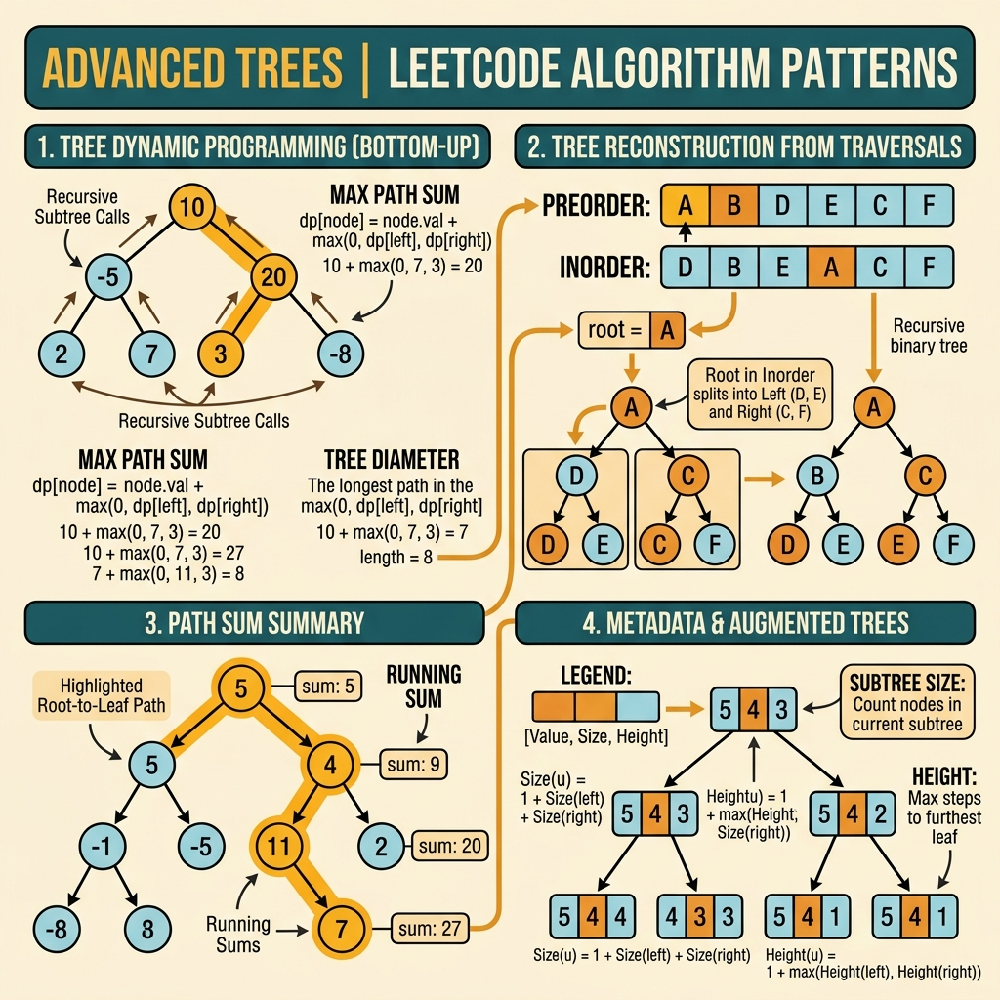

<!-- tags: leetcode, algorithms, coding-interview, tree -->
# 🌲 Advanced Binary Tree

> Construct from traversals, flatten, path sum variants, house robber III — advanced tree techniques

📅 Created: 2026-03-20 · 🔄 Updated: 2026-04-10 · ⏱️ 11 min read

| Aspect         | Detail                                                     |
| -------------- | ---------------------------------------------------------- |
| **Complexity** | O(n) traversal, O(n) construction                          |
| **Use case**   | Tree construction, transformation, aggregation             |
| **Go stdlib**  | `container/list` (BFS queue)                               |
| **LeetCode**   | #105, #106, #114, #199, #337, #437, #450, #530, #572, #968 |

---

### Interview template

> Copy-paste this template when facing this problem type in an interview.

```go
// ── Construct Tree from Preorder + Inorder ───────────────────
var build func(preL, preR, inL, inR int) *TreeNode
inMap := map[int]int{} // value → inorder index
for i, v := range inorder { inMap[v] = i }
build = func(preL, preR, inL, inR int) *TreeNode {
    if preL > preR { return nil }
    root := &TreeNode{Val: preorder[preL]}
    mid := inMap[root.Val]
    leftSize := mid - inL
    root.Left = build(preL+1, preL+leftSize, inL, mid-1)
    root.Right = build(preL+leftSize+1, preR, mid+1, inR)
    return root
}

// ── Tree DP (return multiple values) ─────────────────────────
var dfs func(node *TreeNode) (withNode, withoutNode int)
dfs = func(node *TreeNode) (int, int) {
    if node == nil { return 0, 0 }
    lWith, lWithout := dfs(node.Left)
    rWith, rWithout := dfs(node.Right)
    withNode = node.Val + lWithout + rWithout
    withoutNode = max(lWith, lWithout) + max(rWith, rWithout)
    return withNode, withoutNode
}

// ── Path Sum (any-to-any, prefix sum) ────────────────────────
prefixCount := map[int]int{0: 1}
var dfsPath func(node *TreeNode, curr int) int
dfsPath = func(node *TreeNode, curr int) int {
    if node == nil { return 0 }
    curr += node.Val
    res := prefixCount[curr-target]
    prefixCount[curr]++
    res += dfsPath(node.Left, curr) + dfsPath(node.Right, curr)
    prefixCount[curr]--
    return res
}
```
```typescript
// ── Construct Tree from Preorder + Inorder ───────────────────
const inMap = new Map<number, number>();
for (let i = 0; i < inorder.length; i++) inMap.set(inorder[i], i);
const build = (preL: number, preR: number, inL: number, inR: number): TreeNode | null => {
    if (preL > preR) return null;
    const root = new TreeNode(preorder[preL]);
    const mid = inMap.get(root.val)!;
    const leftSize = mid - inL;
    root.left = build(preL + 1, preL + leftSize, inL, mid - 1);
    root.right = build(preL + leftSize + 1, preR, mid + 1, inR);
    return root;
};

// ── Tree DP (return multiple values) ─────────────────────────
const dfs = (node: TreeNode | null): [number, number] => {
    if (!node) return [0, 0];
    const [lWith, lWithout] = dfs(node.left);
    const [rWith, rWithout] = dfs(node.right);
    const withNode = node.val + lWithout + rWithout;
    const withoutNode = Math.max(lWith, lWithout) + Math.max(rWith, rWithout);
    return [withNode, withoutNode];
};

// ── Path Sum (any-to-any, prefix sum) ────────────────────────
const prefixCount = new Map<number, number>([[0, 1]]);
const dfsPath = (node: TreeNode | null, curr: number): number => {
    if (!node) return 0;
    curr += node.val;
    let res = prefixCount.get(curr - target) ?? 0;
    prefixCount.set(curr, (prefixCount.get(curr) ?? 0) + 1);
    res += dfsPath(node.left, curr) + dfsPath(node.right, curr);
    prefixCount.set(curr, prefixCount.get(curr)! - 1);
    return res;
};
```
```rust
// ── Construct Tree from Preorder + Inorder ───────────────────
use std::collections::HashMap;
let mut in_map = HashMap::new();
for (idx, &value) in inorder.iter().enumerate() {
    in_map.insert(value, idx);
}

// ── Tree DP (return multiple values) ─────────────────────────
fn dfs(node: Option<&Box<TreeNode>>) -> (i32, i32) {
    if let Some(node) = node {
        let (l_with, l_without) = dfs(node.left.as_ref());
        let (r_with, r_without) = dfs(node.right.as_ref());
        let with_node = node.val + l_without + r_without;
        let without_node = l_with.max(l_without) + r_with.max(r_without);
        (with_node, without_node)
    } else {
        (0, 0)
    }
}

// ── Path Sum (any-to-any, prefix sum) ────────────────────────
let mut prefix_count = HashMap::from([(0, 1)]);
```
```cpp
// ── Construct Tree from Preorder + Inorder ───────────────────
std::unordered_map<int, int> inMap;
for (int i = 0; i < static_cast<int>(inorder.size()); ++i) inMap[inorder[i]] = i;
std::function<TreeNode*(int, int, int, int)> build = [&](int preL, int preR, int inL, int inR) -> TreeNode* {
    if (preL > preR) return nullptr;
    TreeNode* root = new TreeNode(preorder[preL]);
    int mid = inMap[root->val];
    int leftSize = mid - inL;
    root->left = build(preL + 1, preL + leftSize, inL, mid - 1);
    root->right = build(preL + leftSize + 1, preR, mid + 1, inR);
    return root;
};

// ── Tree DP (return multiple values) ─────────────────────────
std::function<std::pair<int, int>(TreeNode*)> dfs = [&](TreeNode* node) {
    if (!node) return std::pair<int, int>{0, 0};
    auto [lWith, lWithout] = dfs(node->left);
    auto [rWith, rWithout] = dfs(node->right);
    int withNode = node->val + lWithout + rWithout;
    int withoutNode = std::max(lWith, lWithout) + std::max(rWith, rWithout);
    return std::pair<int, int>{withNode, withoutNode};
};

// ── Path Sum (any-to-any, prefix sum) ────────────────────────
std::unordered_map<int, int> prefixCount{{0, 1}};
```
```python
# ── Construct Tree from Preorder + Inorder ───────────────────
in_map = {value: idx for idx, value in enumerate(inorder)}

def build(pre_l: int, pre_r: int, in_l: int, in_r: int) -> TreeNode | None:
    if pre_l > pre_r:
        return None
    root = TreeNode(preorder[pre_l])
    mid = in_map[root.val]
    left_size = mid - in_l
    root.left = build(pre_l + 1, pre_l + left_size, in_l, mid - 1)
    root.right = build(pre_l + left_size + 1, pre_r, mid + 1, in_r)
    return root

# ── Tree DP (return multiple values) ─────────────────────────
def dfs(node: TreeNode | None) -> tuple[int, int]:
    if not node:
        return 0, 0
    l_with, l_without = dfs(node.left)
    r_with, r_without = dfs(node.right)
    with_node = node.val + l_without + r_without
    without_node = max(l_with, l_without) + max(r_with, r_without)
    return with_node, without_node

# ── Path Sum (any-to-any, prefix sum) ────────────────────────
prefix_count = {0: 1}
```

---

## 1. DEFINE

Imagine you are practicing LeetCode. A problem looks familiar, making you careless. 🌲 Advanced Binary Tree proves useful when it pulls you away from solve-by-memory habits. It forces you to recognize true family signals early.

When tree problems exceed basic traversals, they introduce queries about metadata, reconstruction, ancestors, path contributions, or lazy structures. In the `Advanced Trees` family, each node acts as a summary or decision point impacting the entire subtree.

The difficulty lies in combining information without breaking the global tree invariant. One node returning an incorrect summary corrupts the entire recursion chain. This corruption remains hard to spot.

Core insight: **Advanced tree problems click when you identify the exact summary the node must return to its parent, versus the summary it retains locally.**

| Variant | Trigger | Core Idea |
| ------- | ------- | --------- |
| Tree construction | Build from preorder, inorder, or postorder | Each recursive call owns a strict data segment. |
| Transform / flatten | Flatten tree, convert structure | Correct traversal order prevents node loss or cycles. |
| Tree DP | House Robber III, cameras | Each node returns multiple states for parent selection. |
| Prefix / path aggregation | Path Sum III, subtree sums | State accumulates along a path and rolls back. |

| Approach | Time | Space | Use Case |
| --- | --- | --- | --- |
| Segment recursion | O(n) | O(h) + maps | Data traversal defines strict subtree boundaries. |
| Postorder return contract | O(n) | O(h) | The parent requires aggregated results from its children. |
| Prefix-sum DFS | O(n) | O(h) + maps | The path can originate at any ancestor node. |
| Multi-state tree DP | O(n) | O(h) | Each node has multiple interacting decisions with children. |

### 1.1 Quick recognition

- The problem demands tree construction from traversals, flattening, path sums, tree DP, advanced LCA, BST transforms, or camera covers.
- Basic traversal fails. You need metadata, reconstruction maps, or multiple return states.
- The node must contribute to a global answer while returning a distinct value upward. This indicates advanced tree territory.

### 1.2 Invariants & Failure Modes

- Every node must strictly separate its upward return summary from its local optimal answer.
- Reconstructions and transformations remain safe only when you manage subtree boundaries tightly.
- Common failure mode: mixing the global answer with the return value. The recursion looks logical but carries completely flawed semantics.

## 2. VISUAL

Advanced tree problems expand from traversals to tree DP, reconstruction, and metadata queries. The image below categorizes four sub-families.

### Overview — Advanced Trees



*Figure: Advanced trees involve DP on tree structures. Each node combines results from its subtrees.*

### Level 1 — Core intuition

```text
Construct from preorder + inorder
preorder gives root first
inorder splits left subtree | root | right subtree

Tree DP
node returns:
- withNode    = take this node
- withoutNode = skip this node
```

*Caption*: Level 1 illustrates the two primary contracts in advanced trees. You allocate correct segments to subtrees and return multiple states to parents.

### Level 2 — Detailed decision trace

- Building trees from traversals succeeds when recursive calls receive precise boundaries.
- Flattening and transforming trees require true preorder or postorder sequences. An incorrect traversal breaks root links.
- House Robber III represents classic tree DP. The parent must evaluate both picking and skipping the child.
- Path Sum III requires prefix state tracking along the root-to-node path. It demands rollback upon exit.

The tree structure dictates the traversal order. The code implements construction, flattening, or paths. Construction order determines structural correctness.

## 3. CODE

Once you lock the semantic return value, advanced tree code loses its mystery. We move from reconstruction and path sums to heavy tree DP and structural transforms.

### Problem 1: Basic — Construct Tree & Flatten [LC #105, #114]
> **Objective**: Solve two construction and transformation problems using clear recursion contracts.
> **Approach**: Use an index map for inorder splits. Use controlled traversal to flatten the tree into a linked list.
> **Example**: Given preorder and inorder arrays, reconstruct the tree. Flatten a binary tree using preorder logic.
> **Complexity**: O(n) time, O(h) recursion stack space plus maps.

```go
// leetcode/advanced_tree_basic.go
package leetcode

type TreeNode struct {
    Val   int
    Left  *TreeNode
    Right *TreeNode
}

// ✅ LC #105: Construct Binary Tree from Preorder and Inorder
// Preorder first = root, inorder splits left/right subtrees
// Time: O(n), Space: O(n) (hashmap + recursion)
func buildTree(preorder, inorder []int) *TreeNode {
    // ✅ HashMap for O(1) inorder index lookup
    inorderIdx := make(map[int]int)
    for i, val := range inorder {
        inorderIdx[val] = i
    }

    preIdx := 0

    var build func(inStart, inEnd int) *TreeNode
    build = func(inStart, inEnd int) *TreeNode {
        if inStart > inEnd {
            return nil
        }

        rootVal := preorder[preIdx]
        preIdx++

        root := &TreeNode{Val: rootVal}
        mid := inorderIdx[rootVal] // ✅ Split point in inorder

        root.Left = build(inStart, mid-1)   // ✅ Left subtree
        root.Right = build(mid+1, inEnd)     // ✅ Right subtree

        return root
    }

    return build(0, len(inorder)-1)
}

// ✅ LC #106: Construct from Inorder and Postorder
// Same idea but postorder LAST = root, build right FIRST
// Time: O(n), Space: O(n)
func buildTreeInPost(inorder, postorder []int) *TreeNode {
    inorderIdx := make(map[int]int)
    for i, val := range inorder {
        inorderIdx[val] = i
    }

    postIdx := len(postorder) - 1

    var build func(inStart, inEnd int) *TreeNode
    build = func(inStart, inEnd int) *TreeNode {
        if inStart > inEnd {
            return nil
        }

        rootVal := postorder[postIdx]
        postIdx--

        root := &TreeNode{Val: rootVal}
        mid := inorderIdx[rootVal]

        root.Right = build(mid+1, inEnd)    // ⚠️ Right FIRST (postorder reverse)
        root.Left = build(inStart, mid-1)

        return root
    }

    return build(0, len(inorder)-1)
}

// ✅ LC #114: Flatten Binary Tree to Linked List (in-place)
// Preorder traversal → right pointers only
// Time: O(n), Space: O(1) — Morris-like approach
func flatten(root *TreeNode) {
    curr := root

    for curr != nil {
        if curr.Left != nil {
            // ✅ Find rightmost of left subtree
            rightmost := curr.Left
            for rightmost.Right != nil {
                rightmost = rightmost.Right
            }

            // ✅ Attach right subtree to rightmost
            rightmost.Right = curr.Right
            // ✅ Move left subtree to right
            curr.Right = curr.Left
            curr.Left = nil
        }
        curr = curr.Right
    }
}
```
```typescript
// leetcode/advanced_tree_basic.ts
class TreeNode {
    constructor(
        public val: number,
        public left: TreeNode | null = null,
        public right: TreeNode | null = null,
    ) {}
}

export function buildTree(preorder: number[], inorder: number[]): TreeNode | null {
    const index = new Map<number, number>();
    for (let i = 0; i < inorder.length; i++) index.set(inorder[i], i);
    let preIdx = 0;
    const build = (l: number, r: number): TreeNode | null => {
        if (l > r) return null;
        const rootVal = preorder[preIdx++];
        const root = new TreeNode(rootVal);
        const mid = index.get(rootVal)!;
        root.left = build(l, mid - 1);
        root.right = build(mid + 1, r);
        return root;
    };
    return build(0, inorder.length - 1);
}

export function buildTreeInPost(inorder: number[], postorder: number[]): TreeNode | null {
    const index = new Map<number, number>();
    for (let i = 0; i < inorder.length; i++) index.set(inorder[i], i);
    let postIdx = postorder.length - 1;
    const build = (l: number, r: number): TreeNode | null => {
        if (l > r) return null;
        const rootVal = postorder[postIdx--];
        const root = new TreeNode(rootVal);
        const mid = index.get(rootVal)!;
        root.right = build(mid + 1, r);
        root.left = build(l, mid - 1);
        return root;
    };
    return build(0, inorder.length - 1);
}

export function flatten(root: TreeNode | null): void {
    let curr = root;
    while (curr) {
        if (curr.left) {
            let rightmost = curr.left;
            while (rightmost.right) rightmost = rightmost.right;
            rightmost.right = curr.right;
            curr.right = curr.left;
            curr.left = null;
        }
        curr = curr.right;
    }
}
```
```rust
// leetcode/advanced_tree_basic.rs
use std::collections::HashMap;

#[derive(Debug, Clone)]
pub struct TreeNode {
    pub val: i32,
    pub left: Option<Box<TreeNode>>,
    pub right: Option<Box<TreeNode>>,
}

pub fn build_tree(preorder: Vec<i32>, inorder: Vec<i32>) -> Option<Box<TreeNode>> {
    let mut index = HashMap::new();
    for (i, &v) in inorder.iter().enumerate() {
        index.insert(v, i);
    }
    fn build(
        preorder: &[i32],
        index: &HashMap<i32, usize>,
        pre_idx: &mut usize,
        l: usize,
        r: usize,
    ) -> Option<Box<TreeNode>> {
        if l > r {
            return None;
        }
        let root_val = preorder[*pre_idx];
        *pre_idx += 1;
        let mid = index[&root_val];
        let left = if mid == 0 { None } else { build(preorder, index, pre_idx, l, mid - 1) };
        let right = build(preorder, index, pre_idx, mid + 1, r);
        Some(Box::new(TreeNode { val: root_val, left, right }))
    }
    if inorder.is_empty() { None } else { build(&preorder, &index, &mut 0, 0, inorder.len() - 1) }
}

pub fn flatten(root: &mut Option<Box<TreeNode>>) {
    let mut values = Vec::new();
    fn preorder(node: &Option<Box<TreeNode>>, values: &mut Vec<i32>) {
        if let Some(node) = node {
            values.push(node.val);
            preorder(&node.left, values);
            preorder(&node.right, values);
        }
    }
    preorder(root, &mut values);
    let mut current = None;
    for val in values.into_iter().rev() {
        current = Some(Box::new(TreeNode { val, left: None, right: current }));
    }
    *root = current;
}
```
```cpp
// leetcode/advanced_tree_basic.cpp
struct TreeNode {
    int val;
    TreeNode* left;
    TreeNode* right;
    TreeNode(int x) : val(x), left(nullptr), right(nullptr) {}
};

TreeNode* buildTree(std::vector<int>& preorder, std::vector<int>& inorder) {
    std::unordered_map<int, int> index;
    for (int i = 0; i < static_cast<int>(inorder.size()); ++i) index[inorder[i]] = i;
    int preIdx = 0;
    std::function<TreeNode*(int, int)> build = [&](int l, int r) -> TreeNode* {
        if (l > r) return nullptr;
        int rootVal = preorder[preIdx++];
        TreeNode* root = new TreeNode(rootVal);
        int mid = index[rootVal];
        root->left = build(l, mid - 1);
        root->right = build(mid + 1, r);
        return root;
    };
    return build(0, static_cast<int>(inorder.size()) - 1);
}

void flatten(TreeNode* root) {
    TreeNode* curr = root;
    while (curr) {
        if (curr->left) {
            TreeNode* rightmost = curr->left;
            while (rightmost->right) rightmost = rightmost->right;
            rightmost->right = curr->right;
            curr->right = curr->left;
            curr->left = nullptr;
        }
        curr = curr->right;
    }
}
```
```python
# leetcode/advanced_tree_basic.py
class TreeNode:
    def __init__(self, val: int = 0, left: "TreeNode | None" = None, right: "TreeNode | None" = None) -> None:
        self.val = val
        self.left = left
        self.right = right

def build_tree(preorder: list[int], inorder: list[int]) -> TreeNode | None:
    index = {value: idx for idx, value in enumerate(inorder)}
    pre_idx = 0

    def build(l: int, r: int) -> TreeNode | None:
        nonlocal pre_idx
        if l > r:
            return None
        root_val = preorder[pre_idx]
        pre_idx += 1
        root = TreeNode(root_val)
        mid = index[root_val]
        root.left = build(l, mid - 1)
        root.right = build(mid + 1, r)
        return root

    return build(0, len(inorder) - 1)

def flatten(root: TreeNode | None) -> None:
    curr = root
    while curr:
        if curr.left:
            rightmost = curr.left
            while rightmost.right:
                rightmost = rightmost.right
            rightmost.right = curr.right
            curr.right = curr.left
            curr.left = None
        curr = curr.right
```

> **Why?** The Basic group proves advanced trees rely on strict recursion contracts, not tricks. Construction succeeds when each call owns the correct segment. Flattening succeeds when you sequence subtree attachments properly.

> **Conclusion**: This **Basic** example demonstrates `Construct Tree & Flatten [LC #105, #114]` without skipping reasoning steps. If constraints shift or require heavy optimization, move to the next example.

> **✅ Achieved**: Build tree in O(n) time, flatten to linked list in O(1) space.
> **⚠️ Caveat**: LC #106 requires building the RIGHT subtree FIRST because postorder acts as reversed preorder.

---
### Problem 2: Intermediate — Path Sum III & BST Delete [LC #437, #450]
> **Objective**: Combine prefix path state with structured tree mutations.
> **Approach**: Use a prefix-sum hash map for arbitrary paths. Delete BST nodes using child count case analysis.
> **Example**: Find paths matching a target sum. Delete a BST node while maintaining strict ordering invariants.
> **Complexity**: O(n) time or O(h) per mutation, O(h) plus map space.

```go
// leetcode/advanced_tree_intermediate.go
package leetcode

// ✅ LC #437: Path Sum III
// Count paths with sum = targetSum (start from ANY node)
// Pattern: Prefix sum + HashMap on tree paths (like subarray sum = k)
// Time: O(n), Space: O(n)
func pathSumIII(root *TreeNode, targetSum int) int {
    prefixCount := map[int]int{0: 1} // ✅ Empty prefix
    count := 0

    var dfs func(node *TreeNode, currSum int)
    dfs = func(node *TreeNode, currSum int) {
        if node == nil {
            return
        }

        currSum += node.Val

        // ✅ How many paths ending here have sum = targetSum?
        if c, ok := prefixCount[currSum-targetSum]; ok {
            count += c
        }

        prefixCount[currSum]++
        dfs(node.Left, currSum)
        dfs(node.Right, currSum)
        prefixCount[currSum]-- // ✅ Backtrack when leaving this path
    }

    dfs(root, 0)
    return count
}

// ✅ LC #450: Delete Node in a BST
// Find node → handle 3 cases: leaf, 1 child, 2 children
// Time: O(h), Space: O(h)
func deleteNode(root *TreeNode, key int) *TreeNode {
    if root == nil {
        return nil
    }

    if key < root.Val {
        root.Left = deleteNode(root.Left, key)
    } else if key > root.Val {
        root.Right = deleteNode(root.Right, key)
    } else {
        // ✅ Found node to delete
        if root.Left == nil {
            return root.Right // Case 1 & 2: no left child
        }
        if root.Right == nil {
            return root.Left // Case 2: no right child
        }

        // ✅ Case 3: Two children → replace with inorder successor
        successor := root.Right
        for successor.Left != nil {
            successor = successor.Left
        }
        root.Val = successor.Val                           // ✅ Copy successor value
        root.Right = deleteNode(root.Right, successor.Val) // ✅ Delete successor
    }

    return root
}

// ✅ LC #538: Convert BST to Greater Tree
// Reverse inorder traversal (right → root → left)
// Accumulated sum = all values >= current
// Time: O(n), Space: O(n) stack
func convertBST(root *TreeNode) *TreeNode {
    sum := 0

    var reverseInorder func(node *TreeNode)
    reverseInorder = func(node *TreeNode) {
        if node == nil {
            return
        }
        reverseInorder(node.Right) // ✅ Visit larger values first
        sum += node.Val
        node.Val = sum             // ✅ Replace with accumulated sum
        reverseInorder(node.Left)
    }

    reverseInorder(root)
    return root
}
```
```typescript
// leetcode/advanced_tree_intermediate.ts
export function pathSumIII(root: TreeNode | null, targetSum: number): number {
    const prefix = new Map<number, number>([[0, 1]]);
    let count = 0;
    const dfs = (node: TreeNode | null, curr: number) => {
        if (!node) return;
        curr += node.val;
        count += prefix.get(curr - targetSum) ?? 0;
        prefix.set(curr, (prefix.get(curr) ?? 0) + 1);
        dfs(node.left, curr);
        dfs(node.right, curr);
        prefix.set(curr, prefix.get(curr)! - 1);
    };
    dfs(root, 0);
    return count;
}

export function deleteNode(root: TreeNode | null, key: number): TreeNode | null {
    if (!root) return null;
    if (key < root.val) root.left = deleteNode(root.left, key);
    else if (key > root.val) root.right = deleteNode(root.right, key);
    else {
        if (!root.left) return root.right;
        if (!root.right) return root.left;
        let successor = root.right;
        while (successor.left) successor = successor.left;
        root.val = successor.val;
        root.right = deleteNode(root.right, successor.val);
    }
    return root;
}

export function convertBST(root: TreeNode | null): TreeNode | null {
    let sum = 0;
    const walk = (node: TreeNode | null) => {
        if (!node) return;
        walk(node.right);
        sum += node.val;
        node.val = sum;
        walk(node.left);
    };
    walk(root);
    return root;
}
```
```rust
// leetcode/advanced_tree_intermediate.rs
use std::collections::HashMap;

pub fn path_sum_iii(root: &Option<Box<TreeNode>>, target_sum: i32) -> i32 {
    fn dfs(node: &Option<Box<TreeNode>>, curr: i32, target: i32, prefix: &mut HashMap<i32, i32>, count: &mut i32) {
        if let Some(node) = node {
            let curr = curr + node.val;
            *count += prefix.get(&(curr - target)).copied().unwrap_or(0);
            *prefix.entry(curr).or_insert(0) += 1;
            dfs(&node.left, curr, target, prefix, count);
            dfs(&node.right, curr, target, prefix, count);
            *prefix.get_mut(&curr).unwrap() -= 1;
        }
    }
    let mut prefix = HashMap::from([(0, 1)]);
    let mut count = 0;
    dfs(root, 0, target_sum, &mut prefix, &mut count);
    count
}

pub fn convert_bst(root: &mut Option<Box<TreeNode>>) {
    fn walk(node: &mut Option<Box<TreeNode>>, sum: &mut i32) {
        if let Some(node) = node {
            walk(&mut node.right, sum);
            *sum += node.val;
            node.val = *sum;
            walk(&mut node.left, sum);
        }
    }
    walk(root, &mut 0);
}
```
```cpp
// leetcode/advanced_tree_intermediate.cpp
int pathSumIII(TreeNode* root, int targetSum) {
    std::unordered_map<long long, int> prefix{{0, 1}};
    std::function<int(TreeNode*, long long)> dfs = [&](TreeNode* node, long long curr) {
        if (!node) return 0;
        curr += node->val;
        int count = prefix[curr - targetSum];
        ++prefix[curr];
        count += dfs(node->left, curr) + dfs(node->right, curr);
        --prefix[curr];
        return count;
    };
    return dfs(root, 0);
}

TreeNode* deleteNode(TreeNode* root, int key) {
    if (!root) return nullptr;
    if (key < root->val) root->left = deleteNode(root->left, key);
    else if (key > root->val) root->right = deleteNode(root->right, key);
    else {
        if (!root->left) return root->right;
        if (!root->right) return root->left;
        TreeNode* successor = root->right;
        while (successor->left) successor = successor->left;
        root->val = successor->val;
        root->right = deleteNode(root->right, successor->val);
    }
    return root;
}
```
```python
# leetcode/advanced_tree_intermediate.py
def path_sum_iii(root: TreeNode | None, target_sum: int) -> int:
    prefix = {0: 1}
    count = 0

    def dfs(node: TreeNode | None, curr: int) -> None:
        nonlocal count
        if not node:
            return
        curr += node.val
        count += prefix.get(curr - target_sum, 0)
        prefix[curr] = prefix.get(curr, 0) + 1
        dfs(node.left, curr)
        dfs(node.right, curr)
        prefix[curr] -= 1

    dfs(root, 0)
    return count

def delete_node(root: TreeNode | None, key: int) -> TreeNode | None:
    if not root:
        return None
    if key < root.val:
        root.left = delete_node(root.left, key)
    elif key > root.val:
        root.right = delete_node(root.right, key)
    else:
        if not root.left:
            return root.right
        if not root.right:
            return root.left
        successor = root.right
        while successor.left:
            successor = successor.left
        root.val = successor.val
        root.right = delete_node(root.right, successor.val)
    return root
```

> **Why?** The Intermediate level introduces state that moves beyond simple bottom-up propagation. Path Sum III requires path information from the root and exact backtracking. BST deletion maintains ordering invariants while replacing successors or predecessors.

> **Conclusion**: This **Intermediate** example demonstrates `Path Sum III & BST Delete [LC #437, #450]` without skipping reasoning steps. If constraints shift or require heavy optimization, move to the next example.

> **✅ Achieved**: Path sum prefix trick in O(n) time, BST delete in O(h) time, BST to Greater tree in O(n) time.
> **⚠️ Caveat**: Path Sum III requires prefix sum backtracking when exiting the path. This differs from array prefix sums.

---
### Problem 3: Advanced — House Robber III & Binary Tree Cameras [LC #337, #968]
> **Objective**: Solve multi-state tree DP problems where nodes return options for parent decisions.
> **Approach**: Use postorder tree DP with a tuple or multi-state return contract.
> **Example**: Maximize stolen value without picking adjacent nodes. Place the minimum cameras to cover all nodes.
> **Complexity**: O(n) time, O(h) space.

```go
// leetcode/advanced_tree_hard.go
package leetcode

// ✅ LC #337: House Robber III
// Tree DP: each node → (rob this node, skip this node)
// If rob parent → can't rob children
// Time: O(n), Space: O(h) stack
func robTree(root *TreeNode) int {
    // Returns (robbed, notRobbed)
    var dfs func(node *TreeNode) (int, int)
    dfs = func(node *TreeNode) (int, int) {
        if node == nil {
            return 0, 0
        }

        leftRob, leftSkip := dfs(node.Left)
        rightRob, rightSkip := dfs(node.Right)

        // ✅ Rob this node → can't rob children
        robThis := node.Val + leftSkip + rightSkip

        // ✅ Skip this node → can rob or skip children (take max)
        skipThis := max2(leftRob, leftSkip) + max2(rightRob, rightSkip)

        return robThis, skipThis
    }

    rob, skip := dfs(root)
    return max2(rob, skip)
}

// ✅ LC #968: Binary Tree Cameras (HARD)
// Tree DP with 3 states:
//   0 = NOT monitored (needs camera from parent)
//   1 = HAS camera
//   2 = MONITORED (by child camera, no camera here)
// Greedy: place cameras as high as possible (at parent of leaf)
// Time: O(n), Space: O(h)
func minCameraCover(root *TreeNode) int {
    cameras := 0

    // Returns: 0=not monitored, 1=has camera, 2=monitored
    var dfs func(node *TreeNode) int
    dfs = func(node *TreeNode) int {
        if node == nil {
            return 2 // ✅ null = monitored (don't need camera)
        }

        left := dfs(node.Left)
        right := dfs(node.Right)

        // ✅ If any child not monitored → MUST place camera here
        if left == 0 || right == 0 {
            cameras++
            return 1 // Has camera
        }

        // ✅ If any child has camera → this node is monitored
        if left == 1 || right == 1 {
            return 2 // Monitored
        }

        // ✅ Both children monitored, no cameras → not monitored
        return 0 // Need parent to place camera
    }

    if dfs(root) == 0 {
        cameras++ // ✅ Root not monitored → place camera at root
    }

    return cameras
}

func max2(a, b int) int {
    if a > b {
        return a
    }
    return b
}
```
```typescript
// leetcode/advanced_tree_hard.ts
export function robTree(root: TreeNode | null): number {
    const dfs = (node: TreeNode | null): [number, number] => {
        if (!node) return [0, 0];
        const [leftRob, leftSkip] = dfs(node.left);
        const [rightRob, rightSkip] = dfs(node.right);
        const robThis = node.val + leftSkip + rightSkip;
        const skipThis = Math.max(leftRob, leftSkip) + Math.max(rightRob, rightSkip);
        return [robThis, skipThis];
    };
    const [rob, skip] = dfs(root);
    return Math.max(rob, skip);
}

export function minCameraCover(root: TreeNode | null): number {
    let cameras = 0;
    const dfs = (node: TreeNode | null): number => {
        if (!node) return 2;
        const left = dfs(node.left);
        const right = dfs(node.right);
        if (left === 0 || right === 0) {
            cameras++;
            return 1;
        }
        if (left === 1 || right === 1) return 2;
        return 0;
    };
    if (dfs(root) === 0) cameras++;
    return cameras;
}
```
```rust
// leetcode/advanced_tree_hard.rs
pub fn rob_tree(root: &Option<Box<TreeNode>>) -> i32 {
    fn dfs(node: &Option<Box<TreeNode>>) -> (i32, i32) {
        if let Some(node) = node {
            let (left_rob, left_skip) = dfs(&node.left);
            let (right_rob, right_skip) = dfs(&node.right);
            let rob_this = node.val + left_skip + right_skip;
            let skip_this = left_rob.max(left_skip) + right_rob.max(right_skip);
            (rob_this, skip_this)
        } else {
            (0, 0)
        }
    }
    let (rob, skip) = dfs(root);
    rob.max(skip)
}

pub fn min_camera_cover(root: &Option<Box<TreeNode>>) -> i32 {
    fn dfs(node: &Option<Box<TreeNode>>, cameras: &mut i32) -> i32 {
        if node.is_none() {
            return 2;
        }
        let node = node.as_ref().unwrap();
        let left = dfs(&node.left, cameras);
        let right = dfs(&node.right, cameras);
        if left == 0 || right == 0 {
            *cameras += 1;
            1
        } else if left == 1 || right == 1 {
            2
        } else {
            0
        }
    }
    let mut cameras = 0;
    if dfs(root, &mut cameras) == 0 {
        cameras += 1;
    }
    cameras
}
```
```cpp
// leetcode/advanced_tree_hard.cpp
int robTree(TreeNode* root) {
    std::function<std::pair<int, int>(TreeNode*)> dfs = [&](TreeNode* node) {
        if (!node) return std::pair<int, int>{0, 0};
        auto [leftRob, leftSkip] = dfs(node->left);
        auto [rightRob, rightSkip] = dfs(node->right);
        int robThis = node->val + leftSkip + rightSkip;
        int skipThis = std::max(leftRob, leftSkip) + std::max(rightRob, rightSkip);
        return std::pair<int, int>{robThis, skipThis};
    };
    auto [rob, skip] = dfs(root);
    return std::max(rob, skip);
}

int minCameraCover(TreeNode* root) {
    int cameras = 0;
    std::function<int(TreeNode*)> dfs = [&](TreeNode* node) {
        if (!node) return 2;
        int left = dfs(node->left);
        int right = dfs(node->right);
        if (left == 0 || right == 0) {
            ++cameras;
            return 1;
        }
        if (left == 1 || right == 1) return 2;
        return 0;
    };
    if (dfs(root) == 0) ++cameras;
    return cameras;
}
```
```python
# leetcode/advanced_tree_hard.py
def rob_tree(root: TreeNode | None) -> int:
    def dfs(node: TreeNode | None) -> tuple[int, int]:
        if not node:
            return 0, 0
        left_rob, left_skip = dfs(node.left)
        right_rob, right_skip = dfs(node.right)
        rob_this = node.val + left_skip + right_skip
        skip_this = max(left_rob, left_skip) + max(right_rob, right_skip)
        return rob_this, skip_this

    rob, skip = dfs(root)
    return max(rob, skip)

def min_camera_cover(root: TreeNode | None) -> int:
    cameras = 0

    def dfs(node: TreeNode | None) -> int:
        nonlocal cameras
        if not node:
            return 2
        left = dfs(node.left)
        right = dfs(node.right)
        if left == 0 or right == 0:
            cameras += 1
            return 1
        if left == 1 or right == 1:
            return 2
        return 0

    if dfs(root) == 0:
        cameras += 1
    return cameras
```

> **Why?** This Advanced group exemplifies tree DP. A single return value fails. The parent needs multiple child states to make optimal global decisions. Forcing everything into one number destroys critical transition information.

> **Conclusion**: This **Advanced** example demonstrates `House Robber III & Binary Tree Cameras [LC #337, #968]` without skipping reasoning steps. If constraints shift or require heavy optimization, move to the next example.

> **✅ Achieved**: House Robber III via 2-state tree DP. Binary Tree Cameras via 3-state greedy DP.
> **⚠️ Caveat**: Tree Cameras use a bottom-up greedy approach. You place cameras at the parents of leaves.

---
Recursive advanced tree code looks elegant. However, superficial correctness often causes large tree test failures. This happens frequently with builds and flattens.

## 4. PITFALLS

Failures in this family stem from mixing summaries with final answers or mismanaging subtree boundaries.

| # | Severity | Defect | Consequence | Fix |
|---|----------|--------|-------------|-----|
| 1 | High | Build tree uses O(n) array searches. | — | Use a HashMap for O(1) lookups. |
| 2 | High | Build from postorder constructs the left side first. | — | Postorder mandates building the RIGHT side first. |
| 3 | High | Flatten overwrites and loses the right subtree. | — | Save the right subtree BEFORE overwriting pointers. |
| 4 | High | Path Sum III forgets to backtrack the prefix. | — | Apply `prefixCount[sum]--` when exiting the node. |
| 5 | High | BST delete forgets to delete the successor. | — | Copy the value, then recursively delete the successor. |
| 6 | High | Tree cameras treat nulls as unmonitored. | — | Null MUST return monitored. Nulls require no cameras. |

### 🔴 Pitfall #1 — Build tree from postorder: build LEFT first

Building a tree from inorder and postorder arrays:

```go
func build(postorder, inorder []int) *TreeNode {
    root := &TreeNode{Val: postorder[len(postorder)-1]}
    idx := indexOf(inorder, root.Val)
    root.Left = build(postorder[:idx], inorder[:idx])      // ← build left first
    root.Right = build(postorder[idx:len(postorder)-1], inorder[idx+1:])
    return root
}
```

Postorder sequence is Left, Right, Root. When popping from the end, the root emerges first, followed by the RIGHT subtree, then the LEFT. If you build the left side first, you consume elements meant for the right subtree. The resulting tree fails.

**Fix**: Build the RIGHT subtree before the LEFT when using postorder logic. Alternatively, use a global pointer and decrement it.

---

## 5. REF

| Resource | Link |
| -------- | ---- |
| LC #105 Build Tree | [leetcode.com/problems/construct-binary-tree-from-preorder-and-inorder-traversal](https://leetcode.com/problems/construct-binary-tree-from-preorder-and-inorder-traversal/) |
| LC #337 House Robber III | [leetcode.com/problems/house-robber-iii](https://leetcode.com/problems/house-robber-iii/) |
| LC #437 Path Sum III | [leetcode.com/problems/path-sum-iii](https://leetcode.com/problems/path-sum-iii/) |
| LC #968 Binary Tree Cameras | [leetcode.com/problems/binary-tree-cameras](https://leetcode.com/problems/binary-tree-cameras/) |

---

## 6. RECOMMEND

Once you master carrying metadata, multiple returns, and reconstruction logic, split your focus. Determine which problems require tree-specific reasoning, which belong in string-specialized tries, and which demand a return to basic traversals.

| Extension | Trigger | Rationale | File/Link |
| --------- | ------- | --------- | --------- |
| Tree Traversal | Baseline traversal required | Secures DFS and BFS foundations | [05-tree-traversal](./05-tree-traversal.md) |
| Dynamic Programming | Expanded tree DP | Explores general DP on tree structures | [07-dynamic-programming](./07-dynamic-programming.md) |
| Graph BFS/DFS | Tree acts as a graph subset | Expands concepts to general graphs | [06-graph-bfs-dfs](./06-graph-bfs-dfs.md) |
| Trie | Prefix tree requirements | Handles string-specific tree patterns | [12-trie](./12-trie.md) |

---

## 7. QUICK REF

| Situation / Signal | Pattern / Approach | Complexity | Use Case | Caveat |
|--------------------|--------------------|------------|----------|----------|
| Max path sum or diameter | Tree DP returning bottom-up global state | O(n) time, O(h) space | Path through root or subtree | Return one branch upward, update global with both. |
| Construct from traversals | Recursive split using root values | O(n) time, O(n) space | Build from preorder and inorder | Use HashMap for O(1) root lookups. |
| LCA in binary tree | DFS returns node upon finding targets | O(n) time, O(h) space | Lowest common ancestor searches | Null means missing. Non-null means found. |
| Tree diameter or width | DFS computes height and updates global max | O(n) time, O(h) space | Diameter equals max left plus max right | Diameter rarely equals depth multiplied by two. |
| Check balanced or symmetric | DFS returns height and validates state | O(n) time, O(h) space | AVL checks, mirror checks | Return -1 to flag an unbalanced subtree. |

---

Return to the "reconstruct tree" opening problem. Now you know that advanced trees do not hide difficulty in recursion. The difficulty lies in prefix management, build order, and global state tracking.

---

**Links**: [← Array Techniques](./21-array-techniques.md) · [→ DP Sequences](./23-dp-sequences.md)
