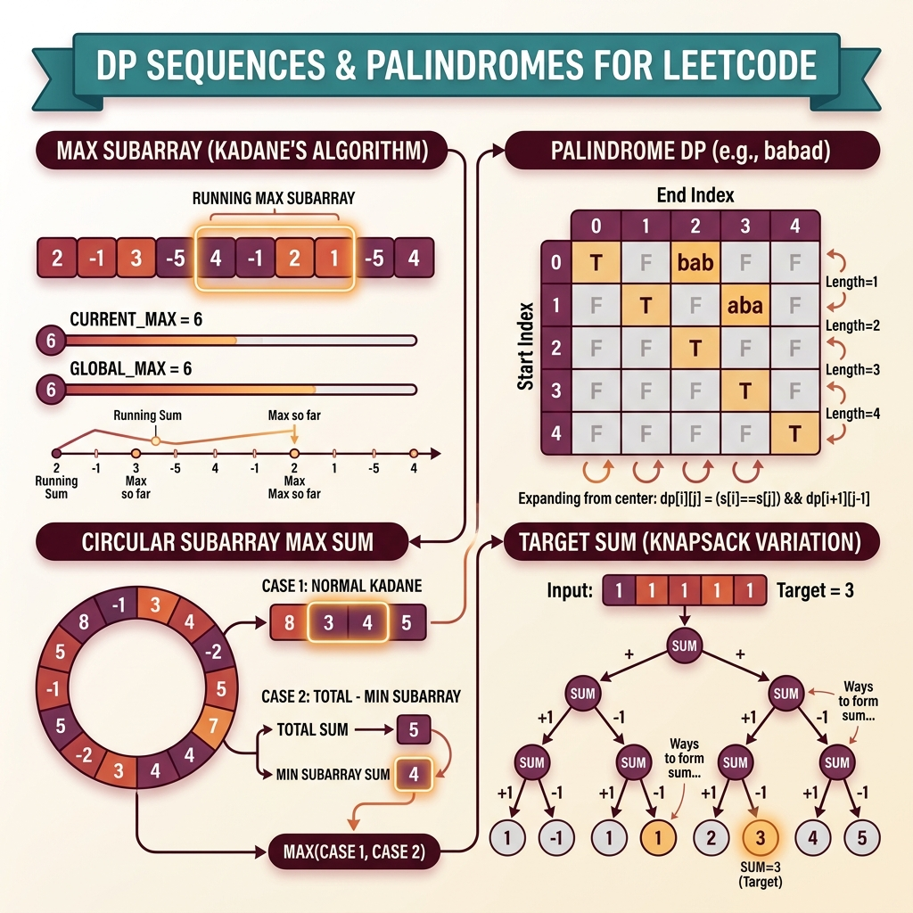

<!-- tags: leetcode, algorithms, coding-interview, dynamic-programming -->
# 📐 DP Sequences & Palindromes

> Palindromic subsequence, target sum, decode ways II, maximum subarray, house robber series — linear and circular DP.

📅 Created: 2026-03-20 · 🔄 Updated: 2026-04-10 · ⏱️ 11 min read

| Aspect         | Detail                                             |
| -------------- | -------------------------------------------------- |
| **Complexity** | O(n²) palindrome, O(n) sequences                   |
| **Use case**   | Subsequences, circular arrays, target sum counting |
| **Go stdlib**  | `math.MaxInt32`                                    |
| **LeetCode**   | #53, #152, #213, #377, #494, #516, #647, #918      |

---

### Interview template

> Copy-paste this template during interviews.

```go
// ── Kadane's (Max Subarray) ───────────────────────────────────
currMax, globalMax := nums[0], nums[0]
for _, n := range nums[1:] {
    if currMax < 0 { currMax = n } else { currMax += n }
    if currMax > globalMax { globalMax = currMax }
}

// ── Max Product (track min too) ───────────────────────────────
maxP, minP, res := nums[0], nums[0], nums[0]
for _, n := range nums[1:] {
    maxP, minP = max(n, max(maxP*n, minP*n)), min(n, min(maxP*n, minP*n))
    if maxP > res { res = maxP }
}

// ── House Robber (circular) ───────────────────────────────────
rob := func(arr []int) int {
    prev, curr := 0, 0
    for _, v := range arr { prev, curr = curr, max(curr, prev+v) }
    return curr
}
ans := max(rob(nums[1:]), rob(nums[:len(nums)-1]))

// ── Palindrome DP ─────────────────────────────────────────────
dp := make([][]bool, n) // dp[i][j] = is s[i..j] palindrome
for i := range dp { dp[i] = make([]bool, n); dp[i][i] = true }
for length := 2; length <= n; length++ {
    for i := 0; i+length-1 < n; i++ {
        j := i + length - 1
        if s[i] == s[j] && (length == 2 || dp[i+1][j-1]) { dp[i][j] = true }
    }
}
```
```typescript
// ── Kadane's (Max Subarray) ───────────────────────────────────
let currMax = nums[0];
let globalMax = nums[0];
for (const num of nums.slice(1)) {
    currMax = currMax < 0 ? num : currMax + num;
    globalMax = Math.max(globalMax, currMax);
}

// ── Max Product (track min too) ───────────────────────────────
let maxP = nums[0];
let minP = nums[0];
let res = nums[0];
for (const num of nums.slice(1)) {
    const candidates = [num, maxP * num, minP * num];
    maxP = Math.max(...candidates);
    minP = Math.min(...candidates);
    res = Math.max(res, maxP);
}

// ── House Robber (circular) ───────────────────────────────────
const rob = (arr: number[]): number => {
    let prev = 0;
    let curr = 0;
    for (const value of arr) [prev, curr] = [curr, Math.max(curr, prev + value)];
    return curr;
};
const answer = Math.max(rob(nums.slice(1)), rob(nums.slice(0, nums.length - 1)));

// ── Palindrome DP ─────────────────────────────────────────────
const dp = Array.from({ length: n }, () => Array.from({ length: n }, () => false));
for (let i = 0; i < n; i++) dp[i][i] = true;
for (let length = 2; length <= n; length++) {
    for (let i = 0; i + length - 1 < n; i++) {
        const j = i + length - 1;
        if (s[i] === s[j] && (length === 2 || dp[i + 1][j - 1])) dp[i][j] = true;
    }
}
```
```rust
// ── Kadane's (Max Subarray) ───────────────────────────────────
let (mut curr_max, mut global_max) = (nums[0], nums[0]);
for &num in nums.iter().skip(1) {
    curr_max = if curr_max < 0 { num } else { curr_max + num };
    global_max = global_max.max(curr_max);
}

// ── Max Product (track min too) ───────────────────────────────
let (mut max_p, mut min_p, mut res) = (nums[0], nums[0], nums[0]);
for &num in nums.iter().skip(1) {
    let candidates = [num, max_p * num, min_p * num];
    max_p = *candidates.iter().max().unwrap();
    min_p = *candidates.iter().min().unwrap();
    res = res.max(max_p);
}

// ── House Robber (circular) ───────────────────────────────────
let rob = |arr: &[i32]| -> i32 {
    let (mut prev, mut curr) = (0, 0);
    for &value in arr {
        let next = curr.max(prev + value);
        prev = curr;
        curr = next;
    }
    curr
};
let answer = rob(&nums[1..]).max(rob(&nums[..nums.len() - 1]));

// ── Palindrome DP ─────────────────────────────────────────────
let mut dp = vec![vec![false; n]; n];
for i in 0..n {
    dp[i][i] = true;
}
for length in 2..=n {
    for i in 0..=n - length {
        let j = i + length - 1;
        if s[i] == s[j] && (length == 2 || dp[i + 1][j - 1]) {
            dp[i][j] = true;
        }
    }
}
```
```cpp
// ── Kadane's (Max Subarray) ───────────────────────────────────
int currMax = nums[0];
int globalMax = nums[0];
for (int i = 1; i < static_cast<int>(nums.size()); ++i) {
    currMax = currMax < 0 ? nums[i] : currMax + nums[i];
    globalMax = std::max(globalMax, currMax);
}

// ── Max Product (track min too) ───────────────────────────────
int maxP = nums[0], minP = nums[0], res = nums[0];
for (int i = 1; i < static_cast<int>(nums.size()); ++i) {
    std::array<int, 3> candidates{nums[i], maxP * nums[i], minP * nums[i]};
    maxP = *std::max_element(candidates.begin(), candidates.end());
    minP = *std::min_element(candidates.begin(), candidates.end());
    res = std::max(res, maxP);
}

// ── House Robber (circular) ───────────────────────────────────
auto rob = [](const std::vector<int>& arr) {
    int prev = 0, curr = 0;
    for (int value : arr) {
        int next = std::max(curr, prev + value);
        prev = curr;
        curr = next;
    }
    return curr;
};
int answer = std::max(rob(std::vector<int>(nums.begin() + 1, nums.end())), rob(std::vector<int>(nums.begin(), nums.end() - 1)));

// ── Palindrome DP ─────────────────────────────────────────────
std::vector<std::vector<bool>> dp(n, std::vector<bool>(n, false));
for (int i = 0; i < n; ++i) dp[i][i] = true;
for (int length = 2; length <= n; ++length) {
    for (int i = 0; i + length - 1 < n; ++i) {
        int j = i + length - 1;
        if (s[i] == s[j] && (length == 2 || dp[i + 1][j - 1])) dp[i][j] = true;
    }
}
```
```python
# ── Kadane's (Max Subarray) ───────────────────────────────────
curr_max = global_max = nums[0]
for num in nums[1:]:
    curr_max = num if curr_max < 0 else curr_max + num
    global_max = max(global_max, curr_max)

# ── Max Product (track min too) ───────────────────────────────
max_p = min_p = res = nums[0]
for num in nums[1:]:
    candidates = (num, max_p * num, min_p * num)
    max_p = max(candidates)
    min_p = min(candidates)
    res = max(res, max_p)

# ── House Robber (circular) ───────────────────────────────────
def rob(arr: list[int]) -> int:
    prev = curr = 0
    for value in arr:
        prev, curr = curr, max(curr, prev + value)
    return curr

answer = max(rob(nums[1:]), rob(nums[:-1]))

# ── Palindrome DP ─────────────────────────────────────────────
dp = [[False] * n for _ in range(n)]
for i in range(n):
    dp[i][i] = True
for length in range(2, n + 1):
    for i in range(0, n - length + 1):
        j = i + length - 1
        if s[i] == s[j] and (length == 2 or dp[i + 1][j - 1]):
            dp[i][j] = True
```

---

## 1. DEFINE

One DP family is often underestimated because individual problems seem manageable. This includes Kadane, circular subarray, target sum, palindromic subsequence, and house robber variants. This family groups them together because the state slides along a sequence or expands across an interval.

This family bridges basic DP and advanced DP. It goes beyond simple accumulation states but avoids full 2D mazes. You must identify which sequence state moves in one direction and which palindrome state expands outward from a center.

Core insight: **This family clicks when you separate linear sequence states from interval states that evaluate both ends simultaneously.**

| Variant | When to use | Key idea |
| ------- | ------- | ------- |
| Sequence max/min DP | Kadane, max product, robber series | State summarizes the best option ending at the current index. |
| Circular sequence DP | House Robber II, circular subarray | Split the circular array into two linear cases. |
| Counting DP on sequence | Target Sum, Combination Sum IV | Each state counts the ways to reach a target. |
| Palindrome DP | Longest palindromic subsequence / substring | State binds to an interval or index pair i..j. |

| Approach | Time | Space | When to choose |
| --- | --- | --- | --- |
| Rolling-state DP | O(n) | O(1) | Use when state depends on only a few previous elements. |
| Two-case split | O(n) | O(1) | Use for circular problems to exclude head-tail conflicts. |
| Counting table | O(n·target) | O(target) | Use when the problem asks for combinations or paths. |
| Interval palindrome DP | O(n²) | O(n²) | Use when state needs to verify palindrome symmetry. |

### 1.1 Quick recognition

- The prompt features maximum subarray, circular array, target sum, palindromic properties, or sequence counting.
- Some problems require a 1D running state. Others demand an interval state over the sequence.
- This family routes effectively when a problem mixes sequence and palindrome flavors.

### 1.2 Invariants & Failure Modes

- Sequence DP must maintain the optimal state up to the current position in one direction.
- Interval states stay valid only when boundaries and centers update following strict dependencies.
- A common failure mode is applying Kadane intuition to palindrome DP. This ignores the difference between linear and interval states.

## 2. VISUAL

DP sequences handle contiguous array or string problems. The image below categorizes four main sub-families.

### Overview — DP Sequences & Palindromes



*Figure: DP sequences target contiguous collections. Kadane handles local resets, while palindrome logic drives interval DP.*

### Level 1 — Core intuition

```text
Kadane
bestEndingHere = max(num, bestEndingHere + num)

Palindrome DP
dp[i][j] depends on:
- s[i] == s[j]
- dp[i+1][j-1] for inner interval
```

*Caption*: Level 1 shows sequence states looking leftwards. Meanwhile, interval states collapse inward from both ends.

### Level 2 — Detailed decision trace

- Kadane and robber DP compress state efficiently. Each step only requires a few preceding results.
- Circular variants are tricky because the first and last elements cannot be picked together.
- Target Sum needs precise iteration order. This prevents double-counting and separates 0/1 bounds from unbounded logic.
- Palindrome DP must fill by increasing length. Otherwise, the inner interval dependency remains uninitialized.

The DP table maps state transitions. The code implements these algorithms. Initialization determines edge case handling.

## 3. CODE

Code flows naturally once you separate linear states from interval states. We progress from running-state classics to palindrome variants.

### Problem 1: Basic — Kadane & House Robber II [LC #53, #213]
> **Goal**: Master one-dimensional sequence DP and basic circular splits.
> **Approach**: Use rolling-state DP for max subarray. Split the circular array into two linear cases for House Robber II.
> **Example**: Arrays with mixed signs or circular house sequences.
> **Complexity**: O(n) time, O(1) space.

```go
// leetcode/dp_sequences_basic.go
package leetcode

// ✅ LC #53: Maximum Subarray (Kadane's algorithm)
// dp[i] = max subarray ending at i
// Time: O(n), Space: O(1)
func maxSubArray(nums []int) int {
    currMax := nums[0]
    globalMax := nums[0]

    for i := 1; i < len(nums); i++ {
        // ✅ Either extend previous subarray or start new
        if currMax+nums[i] > nums[i] {
            currMax = currMax + nums[i]
        } else {
            currMax = nums[i]
        }

        if currMax > globalMax {
            globalMax = currMax
        }
    }

    return globalMax
}

// ✅ LC #213: House Robber II (circular)
// Can't rob first AND last house → run twice:
//   Case 1: rob houses [0..n-2]
//   Case 2: rob houses [1..n-1]
// Time: O(n), Space: O(1)
func robII(nums []int) int {
    n := len(nums)
    if n == 1 {
        return nums[0]
    }
    if n == 2 {
        return max2(nums[0], nums[1])
    }

    return max2(
        robRange(nums, 0, n-2), // ✅ Exclude last
        robRange(nums, 1, n-1), // ✅ Exclude first
    )
}

func robRange(nums []int, start, end int) int {
    prev2, prev1 := 0, 0
    for i := start; i <= end; i++ {
        curr := prev1
        if prev2+nums[i] > curr {
            curr = prev2 + nums[i]
        }
        prev2 = prev1
        prev1 = curr
    }
    return prev1
}

// ✅ LC #918: Maximum Sum Circular Subarray
// Answer = max(normal kadane, totalSum - minKadane)
// Edge: if ALL negative → totalSum - minKadane = 0, use normal kadane
// Time: O(n), Space: O(1)
func maxSubarraySumCircular(nums []int) int {
    totalSum := 0
    currMax, globalMax := nums[0], nums[0]
    currMin, globalMin := nums[0], nums[0]

    totalSum += nums[0]

    for i := 1; i < len(nums); i++ {
        totalSum += nums[i]

        // ✅ Kadane max
        if currMax+nums[i] > nums[i] {
            currMax = currMax + nums[i]
        } else {
            currMax = nums[i]
        }
        if currMax > globalMax {
            globalMax = currMax
        }

        // ✅ Kadane min
        if currMin+nums[i] < nums[i] {
            currMin = currMin + nums[i]
        } else {
            currMin = nums[i]
        }
        if currMin < globalMin {
            globalMin = currMin
        }
    }

    // ⚠️ If ALL negative, globalMin = totalSum → circular = 0 → use globalMax
    if globalMax < 0 {
        return globalMax
    }

    circularMax := totalSum - globalMin
    if circularMax > globalMax {
        return circularMax
    }
    return globalMax
}
```
```typescript
// leetcode/dp_sequences_basic.ts
export function maxSubArray(nums: number[]): number {
    let currMax = nums[0];
    let globalMax = nums[0];
    for (let i = 1; i < nums.length; i++) {
        currMax = Math.max(nums[i], currMax + nums[i]);
        globalMax = Math.max(globalMax, currMax);
    }
    return globalMax;
}

const robRange = (nums: number[], start: number, end: number): number => {
    let prev2 = 0;
    let prev1 = 0;
    for (let i = start; i <= end; i++) {
        const curr = Math.max(prev1, prev2 + nums[i]);
        prev2 = prev1;
        prev1 = curr;
    }
    return prev1;
};

export function robII(nums: number[]): number {
    if (nums.length === 1) return nums[0];
    if (nums.length === 2) return Math.max(nums[0], nums[1]);
    return Math.max(robRange(nums, 0, nums.length - 2), robRange(nums, 1, nums.length - 1));
}

export function maxSubarraySumCircular(nums: number[]): number {
    let total = nums[0];
    let currMax = nums[0], globalMax = nums[0];
    let currMin = nums[0], globalMin = nums[0];
    for (let i = 1; i < nums.length; i++) {
        total += nums[i];
        currMax = Math.max(nums[i], currMax + nums[i]);
        globalMax = Math.max(globalMax, currMax);
        currMin = Math.min(nums[i], currMin + nums[i]);
        globalMin = Math.min(globalMin, currMin);
    }
    if (globalMax < 0) return globalMax;
    return Math.max(globalMax, total - globalMin);
}
```
```rust
// leetcode/dp_sequences_basic.rs
pub fn max_sub_array(nums: Vec<i32>) -> i32 {
    let (mut curr_max, mut global_max) = (nums[0], nums[0]);
    for &num in nums.iter().skip(1) {
        curr_max = num.max(curr_max + num);
        global_max = global_max.max(curr_max);
    }
    global_max
}

fn rob_range(nums: &[i32], start: usize, end: usize) -> i32 {
    let (mut prev2, mut prev1) = (0, 0);
    for &num in &nums[start..=end] {
        let curr = prev1.max(prev2 + num);
        prev2 = prev1;
        prev1 = curr;
    }
    prev1
}

pub fn rob_ii(nums: Vec<i32>) -> i32 {
    if nums.len() == 1 {
        return nums[0];
    }
    if nums.len() == 2 {
        return nums[0].max(nums[1]);
    }
    rob_range(&nums, 0, nums.len() - 2).max(rob_range(&nums, 1, nums.len() - 1))
}

pub fn max_subarray_sum_circular(nums: Vec<i32>) -> i32 {
    let mut total = nums[0];
    let (mut curr_max, mut global_max) = (nums[0], nums[0]);
    let (mut curr_min, mut global_min) = (nums[0], nums[0]);
    for &num in nums.iter().skip(1) {
        total += num;
        curr_max = num.max(curr_max + num);
        global_max = global_max.max(curr_max);
        curr_min = num.min(curr_min + num);
        global_min = global_min.min(curr_min);
    }
    if global_max < 0 {
        global_max
    } else {
        global_max.max(total - global_min)
    }
}
```
```cpp
// leetcode/dp_sequences_basic.cpp
int maxSubArray(std::vector<int>& nums) {
    int currMax = nums[0];
    int globalMax = nums[0];
    for (int i = 1; i < static_cast<int>(nums.size()); ++i) {
        currMax = std::max(nums[i], currMax + nums[i]);
        globalMax = std::max(globalMax, currMax);
    }
    return globalMax;
}

int robRange(const std::vector<int>& nums, int start, int end) {
    int prev2 = 0, prev1 = 0;
    for (int i = start; i <= end; ++i) {
        int curr = std::max(prev1, prev2 + nums[i]);
        prev2 = prev1;
        prev1 = curr;
    }
    return prev1;
}

int robII(std::vector<int>& nums) {
    if (nums.size() == 1) return nums[0];
    if (nums.size() == 2) return std::max(nums[0], nums[1]);
    return std::max(robRange(nums, 0, static_cast<int>(nums.size()) - 2), robRange(nums, 1, static_cast<int>(nums.size()) - 1));
}

int maxSubarraySumCircular(std::vector<int>& nums) {
    int total = nums[0];
    int currMax = nums[0], globalMax = nums[0];
    int currMin = nums[0], globalMin = nums[0];
    for (int i = 1; i < static_cast<int>(nums.size()); ++i) {
        total += nums[i];
        currMax = std::max(nums[i], currMax + nums[i]);
        globalMax = std::max(globalMax, currMax);
        currMin = std::min(nums[i], currMin + nums[i]);
        globalMin = std::min(globalMin, currMin);
    }
    if (globalMax < 0) return globalMax;
    return std::max(globalMax, total - globalMin);
}
```
```python
# leetcode/dp_sequences_basic.py
def max_sub_array(nums: list[int]) -> int:
    curr_max = global_max = nums[0]
    for num in nums[1:]:
        curr_max = max(num, curr_max + num)
        global_max = max(global_max, curr_max)
    return global_max

def rob_range(nums: list[int], start: int, end: int) -> int:
    prev2 = prev1 = 0
    for i in range(start, end + 1):
        prev2, prev1 = prev1, max(prev1, prev2 + nums[i])
    return prev1

def rob_ii(nums: list[int]) -> int:
    if len(nums) == 1:
        return nums[0]
    if len(nums) == 2:
        return max(nums[0], nums[1])
    return max(rob_range(nums, 0, len(nums) - 2), rob_range(nums, 1, len(nums) - 1))

def max_subarray_sum_circular(nums: list[int]) -> int:
    total = nums[0]
    curr_max = global_max = nums[0]
    curr_min = global_min = nums[0]
    for num in nums[1:]:
        total += num
        curr_max = max(num, curr_max + num)
        global_max = max(global_max, curr_max)
        curr_min = min(num, curr_min + num)
        global_min = min(global_min, curr_min)
    if global_max < 0:
        return global_max
    return max(global_max, total - global_min)
```

> **Why?** Kadane works because the state tracks the optimal subarray ending at the current index. House Robber II introduces a circular constraint without changing the core recurrence. You just split into two exclusive cases.

> **Conclusion**: This basic example demonstrates Kadane and House Robber II. It builds core reasoning. Move to the next example for tighter constraints.

> **✅ Achieved**: Kadane O(n)/O(1), circular house robber, circular max subarray.
> **⚠️ Notice**: Circular max equals totalSum minus minKadane. Edge case: all negative arrays force standard Kadane.

---
### Problem 2: Intermediate — Target Sum & Combination Sum IV [LC #494, #377]
> **Goal**: Solve counting DP problems where the answer is the number of combinations.
> **Approach**: Transform target sum into a subset state. Apply counting DP on the target total.
> **Example**: Count ways to reach a target using a given number sequence.
> **Complexity**: Scales with reachable states, typically O(n·target) or O(target).

```go
// leetcode/dp_sequences_intermediate.go
package leetcode

// ✅ LC #494: Target Sum
// Assign + or - to each num to reach target
// Transform: P - N = target, P + N = sum → P = (sum + target) / 2
// → 0/1 knapsack: count subsets with sum P
// Time: O(n × P), Space: O(P)
func findTargetSumWays(nums []int, target int) int {
    sum := 0
    for _, n := range nums {
        sum += n
    }

    // ⚠️ Edge cases
    if (sum+target)%2 != 0 || sum+target < 0 {
        return 0
    }
    p := (sum + target) / 2

    // ✅ 0/1 Knapsack: count subsets summing to p
    dp := make([]int, p+1)
    dp[0] = 1

    for _, num := range nums {
        for j := p; j >= num; j-- { // ⚠️ BACKWARDS = 0/1
            dp[j] += dp[j-num]
        }
    }

    return dp[p]
}

// ✅ LC #377: Combination Sum IV
// Count ways to reach target (ORDER MATTERS = permutations)
// Outer loop = target, inner loop = nums
// Time: O(target × n), Space: O(target)
func combinationSum4(nums []int, target int) int {
    dp := make([]int, target+1)
    dp[0] = 1

    for i := 1; i <= target; i++ { // ⚠️ Outer = amounts (permutations)
        for _, num := range nums {
            if num <= i {
                dp[i] += dp[i-num]
            }
        }
    }

    return dp[target]
}

// ✅ LC #647: Palindromic Substrings (Count ALL)
// Expand around center for each possible center
// Time: O(n²), Space: O(1)
func countSubstrings(s string) int {
    count := 0

    expand := func(l, r int) {
        for l >= 0 && r < len(s) && s[l] == s[r] {
            count++
            l--
            r++
        }
    }

    for i := 0; i < len(s); i++ {
        expand(i, i)   // ✅ Odd length
        expand(i, i+1) // ✅ Even length
    }

    return count
}
```
```typescript
// leetcode/dp_sequences_intermediate.ts
export function findTargetSumWays(nums: number[], target: number): number {
    const sum = nums.reduce((acc, num) => acc + num, 0);
    if ((sum + target) % 2 !== 0 || sum + target < 0) return 0;
    const goal = (sum + target) / 2;
    const dp = Array.from({ length: goal + 1 }, () => 0);
    dp[0] = 1;
    for (const num of nums) {
        for (let value = goal; value >= num; value--) {
            dp[value] += dp[value - num];
        }
    }
    return dp[goal];
}

export function combinationSum4(nums: number[], target: number): number {
    const dp = Array.from({ length: target + 1 }, () => 0);
    dp[0] = 1;
    for (let value = 1; value <= target; value++) {
        for (const num of nums) {
            if (num <= value) dp[value] += dp[value - num];
        }
    }
    return dp[target];
}

export function countSubstrings(s: string): number {
    let count = 0;
    const expand = (left: number, right: number) => {
        while (left >= 0 && right < s.length && s[left] === s[right]) {
            count++;
            left--;
            right++;
        }
    };
    for (let i = 0; i < s.length; i++) {
        expand(i, i);
        expand(i, i + 1);
    }
    return count;
}
```
```rust
// leetcode/dp_sequences_intermediate.rs
pub fn find_target_sum_ways(nums: Vec<i32>, target: i32) -> i32 {
    let sum: i32 = nums.iter().sum();
    if (sum + target) % 2 != 0 || sum + target < 0 {
        return 0;
    }
    let goal = ((sum + target) / 2) as usize;
    let mut dp = vec![0; goal + 1];
    dp[0] = 1;
    for num in nums {
        for value in (num as usize..=goal).rev() {
            dp[value] += dp[value - num as usize];
        }
    }
    dp[goal]
}

pub fn combination_sum_4(nums: Vec<i32>, target: i32) -> i32 {
    let mut dp = vec![0; target as usize + 1];
    dp[0] = 1;
    for value in 1..=target as usize {
        for &num in &nums {
            if num as usize <= value {
                dp[value] += dp[value - num as usize];
            }
        }
    }
    dp[target as usize]
}

pub fn count_substrings(s: String) -> i32 {
    let chars: Vec<char> = s.chars().collect();
    let mut count = 0;
    fn expand(chars: &[char], mut left: i32, mut right: i32, count: &mut i32) {
        while left >= 0 && (right as usize) < chars.len() && chars[left as usize] == chars[right as usize] {
            *count += 1;
            left -= 1;
            right += 1;
        }
    }
    for i in 0..chars.len() {
        expand(&chars, i as i32, i as i32, &mut count);
        expand(&chars, i as i32, i as i32 + 1, &mut count);
    }
    count
}
```
```cpp
// leetcode/dp_sequences_intermediate.cpp
int findTargetSumWays(std::vector<int>& nums, int target) {
    int sum = std::accumulate(nums.begin(), nums.end(), 0);
    if ((sum + target) % 2 != 0 || sum + target < 0) return 0;
    int goal = (sum + target) / 2;
    std::vector<int> dp(goal + 1, 0);
    dp[0] = 1;
    for (int num : nums) {
        for (int value = goal; value >= num; --value) {
            dp[value] += dp[value - num];
        }
    }
    return dp[goal];
}

int combinationSum4(std::vector<int>& nums, int target) {
    std::vector<int> dp(target + 1, 0);
    dp[0] = 1;
    for (int value = 1; value <= target; ++value) {
        for (int num : nums) {
            if (num <= value) dp[value] += dp[value - num];
        }
    }
    return dp[target];
}

int countSubstrings(std::string s) {
    int count = 0;
    auto expand = [&](int left, int right) {
        while (left >= 0 && right < static_cast<int>(s.size()) && s[left] == s[right]) {
            ++count;
            --left;
            ++right;
        }
    };
    for (int i = 0; i < static_cast<int>(s.size()); ++i) {
        expand(i, i);
        expand(i, i + 1);
    }
    return count;
}
```
```python
# leetcode/dp_sequences_intermediate.py
def find_target_sum_ways(nums: list[int], target: int) -> int:
    total = sum(nums)
    if (total + target) % 2 != 0 or total + target < 0:
        return 0
    goal = (total + target) // 2
    dp = [0] * (goal + 1)
    dp[0] = 1
    for num in nums:
        for value in range(goal, num - 1, -1):
            dp[value] += dp[value - num]
    return dp[goal]

def combination_sum_4(nums: list[int], target: int) -> int:
    dp = [0] * (target + 1)
    dp[0] = 1
    for value in range(1, target + 1):
        for num in nums:
            if num <= value:
                dp[value] += dp[value - num]
    return dp[target]

def count_substrings(s: str) -> int:
    count = 0

    def expand(left: int, right: int) -> None:
        nonlocal count
        while left >= 0 and right < len(s) and s[left] == s[right]:
            count += 1
            left -= 1
            right += 1

    for i in range(len(s)):
        expand(i, i)
        expand(i, i + 1)
    return count
```

> **Why?** Iteration order dictates problem semantics here. It determines bounds and ordering constraints. Incorrect order causes double-counting and hidden test failures.

> **Conclusion**: This intermediate example demonstrates target sum logic. It solidifies state mapping. Move to the next example for advanced interval constraints.

> **✅ Achieved**: Target sum as knapsack, permutation counting, palindromic substrings count.
> **⚠️ Notice**: LC #494 transform: P=(sum+target)/2 maps to subset sum. LC #377 logic separates combinations and permutations.

---
### Problem 3: Advanced — Longest Palindromic Subsequence & Maximum Subarray Variants [LC #516]
> **Goal**: Combine interval DP with harder sequence variants.
> **Approach**: Use palindrome interval DP alongside sequence logic.
> **Example**: Find the longest palindromic subsequence. Handle sign flips and circular logic.
> **Complexity**: O(n²) for interval DP. O(n) for many sequence variants.

```go
// leetcode/dp_sequences_advanced.go
package leetcode

// ✅ LC #516: Longest Palindromic Subsequence
// dp[i][j] = LPS of s[i..j]
// If s[i]==s[j]: dp[i][j] = dp[i+1][j-1] + 2
// Else: dp[i][j] = max(dp[i+1][j], dp[i][j-1])
// Time: O(n²), Space: O(n²) — can optimize to O(n)
func longestPalinSubseq(s string) int {
    n := len(s)
    dp := make([][]int, n)
    for i := range dp {
        dp[i] = make([]int, n)
        dp[i][i] = 1 // ✅ Single char = palindrome of length 1
    }

    // ✅ Iterate by length (bottom-up interval DP)
    for length := 2; length <= n; length++ {
        for i := 0; i <= n-length; i++ {
            j := i + length - 1
            if s[i] == s[j] {
                dp[i][j] = dp[i+1][j-1] + 2
            } else {
                dp[i][j] = dp[i+1][j]
                if dp[i][j-1] > dp[i][j] {
                    dp[i][j] = dp[i][j-1]
                }
            }
        }
    }

    return dp[0][n-1]
}

// ✅ LC #525: Contiguous Array (equal 0s and 1s)
// Treat 0 as -1 → find longest subarray with sum 0
// Pattern: Prefix sum + HashMap
// Time: O(n), Space: O(n)
func findMaxLength(nums []int) int {
    prefixIdx := map[int]int{0: -1} // ✅ sum 0 at index -1
    maxLen := 0
    sum := 0

    for i, num := range nums {
        if num == 0 {
            sum -= 1 // ✅ Treat 0 as -1
        } else {
            sum += 1
        }

        if idx, ok := prefixIdx[sum]; ok {
            if length := i - idx; length > maxLen {
                maxLen = length
            }
        } else {
            prefixIdx[sum] = i // ✅ Store FIRST occurrence
        }
    }

    return maxLen
}

// ✅ LC #238 + LC #42 Pattern: Left-Right pass
// Running computation from both directions

// LC #42: Trapping Rain Water (alternative approach)
// Left max + Right max → water at each position
// Time: O(n), Space: O(1) with two pointers
func trapTwoPointer(height []int) int {
    l, r := 0, len(height)-1
    leftMax, rightMax := 0, 0
    water := 0

    for l < r {
        if height[l] < height[r] {
            if height[l] >= leftMax {
                leftMax = height[l]
            } else {
                water += leftMax - height[l]
            }
            l++
        } else {
            if height[r] >= rightMax {
                rightMax = height[r]
            } else {
                water += rightMax - height[r]
            }
            r--
        }
    }

    return water
}
```
```typescript
// leetcode/dp_sequences_advanced.ts
export function longestPalinSubseq(s: string): number {
    const n = s.length;
    const dp = Array.from({ length: n }, () => Array.from({ length: n }, () => 0));
    for (let i = 0; i < n; i++) dp[i][i] = 1;
    for (let length = 2; length <= n; length++) {
        for (let i = 0; i <= n - length; i++) {
            const j = i + length - 1;
            if (s[i] === s[j]) dp[i][j] = (length === 2 ? 0 : dp[i + 1][j - 1]) + 2;
            else dp[i][j] = Math.max(dp[i + 1][j], dp[i][j - 1]);
        }
    }
    return dp[0][n - 1];
}

export function findMaxLength(nums: number[]): number {
    const first = new Map<number, number>([[0, -1]]);
    let sum = 0;
    let best = 0;
    for (let i = 0; i < nums.length; i++) {
        sum += nums[i] === 0 ? -1 : 1;
        if (first.has(sum)) best = Math.max(best, i - first.get(sum)!);
        else first.set(sum, i);
    }
    return best;
}

export function trapTwoPointer(height: number[]): number {
    let left = 0;
    let right = height.length - 1;
    let leftMax = 0;
    let rightMax = 0;
    let water = 0;
    while (left < right) {
        if (height[left] < height[right]) {
            if (height[left] >= leftMax) leftMax = height[left];
            else water += leftMax - height[left];
            left++;
        } else {
            if (height[right] >= rightMax) rightMax = height[right];
            else water += rightMax - height[right];
            right--;
        }
    }
    return water;
}
```
```rust
// leetcode/dp_sequences_advanced.rs
pub fn longest_palin_subseq(s: String) -> i32 {
    let chars: Vec<char> = s.chars().collect();
    let n = chars.len();
    let mut dp = vec![vec![0; n]; n];
    for i in 0..n {
        dp[i][i] = 1;
    }
    for length in 2..=n {
        for i in 0..=n - length {
            let j = i + length - 1;
            if chars[i] == chars[j] {
                dp[i][j] = if length == 2 { 2 } else { dp[i + 1][j - 1] + 2 };
            } else {
                dp[i][j] = dp[i + 1][j].max(dp[i][j - 1]);
            }
        }
    }
    dp[0][n - 1]
}

pub fn find_max_length(nums: Vec<i32>) -> i32 {
    use std::collections::HashMap;
    let mut first = HashMap::from([(0, -1)]);
    let mut sum = 0;
    let mut best = 0;
    for (idx, num) in nums.into_iter().enumerate() {
        sum += if num == 0 { -1 } else { 1 };
        if let Some(&pos) = first.get(&sum) {
            best = best.max(idx as i32 - pos);
        } else {
            first.insert(sum, idx as i32);
        }
    }
    best
}

pub fn trap_two_pointer(height: Vec<i32>) -> i32 {
    let (mut left, mut right) = (0usize, height.len() - 1);
    let (mut left_max, mut right_max, mut water) = (0, 0, 0);
    while left < right {
        if height[left] < height[right] {
            if height[left] >= left_max {
                left_max = height[left];
            } else {
                water += left_max - height[left];
            }
            left += 1;
        } else {
            if height[right] >= right_max {
                right_max = height[right];
            } else {
                water += right_max - height[right];
            }
            right -= 1;
        }
    }
    water
}
```
```cpp
// leetcode/dp_sequences_advanced.cpp
int longestPalinSubseq(std::string s) {
    int n = static_cast<int>(s.size());
    std::vector<std::vector<int>> dp(n, std::vector<int>(n, 0));
    for (int i = 0; i < n; ++i) dp[i][i] = 1;
    for (int length = 2; length <= n; ++length) {
        for (int i = 0; i <= n - length; ++i) {
            int j = i + length - 1;
            if (s[i] == s[j]) dp[i][j] = (length == 2 ? 2 : dp[i + 1][j - 1] + 2);
            else dp[i][j] = std::max(dp[i + 1][j], dp[i][j - 1]);
        }
    }
    return dp[0][n - 1];
}

int findMaxLength(std::vector<int>& nums) {
    std::unordered_map<int, int> first{{0, -1}};
    int sum = 0;
    int best = 0;
    for (int i = 0; i < static_cast<int>(nums.size()); ++i) {
        sum += nums[i] == 0 ? -1 : 1;
        if (first.count(sum)) best = std::max(best, i - first[sum]);
        else first[sum] = i;
    }
    return best;
}

int trapTwoPointer(std::vector<int>& height) {
    int left = 0, right = static_cast<int>(height.size()) - 1;
    int leftMax = 0, rightMax = 0, water = 0;
    while (left < right) {
        if (height[left] < height[right]) {
            if (height[left] >= leftMax) leftMax = height[left];
            else water += leftMax - height[left];
            ++left;
        } else {
            if (height[right] >= rightMax) rightMax = height[right];
            else water += rightMax - height[right];
            --right;
        }
    }
    return water;
}
```
```python
# leetcode/dp_sequences_advanced.py
def longest_palin_subseq(s: str) -> int:
    n = len(s)
    dp = [[0] * n for _ in range(n)]
    for i in range(n):
        dp[i][i] = 1
    for length in range(2, n + 1):
        for i in range(0, n - length + 1):
            j = i + length - 1
            if s[i] == s[j]:
                dp[i][j] = 2 if length == 2 else dp[i + 1][j - 1] + 2
            else:
                dp[i][j] = max(dp[i + 1][j], dp[i][j - 1])
    return dp[0][n - 1]

def find_max_length(nums: list[int]) -> int:
    first = {0: -1}
    total = 0
    best = 0
    for idx, num in enumerate(nums):
        total += -1 if num == 0 else 1
        if total in first:
            best = max(best, idx - first[total])
        else:
            first[total] = idx
    return best

def trap_two_pointer(height: list[int]) -> int:
    left, right = 0, len(height) - 1
    left_max = right_max = water = 0
    while left < right:
        if height[left] < height[right]:
            if height[left] >= left_max:
                left_max = height[left]
            else:
                water += left_max - height[left]
            left += 1
        else:
            if height[right] >= right_max:
                right_max = height[right]
            else:
                water += right_max - height[right]
            right -= 1
    return water
```

> **Why?** Advanced variants require identifying which sub-states govern the parent state. Palindromic subsequence differs from substring. Dropping elements creates distinct subproblems.

> **Conclusion**: This advanced example covers sequence variants and interval DP. It builds strong boundary recognition.

> **✅ Achieved**: Longest palindromic subsequence O(n²), contiguous array, trapping rain water O(1) space.
> **⚠️ Notice**: LPS interval DP must iterate by length, not starting index.

---
Sequence DP code stays short. Edge cases like circular logic or negative sums break approximate solutions.

## 4. PITFALLS

This family fails due to incorrect state shapes rather than simple arithmetic errors.

| # | Severity | Defect | Impact | Fix |
|---|----------|--------|--------|-----|
| 1 | High | Init `currMax = 0` in Kadane | Returns 0 for all-negative arrays | Init `currMax = nums[0]` |
| 2 | High | Circular max all-negative returns 0 | Fails all-negative circular tests | Return `globalMax` if `globalMax < 0` |
| 3 | High | Robbing `[0..n-1]` in Robber II | Selects adjacent head and tail | Split into `[0..n-2]` and `[1..n-1]` |
| 4 | Medium | Missing parity check in Target Sum | Fails odd target sums | Add `(sum+target)%2 != 0` check |
| 5 | Medium | Confusing Combinations and Permutations | Incorrect counting logic | Outer loop amounts yield permutations |
| 6 | Medium | Mixing subseq and substring logic | Wrong palindrome boundary updates | Use DP for subsequence and expand for substring |

### 🔴 Pitfall #1 — Kadane: init currMax = 0

Kadane's algorithm code:

```go
currMax := 0  // ← INCORRECT for all-negative arrays!
globalMax := 0
for _, num := range nums {
    currMax = max(num, currMax + num)
    globalMax = max(globalMax, currMax)
}
```

When all elements are negative, the maximum defaults to 0. This returns an incorrect result instead of the highest negative value.

**Fix**: Initialize maximums with the first element. Never default to zero for sequence maximums.


---

## 5. REF

| Resource                           | Link                                                                                                                    |
| ---------------------------------- | ----------------------------------------------------------------------------------------------------------------------- |
| LC #53 Maximum Subarray            | [leetcode.com/problems/maximum-subarray](https://leetcode.com/problems/maximum-subarray/)                               |
| LC #494 Target Sum                 | [leetcode.com/problems/target-sum](https://leetcode.com/problems/target-sum/)                                           |
| LC #516 Longest Palindromic Subseq | [leetcode.com/problems/longest-palindromic-subsequence](https://leetcode.com/problems/longest-palindromic-subsequence/) |
| LC #918 Max Circular Subarray      | [leetcode.com/problems/maximum-sum-circular-subarray](https://leetcode.com/problems/maximum-sum-circular-subarray/)     |

---

## 6. RECOMMEND

Once sequence recurrences click, you must categorize problems further. Identify which stay local and which become interval alignments. Some problems require greedy logic or stacks instead of DP tables.

| Expand | When to use | Rationale | File/Link |
| ------- | ------- | ----- | --------- |
| Dynamic Programming | Need basic state fill orders | Master core DP vocabulary first. | [07-dynamic-programming](./07-dynamic-programming.md) |
| Advanced DP | State becomes interval or 2D | Scale from local recurrence to complex geometry. | [18-advanced-dp](./18-advanced-dp.md) |
| String | Pattern involves expand-around-center | Avoid DP for simpler string primitives. | [15-string](./15-string.md) |
| Matrix | Palindrome shifts to grid recurrence | Expand dependency intuition across two dimensions. | [14-matrix](./14-matrix.md) |

---

## 7. QUICK REF

| Situation / Signal | Pattern / Approach | Complexity | When to use | Warning |
|--------------------|--------------------|------------|----------|----------|
| max contiguous subarray | Kadane: reset when negative | O(n) · O(1) | Max subarray sum | curr = max(num, curr+num) |
| max product subarray | Track both max and min | O(n) · O(1) | Product flips sign | Must track minimum for negative products. |
| circular max subarray | total - min_subarray | O(n) · O(1) | Wrap-around subarray | All-negative array forces standard Kadane. |
| palindrome substring | Expand center / DP[i][j] | O(n²) · O(n²) or O(1) | Longest palindrome | Expand for length, DP for count. |
| partition equal / target sum | Knapsack DP | O(n×sum) · O(sum) | Subset targets | Iterate backward for 0/1 knapsack. |

---

Consider the maximum subarray problem again. Sequence DP beats brute force using optimal substructure. This only works when your state handles every edge case seamlessly.

---

**Links**: [← Advanced Trees](./22-advanced-trees.md) · [→ Go Concurrency](./24-go-concurrency.md)