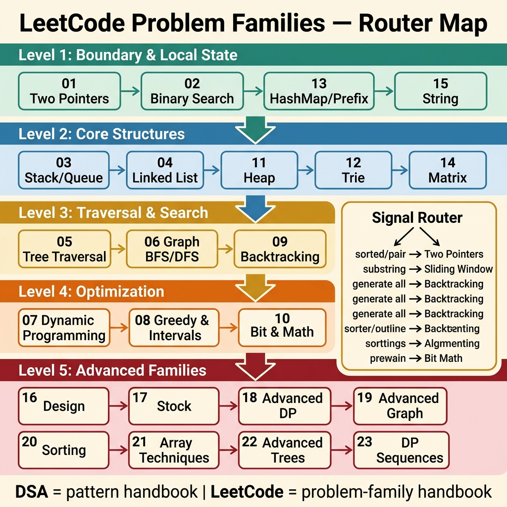

<!-- tags: leetcode, algorithms, coding-interview, overview -->
# 🧩 LeetCode Problem Families — Problem-Centric Router

> LeetCode preparation requires structured routing. This guide maps problem signals to implementable solutions using established problem families.

📅 Created: 2026-03-20 · 🔄 Updated: 2026-04-10 · ⏱️ 14 min read

| Aspect | Detail |
| ------ | ------ |
| **Scope** | 23 family guides for common interview problem clusters. |
| **Use case** | Signal-based routing and invariant identification. |
| **Boundary** | `assets/dsa` covers patterns. `assets/leet-codes` covers problem families. |
| **Primary language** | Go-first, with multi-language blocks per family guide. |

---

## 1. DEFINE

You need a guide to map novel problems to established patterns. This Problem-Centric Router serves exactly that purpose.

LeetCode prompts often disguise familiar structures. If you only memorize tricks, you risk applying the wrong pattern when problem framing changes.

This folder addresses prompt recognition. It complements the core DSA handbook. The DSA folder covers primitives. This folder maps prompts to problem families.

Core insight: **A strong router distinguishes the underlying problem family. This empowers you to select the correct primitive confidently.**

### 1.1 Family Map

| # | Family | When to open |
|---|--------|------------|
| 01 | [Two Pointers & Sliding Window](./01-two-pointers-sliding-window.md) | Sorted pair, palindrome, substring/subarray. |
| 02 | [Binary Search](./02-binary-search.md) | O(log n), first/last, minimum feasible, search on answer. |
| 03 | [Stack, Queue & Monotonic](./03-stack-queue-monotonic.md) | Next greater, valid parentheses, histogram, sliding max. |
| 04 | [Linked List](./04-linked-list.md) | Reverse, merge, cycle, reorder, remove kth. |
| 05 | [Tree Traversal](./05-tree-traversal.md) | Depth, path, validate BST, LCA, tree aggregate. |
| 06 | [Graph BFS/DFS](./06-graph-bfs-dfs.md) | Islands, components, shortest path unweighted, topo. |
| 07 | [Dynamic Programming](./07-dynamic-programming.md) | Count ways, min cost, partition, classic DP families. |
| 08 | [Greedy & Intervals](./08-greedy-intervals.md) | Coverage, intervals, jump game, scheduling. |
| 09 | [Backtracking](./09-backtracking.md) | Generate all, combinations, permutations, N-Queens. |
| 10 | [Bit Manipulation & Math](./10-bit-manipulation-math.md) | XOR, bits, fast power, gcd/lcm, modular reasoning. |
| 11 | [Heap & Priority Queue](./11-heap-priority-queue.md) | Top-k, best-next, streaming median, merge k. |
| 12 | [Trie](./12-trie.md) | Prefix search, wildcard dictionary, autocomplete. |
| 13 | [HashMap & Prefix Sum](./13-hashmap-prefix-sum.md) | Complement lookup, frequency, subarray sum, prefix state. |
| 14 | [Matrix](./14-matrix.md) | Spiral, rotate, set zeroes, search matrix. |
| 15 | [String](./15-string.md) | Palindrome, anagram, decode, KMP, string state. |
| 16 | [Design](./16-design.md) | Implement class/data structure with operation contracts. |
| 17 | [Buy & Sell Stock](./17-buy-sell-stock.md) | Hold/cash state machine with cooldown, fee, k trades. |
| 18 | [Advanced DP](./18-advanced-dp.md) | Edit distance, regex, interval DP, interleaving. |
| 19 | [Advanced Graph](./19-advanced-graph.md) | MST, DSU, weighted frontier, multi-source graph. |
| 20 | [Sorting & Searching](./20-sorting-searching.md) | Partition, kth, median, order-centric problems. |
| 21 | [Array Techniques](./21-array-techniques.md) | Cyclic sort, Boyer-Moore, next permutation, in-place tricks. |
| 22 | [Advanced Trees](./22-advanced-trees.md) | Tree DP, reconstruction, path summary, metadata. |
| 23 | [DP Sequences & Palindromes](./23-dp-sequences.md) | Kadane, circular arrays, target sum, palindrome DP. |

### 1.2 Quick recognition

- Open the LeetCode family guide first when evaluating interview prompts. Fall back to the DSA folder for deep primitive mastery.
- The DSA folder serves beginners learning primitives. This folder acts as a routing engine for active problem solving.
- Handoff to the DSA folder when a problem exposes missing foundational knowledge.

### 1.3 Invariants & Failure Modes

- Every family guide outlines problem signals. It defines invariant logic and suggests common follow-up challenges.
- This folder avoids duplicating deep pattern definitions. It prioritizes the problem-family perspective and routing logic.
- A common failure mode involves solving isolated problems without recognizing their broader family. This fractures knowledge retention.

## 2. VISUAL

You must view the 23 family guides from a high level. This visual maps prompts to the correct lanes.

### Overview — LeetCode Problem Families



*Figure: Route by signal instead of numerical order. This separates pattern mechanics from problem application.*

A router must display actionable paths. The diagram provides a tiered learning path and a signal-based decision trace.

### Level 1 — Learning Path

```text
Level 1: Boundary & Local State
  01 Two Pointers -> 02 Binary Search -> 13 HashMap/Prefix -> 15 String

Level 2: Core Structures
  03 Stack/Queue -> 04 Linked List -> 11 Heap -> 12 Trie -> 14 Matrix

Level 3: Traversal & Search Space
  05 Tree Traversal -> 06 Graph BFS/DFS -> 09 Backtracking

Level 4: Optimization Families
  07 Dynamic Programming -> 08 Greedy & Intervals -> 10 Bit & Math

Level 5: Deep Problem Families
  16 Design -> 17 Stock -> 18 Advanced DP -> 19 Advanced Graph -> 20 Sorting/Searching
  -> 21 Array Techniques -> 22 Advanced Trees -> 23 DP Sequences
```

*Caption*: Level 1 introduces progression lanes. Readers move from boundary problems toward deep reasoning seamlessly.

### Level 2 — Routing Trace

```text
Prompt contains...
  ├─ "sorted / first true / minimum feasible" -> 02 Binary Search
  ├─ "substring / subarray / contiguous" -> 01 Two Pointers & Sliding Window
  ├─ "generate all / N-Queens / combinations" -> 09 Backtracking
  ├─ "count ways / min cost / partition" -> 07 Dynamic Programming
  ├─ "top-k / best next / stream" -> 11 Heap & Priority Queue
  ├─ "cache / implement class / operation contract" -> 16 Design
  ├─ "MST / DSU / weighted path / multi-source" -> 19 Advanced Graph
  └─ "palindrome / circular subarray / target sum" -> 23 DP Sequences
```

*Caption*: Level 2 demonstrates signal-based handoffs. Route here first before consulting DSA for missing primitives.

## 3. CODE

Once the lane becomes clear, execution requires structure. The loop involves signal recognition followed by targeted family selection.

### Workflow 1 — Route prompt to family

```go
func RouteFamily(signal string) string {
    switch {
    case containsAny(signal, "sorted", "first true", "minimum feasible"):
        return "02-binary-search"
    case containsAny(signal, "substring", "subarray", "contiguous"):
        return "01-two-pointers-sliding-window"
    case containsAny(signal, "generate all", "permutation", "n-queens"):
        return "09-backtracking"
    case containsAny(signal, "count ways", "min cost", "partition"):
        return "07-dynamic-programming"
    case containsAny(signal, "top-k", "median stream", "priority"):
        return "11-heap-priority-queue"
    default:
        return "README -> scan family map + handoff to assets/dsa if primitive is still unclear"
    }
}
```

```typescript
export function routeFamily(signal: string): string {
  if (hasAny(signal, ["sorted", "first true", "minimum feasible"])) return "02-binary-search";
  if (hasAny(signal, ["substring", "subarray", "contiguous"])) return "01-two-pointers-sliding-window";
  if (hasAny(signal, ["generate all", "permutation", "n-queens"])) return "09-backtracking";
  if (hasAny(signal, ["count ways", "min cost", "partition"])) return "07-dynamic-programming";
  if (hasAny(signal, ["top-k", "median stream", "priority"])) return "11-heap-priority-queue";
  return "README -> scan family map + handoff to assets/dsa if primitive is still unclear";
}
```

### Workflow 2 — Study families without mechanical memorization

```text
1. Read DEFINE to lock signals and invariants.
2. View VISUAL to verify state movement and frontier shifts.
3. Implement the first problem in CODE. Move forward only after grasping the variant logic.
4. Read PITFALLS to avoid common interview traps.
5. Use RECOMMEND to bridge into adjacent families contextually.
```

## 4. PITFALLS

Mechanical problem collection hides deeper structural flaws. Failure surfaces when passing one problem leaves you confused on the next.

| # | Severity | Defect | Impact | Fix |
|---|----------|--------|--------|-----|
| 1 | High | Treating guides as an unrelated list | Fractures knowledge and triggers brute-force defaults | Route strictly by prompt signal |
| 2 | High | Mixing DSA boundaries with problem families | Duplicates effort without improving decision speed | Treat DSA as primitive mechanics |
| 3 | Medium | Jumping to CODE before locking invariants | Promotes short-term memorization over pattern reuse | Verbalize the invariant before coding |
| 4 | Medium | Stopping after reading one family guide | Breaks the natural escalation lane | Follow RECOMMEND links contextually |
| 5 | Common | Labeling all hard problems generically | Forces rigid DP or graph templates inappropriately | Subdivide into precise sub-families immediately |

## 5. REF

- [LeetCode Problem Set](https://leetcode.com/problemset/)
- [LeetCode Explore](https://leetcode.com/explore/)
- [NeetCode Roadmap](https://neetcode.io/roadmap)
- [Study Plan Index](https://leetcode.com/studyplan/)

## 6. RECOMMEND

Once routing concludes, you must transition to the next knowledge tier. These natural handoffs structure your progression.

| Next Step | When to use | Rationale | File/Link |
|---|---|---|---|
| DSA router | Cannot implement a known family | DSA provides deep pattern mechanic instructions. | [dsa/README](../dsa/README.md) |
| Go concurrency | Linking interview code to production concurrency | Separates algorithmic tricks from system safety. | [go/concurrency](../go/concurrency/README.md) |
| Design Pattern | Exploring abstractions behind design classes | Distinguishes API tricks from reusable design intent. | [design-pattern](../design-pattern/README.md) |
| System Design | Elevating beyond local algorithmic solutions | Expands focus toward distributed trade-offs. | [system-design](../system-design/README.md) |
