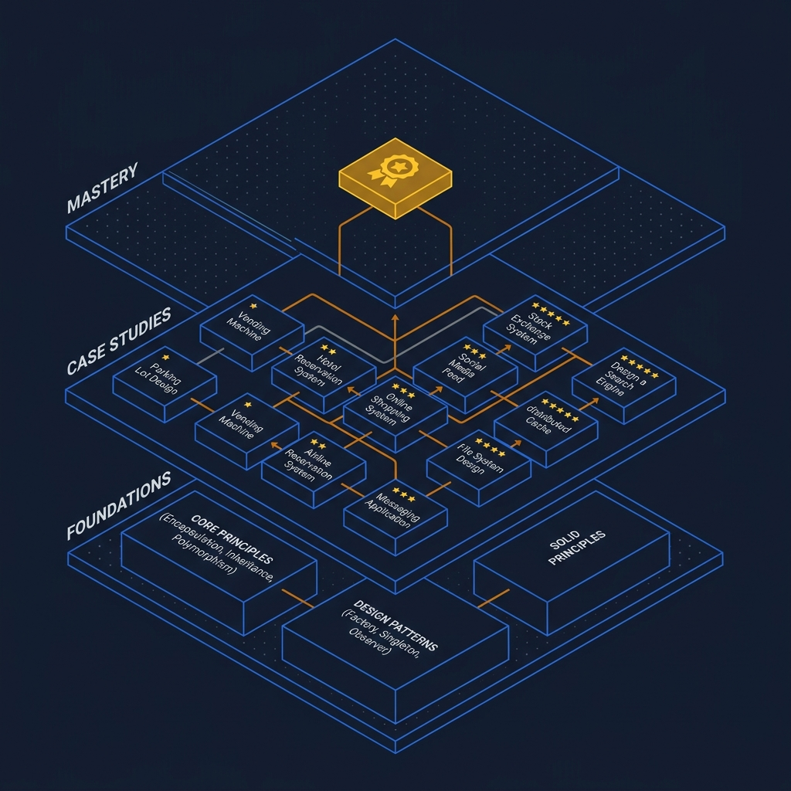
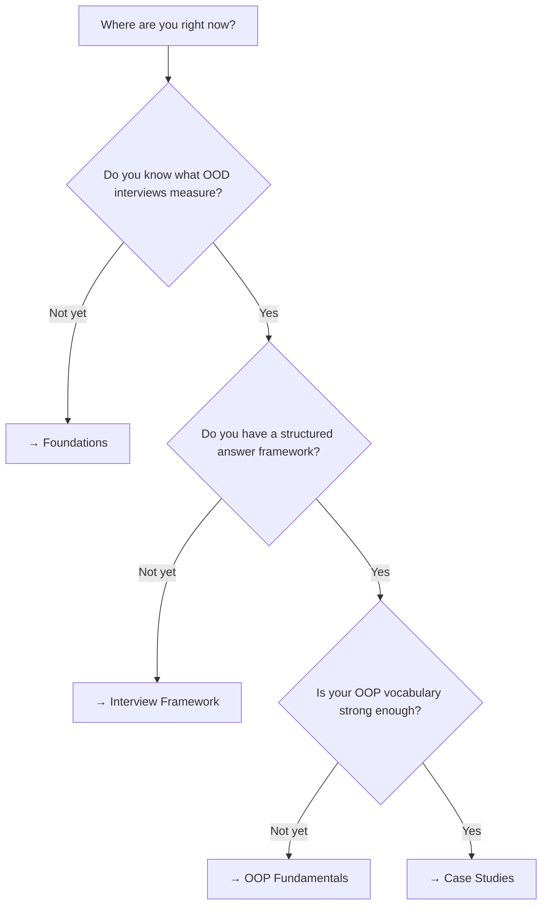

<!-- tags: overview -->
# OOD Interview

> Navigation hub for OOD Interview — pick your lane by pain point, not by filename.

| Aspect | Detail |
| --- | --- |
| **Concept** | Decision router for OOD Interview |
| **Audience** | Mid-level to senior engineer preparing for OOD interviews |
| **Entry point** | Open when you know you need OOD practice but aren't sure where to start |

📅 Created: 2026-04-02 · 🔄 Updated: 2026-04-21 · ⏱️ 3 min read

---

## Routing Map

*Answer the questions to find your starting point. Skip what you already know.*

---

## Decision Table

| If you are... | Open this lane | Why |
| --- | --- | --- |
| Unsure what OOD interviews expect | [Foundations](foundations/README.md) | Understand expectations + framework first |
| Know expectations, need a structured answer process | [Interview Framework](foundations/02-interview-framework.md) | 7-step framework = time management under pressure |
| Need defense vocabulary (encapsulation, SOLID...) | [OOP Fundamentals](foundations/03-oop-fundamentals.md) | Vocabulary to justify design decisions on the spot |
| Have the foundation, want to practice | [Case Studies](case-studies/README.md) | 11 case studies from ⭐ to ⭐⭐⭐ |

---

## Lane Overview

### [OOD Foundations](foundations/README.md)
Foundation lane: what is an OOD interview, the 7-step framework, OOP vocabulary.
- 3 files · Focus: mental model + process
- Start here if you don't have a structured approach yet

### [OOD Case Studies](case-studies/README.md)
Practice lane: 11 real interview problems from Parking Lot to Restaurant Management.
- 11 files · Difficulty: ⭐ → ⭐⭐⭐
- Start here if you already have the foundation and need practice

---

**Links**: [→ Foundations](foundations/README.md) · [→ Case Studies](case-studies/README.md)
