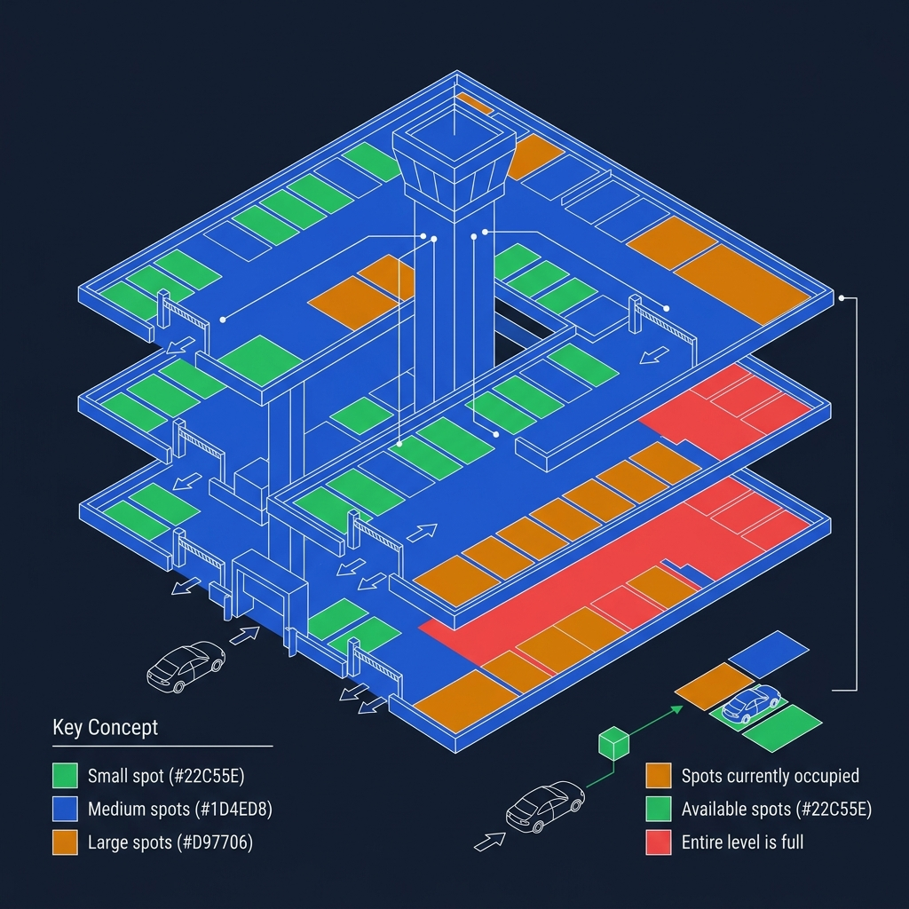
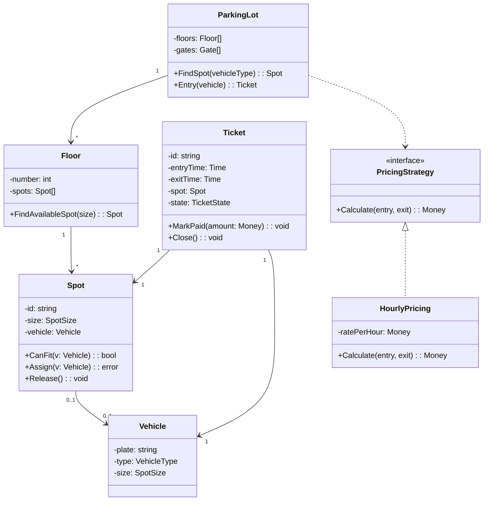
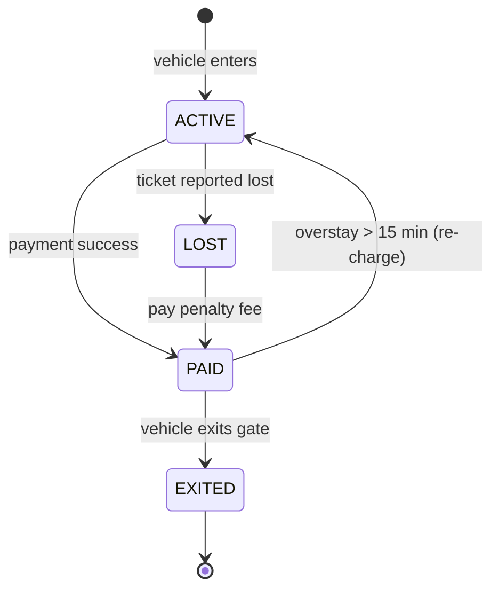

<!-- tags: ood-interview, oop, case-study, parking-lot -->
# Design a Parking Lot

> Multi-floor lot: spot allocation by vehicle size, ticket state machine, extensible pricing strategy.

| Aspect | Detail |
| --- | --- |
| **Difficulty** | ⭐⭐ |
| **Primary patterns** | State, Factory, Strategy |
| **Interview focus** | Object model + state transitions + extension seam |

📅 Created: 2026-04-02 · 🔄 Updated: 2026-04-21 · ⏱️ 18 min read

---

## 1. DEFINE

Interviewer: "Design a parking lot system." You sketch `Car`, `Spot`, `ParkingLot` in 30 seconds. Then follow-ups hit: "What if a motorcycle takes a compact spot?" — "Pricing by hour or by block?" — "A vehicle enters but the payment gateway times out — does the gate open?"

The parking lot problem is not hard because of data. It is hard because of 3 trade-offs the interviewer uses to measure depth:

1. **Spot allocation** — which vehicle goes into which slot? Can a motorcycle park in a compact spot? How do you model a truck that occupies 2 regular slots?
2. **Ticket state machine** — `ACTIVE → PAID → EXITED`. What if the ticket is paid but the vehicle does not exit within 15 minutes?
3. **Pricing strategy** — hourly? block-based? weekend surcharge? Add new pricing rules without modifying `Ticket.CalculateFee()`.

| Variant | Description | Interview angle |
| --- | --- | --- |
| Core | Multi-floor lot, vehicle types, ticket lifecycle | Object model + state + invariant |
| Follow-up: pricing | Add weekend/night rate | Strategy pattern, OCP |
| Follow-up: concurrency | 2 vehicles arrive simultaneously, 1 spot left | Race condition, locking |
| Follow-up: multi-gate | Entry/exit gates, capacity tracking | Observer/event, aggregate boundary |

### Core Objects

| Object | Role | Key Attributes | Key Methods |
| --- | --- | --- | --- |
| `ParkingLot` | Aggregate root | floors, capacity, gates | `FindSpot(vehicleType)`, `Entry()` |
| `Floor` | Container | number, spots[] | `FindAvailableSpot(size)` |
| `Spot` | Resource | id, size, vehicle | `CanFit(vehicle)`, `Assign()`, `Release()` |
| `Ticket` | Lifecycle entity | id, entryTime, spot, state | `MarkPaid(amount)`, `Close()` |
| `PricingStrategy` | Policy interface | — | `Calculate(entry, exit): Money` |
| `Vehicle` | Value object | plate, type, size | — |

### Design Approach

| Approach | Trade-off | When to choose |
| --- | --- | --- |
| God service (`ParkingService` does everything) | Quick, but all rules in 1 class | Only when prompt is very short and no follow-up |
| Rich domain + thin orchestration | Entity guards invariant, service only coordinates | Default for interview — easy to extend, easy to defend |

Spot allocation sounds simple — but when vehicle size and spot size are not 1:1, you need a matching strategy. That trap appears in PITFALLS.

---

## 2. VISUAL




Boundary locked. Two things need visual: class relationships and the ticket state machine — because the interviewer will ask about both.

### Class Diagram



*ParkingLot → Floor → Spot is the aggregate hierarchy. Ticket references Spot but does not own it. PricingStrategy is separated from Ticket for OCP.*

### Ticket State Machine



*PAID → ACTIVE loop handles overstay. LOST branch forces penalty before exit.*

The diagrams show the boundaries. Now the question: when writing code, which invariant lives in the entity and which in the service?

---

## 3. CODE

### Problem 1: Basic — Spot allocation with vehicle fitting

> **Goal**: Spot guards its own invariant — rejects large vehicles parking in small slots.
> **Approach**: `Spot.CanFit()` checks size, `Spot.Assign()` enforces no double-booking.
> **Example**: `Spot(compact).Assign(motorcycle)` → OK; `Spot(compact).Assign(truck)` → error
> **Complexity**: O(1) per operation

```go
// parking_lot.go — Spot allocation with vehicle size enforcement
package parkinglot

import (
	"errors"
	"fmt"
)

// SpotSize represents physical size of a parking spot.
// ⚠️ Ordered intentionally — iota value doubles as comparison key.
type SpotSize int

const (
	Compact SpotSize = iota // motorcycle, sedan
	Regular                 // sedan, SUV
	Large                   // SUV, truck
)

type Vehicle struct {
	Plate string
	Type  string   // "motorcycle", "sedan", "truck"
	Size  SpotSize // ✅ Size on vehicle = minimum spot size needed
}

type Spot struct {
	ID      string
	Size    SpotSize
	vehicle *Vehicle // nil = available
}

// canFit checks if this spot can accommodate the vehicle.
// ✅ Invariant: vehicle.Size <= spot.Size (motorcycle fits compact, truck needs large)
func (s *Spot) canFit(v *Vehicle) bool {
	return s.vehicle == nil && v.Size <= s.Size
}

// Assign parks a vehicle into this spot.
// ⚠️ Entity self-guards — caller does not need to check beforehand.
func (s *Spot) Assign(v *Vehicle) error {
	if s.vehicle != nil {
		return fmt.Errorf("spot %s already occupied", s.ID)
	}
	if v.Size > s.Size {
		return fmt.Errorf("vehicle %s (size=%d) too large for spot %s (size=%d)",
			v.Plate, v.Size, s.ID, s.Size)
	}
	s.vehicle = v
	return nil
}

// Release frees the spot. Idempotent.
func (s *Spot) Release() {
	s.vehicle = nil
}

// IsAvailable returns true if no vehicle is parked.
func (s *Spot) IsAvailable() bool {
	return s.vehicle == nil
}
```

> **Why does the invariant live in Spot, not in the service?**
> If `ParkingService.Park()` checks size before calling `spot.Assign()`, two different callers can bypass the check. Entity self-guarding = invariant cannot be skipped regardless of caller. In an interview, saying this tells the interviewer you understand real encapsulation, not just getters/setters.

Spot knows how to protect itself. But who decides which vehicle goes into which spot? Floor must scan, ParkingLot must coordinate — that is the orchestration layer.

### Problem 2: Intermediate — Ticket lifecycle + ParkingLot orchestration

> **Goal**: ParkingLot coordinates entry/exit flow; Ticket manages state transitions.
> **Approach**: Thin orchestration — ParkingLot only finds spot + issues ticket; Ticket manages its own state.
> **Example**: `lot.Entry(sedan)` → `Ticket{ACTIVE}` → `ticket.MarkPaid(20)` → `ticket.State == PAID`
> **Complexity**: O(F × S) to find spot across F floors × S spots; O(1) state transitions

```go
// parking_orchestration.go — Ticket lifecycle + ParkingLot entry/exit
package parkinglot

import (
	"errors"
	"fmt"
	"time"
)

type TicketState string

const (
	Active TicketState = "ACTIVE"
	Paid   TicketState = "PAID"
	Exited TicketState = "EXITED"
)

type Ticket struct {
	ID        string
	Vehicle   *Vehicle
	Spot      *Spot
	EntryTime time.Time
	ExitTime  time.Time
	State     TicketState
}

// MarkPaid transitions ACTIVE → PAID.
// ⚠️ State machine: only ACTIVE can be paid.
func (t *Ticket) MarkPaid(amount float64) error {
	if t.State != Active {
		return fmt.Errorf("cannot pay ticket in state %s", t.State)
	}
	t.State = Paid
	return nil
}

// Close transitions PAID → EXITED and releases the spot.
// ✅ Spot.Release() lives here because exit = spot freed — natural domain event.
func (t *Ticket) Close() error {
	if t.State != Paid {
		return fmt.Errorf("cannot exit without payment, state=%s", t.State)
	}
	t.ExitTime = time.Now()
	t.Spot.Release()
	t.State = Exited
	return nil
}

// --- Floor ---

type Floor struct {
	Number int
	Spots  []*Spot
}

func (f *Floor) FindAvailableSpot(size SpotSize) *Spot {
	for _, s := range f.Spots {
		if s.IsAvailable() && size <= s.Size {
			return s
		}
	}
	return nil
}

// --- ParkingLot (thin orchestration) ---

type ParkingLot struct {
	Floors []*Floor
}

// Entry = find spot → assign vehicle → issue ticket.
// ✅ ParkingLot only coordinates, holds no business rule.
func (lot *ParkingLot) Entry(v *Vehicle) (*Ticket, error) {
	for _, floor := range lot.Floors {
		spot := floor.FindAvailableSpot(v.Size)
		if spot == nil {
			continue
		}
		if err := spot.Assign(v); err != nil {
			continue // race condition — spot taken between find and assign
		}
		return &Ticket{
			ID:        fmt.Sprintf("T-%d", time.Now().UnixNano()),
			Vehicle:   v,
			Spot:      spot,
			EntryTime: time.Now(),
			State:     Active,
		}, nil
	}
	return nil, errors.New("parking lot full")
}
```

> **Why is ParkingLot a thin orchestrator instead of a god service?**
> `ParkingLot.Entry()` only coordinates: find spot → assign → issue ticket. It holds zero business rules — size check lives in Spot, state transition lives in Ticket. When the interviewer asks "add valet parking?" you add a `ValetService` that calls the same `Spot.Assign()` — no changes to ParkingLot.

### Problem 3: Advanced — Pricing strategy with OCP

> **Goal**: Add new pricing rules (weekend, night, block) without modifying existing checkout code.
> **Approach**: Strategy pattern — `PricingStrategy` interface, injected into `CheckoutService`.
> **Example**: `CheckoutService{pricing: HourlyPricing{rate: 5.0}}` → swap to `BlockPricing{rate: 10, blockHours: 4}`
> **Complexity**: O(1)

```go
// pricing_strategy.go — Pricing extension seam
package parkinglot

import "time"

// PricingStrategy — extension seam.
// ✅ OCP: add WeekendPricing by implementing this interface. Zero changes to CheckoutService.
type PricingStrategy interface {
	Calculate(entry, exit time.Time) float64
}

type HourlyPricing struct {
	RatePerHour float64
}

func (h *HourlyPricing) Calculate(entry, exit time.Time) float64 {
	hours := exit.Sub(entry).Hours()
	if hours < 1 {
		hours = 1 // minimum 1 hour
	}
	return hours * h.RatePerHour
}

type BlockPricing struct {
	RatePerBlock float64
	BlockHours   float64
}

func (b *BlockPricing) Calculate(entry, exit time.Time) float64 {
	hours := exit.Sub(entry).Hours()
	blocks := int(hours/b.BlockHours) + 1
	return float64(blocks) * b.RatePerBlock
}

// CheckoutService — depends on interface, not concrete.
// ✅ DIP: pricing is injected, not hardcoded.
type CheckoutService struct {
	Pricing PricingStrategy
}

func (cs *CheckoutService) Checkout(ticket *Ticket) (float64, error) {
	if ticket.State != Active {
		return 0, fmt.Errorf("ticket already in state %s", ticket.State)
	}
	fee := cs.Pricing.Calculate(ticket.EntryTime, time.Now())
	if err := ticket.MarkPaid(fee); err != nil {
		return 0, err
	}
	return fee, nil
}
```

> **Why Strategy pattern instead of switch-case for pricing?**
> Switch-case: `switch(pricingType) { case "hourly": ... case "block": ... }` — every new pricing rule modifies the switch. Strategy: implement `PricingStrategy` interface → plug in. In an interview, this is the cleanest OCP demonstration.

---

## 4. PITFALLS

Parking lot looks like a warm-up problem — until the interviewer pushes on concurrent entry, lost tickets, and overstay.

| # | Severity | Mistake | Consequence | Fix |
| --- | --- | --- | --- | --- |
| 1 | 🔴 Fatal | Spot invariant in service, not in entity | Bypass-able — admin API parks truck in compact | Entity self-guards: `Spot.Assign()` checks size |
| 2 | 🔴 Fatal | No state machine on Ticket | Pay twice, exit without payment | State transitions with guard: ACTIVE → PAID → EXITED |
| 3 | 🟡 Common | Pricing logic hardcoded in Ticket | Add weekend rate = modify Ticket | Strategy interface, inject into CheckoutService |
| 4 | 🟡 Common | ParkingLot tracks capacity with counter | Counter drifts on crash/race | Derive from actual spot occupancy: `count(occupied spots)` |
| 5 | 🔵 Minor | No LOST ticket branch | Lost ticket = free parking forever | LOST state with penalty fee |

---

## 5. REF

| Resource | Type | Link | Note |
| --- | --- | --- | --- |
| ByteByteGo — Parking Lot | Course | https://bytebytego.com/courses/object-oriented-design-interview | Full walkthrough |
| Refactoring Guru — Strategy | Reference | https://refactoring.guru/design-patterns/strategy | Pricing strategy |
| Refactoring Guru — State | Reference | https://refactoring.guru/design-patterns/state | Ticket state machine |

---

## 6. RECOMMEND

Parking lot teaches spot allocation + ticket lifecycle + pricing strategy. Next step: practice a problem with temporal state or multi-entity coordination.

| Next topic | When | Why | File/Link |
| --- | --- | --- | --- |
| [Movie Ticket Booking](./05-movie-ticket-booking.md) | Want temporal hold + timeout | Seat hold with expiry — adds time dimension parking lot lacks | Case study |
| [Elevator System](./08-elevator-system.md) | Want multi-entity state machine | Multiple elevators, dispatch strategy — scales up coordination | Case study |
| [Vending Machine](./07-vending-machine.md) | Want pure state machine | 4 states, clean transitions, textbook State pattern | Case study |

---

## 7. QUICK REF

| If the interviewer asks | Signal | Your answer |
| --- | --- | --- |
| "Motorcycle in compact spot?" | Size fitting | `vehicle.Size <= spot.Size` — motorcycle fits compact, truck needs large |
| "Truck takes 2 spots?" | Multi-spot allocation | `LargeVehicleSpot` composite or `Spot.occupiedBy` list |
| "Add weekend pricing?" | OCP / Strategy | Implement `PricingStrategy` interface — zero changes to checkout |
| "2 vehicles, 1 spot left?" | Concurrency | `Spot.Assign()` is the atomic boundary — first caller wins |
| "Lost ticket?" | State extension | LOST state → penalty fee → PAID → EXITED |
| "Overstay after payment?" | State loop | PAID → ACTIVE (re-charge) if vehicle stays > 15 min |

---

**Links**: [← OOP Fundamentals](../foundations/03-oop-fundamentals.md) · [→ Movie Ticket Booking](./05-movie-ticket-booking.md)
