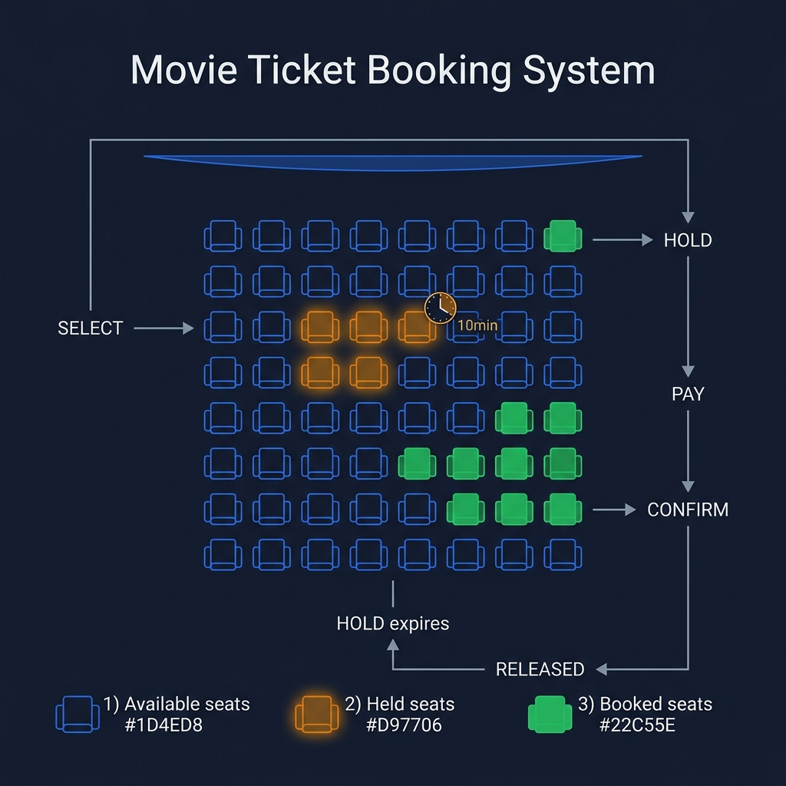
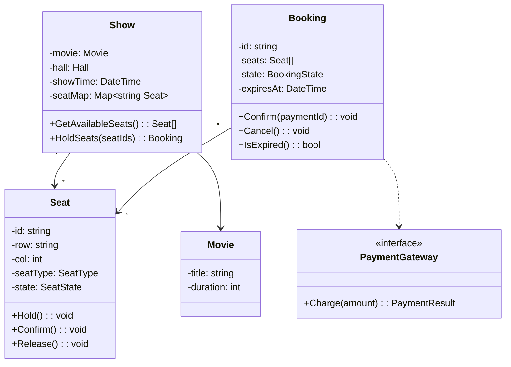
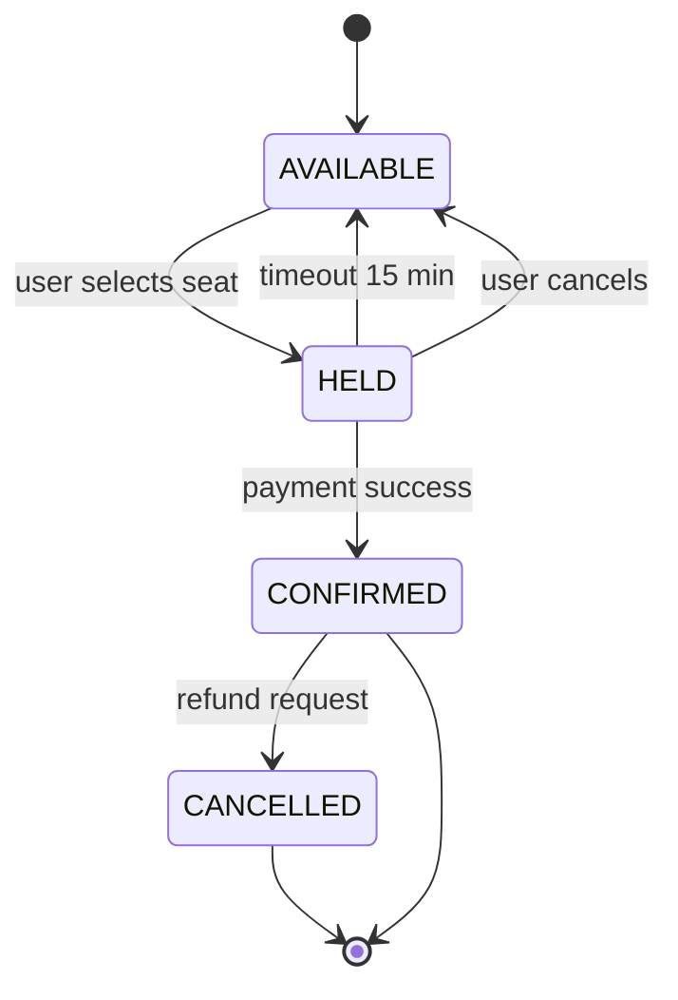

<!-- tags: ood-interview, oop, case-study, movie-ticket-booking -->
# Design a Movie Ticket Booking System

> Seat reservation with temporal state: hold timeout, concurrent booking, payment race condition.

| Aspect | Detail |
| --- | --- |
| **Difficulty** | ⭐⭐ |
| **Primary patterns** | Strategy, Observer, State |
| **Interview focus** | Seat locking + reservation lifecycle + payment timeout |

📅 Created: 2026-04-02 · 🔄 Updated: 2026-04-21 · ⏱️ 18 min read

---

## 1. DEFINE

Two friends open the app at 8:05 PM to book the 9:00 PM Avengers show. Both select seat C5. Person A taps "Reserve" 200ms first. Person B gets a toast: "Seat taken." But is C5 actually sold, or just held for 15 minutes while A completes payment?

Movie ticket booking is harder than parking lot at three specific points:

1. **Seat locking** — a seat is held temporarily (15 min) pending payment, not sold immediately. Timeout → release back to the pool.
2. **Show as aggregate** — same hall, different showtime = different seat map. Show owns seat availability, not Cinema.
3. **Payment timeout** — reservation HELD → CONFIRMED (payment success) or HELD → AVAILABLE (timeout). Race condition between timeout release and late payment.

| Variant | Description | Interview angle |
| --- | --- | --- |
| Core | Reserve, pay, confirm for 1 show | State machine + seat locking |
| Follow-up: group booking | 5 people, 5 contiguous seats | Contiguous seat allocation |
| Follow-up: cancellation | Cancel after confirmed, refund policy | State transition CONFIRMED → CANCELLED |
| Follow-up: dynamic pricing | Different price for VIP row, weekend, prime time | Strategy pattern |

### Core Objects

| Object | Role | Key Attributes | Key Methods |
| --- | --- | --- | --- |
| `Show` | Aggregate root | movie, cinema, hall, time, seatMap | `GetAvailableSeats()`, `HoldSeats(seatIds)` |
| `Seat` | Resource | id, row, col, type, state | `Hold()`, `Confirm()`, `Release()` |
| `Booking` | Lifecycle entity | id, show, seats[], state, expiry | `Confirm(paymentId)`, `Cancel()`, `Expire()` |
| `Movie` | Value object | title, duration, genre | — |
| `PaymentGateway` | External interface | — | `Charge(amount): PaymentResult` |

### Design Approach

| Approach | Trade-off | When to choose |
| --- | --- | --- |
| Optimistic (no lock, check on payment) | Simple, but 2 users can book same seat | Only when traffic is extremely low |
| Pessimistic hold (lock seat 15 min) | Seat locked, reduces availability, but no double-booking | Default — standard industry practice |

Seat locking timeout sounds simple — but when a payment gateway is slow and the release timer fires simultaneously, you need atomic state transitions. That trap surfaces in PITFALLS.

---

## 2. VISUAL




Boundary locked. Two things need visual: class relationships and the booking state machine — because the interviewer will ask "what happens on timeout?"

### Class Diagram



*Show aggregate owns the seatMap. Booking references seats but does not own them — when a booking expires, seats release back to Show.*

### Booking State Machine



*HELD → AVAILABLE auto-releases after 15 min. Race condition: payment gateway responds AFTER timeout release.*

---

## 3. CODE

Diagram shows the flow. The core question: seat state transition must be atomic — two users holding the same seat simultaneously must fail one.

### Problem 1: Basic — Seat state machine with hold/release

> **Goal**: Seat guards its own state — reject hold when already held, reject confirm when not held.
> **Approach**: `Seat.Hold()` guards state; `Show.HoldSeats()` orchestrates atomic multi-seat hold.
> **Example**: `seat.Hold()` → OK; `seat.Hold()` again → error "already held"
> **Complexity**: O(1) per operation

```go
// movie_booking.go — Seat state machine with hold/release
package booking

import (
	"errors"
	"fmt"
	"time"
)

type SeatState string

const (
	Available SeatState = "AVAILABLE"
	Held      SeatState = "HELD"
	Confirmed SeatState = "CONFIRMED"
)

type SeatType string

const (
	Standard SeatType = "STANDARD"
	VIP      SeatType = "VIP"
)

type Seat struct {
	ID    string
	Row   string
	Col   int
	Type  SeatType
	State SeatState
}

// Hold transitions AVAILABLE → HELD.
// ⚠️ Atomic — if already HELD, reject immediately.
func (s *Seat) Hold() error {
	if s.State != Available {
		return fmt.Errorf("seat %s is %s, cannot hold", s.ID, s.State)
	}
	s.State = Held
	return nil
}

// Confirm transitions HELD → CONFIRMED.
func (s *Seat) Confirm() error {
	if s.State != Held {
		return fmt.Errorf("seat %s is %s, cannot confirm", s.ID, s.State)
	}
	s.State = Confirmed
	return nil
}

// Release transitions HELD → AVAILABLE (timeout or cancel).
func (s *Seat) Release() error {
	if s.State != Held {
		return fmt.Errorf("seat %s is %s, cannot release", s.ID, s.State)
	}
	s.State = Available
	return nil
}
```

> **Why does the seat guard its own state instead of the service?**
> Same principle as Parking Lot — if the service guards, it's bypassable. The seat guarding itself ensures that any caller (API, background timer, admin) cannot double-hold.

Seat protects itself. But when a user selects 3 seats at once, batch hold is required — if seat 3 fails, seats 1 and 2 must roll back.

### Problem 2: Intermediate — Booking lifecycle + batch seat hold

> **Goal**: Show coordinates batch seat hold; Booking tracks lifecycle with expiry timeout.
> **Approach**: `Show.HoldSeats()` transactional batch; `Booking` auto-expire releases seats.
> **Example**: `show.HoldSeats([C5, C6, C7])` → `Booking{HELD, expiresAt: +15min}` → `booking.Confirm(paymentId)` → all seats CONFIRMED
> **Complexity**: O(k) for k seats; O(1) per state transition

```go
// booking_lifecycle.go — Booking lifecycle + batch hold with rollback
package booking

import (
	"fmt"
	"time"
)

type BookingState string

const (
	BookingHeld      BookingState = "HELD"
	BookingConfirmed BookingState = "CONFIRMED"
	BookingCancelled BookingState = "CANCELLED"
	BookingExpired   BookingState = "EXPIRED"
)

type Booking struct {
	ID        string
	Seats     []*Seat
	State     BookingState
	ExpiresAt time.Time
}

// Confirm transitions HELD → CONFIRMED, confirms all seats.
// ⚠️ Must check expired FIRST — race condition with timeout goroutine.
func (b *Booking) Confirm(paymentID string) error {
	if b.IsExpired() {
		return fmt.Errorf("booking %s expired at %v", b.ID, b.ExpiresAt)
	}
	if b.State != BookingHeld {
		return fmt.Errorf("booking %s is %s, cannot confirm", b.ID, b.State)
	}
	for _, seat := range b.Seats {
		if err := seat.Confirm(); err != nil {
			return fmt.Errorf("seat confirm failed: %w", err)
		}
	}
	b.State = BookingConfirmed
	return nil
}

// Expire releases all held seats back to AVAILABLE.
// ✅ Idempotent — safe to call from timer goroutine.
func (b *Booking) Expire() {
	if b.State != BookingHeld {
		return
	}
	for _, seat := range b.Seats {
		_ = seat.Release() // best effort
	}
	b.State = BookingExpired
}

func (b *Booking) IsExpired() bool {
	return b.State == BookingHeld && time.Now().After(b.ExpiresAt)
}

// --- Show orchestration ---

type Show struct {
	ID      string
	SeatMap map[string]*Seat
}

// HoldSeats attempts to hold all requested seats atomically.
// ✅ Transactional: if 1 seat fails → rollback all previously held seats.
func (s *Show) HoldSeats(seatIDs []string) (*Booking, error) {
	var held []*Seat

	for _, id := range seatIDs {
		seat, ok := s.SeatMap[id]
		if !ok {
			s.rollbackHold(held)
			return nil, fmt.Errorf("seat %s not found", id)
		}
		if err := seat.Hold(); err != nil {
			s.rollbackHold(held)
			return nil, fmt.Errorf("cannot hold seat %s: %w", id, err)
		}
		held = append(held, seat)
	}

	return &Booking{
		ID:        fmt.Sprintf("B-%d", time.Now().UnixNano()),
		Seats:     held,
		State:     BookingHeld,
		ExpiresAt: time.Now().Add(15 * time.Minute),
	}, nil
}

func (s *Show) rollbackHold(seats []*Seat) {
	for _, seat := range seats {
		_ = seat.Release()
	}
}
```

> **Why does Show.HoldSeats() need rollback?**
> User selects [C5, C6, C7]. C5 hold OK, C6 hold OK, C7 already held by someone else. Without rolling back C5+C6, two seats become "phantom held" — no one owns them but they show as HELD on the seat map. Transactional batch = all-or-nothing. This is the point interviewers want to hear.

---

## 4. PITFALLS

Movie booking looks simple — until the payment gateway times out and the release timer fires simultaneously.

| # | Severity | Mistake | Consequence | Fix |
| --- | --- | --- | --- | --- |
| 1 | 🔴 Fatal | No rollback on partial batch hold failure | Phantom held seats, capacity leak | Transactional hold with rollback |
| 2 | 🔴 Fatal | Payment arrives AFTER timeout release | Seat released to someone else, payment succeeds but no seat | Check expired BEFORE confirm, refund if race |
| 3 | 🟡 Common | Seat state is just boolean (booked/not) | Cannot distinguish held vs confirmed — timeout logic impossible | State machine: AVAILABLE → HELD → CONFIRMED |
| 4 | 🟡 Common | Cinema holds seat availability instead of Show | Same hall, 2 showtimes → seat map conflict | Show is aggregate root, each show has its own seat map |
| 5 | 🔵 Minor | No SeatType model | VIP row treated same as standard, pricing wrong | Separate SeatType (Standard, VIP, Premium) |

### 🔴 Pitfall #2 — Payment arrives AFTER timeout

```
T=0:00    User holds seat C5        → Booking{HELD, expires: T+15:00}
T=14:50   User clicks "Pay"         → Payment gateway processing...
T=15:00   Timeout timer fires        → seat C5 RELEASED
T=15:03   Payment gateway returns OK → booking.confirm() → ???
```

If `Confirm()` does not check expiry: seat is already AVAILABLE (or held by another user), confirm succeeds = double-booking. Fix: `Booking.Confirm()` must check `IsExpired()` BEFORE transitioning state, return error if expired → trigger refund.

---

## 5. REF

| Resource | Type | Link | Note |
| --- | --- | --- | --- |
| ByteByteGo — Movie Ticket Booking | Course | https://bytebytego.com/courses/object-oriented-design-interview | Full walkthrough |
| Seat Reservation Pattern | Reference | https://microservices.io/patterns/data/saga.html | Saga pattern for multi-step booking |
| Refactoring Guru — State Pattern | Reference | https://refactoring.guru/design-patterns/state | Seat/Booking state machine |

---

## 6. RECOMMEND

Movie booking teaches temporal state management — hold with expiry, race between timer and payment. Next step: practice a different axis.

| Next topic | When | Why | File/Link |
| --- | --- | --- | --- |
| [Parking Lot](./04-parking-lot.md) | Want simpler state machine comparison | Ticket lifecycle without hold timeout | Case study |
| [Shipping Locker](./12-shipping-locker.md) | Want similar resource allocation | Locker assignment = seat allocation for parcels | Case study |
| [Restaurant Management](./14-restaurant-management.md) | Want reservation + real-time resource | Table reservation overlaps with seat booking | Case study |

---

## 7. QUICK REF

| If the interviewer asks | Signal | Your answer |
| --- | --- | --- |
| "2 users select same seat?" | Concurrency / locking | `Seat.Hold()` atomic — first caller wins, second gets error |
| "Group of 5, 5 contiguous seats?" | Contiguous allocation | Show method: scan row, find 5 consecutive AVAILABLE seats |
| "Payment timeout?" | Temporal state | `Booking.Expire()` releases seats, `Confirm()` checks expired first |
| "VIP seats more expensive?" | Pricing strategy | SeatType → PricingStrategy map, calculate per seat type |
| "Cancel after confirmed?" | State extension | CONFIRMED → CANCELLED transition, trigger refund |
| "Show sold out?" | Capacity check | `Show.GetAvailableSeats()` returns empty → display "Sold Out" |

---

**Links**: [← Parking Lot](./04-parking-lot.md) · [→ Unix File Search](./06-unix-file-search.md)
