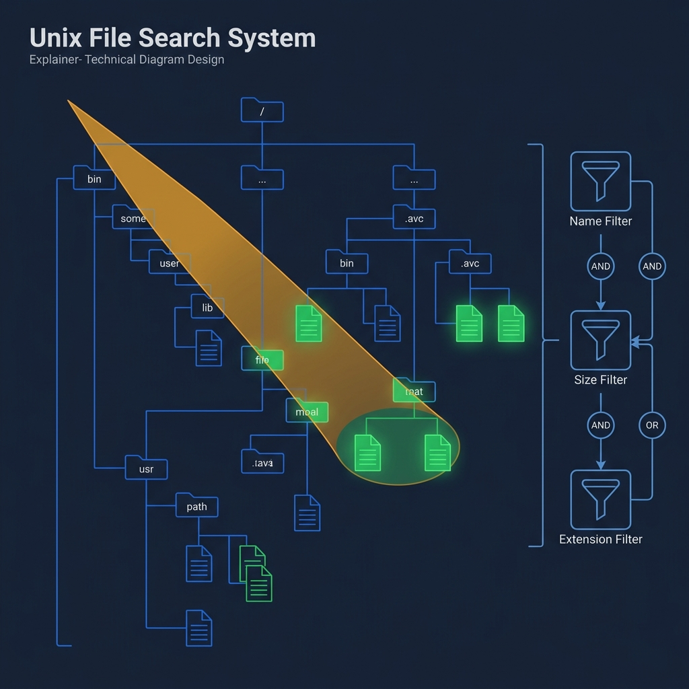
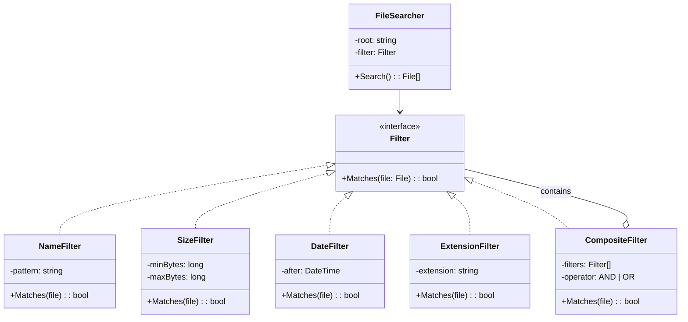
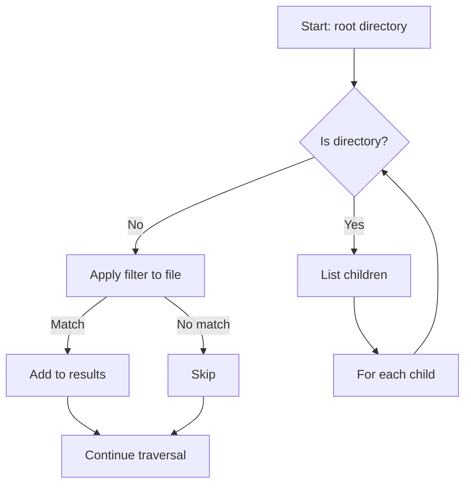

<!-- tags: ood-interview, oop, case-study, unix-file-search -->
# Design a Unix File Search System

> Filter composition, file tree traversal, extensible search criteria — the Composite pattern interview.

| Aspect | Detail |
| --- | --- |
| **Difficulty** | ⭐⭐ |
| **Primary patterns** | Composite, Strategy, Iterator |
| **Interview focus** | Filter composition + tree traversal + extensibility |

📅 Created: 2026-04-02 · 🔄 Updated: 2026-04-21 · ⏱️ 17 min read

---

## 1. DEFINE

`find /home -name "*.log" -size +10M -mtime -7` — one command combining 3 completely different filters: file name, file size, modification time. Add `-type d` and it only finds directories. Add `-name "*.tmp" -delete` and it finds then deletes.

The interviewer asks you to redesign `find`. The trap: you will want to write a `search()` function accepting 10 parameters — `name`, `extension`, `minSize`, `maxSize`, `modifiedAfter`... Every new filter = another parameter = bloated method signature.

Unix file search is hard at 2 specific points:

1. **Filter composition** — each filter is an independent predicate (`NameFilter`, `SizeFilter`, `DateFilter`). Combine them with AND/OR logic without a god `search()` method.
2. **File tree traversal** — filesystem is a tree structure. DFS or BFS? Recursive or iterative? Depth limit?

| Variant | Description | Interview angle |
| --- | --- | --- |
| Core | Find files by name, extension, size | Filter interface + composition |
| Follow-up: AND/OR | Combine filters: `(name=*.log AND size>10M) OR modified<7days` | Composite pattern |
| Follow-up: action | Find then delete/move/compress | Command pattern |
| Follow-up: permission | Skip directories user cannot read | Error handling, graceful degradation |

### Core Objects

| Object | Role | Key Attributes | Key Methods |
| --- | --- | --- | --- |
| `FileSearcher` | Orchestrator | rootPath, filter | `Search(): File[]` |
| `Filter` | Predicate interface | — | `Matches(file): bool` |
| `NameFilter` | Concrete filter | pattern | `Matches(file): bool` |
| `SizeFilter` | Concrete filter | minSize, maxSize | `Matches(file): bool` |
| `CompositeFilter` | AND/OR combinator | filters[], operator | `Matches(file): bool` |
| `File` | Domain model | name, path, size, modTime, isDir | — |

### Design Approach

| Approach | Trade-off | When to choose |
| --- | --- | --- |
| God method (`search(name, ext, size, date...)`) | Quick to code, impossible to extend | Only when filters are permanently fixed |
| Filter interface + composition | Each filter separated, combine freely | Default — OCP, testable, extensible |

Filter composition sounds elegant — but if CompositeFilter contains another CompositeFilter, you need to ensure evaluation avoids infinite loops. That trap is in PITFALLS.

---

## 2. VISUAL




Boundary clear. Two things need visual: filter composition hierarchy and search traversal flow.

### Filter Composition — Composite Pattern



*CompositeFilter contains Filter[] — can nest. FileSearcher accepts 1 Filter (simple or composite). Adding a new filter = 1 new class, zero changes to FileSearcher.*

### Search Traversal Flow



*DFS traversal — apply filter at leaf (file), recurse at node (directory). Filter does not know tree structure.*

---

## 3. CODE

Diagram shows filter separated from traversal. The question: how to combine 3 filters with AND while keeping a single `Matches()` call?

### Problem 1: Basic — Filter interface + concrete filters

> **Goal**: Each filter is an independent predicate, testable in isolation.
> **Approach**: Filter interface with `Matches(file) bool`, concrete structs implement.
> **Example**: `NameFilter("*.log").Matches(file{name: "app.log"})` → true
> **Complexity**: O(1) per filter evaluation

```go
// file_search.go — Filter interface + concrete filters
package filesearch

import (
	"path/filepath"
	"strings"
	"time"
)

type File struct {
	Name    string
	Path    string
	Size    int64
	ModTime time.Time
	IsDir   bool
}

// Filter — each filter is an independent predicate.
// ✅ OCP: adding a new filter = adding 1 struct, no changes to search logic.
type Filter interface {
	Matches(f *File) bool
}

// NameFilter matches files by glob pattern.
type NameFilter struct {
	Pattern string
}

func (nf *NameFilter) Matches(f *File) bool {
	matched, _ := filepath.Match(nf.Pattern, f.Name)
	return matched
}

// ExtensionFilter matches files by extension.
type ExtensionFilter struct {
	Extension string // ".log", ".go"
}

func (ef *ExtensionFilter) Matches(f *File) bool {
	return strings.HasSuffix(f.Name, ef.Extension)
}

// SizeFilter matches files within size range.
type SizeFilter struct {
	MinBytes int64 // 0 = no minimum
	MaxBytes int64 // 0 = no maximum
}

func (sf *SizeFilter) Matches(f *File) bool {
	if sf.MinBytes > 0 && f.Size < sf.MinBytes {
		return false
	}
	if sf.MaxBytes > 0 && f.Size > sf.MaxBytes {
		return false
	}
	return true
}

// DateFilter matches files modified after a given time.
type DateFilter struct {
	After time.Time
}

func (df *DateFilter) Matches(f *File) bool {
	return f.ModTime.After(df.After)
}
```

> **Why Filter as interface instead of function parameter?**
> `search(func(File) bool)` works — but when you need to combine (AND/OR), inspect (logging), or serialize (save search criteria), a function is not enough. Interface allows CompositeFilter to contain Filter[], each filter has its own state (pattern, minSize), and each is testable independently.

Filters are separated. But `find -name "*.log" -size +10M` = 2 filters with AND — composition is needed.

### Problem 2: Intermediate — CompositeFilter + FileSearcher

> **Goal**: Combine filters with AND/OR logic; FileSearcher traverses tree and applies filter.
> **Approach**: CompositeFilter implements Filter interface, contains []Filter + operator.
> **Example**: `AND(NameFilter("*.log"), SizeFilter(min: 10MB))` → matches files named *.log AND > 10MB
> **Complexity**: O(N × F) — N files in tree, F filters to evaluate

```go
// composite_search.go — CompositeFilter + FileSearcher traversal
package filesearch

import (
	"os"
	"path/filepath"
)

type Operator int

const (
	AND Operator = iota
	OR
)

// CompositeFilter combines multiple filters with AND/OR.
// ✅ Composite pattern: CompositeFilter IS-A Filter, CONTAINS []Filter.
type CompositeFilter struct {
	Filters  []Filter
	Operator Operator
}

func (cf *CompositeFilter) Matches(f *File) bool {
	if cf.Operator == AND {
		for _, filter := range cf.Filters {
			if !filter.Matches(f) {
				return false // ⚠️ Short-circuit: first false → reject
			}
		}
		return true
	}
	// OR
	for _, filter := range cf.Filters {
		if filter.Matches(f) {
			return true // ⚠️ Short-circuit: first true → accept
		}
	}
	return false
}

// FileSearcher traverses directory tree and applies filter.
type FileSearcher struct {
	Root   string
	Filter Filter
}

// Search performs DFS traversal, applying filter to each file.
// ✅ Filter is separated from traversal — swap filter without changing search logic.
func (fs *FileSearcher) Search() ([]*File, error) {
	var results []*File

	err := filepath.Walk(fs.Root, func(path string, info os.FileInfo, err error) error {
		if err != nil {
			return nil // skip unreadable — graceful degradation
		}
		file := &File{
			Name:    info.Name(),
			Path:    path,
			Size:    info.Size(),
			ModTime: info.ModTime(),
			IsDir:   info.IsDir(),
		}
		if !file.IsDir && fs.Filter.Matches(file) {
			results = append(results, file)
		}
		return nil
	})

	return results, err
}

// --- Usage example ---
// filter := &CompositeFilter{
//     Filters: []Filter{
//         &NameFilter{Pattern: "*.log"},
//         &SizeFilter{MinBytes: 10 * 1024 * 1024},
//     },
//     Operator: AND,
// }
// searcher := &FileSearcher{Root: "/home", Filter: filter}
// results, _ := searcher.Search()
```

> **Why does CompositeFilter implement the Filter interface (Composite pattern)?**
> Because `FileSearcher.Filter` accepts any Filter — simple or composite uses the same `Matches()` call. You can nest: `AND(OR(NameFilter, ExtFilter), SizeFilter)` — and FileSearcher does not know the difference. This is the point interviewers want to hear: "the searcher doesn't know if it's a simple or composite filter."

---

## 4. PITFALLS

File search looks SOLID — but interview edge cases about filesystem behavior trip many candidates.

| # | Severity | Mistake | Consequence | Fix |
| --- | --- | --- | --- | --- |
| 1 | 🔴 Fatal | God `search(name, ext, size, date...)` method | Adding filter = adding parameter = breaking change | Filter interface + composition |
| 2 | 🔴 Fatal | Symlink loop in filesystem traversal | DFS runs forever, stack overflow | Track visited directories (inode/path set) |
| 3 | 🟡 Common | No handling for permission denied | Crash on /root or restricted directory | Skip unreadable, log warning |
| 4 | 🟡 Common | Filter evaluates on directory instead of file | Directory matches pattern "*.log" → wrong results | Apply filter only on files, directory only for traversal |
| 5 | 🔵 Minor | No depth limit | Traverses entire filesystem = slow | Optional maxDepth parameter |

---

## 5. REF

| Resource | Type | Link | Note |
| --- | --- | --- | --- |
| Refactoring Guru — Composite Pattern | Reference | https://refactoring.guru/design-patterns/composite | Filter composition pattern |
| Refactoring Guru — Strategy Pattern | Reference | https://refactoring.guru/design-patterns/strategy | Filter as strategy |
| GNU find manual | Reference | https://www.gnu.org/software/findutils/manual/html_mono/find.html | Real implementation reference |

---

## 6. RECOMMEND

File search teaches filter composition — separating predicates from traversal, combining with Composite pattern. Next step: practice a different axis.

| Next topic | When | Why | File/Link |
| --- | --- | --- | --- |
| [Vending Machine](./07-vending-machine.md) | Want state machine pattern | State machine focus instead of filter composition | Case study |
| [Grocery Store](./09-grocery-store.md) | Want pricing rules composition | Pricing rules compose like filter composition | Case study |

---

## 7. QUICK REF

| If the interviewer asks | Signal | Your answer |
| --- | --- | --- |
| "Add a new filter?" | OCP / extensibility | Implement Filter interface, plug into CompositeFilter — 0 modification |
| "AND + OR together?" | Composite nesting | CompositeFilter contains CompositeFilter: `AND(OR(a,b), c)` |
| "Too many files, search slow?" | Performance | Iterator/streaming instead of collect all, depth limit, parallel traverse |
| "Search results then delete?" | Action pattern | Command interface: `DeleteAction`, `MoveAction` — separate action from search |
| "Symlink creates loop?" | Edge case | Visited set (inode), detect cycle before recursing |

---

**Links**: [← Movie Ticket Booking](./05-movie-ticket-booking.md) · [→ Vending Machine](./07-vending-machine.md)
