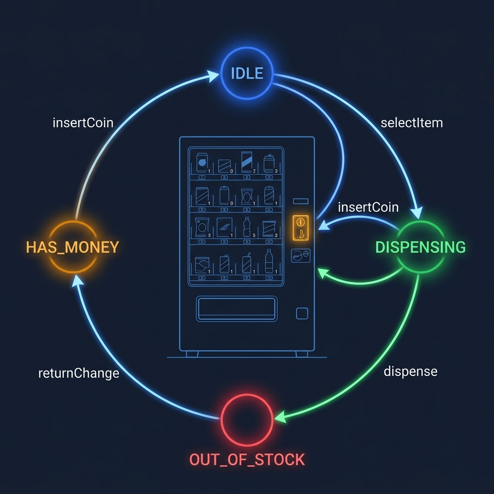
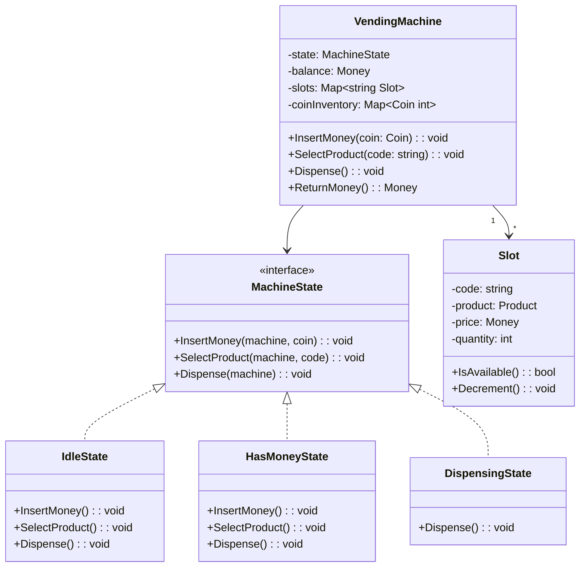
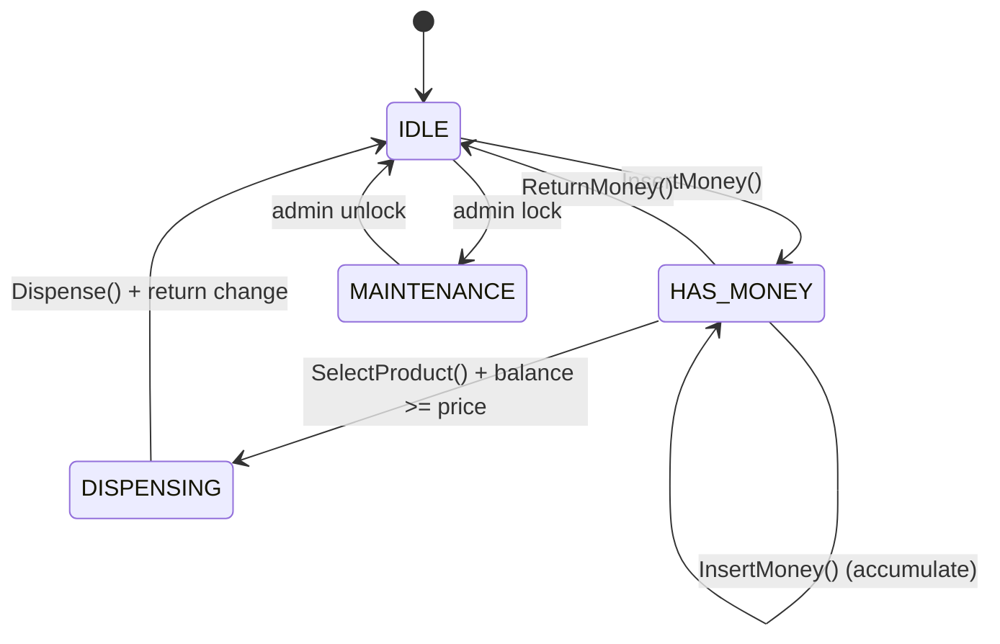

<!-- tags: ood-interview, oop, case-study, vending-machine -->
# Design a Vending Machine

> Pure state machine: slot inventory, payment flow, change calculation, the textbook State pattern interview.

| Aspect | Detail |
| --- | --- |
| **Difficulty** | ⭐⭐ |
| **Primary patterns** | State, Strategy |
| **Interview focus** | State pattern classic + inventory invariant + payment policy |

📅 Created: 2026-04-02 · 🔄 Updated: 2026-04-21 · ⏱️ 18 min read

---

## 1. DEFINE

You insert a $5 bill into the machine and select a $2.50 Coca-Cola. The machine owes you $2.50 in change — 10 quarters. But today the machine only has 8 quarters ($2.00). Should it: (a) reject the transaction and return $5? (b) sell anyway and short-change you $0.50? (c) display "exact change only"?

Vending machine is a classic OOD problem because its state machine is **pure**: 4 states, clear transitions, each state accepts only a subset of actions.

1. **State machine** — `IDLE → HAS_MONEY → DISPENSING → IDLE`. Each state rejects invalid actions (selecting product without inserting money → reject).
2. **Inventory tracking** — each slot has a product + quantity. Quantity = 0 → cannot select, even with money.
3. **Change calculation** — greedy algorithm: return change using the largest denomination possible. If not enough small coins for exact change → switch to "exact change mode."

| Variant | Description | Interview angle |
| --- | --- | --- |
| Core | Insert money, select product, dispense, return change | State machine + inventory |
| Follow-up: exact change | Machine cannot make exact change | Change calculation, coin inventory |
| Follow-up: card payment | Add NFC/card reader | Strategy pattern for payment |
| Follow-up: remote monitoring | Operator gets alert when stock low | Observer pattern |

### Core Objects

| Object | Role | Key Attributes | Key Methods |
| --- | --- | --- | --- |
| `VendingMachine` | Context (State pattern) | state, balance, coinInventory | `InsertMoney(coin)`, `SelectProduct(code)`, `Dispense()` |
| `MachineState` | State interface | — | `InsertMoney()`, `SelectProduct()`, `Dispense()` |
| `IdleState` | Concrete state | — | Accept InsertMoney only |
| `HasMoneyState` | Concrete state | — | Accept SelectProduct, InsertMoney, ReturnMoney |
| `DispensingState` | Concrete state | — | Dispense product + change, transition to Idle |
| `Slot` | Inventory unit | code, product, price, quantity | `IsAvailable()`, `Decrement()` |

---

## 2. VISUAL




State machine is the heart of vending machine. Class diagram shows structure, state diagram shows behavior.

### Class Diagram



*VendingMachine delegates every action to the current MachineState. Adding a new state (MaintenanceState) = adding 1 class, no changes to VendingMachine.*

### State Machine Flow



*HAS_MONEY → HAS_MONEY loop allows inserting multiple coins. DISPENSING auto-transitions to IDLE after dispense + return change.*

---

## 3. CODE

State diagram shows transitions clearly. The question: when a user presses SelectProduct() in IdleState, who rejects? The state object rejects — not VendingMachine.

### Problem 1: Basic — State pattern + VendingMachine context

> **Goal**: Each state accepts only valid actions, rejects invalid ones.
> **Approach**: State pattern — VendingMachine delegates to current MachineState.
> **Example**: IdleState: InsertMoney → OK, SelectProduct → error. HasMoneyState: SelectProduct → OK.
> **Complexity**: O(1) per state transition

```go
// vending_machine.go — State pattern with VendingMachine context
package vending

import (
	"errors"
	"fmt"
)

type Coin int

const (
	Quarter    Coin = 25
	Dollar     Coin = 100
	FiveDollar Coin = 500
)

type Product struct {
	Name  string
	Price int // cents
}

type Slot struct {
	Code     string
	Product  Product
	Quantity int
}

func (s *Slot) IsAvailable() bool { return s.Quantity > 0 }

func (s *Slot) Decrement() error {
	if s.Quantity <= 0 {
		return errors.New("slot empty")
	}
	s.Quantity--
	return nil
}

// --- State interface ---

type MachineState interface {
	InsertMoney(m *VendingMachine, coin Coin) error
	SelectProduct(m *VendingMachine, code string) error
	Dispense(m *VendingMachine) error
}

// --- VendingMachine context ---

type VendingMachine struct {
	state        MachineState
	balance      int
	slots        map[string]*Slot
	selectedSlot *Slot
}

func NewVendingMachine(slots map[string]*Slot) *VendingMachine {
	vm := &VendingMachine{slots: slots}
	vm.state = &IdleState{} // ✅ Initial state
	return vm
}

// Delegate to current state — VendingMachine does not decide.
func (vm *VendingMachine) InsertMoney(coin Coin) error {
	return vm.state.InsertMoney(vm, coin)
}

func (vm *VendingMachine) SelectProduct(code string) error {
	return vm.state.SelectProduct(vm, code)
}

func (vm *VendingMachine) Dispense() error {
	return vm.state.Dispense(vm)
}

func (vm *VendingMachine) setState(s MachineState) {
	vm.state = s
}

// --- Concrete states ---

type IdleState struct{}

func (s *IdleState) InsertMoney(m *VendingMachine, coin Coin) error {
	m.balance += int(coin)
	m.setState(&HasMoneyState{})
	return nil
}

func (s *IdleState) SelectProduct(m *VendingMachine, code string) error {
	return errors.New("insert money first") // ⚠️ Reject — wrong state
}

func (s *IdleState) Dispense(m *VendingMachine) error {
	return errors.New("nothing to dispense")
}

// ---

type HasMoneyState struct{}

func (s *HasMoneyState) InsertMoney(m *VendingMachine, coin Coin) error {
	m.balance += int(coin)
	return nil // stay in HasMoneyState, accumulate
}

func (s *HasMoneyState) SelectProduct(m *VendingMachine, code string) error {
	slot, ok := m.slots[code]
	if !ok {
		return fmt.Errorf("invalid product code: %s", code)
	}
	if !slot.IsAvailable() {
		return fmt.Errorf("product %s sold out", code)
	}
	if m.balance < slot.Product.Price {
		return fmt.Errorf("insufficient: have %d, need %d", m.balance, slot.Product.Price)
	}
	m.selectedSlot = slot
	m.setState(&DispensingState{})
	return nil
}

func (s *HasMoneyState) Dispense(m *VendingMachine) error {
	return errors.New("select product first")
}
```

> **Why State pattern instead of switch-case in VendingMachine?**
> Switch-case: `switch(state) { case IDLE: if action == insertMoney... }` — nested if/switch, every new state = modify all case blocks. State pattern: adding `MaintenanceState` = adding 1 class, VendingMachine unchanged. In the interview, say: "each state encapsulates its own transition rules."

State machine covered. But dispensing needs to return change — and change calculation is non-trivial when coin inventory is limited.

### Problem 2: Intermediate — Change calculation + Dispensing flow

> **Goal**: DispensingState calculates change, returns using largest coins possible.
> **Approach**: Greedy algorithm — iterate coins from largest to smallest, use as many as available.
> **Example**: Change = $2.50, coins = [quarter(40), dime(20)] → 10 quarters
> **Complexity**: O(C) where C = number of coin denominations

```go
// change_calculation.go — Greedy change + dispensing flow
package vending

import (
	"fmt"
	"sort"
)

type CoinInventory struct {
	Coins map[Coin]int // coin denomination → count
}

// CalculateChange returns coins to give back.
// ✅ Greedy — largest denomination first.
// ⚠️ If not enough small coins → signal "exact change only" mode.
func (ci *CoinInventory) CalculateChange(amount int) (map[Coin]int, error) {
	result := make(map[Coin]int)

	// Sort denominations descending
	denoms := make([]int, 0, len(ci.Coins))
	for coin := range ci.Coins {
		denoms = append(denoms, int(coin))
	}
	sort.Sort(sort.Reverse(sort.IntSlice(denoms)))

	remaining := amount
	for _, d := range denoms {
		coin := Coin(d)
		available := ci.Coins[coin]
		needed := remaining / int(coin)
		used := min(needed, available)

		if used > 0 {
			result[coin] = used
			remaining -= used * int(coin)
		}
	}

	if remaining > 0 {
		return nil, fmt.Errorf("cannot make exact change: %d cents remaining", remaining)
	}

	// ✅ Commit — deduct coins from inventory
	for coin, count := range result {
		ci.Coins[coin] -= count
	}
	return result, nil
}

func min(a, b int) int {
	if a < b {
		return a
	}
	return b
}
```

> **Why greedy instead of dynamic programming for change?**
> Vending machines use standard coin denominations (25, 10, 5, 1) — greedy is optimal. DP is only needed when denominations are arbitrary (e.g., 7, 3, 1). Interviewers usually want to hear you recognize when greedy is sufficient instead of over-engineering.

---

## 4. PITFALLS

Vending machine is the textbook State pattern problem — but coin inventory and concurrent access are where interviews go deeper.

| # | Severity | Mistake | Consequence | Fix |
| --- | --- | --- | --- | --- |
| 1 | 🔴 Fatal | Giant switch-case for all states | Spaghetti transitions, adding state = modify everywhere | State pattern — each state is 1 class |
| 2 | 🔴 Fatal | Dispense before checking inventory | Product = 0 but still dispenses → phantom delivery | `Slot.IsAvailable()` check in `HasMoneyState.SelectProduct()` |
| 3 | 🟡 Common | No payment strategy separation | Adding card/NFC = modifying core flow | PaymentStrategy interface |
| 4 | 🟡 Common | Change calculation ignores coin inventory | Machine promises $2.50 change but only has $2.00 in coins | `CalculateChange()` checks available coins |
| 5 | 🔵 Minor | Slot quantity can go negative | Inventory permanently corrupted | `Slot.Decrement()` guards qty >= 0 |

---

## 5. REF

| Resource | Type | Link | Note |
| --- | --- | --- | --- |
| Refactoring Guru — State Pattern | Reference | https://refactoring.guru/design-patterns/state | Vending machine = textbook State |
| ByteByteGo — Vending Machine OOD | Course | https://bytebytego.com/courses/object-oriented-design-interview | Full walkthrough |

---

## 6. RECOMMEND

Vending machine teaches pure State pattern — each state encapsulates its transition rules. Next: practice a more complex state machine or a different axis.

| Next topic | When | Why | File/Link |
| --- | --- | --- | --- |
| [Elevator System](./08-elevator-system.md) | Want multi-entity state machine | Elevator = state machine + dispatch coordination | Case study |
| [ATM System](./13-atm-system.md) | Want state + transaction | ATM = state machine + session auth + cash dispensing | Case study |
| [Parking Lot](./04-parking-lot.md) | Want simpler state machine review | Ticket state machine is one-directional | Case study |

---

## 7. QUICK REF

| If the interviewer asks | Signal | Your answer |
| --- | --- | --- |
| "Add card payment?" | OCP / payment extensibility | PaymentStrategy interface — CardPayment, CoinPayment |
| "Machine out of change?" | Edge case / coin inventory | "Exact change only" mode — check change availability BEFORE dispensing |
| "2 people press buttons simultaneously?" | Concurrency | VendingMachine per-machine lock — one transaction at a time |
| "Operator refills products?" | State extension | MaintenanceState — reject customer actions, accept admin actions |
| "Remote monitoring?" | Observer | VendingMachine emits events: LowStock, OutOfChange, ErrorState |

---

**Links**: [← Unix File Search](./06-unix-file-search.md) · [→ Elevator System](./08-elevator-system.md)
